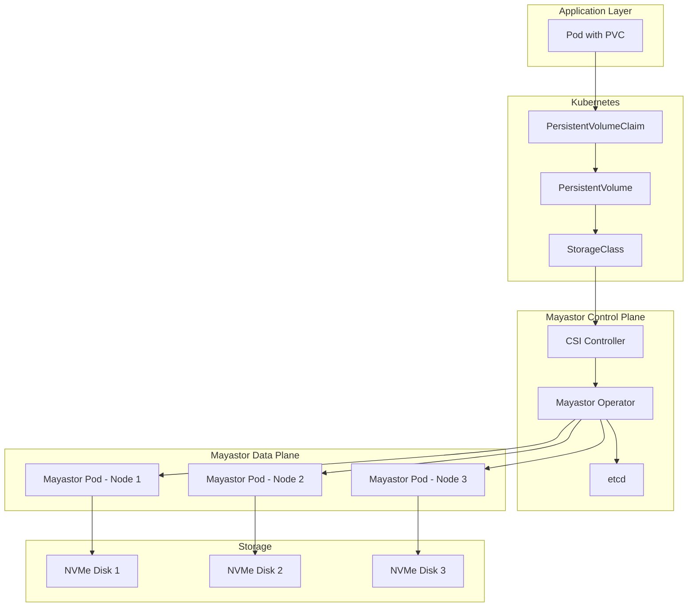
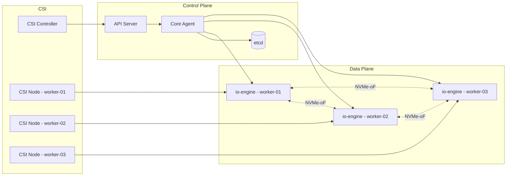
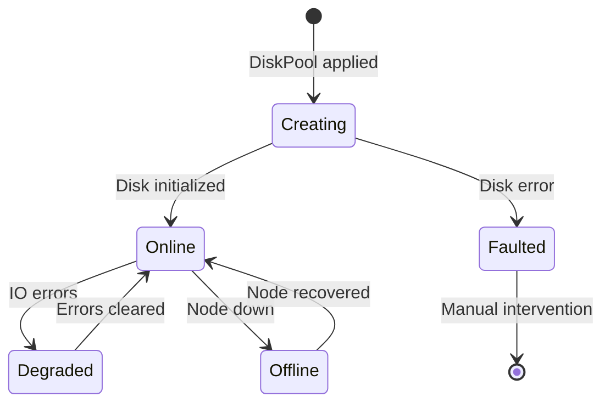
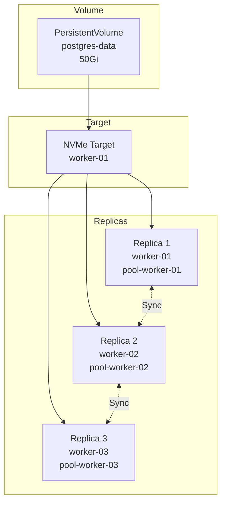
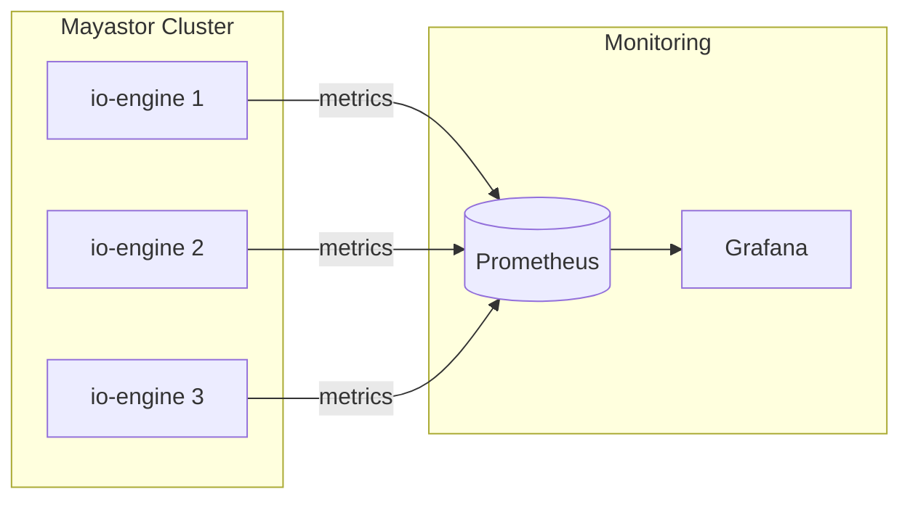
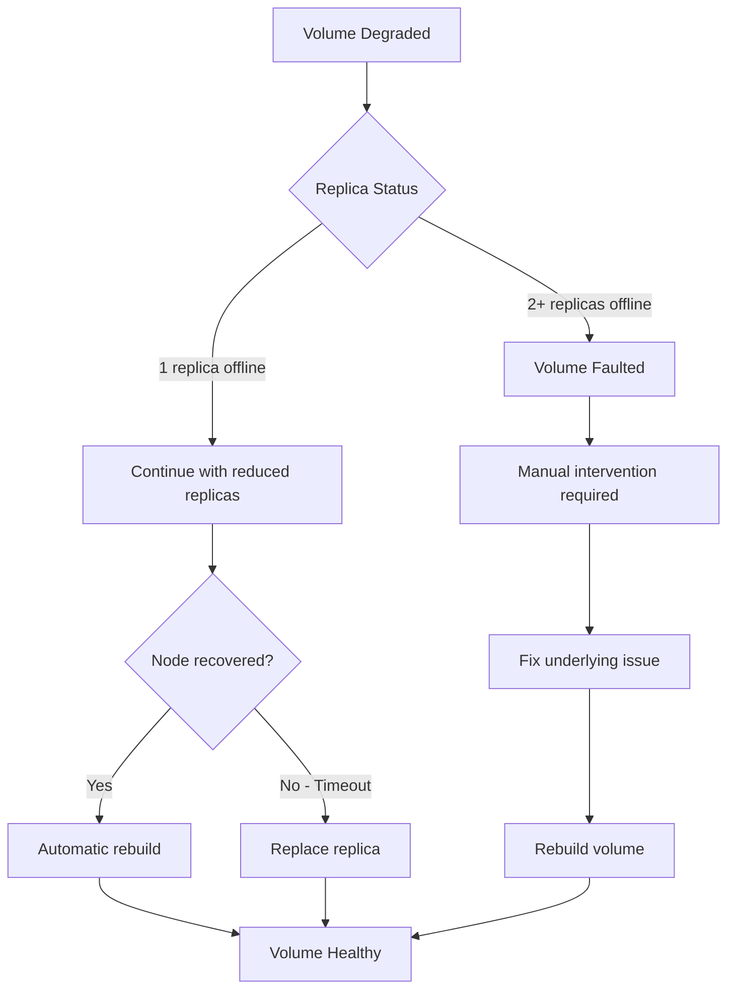

# How to Create OpenEBS Mayastor

Author: [nawazdhandala](https://github.com/nawazdhandala)

Tags: OpenEBS, Kubernetes, Storage, Mayastor

Description: A comprehensive guide to deploying and configuring OpenEBS Mayastor for high-performance, replicated storage in Kubernetes clusters. Learn how to set up NVMe-over-TCP storage pools, create storage classes, and run production workloads with enterprise-grade reliability.

---

OpenEBS Mayastor is a high-performance, container-native storage engine designed for Kubernetes workloads that demand both speed and reliability. Unlike traditional storage solutions, Mayastor leverages NVMe-over-TCP (NVMe-oF) to deliver near-native disk performance while providing synchronous replication across multiple nodes.

This guide walks you through deploying Mayastor from scratch, configuring storage pools, and running production workloads with replicated persistent volumes.

## What is Mayastor?

Mayastor is the next-generation storage engine in the OpenEBS project. It runs entirely in userspace using the Storage Performance Development Kit (SPDK) and provides block storage that can match the performance of local NVMe drives while offering data replication for high availability.



Key features of Mayastor include:

1. **NVMe-over-TCP transport:** Uses NVMe-oF for efficient network block storage with minimal CPU overhead.
2. **Synchronous replication:** Data is written to multiple nodes before acknowledging writes, ensuring durability.
3. **Thin provisioning:** Storage is allocated on demand, reducing waste.
4. **Snapshots and clones:** Create point-in-time copies of volumes for backup or testing.
5. **SPDK-powered:** Runs entirely in userspace for predictable, high-performance I/O.

## Prerequisites

Before deploying Mayastor, your cluster must meet specific requirements. Mayastor is designed for performance, which means it has stricter prerequisites than other OpenEBS engines.

### Hardware Requirements

| Component | Minimum | Recommended |
|-----------|---------|-------------|
| CPU cores per node | 4 | 8+ |
| RAM per node | 8 GB | 16 GB+ |
| NVMe disks | 1 per storage node | Multiple for redundancy |
| Network | 10 Gbps | 25 Gbps+ |

### Kubernetes Requirements

Mayastor requires Kubernetes 1.25 or later with the following:

```bash
# Check Kubernetes version
kubectl version --short

# Verify at least 3 nodes are available for HA
kubectl get nodes
```

### Node Preparation

Each node participating in Mayastor storage pools needs hugepages configured and certain kernel parameters set.

```bash
# Configure hugepages (2048 pages of 2MB each = 4GB)
# Add to /etc/sysctl.conf for persistence
echo "vm.nr_hugepages = 2048" | sudo tee -a /etc/sysctl.conf
sudo sysctl -p

# Verify hugepages
grep HugePages /proc/meminfo

# Expected output:
# HugePages_Total:    2048
# HugePages_Free:     2048
# HugePages_Rsvd:        0
# HugePages_Surp:        0
```

You also need to ensure the `nvme-tcp` kernel module is loaded:

```bash
# Load NVMe-TCP module
sudo modprobe nvme-tcp

# Persist across reboots
echo "nvme-tcp" | sudo tee /etc/modules-load.d/nvme-tcp.conf

# Verify module is loaded
lsmod | grep nvme_tcp
```

### Label Storage Nodes

Label the nodes that will provide storage for Mayastor:

```bash
# Label nodes for Mayastor io-engine
kubectl label node worker-01 openebs.io/engine=mayastor
kubectl label node worker-02 openebs.io/engine=mayastor
kubectl label node worker-03 openebs.io/engine=mayastor

# Verify labels
kubectl get nodes -l openebs.io/engine=mayastor
```

## Installing Mayastor

Mayastor is deployed using Helm. The installation creates the control plane components and data plane (io-engine) pods.

### Add the OpenEBS Helm Repository

```bash
# Add the OpenEBS Helm repository
helm repo add openebs https://openebs.github.io/openebs
helm repo update

# Search for available versions
helm search repo openebs/openebs --versions | head -10
```

### Install Mayastor

```bash
# Create the openebs namespace
kubectl create namespace openebs

# Install OpenEBS with Mayastor enabled
helm install openebs openebs/openebs \
    --namespace openebs \
    --set engines.replicated.mayastor.enabled=true \
    --set engines.local.lvm.enabled=false \
    --set engines.local.zfs.enabled=false

# Monitor the installation
kubectl -n openebs get pods -w
```

Wait until all pods reach the `Running` state:

```bash
# Check Mayastor pods status
kubectl -n openebs get pods -l app.kubernetes.io/component=io-engine

# Expected output:
# NAME                       READY   STATUS    RESTARTS   AGE
# openebs-io-engine-7j8kp    2/2     Running   0          3m
# openebs-io-engine-9x2mp    2/2     Running   0          3m
# openebs-io-engine-b4qrn    2/2     Running   0          3m
```

### Verify Installation

```bash
# Check all OpenEBS components
kubectl -n openebs get pods

# Verify CSI driver registration
kubectl get csinodes

# Check Mayastor REST API is accessible
kubectl -n openebs get svc openebs-api-rest
```

## Architecture Deep Dive

Understanding Mayastor's architecture helps with troubleshooting and capacity planning.



**Control Plane Components:**

- **API Server:** REST API for managing pools, volumes, and replicas
- **Core Agent:** Orchestrates volume operations and maintains cluster state
- **etcd:** Stores persistent configuration and state

**Data Plane Components:**

- **io-engine:** SPDK-based process that manages local disks and serves NVMe-oF targets
- **CSI Node:** Mounts volumes to pods on each node

## Creating Disk Pools

Disk pools are collections of disks on a node that Mayastor uses to provision volumes. Each pool is associated with a single node.

### Identify Available Disks

First, find the available disks on your storage nodes:

```bash
# List block devices on a specific node
kubectl mayastor get block-devices worker-01

# Alternative: SSH to node and list disks
ssh worker-01 "lsblk -d -o NAME,SIZE,TYPE,MODEL"

# Example output:
# NAME    SIZE TYPE MODEL
# sda     100G disk VBOX_HARDDISK
# nvme0n1 500G disk Samsung SSD 980 PRO
# nvme1n1 500G disk Samsung SSD 980 PRO
```

### Create Disk Pools

Create a DiskPool resource for each storage node:

```yaml
# disk-pools.yaml
apiVersion: openebs.io/v1beta2
kind: DiskPool
metadata:
  name: pool-worker-01
  namespace: openebs
spec:
  node: worker-01
  disks:
    - uring:///dev/nvme1n1
---
apiVersion: openebs.io/v1beta2
kind: DiskPool
metadata:
  name: pool-worker-02
  namespace: openebs
spec:
  node: worker-02
  disks:
    - uring:///dev/nvme1n1
---
apiVersion: openebs.io/v1beta2
kind: DiskPool
metadata:
  name: pool-worker-03
  namespace: openebs
spec:
  node: worker-03
  disks:
    - uring:///dev/nvme1n1
```

Apply the configuration:

```bash
# Create the disk pools
kubectl apply -f disk-pools.yaml

# Verify pools are created and online
kubectl get diskpools -n openebs

# Expected output:
# NAME             NODE        STATE    POOL_STATUS   CAPACITY      USED   AVAILABLE
# pool-worker-01   worker-01   Created  Online        499963174912  0      499963174912
# pool-worker-02   worker-02   Created  Online        499963174912  0      499963174912
# pool-worker-03   worker-03   Created  Online        499963174912  0      499963174912
```

### Pool Status States

Understanding pool states helps with troubleshooting:



## Creating Storage Classes

Storage classes define the parameters for provisioning volumes. Create different classes for various performance and redundancy requirements.

### Standard Replicated Storage Class

```yaml
# mayastor-storageclass.yaml
apiVersion: storage.k8s.io/v1
kind: StorageClass
metadata:
  name: mayastor-replicated
provisioner: io.openebs.csi-mayastor
parameters:
  # Number of data replicas (1, 2, or 3)
  repl: "3"
  # Storage protocol
  protocol: nvmf
  # I/O timeout in seconds
  ioTimeout: "30"
  # Enable thin provisioning
  thin: "true"
volumeBindingMode: Immediate
reclaimPolicy: Delete
allowVolumeExpansion: true
```

### High-Performance Local Storage Class

For workloads that prioritize performance over redundancy:

```yaml
# mayastor-local-storageclass.yaml
apiVersion: storage.k8s.io/v1
kind: StorageClass
metadata:
  name: mayastor-local
provisioner: io.openebs.csi-mayastor
parameters:
  repl: "1"
  protocol: nvmf
  ioTimeout: "30"
  thin: "true"
  # Prefer local replica to reduce network latency
  local: "true"
volumeBindingMode: WaitForFirstConsumer
reclaimPolicy: Delete
allowVolumeExpansion: true
```

### Apply Storage Classes

```bash
# Apply storage classes
kubectl apply -f mayastor-storageclass.yaml
kubectl apply -f mayastor-local-storageclass.yaml

# Verify storage classes
kubectl get sc | grep mayastor

# Set as default (optional)
kubectl patch storageclass mayastor-replicated \
    -p '{"metadata": {"annotations":{"storageclass.kubernetes.io/is-default-class":"true"}}}'
```

## Deploying a Stateful Application

Let us deploy a PostgreSQL database with Mayastor storage to demonstrate real-world usage.

```yaml
# postgres-mayastor.yaml
apiVersion: v1
kind: Namespace
metadata:
  name: database
---
apiVersion: v1
kind: Secret
metadata:
  name: postgres-credentials
  namespace: database
type: Opaque
stringData:
  POSTGRES_USER: admin
  POSTGRES_PASSWORD: securepassword123
  POSTGRES_DB: appdata
---
apiVersion: v1
kind: PersistentVolumeClaim
metadata:
  name: postgres-data
  namespace: database
spec:
  storageClassName: mayastor-replicated
  accessModes:
    - ReadWriteOnce
  resources:
    requests:
      storage: 50Gi
---
apiVersion: apps/v1
kind: StatefulSet
metadata:
  name: postgres
  namespace: database
spec:
  serviceName: postgres
  replicas: 1
  selector:
    matchLabels:
      app: postgres
  template:
    metadata:
      labels:
        app: postgres
    spec:
      containers:
        - name: postgres
          image: postgres:16
          ports:
            - containerPort: 5432
          envFrom:
            - secretRef:
                name: postgres-credentials
          volumeMounts:
            - name: data
              mountPath: /var/lib/postgresql/data
          resources:
            requests:
              memory: "1Gi"
              cpu: "500m"
            limits:
              memory: "2Gi"
              cpu: "2000m"
          livenessProbe:
            exec:
              command:
                - pg_isready
                - -U
                - admin
            initialDelaySeconds: 30
            periodSeconds: 10
          readinessProbe:
            exec:
              command:
                - pg_isready
                - -U
                - admin
            initialDelaySeconds: 5
            periodSeconds: 5
      volumes:
        - name: data
          persistentVolumeClaim:
            claimName: postgres-data
---
apiVersion: v1
kind: Service
metadata:
  name: postgres
  namespace: database
spec:
  selector:
    app: postgres
  ports:
    - port: 5432
      targetPort: 5432
  type: ClusterIP
```

Deploy the application:

```bash
# Apply the PostgreSQL deployment
kubectl apply -f postgres-mayastor.yaml

# Watch the PVC and pod status
kubectl -n database get pvc -w
kubectl -n database get pods -w

# Verify the volume is bound
kubectl -n database describe pvc postgres-data
```

## Managing Mayastor Volumes

### List Volumes

```bash
# List all Mayastor volumes
kubectl get pv | grep mayastor

# Get detailed volume information
kubectl mayastor get volumes

# Example output:
# ID                                     REPLICAS  TARGET         SIZE        STATE     THIN
# 3fa85f64-5717-4562-b3fc-2c963f66afa6  3         nvmf://...     53687091200 Online    true
```

### View Volume Replicas

```bash
# List replicas for a volume
kubectl mayastor get volume-replica-topologies

# Check replica status
kubectl mayastor get replicas
```

### Volume Topology



## Volume Snapshots

Mayastor supports CSI volume snapshots for backup and cloning.

### Create a VolumeSnapshotClass

```yaml
# snapshot-class.yaml
apiVersion: snapshot.storage.k8s.io/v1
kind: VolumeSnapshotClass
metadata:
  name: mayastor-snapshot
driver: io.openebs.csi-mayastor
deletionPolicy: Delete
```

### Take a Snapshot

```yaml
# postgres-snapshot.yaml
apiVersion: snapshot.storage.k8s.io/v1
kind: VolumeSnapshot
metadata:
  name: postgres-snapshot-001
  namespace: database
spec:
  volumeSnapshotClassName: mayastor-snapshot
  source:
    persistentVolumeClaimName: postgres-data
```

```bash
# Create snapshot class and snapshot
kubectl apply -f snapshot-class.yaml
kubectl apply -f postgres-snapshot.yaml

# Check snapshot status
kubectl -n database get volumesnapshot

# Expected output:
# NAME                    READYTOUSE   SOURCEPVC       RESTORESIZE   AGE
# postgres-snapshot-001   true         postgres-data   50Gi          30s
```

### Restore from Snapshot

```yaml
# postgres-restore.yaml
apiVersion: v1
kind: PersistentVolumeClaim
metadata:
  name: postgres-data-restored
  namespace: database
spec:
  storageClassName: mayastor-replicated
  accessModes:
    - ReadWriteOnce
  resources:
    requests:
      storage: 50Gi
  dataSource:
    name: postgres-snapshot-001
    kind: VolumeSnapshot
    apiGroup: snapshot.storage.k8s.io
```

## Performance Tuning

### I/O Scheduler Configuration

For NVMe disks, use the `none` or `mq-deadline` scheduler:

```bash
# Check current scheduler
cat /sys/block/nvme1n1/queue/scheduler

# Set to none for NVMe
echo none | sudo tee /sys/block/nvme1n1/queue/scheduler
```

### Hugepages Sizing

Calculate hugepages based on pool size and workload:

```bash
# Formula: (pool_size_GB / 2) + 512 pages for overhead
# For a 500GB pool: (500 / 2) + 512 = 762 pages minimum

# Check current allocation
grep HugePages /proc/meminfo

# Increase if needed
echo 1024 | sudo tee /proc/sys/vm/nr_hugepages
```

### Network Optimization

For high-performance workloads, tune network settings:

```bash
# Increase socket buffer sizes
sudo sysctl -w net.core.rmem_max=16777216
sudo sysctl -w net.core.wmem_max=16777216
sudo sysctl -w net.ipv4.tcp_rmem="4096 87380 16777216"
sudo sysctl -w net.ipv4.tcp_wmem="4096 65536 16777216"

# Enable TCP BBR congestion control
sudo modprobe tcp_bbr
sudo sysctl -w net.ipv4.tcp_congestion_control=bbr
```

## Monitoring Mayastor

### Prometheus Metrics

Mayastor exposes metrics for Prometheus. Here is a ServiceMonitor configuration:

```yaml
# mayastor-servicemonitor.yaml
apiVersion: monitoring.coreos.com/v1
kind: ServiceMonitor
metadata:
  name: mayastor-metrics
  namespace: openebs
spec:
  selector:
    matchLabels:
      app.kubernetes.io/component: io-engine
  endpoints:
    - port: metrics
      interval: 15s
      path: /metrics
```

### Key Metrics to Monitor

| Metric | Description |
|--------|-------------|
| `mayastor_pool_total_size_bytes` | Total pool capacity |
| `mayastor_pool_used_size_bytes` | Used pool capacity |
| `mayastor_volume_read_bytes_total` | Total bytes read |
| `mayastor_volume_write_bytes_total` | Total bytes written |
| `mayastor_volume_read_ops_total` | Total read operations |
| `mayastor_volume_write_ops_total` | Total write operations |
| `mayastor_volume_read_latency_seconds` | Read latency histogram |
| `mayastor_volume_write_latency_seconds` | Write latency histogram |

### Grafana Dashboard



Import the official Mayastor dashboard from Grafana (Dashboard ID: 19676) or use the JSON from the OpenEBS repository.

## Troubleshooting

### Common Issues

**Pool not coming online:**

```bash
# Check io-engine logs
kubectl -n openebs logs -l app.kubernetes.io/component=io-engine

# Verify disk is available
kubectl mayastor get block-devices <node-name>

# Check hugepages
kubectl -n openebs exec -it <io-engine-pod> -- cat /proc/meminfo | grep HugePages
```

**Volume stuck in Pending:**

```bash
# Check events
kubectl describe pvc <pvc-name>

# Verify pool capacity
kubectl get diskpools -n openebs

# Check CSI driver logs
kubectl -n openebs logs -l app=openebs-csi-controller
```

**Performance issues:**

```bash
# Check NVMe device health
sudo nvme smart-log /dev/nvme1n1

# Monitor IOPS and latency
kubectl mayastor get volumes --output wide

# Verify network connectivity between nodes
kubectl -n openebs exec -it <io-engine-pod> -- ping <other-node-ip>
```

### Volume Recovery Flow



## Best Practices

1. **Use dedicated disks:** Do not share disks between Mayastor and the operating system.

2. **Size pools appropriately:** Leave 10-20% free space for snapshots and rebuilds.

3. **Match replica count to failure domains:** Use 3 replicas across 3 availability zones for production.

4. **Monitor proactively:** Set alerts for pool usage, replica health, and I/O latency.

5. **Test failover regularly:** Simulate node failures to verify recovery procedures.

6. **Keep versions aligned:** Ensure Mayastor version matches across all nodes.

7. **Document your topology:** Maintain records of which disks belong to which pools.

## Conclusion

OpenEBS Mayastor provides enterprise-grade storage for Kubernetes with the performance of local NVMe and the reliability of synchronous replication. By following this guide, you have learned how to:

- Prepare nodes with hugepages and kernel modules
- Deploy Mayastor using Helm
- Create disk pools and storage classes
- Run stateful workloads with replicated storage
- Monitor and troubleshoot your storage infrastructure

For production deployments, combine Mayastor with proper monitoring, regular backup testing, and capacity planning to ensure your stateful applications have the storage foundation they need.

## Additional Resources

- [OpenEBS Documentation](https://openebs.io/docs)
- [Mayastor GitHub Repository](https://github.com/openebs/mayastor)
- [SPDK Documentation](https://spdk.io/doc/)
- [NVMe-oF Specification](https://nvmexpress.org/specifications/)
