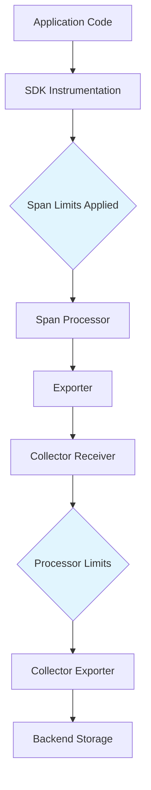
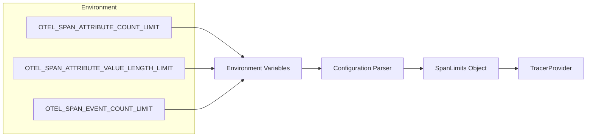
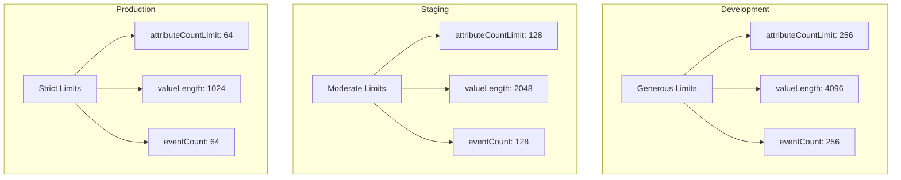

# How to Create OpenTelemetry Attribute Limits

Author: [nawazdhandala](https://github.com/nawazdhandala)

Tags: OpenTelemetry, Configuration, Tracing, Performance

Description: A comprehensive guide to creating OpenTelemetry attribute limits from scratch, covering the architecture, implementation patterns across multiple languages, and strategies for building production-ready telemetry pipelines with robust limit enforcement.

---

OpenTelemetry attribute limits protect your observability pipeline from unbounded telemetry data that can exhaust memory, inflate storage costs, and degrade query performance. This guide walks through creating attribute limits from the ground up, explaining the architecture and providing practical implementations you can adapt for your environment.

## Understanding Attribute Limits Architecture

Before creating limits, you need to understand how attributes flow through the OpenTelemetry pipeline and where limits can be applied.



Limits can be enforced at multiple layers:

1. **SDK Level**: Prevents oversized spans from being created
2. **Collector Level**: Filters or transforms data before export
3. **Backend Level**: Rejects or truncates data on ingestion

Creating limits at the SDK level is most efficient since it prevents wasted network and processing resources.

## Creating Basic Attribute Limits

Every OpenTelemetry SDK provides a mechanism to define span limits. Here is how to create them in each major language.

### Node.js / TypeScript

Create a limits configuration object and pass it to your tracer provider:

```typescript
import { NodeSDK } from '@opentelemetry/sdk-node';
import { Resource } from '@opentelemetry/resources';
import { OTLPTraceExporter } from '@opentelemetry/exporter-trace-otlp-http';
import { SpanLimits } from '@opentelemetry/sdk-trace-base';

// Define your attribute limits
const spanLimits: SpanLimits = {
  // Maximum number of attributes allowed on a span
  attributeCountLimit: 128,

  // Maximum character length for string attribute values
  attributeValueLengthLimit: 1024,

  // Maximum number of events that can be added to a span
  eventCountLimit: 128,

  // Maximum number of links between spans
  linkCountLimit: 128,

  // Maximum attributes per span event
  attributePerEventCountLimit: 32,

  // Maximum attributes per span link
  attributePerLinkCountLimit: 32,
};

const sdk = new NodeSDK({
  resource: new Resource({
    'service.name': 'payment-service',
    'service.version': '1.0.0',
  }),
  traceExporter: new OTLPTraceExporter({
    url: process.env.OTEL_EXPORTER_OTLP_ENDPOINT,
  }),
  spanLimits: spanLimits,
});

sdk.start();
console.log('OpenTelemetry initialized with attribute limits');
```

### Python

Python uses the `SpanLimits` class to define constraints:

```python
from opentelemetry import trace
from opentelemetry.sdk.trace import TracerProvider, SpanLimits
from opentelemetry.sdk.trace.export import BatchSpanProcessor
from opentelemetry.exporter.otlp.proto.grpc.trace_exporter import OTLPSpanExporter
from opentelemetry.sdk.resources import Resource

# Create span limits
span_limits = SpanLimits(
    # Maximum attributes per span
    max_attributes=128,

    # Maximum length of string attribute values
    max_attribute_length=1024,

    # Maximum events per span
    max_events=128,

    # Maximum links per span
    max_links=128,

    # Maximum attributes per event
    max_event_attributes=32,

    # Maximum attributes per link
    max_link_attributes=32,
)

# Create the tracer provider with limits
resource = Resource.create({
    "service.name": "payment-service",
    "service.version": "1.0.0",
})

provider = TracerProvider(
    resource=resource,
    span_limits=span_limits,
)

# Add the exporter
exporter = OTLPSpanExporter()
provider.add_span_processor(BatchSpanProcessor(exporter))

# Set as global provider
trace.set_tracer_provider(provider)

print("OpenTelemetry initialized with attribute limits")
```

### Go

Go uses a builder pattern for creating span limits:

```go
package main

import (
	"context"
	"log"

	"go.opentelemetry.io/otel"
	"go.opentelemetry.io/otel/exporters/otlp/otlptrace/otlptracehttp"
	"go.opentelemetry.io/otel/sdk/resource"
	sdktrace "go.opentelemetry.io/otel/sdk/trace"
	semconv "go.opentelemetry.io/otel/semconv/v1.21.0"
)

func initTracer() func() {
	ctx := context.Background()

	// Create the OTLP exporter
	exporter, err := otlptracehttp.New(ctx)
	if err != nil {
		log.Fatalf("failed to create exporter: %v", err)
	}

	// Define span limits
	spanLimits := sdktrace.NewSpanLimits()
	spanLimits.AttributeCountLimit = 128
	spanLimits.AttributeValueLengthLimit = 1024
	spanLimits.EventCountLimit = 128
	spanLimits.LinkCountLimit = 128
	spanLimits.AttributePerEventCountLimit = 32
	spanLimits.AttributePerLinkCountLimit = 32

	// Create the tracer provider with limits
	tp := sdktrace.NewTracerProvider(
		sdktrace.WithBatcher(exporter),
		sdktrace.WithResource(resource.NewWithAttributes(
			semconv.SchemaURL,
			semconv.ServiceName("payment-service"),
			semconv.ServiceVersion("1.0.0"),
		)),
		sdktrace.WithSpanLimits(spanLimits),
	)

	otel.SetTracerProvider(tp)

	return func() {
		if err := tp.Shutdown(ctx); err != nil {
			log.Printf("Error shutting down tracer provider: %v", err)
		}
	}
}

func main() {
	cleanup := initTracer()
	defer cleanup()

	log.Println("OpenTelemetry initialized with attribute limits")
}
```

### Java

Java provides a fluent builder for span limits:

```java
package com.example.telemetry;

import io.opentelemetry.api.OpenTelemetry;
import io.opentelemetry.api.common.Attributes;
import io.opentelemetry.exporter.otlp.trace.OtlpGrpcSpanExporter;
import io.opentelemetry.sdk.OpenTelemetrySdk;
import io.opentelemetry.sdk.resources.Resource;
import io.opentelemetry.sdk.trace.SdkTracerProvider;
import io.opentelemetry.sdk.trace.SpanLimits;
import io.opentelemetry.sdk.trace.export.BatchSpanProcessor;
import io.opentelemetry.semconv.resource.attributes.ResourceAttributes;

public class TelemetryConfig {

    public static OpenTelemetry createOpenTelemetry() {
        // Define span limits
        SpanLimits spanLimits = SpanLimits.builder()
            // Maximum attributes per span
            .setMaxNumberOfAttributes(128)
            // Maximum length of string attribute values
            .setMaxAttributeValueLength(1024)
            // Maximum events per span
            .setMaxNumberOfEvents(128)
            // Maximum links per span
            .setMaxNumberOfLinks(128)
            // Maximum attributes per event
            .setMaxNumberOfAttributesPerEvent(32)
            // Maximum attributes per link
            .setMaxNumberOfAttributesPerLink(32)
            .build();

        // Create the exporter
        OtlpGrpcSpanExporter exporter = OtlpGrpcSpanExporter.builder()
            .setEndpoint("http://localhost:4317")
            .build();

        // Create the tracer provider with limits
        SdkTracerProvider tracerProvider = SdkTracerProvider.builder()
            .setResource(Resource.create(Attributes.of(
                ResourceAttributes.SERVICE_NAME, "payment-service",
                ResourceAttributes.SERVICE_VERSION, "1.0.0"
            )))
            .setSpanLimits(spanLimits)
            .addSpanProcessor(BatchSpanProcessor.builder(exporter).build())
            .build();

        return OpenTelemetrySdk.builder()
            .setTracerProvider(tracerProvider)
            .buildAndRegisterGlobal();
    }
}
```

## Creating Environment-Based Limits

For consistent configuration across services, create limits using environment variables:



### Node.js Configuration Parser

```typescript
interface LimitsConfig {
  attributeCountLimit: number;
  attributeValueLengthLimit: number;
  eventCountLimit: number;
  linkCountLimit: number;
  attributePerEventCountLimit: number;
  attributePerLinkCountLimit: number;
}

function createLimitsFromEnv(): LimitsConfig {
  return {
    attributeCountLimit: parseInt(
      process.env.OTEL_SPAN_ATTRIBUTE_COUNT_LIMIT || '128',
      10
    ),
    attributeValueLengthLimit: parseInt(
      process.env.OTEL_SPAN_ATTRIBUTE_VALUE_LENGTH_LIMIT || '1024',
      10
    ),
    eventCountLimit: parseInt(
      process.env.OTEL_SPAN_EVENT_COUNT_LIMIT || '128',
      10
    ),
    linkCountLimit: parseInt(
      process.env.OTEL_SPAN_LINK_COUNT_LIMIT || '128',
      10
    ),
    attributePerEventCountLimit: parseInt(
      process.env.OTEL_EVENT_ATTRIBUTE_COUNT_LIMIT || '32',
      10
    ),
    attributePerLinkCountLimit: parseInt(
      process.env.OTEL_LINK_ATTRIBUTE_COUNT_LIMIT || '32',
      10
    ),
  };
}

// Validate limits are within reasonable bounds
function validateLimits(limits: LimitsConfig): LimitsConfig {
  const MIN_ATTRIBUTES = 32;
  const MAX_ATTRIBUTES = 1024;
  const MIN_VALUE_LENGTH = 256;
  const MAX_VALUE_LENGTH = 65536;

  if (limits.attributeCountLimit < MIN_ATTRIBUTES) {
    console.warn(
      `attributeCountLimit ${limits.attributeCountLimit} is below minimum, using ${MIN_ATTRIBUTES}`
    );
    limits.attributeCountLimit = MIN_ATTRIBUTES;
  }

  if (limits.attributeCountLimit > MAX_ATTRIBUTES) {
    console.warn(
      `attributeCountLimit ${limits.attributeCountLimit} exceeds maximum, using ${MAX_ATTRIBUTES}`
    );
    limits.attributeCountLimit = MAX_ATTRIBUTES;
  }

  if (limits.attributeValueLengthLimit < MIN_VALUE_LENGTH) {
    console.warn(
      `attributeValueLengthLimit ${limits.attributeValueLengthLimit} is below minimum, using ${MIN_VALUE_LENGTH}`
    );
    limits.attributeValueLengthLimit = MIN_VALUE_LENGTH;
  }

  if (limits.attributeValueLengthLimit > MAX_VALUE_LENGTH) {
    console.warn(
      `attributeValueLengthLimit ${limits.attributeValueLengthLimit} exceeds maximum, using ${MAX_VALUE_LENGTH}`
    );
    limits.attributeValueLengthLimit = MAX_VALUE_LENGTH;
  }

  return limits;
}

// Usage
const limits = validateLimits(createLimitsFromEnv());
```

### Docker Compose Configuration

```yaml
version: '3.8'

services:
  payment-service:
    image: payment-service:latest
    environment:
      - OTEL_SERVICE_NAME=payment-service
      - OTEL_EXPORTER_OTLP_ENDPOINT=http://collector:4318
      - OTEL_SPAN_ATTRIBUTE_COUNT_LIMIT=128
      - OTEL_SPAN_ATTRIBUTE_VALUE_LENGTH_LIMIT=1024
      - OTEL_SPAN_EVENT_COUNT_LIMIT=64
      - OTEL_SPAN_LINK_COUNT_LIMIT=32
      - OTEL_EVENT_ATTRIBUTE_COUNT_LIMIT=32
      - OTEL_LINK_ATTRIBUTE_COUNT_LIMIT=16

  order-service:
    image: order-service:latest
    environment:
      - OTEL_SERVICE_NAME=order-service
      - OTEL_EXPORTER_OTLP_ENDPOINT=http://collector:4318
      # More restrictive limits for high-volume service
      - OTEL_SPAN_ATTRIBUTE_COUNT_LIMIT=64
      - OTEL_SPAN_ATTRIBUTE_VALUE_LENGTH_LIMIT=512
      - OTEL_SPAN_EVENT_COUNT_LIMIT=32
      - OTEL_SPAN_LINK_COUNT_LIMIT=16
```

## Creating Custom Limit Enforcement

Sometimes you need more sophisticated limit enforcement than the SDK provides. Here is how to create custom limit handlers.

### Custom Attribute Validator

```typescript
import { Span, SpanStatusCode } from '@opentelemetry/api';

interface AttributePolicy {
  maxLength: number;
  allowedTypes: string[];
  blocklist: string[];
  sensitivePatterns: RegExp[];
}

const defaultPolicy: AttributePolicy = {
  maxLength: 1024,
  allowedTypes: ['string', 'number', 'boolean'],
  blocklist: ['password', 'secret', 'token', 'api_key', 'authorization'],
  sensitivePatterns: [
    /\b[A-Za-z0-9._%+-]+@[A-Za-z0-9.-]+\.[A-Z|a-z]{2,}\b/,  // Email
    /\b\d{3}-\d{2}-\d{4}\b/,  // SSN
    /\b\d{16}\b/,  // Credit card
  ],
};

class AttributeValidator {
  private policy: AttributePolicy;
  private violations: Map<string, number> = new Map();

  constructor(policy: Partial<AttributePolicy> = {}) {
    this.policy = { ...defaultPolicy, ...policy };
  }

  validateAndSet(
    span: Span,
    key: string,
    value: unknown
  ): boolean {
    // Check blocklist
    if (this.isBlocklisted(key)) {
      this.recordViolation('blocklisted_key');
      return false;
    }

    // Check type
    const valueType = typeof value;
    if (!this.policy.allowedTypes.includes(valueType)) {
      this.recordViolation('invalid_type');
      return false;
    }

    // Check for sensitive data
    if (typeof value === 'string' && this.containsSensitiveData(value)) {
      this.recordViolation('sensitive_data');
      span.setAttribute(key, '[REDACTED]');
      span.setAttribute(`${key}.redacted`, true);
      return true;
    }

    // Apply length limit
    if (typeof value === 'string' && value.length > this.policy.maxLength) {
      const truncated = value.substring(0, this.policy.maxLength);
      span.setAttribute(key, truncated);
      span.setAttribute(`${key}.truncated`, true);
      span.setAttribute(`${key}.original_length`, value.length);
      this.recordViolation('truncated');
      return true;
    }

    span.setAttribute(key, value as string | number | boolean);
    return true;
  }

  private isBlocklisted(key: string): boolean {
    const lowerKey = key.toLowerCase();
    return this.policy.blocklist.some(blocked =>
      lowerKey.includes(blocked)
    );
  }

  private containsSensitiveData(value: string): boolean {
    return this.policy.sensitivePatterns.some(pattern =>
      pattern.test(value)
    );
  }

  private recordViolation(type: string): void {
    const count = this.violations.get(type) || 0;
    this.violations.set(type, count + 1);
  }

  getViolationStats(): Record<string, number> {
    return Object.fromEntries(this.violations);
  }
}

// Usage
const validator = new AttributeValidator({
  maxLength: 512,
  blocklist: ['password', 'secret', 'token', 'ssn'],
});

// In your instrumentation code
const span = tracer.startSpan('process-order');
validator.validateAndSet(span, 'order.id', 'ORD-12345');
validator.validateAndSet(span, 'customer.email', 'user@example.com');  // Will be redacted
validator.validateAndSet(span, 'user.password', 'secret123');  // Will be blocked
```

### Custom Span Processor with Limits

Create a span processor that enforces limits before export:

```typescript
import {
  SpanProcessor,
  ReadableSpan,
  Span,
} from '@opentelemetry/sdk-trace-base';
import { Context } from '@opentelemetry/api';

interface ProcessorLimits {
  maxAttributeCount: number;
  maxAttributeValueLength: number;
  maxEventCount: number;
  priorityAttributes: string[];
}

class LimitEnforcingSpanProcessor implements SpanProcessor {
  private delegate: SpanProcessor;
  private limits: ProcessorLimits;
  private droppedAttributes: number = 0;
  private truncatedValues: number = 0;

  constructor(delegate: SpanProcessor, limits: ProcessorLimits) {
    this.delegate = delegate;
    this.limits = limits;
  }

  onStart(span: Span, parentContext: Context): void {
    this.delegate.onStart(span, parentContext);
  }

  onEnd(span: ReadableSpan): void {
    const processed = this.enforceLimit(span);
    this.delegate.onEnd(processed);
  }

  private enforceLimit(span: ReadableSpan): ReadableSpan {
    const attributes = span.attributes;
    const attributeKeys = Object.keys(attributes);

    // Check if we need to drop attributes
    if (attributeKeys.length > this.limits.maxAttributeCount) {
      const sortedKeys = this.sortByPriority(attributeKeys);
      const keysToKeep = sortedKeys.slice(0, this.limits.maxAttributeCount);
      const keysToRemove = sortedKeys.slice(this.limits.maxAttributeCount);

      this.droppedAttributes += keysToRemove.length;

      // Create a new attributes object with only the kept keys
      const newAttributes: Record<string, unknown> = {};
      for (const key of keysToKeep) {
        let value = attributes[key];

        // Truncate string values
        if (
          typeof value === 'string' &&
          value.length > this.limits.maxAttributeValueLength
        ) {
          value = value.substring(0, this.limits.maxAttributeValueLength);
          this.truncatedValues++;
        }

        newAttributes[key] = value;
      }

      // Add metadata about dropped attributes
      newAttributes['otel.dropped_attributes_count'] = keysToRemove.length;

      // Return a modified span (implementation depends on your needs)
      return this.createModifiedSpan(span, newAttributes);
    }

    return span;
  }

  private sortByPriority(keys: string[]): string[] {
    return keys.sort((a, b) => {
      const aPriority = this.limits.priorityAttributes.includes(a) ? 0 : 1;
      const bPriority = this.limits.priorityAttributes.includes(b) ? 0 : 1;
      return aPriority - bPriority;
    });
  }

  private createModifiedSpan(
    original: ReadableSpan,
    newAttributes: Record<string, unknown>
  ): ReadableSpan {
    // Create a proxy or modified copy of the span
    // Implementation varies based on your requirements
    return {
      ...original,
      attributes: newAttributes as ReadableSpan['attributes'],
    } as ReadableSpan;
  }

  forceFlush(): Promise<void> {
    return this.delegate.forceFlush();
  }

  shutdown(): Promise<void> {
    console.log(`Dropped ${this.droppedAttributes} attributes, truncated ${this.truncatedValues} values`);
    return this.delegate.shutdown();
  }
}
```

## Creating Collector-Level Limits

The OpenTelemetry Collector provides powerful processors for enforcing limits.

### Transform Processor Configuration

```yaml
processors:
  transform:
    trace_statements:
      - context: span
        statements:
          # Truncate all string attributes to 1024 characters
          - truncate_all(attributes, 1024)

          # Remove attributes with empty values
          - delete_key(attributes, "") where attributes[""] != nil

          # Hash high-cardinality values
          - set(attributes["user.id.hash"], SHA256(attributes["user.id"]))
            where attributes["user.id"] != nil
          - delete_key(attributes, "user.id")

      - context: spanevent
        statements:
          # More restrictive limits for events
          - truncate_all(attributes, 512)

    log_statements:
      - context: log
        statements:
          # Limit log body size
          - truncate_all(body, 4096)
          - truncate_all(attributes, 1024)
```

### Filter Processor for Dropping Oversized Data

```yaml
processors:
  filter:
    traces:
      span:
        # Drop spans with too many attributes
        - 'len(attributes) > 500'

        # Drop spans with suspiciously large attribute values
        - 'len(attributes["http.request.body"]) > 10000'

        # Drop health check spans
        - 'attributes["http.route"] == "/health"'
        - 'attributes["http.route"] == "/ready"'

    logs:
      log_record:
        # Drop debug logs in production
        - 'severity_number < 9 and resource.attributes["deployment.environment"] == "production"'
```

### Memory Limiter for Protection

```yaml
processors:
  memory_limiter:
    # Check memory usage every 5 seconds
    check_interval: 5s

    # Hard limit on memory usage
    limit_mib: 2048

    # Start dropping data when within this amount of the limit
    spike_limit_mib: 512

    # Percentage of limit to target
    limit_percentage: 80
    spike_limit_percentage: 25
```

### Complete Collector Pipeline

```yaml
receivers:
  otlp:
    protocols:
      grpc:
        endpoint: 0.0.0.0:4317
      http:
        endpoint: 0.0.0.0:4318

processors:
  # First: protect against memory exhaustion
  memory_limiter:
    check_interval: 5s
    limit_mib: 2048
    spike_limit_mib: 512

  # Second: apply transformations
  transform:
    trace_statements:
      - context: span
        statements:
          - truncate_all(attributes, 1024)

  # Third: filter unwanted data
  filter:
    traces:
      span:
        - 'attributes["http.route"] == "/health"'

  # Fourth: remove sensitive attributes
  attributes:
    actions:
      - key: http.request.header.authorization
        action: delete
      - key: db.statement
        action: hash

  # Finally: batch for efficient export
  batch:
    send_batch_size: 1024
    send_batch_max_size: 2048
    timeout: 5s

exporters:
  otlphttp:
    endpoint: https://oneuptime.com/otlp
    encoding: json
    headers:
      Content-Type: application/json
      x-oneuptime-token: ${ONEUPTIME_TOKEN}

service:
  pipelines:
    traces:
      receivers: [otlp]
      processors: [memory_limiter, transform, filter, attributes, batch]
      exporters: [otlphttp]

    logs:
      receivers: [otlp]
      processors: [memory_limiter, transform, filter, batch]
      exporters: [otlphttp]
```

## Creating Tiered Limits for Different Environments

Different environments have different requirements. Create a tiered limit strategy:



### Tiered Configuration in Node.js

```typescript
type Environment = 'development' | 'staging' | 'production';

interface TieredLimits {
  development: SpanLimits;
  staging: SpanLimits;
  production: SpanLimits;
}

const tieredLimits: TieredLimits = {
  development: {
    attributeCountLimit: 256,
    attributeValueLengthLimit: 4096,
    eventCountLimit: 256,
    linkCountLimit: 128,
    attributePerEventCountLimit: 64,
    attributePerLinkCountLimit: 64,
  },
  staging: {
    attributeCountLimit: 128,
    attributeValueLengthLimit: 2048,
    eventCountLimit: 128,
    linkCountLimit: 64,
    attributePerEventCountLimit: 32,
    attributePerLinkCountLimit: 32,
  },
  production: {
    attributeCountLimit: 64,
    attributeValueLengthLimit: 1024,
    eventCountLimit: 64,
    linkCountLimit: 32,
    attributePerEventCountLimit: 16,
    attributePerLinkCountLimit: 16,
  },
};

function getLimitsForEnvironment(env: string): SpanLimits {
  const environment = (env || 'development') as Environment;

  if (!(environment in tieredLimits)) {
    console.warn(`Unknown environment ${environment}, using development limits`);
    return tieredLimits.development;
  }

  return tieredLimits[environment];
}

// Usage
const env = process.env.NODE_ENV || 'development';
const limits = getLimitsForEnvironment(env);

const sdk = new NodeSDK({
  spanLimits: limits,
  // ... other configuration
});
```

### Kubernetes ConfigMap for Tiered Limits

```yaml
apiVersion: v1
kind: ConfigMap
metadata:
  name: otel-limits-config
  namespace: observability
data:
  development.env: |
    OTEL_SPAN_ATTRIBUTE_COUNT_LIMIT=256
    OTEL_SPAN_ATTRIBUTE_VALUE_LENGTH_LIMIT=4096
    OTEL_SPAN_EVENT_COUNT_LIMIT=256
    OTEL_SPAN_LINK_COUNT_LIMIT=128

  staging.env: |
    OTEL_SPAN_ATTRIBUTE_COUNT_LIMIT=128
    OTEL_SPAN_ATTRIBUTE_VALUE_LENGTH_LIMIT=2048
    OTEL_SPAN_EVENT_COUNT_LIMIT=128
    OTEL_SPAN_LINK_COUNT_LIMIT=64

  production.env: |
    OTEL_SPAN_ATTRIBUTE_COUNT_LIMIT=64
    OTEL_SPAN_ATTRIBUTE_VALUE_LENGTH_LIMIT=1024
    OTEL_SPAN_EVENT_COUNT_LIMIT=64
    OTEL_SPAN_LINK_COUNT_LIMIT=32
```

## Creating Limit Monitoring and Alerting

Track when limits are being hit to identify instrumentation issues:

```typescript
import { metrics, Counter, Histogram } from '@opentelemetry/api';

class LimitMonitor {
  private meter = metrics.getMeter('otel-limits-monitor');

  private truncationCounter: Counter;
  private droppedAttributeCounter: Counter;
  private attributeCountHistogram: Histogram;
  private valueLengthHistogram: Histogram;

  constructor() {
    this.truncationCounter = this.meter.createCounter(
      'otel.attribute.truncations',
      {
        description: 'Number of attribute values truncated due to length limits',
      }
    );

    this.droppedAttributeCounter = this.meter.createCounter(
      'otel.attribute.dropped',
      {
        description: 'Number of attributes dropped due to count limits',
      }
    );

    this.attributeCountHistogram = this.meter.createHistogram(
      'otel.span.attribute_count',
      {
        description: 'Distribution of attribute counts per span',
        unit: 'attributes',
      }
    );

    this.valueLengthHistogram = this.meter.createHistogram(
      'otel.attribute.value_length',
      {
        description: 'Distribution of attribute value lengths',
        unit: 'bytes',
      }
    );
  }

  recordTruncation(key: string, originalLength: number, truncatedLength: number): void {
    this.truncationCounter.add(1, {
      'attribute.key': key,
      'service.name': process.env.OTEL_SERVICE_NAME || 'unknown',
    });

    this.valueLengthHistogram.record(originalLength, {
      'attribute.key': key,
      truncated: 'true',
    });
  }

  recordDroppedAttribute(key: string, reason: string): void {
    this.droppedAttributeCounter.add(1, {
      'attribute.key': key,
      'drop.reason': reason,
      'service.name': process.env.OTEL_SERVICE_NAME || 'unknown',
    });
  }

  recordSpanAttributeCount(count: number): void {
    this.attributeCountHistogram.record(count, {
      'service.name': process.env.OTEL_SERVICE_NAME || 'unknown',
    });
  }
}

// Usage
const monitor = new LimitMonitor();

function setAttributeWithMonitoring(
  span: Span,
  key: string,
  value: string,
  maxLength: number
): void {
  if (value.length > maxLength) {
    monitor.recordTruncation(key, value.length, maxLength);
    span.setAttribute(key, value.substring(0, maxLength));
    span.setAttribute(`${key}.truncated`, true);
  } else {
    span.setAttribute(key, value);
  }
}
```

## Best Practices for Creating Attribute Limits

### 1. Start Conservative and Adjust

Begin with strict limits and loosen them based on actual needs:

```typescript
// Start with these conservative defaults
const conservativeLimits: SpanLimits = {
  attributeCountLimit: 32,
  attributeValueLengthLimit: 256,
  eventCountLimit: 16,
  linkCountLimit: 8,
};

// Monitor and adjust based on actual usage patterns
```

### 2. Document Your Limit Decisions

```typescript
/**
 * Attribute Limits Configuration
 *
 * These limits were determined based on:
 * - Average span size analysis from 2024-01 (p99 attribute count: 45)
 * - Storage cost analysis ($X per million spans)
 * - Backend query performance requirements (< 100ms p95)
 *
 * Last reviewed: 2024-01-15
 * Next review: 2024-04-15
 */
const documentedLimits: SpanLimits = {
  // 64 attributes covers 99.5% of spans based on analysis
  attributeCountLimit: 64,

  // 1024 chars handles all non-payload attributes
  // Payloads should use events or external storage
  attributeValueLengthLimit: 1024,

  // 32 events sufficient for error traces with retries
  eventCountLimit: 32,

  // Links rarely exceed 8 in our architecture
  linkCountLimit: 8,
};
```

### 3. Create Attribute Budgets

Allocate attribute counts to different categories:

```typescript
interface AttributeBudget {
  semantic: number;     // Standard OTel semantic conventions
  business: number;     // Business-specific attributes
  debugging: number;    // Debug/diagnostic attributes
  custom: number;       // Ad-hoc additions
}

const budget: AttributeBudget = {
  semantic: 20,   // http.method, http.status_code, etc.
  business: 20,   // order.id, customer.tier, etc.
  debugging: 16,  // timing, cache hits, etc.
  custom: 8,      // Buffer for unknown needs
};

// Total: 64 attributes
const totalBudget = Object.values(budget).reduce((a, b) => a + b, 0);
```

## Conclusion

Creating OpenTelemetry attribute limits is essential for maintaining a healthy observability pipeline. By implementing limits at multiple layers - SDK, custom processors, and the collector - you create defense in depth against runaway telemetry. Start with conservative limits, monitor their effectiveness, and adjust based on real usage patterns. Remember that limits are not just about preventing problems; they also force you to think carefully about which data truly matters for debugging and understanding your systems.

**Related Resources:**

- [How to Reduce Noise in OpenTelemetry](https://oneuptime.com/blog/post/2025-08-25-how-to-reduce-noise-in-opentelemetry/view)
- [How to Structure Logs Properly in OpenTelemetry](https://oneuptime.com/blog/post/2025-08-28-how-to-structure-logs-properly-in-opentelemetry/view)
- [Traces and Spans in OpenTelemetry: A Practical Guide](https://oneuptime.com/blog/post/2025-08-27-traces-and-spans-in-opentelemetry/view)
