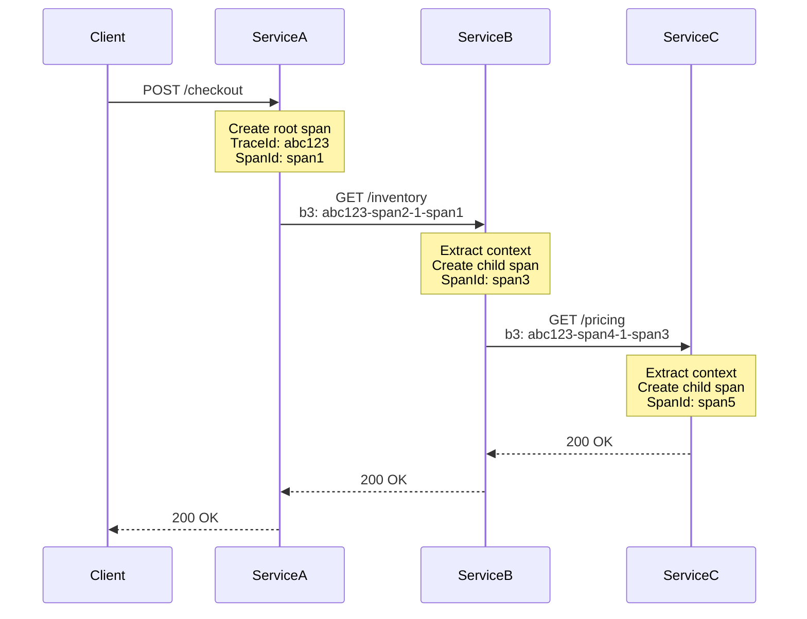
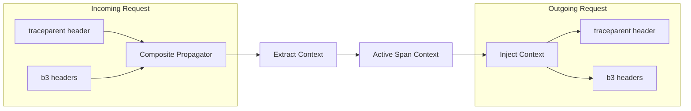
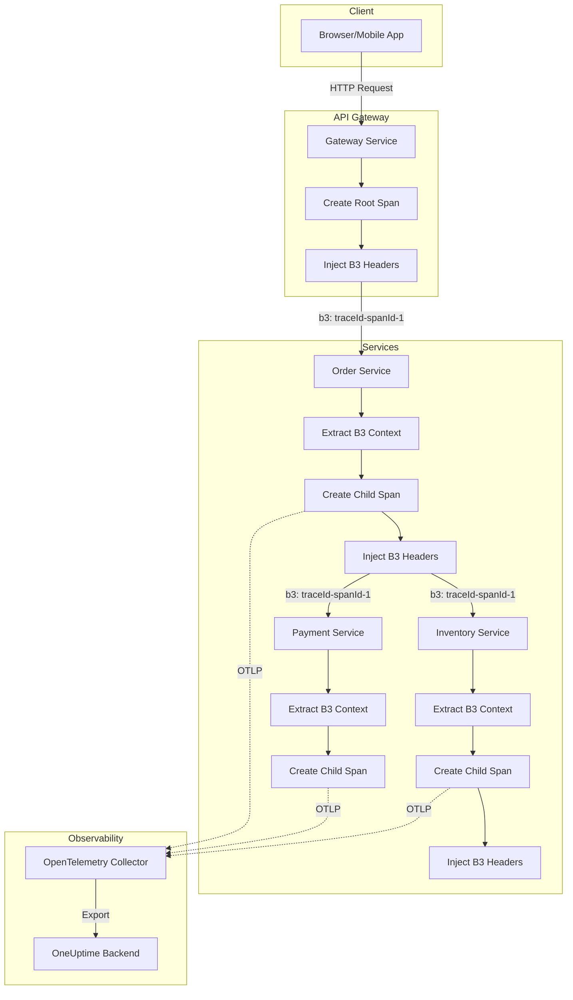

# How to Create OpenTelemetry B3 Propagation

Author: [nawazdhandala](https://github.com/nawazdhandala)

Tags: OpenTelemetry, B3, Tracing, Propagation

Description: Learn how to implement B3 propagation in OpenTelemetry to maintain trace context across distributed services, with practical code examples for Node.js and Python.

---

> Distributed tracing only works when trace context flows seamlessly across service boundaries. B3 propagation is one of the most widely adopted formats for carrying that context.

When your request travels from Service A to Service B to Service C, each service needs to know it is part of the same trace. Without proper context propagation, you end up with fragmented traces that tell incomplete stories. B3 propagation solves this by encoding trace context into HTTP headers that services can read and forward.

This guide covers what B3 propagation is, when to use it, and how to implement it in OpenTelemetry for Node.js and Python applications.

---

## What is B3 Propagation?

B3 is a trace context propagation format originally developed by Zipkin. It encodes trace context (trace ID, span ID, sampling decision) into HTTP headers so that downstream services can continue the same trace.

B3 supports two header formats:

| Format | Headers | Use Case |
|--------|---------|----------|
| Single Header | `b3` | Compact, modern systems |
| Multi Header | `X-B3-TraceId`, `X-B3-SpanId`, `X-B3-Sampled`, `X-B3-ParentSpanId` | Legacy compatibility |

The single header format combines all values into one header.

Single header example:

```
b3: 80f198ee56343ba864fe8b2a57d3eff7-e457b5a2e4d86bd1-1-05e3ac9a4f6e3b90
```

The format is: `{TraceId}-{SpanId}-{SamplingState}-{ParentSpanId}`

Multi header example:

```
X-B3-TraceId: 80f198ee56343ba864fe8b2a57d3eff7
X-B3-SpanId: e457b5a2e4d86bd1
X-B3-Sampled: 1
X-B3-ParentSpanId: 05e3ac9a4f6e3b90
```

---

## When to Use B3 vs W3C Trace Context

OpenTelemetry supports multiple propagation formats. Here is when to choose B3:

| Scenario | Recommended Format |
|----------|-------------------|
| Greenfield project, all OTel | W3C Trace Context |
| Integrating with Zipkin-based systems | B3 |
| Mixed ecosystem (some Zipkin, some OTel) | Both (composite propagator) |
| Legacy services expecting B3 headers | B3 |
| Envoy, Istio service mesh | B3 (often default) |

If you control all services and start fresh, W3C Trace Context (`traceparent`, `tracestate`) is the modern standard. But many real-world systems have existing Zipkin instrumentation or service meshes configured for B3.

---

## How B3 Propagation Works

The following diagram shows how B3 headers flow through a distributed system.



Each service extracts the incoming B3 headers, creates a child span with the extracted trace context as parent, and injects new B3 headers when making outbound calls.

---

## Setting Up B3 Propagation in Node.js

Install the required packages.

```bash
npm install @opentelemetry/api \
            @opentelemetry/sdk-node \
            @opentelemetry/propagator-b3 \
            @opentelemetry/auto-instrumentations-node \
            @opentelemetry/exporter-trace-otlp-http
```

Configure the SDK with B3 propagation.

```typescript
// telemetry.ts
import { NodeSDK } from '@opentelemetry/sdk-node';
import { getNodeAutoInstrumentations } from '@opentelemetry/auto-instrumentations-node';
import { OTLPTraceExporter } from '@opentelemetry/exporter-trace-otlp-http';
import { B3Propagator, B3InjectEncoding } from '@opentelemetry/propagator-b3';
import { Resource } from '@opentelemetry/resources';
import { ATTR_SERVICE_NAME } from '@opentelemetry/semantic-conventions';

// Configure B3 propagator with single header format
const b3Propagator = new B3Propagator({
  injectEncoding: B3InjectEncoding.SINGLE_HEADER
});

const traceExporter = new OTLPTraceExporter({
  url: process.env.OTEL_EXPORTER_OTLP_ENDPOINT || 'https://oneuptime.com/otlp/v1/traces',
  headers: {
    'x-oneuptime-token': process.env.ONEUPTIME_TOKEN || ''
  }
});

export const sdk = new NodeSDK({
  resource: new Resource({
    [ATTR_SERVICE_NAME]: 'checkout-service'
  }),
  traceExporter,
  textMapPropagator: b3Propagator,
  instrumentations: [getNodeAutoInstrumentations()]
});

sdk.start();
console.log('OpenTelemetry initialized with B3 propagation');
```

The auto-instrumentation handles HTTP client and server spans automatically. When your service receives a request with B3 headers, the context is extracted. When your service makes an outbound HTTP call, B3 headers are injected.

---

## Using Multi-Header B3 Format

Some legacy systems expect the multi-header format. Change the inject encoding to support those systems.

```typescript
import { B3Propagator, B3InjectEncoding } from '@opentelemetry/propagator-b3';

const b3Propagator = new B3Propagator({
  injectEncoding: B3InjectEncoding.MULTI_HEADER
});
```

This produces separate headers for each field.

```
X-B3-TraceId: 80f198ee56343ba864fe8b2a57d3eff7
X-B3-SpanId: e457b5a2e4d86bd1
X-B3-Sampled: 1
```

---

## Supporting Both B3 and W3C Trace Context

In mixed environments, you may need to support multiple propagation formats. Use a composite propagator to handle both.

```typescript
import { CompositePropagator } from '@opentelemetry/core';
import { W3CTraceContextPropagator } from '@opentelemetry/core';
import { B3Propagator, B3InjectEncoding } from '@opentelemetry/propagator-b3';

const compositePropagator = new CompositePropagator({
  propagators: [
    new W3CTraceContextPropagator(),
    new B3Propagator({ injectEncoding: B3InjectEncoding.MULTI_HEADER })
  ]
});

// Use in SDK configuration
const sdk = new NodeSDK({
  textMapPropagator: compositePropagator,
  // ... other config
});
```

With this setup, your service extracts context from either format and injects both formats on outbound calls.



---

## B3 Propagation in Python

Install the required packages.

```bash
pip install opentelemetry-api \
            opentelemetry-sdk \
            opentelemetry-propagator-b3 \
            opentelemetry-exporter-otlp \
            opentelemetry-instrumentation-requests \
            opentelemetry-instrumentation-flask
```

Configure B3 propagation for a Flask application.

```python
# telemetry.py
from opentelemetry import trace
from opentelemetry.sdk.trace import TracerProvider
from opentelemetry.sdk.trace.export import BatchSpanProcessor
from opentelemetry.exporter.otlp.proto.http.trace_exporter import OTLPSpanExporter
from opentelemetry.sdk.resources import Resource, SERVICE_NAME
from opentelemetry.propagators.b3 import B3MultiFormat
from opentelemetry.propagate import set_global_textmap
import os

# Set up B3 propagation
set_global_textmap(B3MultiFormat())

# Configure tracer provider
resource = Resource.create({SERVICE_NAME: "inventory-service"})
provider = TracerProvider(resource=resource)

# Configure OTLP exporter
otlp_exporter = OTLPSpanExporter(
    endpoint=os.environ.get("OTEL_EXPORTER_OTLP_ENDPOINT", "https://oneuptime.com/otlp/v1/traces"),
    headers={"x-oneuptime-token": os.environ.get("ONEUPTIME_TOKEN", "")}
)

provider.add_span_processor(BatchSpanProcessor(otlp_exporter))
trace.set_tracer_provider(provider)
```

Instrument your Flask application.

```python
# app.py
from flask import Flask
from opentelemetry.instrumentation.flask import FlaskInstrumentor
from opentelemetry.instrumentation.requests import RequestsInstrumentor
import telemetry  # Initialize telemetry first

app = Flask(__name__)

# Auto-instrument Flask and requests library
FlaskInstrumentor().instrument_app(app)
RequestsInstrumentor().instrument()

@app.route('/inventory/<item_id>')
def get_inventory(item_id):
    # B3 headers are automatically extracted from incoming request
    # and injected into outgoing requests made with 'requests' library
    return {"item_id": item_id, "quantity": 100}

if __name__ == '__main__':
    app.run(port=5001)
```

---

## Manual Context Propagation

Sometimes you need to manually extract or inject context, for example when using a messaging system or custom HTTP client.

Extract context from incoming headers in Node.js.

```typescript
import { propagation, context, trace } from '@opentelemetry/api';

function handleIncomingRequest(headers: Record<string, string>) {
  // Extract context from incoming headers
  const extractedContext = propagation.extract(context.active(), headers);

  // Create a span within the extracted context
  const tracer = trace.getTracer('manual-example');

  return context.with(extractedContext, () => {
    const span = tracer.startSpan('process-message');
    try {
      // Your processing logic here
      return { success: true };
    } finally {
      span.end();
    }
  });
}
```

Inject context into outgoing headers in Node.js.

```typescript
import { propagation, context } from '@opentelemetry/api';

function makeOutboundCall() {
  const headers: Record<string, string> = {};

  // Inject current context into headers
  propagation.inject(context.active(), headers);

  // headers now contains B3 (or whatever propagator is configured)
  // { 'b3': '80f198ee56343ba864fe8b2a57d3eff7-e457b5a2e4d86bd1-1' }

  return fetch('http://downstream-service/api', { headers });
}
```

---

## B3 Propagation with OpenTelemetry Collector

If you use an OpenTelemetry Collector, you can configure context propagation at the receiver level. This is useful when the Collector acts as a gateway.

```yaml
receivers:
  otlp:
    protocols:
      http:
        include_metadata: true

processors:
  batch:
    send_batch_size: 512
    timeout: 5s

exporters:
  otlphttp:
    endpoint: https://oneuptime.com/otlp
    headers:
      x-oneuptime-token: ${ONEUPTIME_TOKEN}

service:
  pipelines:
    traces:
      receivers: [otlp]
      processors: [batch]
      exporters: [otlphttp]
```

The Collector preserves trace context as spans flow through the pipeline. Applications still handle B3 propagation at the SDK level.

---

## Verifying B3 Propagation

To verify B3 headers are being propagated correctly, add logging middleware that inspects headers.

```typescript
// Express middleware to log B3 headers
import { Request, Response, NextFunction } from 'express';

export function logB3Headers(req: Request, res: Response, next: NextFunction) {
  const b3Single = req.headers['b3'];
  const b3TraceId = req.headers['x-b3-traceid'];
  const b3SpanId = req.headers['x-b3-spanid'];
  const b3Sampled = req.headers['x-b3-sampled'];

  if (b3Single) {
    console.log(`B3 Single Header: ${b3Single}`);
  }

  if (b3TraceId) {
    console.log(`B3 Multi Headers - TraceId: ${b3TraceId}, SpanId: ${b3SpanId}, Sampled: ${b3Sampled}`);
  }

  if (!b3Single && !b3TraceId) {
    console.log('No B3 headers found - this is a root span');
  }

  next();
}
```

---

## Common Issues and Fixes

| Issue | Cause | Solution |
|-------|-------|----------|
| Traces not connecting across services | Propagator not configured | Ensure B3Propagator is set in textMapPropagator |
| Missing spans in downstream service | Context not extracted | Check auto-instrumentation is enabled |
| Wrong header format | Inject encoding mismatch | Match SINGLE_HEADER or MULTI_HEADER to what downstream expects |
| Duplicate trace IDs | Multiple propagators injecting | Use CompositePropagator to coordinate |
| Sampling decisions not propagating | Sampled flag ignored | Ensure sampling respects parent decision |

---

## Architecture: Full B3 Propagation Flow

This diagram shows the complete flow of B3 propagation in a microservices architecture.



---

## Key Takeaways

- B3 propagation encodes trace context in HTTP headers for cross-service tracing
- Use single header format (`b3`) for modern systems, multi-header for legacy compatibility
- Configure B3Propagator in your OpenTelemetry SDK setup
- Use CompositePropagator when you need to support both B3 and W3C Trace Context
- Auto-instrumentation handles extraction and injection automatically for HTTP
- Manual propagation is needed for messaging systems or custom transports
- Verify propagation by logging headers during development

---

## Related Reading

- [What are Traces and Spans in OpenTelemetry: A Practical Guide](https://oneuptime.com/blog/post/2025-08-27-traces-and-spans-in-opentelemetry/view)
- [How to reduce noise in OpenTelemetry?](https://oneuptime.com/blog/post/2025-08-25-how-to-reduce-noise-in-opentelemetry/view)
- [OpenTelemetry Collector: What It Is, When You Need It, and When You Dont](https://oneuptime.com/blog/post/2025-09-18-what-is-opentelemetry-collector-and-why-use-one/view)

---

Ready to visualize your distributed traces? **OneUptime** supports OpenTelemetry natively, including B3 propagation. Send your traces via OTLP and see the complete request flow across all your services.
