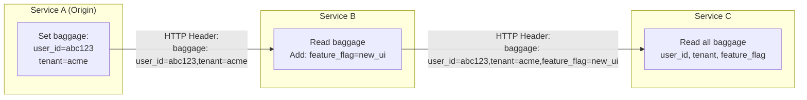
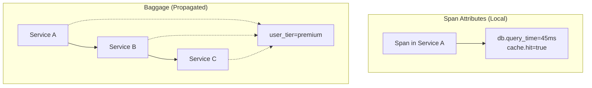
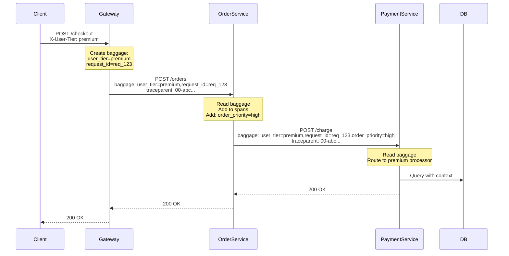
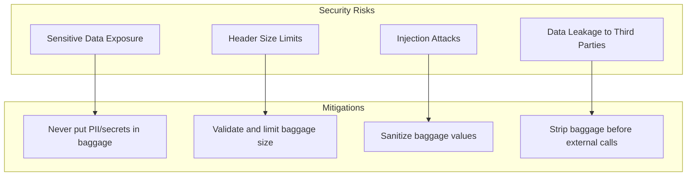
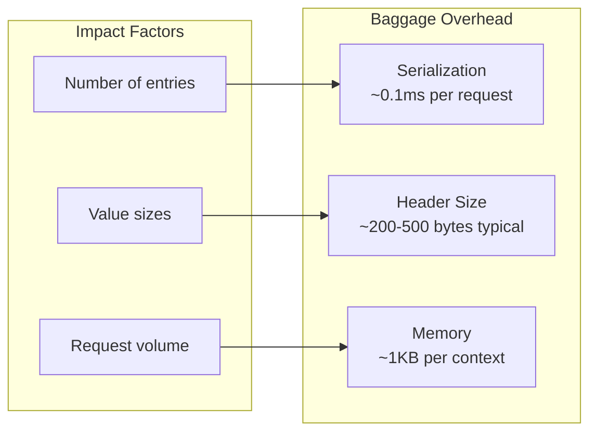
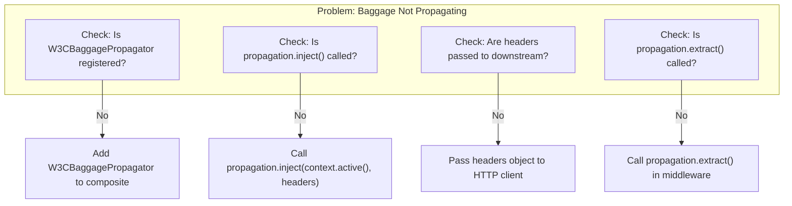

# How to Create OpenTelemetry Baggage Propagation

Author: [nawazdhandala](https://github.com/nawazdhandala)

Tags: OpenTelemetry, Context, Propagation, Distributed Systems

Description: Learn how to implement OpenTelemetry baggage propagation to carry business context across service boundaries. This guide covers practical examples, best practices, and common patterns for propagating contextual data in distributed systems.

---

> Traces tell you where time was spent. Logs tell you what happened. **Baggage tells you the business context that ties everything together.**

In distributed systems, understanding the technical flow of a request is only half the story. You also need to know the *business context* - which customer triggered this request, which feature flag was active, which experiment variant was selected, or which region the request originated from.

OpenTelemetry Baggage solves this problem by providing a standardized way to propagate key-value pairs across service boundaries alongside trace context. This guide walks you through everything you need to know to implement baggage propagation effectively.

---

## Table of Contents

1. What is OpenTelemetry Baggage?
2. How Baggage Differs from Span Attributes
3. Baggage Propagation Architecture
4. Setting Up Baggage in Node.js
5. Propagating Baggage Across HTTP Services
6. Propagating Baggage Across gRPC Services
7. Propagating Baggage Through Message Queues
8. Reading Baggage in Downstream Services
9. Automatically Adding Baggage to Spans
10. Security Considerations
11. Performance Impact and Best Practices
12. Common Use Cases and Patterns
13. Debugging Baggage Propagation Issues
14. Complete Working Example
15. Summary and Next Steps

---

## 1. What is OpenTelemetry Baggage?

Baggage is a set of key-value pairs that travels with the trace context across service boundaries. Unlike span attributes (which are local to a single span), baggage is propagated to all downstream services automatically when you use proper context propagation.

| Concept | Description |
|---------|-------------|
| Baggage Entry | A single key-value pair with optional metadata |
| Baggage | The collection of all entries for a given context |
| Propagator | The component that serializes/deserializes baggage into headers |
| W3C Baggage | The standard header format: `baggage: key1=value1,key2=value2` |

Think of baggage like a backpack that travels with your request. Each service can peek inside, add items, or use items - and the backpack automatically follows the request to the next service.



---

## 2. How Baggage Differs from Span Attributes

A common question is: "Why not just use span attributes?" The key difference is scope and propagation.

| Feature | Span Attributes | Baggage |
|---------|-----------------|---------|
| Scope | Single span only | Entire trace across services |
| Propagation | Not propagated | Automatically propagated via headers |
| Storage | Stored in span data | Stored in context, must be explicitly added to spans |
| Use Case | Describe local operation | Share context across services |
| Overhead | Low (local only) | Higher (serialized in every request) |

**When to use span attributes:**
- Local metrics and debugging info
- High-cardinality data (request IDs, timestamps)
- Large data values
- Sensitive information (stays local)

**When to use baggage:**
- Business context needed by multiple services
- Routing decisions
- Feature flags and experiment IDs
- Tenant/customer identification
- Request origin tracking



---

## 3. Baggage Propagation Architecture

Understanding how baggage flows through your system helps you implement it correctly.



The W3C Baggage specification defines the header format:

```
baggage: key1=value1,key2=value2;metadata,key3=value3
```

Each entry can have:
- **Key**: URL-encoded string (no spaces, special chars encoded)
- **Value**: URL-encoded string
- **Properties** (optional): Semicolon-separated metadata like `;priority=high`

---

## 4. Setting Up Baggage in Node.js

First, install the necessary packages:

```bash
npm install @opentelemetry/api \
            @opentelemetry/sdk-node \
            @opentelemetry/auto-instrumentations-node \
            @opentelemetry/exporter-otlp-http \
            @opentelemetry/core
```

### Basic Telemetry Setup with Baggage Propagation

```typescript
// telemetry.ts
import { NodeSDK } from '@opentelemetry/sdk-node';
import { getNodeAutoInstrumentations } from '@opentelemetry/auto-instrumentations-node';
import { OTLPTraceExporter } from '@opentelemetry/exporter-otlp-http';
import { Resource } from '@opentelemetry/resources';
import {
  CompositePropagator,
  W3CTraceContextPropagator,
  W3CBaggagePropagator
} from '@opentelemetry/core';
import { propagation } from '@opentelemetry/api';

// Configure propagators - IMPORTANT: Include W3CBaggagePropagator
const propagator = new CompositePropagator({
  propagators: [
    new W3CTraceContextPropagator(),  // Propagates traceparent header
    new W3CBaggagePropagator(),        // Propagates baggage header
  ],
});

// Set the global propagator
propagation.setGlobalPropagator(propagator);

const traceExporter = new OTLPTraceExporter({
  url: process.env.OTEL_EXPORTER_OTLP_TRACES_ENDPOINT || 'https://oneuptime.com/otlp/v1/traces',
  headers: { 'x-oneuptime-token': process.env.ONEUPTIME_TOKEN || '' },
});

export const sdk = new NodeSDK({
  traceExporter,
  resource: new Resource({
    'service.name': 'my-service',
    'service.version': '1.0.0',
  }),
  instrumentations: [getNodeAutoInstrumentations()],
});

export async function startTelemetry() {
  await sdk.start();
  console.log('OpenTelemetry initialized with baggage propagation');
}
```

---

## 5. Propagating Baggage Across HTTP Services

### Setting Baggage at the Origin Service

```typescript
// api-gateway.ts
import express from 'express';
import {
  context,
  propagation,
  baggage,
  trace
} from '@opentelemetry/api';
import fetch from 'node-fetch';

const app = express();
app.use(express.json());

app.post('/checkout', async (req, res) => {
  // Step 1: Create baggage entries
  const bag = baggage.setBaggage(
    context.active(),
    baggage.createBaggage({
      'user.id': { value: req.body.userId || 'anonymous' },
      'user.tier': { value: req.body.tier || 'free' },
      'tenant.id': { value: req.headers['x-tenant-id'] as string || 'default' },
      'request.origin': { value: 'web' },
    })
  );

  // Step 2: Execute downstream calls within the baggage context
  const result = await context.with(bag, async () => {
    // Prepare headers for outbound request
    const headers: Record<string, string> = {
      'Content-Type': 'application/json',
    };

    // Step 3: Inject trace context AND baggage into headers
    propagation.inject(context.active(), headers);

    // The headers now contain:
    // - traceparent: 00-<trace_id>-<span_id>-01
    // - baggage: user.id=abc123,user.tier=premium,tenant.id=acme,request.origin=web

    const response = await fetch('http://order-service:3001/orders', {
      method: 'POST',
      headers,
      body: JSON.stringify(req.body),
    });

    return response.json();
  });

  res.json(result);
});

app.listen(3000);
```

### Reading and Extending Baggage in Downstream Services

```typescript
// order-service.ts
import express from 'express';
import {
  context,
  propagation,
  baggage,
  trace
} from '@opentelemetry/api';
import fetch from 'node-fetch';

const app = express();
app.use(express.json());

// Middleware to extract context from incoming requests
app.use((req, res, next) => {
  // Extract trace context and baggage from incoming headers
  const extractedContext = propagation.extract(context.active(), req.headers);

  // Continue with the extracted context
  context.with(extractedContext, () => {
    next();
  });
});

app.post('/orders', async (req, res) => {
  // Step 1: Read existing baggage
  const currentBaggage = propagation.getBaggage(context.active());

  const userId = currentBaggage?.getEntry('user.id')?.value;
  const userTier = currentBaggage?.getEntry('user.tier')?.value;
  const tenantId = currentBaggage?.getEntry('tenant.id')?.value;

  console.log(`Processing order for user: ${userId}, tier: ${userTier}, tenant: ${tenantId}`);

  // Step 2: Add business logic based on baggage
  const priority = userTier === 'premium' ? 'high' : 'normal';

  // Step 3: Add new baggage entries for downstream services
  const extendedBaggage = baggage.setBaggage(
    context.active(),
    baggage.createBaggage({
      ...Object.fromEntries(
        currentBaggage?.getAllEntries().map(([k, v]) => [k, v]) || []
      ),
      'order.priority': { value: priority },
      'order.id': { value: `ord_${Date.now()}` },
    })
  );

  // Step 4: Call payment service with extended baggage
  const paymentResult = await context.with(extendedBaggage, async () => {
    const headers: Record<string, string> = {
      'Content-Type': 'application/json',
    };
    propagation.inject(context.active(), headers);

    const response = await fetch('http://payment-service:3002/charge', {
      method: 'POST',
      headers,
      body: JSON.stringify({ amount: req.body.total }),
    });

    return response.json();
  });

  res.json({ success: true, payment: paymentResult });
});

app.listen(3001);
```

---

## 6. Propagating Baggage Across gRPC Services

For gRPC services, baggage propagation works through metadata:

```typescript
// grpc-client.ts
import * as grpc from '@grpc/grpc-js';
import { context, propagation, baggage } from '@opentelemetry/api';

function createGrpcMetadataWithBaggage(): grpc.Metadata {
  const metadata = new grpc.Metadata();

  // Inject current context (trace + baggage) into metadata
  const carrier: Record<string, string> = {};
  propagation.inject(context.active(), carrier);

  // Transfer to gRPC metadata
  for (const [key, value] of Object.entries(carrier)) {
    metadata.set(key, value);
  }

  return metadata;
}

async function callInventoryService(sku: string, quantity: number) {
  // Set baggage before making the call
  const ctx = baggage.setBaggage(
    context.active(),
    baggage.createBaggage({
      'inventory.check_type': { value: 'reservation' },
      'warehouse.region': { value: 'us-west-2' },
    })
  );

  return context.with(ctx, () => {
    const metadata = createGrpcMetadataWithBaggage();

    return new Promise((resolve, reject) => {
      inventoryClient.checkStock(
        { sku, quantity },
        metadata,
        (error, response) => {
          if (error) reject(error);
          else resolve(response);
        }
      );
    });
  });
}
```

```typescript
// grpc-server.ts
import * as grpc from '@grpc/grpc-js';
import { context, propagation, baggage } from '@opentelemetry/api';

function extractContextFromMetadata(metadata: grpc.Metadata): any {
  const carrier: Record<string, string> = {};

  // Extract relevant headers from gRPC metadata
  for (const key of ['traceparent', 'tracestate', 'baggage']) {
    const value = metadata.get(key);
    if (value && value.length > 0) {
      carrier[key] = value[0].toString();
    }
  }

  return propagation.extract(context.active(), carrier);
}

const inventoryService = {
  checkStock: (call: grpc.ServerUnaryCall<any, any>, callback: grpc.sendUnaryData<any>) => {
    const extractedContext = extractContextFromMetadata(call.metadata);

    context.with(extractedContext, () => {
      const currentBaggage = propagation.getBaggage(context.active());

      const checkType = currentBaggage?.getEntry('inventory.check_type')?.value;
      const region = currentBaggage?.getEntry('warehouse.region')?.value;

      console.log(`Checking stock: type=${checkType}, region=${region}`);

      // Business logic here
      callback(null, { available: true, quantity: 100 });
    });
  },
};
```

---

## 7. Propagating Baggage Through Message Queues

Message queues require special handling since baggage must be serialized into message headers or properties.

### Kafka Producer with Baggage

```typescript
// kafka-producer.ts
import { Kafka } from 'kafkajs';
import { context, propagation, baggage } from '@opentelemetry/api';

const kafka = new Kafka({ brokers: ['localhost:9092'] });
const producer = kafka.producer();

async function publishOrderEvent(order: any) {
  // Set baggage for the message
  const ctx = baggage.setBaggage(
    context.active(),
    baggage.createBaggage({
      'order.source': { value: 'checkout-flow' },
      'user.segment': { value: 'returning-customer' },
    })
  );

  await context.with(ctx, async () => {
    // Create headers carrier
    const headers: Record<string, string> = {};
    propagation.inject(context.active(), headers);

    // Convert to Kafka header format
    const kafkaHeaders: Record<string, Buffer> = {};
    for (const [key, value] of Object.entries(headers)) {
      kafkaHeaders[key] = Buffer.from(value);
    }

    await producer.send({
      topic: 'orders',
      messages: [
        {
          key: order.id,
          value: JSON.stringify(order),
          headers: kafkaHeaders,
        },
      ],
    });
  });
}
```

### Kafka Consumer with Baggage

```typescript
// kafka-consumer.ts
import { Kafka } from 'kafkajs';
import { context, propagation, baggage, trace } from '@opentelemetry/api';

const kafka = new Kafka({ brokers: ['localhost:9092'] });
const consumer = kafka.consumer({ groupId: 'order-processor' });

async function startConsumer() {
  await consumer.connect();
  await consumer.subscribe({ topic: 'orders' });

  await consumer.run({
    eachMessage: async ({ message }) => {
      // Extract headers from Kafka message
      const carrier: Record<string, string> = {};
      if (message.headers) {
        for (const [key, value] of Object.entries(message.headers)) {
          if (value) {
            carrier[key] = value.toString();
          }
        }
      }

      // Extract context including baggage
      const extractedContext = propagation.extract(context.active(), carrier);

      await context.with(extractedContext, async () => {
        const currentBaggage = propagation.getBaggage(context.active());

        const orderSource = currentBaggage?.getEntry('order.source')?.value;
        const userSegment = currentBaggage?.getEntry('user.segment')?.value;

        console.log(`Processing order from ${orderSource}, user segment: ${userSegment}`);

        // Add baggage to current span for observability
        const span = trace.getActiveSpan();
        if (span && currentBaggage) {
          for (const [key, entry] of currentBaggage.getAllEntries()) {
            span.setAttribute(`baggage.${key}`, entry.value);
          }
        }

        // Process the order
        const order = JSON.parse(message.value?.toString() || '{}');
        await processOrder(order, userSegment);
      });
    },
  });
}
```

---

## 8. Reading Baggage in Downstream Services

Here are utility functions for working with baggage:

```typescript
// baggage-utils.ts
import { context, propagation, baggage, Baggage, BaggageEntry } from '@opentelemetry/api';

/**
 * Get a single baggage value
 */
export function getBaggageValue(key: string): string | undefined {
  const currentBaggage = propagation.getBaggage(context.active());
  return currentBaggage?.getEntry(key)?.value;
}

/**
 * Get all baggage as a plain object
 */
export function getAllBaggage(): Record<string, string> {
  const currentBaggage = propagation.getBaggage(context.active());
  const result: Record<string, string> = {};

  if (currentBaggage) {
    for (const [key, entry] of currentBaggage.getAllEntries()) {
      result[key] = entry.value;
    }
  }

  return result;
}

/**
 * Set multiple baggage entries and return the new context
 */
export function setBaggageEntries(
  entries: Record<string, string>
): ReturnType<typeof context.active> {
  const currentBaggage = propagation.getBaggage(context.active());
  const existingEntries: Record<string, BaggageEntry> = {};

  if (currentBaggage) {
    for (const [key, entry] of currentBaggage.getAllEntries()) {
      existingEntries[key] = entry;
    }
  }

  // Add new entries
  for (const [key, value] of Object.entries(entries)) {
    existingEntries[key] = { value };
  }

  return baggage.setBaggage(
    context.active(),
    baggage.createBaggage(existingEntries)
  );
}

/**
 * Remove a baggage entry
 */
export function removeBaggageEntry(key: string): ReturnType<typeof context.active> {
  const currentBaggage = propagation.getBaggage(context.active());

  if (!currentBaggage) {
    return context.active();
  }

  return baggage.setBaggage(
    context.active(),
    currentBaggage.removeEntry(key)
  );
}

/**
 * Execute a function with additional baggage
 */
export async function withBaggage<T>(
  entries: Record<string, string>,
  fn: () => Promise<T>
): Promise<T> {
  const ctx = setBaggageEntries(entries);
  return context.with(ctx, fn);
}
```

Usage example:

```typescript
import { withBaggage, getBaggageValue, getAllBaggage } from './baggage-utils';

async function processRequest(req: Request) {
  // Read baggage set by upstream service
  const userId = getBaggageValue('user.id');
  const tenantId = getBaggageValue('tenant.id');

  console.log(`Processing request for user ${userId} in tenant ${tenantId}`);

  // Add new baggage and call downstream
  await withBaggage(
    { 'processing.stage': 'validation' },
    async () => {
      await callValidationService();
    }
  );

  // Log all baggage for debugging
  console.log('Current baggage:', getAllBaggage());
}
```

---

## 9. Automatically Adding Baggage to Spans

Baggage is not automatically added to spans. You need to explicitly copy baggage entries to span attributes if you want them to appear in your traces.

### Middleware Approach

```typescript
// baggage-to-spans-middleware.ts
import { context, propagation, trace } from '@opentelemetry/api';
import { RequestHandler } from 'express';

/**
 * Express middleware that copies baggage entries to the current span
 */
export const baggageToSpanMiddleware: RequestHandler = (req, res, next) => {
  const span = trace.getActiveSpan();
  const currentBaggage = propagation.getBaggage(context.active());

  if (span && currentBaggage) {
    for (const [key, entry] of currentBaggage.getAllEntries()) {
      // Prefix with 'baggage.' to distinguish from regular attributes
      span.setAttribute(`baggage.${key}`, entry.value);
    }
  }

  next();
};

// Usage in Express app
app.use(baggageToSpanMiddleware);
```

### Span Processor Approach (Automatic for All Spans)

```typescript
// baggage-span-processor.ts
import {
  SpanProcessor,
  ReadableSpan,
  Span
} from '@opentelemetry/sdk-trace-base';
import { context, propagation } from '@opentelemetry/api';

/**
 * Custom span processor that automatically adds baggage to every span
 */
export class BaggageSpanProcessor implements SpanProcessor {
  private allowedKeys: Set<string> | null;

  constructor(options?: { allowedKeys?: string[] }) {
    this.allowedKeys = options?.allowedKeys
      ? new Set(options.allowedKeys)
      : null;
  }

  onStart(span: Span): void {
    const currentBaggage = propagation.getBaggage(context.active());

    if (currentBaggage) {
      for (const [key, entry] of currentBaggage.getAllEntries()) {
        // Only add allowed keys if filter is specified
        if (!this.allowedKeys || this.allowedKeys.has(key)) {
          span.setAttribute(`baggage.${key}`, entry.value);
        }
      }
    }
  }

  onEnd(span: ReadableSpan): void {}

  shutdown(): Promise<void> {
    return Promise.resolve();
  }

  forceFlush(): Promise<void> {
    return Promise.resolve();
  }
}
```

Register the processor in your telemetry setup:

```typescript
// telemetry.ts
import { NodeTracerProvider } from '@opentelemetry/sdk-trace-node';
import { BaggageSpanProcessor } from './baggage-span-processor';

const provider = new NodeTracerProvider();

// Add the baggage processor - only copy specific keys
provider.addSpanProcessor(new BaggageSpanProcessor({
  allowedKeys: ['user.id', 'tenant.id', 'user.tier', 'request.origin']
}));

provider.register();
```

---

## 10. Security Considerations

Baggage is transmitted in plain text in HTTP headers. This raises important security concerns.



### What NOT to Put in Baggage

```typescript
// BAD - Never do this
const badBaggage = {
  'user.email': 'john@example.com',        // PII
  'user.ssn': '123-45-6789',               // Sensitive data
  'auth.token': 'Bearer abc123...',         // Credentials
  'credit.card': '4111-1111-1111-1111',    // Financial data
  'password': 'secret123',                  // Secrets
};

// GOOD - Safe baggage entries
const goodBaggage = {
  'user.id': 'usr_abc123',                 // Opaque identifier
  'tenant.id': 'tenant_xyz',               // Opaque identifier
  'user.tier': 'premium',                  // Non-sensitive classification
  'request.origin': 'mobile-app',          // General source info
  'feature.flags': 'new-checkout,dark-mode', // Feature flags
  'experiment.variant': 'control',         // A/B test variant
};
```

### Baggage Sanitization Middleware

```typescript
// baggage-sanitizer.ts
import { context, propagation, baggage } from '@opentelemetry/api';
import { RequestHandler } from 'express';

const ALLOWED_BAGGAGE_KEYS = new Set([
  'user.id',
  'tenant.id',
  'user.tier',
  'request.origin',
  'feature.flags',
  'experiment.variant',
  'order.priority',
]);

const MAX_BAGGAGE_VALUE_LENGTH = 256;
const MAX_TOTAL_BAGGAGE_SIZE = 8192; // 8KB

export const sanitizeBaggageMiddleware: RequestHandler = (req, res, next) => {
  const currentBaggage = propagation.getBaggage(context.active());

  if (!currentBaggage) {
    next();
    return;
  }

  const sanitizedEntries: Record<string, { value: string }> = {};
  let totalSize = 0;

  for (const [key, entry] of currentBaggage.getAllEntries()) {
    // Only allow known keys
    if (!ALLOWED_BAGGAGE_KEYS.has(key)) {
      console.warn(`Dropping unknown baggage key: ${key}`);
      continue;
    }

    // Truncate long values
    let value = entry.value;
    if (value.length > MAX_BAGGAGE_VALUE_LENGTH) {
      console.warn(`Truncating baggage value for key: ${key}`);
      value = value.substring(0, MAX_BAGGAGE_VALUE_LENGTH);
    }

    // Check total size
    const entrySize = key.length + value.length;
    if (totalSize + entrySize > MAX_TOTAL_BAGGAGE_SIZE) {
      console.warn(`Baggage size limit reached, dropping key: ${key}`);
      continue;
    }

    sanitizedEntries[key] = { value };
    totalSize += entrySize;
  }

  // Replace context with sanitized baggage
  const sanitizedContext = baggage.setBaggage(
    context.active(),
    baggage.createBaggage(sanitizedEntries)
  );

  context.with(sanitizedContext, () => {
    next();
  });
};
```

### Stripping Baggage for External Calls

```typescript
// external-api-client.ts
import { context, propagation, baggage } from '@opentelemetry/api';
import fetch from 'node-fetch';

async function callExternalApi(url: string, data: any) {
  // Create a context with empty baggage for external calls
  const emptyBaggageContext = baggage.setBaggage(
    context.active(),
    baggage.createBaggage({})
  );

  return context.with(emptyBaggageContext, async () => {
    const headers: Record<string, string> = {
      'Content-Type': 'application/json',
    };

    // Only inject trace context, baggage will be empty
    propagation.inject(context.active(), headers);

    return fetch(url, {
      method: 'POST',
      headers,
      body: JSON.stringify(data),
    });
  });
}
```

---

## 11. Performance Impact and Best Practices

### Performance Considerations



### Best Practices

```typescript
// baggage-best-practices.ts

// 1. Keep keys short but descriptive
const goodKeys = {
  'uid': 'user_123',           // Short alias for user.id
  'tid': 'tenant_abc',         // Short alias for tenant.id
  'tier': 'premium',           // Concise
};

// 2. Use low-cardinality values when possible
const lowCardinality = {
  'user.tier': 'premium',      // ~5 possible values
  'region': 'us-west',         // ~10 possible values
  'channel': 'web',            // ~3 possible values
};

// 3. Batch related data
// Instead of:
const verbose = {
  'feature.dark_mode': 'true',
  'feature.new_checkout': 'true',
  'feature.beta_search': 'false',
};

// Use:
const compact = {
  'features': 'dark_mode,new_checkout', // Comma-separated enabled features
};

// 4. Set baggage early, read often
// Set at the edge (API gateway, load balancer)
// Read in downstream services without modification when possible

// 5. Document your baggage schema
/**
 * Baggage Schema v1.0
 *
 * | Key           | Type   | Example        | Set By      | Used By           |
 * |---------------|--------|----------------|-------------|-------------------|
 * | user.id       | string | usr_abc123     | API Gateway | All services      |
 * | tenant.id     | string | tenant_xyz     | API Gateway | All services      |
 * | user.tier     | enum   | free/premium   | API Gateway | Payment, Shipping |
 * | request.origin| enum   | web/mobile/api | API Gateway | Analytics         |
 */
```

---

## 12. Common Use Cases and Patterns

### Use Case 1: Multi-Tenant Routing

```typescript
// tenant-aware-routing.ts
import { getBaggageValue } from './baggage-utils';

async function routeToTenantDatabase(query: string) {
  const tenantId = getBaggageValue('tenant.id');

  if (!tenantId) {
    throw new Error('Missing tenant context');
  }

  // Route to tenant-specific database
  const dbConnection = await getTenantDatabaseConnection(tenantId);
  return dbConnection.query(query);
}

async function routeToTenantQueue(message: any) {
  const tenantId = getBaggageValue('tenant.id');
  const tier = getBaggageValue('user.tier');

  // Premium tenants get priority queue
  const queueName = tier === 'premium'
    ? `${tenantId}-priority`
    : `${tenantId}-standard`;

  await publishToQueue(queueName, message);
}
```

### Use Case 2: Feature Flag Propagation

```typescript
// feature-flags.ts
import { withBaggage, getBaggageValue } from './baggage-utils';

// At the API Gateway - fetch flags and set baggage
async function initializeFeatureFlags(userId: string) {
  const flags = await featureFlagService.getFlags(userId);

  const enabledFlags = Object.entries(flags)
    .filter(([_, enabled]) => enabled)
    .map(([name]) => name)
    .join(',');

  return withBaggage({ 'feature.flags': enabledFlags }, async () => {
    // Continue processing
  });
}

// In any downstream service - check flags
function isFeatureEnabled(featureName: string): boolean {
  const flags = getBaggageValue('feature.flags') || '';
  return flags.split(',').includes(featureName);
}

// Usage
if (isFeatureEnabled('new_checkout_flow')) {
  await processWithNewCheckout(order);
} else {
  await processWithLegacyCheckout(order);
}
```

### Use Case 3: Request Sampling Decisions

```typescript
// sampling-decision.ts
import { withBaggage, getBaggageValue } from './baggage-utils';

// At the edge - make sampling decision
function decideSampling(req: Request): string {
  // Always sample errors
  if (req.headers['x-force-sample']) return 'always';

  // Sample premium users more
  const tier = req.headers['x-user-tier'];
  if (tier === 'premium') return 'high';

  // Sample synthetic monitoring
  if (req.headers['x-synthetic-request']) return 'always';

  return 'normal';
}

// Set sampling decision in baggage
app.use((req, res, next) => {
  const samplingDecision = decideSampling(req);

  withBaggage({ 'sampling.decision': samplingDecision }, () => {
    next();
  });
});

// In collector tail sampling config
// Use baggage.sampling.decision attribute to make decisions
```

### Use Case 4: Cost Attribution

```typescript
// cost-attribution.ts
import { getBaggageValue } from './baggage-utils';
import { trace } from '@opentelemetry/api';

// Add cost attribution to expensive operations
async function performExpensiveOperation() {
  const span = trace.getActiveSpan();

  // Read attribution context from baggage
  const tenantId = getBaggageValue('tenant.id');
  const costCenter = getBaggageValue('cost.center');
  const projectId = getBaggageValue('project.id');

  // Add to span for cost analysis
  if (span) {
    span.setAttribute('cost.tenant_id', tenantId || 'unknown');
    span.setAttribute('cost.center', costCenter || 'default');
    span.setAttribute('cost.project_id', projectId || 'unattributed');
  }

  // Perform operation
  const result = await expensiveCloudApiCall();

  // Log cost event
  if (span) {
    span.addEvent('cost.incurred', {
      'cost.amount': result.cost,
      'cost.currency': 'USD',
    });
  }

  return result;
}
```

---

## 13. Debugging Baggage Propagation Issues

### Common Issues and Solutions



### Debug Logging

```typescript
// debug-baggage.ts
import { context, propagation, diag, DiagConsoleLogger, DiagLogLevel } from '@opentelemetry/api';

// Enable debug logging
diag.setLogger(new DiagConsoleLogger(), DiagLogLevel.DEBUG);

// Debug middleware
export function debugBaggageMiddleware(req: any, res: any, next: any) {
  console.log('=== Incoming Request Baggage Debug ===');
  console.log('Headers:', JSON.stringify(req.headers, null, 2));

  const extractedContext = propagation.extract(context.active(), req.headers);

  context.with(extractedContext, () => {
    const currentBaggage = propagation.getBaggage(context.active());

    if (currentBaggage) {
      console.log('Extracted Baggage:');
      for (const [key, entry] of currentBaggage.getAllEntries()) {
        console.log(`  ${key}: ${entry.value}`);
      }
    } else {
      console.log('No baggage found in context');
    }

    next();
  });
}

// Debug outbound calls
export function debugOutboundHeaders(headers: Record<string, string>) {
  console.log('=== Outbound Request Headers ===');
  console.log('traceparent:', headers['traceparent']);
  console.log('baggage:', headers['baggage']);
}
```

### Validation Script

```typescript
// validate-baggage-setup.ts
import {
  propagation,
  context,
  baggage,
  trace
} from '@opentelemetry/api';
import { W3CBaggagePropagator, W3CTraceContextPropagator } from '@opentelemetry/core';

function validateBaggageSetup() {
  console.log('Validating OpenTelemetry Baggage Setup...\n');

  // Test 1: Check propagator is set
  const testHeaders: Record<string, string> = {};

  // Create test baggage
  const testBaggage = baggage.createBaggage({
    'test.key': { value: 'test_value' },
  });

  const ctxWithBaggage = baggage.setBaggage(context.active(), testBaggage);

  // Test injection
  context.with(ctxWithBaggage, () => {
    propagation.inject(context.active(), testHeaders);
  });

  console.log('Test 1 - Injection:');
  if (testHeaders['baggage']) {
    console.log('  PASS: Baggage header present');
    console.log(`  Value: ${testHeaders['baggage']}`);
  } else {
    console.log('  FAIL: Baggage header missing');
    console.log('  Fix: Ensure W3CBaggagePropagator is registered');
  }

  // Test 2: Check extraction
  console.log('\nTest 2 - Extraction:');
  const extractedContext = propagation.extract(context.active(), testHeaders);

  const extractedBaggage = propagation.getBaggage(extractedContext);
  if (extractedBaggage?.getEntry('test.key')?.value === 'test_value') {
    console.log('  PASS: Baggage correctly extracted');
  } else {
    console.log('  FAIL: Baggage extraction failed');
  }

  console.log('\nValidation complete.');
}

validateBaggageSetup();
```

---

## 14. Complete Working Example

Here is a complete example showing baggage propagation across three services.

### Service 1: API Gateway

```typescript
// gateway/index.ts
import express from 'express';
import { NodeSDK } from '@opentelemetry/sdk-node';
import { getNodeAutoInstrumentations } from '@opentelemetry/auto-instrumentations-node';
import { OTLPTraceExporter } from '@opentelemetry/exporter-otlp-http';
import {
  CompositePropagator,
  W3CTraceContextPropagator,
  W3CBaggagePropagator
} from '@opentelemetry/core';
import {
  context,
  propagation,
  baggage,
  trace
} from '@opentelemetry/api';
import fetch from 'node-fetch';

// Initialize OpenTelemetry
propagation.setGlobalPropagator(new CompositePropagator({
  propagators: [
    new W3CTraceContextPropagator(),
    new W3CBaggagePropagator(),
  ],
}));

const sdk = new NodeSDK({
  traceExporter: new OTLPTraceExporter({
    url: 'https://oneuptime.com/otlp/v1/traces',
  }),
  instrumentations: [getNodeAutoInstrumentations()],
});

sdk.start();

const app = express();
app.use(express.json());

app.post('/api/orders', async (req, res) => {
  // Create initial baggage from request context
  const initialBaggage = baggage.createBaggage({
    'user.id': { value: req.body.userId || 'anonymous' },
    'user.tier': { value: req.headers['x-user-tier'] as string || 'free' },
    'tenant.id': { value: req.headers['x-tenant-id'] as string || 'default' },
    'request.id': { value: `req_${Date.now()}` },
    'request.origin': { value: 'api-gateway' },
  });

  const ctxWithBaggage = baggage.setBaggage(context.active(), initialBaggage);

  try {
    const result = await context.with(ctxWithBaggage, async () => {
      // Add baggage to current span
      const span = trace.getActiveSpan();
      for (const [key, entry] of initialBaggage.getAllEntries()) {
        span?.setAttribute(`baggage.${key}`, entry.value);
      }

      // Call order service
      const headers: Record<string, string> = {
        'Content-Type': 'application/json',
      };
      propagation.inject(context.active(), headers);

      const response = await fetch('http://localhost:3001/orders', {
        method: 'POST',
        headers,
        body: JSON.stringify(req.body),
      });

      return response.json();
    });

    res.json(result);
  } catch (error: any) {
    res.status(500).json({ error: error.message });
  }
});

app.listen(3000, () => {
  console.log('API Gateway running on port 3000');
});
```

### Service 2: Order Service

```typescript
// order-service/index.ts
import express from 'express';
import { NodeSDK } from '@opentelemetry/sdk-node';
import { getNodeAutoInstrumentations } from '@opentelemetry/auto-instrumentations-node';
import { OTLPTraceExporter } from '@opentelemetry/exporter-otlp-http';
import {
  CompositePropagator,
  W3CTraceContextPropagator,
  W3CBaggagePropagator
} from '@opentelemetry/core';
import {
  context,
  propagation,
  baggage,
  trace
} from '@opentelemetry/api';
import fetch from 'node-fetch';

// Initialize OpenTelemetry (same as gateway)
propagation.setGlobalPropagator(new CompositePropagator({
  propagators: [
    new W3CTraceContextPropagator(),
    new W3CBaggagePropagator(),
  ],
}));

const sdk = new NodeSDK({
  traceExporter: new OTLPTraceExporter({
    url: 'https://oneuptime.com/otlp/v1/traces',
  }),
  instrumentations: [getNodeAutoInstrumentations()],
});

sdk.start();

const app = express();
app.use(express.json());

// Extract context middleware
app.use((req, res, next) => {
  const extractedContext = propagation.extract(context.active(), req.headers);
  context.with(extractedContext, () => next());
});

app.post('/orders', async (req, res) => {
  // Read baggage from upstream
  const currentBaggage = propagation.getBaggage(context.active());

  const userId = currentBaggage?.getEntry('user.id')?.value;
  const userTier = currentBaggage?.getEntry('user.tier')?.value;
  const tenantId = currentBaggage?.getEntry('tenant.id')?.value;

  console.log(`Creating order for user: ${userId}, tier: ${userTier}, tenant: ${tenantId}`);

  // Add baggage to current span
  const span = trace.getActiveSpan();
  if (span && currentBaggage) {
    for (const [key, entry] of currentBaggage.getAllEntries()) {
      span.setAttribute(`baggage.${key}`, entry.value);
    }
  }

  // Extend baggage with order-specific context
  const orderId = `ord_${Date.now()}`;
  const priority = userTier === 'premium' ? 'high' : 'normal';

  const extendedBaggage = baggage.createBaggage({
    ...Object.fromEntries(
      currentBaggage?.getAllEntries().map(([k, v]) => [k, v]) || []
    ),
    'order.id': { value: orderId },
    'order.priority': { value: priority },
  });

  const ctxWithExtendedBaggage = baggage.setBaggage(context.active(), extendedBaggage);

  try {
    const paymentResult = await context.with(ctxWithExtendedBaggage, async () => {
      const headers: Record<string, string> = {
        'Content-Type': 'application/json',
      };
      propagation.inject(context.active(), headers);

      const response = await fetch('http://localhost:3002/payments', {
        method: 'POST',
        headers,
        body: JSON.stringify({
          orderId,
          amount: req.body.total,
          userId,
        }),
      });

      return response.json();
    });

    res.json({
      orderId,
      status: 'created',
      priority,
      payment: paymentResult,
    });
  } catch (error: any) {
    res.status(500).json({ error: error.message });
  }
});

app.listen(3001, () => {
  console.log('Order Service running on port 3001');
});
```

### Service 3: Payment Service

```typescript
// payment-service/index.ts
import express from 'express';
import { NodeSDK } from '@opentelemetry/sdk-node';
import { getNodeAutoInstrumentations } from '@opentelemetry/auto-instrumentations-node';
import { OTLPTraceExporter } from '@opentelemetry/exporter-otlp-http';
import {
  CompositePropagator,
  W3CTraceContextPropagator,
  W3CBaggagePropagator
} from '@opentelemetry/core';
import {
  context,
  propagation,
  trace
} from '@opentelemetry/api';

// Initialize OpenTelemetry
propagation.setGlobalPropagator(new CompositePropagator({
  propagators: [
    new W3CTraceContextPropagator(),
    new W3CBaggagePropagator(),
  ],
}));

const sdk = new NodeSDK({
  traceExporter: new OTLPTraceExporter({
    url: 'https://oneuptime.com/otlp/v1/traces',
  }),
  instrumentations: [getNodeAutoInstrumentations()],
});

sdk.start();

const app = express();
app.use(express.json());

// Extract context middleware
app.use((req, res, next) => {
  const extractedContext = propagation.extract(context.active(), req.headers);
  context.with(extractedContext, () => next());
});

app.post('/payments', async (req, res) => {
  // Read all baggage propagated from gateway through order service
  const currentBaggage = propagation.getBaggage(context.active());

  const userId = currentBaggage?.getEntry('user.id')?.value;
  const userTier = currentBaggage?.getEntry('user.tier')?.value;
  const tenantId = currentBaggage?.getEntry('tenant.id')?.value;
  const orderId = currentBaggage?.getEntry('order.id')?.value;
  const priority = currentBaggage?.getEntry('order.priority')?.value;
  const requestId = currentBaggage?.getEntry('request.id')?.value;

  console.log('Payment processing with full context:');
  console.log(`  Request ID: ${requestId}`);
  console.log(`  User: ${userId} (${userTier})`);
  console.log(`  Tenant: ${tenantId}`);
  console.log(`  Order: ${orderId} (priority: ${priority})`);

  // Add all baggage to span
  const span = trace.getActiveSpan();
  if (span && currentBaggage) {
    for (const [key, entry] of currentBaggage.getAllEntries()) {
      span.setAttribute(`baggage.${key}`, entry.value);
    }
    span.setAttribute('payment.amount', req.body.amount);
    span.setAttribute('payment.processor', priority === 'high' ? 'premium-processor' : 'standard-processor');
  }

  // Simulate payment processing
  await new Promise(resolve => setTimeout(resolve, 100));

  res.json({
    paymentId: `pay_${Date.now()}`,
    status: 'completed',
    processor: priority === 'high' ? 'premium-processor' : 'standard-processor',
  });
});

app.listen(3002, () => {
  console.log('Payment Service running on port 3002');
});
```

### Testing the Complete Flow

```bash
# Start all services in separate terminals
node gateway/index.js
node order-service/index.js
node payment-service/index.js

# Make a test request
curl -X POST http://localhost:3000/api/orders \
  -H "Content-Type: application/json" \
  -H "X-User-Tier: premium" \
  -H "X-Tenant-Id: acme-corp" \
  -d '{"userId": "user_123", "total": 99.99, "items": ["item1", "item2"]}'
```

Expected output showing baggage propagation:

```
# Gateway logs:
API Gateway running on port 3000

# Order Service logs:
Order Service running on port 3001
Creating order for user: user_123, tier: premium, tenant: acme-corp

# Payment Service logs:
Payment Service running on port 3002
Payment processing with full context:
  Request ID: req_1706620800000
  User: user_123 (premium)
  Tenant: acme-corp
  Order: ord_1706620800001 (priority: high)
```

---

## 15. Summary and Next Steps

### Key Takeaways

| Topic | Summary |
|-------|---------|
| What is Baggage | Key-value pairs propagated across service boundaries with trace context |
| When to Use | Business context needed by multiple services (user ID, tenant, feature flags) |
| When NOT to Use | Sensitive data, high-cardinality values, large payloads |
| Setup Required | Register W3CBaggagePropagator, call inject/extract at boundaries |
| Security | Never include PII, validate inputs, strip before external calls |
| Performance | Keep entries small, limit count, set early and read often |

### Quick Reference

```typescript
// Setting baggage
const ctx = baggage.setBaggage(context.active(), baggage.createBaggage({
  'key': { value: 'value' }
}));

// Reading baggage
const value = propagation.getBaggage(context.active())?.getEntry('key')?.value;

// Propagating to HTTP
propagation.inject(context.active(), headers);

// Extracting from HTTP
const extractedCtx = propagation.extract(context.active(), req.headers);
```

### Next Steps

1. **Start small**: Add baggage for user ID and tenant ID first
2. **Document your schema**: Create a shared baggage key registry
3. **Add to spans**: Use a span processor to automatically copy baggage to spans
4. **Monitor size**: Track baggage header size in your observability stack
5. **Review security**: Audit baggage entries regularly for sensitive data

---

*Want to visualize your distributed traces with full baggage context? Send them via OTLP to [OneUptime](https://oneuptime.com) and see how business context flows through your entire system.*

---

### Related Reading

- [What are Traces and Spans in OpenTelemetry](https://oneuptime.com/blog/post/2025-08-27-traces-and-spans-in-opentelemetry/view)
- [How to name spans in OpenTelemetry](https://oneuptime.com/blog/post/2024-11-04-how-to-name-spans-in-opentelemetry/view)
- [How to Structure Logs Properly in OpenTelemetry](https://oneuptime.com/blog/post/2025-08-28-how-to-structure-logs-properly-in-opentelemetry/view)
