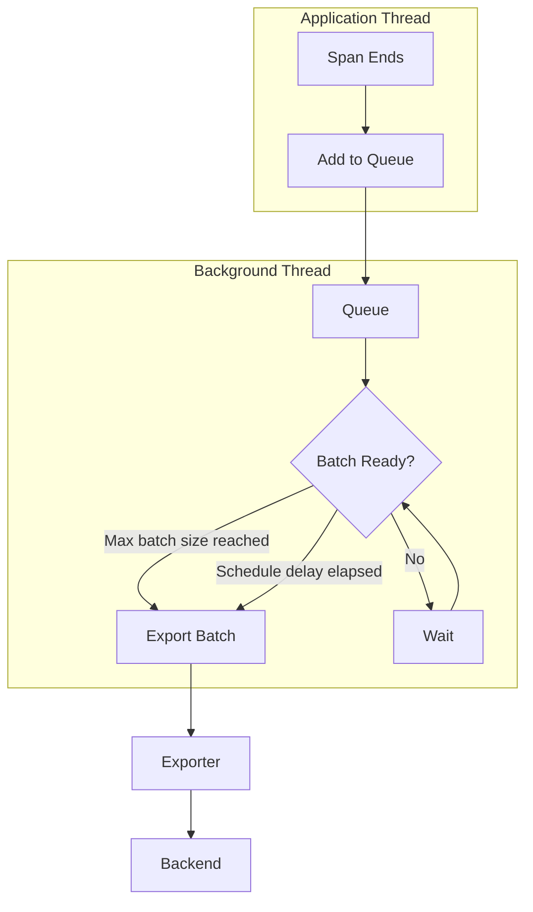
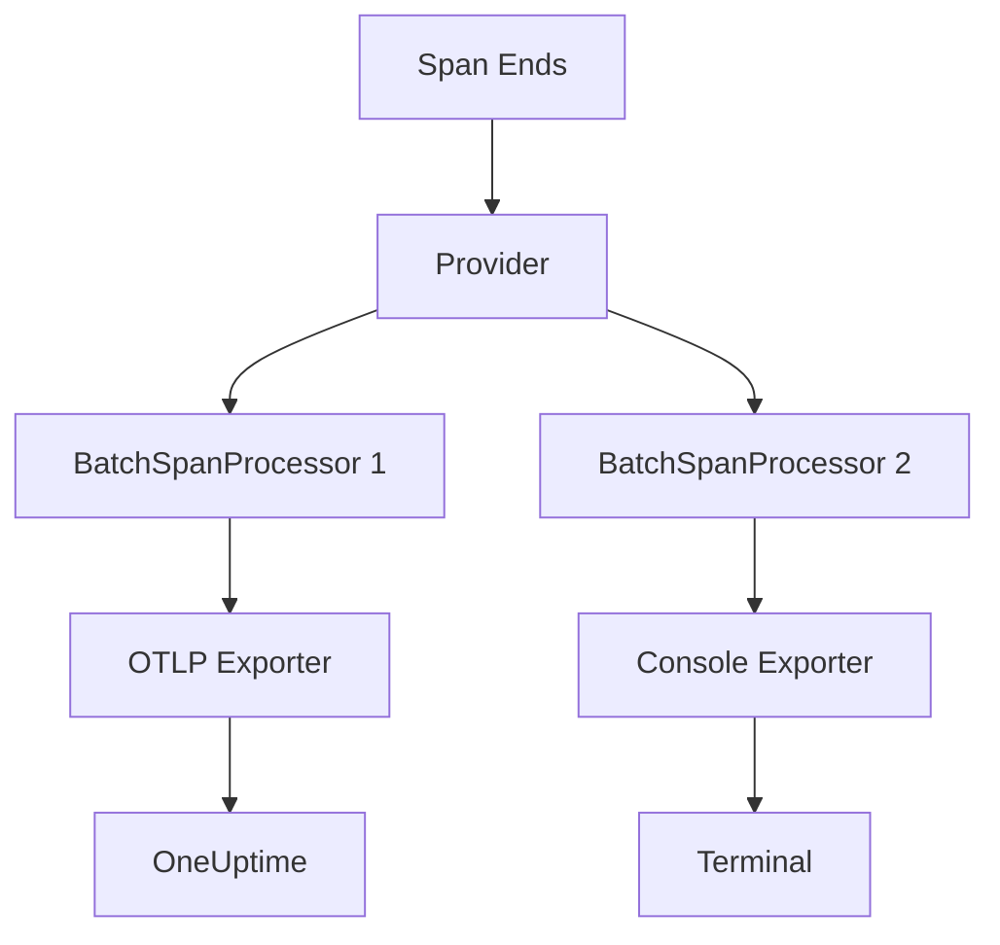

# How to Create OpenTelemetry Batch Span Processor

Author: [nawazdhandala](https://github.com/nawazdhandala)

Tags: OpenTelemetry, Tracing, Span-Processing, Performance

Description: Learn how to implement and configure an OpenTelemetry Batch Span Processor for efficient trace export with optimal performance and minimal overhead.

---

When instrumenting applications with OpenTelemetry, how you export spans directly impacts your application's performance. The **Batch Span Processor** is the recommended approach for production environments because it buffers spans and exports them in batches, reducing network overhead and minimizing the impact on your application's main thread.

This guide walks through everything you need to know about creating, configuring, and optimizing Batch Span Processors in your OpenTelemetry setup.

---

## Table of Contents

1. What is a Span Processor?
2. Simple vs Batch Span Processor
3. How the Batch Span Processor Works
4. Basic Implementation
5. Configuration Options
6. Advanced Patterns
7. Multiple Exporters
8. Error Handling and Retry Logic
9. Performance Tuning
10. Common Pitfalls
11. Production Best Practices

---

## 1. What is a Span Processor?

A Span Processor is a component in the OpenTelemetry SDK that sits between your instrumented code and the exporter. It processes spans after they end but before they are exported to your observability backend.

The span processor is responsible for deciding when and how spans are forwarded to the exporter, giving you control over batching, filtering, and processing behavior.


---

## 2. Simple vs Batch Span Processor

OpenTelemetry provides two built-in span processors.

| Feature | SimpleSpanProcessor | BatchSpanProcessor |
|---------|--------------------|--------------------|
| Export timing | Immediately on span end | Batched with configurable delay |
| Network calls | One per span | One per batch |
| Performance impact | Higher (blocking) | Lower (async batching) |
| Memory usage | Lower | Higher (buffers spans) |
| Use case | Development/debugging | Production |
| Span loss risk | Lower | Possible on crash |

The Simple Span Processor exports each span immediately when it ends. This is straightforward but creates significant overhead in production since every span triggers a network call.

The Batch Span Processor collects spans in a buffer and exports them in batches. This approach dramatically reduces network overhead and is the recommended choice for production deployments.

---

## 3. How the Batch Span Processor Works

The Batch Span Processor uses a queue-based architecture with a background export thread. Understanding this flow helps you configure it correctly.



The processor maintains an internal queue where spans are added as they complete. A background thread monitors this queue and triggers exports when either the maximum batch size is reached or the scheduled delay timer fires, whichever comes first.

---

## 4. Basic Implementation

Here is a complete setup for a Batch Span Processor in Node.js with TypeScript.

First, install the required dependencies.

```bash
npm install @opentelemetry/api \
            @opentelemetry/sdk-trace-node \
            @opentelemetry/sdk-trace-base \
            @opentelemetry/exporter-trace-otlp-http \
            @opentelemetry/resources \
            @opentelemetry/semantic-conventions
```

Create the telemetry configuration file.

```typescript
// telemetry.ts
import { NodeTracerProvider } from '@opentelemetry/sdk-trace-node';
import { BatchSpanProcessor } from '@opentelemetry/sdk-trace-base';
import { OTLPTraceExporter } from '@opentelemetry/exporter-trace-otlp-http';
import { Resource } from '@opentelemetry/resources';
import { SemanticResourceAttributes } from '@opentelemetry/semantic-conventions';

// Create the OTLP exporter
const exporter = new OTLPTraceExporter({
  url: process.env.OTEL_EXPORTER_OTLP_ENDPOINT || 'https://oneuptime.com/otlp/v1/traces',
  headers: {
    'x-oneuptime-token': process.env.ONEUPTIME_TOKEN || '',
  },
});

// Create the Batch Span Processor with default settings
const batchProcessor = new BatchSpanProcessor(exporter);

// Create the tracer provider with resource attributes
const provider = new NodeTracerProvider({
  resource: new Resource({
    [SemanticResourceAttributes.SERVICE_NAME]: 'my-service',
    [SemanticResourceAttributes.SERVICE_VERSION]: '1.0.0',
    [SemanticResourceAttributes.DEPLOYMENT_ENVIRONMENT]: process.env.NODE_ENV || 'development',
  }),
});

// Add the processor to the provider
provider.addSpanProcessor(batchProcessor);

// Register the provider globally
provider.register();

console.log('OpenTelemetry tracing initialized with BatchSpanProcessor');

// Graceful shutdown handler
process.on('SIGTERM', async () => {
  await provider.shutdown();
  console.log('Tracing terminated');
  process.exit(0);
});

export { provider };
```

---

## 5. Configuration Options

The Batch Span Processor accepts several configuration options that let you tune its behavior for your specific workload.

```typescript
import { BatchSpanProcessor } from '@opentelemetry/sdk-trace-base';
import { OTLPTraceExporter } from '@opentelemetry/exporter-trace-otlp-http';

const exporter = new OTLPTraceExporter({
  url: 'https://oneuptime.com/otlp/v1/traces',
});

const batchProcessor = new BatchSpanProcessor(exporter, {
  // Maximum number of spans per batch export
  maxExportBatchSize: 512,

  // Maximum time to wait before exporting (in milliseconds)
  scheduledDelayMillis: 5000,

  // Maximum time to wait for an export to complete (in milliseconds)
  exportTimeoutMillis: 30000,

  // Maximum queue size before dropping spans
  maxQueueSize: 2048,
});
```

Here is what each option controls.

| Option | Default | Description |
|--------|---------|-------------|
| maxExportBatchSize | 512 | Maximum spans per export batch |
| scheduledDelayMillis | 5000 | Time between batch exports |
| exportTimeoutMillis | 30000 | Timeout for export operations |
| maxQueueSize | 2048 | Max spans held in memory |

When the queue reaches `maxQueueSize`, new spans are dropped until space becomes available. This protects your application from memory exhaustion during traffic spikes.

---

## 6. Advanced Patterns

### Custom Span Processor Wrapper

You can create a custom processor that wraps the Batch Span Processor to add filtering or transformation logic.

```typescript
import {
  SpanProcessor,
  ReadableSpan,
  Span,
  BatchSpanProcessor
} from '@opentelemetry/sdk-trace-base';
import { Context } from '@opentelemetry/api';
import { OTLPTraceExporter } from '@opentelemetry/exporter-trace-otlp-http';

class FilteringBatchProcessor implements SpanProcessor {
  private batchProcessor: BatchSpanProcessor;
  private filter: (span: ReadableSpan) => boolean;

  constructor(
    exporter: OTLPTraceExporter,
    filter: (span: ReadableSpan) => boolean
  ) {
    this.batchProcessor = new BatchSpanProcessor(exporter);
    this.filter = filter;
  }

  onStart(span: Span, parentContext: Context): void {
    this.batchProcessor.onStart(span, parentContext);
  }

  onEnd(span: ReadableSpan): void {
    // Only process spans that pass the filter
    if (this.filter(span)) {
      this.batchProcessor.onEnd(span);
    }
  }

  shutdown(): Promise<void> {
    return this.batchProcessor.shutdown();
  }

  forceFlush(): Promise<void> {
    return this.batchProcessor.forceFlush();
  }
}

// Usage: Filter out health check spans
const exporter = new OTLPTraceExporter({ url: 'https://oneuptime.com/otlp/v1/traces' });
const processor = new FilteringBatchProcessor(
  exporter,
  (span) => !span.name.includes('healthz')
);
```

### Environment-Based Configuration

Configure the processor differently based on the deployment environment.

```typescript
import { BatchSpanProcessor, SimpleSpanProcessor } from '@opentelemetry/sdk-trace-base';
import { OTLPTraceExporter } from '@opentelemetry/exporter-trace-otlp-http';
import { ConsoleSpanExporter } from '@opentelemetry/sdk-trace-base';

function createSpanProcessor() {
  const env = process.env.NODE_ENV || 'development';

  if (env === 'development') {
    // In development, use console exporter with simple processor for immediate feedback
    return new SimpleSpanProcessor(new ConsoleSpanExporter());
  }

  // Production configuration with optimized batch settings
  const exporter = new OTLPTraceExporter({
    url: process.env.OTEL_EXPORTER_OTLP_ENDPOINT,
    headers: {
      'x-oneuptime-token': process.env.ONEUPTIME_TOKEN || '',
    },
  });

  return new BatchSpanProcessor(exporter, {
    maxExportBatchSize: parseInt(process.env.OTEL_BSP_MAX_EXPORT_BATCH_SIZE || '512'),
    scheduledDelayMillis: parseInt(process.env.OTEL_BSP_SCHEDULE_DELAY || '5000'),
    maxQueueSize: parseInt(process.env.OTEL_BSP_MAX_QUEUE_SIZE || '2048'),
    exportTimeoutMillis: parseInt(process.env.OTEL_BSP_EXPORT_TIMEOUT || '30000'),
  });
}
```

---

## 7. Multiple Exporters

You can use multiple Batch Span Processors to send spans to different backends simultaneously.

```typescript
import { NodeTracerProvider } from '@opentelemetry/sdk-trace-node';
import { BatchSpanProcessor, ConsoleSpanExporter } from '@opentelemetry/sdk-trace-base';
import { OTLPTraceExporter } from '@opentelemetry/exporter-trace-otlp-http';

const provider = new NodeTracerProvider();

// Primary exporter to OneUptime
const oneuptimeExporter = new OTLPTraceExporter({
  url: 'https://oneuptime.com/otlp/v1/traces',
  headers: { 'x-oneuptime-token': process.env.ONEUPTIME_TOKEN || '' },
});

// Secondary exporter for local debugging
const consoleExporter = new ConsoleSpanExporter();

// Add both processors
provider.addSpanProcessor(new BatchSpanProcessor(oneuptimeExporter, {
  maxExportBatchSize: 512,
  scheduledDelayMillis: 5000,
}));

provider.addSpanProcessor(new BatchSpanProcessor(consoleExporter, {
  maxExportBatchSize: 100,
  scheduledDelayMillis: 1000,
}));

provider.register();
```

The flow with multiple processors looks like this.



---

## 8. Error Handling and Retry Logic

The Batch Span Processor handles export failures gracefully, but you should implement additional error handling for production reliability.

```typescript
import { NodeTracerProvider } from '@opentelemetry/sdk-trace-node';
import { BatchSpanProcessor } from '@opentelemetry/sdk-trace-base';
import { OTLPTraceExporter } from '@opentelemetry/exporter-trace-otlp-http';
import { diag, DiagConsoleLogger, DiagLogLevel } from '@opentelemetry/api';

// Enable diagnostic logging to capture export errors
diag.setLogger(new DiagConsoleLogger(), DiagLogLevel.WARN);

// Create exporter with retry configuration
const exporter = new OTLPTraceExporter({
  url: 'https://oneuptime.com/otlp/v1/traces',
  headers: { 'x-oneuptime-token': process.env.ONEUPTIME_TOKEN || '' },
  // Timeout for individual export requests
  timeoutMillis: 10000,
});

const provider = new NodeTracerProvider();

const batchProcessor = new BatchSpanProcessor(exporter, {
  maxExportBatchSize: 512,
  scheduledDelayMillis: 5000,
  // Give exports enough time to complete with retries
  exportTimeoutMillis: 30000,
  // Large queue to buffer during temporary outages
  maxQueueSize: 4096,
});

provider.addSpanProcessor(batchProcessor);
provider.register();

// Periodic health check for the exporter
setInterval(async () => {
  try {
    await batchProcessor.forceFlush();
    console.log('Batch processor flush successful');
  } catch (error) {
    console.error('Batch processor flush failed:', error);
    // Implement alerting logic here
  }
}, 60000);
```

---

## 9. Performance Tuning

Choose your configuration based on your application's traffic patterns and requirements.

### High-Throughput Applications

For applications processing thousands of requests per second, optimize for throughput.

```typescript
const highThroughputProcessor = new BatchSpanProcessor(exporter, {
  // Larger batches reduce export overhead
  maxExportBatchSize: 1024,
  // Shorter delay to prevent queue buildup
  scheduledDelayMillis: 2000,
  // Large queue for traffic spikes
  maxQueueSize: 8192,
  // Allow time for large batch exports
  exportTimeoutMillis: 60000,
});
```

### Low-Latency Requirements

When you need spans to appear in your backend quickly.

```typescript
const lowLatencyProcessor = new BatchSpanProcessor(exporter, {
  // Smaller batches export faster
  maxExportBatchSize: 128,
  // Frequent exports for near real-time visibility
  scheduledDelayMillis: 1000,
  // Moderate queue size
  maxQueueSize: 2048,
  // Quick timeout to fail fast
  exportTimeoutMillis: 10000,
});
```

### Memory-Constrained Environments

For applications running in containers with limited memory.

```typescript
const memoryEfficientProcessor = new BatchSpanProcessor(exporter, {
  // Smaller batches use less memory per export
  maxExportBatchSize: 256,
  // More frequent exports to keep queue small
  scheduledDelayMillis: 3000,
  // Smaller queue to limit memory usage
  maxQueueSize: 1024,
  exportTimeoutMillis: 15000,
});
```

Here is a quick reference for tuning decisions.

| Scenario | Batch Size | Delay | Queue Size |
|----------|-----------|-------|------------|
| High throughput | 1024+ | 2-3s | 8192+ |
| Low latency | 128-256 | 1s | 2048 |
| Memory constrained | 256 | 3s | 1024 |
| Balanced default | 512 | 5s | 2048 |

---

## 10. Common Pitfalls

### Forgetting Graceful Shutdown

Spans in the queue are lost if you do not flush before shutdown.

```typescript
// Wrong: spans may be lost
process.exit(0);

// Correct: flush and shutdown properly
async function gracefulShutdown() {
  console.log('Shutting down...');

  // Force flush any pending spans
  await provider.forceFlush();

  // Shutdown the provider
  await provider.shutdown();

  console.log('Tracing shutdown complete');
  process.exit(0);
}

process.on('SIGTERM', gracefulShutdown);
process.on('SIGINT', gracefulShutdown);
```

### Queue Size Too Small

A small queue combined with high traffic leads to dropped spans.

```typescript
// Signs you need a larger queue:
// - Diagnostic logs show "span dropped" messages
// - Missing spans in traces during traffic spikes
// - Incomplete trace trees

// Monitor queue health with diagnostic logging
diag.setLogger(new DiagConsoleLogger(), DiagLogLevel.DEBUG);
```

### Export Timeout Too Short

If your backend is slow or network latency is high, exports may time out.

```typescript
// Symptoms of timeout issues:
// - Frequent "export timed out" errors
// - Spans accumulating in queue
// - Backend receives incomplete batches

// Solution: increase timeout and implement backpressure
const processor = new BatchSpanProcessor(exporter, {
  exportTimeoutMillis: 60000, // 60 seconds
  // Also consider reducing batch size if exports are timing out
  maxExportBatchSize: 256,
});
```

---

## 11. Production Best Practices

### Complete Production Setup

Here is a production-ready configuration combining all the best practices.

```typescript
// telemetry.ts
import { NodeTracerProvider } from '@opentelemetry/sdk-trace-node';
import { BatchSpanProcessor } from '@opentelemetry/sdk-trace-base';
import { OTLPTraceExporter } from '@opentelemetry/exporter-trace-otlp-http';
import { Resource } from '@opentelemetry/resources';
import { SemanticResourceAttributes } from '@opentelemetry/semantic-conventions';
import { diag, DiagConsoleLogger, DiagLogLevel } from '@opentelemetry/api';

// Enable diagnostics in non-production for debugging
if (process.env.NODE_ENV !== 'production') {
  diag.setLogger(new DiagConsoleLogger(), DiagLogLevel.INFO);
}

// Resource attributes for service identification
const resource = new Resource({
  [SemanticResourceAttributes.SERVICE_NAME]: process.env.OTEL_SERVICE_NAME || 'unknown-service',
  [SemanticResourceAttributes.SERVICE_VERSION]: process.env.SERVICE_VERSION || '0.0.0',
  [SemanticResourceAttributes.DEPLOYMENT_ENVIRONMENT]: process.env.NODE_ENV || 'development',
  [SemanticResourceAttributes.SERVICE_INSTANCE_ID]: process.env.HOSTNAME || 'unknown',
});

// Create the exporter
const exporter = new OTLPTraceExporter({
  url: process.env.OTEL_EXPORTER_OTLP_ENDPOINT || 'https://oneuptime.com/otlp/v1/traces',
  headers: {
    'x-oneuptime-token': process.env.ONEUPTIME_TOKEN || '',
  },
  timeoutMillis: 10000,
});

// Create provider with resource
const provider = new NodeTracerProvider({ resource });

// Configure batch processor based on environment
const batchProcessor = new BatchSpanProcessor(exporter, {
  maxExportBatchSize: parseInt(process.env.OTEL_BSP_MAX_EXPORT_BATCH_SIZE || '512'),
  scheduledDelayMillis: parseInt(process.env.OTEL_BSP_SCHEDULE_DELAY || '5000'),
  maxQueueSize: parseInt(process.env.OTEL_BSP_MAX_QUEUE_SIZE || '2048'),
  exportTimeoutMillis: parseInt(process.env.OTEL_BSP_EXPORT_TIMEOUT || '30000'),
});

provider.addSpanProcessor(batchProcessor);
provider.register();

// Graceful shutdown handling
let isShuttingDown = false;

async function shutdown() {
  if (isShuttingDown) return;
  isShuttingDown = true;

  console.log('Initiating graceful shutdown of tracing...');

  try {
    // Force flush with timeout
    await Promise.race([
      provider.forceFlush(),
      new Promise((_, reject) =>
        setTimeout(() => reject(new Error('Flush timeout')), 10000)
      ),
    ]);

    await provider.shutdown();
    console.log('Tracing shutdown complete');
  } catch (error) {
    console.error('Error during tracing shutdown:', error);
  }
}

process.on('SIGTERM', shutdown);
process.on('SIGINT', shutdown);
process.on('beforeExit', shutdown);

export { provider };
```

### Environment Variables Reference

Configure your deployment with these environment variables.

```bash
# Service identification
OTEL_SERVICE_NAME=checkout-service
SERVICE_VERSION=1.2.3

# Exporter configuration
OTEL_EXPORTER_OTLP_ENDPOINT=https://oneuptime.com/otlp/v1/traces
ONEUPTIME_TOKEN=your-token-here

# Batch processor tuning
OTEL_BSP_MAX_EXPORT_BATCH_SIZE=512
OTEL_BSP_SCHEDULE_DELAY=5000
OTEL_BSP_MAX_QUEUE_SIZE=2048
OTEL_BSP_EXPORT_TIMEOUT=30000
```

---

## Summary

The Batch Span Processor is essential for production OpenTelemetry deployments. It balances the need for comprehensive tracing data with application performance by batching spans before export.

| Key Point | Recommendation |
|-----------|----------------|
| Choose the right processor | Use BatchSpanProcessor in production, SimpleSpanProcessor only for development |
| Configure for your workload | Tune batch size, delay, and queue based on traffic patterns |
| Handle shutdown gracefully | Always flush and shutdown to avoid span loss |
| Monitor processor health | Enable diagnostics and watch for dropped spans |
| Use environment variables | Make configuration adjustable without code changes |

By implementing the Batch Span Processor correctly, you get reliable trace data without sacrificing application performance.

---

*Ready to visualize your traces? Send them to [OneUptime](https://oneuptime.com) via OTLP and get end-to-end observability with metrics, logs, and traces in one platform.*

---

**Related Reading:**

- [What are Traces and Spans in OpenTelemetry: A Practical Guide](https://oneuptime.com/blog/post/2025-08-27-traces-and-spans-in-opentelemetry/view)
- [How to reduce noise in OpenTelemetry](https://oneuptime.com/blog/post/2025-08-25-how-to-reduce-noise-in-opentelemetry/view)
- [What is OpenTelemetry Collector and Why Use One?](https://oneuptime.com/blog/post/2025-09-18-what-is-opentelemetry-collector-and-why-use-one/view)
