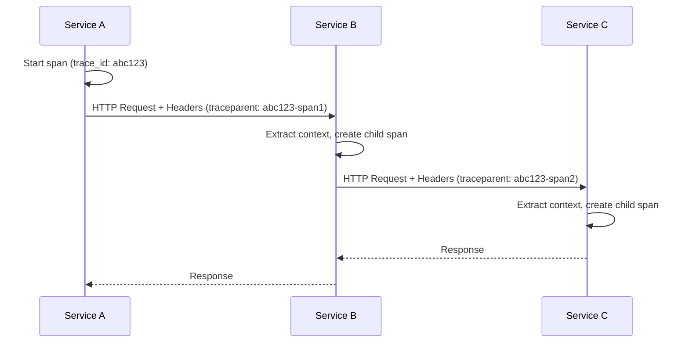
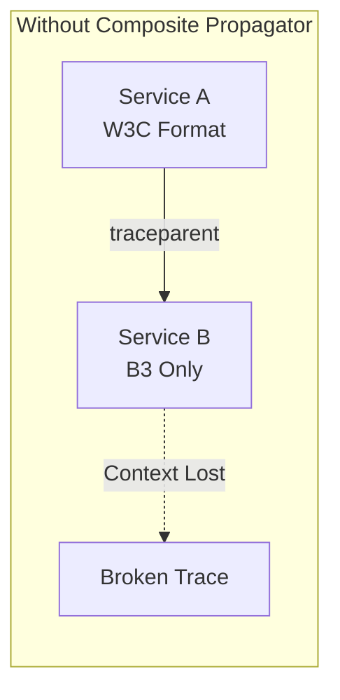
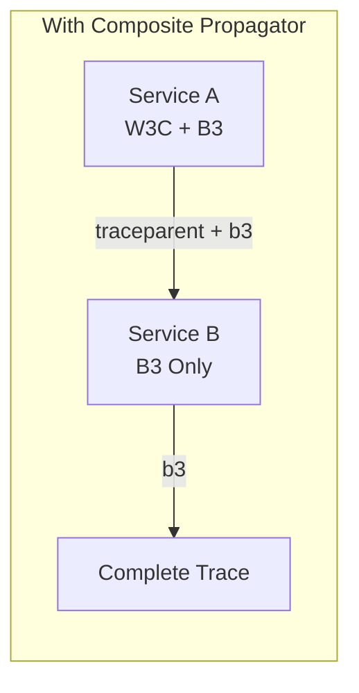
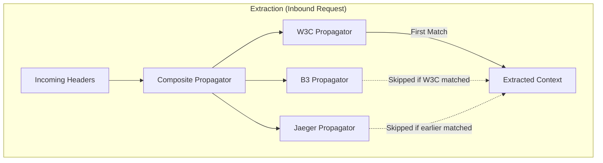
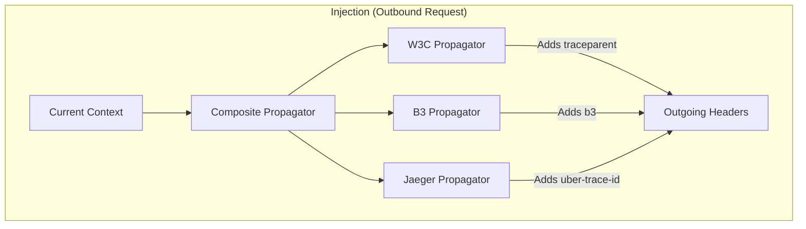
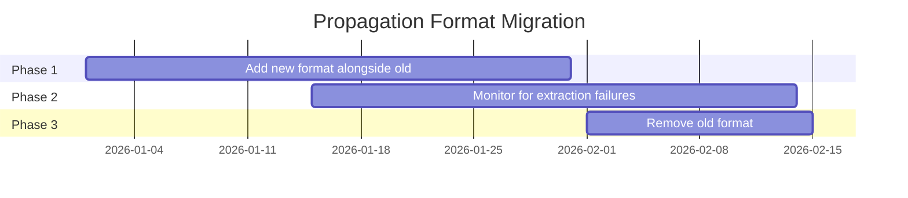

# How to Implement OpenTelemetry Composite Propagator

Author: [nawazdhandala](https://github.com/nawazdhandala)

Tags: OpenTelemetry, Tracing, Propagation, Context

Description: Learn how to combine multiple context propagation formats using OpenTelemetry's CompositePropagator for seamless distributed tracing across heterogeneous systems.

---

In distributed systems, context propagation is the mechanism that links spans across service boundaries, creating end-to-end traces. Different systems use different propagation formats: W3C Trace Context, B3 (Zipkin), Jaeger, AWS X-Ray, and others. When your infrastructure includes services that speak different propagation "languages," you need a way to understand and forward all of them.

This is where the **Composite Propagator** comes in. It allows you to combine multiple propagation formats into a single propagator, so your service can extract context from any supported format and inject it in all formats simultaneously.

---

## Table of Contents

1. What is Context Propagation?
2. Why You Need a Composite Propagator
3. How Composite Propagator Works
4. Setting Up Composite Propagator in Node.js
5. Setting Up Composite Propagator in Python
6. Common Propagation Formats
7. Production Configuration
8. Testing Your Propagation Setup
9. Troubleshooting Common Issues
10. Best Practices

---

## 1. What is Context Propagation?

Context propagation is the process of passing trace context (trace ID, span ID, sampling decision, and baggage) from one service to another. Without it, each service would create isolated traces, and you would lose the ability to see the complete journey of a request.

When Service A calls Service B over HTTP, the trace context is typically passed via HTTP headers. The receiving service extracts this context and uses it as the parent for any new spans it creates.



The headers used for this vary by format:

| Format | Headers |
|--------|---------|
| W3C Trace Context | `traceparent`, `tracestate` |
| B3 (Single) | `b3` |
| B3 (Multi) | `X-B3-TraceId`, `X-B3-SpanId`, `X-B3-Sampled`, `X-B3-ParentSpanId` |
| Jaeger | `uber-trace-id` |
| AWS X-Ray | `X-Amzn-Trace-Id` |

---

## 2. Why You Need a Composite Propagator

In real-world architectures, you rarely control every service. Consider these scenarios:

**Multi-vendor environment**: Your Node.js services use W3C Trace Context, but you integrate with a third-party service that only understands B3.

**Migration in progress**: You are migrating from Jaeger to an OpenTelemetry-native backend, and during the transition, some services still use the Jaeger format.

**Heterogeneous stack**: Your Python services emit B3 headers, your Go services use W3C, and your Java services are configured for Jaeger.

Without a composite propagator, traces would break at service boundaries where formats do not match.





---

## 3. How Composite Propagator Works

The Composite Propagator wraps multiple individual propagators and delegates to each one during extraction and injection.

**During extraction** (receiving a request):
- The composite propagator tries each child propagator in order
- The first propagator that successfully extracts context wins
- This allows your service to understand any supported format

**During injection** (making an outbound request):
- The composite propagator calls ALL child propagators
- Each propagator adds its headers to the outgoing request
- This ensures downstream services can read the context regardless of their format

Here is a visual representation of this flow.





---

## 4. Setting Up Composite Propagator in Node.js

First, install the required packages.

```bash
npm install @opentelemetry/api \
  @opentelemetry/sdk-node \
  @opentelemetry/core \
  @opentelemetry/propagator-b3 \
  @opentelemetry/propagator-jaeger \
  @opentelemetry/exporter-trace-otlp-http
```

Create a telemetry configuration file that sets up the composite propagator.

```typescript
// telemetry.ts
import { NodeSDK } from '@opentelemetry/sdk-node';
import { getNodeAutoInstrumentations } from '@opentelemetry/auto-instrumentations-node';
import { OTLPTraceExporter } from '@opentelemetry/exporter-trace-otlp-http';
import { Resource } from '@opentelemetry/resources';
import { SemanticResourceAttributes } from '@opentelemetry/semantic-conventions';

// Import propagators
import {
  CompositePropagator,
  W3CTraceContextPropagator,
  W3CBaggagePropagator,
} from '@opentelemetry/core';
import { B3Propagator, B3InjectEncoding } from '@opentelemetry/propagator-b3';
import { JaegerPropagator } from '@opentelemetry/propagator-jaeger';

// Create the composite propagator with multiple formats
const compositePropagator = new CompositePropagator({
  propagators: [
    // W3C Trace Context (recommended default)
    new W3CTraceContextPropagator(),
    // W3C Baggage for arbitrary key-value pairs
    new W3CBaggagePropagator(),
    // B3 format (used by Zipkin and many legacy systems)
    new B3Propagator({
      injectEncoding: B3InjectEncoding.MULTI_HEADER,
    }),
    // Jaeger format (for Jaeger-native systems)
    new JaegerPropagator(),
  ],
});

// Configure the trace exporter
const traceExporter = new OTLPTraceExporter({
  url: process.env.OTEL_EXPORTER_OTLP_ENDPOINT || 'http://localhost:4318/v1/traces',
});

// Initialize the SDK with the composite propagator
export const sdk = new NodeSDK({
  resource: new Resource({
    [SemanticResourceAttributes.SERVICE_NAME]: process.env.SERVICE_NAME || 'my-service',
    [SemanticResourceAttributes.SERVICE_VERSION]: process.env.SERVICE_VERSION || '1.0.0',
  }),
  traceExporter,
  // Register the composite propagator
  textMapPropagator: compositePropagator,
  instrumentations: [getNodeAutoInstrumentations()],
});

export async function startTelemetry(): Promise<void> {
  await sdk.start();
  console.log('OpenTelemetry initialized with composite propagator');
}

export async function shutdownTelemetry(): Promise<void> {
  await sdk.shutdown();
}
```

Load the telemetry configuration before any other imports in your application entry point.

```typescript
// index.ts
import { startTelemetry, shutdownTelemetry } from './telemetry';

async function main() {
  await startTelemetry();

  // Now import and start your application
  const { startServer } = await import('./server');
  await startServer();
}

// Graceful shutdown
process.on('SIGTERM', async () => {
  await shutdownTelemetry();
  process.exit(0);
});

main().catch(console.error);
```

---

## 5. Setting Up Composite Propagator in Python

Install the required packages.

```bash
pip install opentelemetry-api \
  opentelemetry-sdk \
  opentelemetry-propagator-b3 \
  opentelemetry-propagator-jaeger \
  opentelemetry-exporter-otlp
```

Configure the composite propagator in Python.

```python
# telemetry.py
from opentelemetry import trace
from opentelemetry.sdk.trace import TracerProvider
from opentelemetry.sdk.trace.export import BatchSpanProcessor
from opentelemetry.exporter.otlp.proto.http.trace_exporter import OTLPSpanExporter
from opentelemetry.sdk.resources import Resource, SERVICE_NAME, SERVICE_VERSION

# Import propagators
from opentelemetry import propagate
from opentelemetry.propagators.composite import CompositePropagator
from opentelemetry.trace.propagation.tracecontext import TraceContextTextMapPropagator
from opentelemetry.baggage.propagation import W3CBaggagePropagator
from opentelemetry.propagators.b3 import B3MultiFormat
from opentelemetry.propagators.jaeger import JaegerPropagator

import os


def configure_telemetry():
    # Create resource with service information
    resource = Resource.create({
        SERVICE_NAME: os.getenv("SERVICE_NAME", "my-python-service"),
        SERVICE_VERSION: os.getenv("SERVICE_VERSION", "1.0.0"),
    })

    # Set up the tracer provider
    provider = TracerProvider(resource=resource)

    # Configure the OTLP exporter
    exporter = OTLPSpanExporter(
        endpoint=os.getenv("OTEL_EXPORTER_OTLP_ENDPOINT", "http://localhost:4318/v1/traces")
    )

    # Use batch processor for efficiency
    provider.add_span_processor(BatchSpanProcessor(exporter))

    # Register the tracer provider
    trace.set_tracer_provider(provider)

    # Create composite propagator with multiple formats
    composite_propagator = CompositePropagator([
        TraceContextTextMapPropagator(),  # W3C Trace Context
        W3CBaggagePropagator(),           # W3C Baggage
        B3MultiFormat(),                   # B3 Multi-header format
        JaegerPropagator(),               # Jaeger format
    ])

    # Set the composite propagator as the global propagator
    propagate.set_global_textmap(composite_propagator)

    print("OpenTelemetry initialized with composite propagator")


def shutdown_telemetry():
    provider = trace.get_tracer_provider()
    if hasattr(provider, 'shutdown'):
        provider.shutdown()
```

Use the configuration in your Flask or FastAPI application.

```python
# app.py
from flask import Flask
from telemetry import configure_telemetry, shutdown_telemetry
import atexit

# Configure telemetry before creating the app
configure_telemetry()

app = Flask(__name__)

# Register shutdown handler
atexit.register(shutdown_telemetry)

@app.route('/health')
def health():
    return {'status': 'healthy'}

if __name__ == '__main__':
    app.run(host='0.0.0.0', port=8080)
```

---

## 6. Common Propagation Formats

Understanding each format helps you decide which ones to include in your composite propagator.

### W3C Trace Context

The W3C Trace Context is the official standard and should be your default choice. It uses two headers.

| Header | Example | Purpose |
|--------|---------|---------|
| `traceparent` | `00-0af7651916cd43dd8448eb211c80319c-b7ad6b7169203331-01` | Contains version, trace ID, span ID, and flags |
| `tracestate` | `vendor1=value1,vendor2=value2` | Vendor-specific trace data |

The traceparent format breakdown.

```
00-0af7651916cd43dd8448eb211c80319c-b7ad6b7169203331-01
|  |                                |                |
|  |                                |                +-- Flags (01 = sampled)
|  |                                +------------------- Span ID (16 hex chars)
|  +---------------------------------------------------- Trace ID (32 hex chars)
+------------------------------------------------------- Version (00)
```

### B3 Propagation

B3 comes in two flavors: single header and multi-header.

**Single Header Format:**
```
b3: {TraceId}-{SpanId}-{SamplingState}-{ParentSpanId}
b3: 80f198ee56343ba864fe8b2a57d3eff7-e457b5a2e4d86bd1-1-05e3ac9a4f6e3b90
```

**Multi-Header Format:**
```
X-B3-TraceId: 80f198ee56343ba864fe8b2a57d3eff7
X-B3-SpanId: e457b5a2e4d86bd1
X-B3-ParentSpanId: 05e3ac9a4f6e3b90
X-B3-Sampled: 1
```

### Jaeger Propagation

Jaeger uses a single header with a colon-separated format.

```
uber-trace-id: {trace-id}:{span-id}:{parent-span-id}:{flags}
uber-trace-id: 0af7651916cd43dd8448eb211c80319c:b7ad6b7169203331:0:1
```

---

## 7. Production Configuration

For production environments, consider these configurations.

### Controlling Propagator Order

The order of propagators matters for extraction. Place more specific or preferred formats first.

```typescript
// If you want to prefer B3 over W3C during extraction
const compositePropagator = new CompositePropagator({
  propagators: [
    new B3Propagator(), // Checked first
    new W3CTraceContextPropagator(), // Fallback
  ],
});
```

### Selective Injection

Sometimes you want to inject only specific formats. You can create a custom propagator wrapper.

```typescript
import { TextMapPropagator, Context, TextMapSetter, TextMapGetter } from '@opentelemetry/api';

class SelectiveCompositePropagator implements TextMapPropagator {
  private extractPropagators: TextMapPropagator[];
  private injectPropagators: TextMapPropagator[];

  constructor(
    extractPropagators: TextMapPropagator[],
    injectPropagators: TextMapPropagator[]
  ) {
    this.extractPropagators = extractPropagators;
    this.injectPropagators = injectPropagators;
  }

  inject(context: Context, carrier: unknown, setter: TextMapSetter): void {
    for (const propagator of this.injectPropagators) {
      propagator.inject(context, carrier, setter);
    }
  }

  extract(context: Context, carrier: unknown, getter: TextMapGetter): Context {
    for (const propagator of this.extractPropagators) {
      context = propagator.extract(context, carrier, getter);
    }
    return context;
  }

  fields(): string[] {
    const fields = new Set<string>();
    for (const propagator of [...this.extractPropagators, ...this.injectPropagators]) {
      for (const field of propagator.fields()) {
        fields.add(field);
      }
    }
    return Array.from(fields);
  }
}

// Usage: Extract from all formats, but only inject W3C
const propagator = new SelectiveCompositePropagator(
  [new W3CTraceContextPropagator(), new B3Propagator(), new JaegerPropagator()],
  [new W3CTraceContextPropagator()] // Only inject W3C
);
```

### Environment-based Configuration

Configure propagators based on environment variables.

```typescript
function createPropagator(): TextMapPropagator {
  const formats = (process.env.OTEL_PROPAGATORS || 'tracecontext,baggage').split(',');
  const propagators: TextMapPropagator[] = [];

  for (const format of formats) {
    switch (format.trim().toLowerCase()) {
      case 'tracecontext':
        propagators.push(new W3CTraceContextPropagator());
        break;
      case 'baggage':
        propagators.push(new W3CBaggagePropagator());
        break;
      case 'b3':
      case 'b3multi':
        propagators.push(new B3Propagator({ injectEncoding: B3InjectEncoding.MULTI_HEADER }));
        break;
      case 'b3single':
        propagators.push(new B3Propagator({ injectEncoding: B3InjectEncoding.SINGLE_HEADER }));
        break;
      case 'jaeger':
        propagators.push(new JaegerPropagator());
        break;
      default:
        console.warn(`Unknown propagator format: ${format}`);
    }
  }

  return new CompositePropagator({ propagators });
}
```

---

## 8. Testing Your Propagation Setup

Verify that your composite propagator is working correctly.

### Unit Test Example

```typescript
import { context, trace, propagation } from '@opentelemetry/api';
import { CompositePropagator, W3CTraceContextPropagator } from '@opentelemetry/core';
import { B3Propagator } from '@opentelemetry/propagator-b3';

describe('CompositePropagator', () => {
  const compositePropagator = new CompositePropagator({
    propagators: [
      new W3CTraceContextPropagator(),
      new B3Propagator(),
    ],
  });

  beforeAll(() => {
    propagation.setGlobalPropagator(compositePropagator);
  });

  it('should inject both W3C and B3 headers', () => {
    const tracer = trace.getTracer('test');
    const span = tracer.startSpan('test-span');
    const ctx = trace.setSpan(context.active(), span);

    const carrier: Record<string, string> = {};
    propagation.inject(ctx, carrier);

    // Verify W3C headers
    expect(carrier['traceparent']).toBeDefined();
    expect(carrier['traceparent']).toMatch(/^00-[a-f0-9]{32}-[a-f0-9]{16}-0[01]$/);

    // Verify B3 headers
    expect(carrier['x-b3-traceid']).toBeDefined();
    expect(carrier['x-b3-spanid']).toBeDefined();

    span.end();
  });

  it('should extract context from B3 headers', () => {
    const carrier = {
      'x-b3-traceid': '80f198ee56343ba864fe8b2a57d3eff7',
      'x-b3-spanid': 'e457b5a2e4d86bd1',
      'x-b3-sampled': '1',
    };

    const extractedContext = propagation.extract(context.active(), carrier);
    const spanContext = trace.getSpanContext(extractedContext);

    expect(spanContext).toBeDefined();
    expect(spanContext?.traceId).toBe('80f198ee56343ba864fe8b2a57d3eff7');
    expect(spanContext?.spanId).toBe('e457b5a2e4d86bd1');
  });

  it('should extract context from W3C headers', () => {
    const carrier = {
      'traceparent': '00-0af7651916cd43dd8448eb211c80319c-b7ad6b7169203331-01',
    };

    const extractedContext = propagation.extract(context.active(), carrier);
    const spanContext = trace.getSpanContext(extractedContext);

    expect(spanContext).toBeDefined();
    expect(spanContext?.traceId).toBe('0af7651916cd43dd8448eb211c80319c');
    expect(spanContext?.spanId).toBe('b7ad6b7169203331');
  });
});
```

### Integration Test with HTTP

```typescript
import express from 'express';
import fetch from 'node-fetch';
import { trace, context, propagation } from '@opentelemetry/api';

const app = express();

app.get('/test', (req, res) => {
  // Log received headers for debugging
  console.log('Received headers:', {
    traceparent: req.headers['traceparent'],
    'x-b3-traceid': req.headers['x-b3-traceid'],
    'uber-trace-id': req.headers['uber-trace-id'],
  });

  const span = trace.getActiveSpan();
  const spanContext = span?.spanContext();

  res.json({
    traceId: spanContext?.traceId,
    spanId: spanContext?.spanId,
    receivedHeaders: {
      traceparent: req.headers['traceparent'],
      b3TraceId: req.headers['x-b3-traceid'],
      jaeger: req.headers['uber-trace-id'],
    },
  });
});

// Test by making a request with different header formats
async function testPropagation() {
  // Test with B3 headers
  const response = await fetch('http://localhost:3000/test', {
    headers: {
      'x-b3-traceid': '80f198ee56343ba864fe8b2a57d3eff7',
      'x-b3-spanid': 'e457b5a2e4d86bd1',
      'x-b3-sampled': '1',
    },
  });

  const data = await response.json();
  console.log('Response:', data);

  // The service should have extracted the B3 context
  // and the traceId should match what we sent
}
```

---

## 9. Troubleshooting Common Issues

### Context Not Being Extracted

**Symptom**: Downstream service creates a new trace instead of continuing the existing one.

**Possible causes and solutions**:

1. **Header case sensitivity**: HTTP/2 lowercases all headers. Ensure your propagator handles both cases.

2. **Propagator order**: The extraction stops at the first successful propagator. If you have multiple formats in the headers, ensure the correct propagator is listed first.

3. **Missing propagator registration**: Verify that `propagation.setGlobalPropagator()` was called, or that the SDK was initialized with the composite propagator.

```typescript
// Debug: Check what propagator is registered
import { propagation } from '@opentelemetry/api';
console.log('Current propagator fields:', propagation.fields());
```

### Duplicate Headers

**Symptom**: Outgoing requests have both single and multi-header B3 formats.

**Solution**: Configure B3Propagator with a specific encoding.

```typescript
// Choose one encoding
new B3Propagator({ injectEncoding: B3InjectEncoding.MULTI_HEADER })
// OR
new B3Propagator({ injectEncoding: B3InjectEncoding.SINGLE_HEADER })
```

### Invalid Trace IDs

**Symptom**: Trace ID appears as all zeros (`00000000000000000000000000000000`).

**Possible causes**:

1. Context was extracted but no valid span context was found
2. The trace ID format in the header is invalid
3. Extraction happened on an empty context

```typescript
// Debug: Check the extracted context
const extractedContext = propagation.extract(context.active(), headers);
const spanContext = trace.getSpanContext(extractedContext);
console.log('Extracted span context:', spanContext);
console.log('Is valid:', spanContext && trace.isSpanContextValid(spanContext));
```

---

## 10. Best Practices

### 1. Start with W3C Trace Context

Use W3C Trace Context as your primary format. It is the official standard with broad support.

```typescript
const propagators = [
  new W3CTraceContextPropagator(), // Primary
  new W3CBaggagePropagator(),      // For baggage support
  // Add legacy formats only if needed
];
```

### 2. Include Baggage Propagator

Baggage allows you to pass arbitrary key-value pairs across service boundaries. Always include it alongside trace context.

```typescript
import { propagation, context } from '@opentelemetry/api';
import { W3CBaggagePropagator } from '@opentelemetry/core';

// Set baggage
const baggage = propagation.createBaggage({
  'user.id': { value: '12345' },
  'tenant.id': { value: 'acme-corp' },
});
const ctxWithBaggage = propagation.setBaggage(context.active(), baggage);

// Baggage will be propagated to downstream services
```

### 3. Document Your Propagation Strategy

Make it clear which formats your services support. This helps when debugging cross-service trace issues.

```yaml
# In your service documentation or README
opentelemetry:
  propagators:
    - tracecontext  # W3C Trace Context (primary)
    - baggage       # W3C Baggage
    - b3multi       # B3 Multi-header (for Zipkin compatibility)
```

### 4. Monitor Propagation Failures

Log warnings when context extraction fails to help identify misconfigured services.

```typescript
// Custom propagator wrapper with logging
class LoggingCompositePropagator implements TextMapPropagator {
  private delegate: CompositePropagator;
  private logger: Logger;

  extract(context: Context, carrier: unknown, getter: TextMapGetter): Context {
    const extractedContext = this.delegate.extract(context, carrier, getter);
    const spanContext = trace.getSpanContext(extractedContext);

    if (!spanContext || !trace.isSpanContextValid(spanContext)) {
      this.logger.debug('No valid trace context extracted', {
        availableHeaders: this.delegate.fields().filter(
          f => getter.get(carrier, f) !== undefined
        ),
      });
    }

    return extractedContext;
  }

  // ... inject and fields methods
}
```

### 5. Plan for Migration

When migrating between formats, run both old and new formats simultaneously, then gradually remove the old format.



---

## Summary

| Concept | Description |
|---------|-------------|
| **Composite Propagator** | Combines multiple propagation formats into one |
| **Extraction** | Tries each propagator until one succeeds |
| **Injection** | Calls all propagators to add headers |
| **W3C Trace Context** | Recommended default format |
| **B3 / Jaeger** | Include for legacy system compatibility |

The Composite Propagator is essential for maintaining trace continuity across heterogeneous distributed systems. By combining multiple propagation formats, you ensure that no matter which format a service uses, the trace context flows through seamlessly.

---

*Want to visualize traces from your multi-format environment? [OneUptime](https://oneuptime.com) accepts traces via OTLP from any OpenTelemetry-instrumented service, regardless of propagation format.*

---

### See Also

- [What are Traces and Spans in OpenTelemetry](/blog/post/2025-08-27-traces-and-spans-in-opentelemetry/view) - Understand the fundamentals of distributed tracing.
- [How to Instrument Express.js Applications with OpenTelemetry](/blog/post/2026-01-06-nodejs-express-opentelemetry-instrumentation/view) - Apply these concepts to Express.js applications.
- [How to Structure Logs Properly in OpenTelemetry](/blog/post/2025-08-28-how-to-structure-logs-properly-in-opentelemetry/view) - Correlate logs with your distributed traces.
