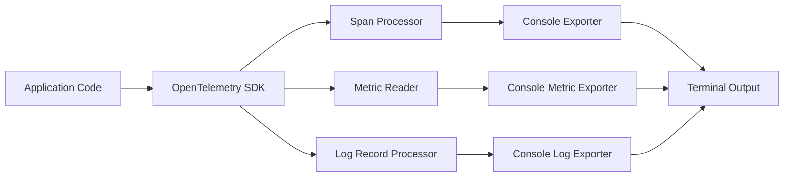
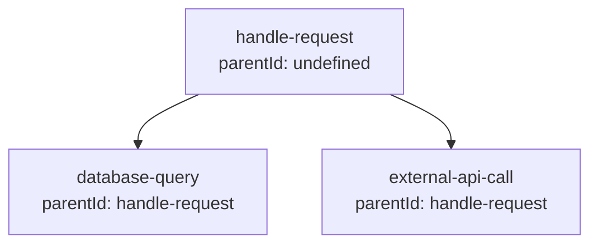

# How to Implement OpenTelemetry Console Exporter

Author: [nawazdhandala](https://github.com/nawazdhandala)

Tags: OpenTelemetry, Observability, Tracing, Debugging

Description: Learn how to use the OpenTelemetry Console Exporter to debug and validate your instrumentation by printing traces, metrics, and logs directly to the terminal.

---

When you are setting up OpenTelemetry instrumentation, you need a way to verify that your spans, metrics, and logs are being generated correctly before sending them to a production backend. The Console Exporter is the simplest tool for this purpose. It prints telemetry data directly to your terminal, making it easy to debug instrumentation issues and understand the structure of your telemetry.

## Why Use the Console Exporter?

The Console Exporter serves several important purposes during development and debugging:

- **Immediate feedback**: See telemetry data instantly without setting up external infrastructure
- **Instrumentation validation**: Verify that spans are created with correct names, attributes, and relationships
- **Local development**: Work without network dependencies or external services
- **Learning tool**: Understand how OpenTelemetry structures traces, metrics, and logs

## Architecture Overview

The following diagram shows how the Console Exporter fits into the OpenTelemetry pipeline.



## Installation

Install the required OpenTelemetry packages for Node.js.

```bash
npm install @opentelemetry/api \
  @opentelemetry/sdk-node \
  @opentelemetry/sdk-trace-node \
  @opentelemetry/sdk-metrics \
  @opentelemetry/exporter-trace-otlp-http \
  @opentelemetry/resources \
  @opentelemetry/semantic-conventions
```

The SDK packages include the Console Exporter by default, so no additional installation is needed for basic console output.

## Basic Setup for Traces

Create a file called `tracing.js` that configures the Console Exporter for traces.

```javascript
const { NodeSDK } = require('@opentelemetry/sdk-node');
const { ConsoleSpanExporter } = require('@opentelemetry/sdk-trace-node');
const { SimpleSpanProcessor } = require('@opentelemetry/sdk-trace-base');
const { Resource } = require('@opentelemetry/resources');
const { SemanticResourceAttributes } = require('@opentelemetry/semantic-conventions');

// Create the Console Exporter
const consoleExporter = new ConsoleSpanExporter();

// Initialize the SDK with the Console Exporter
const sdk = new NodeSDK({
  resource: new Resource({
    [SemanticResourceAttributes.SERVICE_NAME]: 'my-service',
    [SemanticResourceAttributes.SERVICE_VERSION]: '1.0.0',
  }),
  // Use SimpleSpanProcessor for immediate output during debugging
  spanProcessor: new SimpleSpanProcessor(consoleExporter),
});

sdk.start();

// Graceful shutdown
process.on('SIGTERM', () => {
  sdk.shutdown()
    .then(() => console.log('SDK shut down successfully'))
    .catch((error) => console.error('Error shutting down SDK', error))
    .finally(() => process.exit(0));
});

module.exports = sdk;
```

## Creating and Viewing Spans

Here is an example application that creates spans and outputs them to the console.

```javascript
// Load tracing configuration first
require('./tracing');

const { trace, SpanStatusCode } = require('@opentelemetry/api');

// Get a tracer instance
const tracer = trace.getTracer('example-tracer', '1.0.0');

// Create a simple span
function processOrder(orderId) {
  const span = tracer.startSpan('process-order', {
    attributes: {
      'order.id': orderId,
      'order.type': 'standard',
    },
  });

  try {
    // Simulate some work
    console.log(`Processing order ${orderId}`);

    // Add an event to mark a milestone
    span.addEvent('validation-complete', {
      'validation.checks': 5,
      'validation.passed': true,
    });

    // Set the status to OK
    span.setStatus({ code: SpanStatusCode.OK });
  } catch (error) {
    span.recordException(error);
    span.setStatus({
      code: SpanStatusCode.ERROR,
      message: error.message,
    });
  } finally {
    span.end();
  }
}

// Run the example
processOrder('ORD-12345');
```

## Console Output Structure

When you run the application, the Console Exporter outputs span data in a structured format.

```json
{
  "traceId": "abc123def456789...",
  "parentId": undefined,
  "name": "process-order",
  "id": "span123456...",
  "kind": 0,
  "timestamp": 1706659200000000,
  "duration": 5234,
  "attributes": {
    "order.id": "ORD-12345",
    "order.type": "standard"
  },
  "status": { "code": 1 },
  "events": [
    {
      "name": "validation-complete",
      "attributes": {
        "validation.checks": 5,
        "validation.passed": true
      },
      "time": [1706659200, 123456789]
    }
  ],
  "links": []
}
```

## Tracing Nested Operations

The Console Exporter helps you verify that parent-child relationships between spans are correct.

```javascript
const { trace, context } = require('@opentelemetry/api');

const tracer = trace.getTracer('nested-example');

async function handleRequest() {
  // Parent span
  return tracer.startActiveSpan('handle-request', async (parentSpan) => {
    try {
      // Child span for database operation
      await tracer.startActiveSpan('database-query', async (dbSpan) => {
        dbSpan.setAttribute('db.system', 'postgresql');
        dbSpan.setAttribute('db.operation', 'SELECT');

        // Simulate database work
        await new Promise(resolve => setTimeout(resolve, 50));

        dbSpan.end();
      });

      // Another child span for external API call
      await tracer.startActiveSpan('external-api-call', async (apiSpan) => {
        apiSpan.setAttribute('http.method', 'GET');
        apiSpan.setAttribute('http.url', 'https://api.example.com/data');

        // Simulate API call
        await new Promise(resolve => setTimeout(resolve, 100));

        apiSpan.end();
      });

      parentSpan.setStatus({ code: SpanStatusCode.OK });
    } finally {
      parentSpan.end();
    }
  });
}

handleRequest();
```

The console output shows each span with its `parentId`, allowing you to verify the trace hierarchy.



## Console Exporter for Metrics

You can also export metrics to the console for debugging.

```javascript
const { MeterProvider, PeriodicExportingMetricReader, ConsoleMetricExporter } = require('@opentelemetry/sdk-metrics');
const { Resource } = require('@opentelemetry/resources');
const { SemanticResourceAttributes } = require('@opentelemetry/semantic-conventions');

// Create the Console Metric Exporter
const consoleMetricExporter = new ConsoleMetricExporter();

// Create a Meter Provider with the Console Exporter
const meterProvider = new MeterProvider({
  resource: new Resource({
    [SemanticResourceAttributes.SERVICE_NAME]: 'my-service',
  }),
});

// Add a metric reader that exports to console every 10 seconds
meterProvider.addMetricReader(
  new PeriodicExportingMetricReader({
    exporter: consoleMetricExporter,
    exportIntervalMillis: 10000,
  })
);

// Get a meter and create metrics
const meter = meterProvider.getMeter('example-meter');

// Create a counter
const requestCounter = meter.createCounter('http_requests_total', {
  description: 'Total number of HTTP requests',
});

// Create a histogram
const requestDuration = meter.createHistogram('http_request_duration_ms', {
  description: 'HTTP request duration in milliseconds',
  unit: 'ms',
});

// Record some metrics
requestCounter.add(1, { method: 'GET', route: '/api/users' });
requestCounter.add(1, { method: 'POST', route: '/api/orders' });
requestDuration.record(45, { method: 'GET', route: '/api/users' });
requestDuration.record(120, { method: 'POST', route: '/api/orders' });
```

## Combining Multiple Exporters

In development, you might want to send telemetry to both the console and a backend. Here is how to configure multiple exporters.

```javascript
const { NodeSDK } = require('@opentelemetry/sdk-node');
const { ConsoleSpanExporter, SimpleSpanProcessor, BatchSpanProcessor } = require('@opentelemetry/sdk-trace-node');
const { OTLPTraceExporter } = require('@opentelemetry/exporter-trace-otlp-http');
const { Resource } = require('@opentelemetry/resources');
const { SemanticResourceAttributes } = require('@opentelemetry/semantic-conventions');

// Console exporter for local debugging
const consoleExporter = new ConsoleSpanExporter();

// OTLP exporter for sending to a backend (like OneUptime)
const otlpExporter = new OTLPTraceExporter({
  url: process.env.OTEL_EXPORTER_OTLP_ENDPOINT || 'http://localhost:4318/v1/traces',
});

const sdk = new NodeSDK({
  resource: new Resource({
    [SemanticResourceAttributes.SERVICE_NAME]: 'my-service',
  }),
});

// Manually add multiple span processors
const provider = sdk.getTracerProvider();

// Use SimpleSpanProcessor for console (immediate output)
provider.addSpanProcessor(new SimpleSpanProcessor(consoleExporter));

// Use BatchSpanProcessor for OTLP (efficient batching)
provider.addSpanProcessor(new BatchSpanProcessor(otlpExporter));

sdk.start();
```

## Environment-Based Configuration

A practical approach is to enable the Console Exporter only in development.

```javascript
const { NodeSDK } = require('@opentelemetry/sdk-node');
const { ConsoleSpanExporter, SimpleSpanProcessor, BatchSpanProcessor } = require('@opentelemetry/sdk-trace-node');
const { OTLPTraceExporter } = require('@opentelemetry/exporter-trace-otlp-http');
const { Resource } = require('@opentelemetry/resources');
const { SemanticResourceAttributes } = require('@opentelemetry/semantic-conventions');

const isDevelopment = process.env.NODE_ENV !== 'production';
const enableConsoleExporter = process.env.OTEL_CONSOLE_EXPORTER === 'true' || isDevelopment;

// Configure exporters based on environment
const spanProcessors = [];

if (enableConsoleExporter) {
  console.log('Console Exporter enabled for debugging');
  spanProcessors.push(new SimpleSpanProcessor(new ConsoleSpanExporter()));
}

// Always add the production exporter
const otlpExporter = new OTLPTraceExporter({
  url: process.env.OTEL_EXPORTER_OTLP_ENDPOINT,
});
spanProcessors.push(new BatchSpanProcessor(otlpExporter));

const sdk = new NodeSDK({
  resource: new Resource({
    [SemanticResourceAttributes.SERVICE_NAME]: process.env.SERVICE_NAME || 'my-service',
    [SemanticResourceAttributes.DEPLOYMENT_ENVIRONMENT]: process.env.NODE_ENV || 'development',
  }),
});

// Add all configured processors
const provider = sdk.getTracerProvider();
spanProcessors.forEach(processor => provider.addSpanProcessor(processor));

sdk.start();
```

## Python Implementation

The Console Exporter is also available for Python applications.

```python
from opentelemetry import trace
from opentelemetry.sdk.trace import TracerProvider
from opentelemetry.sdk.trace.export import ConsoleSpanExporter, SimpleSpanProcessor
from opentelemetry.sdk.resources import Resource, SERVICE_NAME

# Create a resource with service information
resource = Resource(attributes={
    SERVICE_NAME: "my-python-service"
})

# Create a tracer provider with the resource
provider = TracerProvider(resource=resource)

# Add the Console Exporter
console_exporter = ConsoleSpanExporter()
provider.add_span_processor(SimpleSpanProcessor(console_exporter))

# Set the global tracer provider
trace.set_tracer_provider(provider)

# Get a tracer
tracer = trace.get_tracer("example-tracer")

# Create a span
with tracer.start_as_current_span("process-request") as span:
    span.set_attribute("request.id", "REQ-001")
    span.set_attribute("user.id", "user-123")

    # Nested span
    with tracer.start_as_current_span("database-query") as db_span:
        db_span.set_attribute("db.system", "postgresql")
        db_span.set_attribute("db.statement", "SELECT * FROM users")
        # Simulate work
        print("Executing database query")

    span.add_event("request-processed")
```

## Debugging Common Issues

The Console Exporter helps identify common instrumentation problems.

### Missing Parent Spans

If child spans show `parentId: undefined` when they should have a parent, the context is not being propagated correctly.

```javascript
// Wrong: Parent context not propagated
function processItem(item) {
  const span = tracer.startSpan('process-item'); // No parent!
  // ...
  span.end();
}

// Correct: Use startActiveSpan to propagate context
async function processItems(items) {
  return tracer.startActiveSpan('process-all-items', async (parentSpan) => {
    for (const item of items) {
      // This span will have the correct parent
      await tracer.startActiveSpan('process-item', async (childSpan) => {
        childSpan.setAttribute('item.id', item.id);
        // Process item
        childSpan.end();
      });
    }
    parentSpan.end();
  });
}
```

### Missing Attributes

Check the console output to verify that all expected attributes are present.

```javascript
// Verify attributes in console output
const span = tracer.startSpan('checkout', {
  attributes: {
    'checkout.cart_id': cartId,
    'checkout.item_count': items.length,
    'checkout.total': total,
  },
});

// Add attributes during execution
span.setAttribute('checkout.payment_method', 'credit_card');
span.setAttribute('checkout.discount_applied', true);

span.end();
```

### Spans Not Ending

Spans that never end will not be exported. The Console Exporter makes it obvious when spans are missing from the output.

```javascript
// Wrong: Span never ends if error occurs
function riskyOperation() {
  const span = tracer.startSpan('risky-operation');
  doSomethingThatMightFail(); // If this throws, span.end() never runs
  span.end();
}

// Correct: Use try/finally to ensure span ends
function riskyOperation() {
  const span = tracer.startSpan('risky-operation');
  try {
    doSomethingThatMightFail();
  } catch (error) {
    span.recordException(error);
    span.setStatus({ code: SpanStatusCode.ERROR });
    throw error;
  } finally {
    span.end(); // Always executes
  }
}
```

## Performance Considerations

The Console Exporter uses `SimpleSpanProcessor` by default, which exports spans synchronously. This is fine for debugging but can slow down your application in high-throughput scenarios.

| Processor | Use Case | Behavior |
|-----------|----------|----------|
| SimpleSpanProcessor | Debugging, development | Exports immediately, blocks until complete |
| BatchSpanProcessor | Production | Batches spans, exports asynchronously |

For debugging high-volume applications, consider sampling.

```javascript
const { TraceIdRatioBasedSampler } = require('@opentelemetry/sdk-trace-node');

const sdk = new NodeSDK({
  // Sample 10% of traces for console output
  sampler: new TraceIdRatioBasedSampler(0.1),
  spanProcessor: new SimpleSpanProcessor(new ConsoleSpanExporter()),
});
```

## Summary

The Console Exporter is an essential tool for developing and debugging OpenTelemetry instrumentation.

| Feature | Benefit |
|---------|---------|
| Zero configuration | Works out of the box with the SDK |
| Immediate feedback | See spans as they are created |
| Full visibility | View all span attributes, events, and links |
| Environment support | Easy to enable/disable based on environment |
| Multiple signals | Available for traces, metrics, and logs |

Start with the Console Exporter during development to validate your instrumentation, then add production exporters like OTLP to send telemetry to observability backends like [OneUptime](https://oneuptime.com).

---

## Related Reading

- [What are Traces and Spans in OpenTelemetry](https://oneuptime.com/blog/post/2025-08-27-traces-and-spans-in-opentelemetry/view)
- [How to Structure Logs Properly in OpenTelemetry](https://oneuptime.com/blog/post/2025-08-28-how-to-structure-logs-properly-in-opentelemetry/view)
- [How to Instrument Express.js Applications with OpenTelemetry](https://oneuptime.com/blog/post/2026-01-06-nodejs-express-opentelemetry-instrumentation/view)
