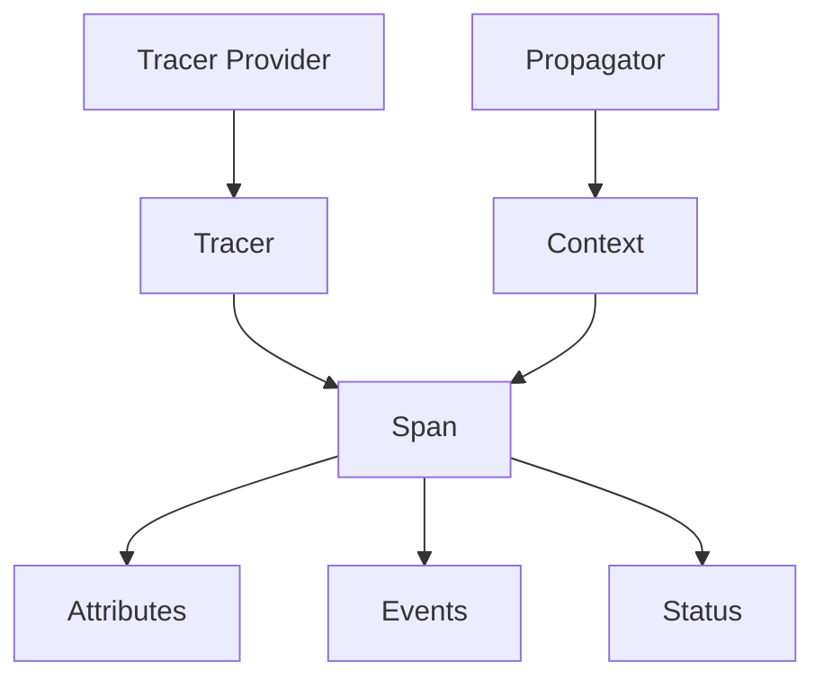

# How to Build OpenTelemetry Custom Instrumentation

Author: [nawazdhandala](https://www.github.com/nawazdhandala)

Tags: OpenTelemetry, Observability, Tracing, Instrumentation, APM

Description: Create custom OpenTelemetry instrumentation for proprietary libraries and frameworks with spans, attributes, and context propagation.

---

When you adopt OpenTelemetry, the automatic instrumentation libraries handle common frameworks like Express, Flask, or Spring Boot out of the box. But what happens when you have proprietary libraries, internal frameworks, or custom protocols that no community instrumentation covers? You build your own.

Custom instrumentation lets you capture the exact telemetry you need from code that only your organization uses. This guide walks through building production-ready custom instrumentation, from simple span wrapping to full-featured instrumentation libraries that integrate seamlessly with OpenTelemetry's plugin system.

---

## Table of Contents

1. When You Need Custom Instrumentation
2. Understanding the Instrumentation API
3. Basic Custom Span Creation
4. Building a Reusable Instrumentation Class
5. Context Propagation Across Boundaries
6. Adding Semantic Attributes
7. Error Handling and Status Codes
8. Registering Custom Instrumentation
9. Testing Your Instrumentation
10. Summary

---

## 1. When You Need Custom Instrumentation

Automatic instrumentation works well for standard libraries, but gaps appear quickly in real-world systems:

- **Proprietary message queues** that your company built years ago
- **Internal RPC frameworks** used across microservices
- **Custom caching layers** wrapping Redis or Memcached
- **Domain-specific protocols** for financial transactions, IoT devices, or gaming
- **Legacy libraries** that will never get community support

Building custom instrumentation for these components ensures your traces remain complete. Without it, you see gaps where your proprietary code executes, making it impossible to diagnose latency or errors in those systems.

---

## 2. Understanding the Instrumentation API

OpenTelemetry provides a layered API for instrumentation. The core components you will work with are:



| Component | Purpose |
|-----------|---------|
| **Tracer Provider** | Factory that creates Tracers, configured once at startup |
| **Tracer** | Creates spans, scoped to a library or component name |
| **Span** | Represents a single operation with timing, attributes, and events |
| **Context** | Carries trace state across function calls and async boundaries |
| **Propagator** | Serializes and deserializes context for cross-process communication |

---

## 3. Basic Custom Span Creation

The simplest form of custom instrumentation wraps a function call with a span. Here is how to instrument a proprietary payment gateway client in Python.

```python
# payment_gateway.py
# A proprietary payment library that needs custom instrumentation

from opentelemetry import trace
from opentelemetry.trace import Status, StatusCode

# Get a tracer for your instrumentation
# The name should identify your library, version is optional
tracer = trace.get_tracer("payment_gateway", "1.0.0")


class PaymentGateway:
    """Proprietary payment gateway client."""

    def __init__(self, api_key: str, endpoint: str):
        self.api_key = api_key
        self.endpoint = endpoint

    def charge(self, amount: float, currency: str, card_token: str) -> dict:
        """Process a payment charge with full tracing."""

        # Start a span for this operation
        with tracer.start_as_current_span(
            "payment_gateway.charge",
            kind=trace.SpanKind.CLIENT,  # This is an outgoing call
        ) as span:
            # Add attributes that help with debugging and analysis
            span.set_attribute("payment.amount", amount)
            span.set_attribute("payment.currency", currency)
            # Never log sensitive data like full card numbers
            span.set_attribute("payment.card_token_prefix", card_token[:8])
            span.set_attribute("payment.gateway.endpoint", self.endpoint)

            try:
                # Your actual payment processing logic
                result = self._send_charge_request(amount, currency, card_token)

                # Record the transaction ID for correlation
                span.set_attribute("payment.transaction_id", result["transaction_id"])
                span.set_status(Status(StatusCode.OK))

                return result

            except PaymentDeclinedException as e:
                # Payment declined is a business error, not a system error
                span.set_attribute("payment.decline_reason", e.reason)
                span.set_status(Status(StatusCode.ERROR, "Payment declined"))
                span.record_exception(e)
                raise

            except Exception as e:
                # System errors should be recorded with full details
                span.set_status(Status(StatusCode.ERROR, str(e)))
                span.record_exception(e)
                raise
```

The key points in this example:

- Use `start_as_current_span` to automatically handle context propagation
- Set `SpanKind.CLIENT` for outgoing calls to external services
- Add meaningful attributes that help with debugging
- Handle both business errors and system errors appropriately
- Never log sensitive information like full card numbers or tokens

---

## 4. Building a Reusable Instrumentation Class

For larger libraries, create a dedicated instrumentation class that can be enabled or disabled and configured at runtime.

```python
# instrumentation/payment_gateway_instrumentation.py
# Reusable instrumentation that follows OpenTelemetry patterns

from typing import Collection, Optional
from opentelemetry import trace
from opentelemetry.instrumentation.instrumentor import BaseInstrumentor
from opentelemetry.trace import Tracer, SpanKind, Status, StatusCode
from functools import wraps


class PaymentGatewayInstrumentor(BaseInstrumentor):
    """OpenTelemetry instrumentation for PaymentGateway library."""

    _original_charge = None
    _original_refund = None

    def instrumentation_dependencies(self) -> Collection[str]:
        """Declare any pip packages this instrumentation depends on."""
        return ["payment_gateway >= 1.0.0"]

    def _instrument(self, **kwargs) -> None:
        """Apply instrumentation by wrapping target methods."""

        # Get tracer from kwargs or create default
        tracer_provider = kwargs.get("tracer_provider")
        self._tracer = trace.get_tracer(
            __name__,
            "1.0.0",
            tracer_provider=tracer_provider,
        )

        # Import the library we are instrumenting
        from payment_gateway import PaymentGateway

        # Store original methods for uninstrumentation
        self._original_charge = PaymentGateway.charge
        self._original_refund = PaymentGateway.refund

        # Replace with instrumented versions
        PaymentGateway.charge = self._wrap_charge(PaymentGateway.charge)
        PaymentGateway.refund = self._wrap_refund(PaymentGateway.refund)

    def _uninstrument(self, **kwargs) -> None:
        """Remove instrumentation and restore original methods."""
        from payment_gateway import PaymentGateway

        if self._original_charge:
            PaymentGateway.charge = self._original_charge
        if self._original_refund:
            PaymentGateway.refund = self._original_refund

    def _wrap_charge(self, original_method):
        """Wrap the charge method with tracing."""
        tracer = self._tracer

        @wraps(original_method)
        def wrapped(self_instance, amount, currency, card_token, **kwargs):
            with tracer.start_as_current_span(
                "payment_gateway.charge",
                kind=SpanKind.CLIENT,
            ) as span:
                span.set_attributes({
                    "payment.amount": amount,
                    "payment.currency": currency,
                    "payment.gateway.endpoint": self_instance.endpoint,
                })

                try:
                    result = original_method(self_instance, amount, currency, card_token, **kwargs)
                    span.set_attribute("payment.transaction_id", result.get("transaction_id", ""))
                    span.set_status(Status(StatusCode.OK))
                    return result
                except Exception as e:
                    span.record_exception(e)
                    span.set_status(Status(StatusCode.ERROR, str(e)))
                    raise

        return wrapped

    def _wrap_refund(self, original_method):
        """Wrap the refund method with tracing."""
        tracer = self._tracer

        @wraps(original_method)
        def wrapped(self_instance, transaction_id, amount=None, **kwargs):
            with tracer.start_as_current_span(
                "payment_gateway.refund",
                kind=SpanKind.CLIENT,
            ) as span:
                span.set_attributes({
                    "payment.transaction_id": transaction_id,
                    "payment.refund_amount": amount or "full",
                })

                try:
                    result = original_method(self_instance, transaction_id, amount, **kwargs)
                    span.set_status(Status(StatusCode.OK))
                    return result
                except Exception as e:
                    span.record_exception(e)
                    span.set_status(Status(StatusCode.ERROR, str(e)))
                    raise

        return wrapped
```

This pattern allows users to enable instrumentation with a single call:

```python
# In your application startup
from instrumentation.payment_gateway_instrumentation import PaymentGatewayInstrumentor

# Enable instrumentation
PaymentGatewayInstrumentor().instrument()

# Later, if needed
PaymentGatewayInstrumentor().uninstrument()
```

---

## 5. Context Propagation Across Boundaries

When your custom library communicates across process boundaries, you need to propagate trace context. This ensures distributed traces remain connected.

```python
# Custom RPC client with context propagation

from opentelemetry import trace, propagate
from opentelemetry.trace import SpanKind
import requests


class InternalRPCClient:
    """Internal RPC client with distributed tracing support."""

    def __init__(self, service_url: str):
        self.service_url = service_url
        self.tracer = trace.get_tracer("internal_rpc", "1.0.0")

    def call(self, method: str, params: dict) -> dict:
        """Make an RPC call with trace context propagation."""

        with self.tracer.start_as_current_span(
            f"rpc.{method}",
            kind=SpanKind.CLIENT,
        ) as span:
            span.set_attributes({
                "rpc.system": "internal",
                "rpc.service": self.service_url,
                "rpc.method": method,
            })

            # Inject trace context into headers
            # This is what connects the client span to the server span
            headers = {}
            propagate.inject(headers)

            # Add your RPC-specific headers
            headers["Content-Type"] = "application/json"
            headers["X-RPC-Method"] = method

            try:
                response = requests.post(
                    f"{self.service_url}/rpc",
                    json={"method": method, "params": params},
                    headers=headers,
                )
                response.raise_for_status()

                result = response.json()
                span.set_attribute("rpc.response_size", len(response.content))

                return result

            except requests.RequestException as e:
                span.record_exception(e)
                span.set_status(trace.Status(trace.StatusCode.ERROR, str(e)))
                raise
```

On the server side, extract the context to continue the trace:

```python
# Server-side context extraction

from opentelemetry import trace, propagate
from opentelemetry.trace import SpanKind


def handle_rpc_request(request):
    """Handle incoming RPC request with trace context extraction."""

    tracer = trace.get_tracer("internal_rpc_server", "1.0.0")

    # Extract trace context from incoming headers
    # This links the server span to the client span
    ctx = propagate.extract(request.headers)

    method = request.json.get("method")

    with tracer.start_as_current_span(
        f"rpc.{method}",
        context=ctx,  # Continue the trace from the client
        kind=SpanKind.SERVER,
    ) as span:
        span.set_attributes({
            "rpc.system": "internal",
            "rpc.method": method,
        })

        try:
            result = process_rpc_method(method, request.json.get("params", {}))
            return {"result": result}
        except Exception as e:
            span.record_exception(e)
            span.set_status(trace.Status(trace.StatusCode.ERROR, str(e)))
            raise
```

---

## 6. Adding Semantic Attributes

OpenTelemetry defines semantic conventions for common attribute names. Following these conventions makes your telemetry compatible with observability tools and dashboards.

```python
# Using semantic conventions for consistent attributes

from opentelemetry.semconv.trace import SpanAttributes
from opentelemetry import trace


def instrumented_database_query(query: str, params: tuple):
    """Execute a database query with semantic attributes."""

    tracer = trace.get_tracer("custom_db", "1.0.0")

    with tracer.start_as_current_span(
        "custom_db.query",
        kind=trace.SpanKind.CLIENT,
    ) as span:
        # Use standard semantic conventions
        span.set_attributes({
            SpanAttributes.DB_SYSTEM: "postgresql",
            SpanAttributes.DB_NAME: "orders",
            SpanAttributes.DB_OPERATION: "SELECT",
            SpanAttributes.DB_STATEMENT: sanitize_query(query),

            # Custom attributes for your specific needs
            "db.param_count": len(params),
            "db.query_hash": hash_query(query),
        })

        result = execute_query(query, params)

        span.set_attribute("db.row_count", len(result))
        return result
```

Common semantic conventions you should use:

| Domain | Attributes |
|--------|------------|
| HTTP | `http.method`, `http.url`, `http.status_code` |
| Database | `db.system`, `db.name`, `db.operation`, `db.statement` |
| Messaging | `messaging.system`, `messaging.destination`, `messaging.operation` |
| RPC | `rpc.system`, `rpc.service`, `rpc.method` |

---

## 7. Error Handling and Status Codes

Proper error handling in instrumentation requires distinguishing between error types and setting appropriate status codes.

```python
# Comprehensive error handling in custom instrumentation

from opentelemetry import trace
from opentelemetry.trace import Status, StatusCode


def instrumented_operation():
    tracer = trace.get_tracer("my_library", "1.0.0")

    with tracer.start_as_current_span("my_operation") as span:
        try:
            result = perform_operation()

            # Explicit success status
            span.set_status(Status(StatusCode.OK))
            return result

        except ValidationError as e:
            # Client error - record but might not be a system problem
            span.set_attribute("error.type", "validation")
            span.set_attribute("error.field", e.field)
            span.record_exception(e)
            span.set_status(Status(StatusCode.ERROR, f"Validation failed: {e.field}"))
            raise

        except ResourceNotFoundError as e:
            # Not found might be expected in some cases
            span.set_attribute("error.type", "not_found")
            span.set_attribute("error.resource_id", e.resource_id)
            # Use UNSET if this is expected behavior, ERROR if it is not
            span.set_status(Status(StatusCode.UNSET))
            raise

        except ConnectionError as e:
            # Infrastructure error - definitely a problem
            span.set_attribute("error.type", "connection")
            span.record_exception(e)
            span.set_status(Status(StatusCode.ERROR, "Connection failed"))
            raise

        except Exception as e:
            # Unexpected error - capture everything
            span.set_attribute("error.type", type(e).__name__)
            span.record_exception(e, attributes={
                "exception.escaped": True,
            })
            span.set_status(Status(StatusCode.ERROR, str(e)))
            raise
```

---

## 8. Registering Custom Instrumentation

For automatic discovery and configuration, register your instrumentation as an entry point.

Add to your `setup.py` or `pyproject.toml`:

```toml
# pyproject.toml
[project.entry-points."opentelemetry_instrumentor"]
payment_gateway = "instrumentation.payment_gateway:PaymentGatewayInstrumentor"
```

Then users can enable all registered instrumentations at once:

```python
# Automatic instrumentation discovery
from opentelemetry.instrumentation.auto_instrumentation import sitecustomize

# Or programmatically
from opentelemetry.instrumentation.instrumentor import BaseInstrumentor

for instrumentor in BaseInstrumentor.__subclasses__():
    instrumentor().instrument()
```

---

## 9. Testing Your Instrumentation

Test that your instrumentation creates the expected spans and attributes.

```python
# test_payment_instrumentation.py

import pytest
from opentelemetry import trace
from opentelemetry.sdk.trace import TracerProvider
from opentelemetry.sdk.trace.export.in_memory_span_exporter import InMemorySpanExporter

from instrumentation.payment_gateway_instrumentation import PaymentGatewayInstrumentor
from payment_gateway import PaymentGateway


@pytest.fixture
def tracer_provider():
    """Set up an in-memory tracer for testing."""
    provider = TracerProvider()
    exporter = InMemorySpanExporter()
    provider.add_span_processor(
        trace.get_tracer_provider().get_tracer(__name__)
    )
    trace.set_tracer_provider(provider)
    return provider, exporter


@pytest.fixture
def instrumented_gateway(tracer_provider):
    """Set up instrumented payment gateway."""
    provider, exporter = tracer_provider

    # Apply instrumentation
    instrumentor = PaymentGatewayInstrumentor()
    instrumentor.instrument(tracer_provider=provider)

    yield PaymentGateway(api_key="test", endpoint="https://test.gateway")

    # Clean up
    instrumentor.uninstrument()
    exporter.clear()


def test_charge_creates_span(instrumented_gateway, tracer_provider):
    """Verify that charge() creates a properly attributed span."""
    provider, exporter = tracer_provider

    # Make a charge
    result = instrumented_gateway.charge(100.00, "USD", "tok_test123")

    # Get exported spans
    spans = exporter.get_finished_spans()

    assert len(spans) == 1
    span = spans[0]

    assert span.name == "payment_gateway.charge"
    assert span.attributes["payment.amount"] == 100.00
    assert span.attributes["payment.currency"] == "USD"
    assert span.status.status_code == trace.StatusCode.OK
```

---

## 10. Summary

| Aspect | Implementation |
|--------|----------------|
| **Simple wrapping** | Use `start_as_current_span` with try/except/finally |
| **Reusable instrumentation** | Extend `BaseInstrumentor` with `_instrument` and `_uninstrument` |
| **Context propagation** | Use `propagate.inject()` for outgoing, `propagate.extract()` for incoming |
| **Attributes** | Follow semantic conventions, never log sensitive data |
| **Error handling** | Distinguish error types, use appropriate status codes |
| **Registration** | Use entry points for automatic discovery |
| **Testing** | Use `InMemorySpanExporter` to verify span creation |

Building custom instrumentation takes more effort than relying on automatic instrumentation, but it gives you complete control over what telemetry your proprietary systems emit. Start with simple span wrapping, then graduate to full instrumentation classes as your needs grow.

The investment pays off when you can trace a request from your React frontend, through your custom API gateway, into your proprietary payment system, and back, all in a single distributed trace.

---

*Need to visualize your custom instrumentation? Send your traces to [OneUptime](https://oneuptime.com) and see how your proprietary systems perform alongside your standard infrastructure.*

---

### Related Reading

- [What are Traces and Spans in OpenTelemetry](https://oneuptime.com/blog/post/2025-08-27-traces-and-spans-in-opentelemetry/view) - Understand the building blocks of distributed tracing
- [How to Implement OpenTelemetry in React for Frontend Observability](https://oneuptime.com/blog/post/2026-01-15-react-opentelemetry-frontend-observability/view) - Frontend instrumentation patterns
- [OpenTelemetry for Serverless Functions](https://oneuptime.com/blog/post/2026-01-07-opentelemetry-serverless/view) - Instrumenting Lambda and Cloud Functions
- [How to Name Spans in OpenTelemetry](https://oneuptime.com/blog/post/2024-11-04-how-to-name-spans-in-opentelemetry/view) - Best practices for span naming
