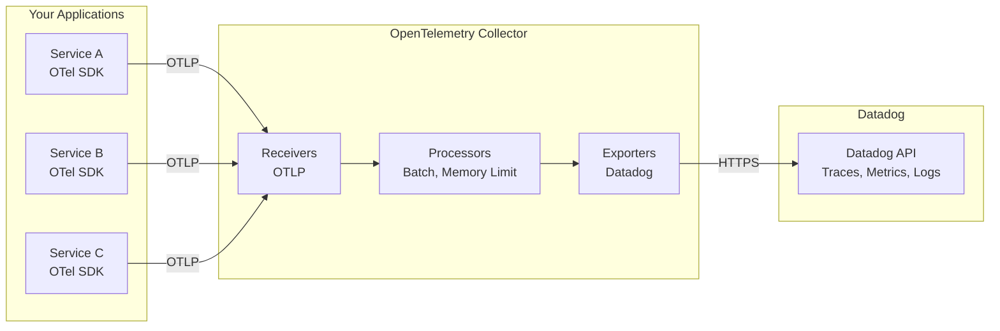
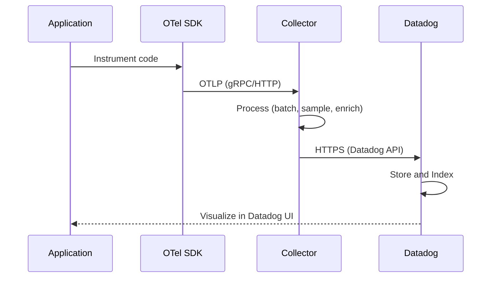

# How to Create OpenTelemetry Datadog Exporter

Author: [nawazdhandala](https://github.com/nawazdhandala)

Tags: OpenTelemetry, Datadog, APM, Observability

Description: A step-by-step guide to configuring the OpenTelemetry Datadog Exporter to send traces, metrics, and logs from your applications to Datadog using the OpenTelemetry Collector.

---

> OpenTelemetry gives you vendor-neutral instrumentation. The Datadog Exporter lets you send that telemetry to Datadog without using proprietary agents or SDKs.

If your organization uses Datadog for observability but wants to standardize on OpenTelemetry for instrumentation, the Datadog Exporter is your bridge. This guide walks through setting up the exporter in the OpenTelemetry Collector to send traces, metrics, and logs to Datadog.

---

## Table of Contents

1. Why Use OpenTelemetry with Datadog?
2. Architecture Overview
3. Prerequisites
4. Collector Configuration for Datadog
5. Sending Traces to Datadog
6. Sending Metrics to Datadog
7. Sending Logs to Datadog
8. Complete Configuration Example
9. Verifying Your Setup
10. Common Issues and Troubleshooting
11. Best Practices

---

## 1. Why Use OpenTelemetry with Datadog?

Using OpenTelemetry with Datadog gives you several advantages:

| Benefit | Description |
|---------|-------------|
| Vendor Flexibility | Switch backends without re-instrumenting your code |
| Unified Instrumentation | Same SDK across all services regardless of destination |
| Open Standards | Community-driven semantic conventions |
| Multi-Destination | Send data to Datadog and other backends simultaneously |
| Cost Control | Apply sampling and filtering before data reaches Datadog |

The OpenTelemetry Collector acts as an intermediary, receiving telemetry from your applications and exporting it to Datadog in the format it expects.

---

## 2. Architecture Overview

The following diagram shows how telemetry flows from your applications through the OpenTelemetry Collector to Datadog:



Your applications instrument with OpenTelemetry SDKs and send data via OTLP to the Collector. The Collector processes the data and exports it to Datadog using the Datadog Exporter.

---

## 3. Prerequisites

Before setting up the Datadog Exporter, ensure you have:

- **Datadog Account**: You need an active Datadog account
- **Datadog API Key**: Found in Datadog under Organization Settings > API Keys
- **Datadog Site**: Know your Datadog site (e.g., `datadoghq.com`, `datadoghq.eu`, `us3.datadoghq.com`)
- **OpenTelemetry Collector**: Install the `otelcol-contrib` distribution (includes the Datadog Exporter)

Install the OpenTelemetry Collector Contrib distribution:

```bash
# Download the latest release for your platform
# Example for Linux amd64
curl -LO https://github.com/open-telemetry/opentelemetry-collector-releases/releases/download/v0.96.0/otelcol-contrib_0.96.0_linux_amd64.tar.gz
tar -xzf otelcol-contrib_0.96.0_linux_amd64.tar.gz
```

For Kubernetes deployments, use the OpenTelemetry Collector Helm chart with the contrib image:

```bash
helm repo add open-telemetry https://open-telemetry.github.io/opentelemetry-helm-charts
helm install otel-collector open-telemetry/opentelemetry-collector \
  --set image.repository=otel/opentelemetry-collector-contrib
```

---

## 4. Collector Configuration for Datadog

The Datadog Exporter requires your API key and site information. Here is a basic configuration structure:

```yaml
exporters:
  datadog:
    api:
      key: ${DD_API_KEY}           # Your Datadog API key
      site: datadoghq.com          # Your Datadog site
```

The exporter supports environment variable substitution, so you can securely pass your API key:

```bash
export DD_API_KEY="your-datadog-api-key"
```

---

## 5. Sending Traces to Datadog

Traces are the most common use case for the Datadog Exporter. The following configuration sets up a traces pipeline:

```yaml
receivers:
  otlp:
    protocols:
      grpc:
        endpoint: 0.0.0.0:4317
      http:
        endpoint: 0.0.0.0:4318

processors:
  batch:
    send_batch_size: 1000
    timeout: 10s

  memory_limiter:
    check_interval: 1s
    limit_mib: 512
    spike_limit_mib: 128

exporters:
  datadog:
    api:
      key: ${DD_API_KEY}
      site: datadoghq.com
    traces:
      span_name_as_resource_name: true  # Use span name for Datadog resource

service:
  pipelines:
    traces:
      receivers: [otlp]
      processors: [memory_limiter, batch]
      exporters: [datadog]
```

The `span_name_as_resource_name` option maps the OpenTelemetry span name to the Datadog resource name, which improves trace organization in the Datadog UI.

---

## 6. Sending Metrics to Datadog

The Datadog Exporter converts OpenTelemetry metrics to Datadog metric format. Configure the metrics pipeline as follows:

```yaml
receivers:
  otlp:
    protocols:
      grpc:
        endpoint: 0.0.0.0:4317
      http:
        endpoint: 0.0.0.0:4318

processors:
  batch:
    send_batch_size: 1000
    timeout: 10s

exporters:
  datadog:
    api:
      key: ${DD_API_KEY}
      site: datadoghq.com
    metrics:
      histograms:
        mode: distributions    # Send as Datadog distributions
      sums:
        cumulative_monotonic_mode: to_delta  # Convert to delta metrics

service:
  pipelines:
    metrics:
      receivers: [otlp]
      processors: [batch]
      exporters: [datadog]
```

Key metric configuration options:

| Option | Description |
|--------|-------------|
| `histograms.mode` | `distributions` sends as Datadog distributions, `counters` sends as count metrics |
| `sums.cumulative_monotonic_mode` | `to_delta` converts cumulative counters to delta (recommended for Datadog) |

---

## 7. Sending Logs to Datadog

The Datadog Exporter can also send logs. Configure the logs pipeline like this:

```yaml
receivers:
  otlp:
    protocols:
      grpc:
        endpoint: 0.0.0.0:4317
      http:
        endpoint: 0.0.0.0:4318

processors:
  batch:
    send_batch_size: 1000
    timeout: 10s

exporters:
  datadog:
    api:
      key: ${DD_API_KEY}
      site: datadoghq.com

service:
  pipelines:
    logs:
      receivers: [otlp]
      processors: [batch]
      exporters: [datadog]
```

Logs sent through the Datadog Exporter will automatically include trace correlation if trace context is present, enabling you to jump from logs to traces in the Datadog UI.

---

## 8. Complete Configuration Example

Here is a complete configuration that sends traces, metrics, and logs to Datadog with production-ready settings:

```yaml
receivers:
  otlp:
    protocols:
      grpc:
        endpoint: 0.0.0.0:4317
      http:
        endpoint: 0.0.0.0:4318

processors:
  # Protect against memory exhaustion
  memory_limiter:
    check_interval: 1s
    limit_mib: 1024
    spike_limit_mib: 256

  # Batch for efficiency
  batch:
    send_batch_size: 1000
    send_batch_max_size: 2000
    timeout: 10s

  # Add resource attributes for better organization in Datadog
  resource:
    attributes:
      - key: deployment.environment
        value: ${DEPLOYMENT_ENV}
        action: upsert
      - key: service.version
        value: ${SERVICE_VERSION}
        action: upsert

exporters:
  datadog:
    api:
      key: ${DD_API_KEY}
      site: ${DD_SITE}              # datadoghq.com, datadoghq.eu, etc.

    # Traces configuration
    traces:
      span_name_as_resource_name: true
      trace_buffer: 1000            # Buffer size for trace aggregation

    # Metrics configuration
    metrics:
      histograms:
        mode: distributions
        send_aggregation_metrics: true
      sums:
        cumulative_monotonic_mode: to_delta
      summaries:
        mode: gauges

    # Host metadata for infrastructure correlation
    host_metadata:
      enabled: true
      hostname_source: config_or_system
      tags:
        - team:platform
        - cost-center:engineering

extensions:
  health_check:
    endpoint: 0.0.0.0:13133
  zpages:
    endpoint: 0.0.0.0:55679

service:
  extensions: [health_check, zpages]

  pipelines:
    traces:
      receivers: [otlp]
      processors: [memory_limiter, resource, batch]
      exporters: [datadog]

    metrics:
      receivers: [otlp]
      processors: [memory_limiter, resource, batch]
      exporters: [datadog]

    logs:
      receivers: [otlp]
      processors: [memory_limiter, resource, batch]
      exporters: [datadog]

  telemetry:
    logs:
      level: info
    metrics:
      address: 0.0.0.0:8888
```

Save this configuration as `otel-collector-config.yaml` and run the collector:

```bash
export DD_API_KEY="your-api-key"
export DD_SITE="datadoghq.com"
export DEPLOYMENT_ENV="production"
export SERVICE_VERSION="1.2.3"

./otelcol-contrib --config=otel-collector-config.yaml
```

---

## 9. Verifying Your Setup

After starting the Collector, verify that data is flowing to Datadog.

Check the Collector logs for successful exports:

```bash
# Look for successful export messages
./otelcol-contrib --config=otel-collector-config.yaml 2>&1 | grep -i datadog
```

Use the Collector's built-in health check:

```bash
curl http://localhost:13133/health
```

Send a test trace from your application. Here is a simple Node.js example:

```typescript
// test-trace.ts
import { NodeSDK } from '@opentelemetry/sdk-node';
import { OTLPTraceExporter } from '@opentelemetry/exporter-trace-otlp-grpc';
import { trace } from '@opentelemetry/api';

const sdk = new NodeSDK({
  traceExporter: new OTLPTraceExporter({
    url: 'http://localhost:4317',
  }),
  serviceName: 'test-service',
});

sdk.start();

const tracer = trace.getTracer('test-tracer');
const span = tracer.startSpan('test-operation');
span.setAttribute('test.attribute', 'hello-datadog');
span.end();

// Give time for export
setTimeout(() => sdk.shutdown(), 5000);
```

After sending test data, check in Datadog:

1. **Traces**: Navigate to APM > Traces in Datadog
2. **Metrics**: Navigate to Metrics > Explorer
3. **Logs**: Navigate to Logs

---

## 10. Common Issues and Troubleshooting

Here are common issues and their solutions:

**Issue: Traces not appearing in Datadog**

Check that your API key is valid and has the correct permissions:

```bash
curl -X GET "https://api.datadoghq.com/api/v1/validate" \
  -H "DD-API-KEY: ${DD_API_KEY}"
```

**Issue: Metrics showing as gauges instead of counts**

Ensure you have configured the cumulative monotonic mode:

```yaml
exporters:
  datadog:
    metrics:
      sums:
        cumulative_monotonic_mode: to_delta
```

**Issue: High memory usage in Collector**

Add or tune the memory limiter processor:

```yaml
processors:
  memory_limiter:
    check_interval: 1s
    limit_mib: 512
    spike_limit_mib: 128
```

**Issue: Export timeouts**

Increase the timeout and enable retry:

```yaml
exporters:
  datadog:
    api:
      key: ${DD_API_KEY}
    retry_on_failure:
      enabled: true
      initial_interval: 5s
      max_interval: 30s
      max_elapsed_time: 300s
    timeout: 30s
```

---

## 11. Best Practices

Follow these best practices when using the Datadog Exporter:

**Use Environment Variables for Secrets**

Never hardcode API keys in configuration files:

```yaml
exporters:
  datadog:
    api:
      key: ${DD_API_KEY}    # Good: environment variable
      # key: abc123         # Bad: hardcoded secret
```

**Set Resource Attributes for Better Organization**

Add environment and version information:

```yaml
processors:
  resource:
    attributes:
      - key: deployment.environment
        value: production
        action: upsert
      - key: service.version
        value: 1.2.3
        action: upsert
```

**Enable Host Metadata**

This correlates your APM data with infrastructure metrics in Datadog:

```yaml
exporters:
  datadog:
    host_metadata:
      enabled: true
      tags:
        - env:production
```

**Use Sampling for High-Volume Services**

Apply tail sampling to reduce costs while keeping important traces:

```yaml
processors:
  tail_sampling:
    decision_wait: 10s
    policies:
      - name: errors
        type: status_code
        status_code:
          status_codes: [ERROR]
      - name: slow-traces
        type: latency
        latency:
          threshold_ms: 1000
      - name: sample-rest
        type: probabilistic
        probabilistic:
          sampling_percentage: 10
```

**Monitor the Collector Itself**

Expose Collector metrics and send them to Datadog:

```yaml
service:
  telemetry:
    metrics:
      address: 0.0.0.0:8888
```

Then scrape these metrics with a Prometheus receiver or use the Datadog Agent to collect them.

---

## Data Flow Summary

Here is how data flows through the complete pipeline:



---

## Conclusion

The OpenTelemetry Datadog Exporter lets you standardize on OpenTelemetry instrumentation while continuing to use Datadog as your observability backend. The key benefits are:

- **Vendor flexibility**: Switch backends by changing Collector configuration, not application code
- **Unified instrumentation**: Same OpenTelemetry SDKs across all your services
- **Processing power**: Apply sampling, filtering, and enrichment before data reaches Datadog
- **Multi-destination**: Send data to Datadog and other backends simultaneously

Start with a basic configuration, verify data is flowing, then add processors for sampling, enrichment, and cost optimization as your needs grow.

---

## Related Reading

- [What is OpenTelemetry Collector and Why Use One?](https://oneuptime.com/blog/post/2025-09-18-what-is-opentelemetry-collector-and-why-use-one/view)
- [How to Reduce Noise in OpenTelemetry](https://oneuptime.com/blog/post/2025-08-25-how-to-reduce-noise-in-opentelemetry/view)
- [OpenTelemetry: Your Escape Hatch from the Observability Cartel](https://oneuptime.com/blog/post/2025-11-03-opentelemetry-escape-from-observability-cartel/view)
- [Traces and Spans in OpenTelemetry](https://oneuptime.com/blog/post/2025-08-27-traces-and-spans-in-opentelemetry/view)
