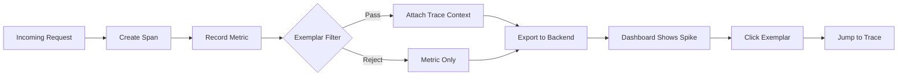
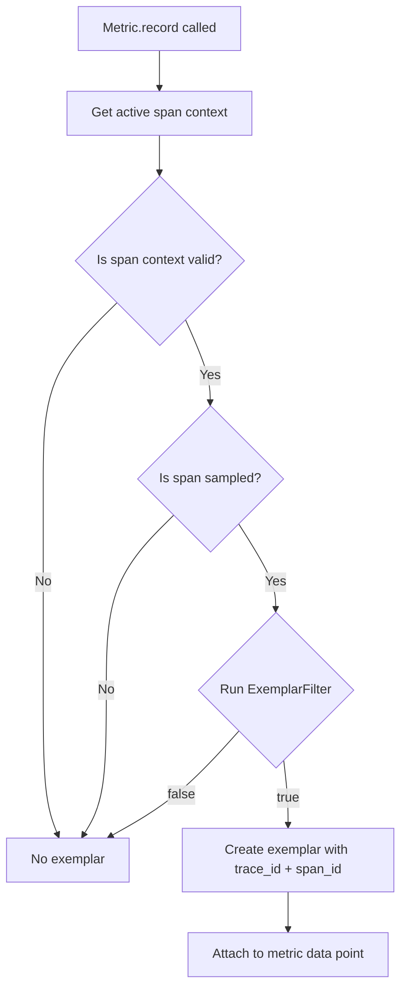
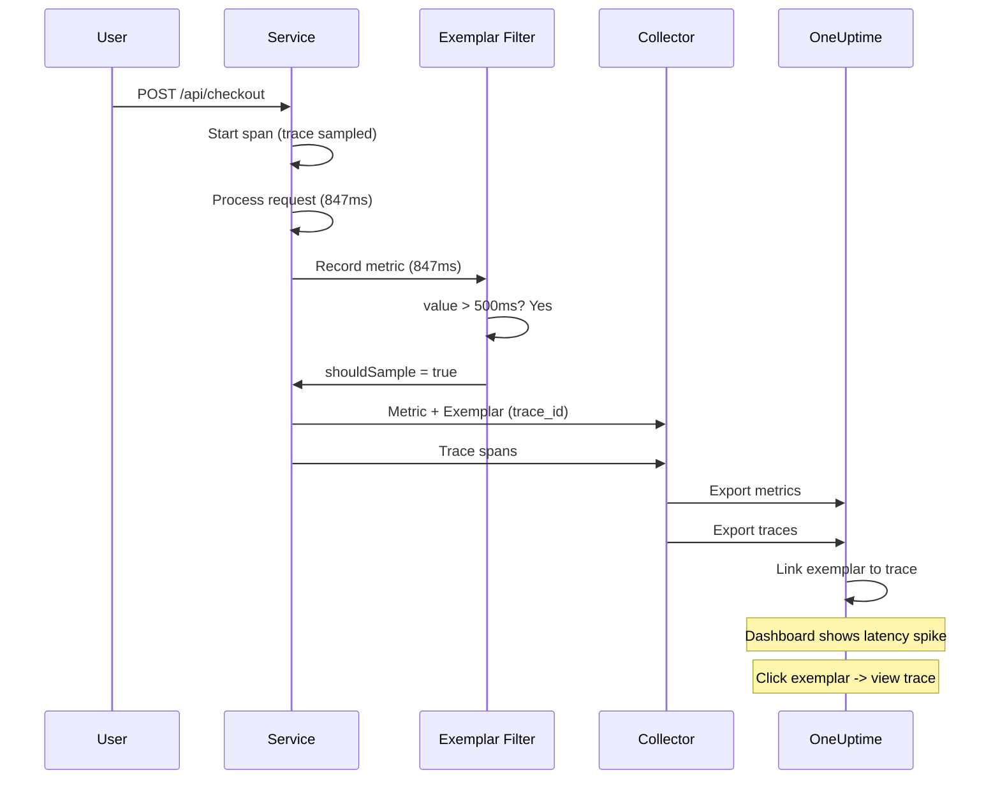

# How to Implement OpenTelemetry Exemplar Filters

Author: [nawazdhandala](https://github.com/nawazdhandala)

Tags: OpenTelemetry, Metrics, Exemplars, Tracing

Description: Learn how to implement exemplar filters in OpenTelemetry to connect metrics with traces for faster root cause analysis.

---

> Metrics tell you **what** is happening. Exemplars tell you **which specific request** caused it.

Exemplars are the bridge between aggregated metrics and individual traces. When your latency spikes or error rate jumps, exemplars point you to the exact trace that contributed to that anomaly. This guide walks through implementing exemplar filters in OpenTelemetry to control which trace samples get attached to your metrics.

---

## Table of Contents

1. What Are Exemplars?
2. Why Exemplar Filters Matter
3. How Exemplar Filters Work
4. Built-in Exemplar Filters
5. Implementing a Custom Exemplar Filter
6. Configuration in Different Languages
7. Collector Configuration for Exemplars
8. Best Practices
9. Common Pitfalls
10. Putting It All Together

---

## 1. What Are Exemplars?

An exemplar is a sample data point that includes:

- A measured value (e.g., latency of 847ms)
- A timestamp
- Trace context (trace_id, span_id)
- Optional filtered attributes

Think of exemplars as bookmarks. When you see a metric data point, the exemplar says: "Here is one specific request that contributed to this value. Go look at its trace for details."

```jsonc
{
  "metric": "http.server.duration",
  "bucket": "500-1000ms",
  "count": 42,
  "exemplar": {
    "value": 847.3,
    "timestamp": "2026-01-30T14:23:45.123Z",
    "trace_id": "4f3ae9c1b2d4e5f6a7b8c9d0e1f2a3b4",
    "span_id": "1a2b3c4d5e6f7890",
    "filtered_attributes": {
      "http.route": "/api/checkout"
    }
  }
}
```

---

## 2. Why Exemplar Filters Matter

Without filtering, every single measurement could potentially become an exemplar. This creates problems:

| Problem | Impact |
|---------|--------|
| Storage overhead | Exemplars consume space in your metrics backend |
| Noise | Too many exemplars dilute the signal |
| Irrelevant samples | Not all requests are equally interesting |
| Performance | Capturing every trace context adds CPU overhead |

Exemplar filters let you decide: "Under what conditions should we attach trace context to this metric measurement?"

The following diagram shows how exemplars connect metrics to traces for investigation.



---

## 3. How Exemplar Filters Work

Exemplar filters are invoked during metric recording. They receive context about the current measurement and decide whether to sample it as an exemplar.

The filter receives:

- The current OpenTelemetry context (which contains the active span)
- The recorded value
- The metric attributes

The filter returns:

- `true`: Attach an exemplar with trace context
- `false`: Skip exemplar for this measurement

The decision flow can be visualized as follows.



---

## 4. Built-in Exemplar Filters

OpenTelemetry provides several built-in exemplar filters.

### AlwaysOnExemplarFilter

Attaches exemplars to every sampled measurement.

```typescript
import { ExemplarFilter, AlwaysOnExemplarFilter } from '@opentelemetry/sdk-metrics';

const filter: ExemplarFilter = new AlwaysOnExemplarFilter();
```

Use case: Development environments, low-traffic services, debugging sessions.

### AlwaysOffExemplarFilter

Never attaches exemplars.

```typescript
import { AlwaysOffExemplarFilter } from '@opentelemetry/sdk-metrics';

const filter = new AlwaysOffExemplarFilter();
```

Use case: High-volume services where exemplar overhead is unacceptable, or when your backend does not support exemplars.

### TraceBasedExemplarFilter (Default)

Only attaches exemplars when the span is sampled for tracing.

```typescript
import { TraceBasedExemplarFilter } from '@opentelemetry/sdk-metrics';

const filter = new TraceBasedExemplarFilter();
```

Use case: Production environments. Aligns exemplar sampling with trace sampling decisions.

---

## 5. Implementing a Custom Exemplar Filter

Custom filters let you implement business logic for exemplar selection. Here is an example that selects exemplars based on value thresholds and specific attributes.

First, define the filter class that implements the ExemplarFilter interface.

```typescript
import {
  ExemplarFilter,
  Context,
} from '@opentelemetry/sdk-metrics';
import { trace, isSpanContextValid } from '@opentelemetry/api';

/**
 * Custom exemplar filter that captures exemplars for:
 * 1. High latency measurements (above threshold)
 * 2. Error status codes
 * 3. Specific high-value routes
 */
export class SmartExemplarFilter implements ExemplarFilter {
  private readonly latencyThresholdMs: number;
  private readonly highValueRoutes: Set<string>;

  constructor(options: {
    latencyThresholdMs?: number;
    highValueRoutes?: string[];
  } = {}) {
    this.latencyThresholdMs = options.latencyThresholdMs ?? 500;
    this.highValueRoutes = new Set(options.highValueRoutes ?? [
      '/api/checkout',
      '/api/payment',
      '/api/order'
    ]);
  }

  shouldSample(
    value: number,
    timestamp: number,
    attributes: Record<string, unknown>,
    context: Context
  ): boolean {
    // First check: is there a valid, sampled span?
    const spanContext = trace.getSpanContext(context);
    if (!spanContext || !isSpanContextValid(spanContext)) {
      return false;
    }

    // Only sample if the trace itself is sampled
    if (!(spanContext.traceFlags & 0x01)) {
      return false;
    }

    // High latency values always get exemplars
    if (value > this.latencyThresholdMs) {
      return true;
    }

    // Error responses always get exemplars
    const statusCode = attributes['http.status_code'];
    if (typeof statusCode === 'number' && statusCode >= 400) {
      return true;
    }

    // High-value routes always get exemplars
    const route = attributes['http.route'];
    if (typeof route === 'string' && this.highValueRoutes.has(route)) {
      return true;
    }

    // Probabilistic sampling for everything else (10%)
    return Math.random() < 0.1;
  }
}
```

Now wire the custom filter into the MeterProvider.

```typescript
import { MeterProvider, PeriodicExportingMetricReader } from '@opentelemetry/sdk-metrics';
import { OTLPMetricExporter } from '@opentelemetry/exporter-metrics-otlp-http';
import { SmartExemplarFilter } from './smart-exemplar-filter';

const metricExporter = new OTLPMetricExporter({
  url: process.env.OTEL_EXPORTER_OTLP_METRICS_ENDPOINT || 'https://oneuptime.com/otlp/v1/metrics',
  headers: {
    'x-oneuptime-token': process.env.ONEUPTIME_TOKEN || ''
  }
});

const meterProvider = new MeterProvider({
  readers: [
    new PeriodicExportingMetricReader({
      exporter: metricExporter,
      exportIntervalMillis: 15000
    })
  ],
  // Apply the custom exemplar filter
  exemplarFilter: new SmartExemplarFilter({
    latencyThresholdMs: 500,
    highValueRoutes: ['/api/checkout', '/api/payment', '/api/order']
  })
});
```

---

## 6. Configuration in Different Languages

### Node.js / TypeScript

The full SDK setup with exemplar filtering.

```typescript
import { NodeSDK } from '@opentelemetry/sdk-node';
import { getNodeAutoInstrumentations } from '@opentelemetry/auto-instrumentations-node';
import { OTLPTraceExporter } from '@opentelemetry/exporter-trace-otlp-http';
import { OTLPMetricExporter } from '@opentelemetry/exporter-metrics-otlp-http';
import { PeriodicExportingMetricReader } from '@opentelemetry/sdk-metrics';
import { Resource } from '@opentelemetry/resources';
import { ATTR_SERVICE_NAME, ATTR_SERVICE_VERSION } from '@opentelemetry/semantic-conventions';
import { SmartExemplarFilter } from './smart-exemplar-filter';

const resource = new Resource({
  [ATTR_SERVICE_NAME]: 'checkout-service',
  [ATTR_SERVICE_VERSION]: '2.1.0'
});

const sdk = new NodeSDK({
  resource,
  traceExporter: new OTLPTraceExporter({
    url: 'https://oneuptime.com/otlp/v1/traces',
    headers: { 'x-oneuptime-token': process.env.ONEUPTIME_TOKEN || '' }
  }),
  metricReader: new PeriodicExportingMetricReader({
    exporter: new OTLPMetricExporter({
      url: 'https://oneuptime.com/otlp/v1/metrics',
      headers: { 'x-oneuptime-token': process.env.ONEUPTIME_TOKEN || '' }
    }),
    exportIntervalMillis: 15000
  }),
  instrumentations: [getNodeAutoInstrumentations()]
});

sdk.start();
```

### Python

Python implementation of a custom exemplar filter.

```python
from opentelemetry.sdk.metrics import MeterProvider
from opentelemetry.sdk.metrics.export import PeriodicExportingMetricReader
from opentelemetry.exporter.otlp.proto.http.metric_exporter import OTLPMetricExporter
from opentelemetry.sdk.metrics._internal.exemplar import ExemplarFilter
from opentelemetry.trace import get_current_span, INVALID_SPAN_CONTEXT
from opentelemetry.context import Context
from typing import Sequence
import random


class SmartExemplarFilter(ExemplarFilter):
    """Custom exemplar filter for high-value measurements."""

    def __init__(
        self,
        latency_threshold_ms: float = 500,
        high_value_routes: list[str] = None
    ):
        self.latency_threshold_ms = latency_threshold_ms
        self.high_value_routes = set(high_value_routes or [
            '/api/checkout',
            '/api/payment',
            '/api/order'
        ])

    def should_sample(
        self,
        value: float,
        time_unix_nano: int,
        attributes: dict,
        context: Context
    ) -> bool:
        # Check for valid sampled span
        span = get_current_span()
        span_context = span.get_span_context()

        if span_context == INVALID_SPAN_CONTEXT:
            return False

        if not span_context.trace_flags.sampled:
            return False

        # High latency
        if value > self.latency_threshold_ms:
            return True

        # Errors
        status_code = attributes.get('http.status_code', 0)
        if isinstance(status_code, int) and status_code >= 400:
            return True

        # High-value routes
        route = attributes.get('http.route', '')
        if route in self.high_value_routes:
            return True

        # 10% probabilistic fallback
        return random.random() < 0.1


# Configure the meter provider with the custom filter
exporter = OTLPMetricExporter(
    endpoint="https://oneuptime.com/otlp/v1/metrics",
    headers={"x-oneuptime-token": "YOUR_TOKEN"}
)

reader = PeriodicExportingMetricReader(
    exporter,
    export_interval_millis=15000
)

provider = MeterProvider(
    metric_readers=[reader],
    exemplar_filter=SmartExemplarFilter(
        latency_threshold_ms=500,
        high_value_routes=['/api/checkout', '/api/payment']
    )
)
```

### Go

Go implementation using the OpenTelemetry Go SDK.

```go
package main

import (
    "context"
    "math/rand"

    "go.opentelemetry.io/otel/sdk/metric"
    "go.opentelemetry.io/otel/sdk/metric/metricdata"
    "go.opentelemetry.io/otel/trace"
)

// SmartExemplarFilter implements metric.ExemplarFilter
type SmartExemplarFilter struct {
    LatencyThresholdMs float64
    HighValueRoutes    map[string]bool
}

func NewSmartExemplarFilter(thresholdMs float64, routes []string) *SmartExemplarFilter {
    routeSet := make(map[string]bool)
    for _, r := range routes {
        routeSet[r] = true
    }
    return &SmartExemplarFilter{
        LatencyThresholdMs: thresholdMs,
        HighValueRoutes:    routeSet,
    }
}

func (f *SmartExemplarFilter) ShouldSample(
    ctx context.Context,
    value float64,
    attrs []attribute.KeyValue,
) bool {
    // Check for valid sampled span
    spanCtx := trace.SpanContextFromContext(ctx)
    if !spanCtx.IsValid() || !spanCtx.IsSampled() {
        return false
    }

    // High latency
    if value > f.LatencyThresholdMs {
        return true
    }

    // Check attributes
    for _, attr := range attrs {
        // Errors
        if attr.Key == "http.status_code" {
            if code := attr.Value.AsInt64(); code >= 400 {
                return true
            }
        }
        // High-value routes
        if attr.Key == "http.route" {
            if f.HighValueRoutes[attr.Value.AsString()] {
                return true
            }
        }
    }

    // 10% probabilistic
    return rand.Float64() < 0.1
}
```

---

## 7. Collector Configuration for Exemplars

The OpenTelemetry Collector needs configuration to preserve and forward exemplars.

Configure the OTLP receiver and exporter to handle exemplars properly.

```yaml
receivers:
  otlp:
    protocols:
      grpc:
        endpoint: 0.0.0.0:4317
      http:
        endpoint: 0.0.0.0:4318

processors:
  batch:
    send_batch_size: 512
    timeout: 5s

  memory_limiter:
    limit_mib: 512
    spike_limit_mib: 128
    check_interval: 5s

exporters:
  otlphttp:
    endpoint: "https://oneuptime.com/otlp"
    headers:
      "x-oneuptime-token": "${ONEUPTIME_TOKEN}"

service:
  pipelines:
    metrics:
      receivers: [otlp]
      processors: [memory_limiter, batch]
      exporters: [otlphttp]
    traces:
      receivers: [otlp]
      processors: [memory_limiter, batch]
      exporters: [otlphttp]
```

Important: Ensure both metrics and traces pipelines export to the same backend so exemplar trace lookups work correctly.

---

## 8. Best Practices

### Align Exemplar Sampling with Trace Sampling

If your trace sampler drops a trace, the exemplar becomes useless since there is no trace to link to.

```typescript
// Good: Use TraceBasedExemplarFilter as a base
class MyFilter implements ExemplarFilter {
  shouldSample(value: number, ts: number, attrs: Record<string, unknown>, ctx: Context): boolean {
    const spanCtx = trace.getSpanContext(ctx);

    // Always require a sampled trace first
    if (!spanCtx || !(spanCtx.traceFlags & 0x01)) {
      return false;
    }

    // Then apply additional business logic
    return value > 500 || attrs['http.status_code'] >= 400;
  }
}
```

### Keep Filtered Attributes Minimal

Exemplars can include "filtered attributes" for additional context. Keep these minimal to avoid bloating storage.

```typescript
// Good: Include only high-value, low-cardinality attributes
const filteredAttributes = {
  'http.route': '/api/checkout',
  'http.method': 'POST'
};

// Bad: Including high-cardinality or sensitive data
const badAttributes = {
  'user.id': '12345',           // High cardinality
  'request.body': '{"card":...' // Sensitive data
};
```

### Use Histograms for Latency Metrics

Exemplars work best with histograms. The exemplar attaches to the bucket that contains the value, giving you representative samples across the distribution.

```typescript
const meter = meterProvider.getMeter('http-server');

// Good: Histogram with exemplars
const latencyHistogram = meter.createHistogram('http.server.duration', {
  description: 'HTTP server request duration',
  unit: 'ms'
});

// Recording a value - exemplar filter decides if trace context attaches
latencyHistogram.record(247, {
  'http.method': 'POST',
  'http.route': '/api/checkout',
  'http.status_code': 200
});
```

### Monitor Exemplar Cardinality

Track how many exemplars you are generating to avoid storage surprises.

```yaml
# Collector metrics to monitor
otelcol_exporter_sent_metric_points
otelcol_processor_batch_batch_send_size
```

---

## 9. Common Pitfalls

| Pitfall | Problem | Solution |
|---------|---------|----------|
| Always-on in production | Exemplar storage explodes | Use TraceBasedExemplarFilter or custom filter |
| Mismatched sampling | Exemplars point to dropped traces | Align exemplar filter with trace sampler |
| Missing trace context | Exemplars have no trace_id | Ensure spans are active when recording metrics |
| Filter too restrictive | No exemplars for anomalies | Include error and high-latency conditions |
| High-cardinality filtered attributes | Storage bloat | Limit to 2-3 low-cardinality attributes |

### Debugging Missing Exemplars

If exemplars are not appearing, check these common issues.

```typescript
import { trace, context } from '@opentelemetry/api';

function debugExemplarContext() {
  const span = trace.getSpan(context.active());

  if (!span) {
    console.log('No active span - exemplars will not attach');
    return;
  }

  const spanCtx = span.spanContext();
  console.log('Trace ID:', spanCtx.traceId);
  console.log('Span ID:', spanCtx.spanId);
  console.log('Is sampled:', (spanCtx.traceFlags & 0x01) === 1);

  if ((spanCtx.traceFlags & 0x01) !== 1) {
    console.log('Span is not sampled - exemplars will not attach');
  }
}
```

---

## 10. Putting It All Together

Here is a complete example showing metrics with exemplars in a real HTTP handler.

```typescript
import express from 'express';
import { trace, context, SpanStatusCode } from '@opentelemetry/api';
import { MeterProvider, PeriodicExportingMetricReader } from '@opentelemetry/sdk-metrics';
import { OTLPMetricExporter } from '@opentelemetry/exporter-metrics-otlp-http';
import { SmartExemplarFilter } from './smart-exemplar-filter';

// Setup meter provider with custom exemplar filter
const meterProvider = new MeterProvider({
  readers: [
    new PeriodicExportingMetricReader({
      exporter: new OTLPMetricExporter({
        url: 'https://oneuptime.com/otlp/v1/metrics',
        headers: { 'x-oneuptime-token': process.env.ONEUPTIME_TOKEN || '' }
      }),
      exportIntervalMillis: 15000
    })
  ],
  exemplarFilter: new SmartExemplarFilter({
    latencyThresholdMs: 500,
    highValueRoutes: ['/api/checkout', '/api/payment']
  })
});

const meter = meterProvider.getMeter('checkout-service');

// Create metrics
const requestDuration = meter.createHistogram('http.server.duration', {
  description: 'HTTP request duration',
  unit: 'ms'
});

const requestCount = meter.createCounter('http.server.requests', {
  description: 'Total HTTP requests'
});

const app = express();

app.post('/api/checkout', async (req, res) => {
  const startTime = Date.now();
  const tracer = trace.getTracer('checkout');

  // The auto-instrumentation creates a span, or create manually
  const span = trace.getSpan(context.active());

  try {
    // Simulate checkout processing
    await processCheckout(req.body);

    res.json({ status: 'success' });
  } catch (error) {
    span?.setStatus({ code: SpanStatusCode.ERROR, message: error.message });
    res.status(500).json({ error: 'Checkout failed' });
  } finally {
    const duration = Date.now() - startTime;
    const statusCode = res.statusCode;

    const attributes = {
      'http.method': 'POST',
      'http.route': '/api/checkout',
      'http.status_code': statusCode
    };

    // Record metrics - exemplar filter decides if trace context attaches
    // High latency or errors will have exemplars due to SmartExemplarFilter
    requestDuration.record(duration, attributes);
    requestCount.add(1, attributes);

    span?.setAttribute('checkout.duration_ms', duration);
  }
});

async function processCheckout(data: any): Promise<void> {
  // Simulate variable latency
  const delay = Math.random() * 800 + 100;
  await new Promise(resolve => setTimeout(resolve, delay));

  // Simulate occasional errors
  if (Math.random() < 0.05) {
    throw new Error('Payment gateway timeout');
  }
}

app.listen(3000, () => {
  console.log('Server running on port 3000');
});
```

The workflow in production looks like this.



---

## Summary

| Concept | Purpose |
|---------|---------|
| Exemplar | Links a metric data point to a specific trace |
| ExemplarFilter | Decides which measurements get exemplars attached |
| AlwaysOnExemplarFilter | Attach exemplars to all sampled measurements |
| AlwaysOffExemplarFilter | Never attach exemplars |
| TraceBasedExemplarFilter | Only attach when trace is sampled (default) |
| Custom filter | Business logic for high-value measurements |

Exemplar filters give you control over the metrics-to-traces bridge. Use them to ensure that when something goes wrong, you can jump directly from the metric anomaly to the trace that explains it.

---

*Want to see exemplars in action? Send your OpenTelemetry metrics and traces to [OneUptime](https://oneuptime.com) and click any exemplar to instantly view the linked trace.*

---

### Related Reading

- [What are Traces and Spans in OpenTelemetry: A Practical Guide](https://oneuptime.com/blog/post/2025-08-27-traces-and-spans-in-opentelemetry/view)
- [How to Reduce Noise in OpenTelemetry](https://oneuptime.com/blog/post/2025-08-25-how-to-reduce-noise-in-opentelemetry/view)
- [How to Structure Logs Properly in OpenTelemetry](https://oneuptime.com/blog/post/2025-08-28-how-to-structure-logs-properly-in-opentelemetry/view)
