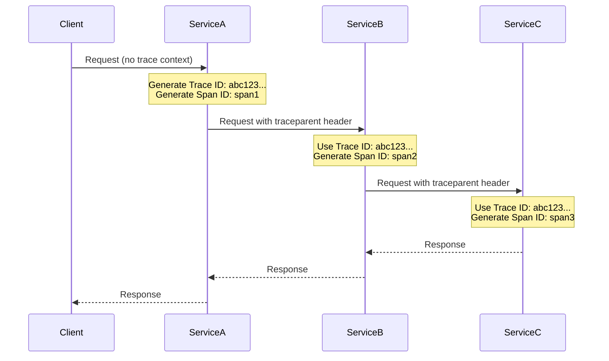
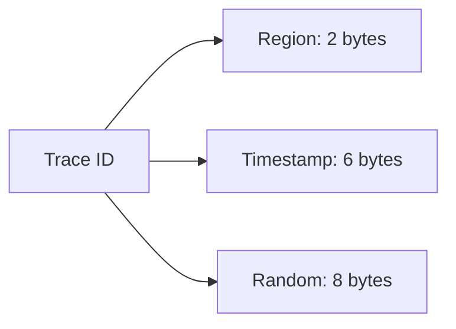
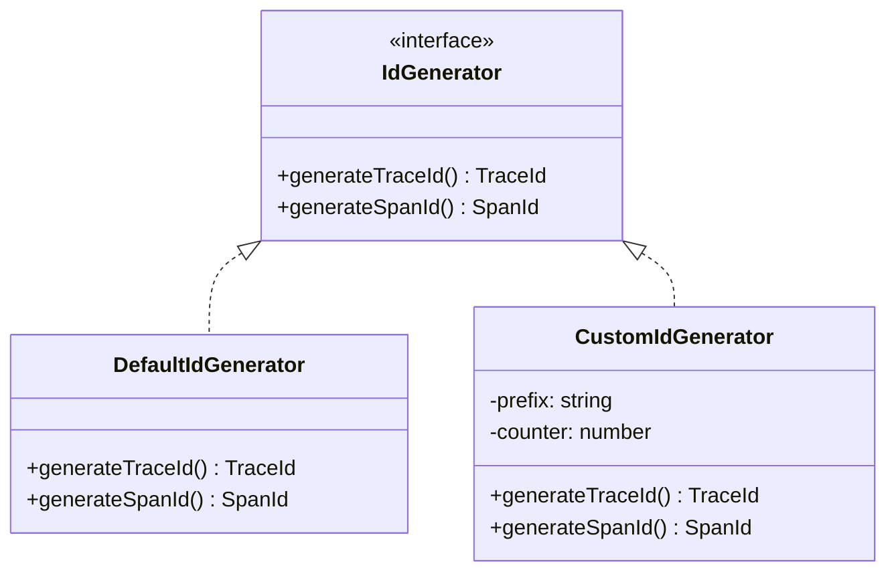
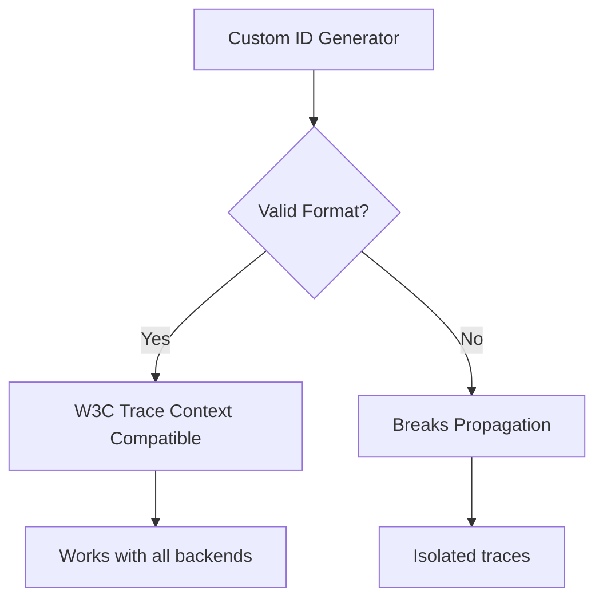

# How to Create OpenTelemetry ID Generators

Author: [nawazdhandala](https://github.com/nawazdhandala)

Tags: OpenTelemetry, Tracing, ID Generation, Observability

Description: Learn how to create custom ID generators in OpenTelemetry for trace IDs and span IDs. This guide covers the default implementations, when to customize them, and practical examples in multiple languages.

---

Every trace and span in OpenTelemetry needs a unique identifier. These IDs are the backbone of distributed tracing, linking spans across services and enabling you to follow a request's journey through your entire system. While OpenTelemetry provides default ID generators that work well for most cases, there are scenarios where creating custom generators becomes essential.

This guide walks you through understanding OpenTelemetry ID generation, when you might need custom generators, and how to implement them in practice.

---

## Table of Contents

1. Understanding OpenTelemetry IDs
2. The Default ID Generator
3. Why Create Custom ID Generators
4. Anatomy of a Custom ID Generator
5. Implementation in Node.js/TypeScript
6. Implementation in Python
7. Implementation in Go
8. Implementation in Java
9. Testing Your ID Generator
10. Performance Considerations
11. Common Patterns and Use Cases
12. Best Practices
13. Troubleshooting

---

## 1. Understanding OpenTelemetry IDs

OpenTelemetry uses two types of identifiers:

| ID Type | Size | Format | Purpose |
|---------|------|--------|---------|
| Trace ID | 16 bytes (128 bits) | 32 hex characters | Uniquely identifies a complete trace across all services |
| Span ID | 8 bytes (64 bits) | 16 hex characters | Uniquely identifies a single span within a trace |

Example IDs:

```
Trace ID: 4bf92f3577b34da6a3ce929d0e0e4736
Span ID:  00f067aa0ba902b7
```

These IDs must be globally unique to avoid trace collisions. The W3C Trace Context specification requires that trace IDs and span IDs are random or pseudo-random to ensure uniqueness across distributed systems.

### How IDs Flow Through a System



---

## 2. The Default ID Generator

OpenTelemetry SDKs come with a default ID generator that uses cryptographically secure random number generation. Here is how the default generator works conceptually:

```typescript
// Conceptual representation of the default generator
class DefaultIdGenerator {
  generateTraceId(): string {
    // Generate 16 random bytes
    const bytes = crypto.randomBytes(16);
    return bytes.toString('hex');
  }

  generateSpanId(): string {
    // Generate 8 random bytes
    const bytes = crypto.randomBytes(8);
    return bytes.toString('hex');
  }
}
```

The default generator:
- Uses the platform's cryptographic random number generator
- Produces uniformly distributed IDs
- Has extremely low collision probability (2^128 possible trace IDs)
- Works well for most production scenarios

---

## 3. Why Create Custom ID Generators

While the default generator works for most cases, custom ID generators become valuable in specific scenarios:

### Debugging and Testing

During development, predictable or sequential IDs make debugging easier:

```
Sequential: 00000000000000000000000000000001
            00000000000000000000000000000002
            00000000000000000000000000000003
```

### Embedding Metadata

Some organizations embed information in trace IDs for routing or identification:



### Correlation with External Systems

When integrating with legacy systems or third-party tools that have their own ID formats:

```
Legacy System ID: REQ-2024-001234
OpenTelemetry ID: Custom generator that incorporates legacy reference
```

### Deterministic Testing

For integration tests, reproducible IDs ensure consistent test results:

```typescript
// Test-friendly generator with seed
const generator = new SeededIdGenerator(42);
// Always produces the same sequence of IDs
```

### Compliance and Auditing

Some regulatory environments require specific ID formats or the ability to trace ID generation:

```
Audit Trail ID: [datacenter]-[timestamp]-[sequence]-[random]
```

---

## 4. Anatomy of a Custom ID Generator

Every OpenTelemetry ID generator must implement a specific interface. Here is the general structure:



Key requirements for any ID generator:

1. **Thread Safety**: Must be safe to call from multiple threads/goroutines
2. **Non-Zero IDs**: Must never return all-zero IDs (invalid per spec)
3. **Correct Length**: Trace IDs must be 16 bytes, span IDs must be 8 bytes
4. **Performance**: Should be fast enough to not impact request latency

---

## 5. Implementation in Node.js/TypeScript

### Basic Custom Generator

```typescript
import { IdGenerator } from '@opentelemetry/sdk-trace-base';
import * as crypto from 'crypto';

// Custom ID generator with a prefix for easy identification
export class PrefixedIdGenerator implements IdGenerator {
  private readonly prefix: Buffer;

  constructor(prefixHex: string = 'cafe') {
    // Ensure prefix is exactly 2 bytes (4 hex chars)
    const normalizedPrefix = prefixHex.padStart(4, '0').slice(0, 4);
    this.prefix = Buffer.from(normalizedPrefix, 'hex');
  }

  generateTraceId(): string {
    // 2 bytes prefix + 14 bytes random = 16 bytes total
    const randomPart = crypto.randomBytes(14);
    const traceId = Buffer.concat([this.prefix, randomPart]);
    return traceId.toString('hex');
  }

  generateSpanId(): string {
    // Standard 8 bytes random for span ID
    return crypto.randomBytes(8).toString('hex');
  }
}
```

### Timestamp-Based Generator

This generator embeds a timestamp for easier debugging and log correlation:

```typescript
import { IdGenerator } from '@opentelemetry/sdk-trace-base';
import * as crypto from 'crypto';

export class TimestampIdGenerator implements IdGenerator {
  generateTraceId(): string {
    // Get current timestamp in milliseconds (6 bytes max)
    const timestamp = Date.now();
    const timestampBuffer = Buffer.alloc(6);
    // Write timestamp as big-endian (most significant bytes first)
    timestampBuffer.writeUIntBE(timestamp, 0, 6);

    // Generate 10 random bytes for uniqueness
    const randomPart = crypto.randomBytes(10);

    // Combine: 6 bytes timestamp + 10 bytes random = 16 bytes
    const traceId = Buffer.concat([timestampBuffer, randomPart]);
    return traceId.toString('hex');
  }

  generateSpanId(): string {
    return crypto.randomBytes(8).toString('hex');
  }
}

// Usage example: extracting timestamp from trace ID
function extractTimestamp(traceId: string): Date {
  const timestampHex = traceId.slice(0, 12);
  const timestamp = parseInt(timestampHex, 16);
  return new Date(timestamp);
}
```

### Sequential Generator for Testing

```typescript
import { IdGenerator } from '@opentelemetry/sdk-trace-base';

export class SequentialIdGenerator implements IdGenerator {
  private traceCounter: bigint = BigInt(0);
  private spanCounter: bigint = BigInt(0);

  generateTraceId(): string {
    this.traceCounter++;
    // Pad to 32 hex characters (16 bytes)
    return this.traceCounter.toString(16).padStart(32, '0');
  }

  generateSpanId(): string {
    this.spanCounter++;
    // Pad to 16 hex characters (8 bytes)
    return this.spanCounter.toString(16).padStart(16, '0');
  }

  // Reset counters for test isolation
  reset(): void {
    this.traceCounter = BigInt(0);
    this.spanCounter = BigInt(0);
  }
}
```

### Integrating with the SDK

```typescript
import { NodeSDK } from '@opentelemetry/sdk-node';
import { SimpleSpanProcessor } from '@opentelemetry/sdk-trace-base';
import { OTLPTraceExporter } from '@opentelemetry/exporter-trace-otlp-http';
import { TimestampIdGenerator } from './timestamp-id-generator';

const exporter = new OTLPTraceExporter({
  url: process.env.OTEL_EXPORTER_OTLP_ENDPOINT || 'http://localhost:4318/v1/traces',
});

const sdk = new NodeSDK({
  traceExporter: exporter,
  // Use custom ID generator
  idGenerator: new TimestampIdGenerator(),
  serviceName: 'my-service',
});

sdk.start();
```

---

## 6. Implementation in Python

### Basic Custom Generator

```python
from opentelemetry.sdk.trace import IdGenerator
from opentelemetry.trace import TraceId, SpanId
import secrets
import time

class PrefixedIdGenerator(IdGenerator):
    """ID generator that adds a prefix to trace IDs."""

    def __init__(self, prefix: int = 0xCAFE):
        self.prefix = prefix & 0xFFFF  # Ensure 2 bytes

    def generate_trace_id(self) -> int:
        # Prefix (2 bytes) + random (14 bytes) = 16 bytes
        random_part = secrets.randbits(112)  # 14 bytes = 112 bits
        trace_id = (self.prefix << 112) | random_part
        return trace_id

    def generate_span_id(self) -> int:
        # Standard 8 bytes random
        return secrets.randbits(64)


class TimestampIdGenerator(IdGenerator):
    """ID generator that embeds timestamp in trace IDs."""

    def generate_trace_id(self) -> int:
        # Timestamp in milliseconds (6 bytes) + random (10 bytes)
        timestamp_ms = int(time.time() * 1000) & 0xFFFFFFFFFFFF
        random_part = secrets.randbits(80)  # 10 bytes = 80 bits
        trace_id = (timestamp_ms << 80) | random_part
        return trace_id

    def generate_span_id(self) -> int:
        return secrets.randbits(64)

    @staticmethod
    def extract_timestamp(trace_id: int) -> float:
        """Extract the embedded timestamp from a trace ID."""
        timestamp_ms = trace_id >> 80
        return timestamp_ms / 1000.0
```

### Thread-Safe Sequential Generator

```python
from opentelemetry.sdk.trace import IdGenerator
import threading

class SequentialIdGenerator(IdGenerator):
    """Thread-safe sequential ID generator for testing."""

    def __init__(self):
        self._trace_counter = 0
        self._span_counter = 0
        self._lock = threading.Lock()

    def generate_trace_id(self) -> int:
        with self._lock:
            self._trace_counter += 1
            return self._trace_counter

    def generate_span_id(self) -> int:
        with self._lock:
            self._span_counter += 1
            return self._span_counter

    def reset(self):
        """Reset counters for test isolation."""
        with self._lock:
            self._trace_counter = 0
            self._span_counter = 0
```

### Integrating with the SDK

```python
from opentelemetry import trace
from opentelemetry.sdk.trace import TracerProvider
from opentelemetry.sdk.trace.export import BatchSpanProcessor
from opentelemetry.exporter.otlp.proto.http.trace_exporter import OTLPSpanExporter

# Create custom ID generator
id_generator = TimestampIdGenerator()

# Create tracer provider with custom generator
provider = TracerProvider(id_generator=id_generator)

# Add exporter
exporter = OTLPSpanExporter(endpoint="http://localhost:4318/v1/traces")
provider.add_span_processor(BatchSpanProcessor(exporter))

# Set as global provider
trace.set_tracer_provider(provider)

# Get tracer and create spans
tracer = trace.get_tracer("my-service")
with tracer.start_as_current_span("my-operation") as span:
    trace_id = span.get_span_context().trace_id
    print(f"Trace ID: {trace_id:032x}")

    # Extract timestamp from custom trace ID
    timestamp = TimestampIdGenerator.extract_timestamp(trace_id)
    print(f"Embedded timestamp: {timestamp}")
```

---

## 7. Implementation in Go

### Basic Custom Generator

```go
package main

import (
    "crypto/rand"
    "encoding/binary"
    "sync/atomic"
    "time"

    "go.opentelemetry.io/otel/sdk/trace"
    oteltrace "go.opentelemetry.io/otel/trace"
)

// PrefixedIDGenerator generates trace IDs with a custom prefix
type PrefixedIDGenerator struct {
    prefix uint16
}

func NewPrefixedIDGenerator(prefix uint16) *PrefixedIDGenerator {
    return &PrefixedIDGenerator{prefix: prefix}
}

func (g *PrefixedIDGenerator) NewIDs(ctx context.Context) (oteltrace.TraceID, oteltrace.SpanID) {
    traceID := g.NewTraceID(ctx)
    spanID := g.NewSpanID(ctx, traceID)
    return traceID, spanID
}

func (g *PrefixedIDGenerator) NewTraceID(ctx context.Context) oteltrace.TraceID {
    var traceID oteltrace.TraceID

    // Set prefix in first 2 bytes
    binary.BigEndian.PutUint16(traceID[:2], g.prefix)

    // Fill remaining 14 bytes with random data
    rand.Read(traceID[2:])

    return traceID
}

func (g *PrefixedIDGenerator) NewSpanID(ctx context.Context, traceID oteltrace.TraceID) oteltrace.SpanID {
    var spanID oteltrace.SpanID
    rand.Read(spanID[:])
    return spanID
}
```

### Timestamp-Based Generator

```go
package main

import (
    "context"
    "crypto/rand"
    "encoding/binary"
    "time"

    oteltrace "go.opentelemetry.io/otel/trace"
)

// TimestampIDGenerator embeds timestamp in trace IDs
type TimestampIDGenerator struct{}

func NewTimestampIDGenerator() *TimestampIDGenerator {
    return &TimestampIDGenerator{}
}

func (g *TimestampIDGenerator) NewIDs(ctx context.Context) (oteltrace.TraceID, oteltrace.SpanID) {
    return g.NewTraceID(ctx), g.NewSpanID(ctx, oteltrace.TraceID{})
}

func (g *TimestampIDGenerator) NewTraceID(ctx context.Context) oteltrace.TraceID {
    var traceID oteltrace.TraceID

    // Get current timestamp in milliseconds (fits in 6 bytes)
    timestamp := uint64(time.Now().UnixMilli())

    // Write timestamp to first 6 bytes (big-endian, skip first 2 bytes of uint64)
    binary.BigEndian.PutUint64(traceID[:8], timestamp<<16)

    // Fill remaining 10 bytes with random data
    rand.Read(traceID[6:])

    return traceID
}

func (g *TimestampIDGenerator) NewSpanID(ctx context.Context, traceID oteltrace.TraceID) oteltrace.SpanID {
    var spanID oteltrace.SpanID
    rand.Read(spanID[:])
    return spanID
}

// ExtractTimestamp extracts the embedded timestamp from a trace ID
func ExtractTimestamp(traceID oteltrace.TraceID) time.Time {
    // Read first 8 bytes and shift right to get timestamp
    rawTimestamp := binary.BigEndian.Uint64(traceID[:8])
    timestampMs := rawTimestamp >> 16
    return time.UnixMilli(int64(timestampMs))
}
```

### Sequential Generator for Testing

```go
package main

import (
    "context"
    "encoding/binary"
    "sync/atomic"

    oteltrace "go.opentelemetry.io/otel/trace"
)

// SequentialIDGenerator generates sequential IDs for testing
type SequentialIDGenerator struct {
    traceCounter uint64
    spanCounter  uint64
}

func NewSequentialIDGenerator() *SequentialIDGenerator {
    return &SequentialIDGenerator{}
}

func (g *SequentialIDGenerator) NewIDs(ctx context.Context) (oteltrace.TraceID, oteltrace.SpanID) {
    return g.NewTraceID(ctx), g.NewSpanID(ctx, oteltrace.TraceID{})
}

func (g *SequentialIDGenerator) NewTraceID(ctx context.Context) oteltrace.TraceID {
    var traceID oteltrace.TraceID
    counter := atomic.AddUint64(&g.traceCounter, 1)
    // Put counter in the last 8 bytes (big-endian)
    binary.BigEndian.PutUint64(traceID[8:], counter)
    return traceID
}

func (g *SequentialIDGenerator) NewSpanID(ctx context.Context, traceID oteltrace.TraceID) oteltrace.SpanID {
    var spanID oteltrace.SpanID
    counter := atomic.AddUint64(&g.spanCounter, 1)
    binary.BigEndian.PutUint64(spanID[:], counter)
    return spanID
}

func (g *SequentialIDGenerator) Reset() {
    atomic.StoreUint64(&g.traceCounter, 0)
    atomic.StoreUint64(&g.spanCounter, 0)
}
```

### Integrating with the SDK

```go
package main

import (
    "context"
    "log"

    "go.opentelemetry.io/otel"
    "go.opentelemetry.io/otel/exporters/otlp/otlptrace/otlptracehttp"
    "go.opentelemetry.io/otel/sdk/resource"
    "go.opentelemetry.io/otel/sdk/trace"
    semconv "go.opentelemetry.io/otel/semconv/v1.21.0"
)

func initTracer() (*trace.TracerProvider, error) {
    ctx := context.Background()

    // Create OTLP exporter
    exporter, err := otlptracehttp.New(ctx,
        otlptracehttp.WithEndpoint("localhost:4318"),
        otlptracehttp.WithInsecure(),
    )
    if err != nil {
        return nil, err
    }

    // Create resource
    res, err := resource.New(ctx,
        resource.WithAttributes(
            semconv.ServiceName("my-service"),
        ),
    )
    if err != nil {
        return nil, err
    }

    // Create tracer provider with custom ID generator
    tp := trace.NewTracerProvider(
        trace.WithBatcher(exporter),
        trace.WithResource(res),
        trace.WithIDGenerator(NewTimestampIDGenerator()),
    )

    otel.SetTracerProvider(tp)
    return tp, nil
}

func main() {
    tp, err := initTracer()
    if err != nil {
        log.Fatal(err)
    }
    defer tp.Shutdown(context.Background())

    tracer := otel.Tracer("my-service")
    ctx, span := tracer.Start(context.Background(), "my-operation")

    // Access the trace ID
    traceID := span.SpanContext().TraceID()
    log.Printf("Trace ID: %s", traceID.String())

    // Extract embedded timestamp
    timestamp := ExtractTimestamp(traceID)
    log.Printf("Embedded timestamp: %s", timestamp.Format(time.RFC3339))

    span.End()
}
```

---

## 8. Implementation in Java

### Basic Custom Generator

```java
package com.example.otel;

import io.opentelemetry.sdk.trace.IdGenerator;
import java.security.SecureRandom;
import java.util.concurrent.ThreadLocalRandom;

public class PrefixedIdGenerator implements IdGenerator {
    private final short prefix;
    private final SecureRandom random = new SecureRandom();

    public PrefixedIdGenerator(short prefix) {
        this.prefix = prefix;
    }

    @Override
    public String generateTraceId() {
        // 2 bytes prefix + 14 bytes random = 16 bytes
        byte[] traceIdBytes = new byte[16];

        // Set prefix in first 2 bytes (big-endian)
        traceIdBytes[0] = (byte) (prefix >> 8);
        traceIdBytes[1] = (byte) prefix;

        // Fill remaining bytes with random data
        byte[] randomBytes = new byte[14];
        random.nextBytes(randomBytes);
        System.arraycopy(randomBytes, 0, traceIdBytes, 2, 14);

        return bytesToHex(traceIdBytes);
    }

    @Override
    public String generateSpanId() {
        byte[] spanIdBytes = new byte[8];
        random.nextBytes(spanIdBytes);
        return bytesToHex(spanIdBytes);
    }

    private static String bytesToHex(byte[] bytes) {
        StringBuilder sb = new StringBuilder();
        for (byte b : bytes) {
            sb.append(String.format("%02x", b));
        }
        return sb.toString();
    }
}
```

### Timestamp-Based Generator

```java
package com.example.otel;

import io.opentelemetry.sdk.trace.IdGenerator;
import java.security.SecureRandom;
import java.time.Instant;

public class TimestampIdGenerator implements IdGenerator {
    private final SecureRandom random = new SecureRandom();

    @Override
    public String generateTraceId() {
        // 6 bytes timestamp + 10 bytes random = 16 bytes
        byte[] traceIdBytes = new byte[16];

        // Get current timestamp in milliseconds
        long timestampMs = System.currentTimeMillis();

        // Write timestamp to first 6 bytes (big-endian)
        traceIdBytes[0] = (byte) (timestampMs >> 40);
        traceIdBytes[1] = (byte) (timestampMs >> 32);
        traceIdBytes[2] = (byte) (timestampMs >> 24);
        traceIdBytes[3] = (byte) (timestampMs >> 16);
        traceIdBytes[4] = (byte) (timestampMs >> 8);
        traceIdBytes[5] = (byte) timestampMs;

        // Fill remaining 10 bytes with random data
        byte[] randomBytes = new byte[10];
        random.nextBytes(randomBytes);
        System.arraycopy(randomBytes, 0, traceIdBytes, 6, 10);

        return bytesToHex(traceIdBytes);
    }

    @Override
    public String generateSpanId() {
        byte[] spanIdBytes = new byte[8];
        random.nextBytes(spanIdBytes);
        return bytesToHex(spanIdBytes);
    }

    public static Instant extractTimestamp(String traceId) {
        // Parse first 12 hex characters (6 bytes) as timestamp
        long timestampMs = Long.parseLong(traceId.substring(0, 12), 16);
        return Instant.ofEpochMilli(timestampMs);
    }

    private static String bytesToHex(byte[] bytes) {
        StringBuilder sb = new StringBuilder();
        for (byte b : bytes) {
            sb.append(String.format("%02x", b));
        }
        return sb.toString();
    }
}
```

### Integrating with the SDK

```java
package com.example.otel;

import io.opentelemetry.api.OpenTelemetry;
import io.opentelemetry.api.trace.Span;
import io.opentelemetry.api.trace.Tracer;
import io.opentelemetry.exporter.otlp.http.trace.OtlpHttpSpanExporter;
import io.opentelemetry.sdk.OpenTelemetrySdk;
import io.opentelemetry.sdk.resources.Resource;
import io.opentelemetry.sdk.trace.SdkTracerProvider;
import io.opentelemetry.sdk.trace.export.BatchSpanProcessor;
import io.opentelemetry.semconv.resource.attributes.ResourceAttributes;

public class TracingSetup {

    public static OpenTelemetry initOpenTelemetry() {
        // Create OTLP exporter
        OtlpHttpSpanExporter exporter = OtlpHttpSpanExporter.builder()
            .setEndpoint("http://localhost:4318/v1/traces")
            .build();

        // Create resource
        Resource resource = Resource.getDefault()
            .merge(Resource.create(
                io.opentelemetry.api.common.Attributes.of(
                    ResourceAttributes.SERVICE_NAME, "my-service"
                )
            ));

        // Create tracer provider with custom ID generator
        SdkTracerProvider tracerProvider = SdkTracerProvider.builder()
            .addSpanProcessor(BatchSpanProcessor.builder(exporter).build())
            .setResource(resource)
            .setIdGenerator(new TimestampIdGenerator())
            .build();

        return OpenTelemetrySdk.builder()
            .setTracerProvider(tracerProvider)
            .buildAndRegisterGlobal();
    }

    public static void main(String[] args) {
        OpenTelemetry openTelemetry = initOpenTelemetry();
        Tracer tracer = openTelemetry.getTracer("my-service");

        Span span = tracer.spanBuilder("my-operation").startSpan();
        try {
            String traceId = span.getSpanContext().getTraceId();
            System.out.println("Trace ID: " + traceId);

            // Extract embedded timestamp
            java.time.Instant timestamp = TimestampIdGenerator.extractTimestamp(traceId);
            System.out.println("Embedded timestamp: " + timestamp);
        } finally {
            span.end();
        }
    }
}
```

---

## 9. Testing Your ID Generator

Thorough testing ensures your ID generator works correctly in production.

### Unit Tests (TypeScript/Jest)

```typescript
import { TimestampIdGenerator } from './timestamp-id-generator';
import { SequentialIdGenerator } from './sequential-id-generator';

describe('TimestampIdGenerator', () => {
  let generator: TimestampIdGenerator;

  beforeEach(() => {
    generator = new TimestampIdGenerator();
  });

  it('should generate valid trace ID length', () => {
    const traceId = generator.generateTraceId();
    expect(traceId).toHaveLength(32); // 16 bytes = 32 hex chars
  });

  it('should generate valid span ID length', () => {
    const spanId = generator.generateSpanId();
    expect(spanId).toHaveLength(16); // 8 bytes = 16 hex chars
  });

  it('should generate unique trace IDs', () => {
    const ids = new Set<string>();
    for (let i = 0; i < 10000; i++) {
      ids.add(generator.generateTraceId());
    }
    expect(ids.size).toBe(10000);
  });

  it('should embed extractable timestamp', () => {
    const beforeGen = Date.now();
    const traceId = generator.generateTraceId();
    const afterGen = Date.now();

    const extractedTimestamp = extractTimestamp(traceId);

    expect(extractedTimestamp.getTime()).toBeGreaterThanOrEqual(beforeGen);
    expect(extractedTimestamp.getTime()).toBeLessThanOrEqual(afterGen);
  });

  it('should never generate all-zero IDs', () => {
    for (let i = 0; i < 1000; i++) {
      const traceId = generator.generateTraceId();
      const spanId = generator.generateSpanId();

      expect(traceId).not.toBe('00000000000000000000000000000000');
      expect(spanId).not.toBe('0000000000000000');
    }
  });
});

describe('SequentialIdGenerator', () => {
  let generator: SequentialIdGenerator;

  beforeEach(() => {
    generator = new SequentialIdGenerator();
  });

  it('should generate sequential trace IDs', () => {
    const id1 = generator.generateTraceId();
    const id2 = generator.generateTraceId();
    const id3 = generator.generateTraceId();

    expect(id1).toBe('00000000000000000000000000000001');
    expect(id2).toBe('00000000000000000000000000000002');
    expect(id3).toBe('00000000000000000000000000000003');
  });

  it('should reset counters correctly', () => {
    generator.generateTraceId();
    generator.generateTraceId();
    generator.reset();

    const id = generator.generateTraceId();
    expect(id).toBe('00000000000000000000000000000001');
  });
});
```

### Concurrency Tests (Go)

```go
package main

import (
    "sync"
    "testing"
)

func TestTimestampIDGenerator_Concurrency(t *testing.T) {
    generator := NewTimestampIDGenerator()
    ids := make(map[string]bool)
    var mu sync.Mutex
    var wg sync.WaitGroup

    numGoroutines := 100
    idsPerGoroutine := 1000

    for i := 0; i < numGoroutines; i++ {
        wg.Add(1)
        go func() {
            defer wg.Done()
            localIDs := make([]string, idsPerGoroutine)

            for j := 0; j < idsPerGoroutine; j++ {
                traceID := generator.NewTraceID(context.Background())
                localIDs[j] = traceID.String()
            }

            mu.Lock()
            for _, id := range localIDs {
                if ids[id] {
                    t.Errorf("Duplicate trace ID: %s", id)
                }
                ids[id] = true
            }
            mu.Unlock()
        }()
    }

    wg.Wait()

    expectedTotal := numGoroutines * idsPerGoroutine
    if len(ids) != expectedTotal {
        t.Errorf("Expected %d unique IDs, got %d", expectedTotal, len(ids))
    }
}
```

---

## 10. Performance Considerations

ID generation happens on every span creation, so performance matters.

### Benchmarking

```typescript
// benchmark.ts
import { performance } from 'perf_hooks';
import { TimestampIdGenerator } from './timestamp-id-generator';

function benchmark(generator: { generateTraceId: () => string }, iterations: number): number {
  const start = performance.now();
  for (let i = 0; i < iterations; i++) {
    generator.generateTraceId();
  }
  return performance.now() - start;
}

const generator = new TimestampIdGenerator();
const iterations = 100000;
const duration = benchmark(generator, iterations);

console.log(`Generated ${iterations} trace IDs in ${duration.toFixed(2)}ms`);
console.log(`Average: ${(duration / iterations * 1000).toFixed(2)} microseconds per ID`);
```

### Performance Guidelines

| Aspect | Recommendation |
|--------|----------------|
| Random number generation | Use crypto libraries, but consider buffering random bytes |
| Memory allocation | Reuse buffers when possible |
| Locking | Minimize lock scope; use atomic operations for counters |
| String conversion | Avoid repeated allocations; use pre-computed lookup tables |

### Optimized Generator Example

```typescript
import { IdGenerator } from '@opentelemetry/sdk-trace-base';
import * as crypto from 'crypto';

export class OptimizedIdGenerator implements IdGenerator {
  // Pre-allocate buffer for random bytes (batch generation)
  private randomBuffer: Buffer;
  private bufferOffset: number = 0;
  private readonly bufferSize = 4096; // Generate 4KB at a time

  // Hex lookup table for fast conversion
  private static readonly HEX_TABLE: string[] = Array.from(
    { length: 256 },
    (_, i) => i.toString(16).padStart(2, '0')
  );

  constructor() {
    this.randomBuffer = crypto.randomBytes(this.bufferSize);
  }

  private getRandomBytes(length: number): Buffer {
    if (this.bufferOffset + length > this.bufferSize) {
      // Refill buffer
      this.randomBuffer = crypto.randomBytes(this.bufferSize);
      this.bufferOffset = 0;
    }

    const bytes = this.randomBuffer.subarray(
      this.bufferOffset,
      this.bufferOffset + length
    );
    this.bufferOffset += length;
    return bytes;
  }

  private bytesToHex(bytes: Buffer): string {
    let result = '';
    for (let i = 0; i < bytes.length; i++) {
      result += OptimizedIdGenerator.HEX_TABLE[bytes[i]];
    }
    return result;
  }

  generateTraceId(): string {
    return this.bytesToHex(this.getRandomBytes(16));
  }

  generateSpanId(): string {
    return this.bytesToHex(this.getRandomBytes(8));
  }
}
```

---

## 11. Common Patterns and Use Cases

### Multi-Region Identifier

Embed region information for routing and debugging:

```typescript
export class RegionAwareIdGenerator implements IdGenerator {
  private readonly regionCode: number;

  constructor(region: 'us-east' | 'us-west' | 'eu-west' | 'ap-south') {
    const regionMap = {
      'us-east': 0x01,
      'us-west': 0x02,
      'eu-west': 0x03,
      'ap-south': 0x04,
    };
    this.regionCode = regionMap[region];
  }

  generateTraceId(): string {
    const buffer = Buffer.alloc(16);

    // Byte 0: Region code
    buffer[0] = this.regionCode;

    // Bytes 1-6: Timestamp (milliseconds)
    const timestamp = Date.now();
    buffer.writeUIntBE(timestamp, 1, 6);

    // Bytes 7-15: Random
    crypto.randomBytes(9).copy(buffer, 7);

    return buffer.toString('hex');
  }

  generateSpanId(): string {
    return crypto.randomBytes(8).toString('hex');
  }
}

// Utility to decode region from trace ID
function getRegionFromTraceId(traceId: string): string {
  const regionCode = parseInt(traceId.slice(0, 2), 16);
  const regionMap: Record<number, string> = {
    0x01: 'us-east',
    0x02: 'us-west',
    0x03: 'eu-west',
    0x04: 'ap-south',
  };
  return regionMap[regionCode] || 'unknown';
}
```

### Request Correlation Generator

Link trace IDs to external request identifiers:

```typescript
export class CorrelatedIdGenerator implements IdGenerator {
  private currentCorrelationId: string | null = null;

  setCorrelationId(externalId: string): void {
    // Hash external ID to create deterministic portion
    this.currentCorrelationId = externalId;
  }

  clearCorrelationId(): void {
    this.currentCorrelationId = null;
  }

  generateTraceId(): string {
    if (this.currentCorrelationId) {
      // Use hash of correlation ID for first 8 bytes
      const hash = crypto.createHash('sha256')
        .update(this.currentCorrelationId)
        .digest();

      const buffer = Buffer.alloc(16);
      hash.copy(buffer, 0, 0, 8);
      crypto.randomBytes(8).copy(buffer, 8);

      return buffer.toString('hex');
    }

    return crypto.randomBytes(16).toString('hex');
  }

  generateSpanId(): string {
    return crypto.randomBytes(8).toString('hex');
  }
}

// Usage in middleware
app.use((req, res, next) => {
  const externalRequestId = req.headers['x-request-id'];
  if (externalRequestId) {
    idGenerator.setCorrelationId(externalRequestId as string);
  }

  res.on('finish', () => {
    idGenerator.clearCorrelationId();
  });

  next();
});
```

### Debug Mode Generator

Automatically switch to readable IDs in development:

```typescript
export class EnvironmentAwareIdGenerator implements IdGenerator {
  private readonly productionGenerator: IdGenerator;
  private readonly debugGenerator: SequentialIdGenerator;
  private readonly isDebugMode: boolean;

  constructor() {
    this.productionGenerator = new TimestampIdGenerator();
    this.debugGenerator = new SequentialIdGenerator();
    this.isDebugMode = process.env.NODE_ENV === 'development';
  }

  generateTraceId(): string {
    return this.isDebugMode
      ? this.debugGenerator.generateTraceId()
      : this.productionGenerator.generateTraceId();
  }

  generateSpanId(): string {
    return this.isDebugMode
      ? this.debugGenerator.generateSpanId()
      : this.productionGenerator.generateSpanId();
  }
}
```

---

## 12. Best Practices

### Do

1. **Ensure uniqueness**: Use cryptographically secure random sources
2. **Maintain correct lengths**: Trace IDs must be 32 hex chars, span IDs must be 16 hex chars
3. **Avoid all-zero IDs**: These are invalid per the W3C spec
4. **Make generators thread-safe**: Multiple requests will call them concurrently
5. **Test thoroughly**: Include uniqueness tests, concurrency tests, and format validation
6. **Document your format**: If embedding metadata, document how to decode it

### Do Not

1. **Do not use predictable sequences in production**: This creates security risks
2. **Do not embed sensitive data**: Trace IDs are often logged and shared
3. **Do not sacrifice too much randomness**: At least 8 bytes should be random
4. **Do not ignore performance**: ID generation happens frequently
5. **Do not break W3C compatibility**: Other systems expect standard formats

### Format Compatibility



---

## 13. Troubleshooting

### Common Issues

| Problem | Cause | Solution |
|---------|-------|----------|
| Traces not linking across services | ID format incompatible | Ensure 32 hex char trace IDs, 16 hex char span IDs |
| Duplicate trace IDs | Insufficient randomness | Use crypto.randomBytes or equivalent |
| All-zero IDs appearing | Bug in generator logic | Add validation to reject zero IDs |
| Performance degradation | Expensive random generation | Batch random bytes, use lookup tables |
| Thread safety issues | Shared mutable state | Use atomic operations or proper locking |

### Debugging Checklist

1. Verify ID lengths match specification
2. Confirm IDs are never all zeros
3. Test uniqueness under concurrent load
4. Check that embedded timestamps (if any) decode correctly
5. Validate format compatibility with your observability backend

### Validation Helper

```typescript
export function validateTraceId(traceId: string): boolean {
  // Must be 32 hex characters
  if (!/^[0-9a-f]{32}$/i.test(traceId)) {
    return false;
  }

  // Must not be all zeros
  if (traceId === '00000000000000000000000000000000') {
    return false;
  }

  return true;
}

export function validateSpanId(spanId: string): boolean {
  // Must be 16 hex characters
  if (!/^[0-9a-f]{16}$/i.test(spanId)) {
    return false;
  }

  // Must not be all zeros
  if (spanId === '0000000000000000') {
    return false;
  }

  return true;
}
```

---

## Summary

Custom ID generators in OpenTelemetry give you control over how trace and span identifiers are created. While the default generator works for most scenarios, custom generators enable:

- Embedded metadata for debugging and routing
- Deterministic IDs for testing
- Correlation with external systems
- Compliance with specific organizational requirements

Key points to remember:

1. Always maintain W3C Trace Context compatibility
2. Ensure sufficient randomness to prevent collisions
3. Test thoroughly for uniqueness and thread safety
4. Consider performance implications
5. Document any custom format decisions

With the implementations provided in this guide, you can create ID generators tailored to your specific observability needs while maintaining interoperability with the broader OpenTelemetry ecosystem.

---

*Ready to visualize your custom traces? Send them to [OneUptime](https://oneuptime.com) via OTLP and get full-fidelity distributed tracing with logs and metrics correlation.*

---

### Related Reading

- [What are Traces and Spans in OpenTelemetry](https://oneuptime.com/blog/post/traces-and-spans-in-opentelemetry/view)
- [How to Name Spans in OpenTelemetry](https://oneuptime.com/blog/post/how-to-name-spans-in-opentelemetry/view)
- [How to Reduce Noise in OpenTelemetry](https://oneuptime.com/blog/post/how-to-reduce-noise-in-opentelemetry/view)
