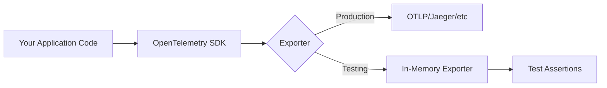

# How to Create OpenTelemetry In-Memory Exporter

Author: [nawazdhandala](https://github.com/nawazdhandala)

Tags: OpenTelemetry, Observability, Testing, Tracing

Description: Learn how to build and use an in-memory exporter for OpenTelemetry to test your instrumentation without external dependencies.

---

Testing observability code presents a unique challenge: how do you verify that spans, metrics, and logs are being emitted correctly without spinning up Jaeger, Prometheus, or a full observability backend? The answer is the in-memory exporter - a lightweight testing tool that captures telemetry data in memory for immediate inspection.

This guide walks through building and using in-memory exporters for traces, metrics, and logs in Node.js/TypeScript applications.

---

## Table of Contents

1. Why In-Memory Exporters?
2. Architecture Overview
3. Setting Up the Test Environment
4. In-Memory Trace Exporter
5. In-Memory Metric Exporter
6. In-Memory Log Exporter
7. Testing Patterns and Best Practices
8. Complete Integration Example
9. Common Pitfalls
10. Summary

---

## 1. Why In-Memory Exporters?

Traditional telemetry testing approaches have significant drawbacks:

| Approach | Problem |
|----------|---------|
| Mock the tracer | Misses SDK behavior, brittle |
| Run Jaeger locally | Slow, heavy, flaky in CI |
| Console exporter | Hard to assert on output |
| Skip testing | Bugs ship silently |

In-memory exporters solve these problems by:

- Capturing real spans/metrics/logs in memory arrays
- Running entirely in-process (no network, no containers)
- Enabling precise assertions on telemetry content
- Working identically in local dev and CI environments

---

## 2. Architecture Overview

The in-memory exporter fits into the standard OpenTelemetry SDK pipeline, replacing the network exporter while keeping all other SDK behavior intact.



The key insight is that the SDK processes spans identically regardless of exporter. This means your tests validate the same code paths as production.

---

## 3. Setting Up the Test Environment

Install the required dependencies for testing with OpenTelemetry.

```bash
npm install @opentelemetry/api \
            @opentelemetry/sdk-trace-base \
            @opentelemetry/sdk-trace-node \
            @opentelemetry/sdk-metrics \
            @opentelemetry/sdk-logs \
            @opentelemetry/resources \
            @opentelemetry/semantic-conventions
```

For testing, you will also need a test framework.

```bash
npm install --save-dev jest @types/jest ts-jest
```

---

## 4. In-Memory Trace Exporter

OpenTelemetry provides a built-in `InMemorySpanExporter` that captures all finished spans in an array.

### Basic Setup

Create a test utility that configures the tracer provider with an in-memory exporter.

```typescript
// test/telemetry-test-utils.ts
import { NodeTracerProvider } from '@opentelemetry/sdk-trace-node';
import {
  InMemorySpanExporter,
  SimpleSpanProcessor
} from '@opentelemetry/sdk-trace-base';
import { Resource } from '@opentelemetry/resources';
import { SemanticResourceAttributes } from '@opentelemetry/semantic-conventions';
import { trace } from '@opentelemetry/api';

export function createTestTracerProvider() {
  const exporter = new InMemorySpanExporter();

  const provider = new NodeTracerProvider({
    resource: new Resource({
      [SemanticResourceAttributes.SERVICE_NAME]: 'test-service',
    }),
  });

  // Use SimpleSpanProcessor for synchronous, immediate export
  provider.addSpanProcessor(new SimpleSpanProcessor(exporter));
  provider.register();

  return { provider, exporter };
}

export function resetTelemetry(exporter: InMemorySpanExporter) {
  exporter.reset();
}
```

### Writing Trace Tests

Test that your instrumented code creates the expected spans with correct attributes.

```typescript
// test/order-service.test.ts
import { createTestTracerProvider, resetTelemetry } from './telemetry-test-utils';
import { trace, SpanStatusCode } from '@opentelemetry/api';
import { InMemorySpanExporter } from '@opentelemetry/sdk-trace-base';

describe('OrderService Tracing', () => {
  let exporter: InMemorySpanExporter;

  beforeAll(() => {
    const setup = createTestTracerProvider();
    exporter = setup.exporter;
  });

  beforeEach(() => {
    resetTelemetry(exporter);
  });

  it('creates a span for order creation', async () => {
    const tracer = trace.getTracer('order-service');

    // Simulate instrumented code
    const span = tracer.startSpan('order.create');
    span.setAttribute('order.id', 'ord-123');
    span.setAttribute('order.total', 99.99);
    span.end();

    // Get finished spans
    const spans = exporter.getFinishedSpans();

    expect(spans).toHaveLength(1);
    expect(spans[0].name).toBe('order.create');
    expect(spans[0].attributes['order.id']).toBe('ord-123');
    expect(spans[0].attributes['order.total']).toBe(99.99);
  });

  it('records errors correctly', async () => {
    const tracer = trace.getTracer('order-service');

    const span = tracer.startSpan('payment.process');
    span.recordException(new Error('Payment declined'));
    span.setStatus({
      code: SpanStatusCode.ERROR,
      message: 'Payment declined'
    });
    span.end();

    const spans = exporter.getFinishedSpans();

    expect(spans[0].status.code).toBe(SpanStatusCode.ERROR);
    expect(spans[0].events).toHaveLength(1);
    expect(spans[0].events[0].name).toBe('exception');
  });
});
```

### Testing Span Hierarchy

Verify that parent-child relationships are correctly established in your traces.

```typescript
it('maintains parent-child span relationships', async () => {
  const tracer = trace.getTracer('order-service');

  tracer.startActiveSpan('http.request', (parentSpan) => {
    tracer.startActiveSpan('db.query', (childSpan) => {
      childSpan.setAttribute('db.statement', 'SELECT * FROM orders');
      childSpan.end();
    });
    parentSpan.end();
  });

  const spans = exporter.getFinishedSpans();

  // Spans are recorded in end order (child first)
  const dbSpan = spans.find(s => s.name === 'db.query');
  const httpSpan = spans.find(s => s.name === 'http.request');

  expect(dbSpan?.parentSpanId).toBe(httpSpan?.spanContext().spanId);
  expect(dbSpan?.spanContext().traceId).toBe(httpSpan?.spanContext().traceId);
});
```

---

## 5. In-Memory Metric Exporter

For metrics, you need to create a custom in-memory reader since the SDK does not provide one out of the box.

### Custom In-Memory Metric Reader

Build a metric reader that collects metrics on demand for testing.

```typescript
// test/in-memory-metric-reader.ts
import {
  MetricReader,
  AggregationTemporality,
  ResourceMetrics,
  InstrumentType,
} from '@opentelemetry/sdk-metrics';

export class InMemoryMetricReader extends MetricReader {
  private _metrics: ResourceMetrics[] = [];

  protected async onForceFlush(): Promise<void> {
    await this.collect();
  }

  protected async onShutdown(): Promise<void> {
    // No cleanup needed
  }

  selectAggregationTemporality(instrumentType: InstrumentType): AggregationTemporality {
    return AggregationTemporality.CUMULATIVE;
  }

  async collect(): Promise<ResourceMetrics[]> {
    const result = await super.collect();
    if (result.resourceMetrics) {
      this._metrics.push(result.resourceMetrics);
    }
    return this._metrics;
  }

  getMetrics(): ResourceMetrics[] {
    return this._metrics;
  }

  reset(): void {
    this._metrics = [];
  }
}
```

### Testing Metrics

Write tests that verify your application emits the correct metrics.

```typescript
// test/metrics.test.ts
import { MeterProvider } from '@opentelemetry/sdk-metrics';
import { Resource } from '@opentelemetry/resources';
import { InMemoryMetricReader } from './in-memory-metric-reader';

describe('Application Metrics', () => {
  let reader: InMemoryMetricReader;
  let meterProvider: MeterProvider;

  beforeEach(() => {
    reader = new InMemoryMetricReader();
    meterProvider = new MeterProvider({
      resource: new Resource({ 'service.name': 'test-service' }),
      readers: [reader],
    });
  });

  afterEach(async () => {
    await meterProvider.shutdown();
  });

  it('records request count correctly', async () => {
    const meter = meterProvider.getMeter('test-meter');
    const counter = meter.createCounter('http.requests', {
      description: 'Total HTTP requests',
    });

    counter.add(1, { 'http.method': 'GET', 'http.route': '/api/orders' });
    counter.add(1, { 'http.method': 'POST', 'http.route': '/api/orders' });
    counter.add(1, { 'http.method': 'GET', 'http.route': '/api/orders' });

    await reader.collect();
    const metrics = reader.getMetrics();

    const requestMetric = metrics[0]?.scopeMetrics[0]?.metrics.find(
      m => m.descriptor.name === 'http.requests'
    );

    expect(requestMetric).toBeDefined();

    // Check data points
    const dataPoints = requestMetric?.dataPoints || [];
    const getOrdersPoint = dataPoints.find(
      dp => dp.attributes['http.method'] === 'GET' &&
            dp.attributes['http.route'] === '/api/orders'
    );

    expect(getOrdersPoint?.value).toBe(2);
  });

  it('records histogram values', async () => {
    const meter = meterProvider.getMeter('test-meter');
    const histogram = meter.createHistogram('http.request.duration', {
      description: 'Request duration in milliseconds',
      unit: 'ms',
    });

    histogram.record(45, { 'http.route': '/api/orders' });
    histogram.record(120, { 'http.route': '/api/orders' });
    histogram.record(30, { 'http.route': '/api/orders' });

    await reader.collect();
    const metrics = reader.getMetrics();

    const durationMetric = metrics[0]?.scopeMetrics[0]?.metrics.find(
      m => m.descriptor.name === 'http.request.duration'
    );

    expect(durationMetric).toBeDefined();

    const dataPoint = durationMetric?.dataPoints[0];
    expect(dataPoint?.value.count).toBe(3);
    expect(dataPoint?.value.sum).toBe(195);
  });
});
```

---

## 6. In-Memory Log Exporter

For the logs signal, create a simple in-memory log record exporter.

### Custom Log Exporter

Build an exporter that stores log records in memory.

```typescript
// test/in-memory-log-exporter.ts
import {
  LogRecordExporter,
  ReadableLogRecord,
} from '@opentelemetry/sdk-logs';
import { ExportResult, ExportResultCode } from '@opentelemetry/core';

export class InMemoryLogExporter implements LogRecordExporter {
  private _logs: ReadableLogRecord[] = [];
  private _stopped = false;

  export(
    logs: ReadableLogRecord[],
    resultCallback: (result: ExportResult) => void
  ): void {
    if (this._stopped) {
      resultCallback({ code: ExportResultCode.FAILED });
      return;
    }

    this._logs.push(...logs);
    resultCallback({ code: ExportResultCode.SUCCESS });
  }

  shutdown(): Promise<void> {
    this._stopped = true;
    return Promise.resolve();
  }

  getLogs(): ReadableLogRecord[] {
    return this._logs;
  }

  reset(): void {
    this._logs = [];
  }
}
```

### Testing Log Output

Verify that your application produces correctly structured log records.

```typescript
// test/logging.test.ts
import {
  LoggerProvider,
  SimpleLogRecordProcessor,
  SeverityNumber,
} from '@opentelemetry/sdk-logs';
import { Resource } from '@opentelemetry/resources';
import { InMemoryLogExporter } from './in-memory-log-exporter';

describe('Application Logging', () => {
  let exporter: InMemoryLogExporter;
  let loggerProvider: LoggerProvider;

  beforeEach(() => {
    exporter = new InMemoryLogExporter();
    loggerProvider = new LoggerProvider({
      resource: new Resource({ 'service.name': 'test-service' }),
    });
    loggerProvider.addLogRecordProcessor(
      new SimpleLogRecordProcessor(exporter)
    );
  });

  afterEach(async () => {
    await loggerProvider.shutdown();
  });

  it('emits structured log records', () => {
    const logger = loggerProvider.getLogger('test-logger');

    logger.emit({
      severityNumber: SeverityNumber.INFO,
      severityText: 'INFO',
      body: 'Order created successfully',
      attributes: {
        'order.id': 'ord-456',
        'customer.id': 'cust-789',
      },
    });

    const logs = exporter.getLogs();

    expect(logs).toHaveLength(1);
    expect(logs[0].body).toBe('Order created successfully');
    expect(logs[0].severityNumber).toBe(SeverityNumber.INFO);
    expect(logs[0].attributes['order.id']).toBe('ord-456');
  });

  it('captures error logs with stack traces', () => {
    const logger = loggerProvider.getLogger('test-logger');
    const error = new Error('Database connection failed');

    logger.emit({
      severityNumber: SeverityNumber.ERROR,
      severityText: 'ERROR',
      body: error.message,
      attributes: {
        'exception.type': error.name,
        'exception.stacktrace': error.stack,
      },
    });

    const logs = exporter.getLogs();

    expect(logs[0].severityNumber).toBe(SeverityNumber.ERROR);
    expect(logs[0].attributes['exception.type']).toBe('Error');
    expect(logs[0].attributes['exception.stacktrace']).toContain('Database connection failed');
  });
});
```

---

## 7. Testing Patterns and Best Practices

### Pattern 1: Test Fixture Factory

Create reusable fixtures that set up complete telemetry for each test.

```typescript
// test/fixtures/telemetry-fixture.ts
import { NodeTracerProvider } from '@opentelemetry/sdk-trace-node';
import { InMemorySpanExporter, SimpleSpanProcessor } from '@opentelemetry/sdk-trace-base';
import { MeterProvider } from '@opentelemetry/sdk-metrics';
import { LoggerProvider, SimpleLogRecordProcessor } from '@opentelemetry/sdk-logs';
import { Resource } from '@opentelemetry/resources';
import { InMemoryMetricReader } from './in-memory-metric-reader';
import { InMemoryLogExporter } from './in-memory-log-exporter';

export interface TelemetryFixture {
  tracerProvider: NodeTracerProvider;
  spanExporter: InMemorySpanExporter;
  meterProvider: MeterProvider;
  metricReader: InMemoryMetricReader;
  loggerProvider: LoggerProvider;
  logExporter: InMemoryLogExporter;
  reset: () => void;
  shutdown: () => Promise<void>;
}

export function createTelemetryFixture(): TelemetryFixture {
  const resource = new Resource({ 'service.name': 'test-service' });

  // Traces
  const spanExporter = new InMemorySpanExporter();
  const tracerProvider = new NodeTracerProvider({ resource });
  tracerProvider.addSpanProcessor(new SimpleSpanProcessor(spanExporter));
  tracerProvider.register();

  // Metrics
  const metricReader = new InMemoryMetricReader();
  const meterProvider = new MeterProvider({ resource, readers: [metricReader] });

  // Logs
  const logExporter = new InMemoryLogExporter();
  const loggerProvider = new LoggerProvider({ resource });
  loggerProvider.addLogRecordProcessor(new SimpleLogRecordProcessor(logExporter));

  return {
    tracerProvider,
    spanExporter,
    meterProvider,
    metricReader,
    loggerProvider,
    logExporter,
    reset: () => {
      spanExporter.reset();
      metricReader.reset();
      logExporter.reset();
    },
    shutdown: async () => {
      await tracerProvider.shutdown();
      await meterProvider.shutdown();
      await loggerProvider.shutdown();
    },
  };
}
```

### Pattern 2: Assertion Helpers

Build helper functions for common telemetry assertions.

```typescript
// test/helpers/span-assertions.ts
import { ReadableSpan } from '@opentelemetry/sdk-trace-base';
import { SpanStatusCode } from '@opentelemetry/api';

export function findSpanByName(
  spans: ReadableSpan[],
  name: string
): ReadableSpan | undefined {
  return spans.find(s => s.name === name);
}

export function assertSpanSuccess(span: ReadableSpan): void {
  expect(span.status.code).not.toBe(SpanStatusCode.ERROR);
  expect(span.events.filter(e => e.name === 'exception')).toHaveLength(0);
}

export function assertSpanError(
  span: ReadableSpan,
  expectedMessage?: string
): void {
  expect(span.status.code).toBe(SpanStatusCode.ERROR);
  if (expectedMessage) {
    expect(span.status.message).toContain(expectedMessage);
  }
}

export function assertSpanAttribute(
  span: ReadableSpan,
  key: string,
  expectedValue: unknown
): void {
  expect(span.attributes[key]).toBe(expectedValue);
}

export function assertSpanDuration(
  span: ReadableSpan,
  minMs: number,
  maxMs: number
): void {
  const durationMs = (span.endTime[0] - span.startTime[0]) * 1000 +
    (span.endTime[1] - span.startTime[1]) / 1e6;
  expect(durationMs).toBeGreaterThanOrEqual(minMs);
  expect(durationMs).toBeLessThanOrEqual(maxMs);
}
```

### Pattern 3: Waiting for Async Spans

Handle asynchronous operations that may not complete immediately.

```typescript
// test/helpers/async-utils.ts
import { InMemorySpanExporter } from '@opentelemetry/sdk-trace-base';

export async function waitForSpans(
  exporter: InMemorySpanExporter,
  expectedCount: number,
  timeoutMs: number = 5000
): Promise<void> {
  const startTime = Date.now();

  while (exporter.getFinishedSpans().length < expectedCount) {
    if (Date.now() - startTime > timeoutMs) {
      throw new Error(
        `Timeout waiting for ${expectedCount} spans. ` +
        `Got ${exporter.getFinishedSpans().length}`
      );
    }
    await new Promise(resolve => setTimeout(resolve, 10));
  }
}

export async function waitForSpanWithName(
  exporter: InMemorySpanExporter,
  name: string,
  timeoutMs: number = 5000
): Promise<void> {
  const startTime = Date.now();

  while (!exporter.getFinishedSpans().some(s => s.name === name)) {
    if (Date.now() - startTime > timeoutMs) {
      const spanNames = exporter.getFinishedSpans().map(s => s.name);
      throw new Error(
        `Timeout waiting for span "${name}". ` +
        `Available spans: [${spanNames.join(', ')}]`
      );
    }
    await new Promise(resolve => setTimeout(resolve, 10));
  }
}
```

---

## 8. Complete Integration Example

Here is a full example testing an instrumented service with all three signals.

```typescript
// test/integration/checkout-service.test.ts
import { createTelemetryFixture, TelemetryFixture } from '../fixtures/telemetry-fixture';
import { findSpanByName, assertSpanSuccess } from '../helpers/span-assertions';
import { waitForSpans } from '../helpers/async-utils';
import { trace, metrics, SpanStatusCode } from '@opentelemetry/api';

// Simulated service under test
class CheckoutService {
  private tracer = trace.getTracer('checkout-service');
  private meter = metrics.getMeter('checkout-service');
  private checkoutCounter = this.meter.createCounter('checkout.completed');
  private checkoutDuration = this.meter.createHistogram('checkout.duration');

  async processCheckout(orderId: string, amount: number): Promise<boolean> {
    const startTime = Date.now();

    return this.tracer.startActiveSpan('checkout.process', async (span) => {
      try {
        span.setAttribute('order.id', orderId);
        span.setAttribute('order.amount', amount);

        // Simulate payment processing
        await this.tracer.startActiveSpan('payment.authorize', async (paymentSpan) => {
          await new Promise(resolve => setTimeout(resolve, 50));
          paymentSpan.setAttribute('payment.provider', 'stripe');
          paymentSpan.end();
        });

        // Simulate inventory update
        await this.tracer.startActiveSpan('inventory.update', async (inventorySpan) => {
          await new Promise(resolve => setTimeout(resolve, 30));
          inventorySpan.end();
        });

        this.checkoutCounter.add(1, { status: 'success' });
        this.checkoutDuration.record(Date.now() - startTime, { status: 'success' });

        span.setStatus({ code: SpanStatusCode.OK });
        return true;
      } catch (error: any) {
        span.recordException(error);
        span.setStatus({ code: SpanStatusCode.ERROR, message: error.message });
        this.checkoutCounter.add(1, { status: 'error' });
        throw error;
      } finally {
        span.end();
      }
    });
  }
}

describe('CheckoutService Integration', () => {
  let fixture: TelemetryFixture;
  let service: CheckoutService;

  beforeAll(() => {
    fixture = createTelemetryFixture();
  });

  beforeEach(() => {
    fixture.reset();
    service = new CheckoutService();
  });

  afterAll(async () => {
    await fixture.shutdown();
  });

  it('creates correct span hierarchy for successful checkout', async () => {
    await service.processCheckout('ord-123', 99.99);
    await waitForSpans(fixture.spanExporter, 3);

    const spans = fixture.spanExporter.getFinishedSpans();

    // Verify all spans created
    expect(spans).toHaveLength(3);

    const checkoutSpan = findSpanByName(spans, 'checkout.process');
    const paymentSpan = findSpanByName(spans, 'payment.authorize');
    const inventorySpan = findSpanByName(spans, 'inventory.update');

    // Verify hierarchy
    expect(paymentSpan?.parentSpanId).toBe(checkoutSpan?.spanContext().spanId);
    expect(inventorySpan?.parentSpanId).toBe(checkoutSpan?.spanContext().spanId);

    // Verify attributes
    expect(checkoutSpan?.attributes['order.id']).toBe('ord-123');
    expect(checkoutSpan?.attributes['order.amount']).toBe(99.99);
    expect(paymentSpan?.attributes['payment.provider']).toBe('stripe');

    // Verify success status
    assertSpanSuccess(checkoutSpan!);
  });

  it('records metrics for checkout operations', async () => {
    await service.processCheckout('ord-456', 150.00);
    await service.processCheckout('ord-789', 75.50);

    await fixture.metricReader.collect();
    const metrics = fixture.metricReader.getMetrics();

    const counterMetric = metrics[0]?.scopeMetrics[0]?.metrics.find(
      m => m.descriptor.name === 'checkout.completed'
    );

    expect(counterMetric).toBeDefined();

    const successPoint = counterMetric?.dataPoints.find(
      dp => dp.attributes.status === 'success'
    );
    expect(successPoint?.value).toBe(2);
  });
});
```

---

## 9. Common Pitfalls

### Pitfall 1: Using BatchSpanProcessor in Tests

The `BatchSpanProcessor` buffers spans and exports them periodically. In tests, this causes race conditions.

```typescript
// Bad: Spans may not be exported when you check
provider.addSpanProcessor(new BatchSpanProcessor(exporter));

// Good: Immediate export for predictable tests
provider.addSpanProcessor(new SimpleSpanProcessor(exporter));
```

### Pitfall 2: Forgetting to Reset Between Tests

Spans accumulate across tests, causing false positives.

```typescript
// Always reset in beforeEach
beforeEach(() => {
  exporter.reset();
});
```

### Pitfall 3: Not Waiting for Async Operations

Asynchronous spans may not finish before assertions run.

```typescript
// Bad: Race condition
await someAsyncOperation();
expect(exporter.getFinishedSpans()).toHaveLength(3);

// Good: Wait explicitly
await someAsyncOperation();
await waitForSpans(exporter, 3);
expect(exporter.getFinishedSpans()).toHaveLength(3);
```

### Pitfall 4: Global Provider Pollution

Tests that register global providers can affect other tests.

```typescript
// Clean up after tests
afterAll(async () => {
  await provider.shutdown();
  trace.disable(); // Reset global tracer
});
```

---

## 10. Summary

| Component | In-Memory Solution | Key Methods |
|-----------|-------------------|-------------|
| Traces | `InMemorySpanExporter` (built-in) | `getFinishedSpans()`, `reset()` |
| Metrics | Custom `InMemoryMetricReader` | `collect()`, `getMetrics()`, `reset()` |
| Logs | Custom `InMemoryLogExporter` | `getLogs()`, `reset()` |

In-memory exporters enable:

- Fast, deterministic tests with no external dependencies
- Precise assertions on span attributes, hierarchy, and status
- Validation of metrics values and dimensions
- Verification of log structure and severity

The investment in telemetry testing pays dividends: you catch instrumentation bugs before they reach production, ensure SLO-critical spans are always emitted, and build confidence in your observability pipeline.

---

*Ship instrumented code with confidence. Test your telemetry the same way you test your business logic - with real assertions, not hope.*

---

### Related Reading

- [What are Traces and Spans in OpenTelemetry: A Practical Guide](https://oneuptime.com/blog/post/2025-08-27-traces-and-spans-in-opentelemetry/view)
- [How to Reduce Noise in OpenTelemetry](https://oneuptime.com/blog/post/2025-08-25-how-to-reduce-noise-in-opentelemetry/view)
- [What is OpenTelemetry Collector and Why Use One?](https://oneuptime.com/blog/post/2025-09-18-what-is-opentelemetry-collector-and-why-use-one/view)
