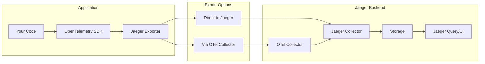
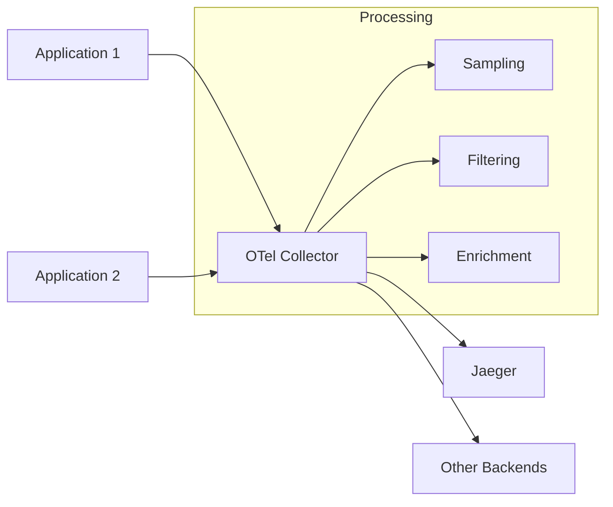

# How to Implement OpenTelemetry Jaeger Exporter

Author: [nawazdhandala](https://github.com/nawazdhandala)

Tags: OpenTelemetry, Jaeger, Tracing, Observability

Description: A practical guide to configuring and implementing the OpenTelemetry Jaeger Exporter for distributed tracing in your applications.

---

Jaeger is one of the most popular open-source distributed tracing backends, originally developed by Uber. When combined with OpenTelemetry, you get vendor-neutral instrumentation that exports traces to Jaeger for visualization and analysis. This guide walks through implementing the Jaeger exporter in different languages and deployment scenarios.

## Understanding the Architecture

Before implementing the exporter, it helps to understand how data flows from your application to Jaeger.



The Jaeger exporter converts OpenTelemetry spans into Jaeger's format and sends them to the Jaeger backend. You can export directly to Jaeger or route through an OpenTelemetry Collector for additional processing.

## Export Protocol Options

Jaeger supports multiple protocols for receiving trace data.

| Protocol | Port | Use Case |
|----------|------|----------|
| OTLP/gRPC | 4317 | Preferred for new deployments |
| OTLP/HTTP | 4318 | When gRPC is not available |
| Jaeger Thrift over HTTP | 14268 | Legacy Jaeger clients |
| Jaeger gRPC | 14250 | Direct Jaeger protocol |

Modern Jaeger versions (1.35+) natively support OTLP, making the OTLP exporter the recommended choice. For older Jaeger installations, use the dedicated Jaeger exporter.

## Node.js Implementation

### Installation

Install the required packages for your Node.js application.

```bash
npm install @opentelemetry/api \
  @opentelemetry/sdk-node \
  @opentelemetry/exporter-jaeger \
  @opentelemetry/exporter-trace-otlp-grpc \
  @opentelemetry/resources \
  @opentelemetry/semantic-conventions \
  @opentelemetry/auto-instrumentations-node
```

### Using the Jaeger Exporter (Legacy Protocol)

For older Jaeger installations that do not support OTLP, use the dedicated Jaeger exporter.

```javascript
// tracing.js
const { NodeSDK } = require('@opentelemetry/sdk-node');
const { JaegerExporter } = require('@opentelemetry/exporter-jaeger');
const { Resource } = require('@opentelemetry/resources');
const { SemanticResourceAttributes } = require('@opentelemetry/semantic-conventions');
const { getNodeAutoInstrumentations } = require('@opentelemetry/auto-instrumentations-node');

// Configure the Jaeger exporter
const jaegerExporter = new JaegerExporter({
  endpoint: process.env.JAEGER_ENDPOINT || 'http://localhost:14268/api/traces',
  // Optional: Set maximum packet size for UDP (if using agent)
  maxPacketSize: 65000,
});

// Define service metadata
const resource = new Resource({
  [SemanticResourceAttributes.SERVICE_NAME]: 'my-service',
  [SemanticResourceAttributes.SERVICE_VERSION]: '1.0.0',
  [SemanticResourceAttributes.DEPLOYMENT_ENVIRONMENT]: process.env.NODE_ENV || 'development',
});

// Initialize the SDK
const sdk = new NodeSDK({
  resource,
  traceExporter: jaegerExporter,
  instrumentations: [getNodeAutoInstrumentations()],
});

sdk.start();

// Graceful shutdown
process.on('SIGTERM', () => {
  sdk.shutdown()
    .then(() => console.log('Tracing terminated'))
    .catch((error) => console.error('Error shutting down tracing', error))
    .finally(() => process.exit(0));
});

module.exports = sdk;
```

### Using OTLP Exporter with Jaeger (Recommended)

For Jaeger 1.35+, use the OTLP exporter which is the modern standard.

```javascript
// tracing.js
const { NodeSDK } = require('@opentelemetry/sdk-node');
const { OTLPTraceExporter } = require('@opentelemetry/exporter-trace-otlp-grpc');
const { Resource } = require('@opentelemetry/resources');
const { SemanticResourceAttributes } = require('@opentelemetry/semantic-conventions');
const { getNodeAutoInstrumentations } = require('@opentelemetry/auto-instrumentations-node');
const { BatchSpanProcessor } = require('@opentelemetry/sdk-trace-base');

// OTLP exporter pointing to Jaeger's OTLP endpoint
const traceExporter = new OTLPTraceExporter({
  url: process.env.OTEL_EXPORTER_OTLP_ENDPOINT || 'http://localhost:4317',
});

const resource = new Resource({
  [SemanticResourceAttributes.SERVICE_NAME]: 'order-service',
  [SemanticResourceAttributes.SERVICE_VERSION]: '2.1.0',
  [SemanticResourceAttributes.DEPLOYMENT_ENVIRONMENT]: 'production',
});

const sdk = new NodeSDK({
  resource,
  traceExporter,
  // Use batch processing for better performance
  spanProcessor: new BatchSpanProcessor(traceExporter, {
    maxQueueSize: 2048,
    maxExportBatchSize: 512,
    scheduledDelayMillis: 5000,
    exportTimeoutMillis: 30000,
  }),
  instrumentations: [getNodeAutoInstrumentations()],
});

sdk.start();

process.on('SIGTERM', () => {
  sdk.shutdown()
    .then(() => console.log('Tracing terminated'))
    .finally(() => process.exit(0));
});
```

### Loading Order

Import the tracing module before any other application code.

```javascript
// index.js
require('./tracing');  // Must be first

const express = require('express');
const app = express();

app.get('/api/orders', async (req, res) => {
  // Your route handler - automatically traced
  res.json({ orders: [] });
});

app.listen(3000);
```

## Python Implementation

### Installation

Install the OpenTelemetry packages for Python.

```bash
pip install opentelemetry-api \
  opentelemetry-sdk \
  opentelemetry-exporter-jaeger \
  opentelemetry-exporter-otlp \
  opentelemetry-instrumentation
```

### Basic Setup with Jaeger Exporter

Configure the Jaeger exporter in your Python application.

```python
# tracing.py
from opentelemetry import trace
from opentelemetry.sdk.trace import TracerProvider
from opentelemetry.sdk.trace.export import BatchSpanProcessor
from opentelemetry.sdk.resources import Resource, SERVICE_NAME, SERVICE_VERSION
from opentelemetry.exporter.jaeger.thrift import JaegerExporter
import os

def configure_tracing():
    # Define service resource attributes
    resource = Resource(attributes={
        SERVICE_NAME: "payment-service",
        SERVICE_VERSION: "1.0.0",
        "deployment.environment": os.getenv("ENVIRONMENT", "development"),
    })

    # Create tracer provider with resource
    provider = TracerProvider(resource=resource)

    # Configure Jaeger exporter
    jaeger_exporter = JaegerExporter(
        agent_host_name=os.getenv("JAEGER_AGENT_HOST", "localhost"),
        agent_port=int(os.getenv("JAEGER_AGENT_PORT", 6831)),
        # Or use collector endpoint directly:
        # collector_endpoint=os.getenv("JAEGER_COLLECTOR_ENDPOINT", "http://localhost:14268/api/traces"),
    )

    # Add batch processor for efficient export
    provider.add_span_processor(
        BatchSpanProcessor(
            jaeger_exporter,
            max_queue_size=2048,
            max_export_batch_size=512,
            schedule_delay_millis=5000,
        )
    )

    # Set as global tracer provider
    trace.set_tracer_provider(provider)

    return trace.get_tracer(__name__)

# Initialize at module load
tracer = configure_tracing()
```

### Using OTLP with Jaeger in Python

For modern Jaeger deployments, use the OTLP exporter.

```python
# tracing.py
from opentelemetry import trace
from opentelemetry.sdk.trace import TracerProvider
from opentelemetry.sdk.trace.export import BatchSpanProcessor
from opentelemetry.sdk.resources import Resource, SERVICE_NAME
from opentelemetry.exporter.otlp.proto.grpc.trace_exporter import OTLPSpanExporter
import os

def configure_tracing():
    resource = Resource(attributes={
        SERVICE_NAME: "inventory-service",
    })

    provider = TracerProvider(resource=resource)

    # OTLP exporter for Jaeger
    otlp_exporter = OTLPSpanExporter(
        endpoint=os.getenv("OTEL_EXPORTER_OTLP_ENDPOINT", "localhost:4317"),
        insecure=True,  # Set to False in production with TLS
    )

    provider.add_span_processor(BatchSpanProcessor(otlp_exporter))
    trace.set_tracer_provider(provider)

    return trace.get_tracer(__name__)

tracer = configure_tracing()
```

### Usage Example

Create manual spans in your application code.

```python
from tracing import tracer
from opentelemetry import trace
from opentelemetry.trace import SpanKind, Status, StatusCode

def process_payment(order_id: str, amount: float):
    with tracer.start_as_current_span(
        "process_payment",
        kind=SpanKind.INTERNAL,
        attributes={
            "order.id": order_id,
            "payment.amount": amount,
        }
    ) as span:
        try:
            # Validate payment
            with tracer.start_as_current_span("validate_payment") as validate_span:
                validate_payment_details(order_id)
                validate_span.set_status(Status(StatusCode.OK))

            # Charge card
            with tracer.start_as_current_span(
                "charge_card",
                kind=SpanKind.CLIENT
            ) as charge_span:
                result = payment_gateway.charge(amount)
                charge_span.set_attribute("payment.gateway_response", result.status)
                charge_span.set_status(Status(StatusCode.OK))

            span.set_status(Status(StatusCode.OK))
            return result

        except Exception as e:
            span.record_exception(e)
            span.set_status(Status(StatusCode.ERROR, str(e)))
            raise
```

## Go Implementation

### Installation

Add the required modules to your Go project.

```bash
go get go.opentelemetry.io/otel
go get go.opentelemetry.io/otel/sdk
go get go.opentelemetry.io/otel/exporters/jaeger
go get go.opentelemetry.io/otel/exporters/otlp/otlptrace/otlptracegrpc
```

### Setup with Jaeger Exporter

Configure the Jaeger exporter in Go.

```go
// tracing.go
package tracing

import (
    "context"
    "log"
    "os"

    "go.opentelemetry.io/otel"
    "go.opentelemetry.io/otel/attribute"
    "go.opentelemetry.io/otel/exporters/jaeger"
    "go.opentelemetry.io/otel/sdk/resource"
    sdktrace "go.opentelemetry.io/otel/sdk/trace"
    semconv "go.opentelemetry.io/otel/semconv/v1.21.0"
)

func InitTracer() (*sdktrace.TracerProvider, error) {
    // Get Jaeger endpoint from environment
    jaegerEndpoint := os.Getenv("JAEGER_ENDPOINT")
    if jaegerEndpoint == "" {
        jaegerEndpoint = "http://localhost:14268/api/traces"
    }

    // Create Jaeger exporter
    exporter, err := jaeger.New(
        jaeger.WithCollectorEndpoint(jaeger.WithEndpoint(jaegerEndpoint)),
    )
    if err != nil {
        return nil, err
    }

    // Define service resource
    res, err := resource.Merge(
        resource.Default(),
        resource.NewWithAttributes(
            semconv.SchemaURL,
            semconv.ServiceName("user-service"),
            semconv.ServiceVersion("1.0.0"),
            attribute.String("environment", os.Getenv("ENVIRONMENT")),
        ),
    )
    if err != nil {
        return nil, err
    }

    // Create tracer provider
    tp := sdktrace.NewTracerProvider(
        sdktrace.WithBatcher(exporter,
            sdktrace.WithMaxQueueSize(2048),
            sdktrace.WithMaxExportBatchSize(512),
        ),
        sdktrace.WithResource(res),
    )

    // Set global tracer provider
    otel.SetTracerProvider(tp)

    return tp, nil
}
```

### Using OTLP with Jaeger in Go

For modern deployments, use the OTLP exporter.

```go
// tracing.go
package tracing

import (
    "context"
    "os"
    "time"

    "go.opentelemetry.io/otel"
    "go.opentelemetry.io/otel/exporters/otlp/otlptrace/otlptracegrpc"
    "go.opentelemetry.io/otel/sdk/resource"
    sdktrace "go.opentelemetry.io/otel/sdk/trace"
    semconv "go.opentelemetry.io/otel/semconv/v1.21.0"
    "google.golang.org/grpc"
    "google.golang.org/grpc/credentials/insecure"
)

func InitOTLPTracer(ctx context.Context) (*sdktrace.TracerProvider, error) {
    endpoint := os.Getenv("OTEL_EXPORTER_OTLP_ENDPOINT")
    if endpoint == "" {
        endpoint = "localhost:4317"
    }

    // Create OTLP exporter
    exporter, err := otlptracegrpc.New(ctx,
        otlptracegrpc.WithEndpoint(endpoint),
        otlptracegrpc.WithDialOption(grpc.WithTransportCredentials(insecure.NewCredentials())),
        otlptracegrpc.WithTimeout(30*time.Second),
    )
    if err != nil {
        return nil, err
    }

    res, _ := resource.New(ctx,
        resource.WithAttributes(
            semconv.ServiceName("api-gateway"),
            semconv.ServiceVersion("2.0.0"),
        ),
    )

    tp := sdktrace.NewTracerProvider(
        sdktrace.WithBatcher(exporter),
        sdktrace.WithResource(res),
    )

    otel.SetTracerProvider(tp)
    return tp, nil
}
```

### Main Application Setup

Initialize tracing in your main function.

```go
// main.go
package main

import (
    "context"
    "log"
    "net/http"
    "os"
    "os/signal"
    "syscall"

    "myapp/tracing"
    "go.opentelemetry.io/otel"
)

func main() {
    ctx := context.Background()

    // Initialize tracer
    tp, err := tracing.InitOTLPTracer(ctx)
    if err != nil {
        log.Fatalf("Failed to initialize tracer: %v", err)
    }
    defer func() {
        if err := tp.Shutdown(ctx); err != nil {
            log.Printf("Error shutting down tracer: %v", err)
        }
    }()

    tracer := otel.Tracer("main")

    http.HandleFunc("/api/users", func(w http.ResponseWriter, r *http.Request) {
        ctx, span := tracer.Start(r.Context(), "handle-users")
        defer span.End()

        // Your handler logic
        users := getUsers(ctx)
        // ...
    })

    // Graceful shutdown
    go func() {
        sigCh := make(chan os.Signal, 1)
        signal.Notify(sigCh, syscall.SIGTERM, syscall.SIGINT)
        <-sigCh
        tp.Shutdown(ctx)
        os.Exit(0)
    }()

    log.Fatal(http.ListenAndServe(":8080", nil))
}
```

## Deploying Jaeger

### Docker Compose Setup

Run Jaeger locally for development with all components.

```yaml
# docker-compose.yml
version: '3.8'

services:
  jaeger:
    image: jaegertracing/all-in-one:1.53
    container_name: jaeger
    environment:
      - COLLECTOR_OTLP_ENABLED=true
    ports:
      - "16686:16686"   # Jaeger UI
      - "4317:4317"     # OTLP gRPC
      - "4318:4318"     # OTLP HTTP
      - "14268:14268"   # Jaeger HTTP Thrift
      - "6831:6831/udp" # Jaeger Agent compact thrift
    restart: unless-stopped

  app:
    build: .
    environment:
      - OTEL_EXPORTER_OTLP_ENDPOINT=http://jaeger:4317
      - OTEL_SERVICE_NAME=my-application
    depends_on:
      - jaeger
```

### Kubernetes Deployment

Deploy Jaeger to Kubernetes using the Jaeger Operator.

```yaml
# jaeger-operator.yaml
apiVersion: jaegertracing.io/v1
kind: Jaeger
metadata:
  name: jaeger-production
  namespace: observability
spec:
  strategy: production

  collector:
    replicas: 2
    resources:
      limits:
        cpu: 1000m
        memory: 1Gi
    options:
      collector:
        num-workers: 50

  storage:
    type: elasticsearch
    options:
      es:
        server-urls: http://elasticsearch:9200
        index-prefix: jaeger
    secretName: jaeger-es-secret

  query:
    replicas: 2
    resources:
      limits:
        cpu: 500m
        memory: 512Mi

  ingress:
    enabled: true
    hosts:
      - jaeger.example.com
```

## Using OpenTelemetry Collector with Jaeger

For production deployments, route traces through an OpenTelemetry Collector for additional processing capabilities.



### Collector Configuration

Configure the OpenTelemetry Collector to receive traces and export to Jaeger.

```yaml
# otel-collector-config.yaml
receivers:
  otlp:
    protocols:
      grpc:
        endpoint: 0.0.0.0:4317
      http:
        endpoint: 0.0.0.0:4318

processors:
  batch:
    timeout: 5s
    send_batch_size: 512
    send_batch_max_size: 1024

  # Add service name if missing
  resource:
    attributes:
      - key: deployment.environment
        value: production
        action: upsert

  # Tail-based sampling for better trace selection
  tail_sampling:
    decision_wait: 10s
    num_traces: 100000
    policies:
      - name: errors
        type: status_code
        status_code:
          status_codes: [ERROR]
      - name: slow-traces
        type: latency
        latency:
          threshold_ms: 1000
      - name: probabilistic-sample
        type: probabilistic
        probabilistic:
          sampling_percentage: 10

exporters:
  # Export to Jaeger using OTLP
  otlp/jaeger:
    endpoint: jaeger-collector:4317
    tls:
      insecure: true

  # Alternative: Jaeger native protocol
  jaeger:
    endpoint: jaeger-collector:14250
    tls:
      insecure: true

service:
  pipelines:
    traces:
      receivers: [otlp]
      processors: [batch, resource, tail_sampling]
      exporters: [otlp/jaeger]
```

## Sampling Strategies

Implement sampling to control trace volume in production.

### Head-Based Sampling

Decide at trace start whether to sample.

```javascript
// Node.js head sampling
const { ParentBasedSampler, TraceIdRatioBasedSampler } = require('@opentelemetry/sdk-trace-base');

const sampler = new ParentBasedSampler({
  // Sample 10% of new traces
  root: new TraceIdRatioBasedSampler(0.1),
});

const sdk = new NodeSDK({
  sampler,
  // ... other config
});
```

### Tail-Based Sampling

Configure in the OpenTelemetry Collector to sample after seeing complete traces.

```yaml
processors:
  tail_sampling:
    decision_wait: 10s
    policies:
      # Always keep errors
      - name: keep-errors
        type: status_code
        status_code:
          status_codes: [ERROR]

      # Keep slow traces
      - name: keep-slow
        type: latency
        latency:
          threshold_ms: 2000

      # Sample 5% of remaining traces
      - name: probabilistic
        type: probabilistic
        probabilistic:
          sampling_percentage: 5
```

## Troubleshooting Common Issues

### Connection Refused Errors

Verify the Jaeger endpoint is accessible and the correct protocol is used.

```bash
# Test OTLP gRPC connectivity
grpcurl -plaintext localhost:4317 list

# Test HTTP endpoint
curl -v http://localhost:14268/api/traces

# Check Jaeger collector logs
docker logs jaeger 2>&1 | grep -i error
```

### Missing Traces in Jaeger UI

Check these common causes for missing trace data.

```javascript
// Ensure spans are ended
const span = tracer.startSpan('my-operation');
try {
  // ... work
} finally {
  span.end();  // Always end spans
}

// Flush before exit
process.on('beforeExit', async () => {
  await sdk.shutdown();
});
```

### High Memory Usage

Configure batch processor limits to control memory consumption.

```javascript
const { BatchSpanProcessor } = require('@opentelemetry/sdk-trace-base');

const processor = new BatchSpanProcessor(exporter, {
  maxQueueSize: 1024,        // Reduce from default 2048
  maxExportBatchSize: 256,   // Smaller batches
  scheduledDelayMillis: 1000, // Export more frequently
});
```

## Environment Variables Reference

Standard OpenTelemetry environment variables for Jaeger exporter configuration.

| Variable | Description | Example |
|----------|-------------|---------|
| `OTEL_EXPORTER_OTLP_ENDPOINT` | OTLP endpoint URL | `http://localhost:4317` |
| `OTEL_EXPORTER_OTLP_HEADERS` | Headers for authentication | `Authorization=Bearer token` |
| `OTEL_SERVICE_NAME` | Service name for traces | `payment-service` |
| `OTEL_TRACES_SAMPLER` | Sampler type | `parentbased_traceidratio` |
| `OTEL_TRACES_SAMPLER_ARG` | Sampler argument | `0.1` |
| `JAEGER_ENDPOINT` | Legacy Jaeger collector URL | `http://localhost:14268/api/traces` |
| `JAEGER_AGENT_HOST` | Jaeger agent hostname | `localhost` |
| `JAEGER_AGENT_PORT` | Jaeger agent UDP port | `6831` |

## Summary

| Aspect | Recommendation |
|--------|----------------|
| **Protocol** | Use OTLP for Jaeger 1.35+, Jaeger Thrift for older versions |
| **Deployment** | Route through OTel Collector for production |
| **Sampling** | Head sampling for high volume, tail sampling for completeness |
| **Batching** | Always use BatchSpanProcessor with tuned limits |
| **Shutdown** | Implement graceful shutdown to flush pending spans |

The OpenTelemetry Jaeger exporter provides a robust way to send distributed traces to Jaeger. For new deployments, prefer the OTLP protocol which offers better performance and is the OpenTelemetry standard. Routing through an OpenTelemetry Collector adds flexibility for sampling, filtering, and multi-backend export.

---

**Related Reading:**

- [Traces and Spans in OpenTelemetry](https://oneuptime.com/blog/post/2025-08-27-traces-and-spans-in-opentelemetry/view)
- [What is OpenTelemetry Collector and Why Use One](https://oneuptime.com/blog/post/2025-09-18-what-is-opentelemetry-collector-and-why-use-one/view)
- [Configure Exporters in OpenTelemetry](https://oneuptime.com/blog/post/2026-01-25-configure-exporters-opentelemetry/view)
