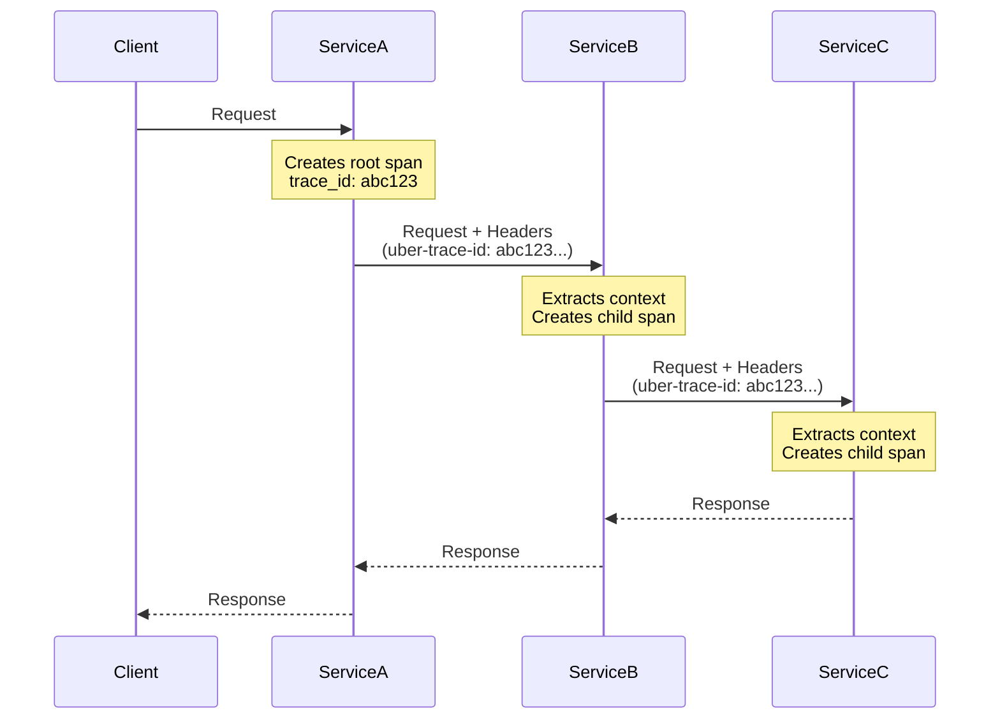
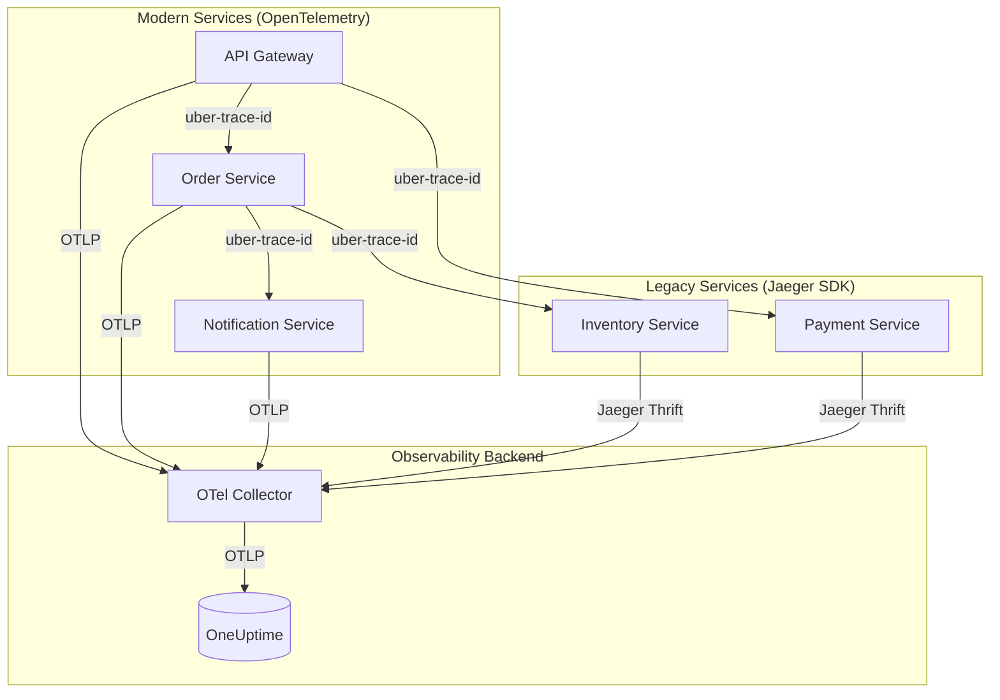

# How to Implement OpenTelemetry Jaeger Propagation

Author: [nawazdhandala](https://github.com/nawazdhandala)

Tags: OpenTelemetry, Jaeger, Tracing, Propagation

Description: Learn how to configure Jaeger propagation in OpenTelemetry to maintain trace context across distributed services and integrate with legacy Jaeger-instrumented systems.

---

> Trace context propagation is the glue that holds distributed tracing together. Without it, your spans are just isolated data points instead of a connected story.

When you are running a distributed system, requests hop between services. Each service creates spans, but unless those spans share the same trace context, you cannot see the full picture. Propagation is the mechanism that passes trace identifiers (trace ID, span ID, sampling decisions) from one service to the next.

OpenTelemetry supports multiple propagation formats. This guide focuses on **Jaeger propagation** - essential when you are integrating with existing Jaeger-instrumented services or migrating from Jaeger to OpenTelemetry.

---

## Table of Contents

1. What is Context Propagation?
2. Jaeger vs W3C Trace Context
3. When to Use Jaeger Propagation
4. Architecture Overview
5. Setting Up Jaeger Propagation in Node.js
6. Setting Up Jaeger Propagation in Python
7. Setting Up Jaeger Propagation in Go
8. Multi-Format Propagation (Hybrid Environments)
9. Extracting and Injecting Context Manually
10. Testing Your Propagation Setup
11. Common Pitfalls and Debugging
12. Migration Strategy: Jaeger to W3C
13. Summary

---

## 1. What is Context Propagation?

Context propagation is the process of passing trace metadata between services. When Service A calls Service B, the trace context travels in HTTP headers (or message metadata for async systems).

The context includes:

| Field | Purpose |
|-------|---------|
| Trace ID | Unique identifier for the entire request journey |
| Span ID | Identifier for the current operation |
| Parent Span ID | Links child spans to their parent |
| Sampling Decision | Whether this trace should be recorded |
| Baggage | User-defined key-value pairs that travel with the trace |

Without propagation, Service B would start a new trace, breaking the connection between upstream and downstream operations.



---

## 2. Jaeger vs W3C Trace Context

OpenTelemetry supports several propagation formats. The two most common are:

### Jaeger Propagation Format

Jaeger uses the `uber-trace-id` header with a colon-separated format:

```
uber-trace-id: {trace-id}:{span-id}:{parent-span-id}:{flags}
```

Example:
```
uber-trace-id: 4bf92f3577b34da6a3ce929d0e0e4736:00f067aa0ba902b7:0:1
```

It also supports baggage via `uberctx-{key}` headers:
```
uberctx-user-id: 12345
uberctx-tenant: acme-corp
```

### W3C Trace Context Format

The W3C standard uses two headers:

```
traceparent: {version}-{trace-id}-{span-id}-{flags}
tracestate: {vendor-specific data}
```

Example:
```
traceparent: 00-4bf92f3577b34da6a3ce929d0e0e4736-00f067aa0ba902b7-01
tracestate: congo=t61rcWkgMzE
```

### Comparison

| Aspect | Jaeger | W3C Trace Context |
|--------|--------|-------------------|
| Header Name | uber-trace-id | traceparent + tracestate |
| Standard | Jaeger-specific | Industry standard (W3C) |
| Baggage | uberctx-{key} | Separate W3C Baggage spec |
| OpenTelemetry Default | No | Yes |
| Legacy Support | Many existing systems | Newer systems |

---

## 3. When to Use Jaeger Propagation

Use Jaeger propagation when:

- **Integrating with existing Jaeger-instrumented services** that have not migrated to OpenTelemetry
- **Migrating incrementally** from Jaeger to OpenTelemetry while maintaining trace continuity
- **Working with third-party services** that only understand Jaeger format
- **Running hybrid environments** where some services use Jaeger clients and others use OpenTelemetry

If you are starting fresh with no legacy Jaeger services, use W3C Trace Context instead - it is the OpenTelemetry default and the industry standard.

---

## 4. Architecture Overview

Here is how Jaeger propagation fits into a typical microservices architecture:



The OpenTelemetry Collector can receive data in both Jaeger and OTLP formats, normalizing everything before sending to your backend.

---

## 5. Setting Up Jaeger Propagation in Node.js

First, install the required packages:

```bash
npm install @opentelemetry/api \
            @opentelemetry/sdk-node \
            @opentelemetry/auto-instrumentations-node \
            @opentelemetry/exporter-trace-otlp-http \
            @opentelemetry/propagator-jaeger \
            @opentelemetry/resources \
            @opentelemetry/semantic-conventions
```

Create your telemetry configuration file. The key is registering the JaegerPropagator with the SDK:

```typescript
// telemetry.ts
import { NodeSDK } from '@opentelemetry/sdk-node';
import { getNodeAutoInstrumentations } from '@opentelemetry/auto-instrumentations-node';
import { OTLPTraceExporter } from '@opentelemetry/exporter-trace-otlp-http';
import { JaegerPropagator } from '@opentelemetry/propagator-jaeger';
import { Resource } from '@opentelemetry/resources';
import { ATTR_SERVICE_NAME, ATTR_SERVICE_VERSION } from '@opentelemetry/semantic-conventions';

const traceExporter = new OTLPTraceExporter({
  url: process.env.OTEL_EXPORTER_OTLP_ENDPOINT || 'https://oneuptime.com/otlp/v1/traces',
  headers: {
    'x-oneuptime-token': process.env.ONEUPTIME_TOKEN || '',
  },
});

export const sdk = new NodeSDK({
  resource: new Resource({
    [ATTR_SERVICE_NAME]: 'order-service',
    [ATTR_SERVICE_VERSION]: '1.0.0',
  }),
  traceExporter,
  // Register the Jaeger propagator
  textMapPropagator: new JaegerPropagator(),
  instrumentations: [getNodeAutoInstrumentations()],
});

sdk.start();
console.log('OpenTelemetry initialized with Jaeger propagation');

// Graceful shutdown
process.on('SIGTERM', () => {
  sdk.shutdown()
    .then(() => console.log('Telemetry shut down'))
    .catch((err) => console.error('Error shutting down telemetry', err))
    .finally(() => process.exit(0));
});
```

Import the telemetry file before any other imports in your application entry point:

```typescript
// index.ts
import './telemetry';
import express from 'express';

const app = express();

app.get('/orders/:id', async (req, res) => {
  // Auto-instrumentation handles span creation and context extraction
  // The uber-trace-id header is automatically parsed
  const orderId = req.params.id;

  // Your business logic here
  res.json({ orderId, status: 'processing' });
});

app.listen(3000, () => {
  console.log('Order service running on port 3000');
});
```

---

## 6. Setting Up Jaeger Propagation in Python

Install the required packages:

```bash
pip install opentelemetry-api \
            opentelemetry-sdk \
            opentelemetry-exporter-otlp \
            opentelemetry-propagator-jaeger \
            opentelemetry-instrumentation-flask \
            opentelemetry-instrumentation-requests
```

Configure the SDK with Jaeger propagation:

```python
# telemetry.py
from opentelemetry import trace
from opentelemetry.sdk.trace import TracerProvider
from opentelemetry.sdk.trace.export import BatchSpanProcessor
from opentelemetry.exporter.otlp.proto.http.trace_exporter import OTLPSpanExporter
from opentelemetry.propagators.jaeger import JaegerPropagator
from opentelemetry.propagate import set_global_textmap
from opentelemetry.sdk.resources import Resource, SERVICE_NAME, SERVICE_VERSION
import os

def init_telemetry():
    # Create resource with service information
    resource = Resource(attributes={
        SERVICE_NAME: "inventory-service",
        SERVICE_VERSION: "1.0.0",
    })

    # Create and set the tracer provider
    provider = TracerProvider(resource=resource)

    # Configure the OTLP exporter
    otlp_exporter = OTLPSpanExporter(
        endpoint=os.getenv("OTEL_EXPORTER_OTLP_ENDPOINT", "https://oneuptime.com/otlp/v1/traces"),
        headers={"x-oneuptime-token": os.getenv("ONEUPTIME_TOKEN", "")},
    )

    # Add the batch processor
    provider.add_span_processor(BatchSpanProcessor(otlp_exporter))

    # Set the global tracer provider
    trace.set_tracer_provider(provider)

    # Set Jaeger as the global propagator
    set_global_textmap(JaegerPropagator())

    print("OpenTelemetry initialized with Jaeger propagation")
```

Use it with Flask:

```python
# app.py
from telemetry import init_telemetry
init_telemetry()

from flask import Flask
from opentelemetry.instrumentation.flask import FlaskInstrumentor
from opentelemetry.instrumentation.requests import RequestsInstrumentor

app = Flask(__name__)

# Instrument Flask and requests library
FlaskInstrumentor().instrument_app(app)
RequestsInstrumentor().instrument()

@app.route('/inventory/<sku>')
def get_inventory(sku):
    # Context is automatically extracted from uber-trace-id header
    return {'sku': sku, 'quantity': 100}

if __name__ == '__main__':
    app.run(port=5000)
```

---

## 7. Setting Up Jaeger Propagation in Go

Install the required modules:

```bash
go get go.opentelemetry.io/otel
go get go.opentelemetry.io/otel/sdk
go get go.opentelemetry.io/otel/exporters/otlp/otlptrace/otlptracehttp
go get go.opentelemetry.io/contrib/propagators/jaeger
go get go.opentelemetry.io/contrib/instrumentation/net/http/otelhttp
```

Configure the SDK with Jaeger propagation:

```go
// telemetry.go
package main

import (
    "context"
    "os"

    "go.opentelemetry.io/otel"
    "go.opentelemetry.io/otel/exporters/otlp/otlptrace/otlptracehttp"
    "go.opentelemetry.io/otel/sdk/resource"
    "go.opentelemetry.io/otel/sdk/trace"
    semconv "go.opentelemetry.io/otel/semconv/v1.24.0"
    "go.opentelemetry.io/contrib/propagators/jaeger"
)

func initTelemetry(ctx context.Context) (*trace.TracerProvider, error) {
    // Create the OTLP exporter
    exporter, err := otlptracehttp.New(ctx,
        otlptracehttp.WithEndpoint(os.Getenv("OTEL_EXPORTER_OTLP_ENDPOINT")),
        otlptracehttp.WithHeaders(map[string]string{
            "x-oneuptime-token": os.Getenv("ONEUPTIME_TOKEN"),
        }),
    )
    if err != nil {
        return nil, err
    }

    // Create the resource
    res, err := resource.New(ctx,
        resource.WithAttributes(
            semconv.ServiceName("payment-service"),
            semconv.ServiceVersion("1.0.0"),
        ),
    )
    if err != nil {
        return nil, err
    }

    // Create the tracer provider
    tp := trace.NewTracerProvider(
        trace.WithBatcher(exporter),
        trace.WithResource(res),
    )

    // Set the global tracer provider
    otel.SetTracerProvider(tp)

    // Set Jaeger as the global propagator
    otel.SetTextMapPropagator(jaeger.Jaeger{})

    return tp, nil
}
```

Use it in your HTTP server:

```go
// main.go
package main

import (
    "context"
    "log"
    "net/http"

    "go.opentelemetry.io/contrib/instrumentation/net/http/otelhttp"
)

func main() {
    ctx := context.Background()

    tp, err := initTelemetry(ctx)
    if err != nil {
        log.Fatalf("Failed to initialize telemetry: %v", err)
    }
    defer tp.Shutdown(ctx)

    // Wrap your handlers with otelhttp for automatic instrumentation
    handler := http.HandlerFunc(func(w http.ResponseWriter, r *http.Request) {
        // Context is automatically extracted from uber-trace-id header
        w.Write([]byte("Payment processed"))
    })

    http.Handle("/pay", otelhttp.NewHandler(handler, "payment"))

    log.Println("Payment service running on port 8080")
    log.Fatal(http.ListenAndServe(":8080", nil))
}
```

---

## 8. Multi-Format Propagation (Hybrid Environments)

In real-world migrations, you often need to support multiple propagation formats simultaneously. OpenTelemetry provides a CompositePropagator for this:

This configuration extracts context from both W3C and Jaeger headers on incoming requests, and injects both formats on outgoing requests:

```typescript
// telemetry.ts - Multi-format propagation
import { NodeSDK } from '@opentelemetry/sdk-node';
import { getNodeAutoInstrumentations } from '@opentelemetry/auto-instrumentations-node';
import { OTLPTraceExporter } from '@opentelemetry/exporter-trace-otlp-http';
import { JaegerPropagator } from '@opentelemetry/propagator-jaeger';
import { W3CTraceContextPropagator } from '@opentelemetry/core';
import { CompositePropagator } from '@opentelemetry/core';
import { Resource } from '@opentelemetry/resources';
import { ATTR_SERVICE_NAME } from '@opentelemetry/semantic-conventions';

// Create a composite propagator that handles both formats
const compositePropagator = new CompositePropagator({
  propagators: [
    new W3CTraceContextPropagator(),  // W3C traceparent/tracestate
    new JaegerPropagator(),            // Jaeger uber-trace-id
  ],
});

export const sdk = new NodeSDK({
  resource: new Resource({
    [ATTR_SERVICE_NAME]: 'api-gateway',
  }),
  traceExporter: new OTLPTraceExporter({
    url: 'https://oneuptime.com/otlp/v1/traces',
  }),
  textMapPropagator: compositePropagator,
  instrumentations: [getNodeAutoInstrumentations()],
});

sdk.start();
```

This approach allows:
- Modern services to communicate using W3C headers
- Legacy Jaeger services to continue using uber-trace-id
- Gradual migration without breaking trace continuity

---

## 9. Extracting and Injecting Context Manually

Sometimes auto-instrumentation is not available, and you need to handle propagation manually.

### Extracting Context from Incoming Request

When receiving a request, extract the context from headers:

```typescript
import { context, trace, propagation } from '@opentelemetry/api';

function handleIncomingRequest(headers: Record<string, string>) {
  // Extract context from incoming headers
  const extractedContext = propagation.extract(context.active(), headers);

  // Run your code within the extracted context
  return context.with(extractedContext, () => {
    const tracer = trace.getTracer('manual-tracer');

    // This span will be a child of the extracted context
    return tracer.startActiveSpan('process-request', (span) => {
      try {
        // Your business logic here
        return { success: true };
      } finally {
        span.end();
      }
    });
  });
}
```

### Injecting Context into Outgoing Request

When making an outbound call, inject the current context:

```typescript
import { context, propagation } from '@opentelemetry/api';

async function makeOutboundCall(url: string, payload: any) {
  const headers: Record<string, string> = {
    'Content-Type': 'application/json',
  };

  // Inject current trace context into headers
  propagation.inject(context.active(), headers);

  // headers now contains uber-trace-id (if using Jaeger propagator)
  // or traceparent/tracestate (if using W3C propagator)

  const response = await fetch(url, {
    method: 'POST',
    headers,
    body: JSON.stringify(payload),
  });

  return response.json();
}
```

### Working with Message Queues

For async messaging (Kafka, RabbitMQ, etc.), inject context into message headers:

```typescript
import { context, propagation, trace } from '@opentelemetry/api';

interface Message {
  payload: any;
  headers: Record<string, string>;
}

// Producer: Inject context when publishing
function publishMessage(topic: string, payload: any): Message {
  const tracer = trace.getTracer('message-producer');

  return tracer.startActiveSpan('kafka.publish', (span) => {
    span.setAttribute('messaging.destination', topic);

    const headers: Record<string, string> = {};
    propagation.inject(context.active(), headers);

    const message: Message = { payload, headers };
    // Send message to Kafka/RabbitMQ/etc.

    span.end();
    return message;
  });
}

// Consumer: Extract context when processing
function processMessage(message: Message) {
  const extractedContext = propagation.extract(context.active(), message.headers);

  return context.with(extractedContext, () => {
    const tracer = trace.getTracer('message-consumer');

    return tracer.startActiveSpan('kafka.process', (span) => {
      try {
        // Process the message
        // This span is now linked to the producer's trace
      } finally {
        span.end();
      }
    });
  });
}
```

---

## 10. Testing Your Propagation Setup

Verify that propagation works correctly:

### Test 1: Header Inspection

Add middleware to log propagation headers:

```typescript
import express from 'express';

const app = express();

// Debug middleware to inspect propagation headers
app.use((req, res, next) => {
  console.log('Propagation headers received:');
  console.log('  uber-trace-id:', req.headers['uber-trace-id']);
  console.log('  traceparent:', req.headers['traceparent']);
  console.log('  tracestate:', req.headers['tracestate']);
  next();
});
```

### Test 2: Send a Request with Jaeger Headers

```bash
curl -X GET http://localhost:3000/orders/123 \
  -H "uber-trace-id: 4bf92f3577b34da6a3ce929d0e0e4736:00f067aa0ba902b7:0:1"
```

### Test 3: Verify Spans Share the Same Trace ID

Check your observability backend (OneUptime, Jaeger UI, etc.) and confirm:

1. The trace ID matches what you sent in the header
2. Child spans correctly reference their parent span
3. The entire request flow appears as a single trace

---

## 11. Common Pitfalls and Debugging

### Pitfall 1: Propagator Not Registered

Symptoms: Each service creates independent traces.

Fix: Ensure the propagator is set before any instrumentation runs:

```typescript
// WRONG - instrumentation runs before propagator is set
import express from 'express';
import { JaegerPropagator } from '@opentelemetry/propagator-jaeger';

// RIGHT - set propagator in telemetry.ts, import it first
import './telemetry';  // This must be first!
import express from 'express';
```

### Pitfall 2: Case-Sensitive Headers

Some HTTP clients lowercase header names. The Jaeger propagator handles common variations, but custom implementations might not.

```typescript
// Headers might come as:
// 'uber-trace-id' or 'Uber-Trace-Id' or 'UBER-TRACE-ID'
// The propagator normalizes these, but verify your proxy does not strip them
```

### Pitfall 3: Proxy Stripping Headers

Load balancers and API gateways sometimes strip unknown headers.

Fix: Configure your proxy to forward trace headers:

```nginx
# nginx.conf
proxy_pass_header uber-trace-id;
proxy_pass_header traceparent;
proxy_pass_header tracestate;
```

### Pitfall 4: Context Loss in Async Code

Node.js async boundaries can lose context.

Fix: Explicitly propagate context across async boundaries:

```typescript
import { context } from '@opentelemetry/api';

// Save context before async boundary
const currentContext = context.active();

setTimeout(() => {
  // Restore context inside callback
  context.with(currentContext, () => {
    // Your code here has access to the trace context
  });
}, 1000);
```

### Debugging Checklist

1. Are propagation headers present in the request?
2. Is the correct propagator registered?
3. Is telemetry initialized before other imports?
4. Are proxies forwarding trace headers?
5. Is context being maintained across async boundaries?

---

## 12. Migration Strategy: Jaeger to W3C

If you are planning to migrate from Jaeger propagation to W3C Trace Context:

```mermaid
flowchart LR
    subgraph Phase1["Phase 1: Dual Support"]
        A1[Enable CompositePropagator]
        A2[Both formats accepted]
        A3[Both formats emitted]
    end

    subgraph Phase2["Phase 2: Monitor"]
        B1[Track header usage]
        B2[Identify legacy services]
        B3[Update dependencies]
    end

    subgraph Phase3["Phase 3: Transition"]
        C1[Update legacy services]
        C2[Keep dual support]
        C3[Monitor for issues]
    end

    subgraph Phase4["Phase 4: Complete"]
        D1[Remove Jaeger propagator]
        D2[W3C only]
    end

    Phase1 --> Phase2 --> Phase3 --> Phase4
```



### Step-by-Step Migration

**Phase 1: Enable dual propagation** on all OpenTelemetry services using CompositePropagator (shown in Section 8).

**Phase 2: Monitor header usage** to identify which services still rely on Jaeger format:

```typescript
// Middleware to track propagation format usage
app.use((req, res, next) => {
  const hasJaeger = !!req.headers['uber-trace-id'];
  const hasW3C = !!req.headers['traceparent'];

  // Record metrics
  metrics.increment('propagation.jaeger', hasJaeger ? 1 : 0);
  metrics.increment('propagation.w3c', hasW3C ? 1 : 0);

  next();
});
```

**Phase 3: Update legacy services** one by one to use OpenTelemetry with dual propagation.

**Phase 4: Remove Jaeger propagator** once all services support W3C:

```typescript
// Final configuration - W3C only
export const sdk = new NodeSDK({
  textMapPropagator: new W3CTraceContextPropagator(),
  // ... rest of config
});
```

---

## 13. Summary

| Topic | Key Takeaway |
|-------|--------------|
| What is propagation? | Passing trace context between services via headers |
| Jaeger format | `uber-trace-id` header with colon-separated values |
| When to use Jaeger | Integrating with legacy Jaeger services |
| Node.js setup | Use `@opentelemetry/propagator-jaeger` package |
| Python setup | Use `opentelemetry-propagator-jaeger` package |
| Go setup | Use `go.opentelemetry.io/contrib/propagators/jaeger` |
| Hybrid environments | Use CompositePropagator for multi-format support |
| Manual propagation | Use `propagation.inject()` and `propagation.extract()` |
| Migration | Start with dual support, gradually move to W3C |

---

## Related Reading

- [What are Traces and Spans in OpenTelemetry](/blog/post/2025-08-27-traces-and-spans-in-opentelemetry)
- [OpenTelemetry Collector: What It Is and When You Need It](/blog/post/2025-09-18-what-is-opentelemetry-collector-and-why-use-one)
- [How to Reduce Noise in OpenTelemetry](/blog/post/2025-08-25-how-to-reduce-noise-in-opentelemetry)

---

*Need an observability backend that supports OpenTelemetry natively? [OneUptime](https://oneuptime.com) accepts traces via OTLP, whether they originate from Jaeger-propagated or W3C-propagated contexts. No vendor lock-in, no proprietary agents.*
