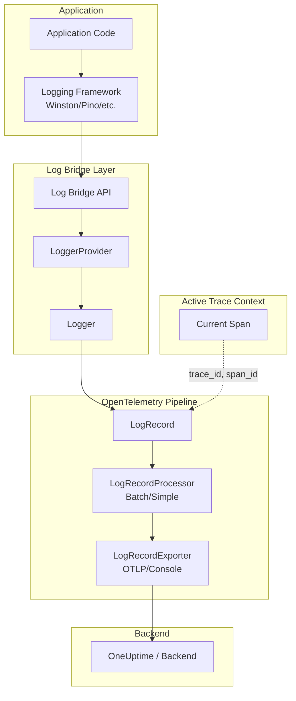
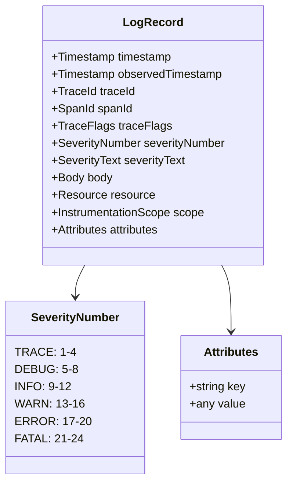
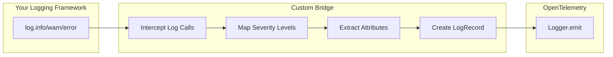
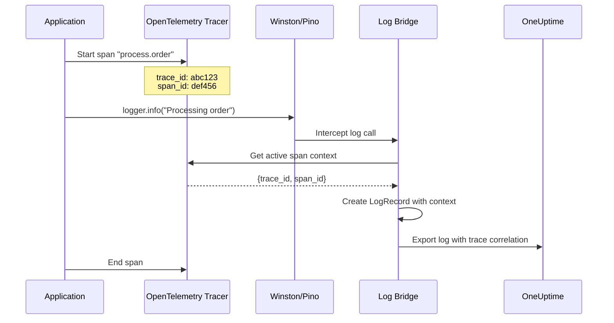
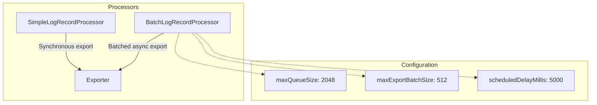

# How to Create OpenTelemetry Log Bridge API: A Complete Guide

Author: [nawazdhandala](https://github.com/nawazdhandala)

Tags: OpenTelemetry, Logging, Observability, APM

Description: Learn how to implement the OpenTelemetry Log Bridge API to connect your existing logging frameworks with OpenTelemetry, enabling unified observability with correlated logs, traces, and metrics across your distributed systems.

---

> Your existing logging framework does not need to be replaced. The Log Bridge API lets you **connect** it to OpenTelemetry, giving you correlated observability without rewriting your application code.

OpenTelemetry provides three pillars of observability: traces, metrics, and logs. While traces and metrics have native OpenTelemetry APIs, logs work differently. Most applications already use established logging frameworks (Winston, Pino, Log4j, Python logging, etc.). Rather than replacing these frameworks, OpenTelemetry provides the **Log Bridge API** to connect them to the OpenTelemetry ecosystem.

This guide walks you through understanding the Log Bridge API, implementing custom bridges, and integrating with popular logging frameworks for unified observability.

---

## Table of Contents

1. What is the Log Bridge API?
2. Architecture Overview
3. Log Data Model
4. Setting Up the Log Bridge in Node.js
5. Building a Custom Log Bridge
6. Integrating with Winston
7. Integrating with Pino
8. Automatic Trace Correlation
9. Log Processors and Exporters
10. Best Practices
11. Common Pitfalls
12. Production Configuration
13. Summary

---

## 1. What is the Log Bridge API?

The Log Bridge API is a mechanism to connect existing logging libraries to OpenTelemetry. Unlike traces and metrics where you use OpenTelemetry APIs directly, logs are typically generated by existing frameworks that applications already depend on.

**Key Concepts:**

| Concept | Description |
|---------|-------------|
| Log Bridge API | The interface that logging frameworks use to emit logs into the OpenTelemetry pipeline |
| LoggerProvider | Factory that creates loggers and manages the log processing pipeline |
| Logger | Creates log records and sends them through the pipeline |
| LogRecord | The data structure representing a single log entry with all its attributes |
| LogRecordProcessor | Processes log records before they are exported (similar to SpanProcessor) |
| LogRecordExporter | Sends log records to backends (OTLP, console, file, etc.) |

**Why use the Log Bridge API instead of direct logging?**

1. **Correlation**: Automatically links logs with traces and spans
2. **Unified Pipeline**: Single export path for all telemetry data
3. **Semantic Conventions**: Standardized attributes across all signals
4. **Backend Flexibility**: Switch observability backends without changing application code

---

## 2. Architecture Overview

The Log Bridge API sits between your existing logging framework and the OpenTelemetry export pipeline.



**Data Flow:**

1. Application calls `logger.info("message")`
2. Logging framework processes the log call
3. Log Bridge intercepts and creates an OpenTelemetry LogRecord
4. Active trace context (trace_id, span_id) is automatically attached
5. LogRecordProcessor batches and processes records
6. LogRecordExporter sends to your observability backend

---

## 3. Log Data Model

Understanding the OpenTelemetry log data model is essential for building effective bridges.



**LogRecord Fields Explained:**

| Field | Type | Description |
|-------|------|-------------|
| timestamp | nanoseconds | When the event occurred |
| observedTimestamp | nanoseconds | When the log was observed/collected |
| traceId | 16 bytes | Links to distributed trace |
| spanId | 8 bytes | Links to specific span within trace |
| severityNumber | 1-24 | Numeric severity level |
| severityText | string | Human-readable severity (INFO, ERROR, etc.) |
| body | any | The log message or structured data |
| attributes | key-value | Additional metadata |
| resource | Resource | Service identity (name, version, environment) |
| scope | InstrumentationScope | Logger name and version |

---

## 4. Setting Up the Log Bridge in Node.js

Install the required packages:

```bash
npm install @opentelemetry/api \
            @opentelemetry/api-logs \
            @opentelemetry/sdk-logs \
            @opentelemetry/exporter-logs-otlp-http \
            @opentelemetry/resources \
            @opentelemetry/semantic-conventions
```

### Basic Setup (logs-setup.ts)

```typescript
// logs-setup.ts
import { logs, SeverityNumber } from '@opentelemetry/api-logs';
import {
  LoggerProvider,
  BatchLogRecordProcessor,
  ConsoleLogRecordExporter,
} from '@opentelemetry/sdk-logs';
import { OTLPLogExporter } from '@opentelemetry/exporter-logs-otlp-http';
import { Resource } from '@opentelemetry/resources';
import {
  ATTR_SERVICE_NAME,
  ATTR_SERVICE_VERSION,
  ATTR_DEPLOYMENT_ENVIRONMENT_NAME,
} from '@opentelemetry/semantic-conventions';

// Define resource attributes for service identification
const resource = new Resource({
  [ATTR_SERVICE_NAME]: 'my-service',
  [ATTR_SERVICE_VERSION]: '1.0.0',
  [ATTR_DEPLOYMENT_ENVIRONMENT_NAME]: process.env.NODE_ENV || 'development',
});

// Create OTLP exporter for production
const otlpExporter = new OTLPLogExporter({
  url: process.env.OTEL_EXPORTER_OTLP_LOGS_ENDPOINT || 'https://oneuptime.com/otlp/v1/logs',
  headers: {
    'x-oneuptime-token': process.env.ONEUPTIME_TOKEN || '',
  },
});

// Create console exporter for development
const consoleExporter = new ConsoleLogRecordExporter();

// Initialize LoggerProvider
const loggerProvider = new LoggerProvider({
  resource,
});

// Add processors based on environment
if (process.env.NODE_ENV === 'production') {
  loggerProvider.addLogRecordProcessor(
    new BatchLogRecordProcessor(otlpExporter, {
      maxQueueSize: 2048,
      maxExportBatchSize: 512,
      scheduledDelayMillis: 5000,
      exportTimeoutMillis: 30000,
    })
  );
} else {
  loggerProvider.addLogRecordProcessor(
    new BatchLogRecordProcessor(consoleExporter)
  );
}

// Register as global logger provider
logs.setGlobalLoggerProvider(loggerProvider);

// Export for use in bridges
export { loggerProvider };

// Graceful shutdown
export async function shutdownLogs(): Promise<void> {
  await loggerProvider.shutdown();
}
```

### Using the Logger Directly

```typescript
// direct-usage.ts
import { logs, SeverityNumber } from '@opentelemetry/api-logs';
import { trace, context } from '@opentelemetry/api';

// Get a logger instance
const logger = logs.getLogger('my-component', '1.0.0');

// Emit a log record
function logMessage(message: string, level: SeverityNumber, attrs?: Record<string, any>): void {
  logger.emit({
    severityNumber: level,
    severityText: SeverityNumber[level],
    body: message,
    attributes: attrs,
    // Trace context is automatically captured if available
  });
}

// Usage examples
logMessage('Application started', SeverityNumber.INFO, {
  'app.startup_time_ms': 1250,
});

logMessage('Failed to connect to database', SeverityNumber.ERROR, {
  'db.system': 'postgresql',
  'db.connection_string': 'postgres://localhost:5432/mydb',
  'error.type': 'ConnectionError',
});
```

---

## 5. Building a Custom Log Bridge

When you need to connect a logging framework that does not have an official OpenTelemetry integration, you build a custom Log Bridge.

### Log Bridge Interface Design



### Generic Bridge Implementation

```typescript
// generic-bridge.ts
import { logs, SeverityNumber, Logger } from '@opentelemetry/api-logs';
import { trace, context, Span } from '@opentelemetry/api';

// Severity mapping for common log levels
const SEVERITY_MAP: Record<string, SeverityNumber> = {
  trace: SeverityNumber.TRACE,
  debug: SeverityNumber.DEBUG,
  info: SeverityNumber.INFO,
  warn: SeverityNumber.WARN,
  warning: SeverityNumber.WARN,
  error: SeverityNumber.ERROR,
  fatal: SeverityNumber.FATAL,
  critical: SeverityNumber.FATAL,
};

interface LogBridgeConfig {
  loggerName: string;
  loggerVersion?: string;
  defaultAttributes?: Record<string, any>;
  includeTraceContext?: boolean;
}

export class GenericLogBridge {
  private logger: Logger;
  private defaultAttributes: Record<string, any>;
  private includeTraceContext: boolean;

  constructor(config: LogBridgeConfig) {
    this.logger = logs.getLogger(
      config.loggerName,
      config.loggerVersion || '1.0.0'
    );
    this.defaultAttributes = config.defaultAttributes || {};
    this.includeTraceContext = config.includeTraceContext !== false;
  }

  /**
   * Emit a log record to OpenTelemetry
   */
  emit(
    level: string,
    message: string | object,
    attributes?: Record<string, any>
  ): void {
    const severityNumber = this.mapSeverity(level);
    const severityText = level.toUpperCase();

    // Handle structured logging (object as message)
    let body: string;
    let extractedAttrs: Record<string, any> = {};

    if (typeof message === 'object') {
      const { msg, message: msgField, ...rest } = message as any;
      body = msg || msgField || JSON.stringify(message);
      extractedAttrs = this.flattenObject(rest);
    } else {
      body = message;
    }

    // Build final attributes
    const finalAttributes: Record<string, any> = {
      ...this.defaultAttributes,
      ...extractedAttrs,
      ...attributes,
    };

    // Emit the log record
    this.logger.emit({
      severityNumber,
      severityText,
      body,
      attributes: finalAttributes,
    });
  }

  /**
   * Map string level to OpenTelemetry severity number
   */
  private mapSeverity(level: string): SeverityNumber {
    return SEVERITY_MAP[level.toLowerCase()] || SeverityNumber.INFO;
  }

  /**
   * Flatten nested objects for attributes
   */
  private flattenObject(
    obj: Record<string, any>,
    prefix: string = ''
  ): Record<string, any> {
    const result: Record<string, any> = {};

    for (const [key, value] of Object.entries(obj)) {
      const newKey = prefix ? `${prefix}.${key}` : key;

      if (value !== null && typeof value === 'object' && !Array.isArray(value)) {
        Object.assign(result, this.flattenObject(value, newKey));
      } else {
        result[newKey] = value;
      }
    }

    return result;
  }
}
```

---

## 6. Integrating with Winston

Winston is one of the most popular Node.js logging frameworks. Here is how to create a Log Bridge for Winston.

```bash
npm install winston
```

### Winston Transport Bridge

```typescript
// winston-otel-transport.ts
import Transport from 'winston-transport';
import { logs, SeverityNumber, Logger } from '@opentelemetry/api-logs';

// Map Winston levels to OpenTelemetry severity
const WINSTON_TO_OTEL_SEVERITY: Record<string, SeverityNumber> = {
  error: SeverityNumber.ERROR,
  warn: SeverityNumber.WARN,
  info: SeverityNumber.INFO,
  http: SeverityNumber.DEBUG4,
  verbose: SeverityNumber.DEBUG3,
  debug: SeverityNumber.DEBUG,
  silly: SeverityNumber.TRACE,
};

interface OtelTransportOptions extends Transport.TransportStreamOptions {
  loggerName?: string;
  loggerVersion?: string;
  defaultAttributes?: Record<string, any>;
}

export class OpenTelemetryTransport extends Transport {
  private otelLogger: Logger;
  private defaultAttributes: Record<string, any>;

  constructor(opts: OtelTransportOptions = {}) {
    super(opts);

    this.otelLogger = logs.getLogger(
      opts.loggerName || 'winston',
      opts.loggerVersion || '1.0.0'
    );
    this.defaultAttributes = opts.defaultAttributes || {};
  }

  log(info: any, callback: () => void): void {
    setImmediate(() => {
      this.emit('logged', info);
    });

    const { level, message, timestamp, ...meta } = info;

    // Extract error information if present
    let errorAttributes: Record<string, any> = {};
    if (meta.error instanceof Error) {
      errorAttributes = {
        'exception.type': meta.error.name,
        'exception.message': meta.error.message,
        'exception.stacktrace': meta.error.stack,
      };
      delete meta.error;
    }

    // Build attributes from metadata
    const attributes: Record<string, any> = {
      ...this.defaultAttributes,
      ...this.flattenMeta(meta),
      ...errorAttributes,
    };

    // Emit to OpenTelemetry
    this.otelLogger.emit({
      severityNumber: WINSTON_TO_OTEL_SEVERITY[level] || SeverityNumber.INFO,
      severityText: level.toUpperCase(),
      body: message,
      attributes,
    });

    callback();
  }

  private flattenMeta(meta: Record<string, any>, prefix: string = ''): Record<string, any> {
    const result: Record<string, any> = {};

    for (const [key, value] of Object.entries(meta)) {
      // Skip Winston internal symbols
      if (typeof key === 'symbol') continue;

      const newKey = prefix ? `${prefix}.${key}` : key;

      if (value !== null && typeof value === 'object' && !Array.isArray(value) && !(value instanceof Error)) {
        Object.assign(result, this.flattenMeta(value, newKey));
      } else if (value !== undefined) {
        result[newKey] = value;
      }
    }

    return result;
  }
}
```

### Winston Configuration

```typescript
// winston-setup.ts
import winston from 'winston';
import { OpenTelemetryTransport } from './winston-otel-transport';

// Create Winston logger with OpenTelemetry transport
export const logger = winston.createLogger({
  level: process.env.LOG_LEVEL || 'info',
  format: winston.format.combine(
    winston.format.timestamp(),
    winston.format.errors({ stack: true }),
    winston.format.json()
  ),
  defaultMeta: {
    service: 'my-service',
  },
  transports: [
    // Console for local development
    new winston.transports.Console({
      format: winston.format.combine(
        winston.format.colorize(),
        winston.format.simple()
      ),
    }),
    // OpenTelemetry transport for observability backend
    new OpenTelemetryTransport({
      loggerName: 'my-service',
      defaultAttributes: {
        'deployment.environment': process.env.NODE_ENV || 'development',
      },
    }),
  ],
});

// Usage examples
logger.info('User logged in', {
  userId: 'user-123',
  loginMethod: 'oauth',
});

logger.error('Database query failed', {
  error: new Error('Connection timeout'),
  query: 'SELECT * FROM users',
  duration_ms: 5000,
});
```

---

## 7. Integrating with Pino

Pino is known for its high performance. Here is how to bridge Pino logs to OpenTelemetry.

```bash
npm install pino pino-abstract-transport
```

### Pino Transport Bridge

```typescript
// pino-otel-transport.ts
import build from 'pino-abstract-transport';
import { logs, SeverityNumber, Logger } from '@opentelemetry/api-logs';

// Pino uses numeric levels
const PINO_TO_OTEL_SEVERITY: Record<number, SeverityNumber> = {
  10: SeverityNumber.TRACE,   // trace
  20: SeverityNumber.DEBUG,   // debug
  30: SeverityNumber.INFO,    // info
  40: SeverityNumber.WARN,    // warn
  50: SeverityNumber.ERROR,   // error
  60: SeverityNumber.FATAL,   // fatal
};

const PINO_LEVEL_NAMES: Record<number, string> = {
  10: 'TRACE',
  20: 'DEBUG',
  30: 'INFO',
  40: 'WARN',
  50: 'ERROR',
  60: 'FATAL',
};

interface PinoOtelOptions {
  loggerName?: string;
  loggerVersion?: string;
  defaultAttributes?: Record<string, any>;
}

export default async function pinoOtelTransport(opts: PinoOtelOptions = {}) {
  const otelLogger = logs.getLogger(
    opts.loggerName || 'pino',
    opts.loggerVersion || '1.0.0'
  );
  const defaultAttributes = opts.defaultAttributes || {};

  return build(async function (source) {
    for await (const obj of source) {
      const { level, time, msg, pid, hostname, ...rest } = obj;

      // Extract error if present
      let errorAttributes: Record<string, any> = {};
      if (rest.err) {
        errorAttributes = {
          'exception.type': rest.err.type || 'Error',
          'exception.message': rest.err.message,
          'exception.stacktrace': rest.err.stack,
        };
        delete rest.err;
      }

      // Build attributes
      const attributes: Record<string, any> = {
        ...defaultAttributes,
        'process.pid': pid,
        'host.name': hostname,
        ...flattenObject(rest),
        ...errorAttributes,
      };

      // Emit to OpenTelemetry
      otelLogger.emit({
        severityNumber: PINO_TO_OTEL_SEVERITY[level] || SeverityNumber.INFO,
        severityText: PINO_LEVEL_NAMES[level] || 'INFO',
        body: msg || '',
        attributes,
        timestamp: time ? time * 1_000_000 : undefined, // Convert ms to ns
      });
    }
  });
}

function flattenObject(obj: Record<string, any>, prefix: string = ''): Record<string, any> {
  const result: Record<string, any> = {};

  for (const [key, value] of Object.entries(obj)) {
    const newKey = prefix ? `${prefix}.${key}` : key;

    if (value !== null && typeof value === 'object' && !Array.isArray(value)) {
      Object.assign(result, flattenObject(value, newKey));
    } else if (value !== undefined) {
      result[newKey] = value;
    }
  }

  return result;
}
```

### Pino Configuration

```typescript
// pino-setup.ts
import pino from 'pino';

// Create Pino logger with OpenTelemetry transport
export const logger = pino({
  level: process.env.LOG_LEVEL || 'info',
  transport: {
    targets: [
      // Pretty print for development
      {
        target: 'pino-pretty',
        level: 'info',
        options: {
          colorize: true,
        },
      },
      // OpenTelemetry transport
      {
        target: './pino-otel-transport',
        level: 'info',
        options: {
          loggerName: 'my-service',
          defaultAttributes: {
            'deployment.environment': process.env.NODE_ENV || 'development',
          },
        },
      },
    ],
  },
});

// Usage examples
logger.info({ userId: 'user-123', action: 'login' }, 'User authenticated');

logger.error({
  err: new Error('Connection refused'),
  host: 'db.example.com',
  port: 5432,
}, 'Database connection failed');
```

---

## 8. Automatic Trace Correlation

One of the most powerful features of the Log Bridge API is automatic correlation with distributed traces. When you emit a log within an active span context, the trace_id and span_id are automatically attached.



### Automatic Context Injection

The OpenTelemetry SDK automatically injects trace context when you emit logs within an active span:

```typescript
// trace-correlation-example.ts
import { trace, context } from '@opentelemetry/api';
import { logger } from './winston-setup';

const tracer = trace.getTracer('order-service');

async function processOrder(orderId: string): Promise<void> {
  // Start a new span
  return tracer.startActiveSpan('process.order', async (span) => {
    try {
      span.setAttribute('order.id', orderId);

      // This log will automatically include trace_id and span_id
      logger.info('Starting order processing', { orderId });

      // Simulate order steps
      await validateOrder(orderId);
      await chargePayment(orderId);
      await fulfillOrder(orderId);

      // This log also correlates to the same trace
      logger.info('Order processing completed', { orderId });

    } catch (error: any) {
      // Error logs also include trace context
      logger.error('Order processing failed', {
        orderId,
        error,
      });
      span.recordException(error);
      throw error;
    } finally {
      span.end();
    }
  });
}

async function validateOrder(orderId: string): Promise<void> {
  return tracer.startActiveSpan('validate.order', async (span) => {
    // Nested span - logs here include this span's context
    logger.debug('Validating order', { orderId, step: 'validation' });
    await new Promise(resolve => setTimeout(resolve, 50));
    span.end();
  });
}

async function chargePayment(orderId: string): Promise<void> {
  return tracer.startActiveSpan('charge.payment', async (span) => {
    logger.info('Charging payment', { orderId, step: 'payment' });
    await new Promise(resolve => setTimeout(resolve, 100));
    span.end();
  });
}

async function fulfillOrder(orderId: string): Promise<void> {
  return tracer.startActiveSpan('fulfill.order', async (span) => {
    logger.info('Fulfilling order', { orderId, step: 'fulfillment' });
    await new Promise(resolve => setTimeout(resolve, 75));
    span.end();
  });
}
```

### Manual Context Injection (When Automatic is Not Available)

In some cases, you may need to manually include trace context in your logs:

```typescript
// manual-correlation.ts
import { trace, context } from '@opentelemetry/api';
import { logger } from './winston-setup';

function logWithTraceContext(level: string, message: string, meta: Record<string, any> = {}): void {
  const activeSpan = trace.getSpan(context.active());

  let traceContext: Record<string, any> = {};

  if (activeSpan) {
    const spanContext = activeSpan.spanContext();
    traceContext = {
      trace_id: spanContext.traceId,
      span_id: spanContext.spanId,
      trace_flags: spanContext.traceFlags,
    };
  }

  // Winston log methods can be called by level name
  (logger as any)[level](message, {
    ...meta,
    ...traceContext,
  });
}

// Usage
logWithTraceContext('info', 'Processing request', { requestId: 'req-123' });
```

---

## 9. Log Processors and Exporters

OpenTelemetry provides different processors and exporters for various use cases.

### Processor Types



### Processor Configuration

```typescript
// processors-config.ts
import {
  LoggerProvider,
  SimpleLogRecordProcessor,
  BatchLogRecordProcessor,
} from '@opentelemetry/sdk-logs';
import { OTLPLogExporter } from '@opentelemetry/exporter-logs-otlp-http';
import { ConsoleLogRecordExporter } from '@opentelemetry/sdk-logs';

const loggerProvider = new LoggerProvider();

// Simple processor - immediate export (good for development/debugging)
const simpleProcessor = new SimpleLogRecordProcessor(
  new ConsoleLogRecordExporter()
);

// Batch processor - optimized for production
const batchProcessor = new BatchLogRecordProcessor(
  new OTLPLogExporter({
    url: 'https://oneuptime.com/otlp/v1/logs',
    headers: { 'x-oneuptime-token': process.env.ONEUPTIME_TOKEN || '' },
  }),
  {
    // Maximum number of log records in the queue
    maxQueueSize: 2048,

    // Maximum batch size per export
    maxExportBatchSize: 512,

    // How often to export (milliseconds)
    scheduledDelayMillis: 5000,

    // Export timeout (milliseconds)
    exportTimeoutMillis: 30000,
  }
);

// Add processors
loggerProvider.addLogRecordProcessor(simpleProcessor);
loggerProvider.addLogRecordProcessor(batchProcessor);
```

### Custom Log Processor

You can create custom processors for filtering, enriching, or transforming logs:

```typescript
// custom-processor.ts
import { LogRecordProcessor, ReadableLogRecord } from '@opentelemetry/sdk-logs';

export class FilteringLogProcessor implements LogRecordProcessor {
  private nextProcessor: LogRecordProcessor;
  private minSeverity: number;

  constructor(nextProcessor: LogRecordProcessor, minSeverity: number) {
    this.nextProcessor = nextProcessor;
    this.minSeverity = minSeverity;
  }

  onEmit(logRecord: ReadableLogRecord): void {
    // Filter out logs below minimum severity
    if (logRecord.severityNumber && logRecord.severityNumber >= this.minSeverity) {
      this.nextProcessor.onEmit(logRecord);
    }
  }

  async shutdown(): Promise<void> {
    return this.nextProcessor.shutdown();
  }

  async forceFlush(): Promise<void> {
    return this.nextProcessor.forceFlush();
  }
}

// Enriching processor that adds environment info
export class EnrichingLogProcessor implements LogRecordProcessor {
  private nextProcessor: LogRecordProcessor;
  private extraAttributes: Record<string, any>;

  constructor(nextProcessor: LogRecordProcessor, extraAttributes: Record<string, any>) {
    this.nextProcessor = nextProcessor;
    this.extraAttributes = extraAttributes;
  }

  onEmit(logRecord: ReadableLogRecord): void {
    // Note: In real implementation, you would need to modify attributes
    // This is a simplified example showing the pattern
    this.nextProcessor.onEmit(logRecord);
  }

  async shutdown(): Promise<void> {
    return this.nextProcessor.shutdown();
  }

  async forceFlush(): Promise<void> {
    return this.nextProcessor.forceFlush();
  }
}
```

---

## 10. Best Practices

### Severity Level Mapping

Maintain consistent severity mapping across all your logging bridges:

| Framework Level | OpenTelemetry Severity | Numeric Value |
|-----------------|------------------------|---------------|
| TRACE/SILLY | TRACE | 1-4 |
| DEBUG | DEBUG | 5-8 |
| INFO | INFO | 9-12 |
| WARN/WARNING | WARN | 13-16 |
| ERROR | ERROR | 17-20 |
| FATAL/CRITICAL | FATAL | 21-24 |

### Structured Logging

Always use structured logging for better searchability:

```typescript
// Good - structured attributes
logger.info('User action completed', {
  'user.id': userId,
  'action.type': 'purchase',
  'action.item_count': 3,
  'action.total_amount': 99.99,
});

// Avoid - unstructured message
logger.info(`User ${userId} purchased 3 items for $99.99`);
```

### Attribute Naming Conventions

Follow OpenTelemetry semantic conventions:

```typescript
// Use semantic convention attribute names
const attributes = {
  // Service attributes
  'service.name': 'order-service',
  'service.version': '1.2.3',

  // HTTP attributes (for HTTP-related logs)
  'http.method': 'POST',
  'http.url': '/api/orders',
  'http.status_code': 201,

  // Database attributes (for DB-related logs)
  'db.system': 'postgresql',
  'db.operation': 'INSERT',
  'db.name': 'orders',

  // Error attributes
  'exception.type': 'ValidationError',
  'exception.message': 'Invalid email format',

  // Custom attributes (use your domain prefix)
  'order.id': 'ord-123',
  'order.status': 'pending',
};
```

### Avoid PII in Logs

Never include personally identifiable information:

```typescript
// Bad - contains PII
logger.info('User registered', {
  email: 'user@example.com',      // PII
  ssn: '123-45-6789',             // PII
  creditCard: '4111111111111111', // PII
});

// Good - anonymized or excluded
logger.info('User registered', {
  userId: 'user-abc123',
  registrationSource: 'web',
  country: 'US',
});
```

---

## 11. Common Pitfalls

### 1. Not Initializing Logger Provider Before Logging

```typescript
// Wrong - logging before setup
import { logger } from './my-logger';
logger.info('App starting'); // May not be exported!

import './logs-setup'; // Too late

// Correct - setup first
import './logs-setup';
import { logger } from './my-logger';
logger.info('App starting'); // Works correctly
```

### 2. Missing Shutdown Handler

```typescript
// Always add shutdown handling for graceful exit
process.on('SIGTERM', async () => {
  console.log('SIGTERM received, flushing logs...');
  await loggerProvider.forceFlush();
  await loggerProvider.shutdown();
  process.exit(0);
});

process.on('SIGINT', async () => {
  console.log('SIGINT received, flushing logs...');
  await loggerProvider.forceFlush();
  await loggerProvider.shutdown();
  process.exit(0);
});
```

### 3. Blocking the Event Loop with Synchronous Export

```typescript
// Avoid SimpleLogRecordProcessor in production
// Use BatchLogRecordProcessor instead

// Production configuration
const processor = new BatchLogRecordProcessor(exporter, {
  maxQueueSize: 2048,
  scheduledDelayMillis: 5000,
});
```

### 4. Not Handling Export Errors

```typescript
// The exporter can fail silently - add error handling
class RobustLogExporter extends OTLPLogExporter {
  async export(logs: any[], resultCallback: (result: any) => void): Promise<void> {
    try {
      await super.export(logs, resultCallback);
    } catch (error) {
      console.error('Failed to export logs:', error);
      // Optionally: write to fallback destination
      // Optionally: increment error metric
    }
  }
}
```

---

## 12. Production Configuration

Here is a complete production-ready setup:

```typescript
// production-setup.ts
import { logs, SeverityNumber } from '@opentelemetry/api-logs';
import {
  LoggerProvider,
  BatchLogRecordProcessor,
} from '@opentelemetry/sdk-logs';
import { OTLPLogExporter } from '@opentelemetry/exporter-logs-otlp-http';
import { Resource } from '@opentelemetry/resources';
import {
  ATTR_SERVICE_NAME,
  ATTR_SERVICE_VERSION,
  ATTR_DEPLOYMENT_ENVIRONMENT_NAME,
} from '@opentelemetry/semantic-conventions';
import { diag, DiagConsoleLogger, DiagLogLevel } from '@opentelemetry/api';

// Enable OpenTelemetry diagnostic logging for debugging
if (process.env.OTEL_DEBUG === 'true') {
  diag.setLogger(new DiagConsoleLogger(), DiagLogLevel.DEBUG);
}

// Service resource
const resource = new Resource({
  [ATTR_SERVICE_NAME]: process.env.SERVICE_NAME || 'my-service',
  [ATTR_SERVICE_VERSION]: process.env.SERVICE_VERSION || '1.0.0',
  [ATTR_DEPLOYMENT_ENVIRONMENT_NAME]: process.env.NODE_ENV || 'production',
  'service.instance.id': process.env.HOSTNAME || 'unknown',
});

// OTLP exporter with retry logic
const exporter = new OTLPLogExporter({
  url: process.env.OTEL_EXPORTER_OTLP_LOGS_ENDPOINT || 'https://oneuptime.com/otlp/v1/logs',
  headers: {
    'x-oneuptime-token': process.env.ONEUPTIME_TOKEN || '',
  },
  timeoutMillis: 30000,
});

// Logger provider
const loggerProvider = new LoggerProvider({
  resource,
});

// Batch processor optimized for production
loggerProvider.addLogRecordProcessor(
  new BatchLogRecordProcessor(exporter, {
    maxQueueSize: 4096,
    maxExportBatchSize: 1024,
    scheduledDelayMillis: 3000,
    exportTimeoutMillis: 30000,
  })
);

// Register globally
logs.setGlobalLoggerProvider(loggerProvider);

// Graceful shutdown
async function shutdown(): Promise<void> {
  console.log('Shutting down log provider...');

  try {
    await loggerProvider.forceFlush();
    await loggerProvider.shutdown();
    console.log('Log provider shutdown complete');
  } catch (error) {
    console.error('Error during log provider shutdown:', error);
  }
}

// Handle termination signals
process.on('SIGTERM', async () => {
  await shutdown();
  process.exit(0);
});

process.on('SIGINT', async () => {
  await shutdown();
  process.exit(0);
});

// Handle uncaught errors
process.on('uncaughtException', async (error) => {
  const logger = logs.getLogger('error-handler');
  logger.emit({
    severityNumber: SeverityNumber.FATAL,
    severityText: 'FATAL',
    body: 'Uncaught exception',
    attributes: {
      'exception.type': error.name,
      'exception.message': error.message,
      'exception.stacktrace': error.stack,
    },
  });

  await shutdown();
  process.exit(1);
});

export { loggerProvider, shutdown };
```

### Environment Variables

```bash
# Required
export ONEUPTIME_TOKEN="your-token-here"
export OTEL_EXPORTER_OTLP_LOGS_ENDPOINT="https://oneuptime.com/otlp/v1/logs"

# Optional
export SERVICE_NAME="my-service"
export SERVICE_VERSION="1.0.0"
export NODE_ENV="production"
export LOG_LEVEL="info"
export OTEL_DEBUG="false"
```

---

## 13. Summary

The OpenTelemetry Log Bridge API provides a powerful way to integrate your existing logging frameworks with the OpenTelemetry ecosystem. Key takeaways:

| Aspect | Recommendation |
|--------|----------------|
| Integration | Use the Log Bridge API to connect existing loggers (Winston, Pino) rather than replacing them |
| Correlation | Let the SDK automatically inject trace context for correlated observability |
| Processing | Use BatchLogRecordProcessor in production for performance |
| Attributes | Follow semantic conventions and avoid PII |
| Shutdown | Always implement graceful shutdown to flush pending logs |
| Severity | Maintain consistent severity mapping across all bridges |

**Benefits of Using the Log Bridge API:**

1. **Unified Observability**: Logs, traces, and metrics flow through the same pipeline
2. **Automatic Correlation**: Logs are automatically linked to traces and spans
3. **Backend Flexibility**: Switch observability backends without changing application code
4. **Semantic Consistency**: Standardized attributes across all telemetry signals
5. **No Framework Lock-in**: Keep using your preferred logging framework

---

*Ready to see your correlated logs, traces, and metrics in one place? Send them via OTLP to [OneUptime](https://oneuptime.com) for unified observability across your entire stack.*

---

### See Also

- [How to Structure Logs Properly in OpenTelemetry](/blog/post/2025-08-28-how-to-structure-logs-properly-in-opentelemetry/view) - Learn best practices for structuring your log messages
- [What are Traces and Spans in OpenTelemetry](/blog/post/2025-08-27-traces-and-spans-in-opentelemetry/view) - Understand distributed tracing to complement your logging
- [What is OpenTelemetry Collector and Why Use One](/blog/post/2025-09-18-what-is-opentelemetry-collector-and-why-use-one/view) - Learn about the OpenTelemetry Collector for processing telemetry data
