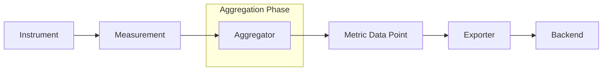
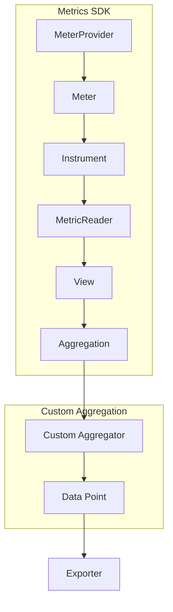
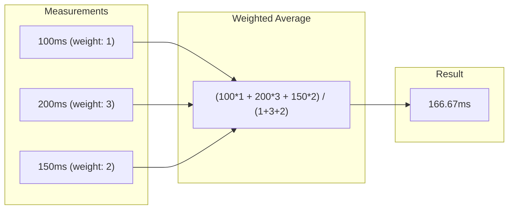
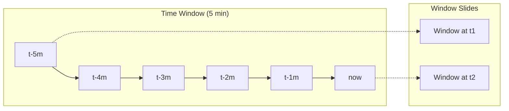
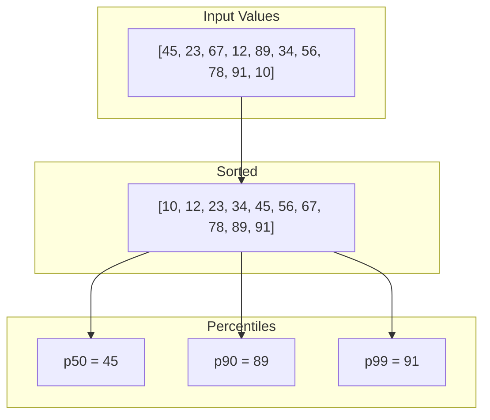
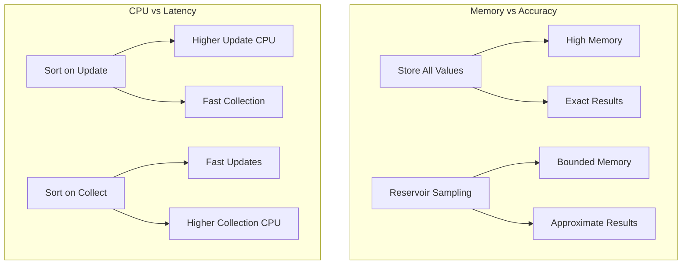

# How to Build OpenTelemetry Metric Aggregation Custom

Author: [nawazdhandala](https://github.com/nawazdhandala)

Tags: OpenTelemetry, Metrics, Aggregation, Observability

Description: Learn how to build custom metric aggregations in OpenTelemetry to capture business-specific measurements that default aggregators cannot provide.

---

> Default aggregations cover 80% of use cases. Custom aggregations unlock the remaining 20% where your business logic lives.

OpenTelemetry provides powerful built-in aggregations like Sum, LastValue, and Histogram. However, real-world observability often requires specialized aggregations that capture domain-specific insights. Maybe you need a weighted average based on request priority, a custom percentile calculation, or an aggregation that filters data based on business rules before computing.

This guide walks through building custom metric aggregations in OpenTelemetry, from understanding the aggregation pipeline to implementing production-ready custom aggregators.

---

## Table of Contents

1. Understanding OpenTelemetry Metric Aggregation
2. When You Need Custom Aggregation
3. The Aggregation Pipeline Architecture
4. Building a Custom Aggregator (Node.js/TypeScript)
5. Implementing a Weighted Average Aggregator
6. Creating a Sliding Window Aggregator
7. Building a Custom Percentile Aggregator
8. Testing Custom Aggregations
9. Performance Considerations
10. Deploying Custom Aggregations
11. Common Pitfalls and Solutions

---

## 1. Understanding OpenTelemetry Metric Aggregation

Before building custom aggregations, you need to understand what aggregation does in OpenTelemetry.

The following diagram shows how measurements flow through the OpenTelemetry metrics pipeline.



| Component | Role |
|-----------|------|
| Instrument | The API you call to record measurements (Counter, Histogram, etc.) |
| Measurement | A single recorded value with attributes |
| Aggregator | Combines multiple measurements into a summarized data point |
| Metric Data Point | The aggregated result ready for export |
| Exporter | Ships data to your observability backend |

Built-in aggregation types:

| Aggregation | Use Case | Example |
|-------------|----------|---------|
| Sum | Counting events, totals | Request count, bytes transferred |
| LastValue | Current state, gauges | CPU usage, queue depth |
| Histogram | Distribution analysis | Request latency percentiles |
| ExponentialHistogram | High-precision distribution | Fine-grained latency buckets |

---

## 2. When You Need Custom Aggregation

Custom aggregations are appropriate when:

- **Business-weighted metrics**: You need to weight measurements by business importance (priority customers, revenue impact)
- **Domain-specific statistics**: Standard aggregations do not capture your specific statistical needs
- **Pre-aggregation filtering**: You want to exclude certain data points before aggregation based on complex rules
- **Hybrid aggregations**: You need to combine multiple aggregation strategies
- **Cardinality reduction**: You want custom bucketing or grouping logic

Examples of custom aggregation needs:

| Scenario | Why Built-in Falls Short | Custom Solution |
|----------|-------------------------|-----------------|
| SLA compliance tracking | Histogram percentiles do not weight by customer tier | Weighted percentile aggregator |
| Rate of change detection | No built-in derivative calculation | Sliding window rate aggregator |
| Outlier-excluded averages | Sum/Count includes outliers | Trimmed mean aggregator |
| Business hour filtering | No time-based filtering | Time-aware aggregator |

---

## 3. The Aggregation Pipeline Architecture

The following diagram shows the internal structure of the metrics SDK and where custom aggregation fits in.



Key interfaces for custom aggregation:

```typescript
// The core interface your custom aggregator must implement
interface Aggregator<T> {
  // Called for each measurement
  update(value: number, attributes: Attributes): void;

  // Called when the MetricReader collects data
  collect(): T;

  // Reset state for delta temporality
  reset(): void;
}
```

---

## 4. Building a Custom Aggregator (Node.js/TypeScript)

Let us start with the foundational structure for a custom aggregator. This example shows how to create a basic aggregator that you can extend for specific use cases.

First, install the required dependencies:

```bash
npm install @opentelemetry/api \
            @opentelemetry/sdk-metrics \
            @opentelemetry/resources \
            @opentelemetry/semantic-conventions
```

Create the base aggregator structure:

```typescript
// custom-aggregator.ts
import {
  Aggregation,
  AggregationTemporality,
  DataPointType,
  InstrumentDescriptor,
  InstrumentType,
} from '@opentelemetry/sdk-metrics';
import { HrTime, Attributes } from '@opentelemetry/api';

// Define the structure of your aggregated data point
interface CustomDataPoint {
  startTime: HrTime;
  endTime: HrTime;
  attributes: Attributes;
  value: number;
}

// The accumulator holds state between collections
interface CustomAccumulator {
  values: number[];
  weights: number[];
  count: number;
}

export class CustomAggregator {
  private accumulators: Map<string, CustomAccumulator> = new Map();

  constructor(private readonly config: { maxValues?: number } = {}) {
    this.config.maxValues = config.maxValues ?? 1000;
  }

  // Generate a unique key for attribute combinations
  private getKey(attributes: Attributes): string {
    return JSON.stringify(
      Object.entries(attributes).sort(([a], [b]) => a.localeCompare(b))
    );
  }

  // Called for each measurement
  update(value: number, attributes: Attributes, weight: number = 1): void {
    const key = this.getKey(attributes);
    let accumulator = this.accumulators.get(key);

    if (!accumulator) {
      accumulator = { values: [], weights: [], count: 0 };
      this.accumulators.set(key, accumulator);
    }

    // Respect memory bounds
    if (accumulator.values.length < this.config.maxValues!) {
      accumulator.values.push(value);
      accumulator.weights.push(weight);
    }
    accumulator.count++;
  }

  // Called during metric collection
  collect(): Map<string, CustomDataPoint> {
    const results = new Map<string, CustomDataPoint>();
    const now = process.hrtime() as HrTime;

    for (const [key, acc] of this.accumulators) {
      const attributes = JSON.parse(key);
      results.set(key, {
        startTime: now,
        endTime: now,
        attributes: Object.fromEntries(attributes),
        value: this.computeValue(acc),
      });
    }

    return results;
  }

  // Override this method in subclasses for custom computation
  protected computeValue(accumulator: CustomAccumulator): number {
    if (accumulator.values.length === 0) return 0;
    return accumulator.values.reduce((a, b) => a + b, 0) / accumulator.values.length;
  }

  reset(): void {
    this.accumulators.clear();
  }
}
```

---

## 5. Implementing a Weighted Average Aggregator

A weighted average aggregator is useful when different measurements have different importance levels. For example, calculating average response time weighted by customer tier.

The following diagram shows how measurements with different weights are combined.



Here is the implementation:

```typescript
// weighted-average-aggregator.ts
import { Attributes } from '@opentelemetry/api';

interface WeightedAccumulator {
  weightedSum: number;
  totalWeight: number;
  count: number;
  min: number;
  max: number;
}

export class WeightedAverageAggregator {
  private accumulators: Map<string, WeightedAccumulator> = new Map();

  private getKey(attributes: Attributes): string {
    return JSON.stringify(
      Object.entries(attributes).sort(([a], [b]) => a.localeCompare(b))
    );
  }

  // Record a measurement with an associated weight
  update(value: number, weight: number, attributes: Attributes): void {
    const key = this.getKey(attributes);
    let acc = this.accumulators.get(key);

    if (!acc) {
      acc = {
        weightedSum: 0,
        totalWeight: 0,
        count: 0,
        min: Number.MAX_VALUE,
        max: Number.MIN_VALUE,
      };
      this.accumulators.set(key, acc);
    }

    acc.weightedSum += value * weight;
    acc.totalWeight += weight;
    acc.count++;
    acc.min = Math.min(acc.min, value);
    acc.max = Math.max(acc.max, value);
  }

  collect(): WeightedAverageResult[] {
    const results: WeightedAverageResult[] = [];

    for (const [key, acc] of this.accumulators) {
      const attributes = Object.fromEntries(JSON.parse(key));
      results.push({
        attributes,
        weightedAverage: acc.totalWeight > 0 ? acc.weightedSum / acc.totalWeight : 0,
        totalWeight: acc.totalWeight,
        count: acc.count,
        min: acc.min === Number.MAX_VALUE ? 0 : acc.min,
        max: acc.max === Number.MIN_VALUE ? 0 : acc.max,
      });
    }

    return results;
  }

  reset(): void {
    this.accumulators.clear();
  }
}

interface WeightedAverageResult {
  attributes: Attributes;
  weightedAverage: number;
  totalWeight: number;
  count: number;
  min: number;
  max: number;
}
```

Usage example with customer tier weighting:

```typescript
// usage-weighted-average.ts
import { WeightedAverageAggregator } from './weighted-average-aggregator';

const latencyAggregator = new WeightedAverageAggregator();

// Customer tier weights
const TIER_WEIGHTS: Record<string, number> = {
  enterprise: 10,
  business: 5,
  starter: 1,
};

// Simulate recording latencies
function recordLatency(latencyMs: number, customerTier: string, endpoint: string) {
  const weight = TIER_WEIGHTS[customerTier] || 1;
  latencyAggregator.update(latencyMs, weight, {
    'customer.tier': customerTier,
    'http.route': endpoint,
  });
}

// Record some measurements
recordLatency(100, 'enterprise', '/api/checkout');
recordLatency(250, 'starter', '/api/checkout');
recordLatency(150, 'business', '/api/checkout');
recordLatency(300, 'starter', '/api/checkout');

// Collect results
const results = latencyAggregator.collect();
console.log('Weighted Average Results:', JSON.stringify(results, null, 2));

// Output shows enterprise customers weighted more heavily:
// weightedAverage will be closer to 100ms than simple average
```

---

## 6. Creating a Sliding Window Aggregator

A sliding window aggregator maintains statistics over a moving time window, useful for rate calculations and trend detection.

The following diagram shows how the sliding window operates over time.



Here is the implementation:

```typescript
// sliding-window-aggregator.ts
import { Attributes } from '@opentelemetry/api';

interface TimestampedValue {
  value: number;
  timestamp: number;
}

interface WindowAccumulator {
  values: TimestampedValue[];
}

export class SlidingWindowAggregator {
  private accumulators: Map<string, WindowAccumulator> = new Map();
  private windowMs: number;
  private maxValuesPerWindow: number;

  constructor(config: { windowMs?: number; maxValuesPerWindow?: number } = {}) {
    this.windowMs = config.windowMs ?? 60000; // Default 1 minute
    this.maxValuesPerWindow = config.maxValuesPerWindow ?? 10000;
  }

  private getKey(attributes: Attributes): string {
    return JSON.stringify(
      Object.entries(attributes).sort(([a], [b]) => a.localeCompare(b))
    );
  }

  private pruneOldValues(acc: WindowAccumulator): void {
    const cutoff = Date.now() - this.windowMs;
    acc.values = acc.values.filter((v) => v.timestamp >= cutoff);
  }

  update(value: number, attributes: Attributes): void {
    const key = this.getKey(attributes);
    let acc = this.accumulators.get(key);

    if (!acc) {
      acc = { values: [] };
      this.accumulators.set(key, acc);
    }

    // Prune old values first
    this.pruneOldValues(acc);

    // Add new value if under limit
    if (acc.values.length < this.maxValuesPerWindow) {
      acc.values.push({
        value,
        timestamp: Date.now(),
      });
    }
  }

  collect(): SlidingWindowResult[] {
    const results: SlidingWindowResult[] = [];

    for (const [key, acc] of this.accumulators) {
      this.pruneOldValues(acc);
      const attributes = Object.fromEntries(JSON.parse(key));

      if (acc.values.length === 0) {
        results.push({
          attributes,
          count: 0,
          sum: 0,
          average: 0,
          rate: 0,
          min: 0,
          max: 0,
        });
        continue;
      }

      const values = acc.values.map((v) => v.value);
      const sum = values.reduce((a, b) => a + b, 0);
      const windowSeconds = this.windowMs / 1000;

      results.push({
        attributes,
        count: values.length,
        sum,
        average: sum / values.length,
        rate: values.length / windowSeconds, // Events per second
        min: Math.min(...values),
        max: Math.max(...values),
      });
    }

    return results;
  }

  // Get rate of change (derivative)
  getRateOfChange(attributes: Attributes): number {
    const key = this.getKey(attributes);
    const acc = this.accumulators.get(key);

    if (!acc || acc.values.length < 2) return 0;

    this.pruneOldValues(acc);
    if (acc.values.length < 2) return 0;

    // Calculate slope using first and last values
    const first = acc.values[0];
    const last = acc.values[acc.values.length - 1];
    const timeDeltaSeconds = (last.timestamp - first.timestamp) / 1000;

    if (timeDeltaSeconds === 0) return 0;

    return (last.value - first.value) / timeDeltaSeconds;
  }

  reset(): void {
    this.accumulators.clear();
  }
}

interface SlidingWindowResult {
  attributes: Attributes;
  count: number;
  sum: number;
  average: number;
  rate: number;
  min: number;
  max: number;
}
```

Usage example for monitoring request rate trends:

```typescript
// usage-sliding-window.ts
import { SlidingWindowAggregator } from './sliding-window-aggregator';

// 5-minute sliding window
const requestAggregator = new SlidingWindowAggregator({
  windowMs: 5 * 60 * 1000,
  maxValuesPerWindow: 50000,
});

// Middleware to track requests
function trackRequest(endpoint: string, latencyMs: number) {
  requestAggregator.update(latencyMs, {
    'http.route': endpoint,
    'service.name': 'api-gateway',
  });
}

// Simulate traffic
trackRequest('/api/users', 45);
trackRequest('/api/users', 52);
trackRequest('/api/orders', 120);

// Check current statistics
const stats = requestAggregator.collect();
console.log('Sliding Window Stats:', stats);

// Check rate of change for anomaly detection
const rateOfChange = requestAggregator.getRateOfChange({
  'http.route': '/api/users',
  'service.name': 'api-gateway',
});
console.log('Latency rate of change:', rateOfChange, 'ms/second');
```

---

## 7. Building a Custom Percentile Aggregator

Standard histograms use predefined buckets. A custom percentile aggregator can provide exact percentiles or use algorithms like t-digest for memory-efficient approximate percentiles.

The following diagram shows how values are organized for percentile calculation.



Here is the implementation:

```typescript
// percentile-aggregator.ts
import { Attributes } from '@opentelemetry/api';

interface PercentileAccumulator {
  values: number[];
  sorted: boolean;
}

export class PercentileAggregator {
  private accumulators: Map<string, PercentileAccumulator> = new Map();
  private percentiles: number[];
  private maxValues: number;

  constructor(config: { percentiles?: number[]; maxValues?: number } = {}) {
    // Default to common percentiles
    this.percentiles = config.percentiles ?? [50, 90, 95, 99];
    this.maxValues = config.maxValues ?? 10000;
  }

  private getKey(attributes: Attributes): string {
    return JSON.stringify(
      Object.entries(attributes).sort(([a], [b]) => a.localeCompare(b))
    );
  }

  update(value: number, attributes: Attributes): void {
    const key = this.getKey(attributes);
    let acc = this.accumulators.get(key);

    if (!acc) {
      acc = { values: [], sorted: false };
      this.accumulators.set(key, acc);
    }

    // Use reservoir sampling if we exceed max values
    if (acc.values.length < this.maxValues) {
      acc.values.push(value);
      acc.sorted = false;
    } else {
      // Reservoir sampling to maintain representative sample
      const idx = Math.floor(Math.random() * (acc.values.length + 1));
      if (idx < this.maxValues) {
        acc.values[idx] = value;
        acc.sorted = false;
      }
    }
  }

  private calculatePercentile(sortedValues: number[], percentile: number): number {
    if (sortedValues.length === 0) return 0;

    const index = (percentile / 100) * (sortedValues.length - 1);
    const lower = Math.floor(index);
    const upper = Math.ceil(index);

    if (lower === upper) {
      return sortedValues[lower];
    }

    // Linear interpolation
    const fraction = index - lower;
    return sortedValues[lower] + fraction * (sortedValues[upper] - sortedValues[lower]);
  }

  collect(): PercentileResult[] {
    const results: PercentileResult[] = [];

    for (const [key, acc] of this.accumulators) {
      const attributes = Object.fromEntries(JSON.parse(key));

      if (acc.values.length === 0) {
        const emptyPercentiles: Record<string, number> = {};
        for (const p of this.percentiles) {
          emptyPercentiles[`p${p}`] = 0;
        }
        results.push({
          attributes,
          percentiles: emptyPercentiles,
          count: 0,
          min: 0,
          max: 0,
          sum: 0,
        });
        continue;
      }

      // Sort if needed
      if (!acc.sorted) {
        acc.values.sort((a, b) => a - b);
        acc.sorted = true;
      }

      const percentileValues: Record<string, number> = {};
      for (const p of this.percentiles) {
        percentileValues[`p${p}`] = this.calculatePercentile(acc.values, p);
      }

      results.push({
        attributes,
        percentiles: percentileValues,
        count: acc.values.length,
        min: acc.values[0],
        max: acc.values[acc.values.length - 1],
        sum: acc.values.reduce((a, b) => a + b, 0),
      });
    }

    return results;
  }

  reset(): void {
    this.accumulators.clear();
  }
}

interface PercentileResult {
  attributes: Attributes;
  percentiles: Record<string, number>;
  count: number;
  min: number;
  max: number;
  sum: number;
}
```

Usage example with custom percentiles for SLA tracking:

```typescript
// usage-percentile.ts
import { PercentileAggregator } from './percentile-aggregator';

// Track SLA-relevant percentiles
const latencyAggregator = new PercentileAggregator({
  percentiles: [50, 75, 90, 95, 99, 99.9],
  maxValues: 100000,
});

// Simulate recording latencies
function recordLatency(endpoint: string, latencyMs: number) {
  latencyAggregator.update(latencyMs, {
    'http.route': endpoint,
    'service.name': 'checkout-service',
  });
}

// Generate sample data
for (let i = 0; i < 1000; i++) {
  // Most requests are fast (10-50ms)
  let latency = 10 + Math.random() * 40;

  // Some medium latency (5%)
  if (Math.random() < 0.05) {
    latency = 100 + Math.random() * 200;
  }

  // Rare slow requests (1%)
  if (Math.random() < 0.01) {
    latency = 500 + Math.random() * 1000;
  }

  recordLatency('/api/checkout', latency);
}

// Collect and analyze
const results = latencyAggregator.collect();
console.log('Percentile Results:', JSON.stringify(results, null, 2));

// Check SLA compliance (99th percentile < 500ms)
const checkoutStats = results.find(
  (r) => r.attributes['http.route'] === '/api/checkout'
);
if (checkoutStats && checkoutStats.percentiles['p99'] > 500) {
  console.warn('SLA BREACH: p99 latency exceeds 500ms');
}
```

---

## 8. Testing Custom Aggregations

Proper testing ensures your custom aggregations behave correctly under various conditions.

```typescript
// custom-aggregator.test.ts
import { WeightedAverageAggregator } from './weighted-average-aggregator';
import { SlidingWindowAggregator } from './sliding-window-aggregator';
import { PercentileAggregator } from './percentile-aggregator';

describe('WeightedAverageAggregator', () => {
  let aggregator: WeightedAverageAggregator;

  beforeEach(() => {
    aggregator = new WeightedAverageAggregator();
  });

  test('calculates weighted average correctly', () => {
    // 100 * 1 + 200 * 3 + 150 * 2 = 100 + 600 + 300 = 1000
    // Total weight = 1 + 3 + 2 = 6
    // Weighted average = 1000 / 6 = 166.67

    aggregator.update(100, 1, { endpoint: '/test' });
    aggregator.update(200, 3, { endpoint: '/test' });
    aggregator.update(150, 2, { endpoint: '/test' });

    const results = aggregator.collect();
    expect(results).toHaveLength(1);
    expect(results[0].weightedAverage).toBeCloseTo(166.67, 1);
  });

  test('separates by attributes', () => {
    aggregator.update(100, 1, { endpoint: '/a' });
    aggregator.update(200, 1, { endpoint: '/b' });

    const results = aggregator.collect();
    expect(results).toHaveLength(2);
  });

  test('handles zero weight', () => {
    aggregator.update(100, 0, { endpoint: '/test' });
    const results = aggregator.collect();
    expect(results[0].weightedAverage).toBe(0);
  });
});

describe('SlidingWindowAggregator', () => {
  test('prunes old values', async () => {
    const aggregator = new SlidingWindowAggregator({ windowMs: 100 });

    aggregator.update(100, { endpoint: '/test' });

    // Wait for window to expire
    await new Promise((r) => setTimeout(r, 150));

    aggregator.update(200, { endpoint: '/test' });

    const results = aggregator.collect();
    expect(results[0].count).toBe(1);
    expect(results[0].average).toBe(200);
  });

  test('calculates rate correctly', () => {
    const aggregator = new SlidingWindowAggregator({ windowMs: 60000 });

    // Add 100 values
    for (let i = 0; i < 100; i++) {
      aggregator.update(i, { endpoint: '/test' });
    }

    const results = aggregator.collect();
    // Rate should be approximately 100 / 60 = 1.67 per second
    // (actual rate depends on timing)
    expect(results[0].count).toBe(100);
  });
});

describe('PercentileAggregator', () => {
  test('calculates percentiles correctly', () => {
    const aggregator = new PercentileAggregator({
      percentiles: [50, 90, 99],
    });

    // Add values 1-100
    for (let i = 1; i <= 100; i++) {
      aggregator.update(i, { endpoint: '/test' });
    }

    const results = aggregator.collect();
    expect(results[0].percentiles['p50']).toBeCloseTo(50, 0);
    expect(results[0].percentiles['p90']).toBeCloseTo(90, 0);
    expect(results[0].percentiles['p99']).toBeCloseTo(99, 0);
  });

  test('handles single value', () => {
    const aggregator = new PercentileAggregator();
    aggregator.update(42, { endpoint: '/test' });

    const results = aggregator.collect();
    expect(results[0].percentiles['p50']).toBe(42);
    expect(results[0].percentiles['p99']).toBe(42);
  });
});
```

---

## 9. Performance Considerations

Custom aggregations can impact performance. Here are key considerations.

The following diagram shows the tradeoffs between accuracy and resource usage.



Best practices for performance:

```typescript
// performance-optimized-aggregator.ts
import { Attributes } from '@opentelemetry/api';

export class PerformanceOptimizedAggregator {
  private accumulators: Map<string, OptimizedAccumulator> = new Map();

  // Pre-compute attribute keys to avoid repeated JSON operations
  private keyCache: Map<Attributes, string> = new Map();

  // Limit cardinality to prevent memory explosion
  private readonly maxCardinality: number;
  private readonly maxValuesPerSeries: number;

  constructor(config: { maxCardinality?: number; maxValuesPerSeries?: number } = {}) {
    this.maxCardinality = config.maxCardinality ?? 1000;
    this.maxValuesPerSeries = config.maxValuesPerSeries ?? 10000;
  }

  private getKey(attributes: Attributes): string {
    // Check cache first
    let key = this.keyCache.get(attributes);
    if (key) return key;

    // Compute and cache
    key = JSON.stringify(
      Object.entries(attributes).sort(([a], [b]) => a.localeCompare(b))
    );

    // Limit cache size
    if (this.keyCache.size < this.maxCardinality) {
      this.keyCache.set(attributes, key);
    }

    return key;
  }

  update(value: number, attributes: Attributes): boolean {
    const key = this.getKey(attributes);
    let acc = this.accumulators.get(key);

    // Enforce cardinality limit
    if (!acc && this.accumulators.size >= this.maxCardinality) {
      // Log dropped measurement
      console.warn(`Cardinality limit reached, dropping measurement`);
      return false;
    }

    if (!acc) {
      acc = {
        sum: 0,
        count: 0,
        min: Number.MAX_VALUE,
        max: Number.MIN_VALUE,
        // Use running statistics instead of storing all values
        m2: 0, // For variance calculation
        mean: 0,
      };
      this.accumulators.set(key, acc);
    }

    // Welford's online algorithm for mean and variance
    acc.count++;
    const delta = value - acc.mean;
    acc.mean += delta / acc.count;
    const delta2 = value - acc.mean;
    acc.m2 += delta * delta2;

    acc.sum += value;
    acc.min = Math.min(acc.min, value);
    acc.max = Math.max(acc.max, value);

    return true;
  }

  collect(): OptimizedResult[] {
    const results: OptimizedResult[] = [];

    for (const [key, acc] of this.accumulators) {
      const attributes = Object.fromEntries(JSON.parse(key));
      const variance = acc.count > 1 ? acc.m2 / (acc.count - 1) : 0;

      results.push({
        attributes,
        count: acc.count,
        sum: acc.sum,
        mean: acc.mean,
        variance,
        stddev: Math.sqrt(variance),
        min: acc.min === Number.MAX_VALUE ? 0 : acc.min,
        max: acc.max === Number.MIN_VALUE ? 0 : acc.max,
      });
    }

    return results;
  }

  reset(): void {
    this.accumulators.clear();
    this.keyCache.clear();
  }

  getCardinality(): number {
    return this.accumulators.size;
  }
}

interface OptimizedAccumulator {
  sum: number;
  count: number;
  min: number;
  max: number;
  m2: number;
  mean: number;
}

interface OptimizedResult {
  attributes: Attributes;
  count: number;
  sum: number;
  mean: number;
  variance: number;
  stddev: number;
  min: number;
  max: number;
}
```

---

## 10. Deploying Custom Aggregations

To integrate custom aggregations with OpenTelemetry, you need to create a custom metric reader or processor.

```typescript
// custom-metric-reader.ts
import {
  MeterProvider,
  PeriodicExportingMetricReader,
  ConsoleMetricExporter,
} from '@opentelemetry/sdk-metrics';
import { Resource } from '@opentelemetry/resources';
import { SemanticResourceAttributes } from '@opentelemetry/semantic-conventions';
import { WeightedAverageAggregator } from './weighted-average-aggregator';
import { OTLPMetricExporter } from '@opentelemetry/exporter-metrics-otlp-http';

// Create custom aggregators
const latencyAggregator = new WeightedAverageAggregator();

// Setup OpenTelemetry
const resource = new Resource({
  [SemanticResourceAttributes.SERVICE_NAME]: 'my-service',
  [SemanticResourceAttributes.SERVICE_VERSION]: '1.0.0',
});

// OTLP exporter for OneUptime
const otlpExporter = new OTLPMetricExporter({
  url: process.env.ONEUPTIME_OTLP_METRICS_ENDPOINT || 'https://oneuptime.com/otlp/v1/metrics',
  headers: {
    'x-oneuptime-token': process.env.ONEUPTIME_OTLP_TOKEN || '',
  },
});

const meterProvider = new MeterProvider({
  resource,
  readers: [
    new PeriodicExportingMetricReader({
      exporter: otlpExporter,
      exportIntervalMillis: 15000,
    }),
  ],
});

const meter = meterProvider.getMeter('custom-metrics');

// Create observable gauge that uses custom aggregator
const weightedLatencyGauge = meter.createObservableGauge(
  'http.server.weighted_latency',
  {
    description: 'Weighted average latency by customer tier',
    unit: 'ms',
  }
);

// Register callback to export custom aggregation results
weightedLatencyGauge.addCallback((observableResult) => {
  const results = latencyAggregator.collect();
  for (const result of results) {
    observableResult.observe(result.weightedAverage, result.attributes);
  }
  // Reset for delta temporality
  latencyAggregator.reset();
});

// Export for use in application
export { latencyAggregator, meterProvider };
```

Application integration:

```typescript
// app.ts
import express from 'express';
import { latencyAggregator } from './custom-metric-reader';

const app = express();

// Customer tier weights
const TIER_WEIGHTS: Record<string, number> = {
  enterprise: 10,
  business: 5,
  starter: 1,
};

// Middleware to record weighted latency
app.use((req, res, next) => {
  const start = Date.now();

  res.on('finish', () => {
    const latency = Date.now() - start;
    const customerTier = req.headers['x-customer-tier'] as string || 'starter';
    const weight = TIER_WEIGHTS[customerTier] || 1;

    latencyAggregator.update(latency, weight, {
      'http.route': req.route?.path || req.path,
      'http.method': req.method,
      'customer.tier': customerTier,
    });
  });

  next();
});

app.get('/api/checkout', (req, res) => {
  // Simulate processing
  setTimeout(() => {
    res.json({ status: 'ok' });
  }, Math.random() * 100);
});

app.listen(3000, () => {
  console.log('Server running on port 3000');
});
```

---

## 11. Common Pitfalls and Solutions

| Pitfall | Impact | Solution |
|---------|--------|----------|
| Unbounded cardinality | Memory exhaustion | Set maxCardinality limits, drop or aggregate high-cardinality attributes |
| Storing all raw values | Memory growth | Use streaming algorithms (Welford's, t-digest, reservoir sampling) |
| Synchronous expensive computation | Request latency | Defer computation to collection time or use separate thread |
| Not handling reset properly | Incorrect delta values | Clear all state on reset(), track cumulative vs delta |
| Ignoring attribute ordering | Duplicate series | Sort attributes before key generation |
| Missing concurrency control | Data corruption | Use locks or atomic operations for multi-threaded access |

Example of handling concurrency:

```typescript
// thread-safe-aggregator.ts
import { Attributes } from '@opentelemetry/api';

export class ThreadSafeAggregator {
  private accumulators: Map<string, SafeAccumulator> = new Map();
  private lock: Promise<void> = Promise.resolve();

  private async withLock<T>(fn: () => T): Promise<T> {
    const currentLock = this.lock;
    let resolve: () => void;
    this.lock = new Promise((r) => (resolve = r));

    await currentLock;
    try {
      return fn();
    } finally {
      resolve!();
    }
  }

  private getKey(attributes: Attributes): string {
    return JSON.stringify(
      Object.entries(attributes).sort(([a], [b]) => a.localeCompare(b))
    );
  }

  async update(value: number, attributes: Attributes): Promise<void> {
    await this.withLock(() => {
      const key = this.getKey(attributes);
      let acc = this.accumulators.get(key);

      if (!acc) {
        acc = { sum: 0, count: 0 };
        this.accumulators.set(key, acc);
      }

      acc.sum += value;
      acc.count++;
    });
  }

  async collect(): Promise<SafeResult[]> {
    return this.withLock(() => {
      const results: SafeResult[] = [];

      for (const [key, acc] of this.accumulators) {
        const attributes = Object.fromEntries(JSON.parse(key));
        results.push({
          attributes,
          average: acc.count > 0 ? acc.sum / acc.count : 0,
          count: acc.count,
        });
      }

      return results;
    });
  }

  async reset(): Promise<void> {
    await this.withLock(() => {
      this.accumulators.clear();
    });
  }
}

interface SafeAccumulator {
  sum: number;
  count: number;
}

interface SafeResult {
  attributes: Attributes;
  average: number;
  count: number;
}
```

---

## Summary

| What You Learned | Key Takeaway |
|-----------------|--------------|
| Aggregation pipeline | Understand where custom logic fits in the OTel metrics flow |
| Weighted averages | Weight measurements by business importance |
| Sliding windows | Track time-bounded statistics and rates |
| Custom percentiles | Calculate exact or approximate percentiles with controlled memory |
| Performance optimization | Use streaming algorithms and cardinality limits |
| Integration | Connect custom aggregators to OTel exporters |

Custom metric aggregations give you the flexibility to capture business-specific measurements that standard aggregators cannot provide. Start with the built-in aggregations, and reach for custom implementations when you have clear requirements that justify the additional complexity.

---

*Want to see your custom aggregations in action? Export them via OTLP to [OneUptime](https://oneuptime.com) for visualization and alerting alongside your standard metrics, traces, and logs.*

---

### Related Reading

- [What is OpenTelemetry Collector and Why Use One?](https://oneuptime.com/blog/post/2025-09-18-what-is-opentelemetry-collector-and-why-use-one/view)
- [How to Reduce Noise in OpenTelemetry](https://oneuptime.com/blog/post/2025-08-25-how-to-reduce-noise-in-opentelemetry/view)
- [Traces and Spans in OpenTelemetry: A Practical Guide](https://oneuptime.com/blog/post/2025-08-27-traces-and-spans-in-opentelemetry/view)
