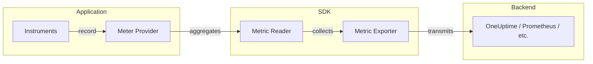
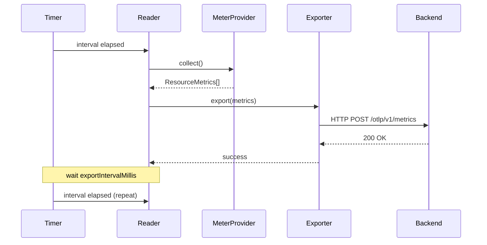
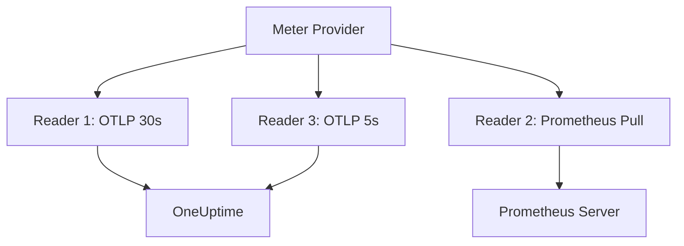

# How to Build OpenTelemetry Metric Readers

Author: [nawazdhandala](https://github.com/nawazdhandala)

Tags: OpenTelemetry, Metrics, Observability, Monitoring

Description: A practical guide to implementing custom metric readers in OpenTelemetry, covering PeriodicExportingMetricReader, custom readers, and configuration options for production systems.

---

> Metric readers are the bridge between your instrumentation and your observability backend. They control when metrics are collected, how they are aggregated, and where they are sent.

OpenTelemetry metrics flow through a pipeline: instruments record data points, the meter provider aggregates them, and metric readers collect and export the results. Understanding how to configure and customize metric readers gives you precise control over your observability data flow.

This guide walks through implementing metric readers in Node.js/TypeScript, from the built-in `PeriodicExportingMetricReader` to fully custom readers for specialized use cases.

---

## Table of Contents

1. What is a Metric Reader?
2. The Metric Collection Pipeline
3. PeriodicExportingMetricReader Deep Dive
4. Configuration Options
5. Building a Custom Metric Reader
6. Multiple Readers and Fan-Out
7. Error Handling and Resilience
8. Performance Considerations
9. Testing Metric Readers
10. Production Best Practices

---

## 1. What is a Metric Reader?

A metric reader is responsible for two things:

1. **Collecting metrics** from the meter provider at specific intervals or on demand
2. **Exporting metrics** to one or more backends (via exporters)

The reader acts as the scheduler and coordinator. It decides *when* to pull aggregated data from the SDK and *how* to deliver it to exporters.

| Component | Responsibility |
|-----------|----------------|
| Instrument | Records raw measurements (counter.add, histogram.record) |
| Meter Provider | Aggregates measurements into metric data points |
| Metric Reader | Schedules collection and triggers export |
| Metric Exporter | Serializes and transmits data to backends |

---

## 2. The Metric Collection Pipeline

Understanding the flow helps you decide where to customize:



The metric reader sits between aggregation and export. When its collection interval fires (or when manually triggered), it:

1. Calls `collect()` on the meter provider
2. Receives aggregated metric data
3. Passes the data to the configured exporter
4. Handles success/failure responses

---

## 3. PeriodicExportingMetricReader Deep Dive

The `PeriodicExportingMetricReader` is the default choice for most applications. It collects and exports metrics at fixed time intervals.

### Basic Setup

```typescript
// telemetry.ts
import { NodeSDK } from '@opentelemetry/sdk-node';
import { OTLPMetricExporter } from '@opentelemetry/exporter-metrics-otlp-http';
import { PeriodicExportingMetricReader } from '@opentelemetry/sdk-metrics';
import { Resource } from '@opentelemetry/resources';
import { ATTR_SERVICE_NAME, ATTR_SERVICE_VERSION } from '@opentelemetry/semantic-conventions';

// Create the OTLP exporter for OneUptime
const metricExporter = new OTLPMetricExporter({
  url: process.env.ONEUPTIME_OTLP_ENDPOINT || 'https://oneuptime.com/otlp/v1/metrics',
  headers: {
    'x-oneuptime-token': process.env.ONEUPTIME_OTLP_TOKEN || '',
  },
});

// Create the periodic metric reader
const metricReader = new PeriodicExportingMetricReader({
  exporter: metricExporter,
  exportIntervalMillis: 30000,  // Collect and export every 30 seconds
  exportTimeoutMillis: 10000,   // Timeout after 10 seconds
});

// Initialize the SDK
const sdk = new NodeSDK({
  resource: new Resource({
    [ATTR_SERVICE_NAME]: 'order-service',
    [ATTR_SERVICE_VERSION]: '2.1.0',
  }),
  metricReader: metricReader,
});

sdk.start();
```

### How It Works Internally

The `PeriodicExportingMetricReader` runs an internal timer:



---

## 4. Configuration Options

### Export Interval

The `exportIntervalMillis` controls how often metrics are collected and sent:

```typescript
// High-frequency for real-time dashboards and fast alerting
const realtimeReader = new PeriodicExportingMetricReader({
  exporter: metricExporter,
  exportIntervalMillis: 5000,  // Every 5 seconds
});

// Standard frequency for most production workloads
const standardReader = new PeriodicExportingMetricReader({
  exporter: metricExporter,
  exportIntervalMillis: 30000,  // Every 30 seconds
});

// Low-frequency for cost optimization on high-cardinality metrics
const economyReader = new PeriodicExportingMetricReader({
  exporter: metricExporter,
  exportIntervalMillis: 60000,  // Every 60 seconds
});
```

| Interval | Use Case | Trade-off |
|----------|----------|-----------|
| 5s | Real-time dashboards, fast alerting | Higher network/storage cost |
| 15-30s | General production monitoring | Good balance |
| 60s+ | Cost-sensitive, trend analysis | May miss short anomalies |

### Export Timeout

The `exportTimeoutMillis` prevents hanging exports from blocking the pipeline:

```typescript
const metricReader = new PeriodicExportingMetricReader({
  exporter: metricExporter,
  exportIntervalMillis: 30000,
  exportTimeoutMillis: 10000,  // Abort if export takes longer than 10s
});
```

If the timeout fires, the reader logs an error and drops that batch. The next interval proceeds normally.

### Aggregation Temporality

Metric readers also respect aggregation temporality, which affects how cumulative vs delta values are reported:

```typescript
import { AggregationTemporality } from '@opentelemetry/sdk-metrics';

// Delta temporality: each export contains only the change since last export
// Good for: backends that handle delta aggregation (Prometheus pushgateway, some cloud backends)
const deltaExporter = new OTLPMetricExporter({
  url: 'https://oneuptime.com/otlp/v1/metrics',
  temporalityPreference: AggregationTemporality.DELTA,
});

// Cumulative temporality: each export contains the total since process start
// Good for: pull-based systems, most OTLP backends
const cumulativeExporter = new OTLPMetricExporter({
  url: 'https://oneuptime.com/otlp/v1/metrics',
  temporalityPreference: AggregationTemporality.CUMULATIVE,
});
```

---

## 5. Building a Custom Metric Reader

Sometimes the periodic reader does not fit your needs. You might want:

- Event-driven export (export on specific triggers)
- Conditional export (only export when thresholds are crossed)
- Custom batching logic
- Integration with non-standard backends

### Custom Reader Interface

A metric reader must implement the `MetricReader` interface:

```typescript
import {
  MetricReader,
  MetricProducer,
  CollectionResult,
  InstrumentType,
  Aggregation,
  AggregationTemporality,
} from '@opentelemetry/sdk-metrics';
import { MetricExporter } from '@opentelemetry/sdk-metrics';

export class EventDrivenMetricReader extends MetricReader {
  private exporter: MetricExporter;
  private metricProducer: MetricProducer | null = null;

  constructor(exporter: MetricExporter) {
    super();
    this.exporter = exporter;
  }

  // Called by the SDK when the reader is registered
  protected onInitialized(): void {
    console.log('EventDrivenMetricReader initialized');
  }

  // Define how instruments should be aggregated
  selectAggregation(instrumentType: InstrumentType): Aggregation {
    // Use default aggregations for each instrument type
    return Aggregation.Default();
  }

  // Define temporality preference
  selectAggregationTemporality(instrumentType: InstrumentType): AggregationTemporality {
    return AggregationTemporality.CUMULATIVE;
  }

  // Manual trigger for export (call this from your application code)
  async triggerExport(): Promise<void> {
    const result = await this.collect();
    if (result.errors.length > 0) {
      console.error('Collection errors:', result.errors);
    }

    const exportResult = await this.exporter.export(result.resourceMetrics);
    if (exportResult.code !== 0) {
      console.error('Export failed:', exportResult.error);
    }
  }

  // Called during SDK shutdown
  protected async onForceFlush(): Promise<void> {
    await this.triggerExport();
  }

  // Called during SDK shutdown
  protected async onShutdown(): Promise<void> {
    await this.exporter.shutdown();
  }
}
```

### Using the Custom Reader

```typescript
import { metrics } from '@opentelemetry/api';
import { MeterProvider } from '@opentelemetry/sdk-metrics';
import { OTLPMetricExporter } from '@opentelemetry/exporter-metrics-otlp-http';
import { EventDrivenMetricReader } from './event-driven-reader';

const exporter = new OTLPMetricExporter({
  url: 'https://oneuptime.com/otlp/v1/metrics',
  headers: { 'x-oneuptime-token': process.env.ONEUPTIME_OTLP_TOKEN || '' },
});

const customReader = new EventDrivenMetricReader(exporter);

const meterProvider = new MeterProvider({
  readers: [customReader],
});

metrics.setGlobalMeterProvider(meterProvider);

// Now you can trigger exports manually
async function handleCriticalEvent() {
  // Record some metrics
  const meter = metrics.getMeter('critical-events');
  const counter = meter.createCounter('critical_events_total');
  counter.add(1, { type: 'payment_failure' });

  // Immediately export (do not wait for periodic interval)
  await customReader.triggerExport();
}
```

### Threshold-Based Reader

Here is a more advanced example that exports only when a threshold is crossed:

```typescript
import {
  MetricReader,
  InstrumentType,
  Aggregation,
  AggregationTemporality,
  DataPointType,
} from '@opentelemetry/sdk-metrics';
import { MetricExporter } from '@opentelemetry/sdk-metrics';

interface ThresholdConfig {
  metricName: string;
  threshold: number;
  comparison: 'gt' | 'lt' | 'eq';
}

export class ThresholdMetricReader extends MetricReader {
  private exporter: MetricExporter;
  private thresholds: ThresholdConfig[];
  private checkInterval: NodeJS.Timeout | null = null;
  private checkIntervalMs: number;

  constructor(
    exporter: MetricExporter,
    thresholds: ThresholdConfig[],
    checkIntervalMs: number = 5000
  ) {
    super();
    this.exporter = exporter;
    this.thresholds = thresholds;
    this.checkIntervalMs = checkIntervalMs;
  }

  protected onInitialized(): void {
    // Start checking thresholds periodically
    this.checkInterval = setInterval(() => this.checkThresholds(), this.checkIntervalMs);
  }

  selectAggregation(instrumentType: InstrumentType): Aggregation {
    return Aggregation.Default();
  }

  selectAggregationTemporality(instrumentType: InstrumentType): AggregationTemporality {
    return AggregationTemporality.CUMULATIVE;
  }

  private async checkThresholds(): Promise<void> {
    const result = await this.collect();

    let shouldExport = false;

    // Check each metric against thresholds
    for (const resourceMetric of result.resourceMetrics.scopeMetrics) {
      for (const scopeMetric of resourceMetric.metrics) {
        const threshold = this.thresholds.find(t => t.metricName === scopeMetric.descriptor.name);
        if (!threshold) continue;

        // Extract the value based on data point type
        for (const dataPoint of scopeMetric.dataPoints) {
          let value: number;
          if (dataPoint.value !== undefined && typeof dataPoint.value === 'number') {
            value = dataPoint.value;
          } else {
            continue;
          }

          // Check threshold
          const breached = this.checkThreshold(value, threshold);
          if (breached) {
            console.log(`Threshold breached: ${scopeMetric.descriptor.name} = ${value}`);
            shouldExport = true;
          }
        }
      }
    }

    if (shouldExport) {
      await this.exporter.export(result.resourceMetrics);
    }
  }

  private checkThreshold(value: number, config: ThresholdConfig): boolean {
    switch (config.comparison) {
      case 'gt': return value > config.threshold;
      case 'lt': return value < config.threshold;
      case 'eq': return value === config.threshold;
      default: return false;
    }
  }

  protected async onForceFlush(): Promise<void> {
    const result = await this.collect();
    await this.exporter.export(result.resourceMetrics);
  }

  protected async onShutdown(): Promise<void> {
    if (this.checkInterval) {
      clearInterval(this.checkInterval);
    }
    await this.exporter.shutdown();
  }
}
```

Usage:

```typescript
const thresholdReader = new ThresholdMetricReader(
  exporter,
  [
    { metricName: 'http_error_rate', threshold: 0.05, comparison: 'gt' },
    { metricName: 'queue_depth', threshold: 1000, comparison: 'gt' },
    { metricName: 'memory_usage_percent', threshold: 90, comparison: 'gt' },
  ],
  5000  // Check every 5 seconds
);
```

---

## 6. Multiple Readers and Fan-Out

You can register multiple readers with a single meter provider. This enables fan-out to different backends:

```typescript
import { MeterProvider } from '@opentelemetry/sdk-metrics';
import { PeriodicExportingMetricReader } from '@opentelemetry/sdk-metrics';
import { OTLPMetricExporter } from '@opentelemetry/exporter-metrics-otlp-http';
import { PrometheusExporter } from '@opentelemetry/exporter-prometheus';

// Reader 1: Send to OneUptime via OTLP
const oneuptimeReader = new PeriodicExportingMetricReader({
  exporter: new OTLPMetricExporter({
    url: 'https://oneuptime.com/otlp/v1/metrics',
    headers: { 'x-oneuptime-token': process.env.ONEUPTIME_OTLP_TOKEN || '' },
  }),
  exportIntervalMillis: 30000,
});

// Reader 2: Expose Prometheus endpoint for local scraping
const prometheusReader = new PrometheusExporter({
  port: 9464,
  endpoint: '/metrics',
});

// Reader 3: High-frequency export for critical metrics (custom reader)
const criticalReader = new PeriodicExportingMetricReader({
  exporter: new OTLPMetricExporter({
    url: 'https://oneuptime.com/otlp/v1/metrics',
    headers: { 'x-oneuptime-token': process.env.ONEUPTIME_OTLP_TOKEN || '' },
  }),
  exportIntervalMillis: 5000,  // Fast export for alerting
});

// Register all readers
const meterProvider = new MeterProvider({
  readers: [oneuptimeReader, prometheusReader, criticalReader],
});
```



---

## 7. Error Handling and Resilience

### Handling Export Failures

The periodic reader logs errors but does not retry by default. For production, wrap your exporter with retry logic:

```typescript
import { ExportResult, ExportResultCode } from '@opentelemetry/core';
import { MetricExporter, ResourceMetrics } from '@opentelemetry/sdk-metrics';

class RetryingMetricExporter implements MetricExporter {
  private delegate: MetricExporter;
  private maxRetries: number;
  private baseDelayMs: number;

  constructor(delegate: MetricExporter, maxRetries = 3, baseDelayMs = 1000) {
    this.delegate = delegate;
    this.maxRetries = maxRetries;
    this.baseDelayMs = baseDelayMs;
  }

  async export(metrics: ResourceMetrics, resultCallback: (result: ExportResult) => void): Promise<void> {
    let lastError: Error | undefined;

    for (let attempt = 0; attempt <= this.maxRetries; attempt++) {
      try {
        await new Promise<void>((resolve, reject) => {
          this.delegate.export(metrics, (result) => {
            if (result.code === ExportResultCode.SUCCESS) {
              resolve();
            } else {
              reject(result.error || new Error('Export failed'));
            }
          });
        });

        // Success
        resultCallback({ code: ExportResultCode.SUCCESS });
        return;
      } catch (error) {
        lastError = error as Error;
        if (attempt < this.maxRetries) {
          // Exponential backoff
          const delay = this.baseDelayMs * Math.pow(2, attempt);
          console.warn(`Export attempt ${attempt + 1} failed, retrying in ${delay}ms`);
          await this.sleep(delay);
        }
      }
    }

    // All retries exhausted
    resultCallback({
      code: ExportResultCode.FAILED,
      error: lastError,
    });
  }

  private sleep(ms: number): Promise<void> {
    return new Promise(resolve => setTimeout(resolve, ms));
  }

  async forceFlush(): Promise<void> {
    return this.delegate.forceFlush();
  }

  async shutdown(): Promise<void> {
    return this.delegate.shutdown();
  }

  selectAggregationTemporality = this.delegate.selectAggregationTemporality?.bind(this.delegate);
  selectAggregation = this.delegate.selectAggregation?.bind(this.delegate);
}
```

### Graceful Shutdown

Always flush metrics on process termination:

```typescript
import { NodeSDK } from '@opentelemetry/sdk-node';

const sdk = new NodeSDK({ /* config */ });
sdk.start();

// Handle graceful shutdown
const shutdown = async () => {
  console.log('Shutting down telemetry...');
  try {
    await sdk.shutdown();
    console.log('Telemetry shutdown complete');
  } catch (err) {
    console.error('Error during shutdown:', err);
  }
  process.exit(0);
};

process.on('SIGTERM', shutdown);
process.on('SIGINT', shutdown);

// For uncaught exceptions, still try to flush
process.on('uncaughtException', async (err) => {
  console.error('Uncaught exception:', err);
  await sdk.shutdown();
  process.exit(1);
});
```

---

## 8. Performance Considerations

### Memory Usage

Metric readers hold aggregated data in memory between exports. High-cardinality metrics can cause memory pressure:

```typescript
// Monitor reader memory usage
const memoryGauge = meter.createObservableGauge('otel_metric_reader_memory_bytes');
memoryGauge.addCallback((result) => {
  const usage = process.memoryUsage();
  result.observe(usage.heapUsed, { component: 'metric_reader' });
});
```

### Export Duration Monitoring

Track how long exports take to identify backend issues:

```typescript
import { Histogram } from '@opentelemetry/api';

class InstrumentedMetricReader extends PeriodicExportingMetricReader {
  private exportDuration: Histogram;

  constructor(options: PeriodicExportingMetricReaderOptions) {
    super(options);
    const meter = metrics.getMeter('otel-internals');
    this.exportDuration = meter.createHistogram('otel_metric_export_duration_seconds', {
      description: 'Duration of metric export operations',
      unit: 's',
    });
  }

  protected async doExport(): Promise<void> {
    const start = performance.now();
    try {
      await super.doExport();
      const duration = (performance.now() - start) / 1000;
      this.exportDuration.record(duration, { status: 'success' });
    } catch (error) {
      const duration = (performance.now() - start) / 1000;
      this.exportDuration.record(duration, { status: 'error' });
      throw error;
    }
  }
}
```

### Batching and Buffering

For high-throughput systems, consider implementing a buffering reader:

```typescript
class BufferedMetricReader extends MetricReader {
  private buffer: ResourceMetrics[] = [];
  private maxBufferSize: number;
  private flushInterval: NodeJS.Timeout | null = null;

  constructor(
    private exporter: MetricExporter,
    maxBufferSize = 100,
    flushIntervalMs = 60000
  ) {
    super();
    this.maxBufferSize = maxBufferSize;
  }

  protected onInitialized(): void {
    this.flushInterval = setInterval(() => this.flush(), 60000);
  }

  async collect(): Promise<void> {
    const result = await super.collect();
    this.buffer.push(result.resourceMetrics);

    if (this.buffer.length >= this.maxBufferSize) {
      await this.flush();
    }
  }

  private async flush(): Promise<void> {
    if (this.buffer.length === 0) return;

    const toExport = this.buffer.splice(0, this.buffer.length);
    // Merge and export batched metrics
    for (const metrics of toExport) {
      await this.exporter.export(metrics);
    }
  }

  // ... implement other required methods
}
```

---

## 9. Testing Metric Readers

### Unit Testing with In-Memory Exporter

```typescript
import { InMemoryMetricExporter, MeterProvider, PeriodicExportingMetricReader } from '@opentelemetry/sdk-metrics';
import { metrics } from '@opentelemetry/api';

describe('Metric Reader Tests', () => {
  let exporter: InMemoryMetricExporter;
  let reader: PeriodicExportingMetricReader;
  let provider: MeterProvider;

  beforeEach(() => {
    exporter = new InMemoryMetricExporter();
    reader = new PeriodicExportingMetricReader({
      exporter,
      exportIntervalMillis: 100,  // Fast interval for tests
    });
    provider = new MeterProvider({ readers: [reader] });
    metrics.setGlobalMeterProvider(provider);
  });

  afterEach(async () => {
    await provider.shutdown();
  });

  it('should export counter metrics', async () => {
    const meter = metrics.getMeter('test');
    const counter = meter.createCounter('test_counter');

    counter.add(5, { label: 'value' });

    // Force collection
    await reader.forceFlush();

    const exportedMetrics = exporter.getMetrics();
    expect(exportedMetrics.length).toBeGreaterThan(0);

    const counterMetric = exportedMetrics[0].scopeMetrics[0].metrics.find(
      m => m.descriptor.name === 'test_counter'
    );
    expect(counterMetric).toBeDefined();
  });

  it('should respect export interval', async () => {
    const meter = metrics.getMeter('test');
    const counter = meter.createCounter('interval_test');

    counter.add(1);

    // Wait for export interval
    await new Promise(resolve => setTimeout(resolve, 150));

    const exported = exporter.getMetrics();
    expect(exported.length).toBeGreaterThan(0);
  });
});
```

### Integration Testing

```typescript
import { NodeSDK } from '@opentelemetry/sdk-node';
import { OTLPMetricExporter } from '@opentelemetry/exporter-metrics-otlp-http';
import nock from 'nock';

describe('OTLP Integration', () => {
  let sdk: NodeSDK;

  beforeEach(() => {
    // Mock the OTLP endpoint
    nock('https://oneuptime.com')
      .post('/otlp/v1/metrics')
      .reply(200, {});
  });

  afterEach(async () => {
    await sdk?.shutdown();
    nock.cleanAll();
  });

  it('should send metrics to OTLP endpoint', async () => {
    const scope = nock('https://oneuptime.com')
      .post('/otlp/v1/metrics')
      .reply(200, {});

    sdk = new NodeSDK({
      metricReader: new PeriodicExportingMetricReader({
        exporter: new OTLPMetricExporter({
          url: 'https://oneuptime.com/otlp/v1/metrics',
        }),
        exportIntervalMillis: 100,
      }),
    });

    sdk.start();

    const meter = metrics.getMeter('integration-test');
    meter.createCounter('test').add(1);

    await new Promise(resolve => setTimeout(resolve, 200));

    expect(scope.isDone()).toBe(true);
  });
});
```

---

## 10. Production Best Practices

### 1. Choose the Right Export Interval

Match interval to your alerting and dashboarding needs:

```typescript
// Real-time alerting (error rate, latency): 10-15 seconds
// Standard monitoring: 30 seconds
// Capacity planning, trends: 60 seconds
```

### 2. Implement Circuit Breaking

Prevent cascade failures when the backend is down:

```typescript
class CircuitBreakerExporter implements MetricExporter {
  private failures = 0;
  private circuitOpen = false;
  private lastFailure = 0;
  private readonly failureThreshold = 5;
  private readonly resetTimeMs = 60000;

  constructor(private delegate: MetricExporter) {}

  async export(metrics: ResourceMetrics, callback: (result: ExportResult) => void): Promise<void> {
    if (this.circuitOpen) {
      if (Date.now() - this.lastFailure > this.resetTimeMs) {
        this.circuitOpen = false;
        this.failures = 0;
      } else {
        callback({ code: ExportResultCode.FAILED, error: new Error('Circuit open') });
        return;
      }
    }

    try {
      await new Promise<void>((resolve, reject) => {
        this.delegate.export(metrics, (result) => {
          if (result.code === ExportResultCode.SUCCESS) {
            this.failures = 0;
            resolve();
          } else {
            reject(result.error);
          }
        });
      });
      callback({ code: ExportResultCode.SUCCESS });
    } catch (error) {
      this.failures++;
      this.lastFailure = Date.now();
      if (this.failures >= this.failureThreshold) {
        this.circuitOpen = true;
        console.error('Circuit breaker opened for metric export');
      }
      callback({ code: ExportResultCode.FAILED, error: error as Error });
    }
  }

  // ... implement other methods
}
```

### 3. Use Resource Attributes

Always include identifying attributes:

```typescript
const resource = new Resource({
  [ATTR_SERVICE_NAME]: 'payment-service',
  [ATTR_SERVICE_VERSION]: process.env.APP_VERSION || '1.0.0',
  [ATTR_SERVICE_INSTANCE_ID]: process.env.HOSTNAME || 'local',
  'deployment.environment': process.env.NODE_ENV || 'development',
  'cloud.region': process.env.AWS_REGION || 'unknown',
});
```

### 4. Monitor the Telemetry Pipeline Itself

Expose internal metrics about your metric collection:

```typescript
const internalMeter = metrics.getMeter('otel-sdk-internal');

const exportCounter = internalMeter.createCounter('otel_metric_exports_total');
const exportErrors = internalMeter.createCounter('otel_metric_export_errors_total');
const exportLatency = internalMeter.createHistogram('otel_metric_export_duration_seconds');
```

---

## Summary

| Reader Type | Use Case |
|-------------|----------|
| PeriodicExportingMetricReader | Standard periodic export, most applications |
| Custom event-driven reader | Export on specific triggers, not time-based |
| Threshold-based reader | Export only when metrics breach thresholds |
| Buffered reader | High-throughput with batch optimization |
| Multiple readers | Fan-out to multiple backends |

Metric readers give you control over the "when" and "how" of metric collection. Start with `PeriodicExportingMetricReader` for most use cases. Build custom readers when you need event-driven exports, threshold-based triggers, or specialized batching.

---

*Ready to send your OpenTelemetry metrics to a production-grade observability platform? [OneUptime](https://oneuptime.com) provides native OTLP support with dashboards, alerting, and correlation across metrics, traces, and logs.*

**Related Reading:**

- [What are Metrics in OpenTelemetry: A Complete Guide](https://oneuptime.com/blog/post/2025-08-26-what-are-metrics-in-opentelemetry/view)
- [How to Reduce Noise in OpenTelemetry](https://oneuptime.com/blog/post/2025-08-25-how-to-reduce-noise-in-opentelemetry/view)
- [What is OpenTelemetry Collector and Why Use One](https://oneuptime.com/blog/post/2025-09-18-what-is-opentelemetry-collector-and-why-use-one/view)
