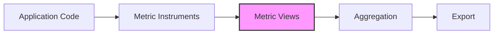
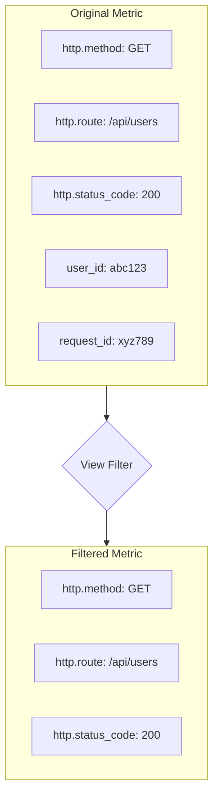
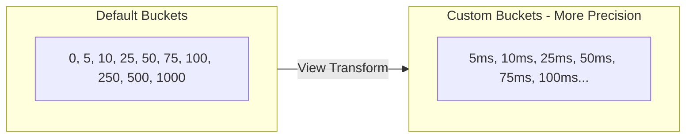
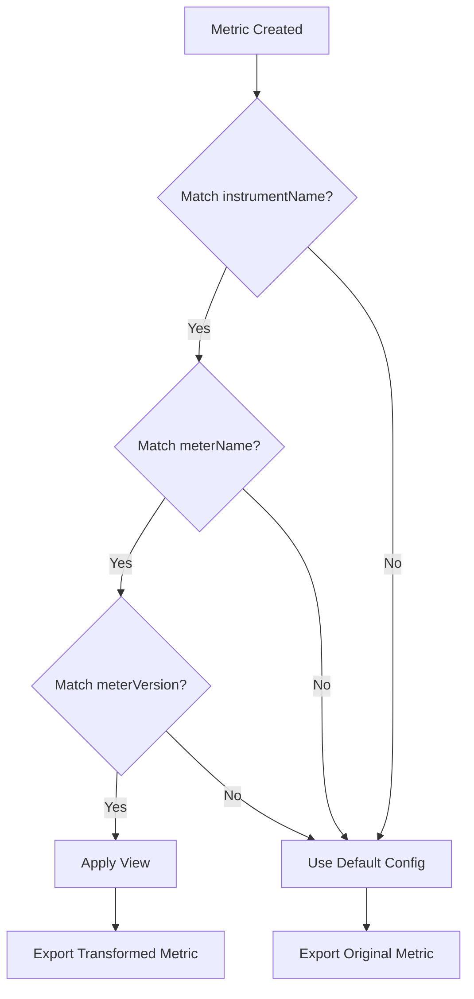

# How to Create OpenTelemetry Metric Views

Author: [nawazdhandala](https://github.com/nawazdhandala)

Tags: OpenTelemetry, Metrics, Observability, Configuration

Description: A comprehensive guide to creating and configuring OpenTelemetry Metric Views. Learn how to filter, transform, and customize your metrics pipeline with practical code examples and best practices.

---

> Metric Views are one of OpenTelemetry's most powerful yet underutilized features. They allow you to customize how metrics are collected, aggregated, and exported without modifying your instrumentation code. Think of views as a filtering and transformation layer between your application and your observability backend.

Whether you need to reduce metric cardinality, change aggregation types, rename metrics, or drop unwanted data entirely, Metric Views give you fine-grained control over your metrics pipeline.

---

## What are Metric Views?

Metric Views in OpenTelemetry are configuration objects that let you customize how metrics are processed before export. They act as middleware in your metrics pipeline, allowing you to:

- **Filter metrics** - Include or exclude specific metrics by name
- **Transform attributes** - Add, remove, or rename metric labels
- **Change aggregation** - Override default aggregation types (e.g., histogram to sum)
- **Modify boundaries** - Customize histogram bucket boundaries
- **Rename metrics** - Change metric names without modifying source code



Views are applied at the MeterProvider level, meaning they affect all metrics from all meters registered with that provider.

---

## Why Use Metric Views?

### 1. Reduce Storage Costs

High cardinality metrics can explode your storage costs. Views let you drop unnecessary attributes or entire metrics without changing application code.

### 2. Standardize Metric Names

Different libraries may use inconsistent naming conventions. Views let you rename metrics to follow your organization's standards.

### 3. Optimize Aggregation

The default histogram boundaries may not suit your use case. Views let you customize bucket boundaries for better precision where it matters.

### 4. Compliance and Privacy

Views can filter out sensitive attributes (like user IDs or IP addresses) before metrics leave your application.

### 5. Vendor-Specific Requirements

Different observability backends have different requirements. Views let you adapt your metrics without changing instrumentation.

---

## Setting Up Metric Views in Node.js

First, install the required OpenTelemetry packages:

```bash
npm install @opentelemetry/api \
            @opentelemetry/sdk-node \
            @opentelemetry/sdk-metrics \
            @opentelemetry/exporter-metrics-otlp-http
```

### Basic View Configuration

The following example shows how to configure a MeterProvider with metric views. Views are defined as an array and applied in order. Each view specifies criteria for matching metrics and the transformations to apply.

```typescript
// telemetry.ts
import { MeterProvider, View, Aggregation } from '@opentelemetry/sdk-metrics';
import { OTLPMetricExporter } from '@opentelemetry/exporter-metrics-otlp-http';
import { PeriodicExportingMetricReader } from '@opentelemetry/sdk-metrics';

// Create the OTLP exporter for OneUptime
const exporter = new OTLPMetricExporter({
  url: 'https://oneuptime.com/otlp/v1/metrics',
  headers: {
    'x-oneuptime-token': process.env.ONEUPTIME_OTLP_TOKEN,
  },
});

// Create a metric reader
const metricReader = new PeriodicExportingMetricReader({
  exporter,
  exportIntervalMillis: 30000,
});

// Create MeterProvider with views
const meterProvider = new MeterProvider({
  readers: [metricReader],
  views: [
    // Your views will be defined here
  ],
});

// Register the MeterProvider globally
import { metrics } from '@opentelemetry/api';
metrics.setGlobalMeterProvider(meterProvider);

console.log('OpenTelemetry metrics with views configured successfully');
```

---

## Common View Patterns

### 1. Filtering Attributes (Reducing Cardinality)

One of the most common use cases is reducing metric cardinality by filtering out high-cardinality attributes. This example removes the `user_id` attribute from all HTTP request metrics.

```typescript
import { MeterProvider, View } from '@opentelemetry/sdk-metrics';

const meterProvider = new MeterProvider({
  readers: [metricReader],
  views: [
    // Remove high-cardinality 'user_id' attribute from HTTP metrics
    new View({
      instrumentName: 'http.server.request.duration',
      // Only keep these attributes, all others are dropped
      attributeKeys: ['http.method', 'http.route', 'http.status_code'],
    }),
  ],
});
```

The `attributeKeys` property acts as an allowlist. Only the specified attributes will be included in the exported metric. All other attributes are automatically dropped.



### 2. Renaming Metrics

If you need to rename metrics to follow organizational conventions or to match backend requirements, use the `name` property in your view.

```typescript
const meterProvider = new MeterProvider({
  readers: [metricReader],
  views: [
    // Rename 'http_request_duration_seconds' to 'http.server.duration'
    new View({
      instrumentName: 'http_request_duration_seconds',
      name: 'http.server.duration',
    }),

    // Rename metrics from a third-party library to match your conventions
    new View({
      instrumentName: 'express_request_total',
      name: 'http.server.requests',
    }),
  ],
});
```

### 3. Customizing Histogram Buckets

Default histogram bucket boundaries may not provide the precision you need. For example, if most of your requests complete under 100ms, the default buckets might not give you useful percentile data in that range.

```typescript
import {
  MeterProvider,
  View,
  ExplicitBucketHistogramAggregation
} from '@opentelemetry/sdk-metrics';

const meterProvider = new MeterProvider({
  readers: [metricReader],
  views: [
    // Custom bucket boundaries for request duration
    // Optimized for sub-second latencies with more granularity under 100ms
    new View({
      instrumentName: 'http.server.request.duration',
      aggregation: new ExplicitBucketHistogramAggregation([
        0.005,  // 5ms
        0.01,   // 10ms
        0.025,  // 25ms
        0.05,   // 50ms
        0.075,  // 75ms
        0.1,    // 100ms
        0.25,   // 250ms
        0.5,    // 500ms
        1,      // 1s
        2.5,    // 2.5s
        5,      // 5s
        10,     // 10s
      ]),
    }),

    // Different buckets for database query duration
    // Optimized for database operations which may be slower
    new View({
      instrumentName: 'db.query.duration',
      aggregation: new ExplicitBucketHistogramAggregation([
        0.001,  // 1ms - very fast queries
        0.005,  // 5ms
        0.01,   // 10ms
        0.05,   // 50ms
        0.1,    // 100ms
        0.5,    // 500ms
        1,      // 1s
        5,      // 5s
        10,     // 10s
        30,     // 30s - very slow queries
      ]),
    }),
  ],
});
```



### 4. Dropping Metrics Entirely

Sometimes you want to completely exclude certain metrics from being exported. This is useful for dropping verbose auto-instrumentation metrics or internal library metrics.

```typescript
import {
  MeterProvider,
  View,
  Aggregation
} from '@opentelemetry/sdk-metrics';

const meterProvider = new MeterProvider({
  readers: [metricReader],
  views: [
    // Drop all metrics from the 'internal' meter
    new View({
      meterName: 'internal-debug-metrics',
      aggregation: Aggregation.Drop(),
    }),

    // Drop a specific metric by name
    new View({
      instrumentName: 'http.client.request.body.size',
      aggregation: Aggregation.Drop(),
    }),

    // Drop metrics using a wildcard pattern
    // Note: Use instrumentName with exact match or meterName for broader filtering
    new View({
      instrumentName: 'process.runtime.nodejs.memory.*',
      aggregation: Aggregation.Drop(),
    }),
  ],
});
```

### 5. Changing Aggregation Types

You can change the aggregation type for metrics. For example, converting a histogram to a sum when you only care about the total, not the distribution.

```typescript
import {
  MeterProvider,
  View,
  Aggregation,
  SumAggregation
} from '@opentelemetry/sdk-metrics';

const meterProvider = new MeterProvider({
  readers: [metricReader],
  views: [
    // Convert histogram to sum - useful when you only need totals
    new View({
      instrumentName: 'http.server.request.duration',
      aggregation: Aggregation.Sum(),
    }),

    // Use last-value aggregation for gauge-like behavior
    new View({
      instrumentName: 'system.cpu.utilization',
      aggregation: Aggregation.LastValue(),
    }),
  ],
});
```

---

## Advanced View Patterns

### Pattern 1: Meter-Scoped Views

Apply views only to metrics from a specific meter. This is useful when you have multiple libraries emitting metrics and want different configurations for each.

```typescript
const meterProvider = new MeterProvider({
  readers: [metricReader],
  views: [
    // Apply only to metrics from 'database-client' meter
    new View({
      meterName: 'database-client',
      instrumentName: 'db.query.duration',
      attributeKeys: ['db.system', 'db.operation', 'db.name'],
    }),

    // Different configuration for 'http-server' meter
    new View({
      meterName: 'http-server',
      instrumentName: 'http.server.request.duration',
      attributeKeys: ['http.method', 'http.route', 'http.status_code'],
    }),
  ],
});
```

### Pattern 2: Version-Specific Views

When dealing with metrics from instrumentation libraries that may change between versions, you can use version matching.

```typescript
const meterProvider = new MeterProvider({
  readers: [metricReader],
  views: [
    // Match a specific version of the meter
    new View({
      meterName: '@opentelemetry/instrumentation-http',
      meterVersion: '0.41.0',
      instrumentName: 'http.server.duration',
      name: 'http.server.request.duration',
    }),
  ],
});
```

### Pattern 3: Combining Multiple Transformations

A single view can combine multiple transformations. This example renames a metric, filters attributes, and changes the aggregation all at once.

```typescript
import {
  MeterProvider,
  View,
  ExplicitBucketHistogramAggregation
} from '@opentelemetry/sdk-metrics';

const meterProvider = new MeterProvider({
  readers: [metricReader],
  views: [
    new View({
      // Match criteria
      instrumentName: 'express.request.duration',
      meterName: 'express-instrumentation',

      // Rename the metric
      name: 'http.server.request.latency',

      // Filter to only these attributes
      attributeKeys: ['method', 'route', 'status'],

      // Custom histogram buckets
      aggregation: new ExplicitBucketHistogramAggregation([
        0.01, 0.05, 0.1, 0.5, 1, 5
      ]),
    }),
  ],
});
```

---

## Production-Ready Configuration

Here is a complete example showing how to configure metric views for a production Node.js application. This configuration handles common scenarios like cardinality reduction, custom buckets, and metric dropping.

```typescript
// telemetry/metrics-config.ts
import { MeterProvider, View, Aggregation, ExplicitBucketHistogramAggregation } from '@opentelemetry/sdk-metrics';
import { OTLPMetricExporter } from '@opentelemetry/exporter-metrics-otlp-http';
import { PeriodicExportingMetricReader } from '@opentelemetry/sdk-metrics';
import { Resource } from '@opentelemetry/resources';
import { SemanticResourceAttributes } from '@opentelemetry/semantic-conventions';
import { metrics } from '@opentelemetry/api';

// Define views as a separate array for better maintainability
const metricViews: View[] = [
  // HTTP Server Metrics - reduce cardinality
  new View({
    instrumentName: 'http.server.request.duration',
    attributeKeys: ['http.method', 'http.route', 'http.status_code'],
    aggregation: new ExplicitBucketHistogramAggregation([
      0.005, 0.01, 0.025, 0.05, 0.1, 0.25, 0.5, 1, 2.5, 5, 10
    ]),
  }),

  // Database Metrics - custom buckets for slower operations
  new View({
    instrumentName: 'db.client.operation.duration',
    attributeKeys: ['db.system', 'db.operation', 'db.name'],
    aggregation: new ExplicitBucketHistogramAggregation([
      0.001, 0.005, 0.01, 0.05, 0.1, 0.5, 1, 5, 10, 30
    ]),
  }),

  // Redis/Cache Metrics - very fast operation buckets
  new View({
    instrumentName: 'cache.operation.duration',
    attributeKeys: ['cache.operation', 'cache.hit'],
    aggregation: new ExplicitBucketHistogramAggregation([
      0.0001, 0.0005, 0.001, 0.005, 0.01, 0.05, 0.1
    ]),
  }),

  // Drop verbose internal metrics
  new View({
    meterName: '@opentelemetry/instrumentation-dns',
    aggregation: Aggregation.Drop(),
  }),

  // Drop request/response body size metrics to save storage
  new View({
    instrumentName: 'http.server.request.body.size',
    aggregation: Aggregation.Drop(),
  }),
  new View({
    instrumentName: 'http.server.response.body.size',
    aggregation: Aggregation.Drop(),
  }),

  // Rename legacy metrics to match new conventions
  new View({
    instrumentName: 'nodejs_eventloop_lag_seconds',
    name: 'process.runtime.nodejs.eventloop.delay',
  }),
];

// Configuration class for clean initialization
export class MetricsConfiguration {
  private meterProvider: MeterProvider | null = null;

  initialize(): void {
    // Validate required environment variables
    if (!process.env.ONEUPTIME_OTLP_TOKEN) {
      console.warn('ONEUPTIME_OTLP_TOKEN not set, metrics will not be exported');
      return;
    }

    // Create the OTLP exporter
    const exporter = new OTLPMetricExporter({
      url: process.env.OTLP_METRICS_ENDPOINT || 'https://oneuptime.com/otlp/v1/metrics',
      headers: {
        'x-oneuptime-token': process.env.ONEUPTIME_OTLP_TOKEN,
      },
      timeoutMillis: 10000,
    });

    // Create the periodic metric reader
    const metricReader = new PeriodicExportingMetricReader({
      exporter,
      exportIntervalMillis: parseInt(process.env.METRICS_EXPORT_INTERVAL || '30000', 10),
      exportTimeoutMillis: 5000,
    });

    // Create the MeterProvider with resource attributes and views
    this.meterProvider = new MeterProvider({
      resource: new Resource({
        [SemanticResourceAttributes.SERVICE_NAME]: process.env.SERVICE_NAME || 'my-service',
        [SemanticResourceAttributes.SERVICE_VERSION]: process.env.SERVICE_VERSION || '1.0.0',
        [SemanticResourceAttributes.DEPLOYMENT_ENVIRONMENT]: process.env.NODE_ENV || 'development',
      }),
      readers: [metricReader],
      views: metricViews,
    });

    // Set as the global meter provider
    metrics.setGlobalMeterProvider(this.meterProvider);

    console.log('Metrics configured with', metricViews.length, 'views');
  }

  async shutdown(): Promise<void> {
    if (this.meterProvider) {
      await this.meterProvider.shutdown();
      console.log('Metrics provider shut down gracefully');
    }
  }
}

// Export a singleton instance
export const metricsConfig = new MetricsConfiguration();
```

### Using the Configuration

```typescript
// index.ts
import { metricsConfig } from './telemetry/metrics-config';

// Initialize metrics before starting your application
metricsConfig.initialize();

// Your application code here
import express from 'express';
const app = express();

// ... routes and middleware

// Graceful shutdown
process.on('SIGTERM', async () => {
  console.log('Received SIGTERM, shutting down gracefully');
  await metricsConfig.shutdown();
  process.exit(0);
});

app.listen(3000, () => {
  console.log('Server running on port 3000');
});
```

---

## View Matching Rules

Understanding how views are matched to metrics is essential for effective configuration.



### Matching Priority

1. **instrumentName** - Matches the metric name (required for most views)
2. **meterName** - Matches the meter that created the metric (optional)
3. **meterVersion** - Matches the version of the meter (optional)
4. **meterSchemaUrl** - Matches the schema URL of the meter (optional)

If multiple views match a single metric, all matching views are applied in order. This allows you to layer transformations.

```typescript
// Both views will be applied to 'http.server.request.duration'
const views = [
  // First: rename the metric
  new View({
    instrumentName: 'http.server.request.duration',
    name: 'http.latency',
  }),
  // Second: filter attributes (applied after rename)
  new View({
    instrumentName: 'http.latency',
    attributeKeys: ['method', 'status'],
  }),
];
```

---

## Debugging Views

When views are not working as expected, use these debugging techniques.

### 1. Enable Debug Logging

```typescript
import { diag, DiagConsoleLogger, DiagLogLevel } from '@opentelemetry/api';

// Enable debug logging to see view matching
diag.setLogger(new DiagConsoleLogger(), DiagLogLevel.DEBUG);
```

### 2. Use Console Exporter for Testing

```typescript
import { ConsoleMetricExporter } from '@opentelemetry/sdk-metrics';

// Use console exporter to see what metrics are being exported
const consoleExporter = new ConsoleMetricExporter();

const meterProvider = new MeterProvider({
  readers: [
    new PeriodicExportingMetricReader({
      exporter: consoleExporter,
      exportIntervalMillis: 5000,
    }),
  ],
  views: metricViews,
});
```

### 3. Verify View Configuration

```typescript
// Log view configuration at startup
metricViews.forEach((view, index) => {
  console.log(`View ${index}:`, {
    instrumentName: view.instrumentSelector?.name,
    meterName: view.meterSelector?.name,
    newName: view.name,
    attributeKeys: view.attributeKeys,
  });
});
```

---

## Best Practices

### 1. Start with Attribute Filtering

The most impactful use of views is reducing cardinality by filtering attributes. Start here before implementing more complex transformations.

```typescript
// Always define which attributes you need, drop the rest
new View({
  instrumentName: '*',
  attributeKeys: ['service', 'operation', 'status'],
})
```

### 2. Use Descriptive Metric Names

When renaming metrics, follow OpenTelemetry semantic conventions:

```typescript
// Good: follows semantic conventions
new View({
  instrumentName: 'request_duration',
  name: 'http.server.request.duration',
})

// Avoid: non-standard naming
new View({
  instrumentName: 'request_duration',
  name: 'reqDur',
})
```

### 3. Document Your Views

Keep a record of what each view does and why it exists:

```typescript
const views = [
  // CARDINALITY: Remove user_id to prevent storage explosion
  // Ticket: OBS-1234
  new View({
    instrumentName: 'http.server.request.duration',
    attributeKeys: ['method', 'route', 'status'],
  }),

  // COMPLIANCE: Remove IP addresses for GDPR compliance
  // Approved by: Security Team
  new View({
    instrumentName: 'http.server.active_requests',
    attributeKeys: ['route'],
  }),
];
```

### 4. Test Views in Development

Verify your views work correctly in development before deploying to production:

```typescript
// test/views.test.ts
import { MeterProvider, View } from '@opentelemetry/sdk-metrics';
import { InMemoryMetricExporter } from '@opentelemetry/sdk-metrics';

describe('Metric Views', () => {
  it('should filter http attributes correctly', async () => {
    const exporter = new InMemoryMetricExporter();
    const meterProvider = new MeterProvider({
      readers: [/* ... */],
      views: [
        new View({
          instrumentName: 'http.server.request.duration',
          attributeKeys: ['method', 'status'],
        }),
      ],
    });

    const meter = meterProvider.getMeter('test');
    const histogram = meter.createHistogram('http.server.request.duration');

    // Record with extra attributes
    histogram.record(0.1, {
      method: 'GET',
      status: '200',
      user_id: 'should-be-dropped'
    });

    // Force export and verify
    await meterProvider.forceFlush();
    const metrics = exporter.getMetrics();

    // Assert user_id was dropped
    expect(metrics[0].attributes).not.toHaveProperty('user_id');
  });
});
```

### 5. Monitor View Impact

Track the impact of your views on metric volume:

```typescript
// Create a metric to track filtered attributes
const meter = metrics.getMeter('view-metrics');
const droppedAttributes = meter.createCounter('otel.view.attributes.dropped', {
  description: 'Count of attributes dropped by views',
});

// Log periodically
setInterval(() => {
  console.log('Metric views active:', metricViews.length);
}, 60000);
```

---

## Common Mistakes to Avoid

### 1. Overly Broad View Matching

```typescript
// Bad: affects ALL metrics from ALL meters
new View({
  instrumentName: '*',
  aggregation: Aggregation.Drop(),
})

// Good: be specific about what you want to drop
new View({
  meterName: 'debug-metrics',
  instrumentName: 'internal.*',
  aggregation: Aggregation.Drop(),
})
```

### 2. Forgetting View Order Matters

Views are applied in the order they are defined. Put more specific views first.

```typescript
// Correct order: specific views first
const views = [
  // Specific: only affects 'api' routes
  new View({
    instrumentName: 'http.server.request.duration',
    meterName: 'api-server',
    attributeKeys: ['method', 'route', 'status', 'version'],
  }),
  // General: affects all other http metrics
  new View({
    instrumentName: 'http.server.request.duration',
    attributeKeys: ['method', 'status'],
  }),
];
```

### 3. Not Testing Bucket Boundaries

Custom histogram buckets that do not match your actual data distribution provide no value.

```typescript
// Bad: buckets too large for sub-millisecond operations
new View({
  instrumentName: 'cache.get.duration',
  aggregation: new ExplicitBucketHistogramAggregation([
    1, 5, 10, 50, 100  // seconds - way too large for cache ops
  ]),
})

// Good: appropriate buckets for fast cache operations
new View({
  instrumentName: 'cache.get.duration',
  aggregation: new ExplicitBucketHistogramAggregation([
    0.0001, 0.0005, 0.001, 0.005, 0.01  // 0.1ms to 10ms range
  ]),
})
```

---

## Final Thoughts

OpenTelemetry Metric Views are a powerful tool for customizing your metrics pipeline without modifying application code. They give you control over:

- **What metrics are exported** (filtering and dropping)
- **How metrics are named** (renaming for consistency)
- **What attributes are included** (cardinality management)
- **How values are aggregated** (custom buckets and aggregation types)

Start with simple attribute filtering to reduce cardinality, then expand to more advanced patterns as needed. Remember that views are applied at the SDK level, so changes take effect immediately without code deployments.

> Views transform raw instrumentation into actionable, cost-effective observability data. Use them wisely to get the metrics you need without the overhead you do not.

---

*Ready to put your OpenTelemetry metrics to work? [OneUptime](https://oneuptime.com) provides native OpenTelemetry support with powerful dashboards, alerting, and correlation with traces and logs. Your metric views will work seamlessly with the OneUptime OTLP endpoint.*

**Related Reading:**

- [What are Metrics in OpenTelemetry?](https://oneuptime.com/blog/post/2025-08-26-what-are-metrics-in-opentelemetry/view)
- [How to Reduce Noise in OpenTelemetry](https://oneuptime.com/blog/post/2025-08-25-how-to-reduce-noise-in-opentelemetry/view)
- [How to Collect OpenTelemetry Collector Internal Metrics](https://oneuptime.com/blog/post/2025-01-22-how-to-collect-opentelemetry-collector-internal-metrics/view)
