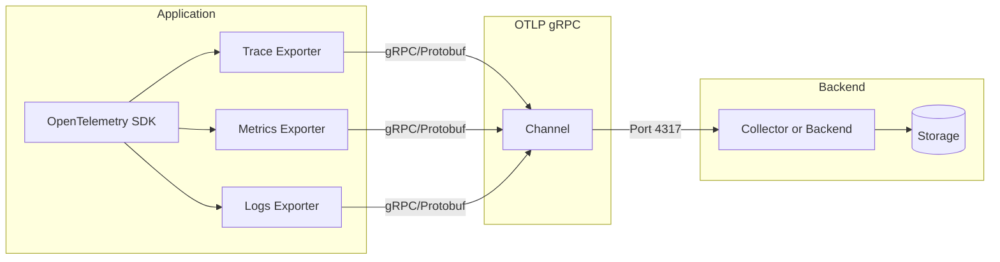
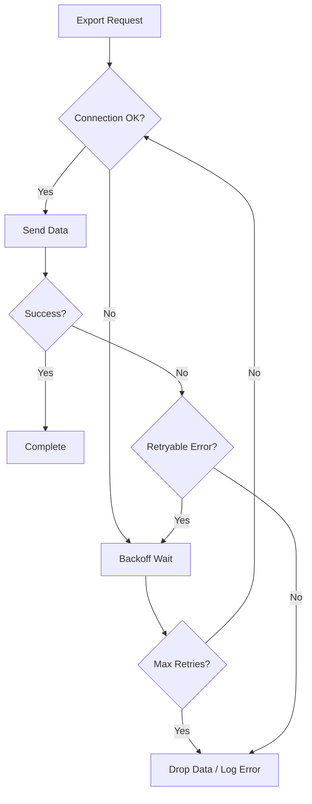

# How to Implement OpenTelemetry OTLP gRPC Exporter

Author: [nawazdhandala](https://github.com/nawazdhandala)

Tags: OpenTelemetry, Observability, gRPC, OTLP

Description: A practical guide to implementing the OpenTelemetry OTLP gRPC exporter for traces, metrics, and logs in your applications.

---

The OpenTelemetry Protocol (OTLP) is the native protocol for transmitting telemetry data in OpenTelemetry. While OTLP supports both HTTP and gRPC transports, gRPC offers significant advantages for high-throughput production environments: binary encoding, multiplexed connections, and bidirectional streaming. This guide walks through implementing the OTLP gRPC exporter for traces, metrics, and logs.

## Why Choose OTLP gRPC Over HTTP

Before diving into implementation, understand when gRPC is the right choice.

| Aspect | OTLP gRPC | OTLP HTTP |
|--------|-----------|-----------|
| **Encoding** | Protocol Buffers (binary) | JSON or Protobuf |
| **Performance** | Higher throughput, lower latency | Good for moderate loads |
| **Connection** | Persistent, multiplexed | Connection per request |
| **Compression** | Built-in gzip support | Optional |
| **Firewall Compatibility** | Requires HTTP/2 support | Works with any HTTP proxy |
| **Browser Support** | Not supported | Supported |
| **Best For** | Backend services, high volume | Web apps, restricted networks |

Choose gRPC when you control both ends of the connection and need maximum performance. Choose HTTP when working with restrictive firewalls or browser-based applications.

## Architecture Overview

The following diagram shows how telemetry flows from your application through the OTLP gRPC exporter to your observability backend.



## Node.js Implementation

### Installation

Install the required OpenTelemetry packages for gRPC export.

```bash
npm install @opentelemetry/api \
  @opentelemetry/sdk-node \
  @opentelemetry/exporter-trace-otlp-grpc \
  @opentelemetry/exporter-metrics-otlp-grpc \
  @opentelemetry/exporter-logs-otlp-grpc \
  @opentelemetry/sdk-trace-node \
  @opentelemetry/sdk-metrics \
  @opentelemetry/sdk-logs \
  @opentelemetry/resources \
  @opentelemetry/semantic-conventions \
  @grpc/grpc-js
```

### Basic Setup

Create a telemetry initialization file that configures all three signal types (traces, metrics, logs) with gRPC exporters. This file must be loaded before any other application code.

```typescript
// telemetry.ts
import { NodeSDK } from '@opentelemetry/sdk-node';
import { OTLPTraceExporter } from '@opentelemetry/exporter-trace-otlp-grpc';
import { OTLPMetricExporter } from '@opentelemetry/exporter-metrics-otlp-grpc';
import { OTLPLogExporter } from '@opentelemetry/exporter-logs-otlp-grpc';
import { PeriodicExportingMetricReader } from '@opentelemetry/sdk-metrics';
import { BatchLogRecordProcessor } from '@opentelemetry/sdk-logs';
import { Resource } from '@opentelemetry/resources';
import { SemanticResourceAttributes } from '@opentelemetry/semantic-conventions';
import { credentials } from '@grpc/grpc-js';

// Define service identity - appears in all telemetry
const resource = new Resource({
  [SemanticResourceAttributes.SERVICE_NAME]: process.env.SERVICE_NAME || 'my-service',
  [SemanticResourceAttributes.SERVICE_VERSION]: process.env.SERVICE_VERSION || '1.0.0',
  [SemanticResourceAttributes.DEPLOYMENT_ENVIRONMENT]: process.env.NODE_ENV || 'development',
});

// gRPC endpoint - typically port 4317
const grpcEndpoint = process.env.OTEL_EXPORTER_OTLP_ENDPOINT || 'localhost:4317';

// Configure trace exporter with gRPC
const traceExporter = new OTLPTraceExporter({
  url: grpcEndpoint,
  credentials: credentials.createInsecure(), // Use createSsl() for TLS
});

// Configure metrics exporter with gRPC
const metricExporter = new OTLPMetricExporter({
  url: grpcEndpoint,
  credentials: credentials.createInsecure(),
});

// Configure logs exporter with gRPC
const logExporter = new OTLPLogExporter({
  url: grpcEndpoint,
  credentials: credentials.createInsecure(),
});

// Initialize the SDK with all exporters
const sdk = new NodeSDK({
  resource,
  traceExporter,
  metricReader: new PeriodicExportingMetricReader({
    exporter: metricExporter,
    exportIntervalMillis: 30000, // Export metrics every 30 seconds
  }),
  logRecordProcessor: new BatchLogRecordProcessor(logExporter),
});

// Start the SDK
sdk.start();

// Graceful shutdown
process.on('SIGTERM', () => {
  sdk.shutdown()
    .then(() => console.log('Telemetry shut down'))
    .catch((err) => console.error('Error shutting down telemetry', err))
    .finally(() => process.exit(0));
});

export { sdk };
```

### Loading Order

Import the telemetry module at the very beginning of your application entry point.

```typescript
// index.ts
import './telemetry'; // Must be first!

import express from 'express';
// ... rest of your imports
```

## Python Implementation

### Installation

Install the OpenTelemetry packages for Python with gRPC support.

```bash
pip install opentelemetry-api \
  opentelemetry-sdk \
  opentelemetry-exporter-otlp-proto-grpc \
  grpcio
```

### Basic Setup

Create a telemetry configuration module that sets up gRPC exporters for all signal types.

```python
# telemetry.py
import os
import atexit
from opentelemetry import trace, metrics
from opentelemetry.sdk.trace import TracerProvider
from opentelemetry.sdk.trace.export import BatchSpanProcessor
from opentelemetry.sdk.metrics import MeterProvider
from opentelemetry.sdk.metrics.export import PeriodicExportingMetricReader
from opentelemetry.sdk.resources import Resource, SERVICE_NAME, SERVICE_VERSION
from opentelemetry.exporter.otlp.proto.grpc.trace_exporter import OTLPSpanExporter
from opentelemetry.exporter.otlp.proto.grpc.metric_exporter import OTLPMetricExporter

# Define service resource
resource = Resource.create({
    SERVICE_NAME: os.getenv("SERVICE_NAME", "python-service"),
    SERVICE_VERSION: os.getenv("SERVICE_VERSION", "1.0.0"),
})

# gRPC endpoint
grpc_endpoint = os.getenv("OTEL_EXPORTER_OTLP_ENDPOINT", "localhost:4317")

# Configure trace exporter
trace_exporter = OTLPSpanExporter(
    endpoint=grpc_endpoint,
    insecure=True,  # Set to False for TLS
)

# Configure metrics exporter
metric_exporter = OTLPMetricExporter(
    endpoint=grpc_endpoint,
    insecure=True,
)

# Set up TracerProvider with batch processor
tracer_provider = TracerProvider(resource=resource)
tracer_provider.add_span_processor(BatchSpanProcessor(trace_exporter))
trace.set_tracer_provider(tracer_provider)

# Set up MeterProvider with periodic reader
meter_provider = MeterProvider(
    resource=resource,
    metric_readers=[
        PeriodicExportingMetricReader(
            metric_exporter,
            export_interval_millis=30000,
        )
    ],
)
metrics.set_meter_provider(meter_provider)

# Graceful shutdown
def shutdown():
    tracer_provider.shutdown()
    meter_provider.shutdown()

atexit.register(shutdown)
```

### Usage Example

Import the telemetry module at application startup and create spans for your operations.

```python
# app.py
import telemetry  # Initialize telemetry first

from flask import Flask
from opentelemetry import trace

app = Flask(__name__)
tracer = trace.get_tracer(__name__)

@app.route("/api/orders")
def get_orders():
    with tracer.start_as_current_span("fetch-orders") as span:
        span.set_attribute("order.type", "all")
        # Your business logic here
        return {"orders": []}
```

## Go Implementation

### Installation

Add the required OpenTelemetry modules to your Go project.

```bash
go get go.opentelemetry.io/otel \
  go.opentelemetry.io/otel/sdk/trace \
  go.opentelemetry.io/otel/sdk/metric \
  go.opentelemetry.io/otel/exporters/otlp/otlptrace/otlptracegrpc \
  go.opentelemetry.io/otel/exporters/otlp/otlpmetric/otlpmetricgrpc \
  google.golang.org/grpc
```

### Basic Setup

Create a telemetry initialization function that configures gRPC exporters.

```go
// telemetry.go
package main

import (
    "context"
    "log"
    "os"
    "time"

    "go.opentelemetry.io/otel"
    "go.opentelemetry.io/otel/exporters/otlp/otlpmetric/otlpmetricgrpc"
    "go.opentelemetry.io/otel/exporters/otlp/otlptrace/otlptracegrpc"
    "go.opentelemetry.io/otel/sdk/metric"
    "go.opentelemetry.io/otel/sdk/resource"
    "go.opentelemetry.io/otel/sdk/trace"
    semconv "go.opentelemetry.io/otel/semconv/v1.21.0"
    "google.golang.org/grpc"
    "google.golang.org/grpc/credentials/insecure"
)

func initTelemetry(ctx context.Context) (func(), error) {
    endpoint := os.Getenv("OTEL_EXPORTER_OTLP_ENDPOINT")
    if endpoint == "" {
        endpoint = "localhost:4317"
    }

    // Create gRPC connection
    conn, err := grpc.DialContext(ctx, endpoint,
        grpc.WithTransportCredentials(insecure.NewCredentials()),
        grpc.WithBlock(),
    )
    if err != nil {
        return nil, err
    }

    // Define service resource
    res, err := resource.New(ctx,
        resource.WithAttributes(
            semconv.ServiceName(os.Getenv("SERVICE_NAME")),
            semconv.ServiceVersion("1.0.0"),
        ),
    )
    if err != nil {
        return nil, err
    }

    // Configure trace exporter
    traceExporter, err := otlptracegrpc.New(ctx, otlptracegrpc.WithGRPCConn(conn))
    if err != nil {
        return nil, err
    }

    // Configure tracer provider
    tracerProvider := trace.NewTracerProvider(
        trace.WithBatcher(traceExporter),
        trace.WithResource(res),
    )
    otel.SetTracerProvider(tracerProvider)

    // Configure metrics exporter
    metricExporter, err := otlpmetricgrpc.New(ctx, otlpmetricgrpc.WithGRPCConn(conn))
    if err != nil {
        return nil, err
    }

    // Configure meter provider
    meterProvider := metric.NewMeterProvider(
        metric.WithReader(metric.NewPeriodicReader(metricExporter,
            metric.WithInterval(30*time.Second),
        )),
        metric.WithResource(res),
    )
    otel.SetMeterProvider(meterProvider)

    // Return shutdown function
    return func() {
        ctx, cancel := context.WithTimeout(context.Background(), 5*time.Second)
        defer cancel()
        if err := tracerProvider.Shutdown(ctx); err != nil {
            log.Printf("Error shutting down tracer: %v", err)
        }
        if err := meterProvider.Shutdown(ctx); err != nil {
            log.Printf("Error shutting down meter: %v", err)
        }
        conn.Close()
    }, nil
}
```

### Usage in Main

Initialize telemetry at application startup.

```go
// main.go
package main

import (
    "context"
    "log"
    "net/http"

    "go.opentelemetry.io/otel"
)

func main() {
    ctx := context.Background()

    shutdown, err := initTelemetry(ctx)
    if err != nil {
        log.Fatalf("Failed to initialize telemetry: %v", err)
    }
    defer shutdown()

    tracer := otel.Tracer("my-service")

    http.HandleFunc("/api/orders", func(w http.ResponseWriter, r *http.Request) {
        ctx, span := tracer.Start(r.Context(), "handle-orders")
        defer span.End()

        // Your business logic here
        _ = ctx
        w.Write([]byte(`{"orders": []}`))
    })

    log.Fatal(http.ListenAndServe(":8080", nil))
}
```

## Configuring TLS for Production

In production environments, always use TLS to encrypt telemetry data in transit. Here is how to configure TLS for each language.

### Node.js with TLS

Load your certificates and create secure credentials.

```typescript
import { credentials } from '@grpc/grpc-js';
import * as fs from 'fs';

// Load certificates
const rootCert = fs.readFileSync('/path/to/ca.crt');
const clientCert = fs.readFileSync('/path/to/client.crt');
const clientKey = fs.readFileSync('/path/to/client.key');

// Create secure credentials
const secureCredentials = credentials.createSsl(
  rootCert,
  clientKey,
  clientCert
);

const traceExporter = new OTLPTraceExporter({
  url: 'otel-collector.example.com:4317',
  credentials: secureCredentials,
});
```

### Python with TLS

Configure the exporter with certificate paths.

```python
from opentelemetry.exporter.otlp.proto.grpc.trace_exporter import OTLPSpanExporter

trace_exporter = OTLPSpanExporter(
    endpoint="otel-collector.example.com:4317",
    insecure=False,
    credentials=grpc.ssl_channel_credentials(
        root_certificates=open("/path/to/ca.crt", "rb").read(),
        private_key=open("/path/to/client.key", "rb").read(),
        certificate_chain=open("/path/to/client.crt", "rb").read(),
    ),
)
```

### Go with TLS

Create TLS credentials from certificate files.

```go
import (
    "crypto/tls"
    "crypto/x509"
    "os"

    "google.golang.org/grpc/credentials"
)

func createTLSCredentials() (credentials.TransportCredentials, error) {
    caCert, err := os.ReadFile("/path/to/ca.crt")
    if err != nil {
        return nil, err
    }

    certPool := x509.NewCertPool()
    certPool.AppendCertsFromPEM(caCert)

    clientCert, err := tls.LoadX509KeyPair("/path/to/client.crt", "/path/to/client.key")
    if err != nil {
        return nil, err
    }

    config := &tls.Config{
        RootCAs:      certPool,
        Certificates: []tls.Certificate{clientCert},
    }

    return credentials.NewTLS(config), nil
}
```

## Adding Custom Headers for Authentication

Many observability backends require authentication tokens. Add custom headers to your gRPC metadata.

### Node.js Headers

Use the metadata option to include authentication headers.

```typescript
import { Metadata } from '@grpc/grpc-js';

const metadata = new Metadata();
metadata.set('x-oneuptime-token', process.env.ONEUPTIME_TOKEN || '');

const traceExporter = new OTLPTraceExporter({
  url: grpcEndpoint,
  credentials: credentials.createInsecure(),
  metadata: metadata,
});
```

### Python Headers

Pass headers as a tuple of key-value pairs.

```python
trace_exporter = OTLPSpanExporter(
    endpoint=grpc_endpoint,
    insecure=True,
    headers=(
        ("x-oneuptime-token", os.getenv("ONEUPTIME_TOKEN", "")),
    ),
)
```

### Go Headers

Use the WithHeaders option when creating the exporter.

```go
traceExporter, err := otlptracegrpc.New(ctx,
    otlptracegrpc.WithGRPCConn(conn),
    otlptracegrpc.WithHeaders(map[string]string{
        "x-oneuptime-token": os.Getenv("ONEUPTIME_TOKEN"),
    }),
)
```

## Compression Configuration

Enable gzip compression to reduce bandwidth usage. This is especially beneficial for high-volume telemetry.

### Node.js Compression

```typescript
import { CompressionAlgorithm } from '@opentelemetry/otlp-exporter-base';

const traceExporter = new OTLPTraceExporter({
  url: grpcEndpoint,
  compression: CompressionAlgorithm.GZIP,
});
```

### Python Compression

```python
from opentelemetry.exporter.otlp.proto.grpc.trace_exporter import OTLPSpanExporter, Compression

trace_exporter = OTLPSpanExporter(
    endpoint=grpc_endpoint,
    compression=Compression.Gzip,
)
```

### Go Compression

```go
traceExporter, err := otlptracegrpc.New(ctx,
    otlptracegrpc.WithGRPCConn(conn),
    otlptracegrpc.WithCompressor("gzip"),
)
```

## Connection Management and Retries

The gRPC exporter handles connection management automatically, but you can tune retry behavior for reliability.

### Retry Configuration Flow



### Node.js Retry Configuration

Configure the batch span processor for retry behavior.

```typescript
import { BatchSpanProcessor } from '@opentelemetry/sdk-trace-base';

const spanProcessor = new BatchSpanProcessor(traceExporter, {
  maxQueueSize: 2048,           // Max spans in queue before dropping
  maxExportBatchSize: 512,      // Max spans per export batch
  scheduledDelayMillis: 5000,   // Delay between exports
  exportTimeoutMillis: 30000,   // Timeout for each export
});
```

## Sending to OneUptime

Configure the OTLP gRPC exporter to send telemetry directly to OneUptime.

```typescript
// OneUptime OTLP gRPC configuration
const traceExporter = new OTLPTraceExporter({
  url: process.env.ONEUPTIME_OTLP_ENDPOINT || 'otlp.oneuptime.com:4317',
  credentials: credentials.createSsl(), // OneUptime requires TLS
  metadata: (() => {
    const meta = new Metadata();
    meta.set('x-oneuptime-token', process.env.ONEUPTIME_TOKEN || '');
    return meta;
  })(),
});
```

## Troubleshooting Common Issues

### Connection Refused

If you see "connection refused" errors, verify the endpoint and port.

```bash
# Test gRPC connectivity
grpcurl -plaintext localhost:4317 list

# Check if collector is listening
netstat -an | grep 4317
```

### TLS Handshake Failures

Ensure certificates are valid and properly configured.

```bash
# Verify certificate chain
openssl verify -CAfile ca.crt client.crt

# Test TLS connection
openssl s_client -connect otel-collector.example.com:4317
```

### High Memory Usage

If the exporter queue grows unbounded, tune batch settings.

```typescript
// Reduce queue size and export more frequently
const spanProcessor = new BatchSpanProcessor(traceExporter, {
  maxQueueSize: 512,            // Lower queue size
  maxExportBatchSize: 128,      // Smaller batches
  scheduledDelayMillis: 1000,   // Export more frequently
});
```

## Summary

| Configuration | Recommendation |
|---------------|----------------|
| **Transport** | gRPC for backend services, HTTP for browsers/restricted networks |
| **Port** | 4317 (gRPC) vs 4318 (HTTP) |
| **TLS** | Always in production |
| **Compression** | Enable gzip for high-volume workloads |
| **Batch Size** | 512 spans per batch (default) |
| **Export Interval** | 5 seconds for traces, 30 seconds for metrics |
| **Queue Size** | 2048 (tune based on memory constraints) |

The OTLP gRPC exporter provides the highest performance path for sending telemetry to your observability backend. Combined with proper batching, compression, and TLS configuration, it handles production workloads efficiently while maintaining data integrity.

---

**Related Reading:**

- [Traces and Spans in OpenTelemetry](https://oneuptime.com/blog/post/2025-08-27-traces-and-spans-in-opentelemetry/view)
- [OpenTelemetry Collector: When You Need It](https://oneuptime.com/blog/post/2025-09-18-what-is-opentelemetry-collector-and-why-use-one/view)
- [How to Structure Logs Properly in OpenTelemetry](https://oneuptime.com/blog/post/2025-08-28-how-to-structure-logs-properly-in-opentelemetry/view)
