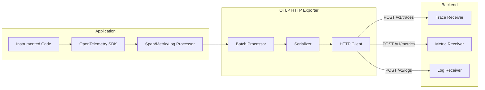
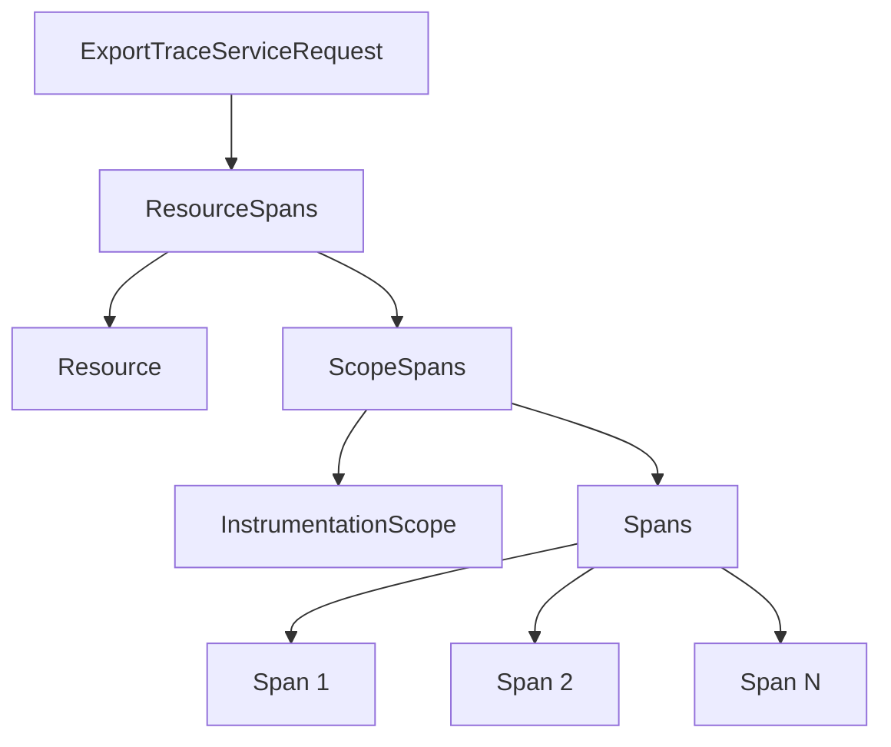
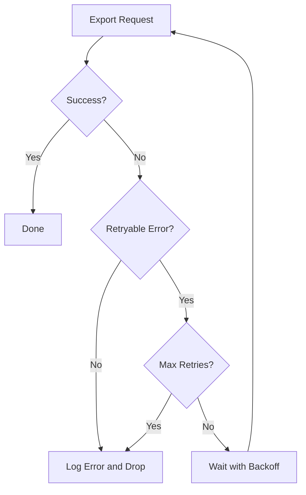

# How to Build OpenTelemetry OTLP HTTP Exporter

Author: [nawazdhandala](https://github.com/nawazdhandala)

Tags: OpenTelemetry, Observability, OTLP, Telemetry

Description: A step-by-step guide to building a custom OpenTelemetry OTLP HTTP exporter for sending traces, metrics, and logs to any backend.

---

> The OTLP HTTP exporter is the bridge between your instrumented application and your observability backend. Understanding how to build one gives you complete control over your telemetry pipeline.

OpenTelemetry Protocol (OTLP) is the native protocol for transmitting telemetry data in OpenTelemetry. While official SDKs provide ready-to-use exporters, building your own OTLP HTTP exporter helps you understand the protocol deeply and allows for custom implementations tailored to your specific needs.

This guide walks you through building an OTLP HTTP exporter from scratch, covering the protocol specification, data serialization, error handling, and production-ready patterns.

---

## Table of Contents

1. What is OTLP?
2. OTLP HTTP Protocol Overview
3. Data Flow Architecture
4. Building the Exporter Core
5. Implementing Trace Export
6. Implementing Metrics Export
7. Implementing Logs Export
8. Retry Logic and Error Handling
9. Compression and Performance
10. Testing Your Exporter
11. Production Considerations
12. Complete Implementation

---

## 1. What is OTLP?

OTLP (OpenTelemetry Protocol) is the standard protocol for transmitting telemetry data between OpenTelemetry components. It supports three transport mechanisms:

| Transport | Port | Use Case |
|-----------|------|----------|
| gRPC | 4317 | High-performance, bidirectional streaming |
| HTTP/protobuf | 4318 | Firewall-friendly, binary encoding |
| HTTP/JSON | 4318 | Human-readable, debugging-friendly |

For this guide, we focus on HTTP/JSON since it is the most accessible and debuggable format.

---

## 2. OTLP HTTP Protocol Overview

The OTLP HTTP specification defines three endpoints for the three telemetry signals:

```
POST /v1/traces   - Export trace spans
POST /v1/metrics  - Export metric data points
POST /v1/logs     - Export log records
```

Each request requires specific headers and follows a defined payload structure.

The required headers for OTLP HTTP requests are:

```
Content-Type: application/json
```

For authenticated endpoints (like OneUptime), you also need an authorization header:

```
x-oneuptime-token: your-service-token
```

---

## 3. Data Flow Architecture

The following diagram shows how telemetry data flows from your application through the OTLP HTTP exporter to the observability backend:



The exporter collects telemetry data, batches it for efficiency, serializes it to the OTLP format, and sends it via HTTP to the backend endpoints.

---

## 4. Building the Exporter Core

Let's start by building the core exporter class that handles HTTP communication. This base class manages the connection, headers, and basic HTTP operations.

```typescript
// otlp-http-exporter.ts
import https from 'https';
import http from 'http';
import zlib from 'zlib';

interface ExporterConfig {
  endpoint: string;
  headers?: Record<string, string>;
  timeout?: number;
  compression?: 'gzip' | 'none';
}

interface ExportResult {
  success: boolean;
  statusCode?: number;
  error?: Error;
  retryAfter?: number;
}

export class OTLPHttpExporter {
  private endpoint: URL;
  private headers: Record<string, string>;
  private timeout: number;
  private compression: 'gzip' | 'none';

  constructor(config: ExporterConfig) {
    this.endpoint = new URL(config.endpoint);
    this.headers = {
      'Content-Type': 'application/json',
      ...config.headers,
    };
    this.timeout = config.timeout || 30000;
    this.compression = config.compression || 'none';
  }

  protected async sendRequest(path: string, payload: object): Promise<ExportResult> {
    const url = new URL(path, this.endpoint);
    const jsonPayload = JSON.stringify(payload);

    // Apply compression if enabled
    const body = this.compression === 'gzip'
      ? await this.compress(jsonPayload)
      : Buffer.from(jsonPayload);

    const headers = {
      ...this.headers,
      'Content-Length': body.length.toString(),
      ...(this.compression === 'gzip' && { 'Content-Encoding': 'gzip' }),
    };

    return new Promise((resolve) => {
      const client = url.protocol === 'https:' ? https : http;

      const req = client.request(
        {
          hostname: url.hostname,
          port: url.port || (url.protocol === 'https:' ? 443 : 80),
          path: url.pathname,
          method: 'POST',
          headers,
          timeout: this.timeout,
        },
        (res) => {
          let responseBody = '';
          res.on('data', (chunk) => { responseBody += chunk; });
          res.on('end', () => {
            const statusCode = res.statusCode || 0;

            if (statusCode >= 200 && statusCode < 300) {
              resolve({ success: true, statusCode });
            } else if (statusCode === 429 || statusCode >= 500) {
              // Retryable errors
              const retryAfter = parseInt(res.headers['retry-after'] as string) || undefined;
              resolve({
                success: false,
                statusCode,
                retryAfter,
                error: new Error(`Export failed with status ${statusCode}: ${responseBody}`)
              });
            } else {
              // Non-retryable errors
              resolve({
                success: false,
                statusCode,
                error: new Error(`Export failed with status ${statusCode}: ${responseBody}`)
              });
            }
          });
        }
      );

      req.on('error', (error) => {
        resolve({ success: false, error });
      });

      req.on('timeout', () => {
        req.destroy();
        resolve({ success: false, error: new Error('Request timeout') });
      });

      req.write(body);
      req.end();
    });
  }

  private compress(data: string): Promise<Buffer> {
    return new Promise((resolve, reject) => {
      zlib.gzip(Buffer.from(data), (err, result) => {
        if (err) reject(err);
        else resolve(result);
      });
    });
  }
}
```

---

## 5. Implementing Trace Export

Traces in OTLP are structured as ResourceSpans, which contain ScopeSpans, which contain individual Spans. Here is the hierarchy:



The trace exporter extends the base class to handle span serialization and export.

```typescript
// trace-exporter.ts
import { OTLPHttpExporter } from './otlp-http-exporter';

interface SpanContext {
  traceId: string;
  spanId: string;
  traceFlags: number;
}

interface SpanAttribute {
  key: string;
  value: {
    stringValue?: string;
    intValue?: number;
    boolValue?: boolean;
    doubleValue?: number;
    arrayValue?: { values: SpanAttribute['value'][] };
  };
}

interface SpanEvent {
  name: string;
  timeUnixNano: string;
  attributes?: SpanAttribute[];
}

interface Span {
  traceId: string;
  spanId: string;
  parentSpanId?: string;
  name: string;
  kind: number;
  startTimeUnixNano: string;
  endTimeUnixNano: string;
  attributes?: SpanAttribute[];
  events?: SpanEvent[];
  status?: {
    code: number;
    message?: string;
  };
}

interface Resource {
  attributes: SpanAttribute[];
}

interface InstrumentationScope {
  name: string;
  version?: string;
}

export class OTLPTraceExporter extends OTLPHttpExporter {
  private serviceName: string;
  private serviceVersion: string;

  constructor(config: {
    endpoint: string;
    serviceName: string;
    serviceVersion?: string;
    headers?: Record<string, string>;
  }) {
    super({
      endpoint: config.endpoint,
      headers: config.headers,
    });
    this.serviceName = config.serviceName;
    this.serviceVersion = config.serviceVersion || '1.0.0';
  }

  async exportSpans(spans: Span[]): Promise<void> {
    if (spans.length === 0) return;

    const payload = this.buildTracePayload(spans);
    const result = await this.sendRequest('/v1/traces', payload);

    if (!result.success) {
      throw result.error || new Error('Export failed');
    }
  }

  private buildTracePayload(spans: Span[]) {
    const resource: Resource = {
      attributes: [
        { key: 'service.name', value: { stringValue: this.serviceName } },
        { key: 'service.version', value: { stringValue: this.serviceVersion } },
      ],
    };

    const scope: InstrumentationScope = {
      name: 'custom-otlp-exporter',
      version: '1.0.0',
    };

    return {
      resourceSpans: [
        {
          resource,
          scopeSpans: [
            {
              scope,
              spans: spans.map(span => ({
                ...span,
                // Ensure trace and span IDs are hex-encoded
                traceId: this.ensureHex(span.traceId, 32),
                spanId: this.ensureHex(span.spanId, 16),
                parentSpanId: span.parentSpanId
                  ? this.ensureHex(span.parentSpanId, 16)
                  : undefined,
              })),
            },
          ],
        },
      ],
    };
  }

  private ensureHex(value: string, length: number): string {
    // Pad with zeros if needed
    return value.padStart(length, '0').slice(-length);
  }
}
```

Here is an example of how to use the trace exporter to send spans to OneUptime:

```typescript
// Usage example
const traceExporter = new OTLPTraceExporter({
  endpoint: 'https://oneuptime.com/otlp',
  serviceName: 'my-service',
  serviceVersion: '2.1.0',
  headers: {
    'x-oneuptime-token': process.env.ONEUPTIME_TOKEN || '',
  },
});

// Export a span
await traceExporter.exportSpans([
  {
    traceId: 'a1b2c3d4e5f6a1b2c3d4e5f6a1b2c3d4',
    spanId: '1234567890abcdef',
    name: 'HTTP GET /api/users',
    kind: 2, // SERVER
    startTimeUnixNano: String(Date.now() * 1_000_000),
    endTimeUnixNano: String((Date.now() + 150) * 1_000_000),
    attributes: [
      { key: 'http.method', value: { stringValue: 'GET' } },
      { key: 'http.status_code', value: { intValue: 200 } },
    ],
    status: { code: 1 }, // OK
  },
]);
```

---

## 6. Implementing Metrics Export

Metrics in OTLP support multiple types: Gauge, Sum, Histogram, ExponentialHistogram, and Summary. The structure follows a similar pattern to traces.

```typescript
// metrics-exporter.ts
import { OTLPHttpExporter } from './otlp-http-exporter';

type MetricDataPoint = {
  attributes?: Array<{ key: string; value: { stringValue?: string; intValue?: number } }>;
  startTimeUnixNano: string;
  timeUnixNano: string;
  asInt?: number;
  asDouble?: number;
};

type HistogramDataPoint = {
  attributes?: Array<{ key: string; value: { stringValue?: string; intValue?: number } }>;
  startTimeUnixNano: string;
  timeUnixNano: string;
  count: number;
  sum?: number;
  bucketCounts: number[];
  explicitBounds: number[];
};

interface Metric {
  name: string;
  description?: string;
  unit?: string;
  gauge?: { dataPoints: MetricDataPoint[] };
  sum?: {
    dataPoints: MetricDataPoint[];
    aggregationTemporality: number;
    isMonotonic: boolean;
  };
  histogram?: {
    dataPoints: HistogramDataPoint[];
    aggregationTemporality: number;
  };
}

export class OTLPMetricsExporter extends OTLPHttpExporter {
  private serviceName: string;

  constructor(config: {
    endpoint: string;
    serviceName: string;
    headers?: Record<string, string>;
  }) {
    super({
      endpoint: config.endpoint,
      headers: config.headers,
    });
    this.serviceName = config.serviceName;
  }

  async exportMetrics(metrics: Metric[]): Promise<void> {
    if (metrics.length === 0) return;

    const payload = this.buildMetricsPayload(metrics);
    const result = await this.sendRequest('/v1/metrics', payload);

    if (!result.success) {
      throw result.error || new Error('Metrics export failed');
    }
  }

  private buildMetricsPayload(metrics: Metric[]) {
    return {
      resourceMetrics: [
        {
          resource: {
            attributes: [
              { key: 'service.name', value: { stringValue: this.serviceName } },
            ],
          },
          scopeMetrics: [
            {
              scope: { name: 'custom-otlp-exporter', version: '1.0.0' },
              metrics,
            },
          ],
        },
      ],
    };
  }
}
```

Here is an example showing how to export different metric types:

```typescript
// Usage example for metrics
const metricsExporter = new OTLPMetricsExporter({
  endpoint: 'https://oneuptime.com/otlp',
  serviceName: 'my-service',
  headers: {
    'x-oneuptime-token': process.env.ONEUPTIME_TOKEN || '',
  },
});

const now = String(Date.now() * 1_000_000);
const fiveMinutesAgo = String((Date.now() - 300000) * 1_000_000);

await metricsExporter.exportMetrics([
  // Counter metric
  {
    name: 'http_requests_total',
    description: 'Total HTTP requests',
    unit: '1',
    sum: {
      dataPoints: [
        {
          startTimeUnixNano: fiveMinutesAgo,
          timeUnixNano: now,
          asInt: 1542,
          attributes: [
            { key: 'method', value: { stringValue: 'GET' } },
            { key: 'status', value: { intValue: 200 } },
          ],
        },
      ],
      aggregationTemporality: 2, // CUMULATIVE
      isMonotonic: true,
    },
  },
  // Histogram metric
  {
    name: 'http_request_duration_seconds',
    description: 'HTTP request latency',
    unit: 's',
    histogram: {
      dataPoints: [
        {
          startTimeUnixNano: fiveMinutesAgo,
          timeUnixNano: now,
          count: 100,
          sum: 25.5,
          bucketCounts: [10, 25, 40, 20, 5],
          explicitBounds: [0.01, 0.05, 0.1, 0.5],
        },
      ],
      aggregationTemporality: 2, // CUMULATIVE
    },
  },
]);
```

---

## 7. Implementing Logs Export

Logs in OTLP include severity levels, body content, and trace correlation for connecting logs to their associated traces.

```typescript
// logs-exporter.ts
import { OTLPHttpExporter } from './otlp-http-exporter';

enum SeverityNumber {
  TRACE = 1,
  DEBUG = 5,
  INFO = 9,
  WARN = 13,
  ERROR = 17,
  FATAL = 21,
}

interface LogRecord {
  timeUnixNano: string;
  severityNumber: number;
  severityText?: string;
  body: { stringValue: string };
  attributes?: Array<{ key: string; value: { stringValue?: string; intValue?: number } }>;
  traceId?: string;
  spanId?: string;
}

export class OTLPLogsExporter extends OTLPHttpExporter {
  private serviceName: string;

  constructor(config: {
    endpoint: string;
    serviceName: string;
    headers?: Record<string, string>;
  }) {
    super({
      endpoint: config.endpoint,
      headers: config.headers,
    });
    this.serviceName = config.serviceName;
  }

  async exportLogs(logs: LogRecord[]): Promise<void> {
    if (logs.length === 0) return;

    const payload = this.buildLogsPayload(logs);
    const result = await this.sendRequest('/v1/logs', payload);

    if (!result.success) {
      throw result.error || new Error('Logs export failed');
    }
  }

  private buildLogsPayload(logs: LogRecord[]) {
    return {
      resourceLogs: [
        {
          resource: {
            attributes: [
              { key: 'service.name', value: { stringValue: this.serviceName } },
            ],
          },
          scopeLogs: [
            {
              scope: { name: 'custom-otlp-exporter', version: '1.0.0' },
              logRecords: logs,
            },
          ],
        },
      ],
    };
  }
}
```

Here is an example of exporting logs with trace correlation:

```typescript
// Usage example for logs
const logsExporter = new OTLPLogsExporter({
  endpoint: 'https://oneuptime.com/otlp',
  serviceName: 'my-service',
  headers: {
    'x-oneuptime-token': process.env.ONEUPTIME_TOKEN || '',
  },
});

await logsExporter.exportLogs([
  {
    timeUnixNano: String(Date.now() * 1_000_000),
    severityNumber: 9, // INFO
    severityText: 'INFO',
    body: { stringValue: 'User authentication successful' },
    attributes: [
      { key: 'user.id', value: { stringValue: 'usr_123' } },
      { key: 'auth.method', value: { stringValue: 'oauth2' } },
    ],
    // Correlate with trace
    traceId: 'a1b2c3d4e5f6a1b2c3d4e5f6a1b2c3d4',
    spanId: '1234567890abcdef',
  },
]);
```

---

## 8. Retry Logic and Error Handling

Production exporters need robust retry logic with exponential backoff. The OTLP specification defines which HTTP status codes are retryable.



This retry wrapper class implements exponential backoff for failed requests:

```typescript
// retry-exporter.ts
interface RetryConfig {
  maxRetries: number;
  initialBackoffMs: number;
  maxBackoffMs: number;
  backoffMultiplier: number;
}

export class RetryableExporter {
  private config: RetryConfig;

  constructor(config: Partial<RetryConfig> = {}) {
    this.config = {
      maxRetries: config.maxRetries || 5,
      initialBackoffMs: config.initialBackoffMs || 1000,
      maxBackoffMs: config.maxBackoffMs || 30000,
      backoffMultiplier: config.backoffMultiplier || 2,
    };
  }

  async withRetry<T>(operation: () => Promise<T>): Promise<T> {
    let lastError: Error | undefined;
    let backoffMs = this.config.initialBackoffMs;

    for (let attempt = 0; attempt <= this.config.maxRetries; attempt++) {
      try {
        return await operation();
      } catch (error: any) {
        lastError = error;

        // Check if error is retryable
        if (!this.isRetryable(error)) {
          throw error;
        }

        if (attempt === this.config.maxRetries) {
          break;
        }

        // Add jitter to prevent thundering herd
        const jitter = Math.random() * 0.3 * backoffMs;
        const waitTime = Math.min(backoffMs + jitter, this.config.maxBackoffMs);

        console.warn(
          `Export attempt ${attempt + 1} failed, retrying in ${Math.round(waitTime)}ms`
        );

        await this.sleep(waitTime);
        backoffMs *= this.config.backoffMultiplier;
      }
    }

    throw lastError || new Error('Export failed after max retries');
  }

  private isRetryable(error: any): boolean {
    // Network errors are retryable
    if (error.code === 'ECONNRESET' || error.code === 'ETIMEDOUT') {
      return true;
    }

    // Check HTTP status code if available
    const statusCode = error.statusCode || error.status;
    if (statusCode) {
      // 429 Too Many Requests and 5xx errors are retryable
      return statusCode === 429 || statusCode >= 500;
    }

    return true; // Default to retryable for unknown errors
  }

  private sleep(ms: number): Promise<void> {
    return new Promise(resolve => setTimeout(resolve, ms));
  }
}
```

---

## 9. Compression and Performance

Enabling gzip compression significantly reduces payload size and network bandwidth. Here are the performance considerations:

| Optimization | Impact | When to Use |
|--------------|--------|-------------|
| Gzip compression | 60-80% size reduction | Always for production |
| Batching | Fewer HTTP requests | When export volume is high |
| Connection pooling | Reduced TCP overhead | Long-running services |
| Async export | Non-blocking main thread | Always |

This batch processor collects telemetry and flushes periodically or when the batch is full:

```typescript
// batch-processor.ts
export class BatchProcessor<T> {
  private batch: T[] = [];
  private flushTimer: NodeJS.Timeout | null = null;

  constructor(
    private exportFn: (items: T[]) => Promise<void>,
    private config: {
      maxBatchSize: number;
      flushIntervalMs: number;
    }
  ) {
    this.startFlushTimer();
  }

  add(item: T): void {
    this.batch.push(item);

    if (this.batch.length >= this.config.maxBatchSize) {
      this.flush();
    }
  }

  async flush(): Promise<void> {
    if (this.batch.length === 0) return;

    const items = this.batch;
    this.batch = [];

    try {
      await this.exportFn(items);
    } catch (error) {
      console.error('Batch export failed:', error);
      // Optionally re-queue failed items
    }
  }

  private startFlushTimer(): void {
    this.flushTimer = setInterval(() => {
      this.flush();
    }, this.config.flushIntervalMs);
  }

  async shutdown(): Promise<void> {
    if (this.flushTimer) {
      clearInterval(this.flushTimer);
    }
    await this.flush();
  }
}
```

---

## 10. Testing Your Exporter

Test your exporter against a local collector or mock server before deploying to production.

This test file demonstrates how to verify your exporter works correctly:

```typescript
// test-exporter.ts
import { OTLPTraceExporter } from './trace-exporter';
import { OTLPMetricsExporter } from './metrics-exporter';
import { OTLPLogsExporter } from './logs-exporter';

async function testExporter() {
  // Use a local collector for testing
  // docker run -p 4318:4318 otel/opentelemetry-collector:latest

  const traceExporter = new OTLPTraceExporter({
    endpoint: 'http://localhost:4318',
    serviceName: 'test-service',
  });

  const testSpan = {
    traceId: crypto.randomUUID().replace(/-/g, ''),
    spanId: crypto.randomUUID().replace(/-/g, '').slice(0, 16),
    name: 'test-span',
    kind: 1,
    startTimeUnixNano: String(Date.now() * 1_000_000),
    endTimeUnixNano: String((Date.now() + 100) * 1_000_000),
    status: { code: 1 },
  };

  try {
    await traceExporter.exportSpans([testSpan]);
    console.log('Trace export successful');
  } catch (error) {
    console.error('Trace export failed:', error);
  }
}

testExporter();
```

You can run a local OpenTelemetry Collector for testing with Docker:

```bash
# Start a local collector for testing
docker run -p 4318:4318 \
  -v $(pwd)/collector-config.yaml:/etc/otelcol/config.yaml \
  otel/opentelemetry-collector:latest

# Minimal collector config for testing (collector-config.yaml)
# receivers:
#   otlp:
#     protocols:
#       http:
# exporters:
#   debug:
#     verbosity: detailed
# service:
#   pipelines:
#     traces:
#       receivers: [otlp]
#       exporters: [debug]
```

---

## 11. Production Considerations

When deploying your exporter to production, consider these critical factors:

**Circuit Breaker Pattern**

Prevent cascading failures by implementing a circuit breaker that stops export attempts when the backend is unavailable.

```typescript
// circuit-breaker.ts
enum CircuitState {
  CLOSED = 'CLOSED',
  OPEN = 'OPEN',
  HALF_OPEN = 'HALF_OPEN',
}

export class CircuitBreaker {
  private state: CircuitState = CircuitState.CLOSED;
  private failureCount: number = 0;
  private lastFailureTime: number = 0;

  constructor(
    private config: {
      failureThreshold: number;
      resetTimeoutMs: number;
    }
  ) {}

  async execute<T>(operation: () => Promise<T>): Promise<T> {
    if (this.state === CircuitState.OPEN) {
      if (Date.now() - this.lastFailureTime > this.config.resetTimeoutMs) {
        this.state = CircuitState.HALF_OPEN;
      } else {
        throw new Error('Circuit breaker is open');
      }
    }

    try {
      const result = await operation();
      this.onSuccess();
      return result;
    } catch (error) {
      this.onFailure();
      throw error;
    }
  }

  private onSuccess(): void {
    this.failureCount = 0;
    this.state = CircuitState.CLOSED;
  }

  private onFailure(): void {
    this.failureCount++;
    this.lastFailureTime = Date.now();

    if (this.failureCount >= this.config.failureThreshold) {
      this.state = CircuitState.OPEN;
    }
  }
}
```

**Memory Management**

Set limits on batch sizes and implement backpressure to prevent memory exhaustion:

```typescript
const MAX_QUEUE_SIZE = 10000;
const MAX_BATCH_SIZE = 512;
const EXPORT_TIMEOUT_MS = 30000;
```

**Graceful Shutdown**

Ensure all pending telemetry is exported before the process exits:

```typescript
// graceful-shutdown.ts
export function setupGracefulShutdown(
  exporters: Array<{ shutdown: () => Promise<void> }>
) {
  const shutdown = async () => {
    console.log('Shutting down, flushing telemetry...');

    await Promise.all(
      exporters.map(e => e.shutdown().catch(console.error))
    );

    console.log('Telemetry flushed, exiting');
    process.exit(0);
  };

  process.on('SIGTERM', shutdown);
  process.on('SIGINT', shutdown);
}
```

---

## 12. Complete Implementation

Here is a complete, production-ready exporter combining all the patterns discussed:

```typescript
// complete-exporter.ts
import { OTLPHttpExporter } from './otlp-http-exporter';
import { BatchProcessor } from './batch-processor';
import { RetryableExporter } from './retry-exporter';
import { CircuitBreaker } from './circuit-breaker';

interface Span {
  traceId: string;
  spanId: string;
  parentSpanId?: string;
  name: string;
  kind: number;
  startTimeUnixNano: string;
  endTimeUnixNano: string;
  attributes?: Array<{ key: string; value: any }>;
  status?: { code: number; message?: string };
}

export class ProductionTraceExporter extends OTLPHttpExporter {
  private batchProcessor: BatchProcessor<Span>;
  private retryable: RetryableExporter;
  private circuitBreaker: CircuitBreaker;
  private serviceName: string;

  constructor(config: {
    endpoint: string;
    serviceName: string;
    headers?: Record<string, string>;
    batchSize?: number;
    flushIntervalMs?: number;
  }) {
    super({
      endpoint: config.endpoint,
      headers: config.headers,
      compression: 'gzip',
    });

    this.serviceName = config.serviceName;
    this.retryable = new RetryableExporter();
    this.circuitBreaker = new CircuitBreaker({
      failureThreshold: 5,
      resetTimeoutMs: 30000,
    });

    this.batchProcessor = new BatchProcessor<Span>(
      (spans) => this.doExport(spans),
      {
        maxBatchSize: config.batchSize || 512,
        flushIntervalMs: config.flushIntervalMs || 5000,
      }
    );
  }

  recordSpan(span: Span): void {
    this.batchProcessor.add(span);
  }

  private async doExport(spans: Span[]): Promise<void> {
    await this.circuitBreaker.execute(() =>
      this.retryable.withRetry(async () => {
        const payload = {
          resourceSpans: [
            {
              resource: {
                attributes: [
                  { key: 'service.name', value: { stringValue: this.serviceName } },
                ],
              },
              scopeSpans: [
                {
                  scope: { name: 'production-exporter', version: '1.0.0' },
                  spans,
                },
              ],
            },
          ],
        };

        const result = await this.sendRequest('/v1/traces', payload);
        if (!result.success) {
          const error = new Error(result.error?.message || 'Export failed');
          (error as any).statusCode = result.statusCode;
          throw error;
        }
      })
    );
  }

  async shutdown(): Promise<void> {
    await this.batchProcessor.shutdown();
  }
}

// Usage
const exporter = new ProductionTraceExporter({
  endpoint: 'https://oneuptime.com/otlp',
  serviceName: 'my-production-service',
  headers: {
    'x-oneuptime-token': process.env.ONEUPTIME_TOKEN || '',
  },
  batchSize: 256,
  flushIntervalMs: 5000,
});

// Record spans throughout your application
exporter.recordSpan({
  traceId: 'a1b2c3d4e5f6a1b2c3d4e5f6a1b2c3d4',
  spanId: '1234567890abcdef',
  name: 'process-order',
  kind: 1,
  startTimeUnixNano: String(Date.now() * 1_000_000),
  endTimeUnixNano: String((Date.now() + 250) * 1_000_000),
  attributes: [
    { key: 'order.id', value: { stringValue: 'ord_123' } },
    { key: 'order.total', value: { doubleValue: 99.99 } },
  ],
  status: { code: 1 },
});

// Graceful shutdown
process.on('SIGTERM', async () => {
  await exporter.shutdown();
  process.exit(0);
});
```

---

## Summary

Building a custom OTLP HTTP exporter gives you complete control over your telemetry pipeline. The key components are:

| Component | Purpose |
|-----------|---------|
| HTTP Client | Send requests to OTLP endpoints |
| Serializer | Convert telemetry to OTLP JSON format |
| Batch Processor | Group telemetry for efficient export |
| Retry Handler | Handle transient failures gracefully |
| Circuit Breaker | Prevent cascading failures |
| Compression | Reduce bandwidth and costs |

For most production use cases, the official OpenTelemetry SDK exporters are sufficient. However, understanding the underlying protocol enables you to debug issues, build custom integrations, and optimize for your specific requirements.

---

**Related Reading:**

- [What is OpenTelemetry Collector and Why Use One?](https://oneuptime.com/blog/post/2025-09-18-what-is-opentelemetry-collector-and-why-use-one/view)
- [How to Collect OpenTelemetry Collector Internal Metrics](https://oneuptime.com/blog/post/2025-01-22-how-to-collect-opentelemetry-collector-internal-metrics/view)
- [What are Traces and Spans in OpenTelemetry](https://oneuptime.com/blog/post/2025-08-27-traces-and-spans-in-opentelemetry/view)
- [How to Structure Logs Properly in OpenTelemetry](https://oneuptime.com/blog/post/2025-08-28-how-to-structure-logs-properly-in-opentelemetry/view)

---

*Ready to send your telemetry somewhere? [OneUptime](https://oneuptime.com) natively supports OTLP for traces, metrics, and logs with no vendor lock-in.*
