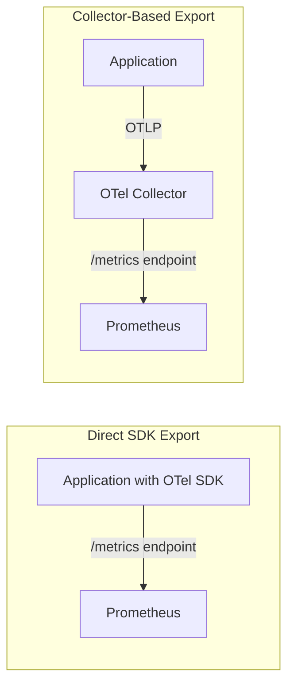
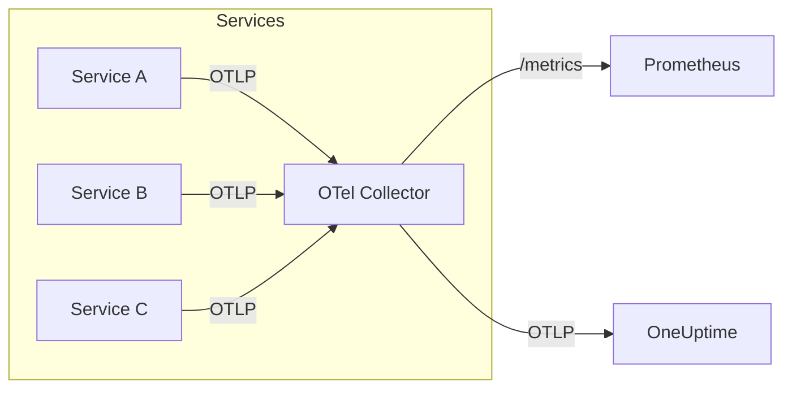

# How to Create OpenTelemetry Prometheus Exporter

Author: [nawazdhandala](https://github.com/nawazdhandala)

Tags: OpenTelemetry, Prometheus, Metrics, Observability

Description: Learn how to export OpenTelemetry metrics to Prometheus using the Prometheus exporter, including configuration, setup, and best practices.

---

Prometheus is one of the most popular open-source monitoring systems, known for its pull-based model and powerful query language (PromQL). OpenTelemetry provides native support for exporting metrics in Prometheus format, allowing you to leverage existing Prometheus infrastructure while benefiting from OpenTelemetry's vendor-neutral instrumentation.

This guide walks you through setting up an OpenTelemetry Prometheus exporter, covering both SDK-level configuration in your applications and Collector-based approaches.

---

## Understanding the Architecture

OpenTelemetry supports two main approaches for exposing metrics to Prometheus:

1. **Direct SDK Export**: Your application exposes a `/metrics` endpoint that Prometheus scrapes
2. **Collector-Based Export**: Applications send metrics to an OpenTelemetry Collector, which exposes them for Prometheus

The following diagram shows how both approaches work.



---

## Option 1: Direct SDK Export (Node.js)

This approach is simpler and works well for single-service deployments. Your application directly exposes metrics in Prometheus format.

### Installation

Install the required OpenTelemetry packages for metrics and Prometheus export.

```bash
npm install @opentelemetry/api \
  @opentelemetry/sdk-node \
  @opentelemetry/sdk-metrics \
  @opentelemetry/exporter-prometheus \
  @opentelemetry/resources \
  @opentelemetry/semantic-conventions
```

### Basic Setup

Create a `metrics.js` file that initializes the OpenTelemetry SDK with Prometheus export. This configuration starts an HTTP server on port 9464 that Prometheus can scrape.

```javascript
const { PrometheusExporter } = require('@opentelemetry/exporter-prometheus');
const { MeterProvider } = require('@opentelemetry/sdk-metrics');
const { Resource } = require('@opentelemetry/resources');
const { SemanticResourceAttributes } = require('@opentelemetry/semantic-conventions');

// Configure the Prometheus exporter
// This starts an HTTP server that exposes metrics at /metrics
const exporter = new PrometheusExporter({
  port: 9464,           // Default Prometheus port
  endpoint: '/metrics', // Metrics endpoint path
  preventServerStart: false, // Auto-start the HTTP server
});

// Create a MeterProvider with service identification
const meterProvider = new MeterProvider({
  resource: new Resource({
    [SemanticResourceAttributes.SERVICE_NAME]: 'my-service',
    [SemanticResourceAttributes.SERVICE_VERSION]: '1.0.0',
  }),
  readers: [exporter],
});

// Get a meter to create instruments
const meter = meterProvider.getMeter('my-service-meter');

module.exports = { meter, meterProvider };
```

### Creating Metrics

OpenTelemetry supports several metric instrument types that map to Prometheus metric types. The following code demonstrates creating counters, gauges, and histograms.

```javascript
const { meter } = require('./metrics');

// Counter - maps to Prometheus counter
// Use for values that only increase (requests, errors, bytes sent)
const requestCounter = meter.createCounter('http_requests_total', {
  description: 'Total number of HTTP requests',
  unit: '1',
});

// UpDownCounter - maps to Prometheus gauge
// Use for values that can increase or decrease (active connections, queue size)
const activeConnections = meter.createUpDownCounter('http_active_connections', {
  description: 'Number of active HTTP connections',
  unit: '1',
});

// Histogram - maps to Prometheus histogram
// Use for measuring distributions (latency, response size)
const requestDuration = meter.createHistogram('http_request_duration_seconds', {
  description: 'HTTP request duration in seconds',
  unit: 's',
  advice: {
    explicitBucketBoundaries: [0.005, 0.01, 0.025, 0.05, 0.1, 0.25, 0.5, 1, 2.5, 5, 10],
  },
});

// Observable Gauge - for async values read on demand
// Use for values from external systems (CPU, memory, temperature)
const cpuUsage = meter.createObservableGauge('process_cpu_usage', {
  description: 'Current CPU usage percentage',
  unit: '%',
});

// Register callback to read CPU usage when Prometheus scrapes
cpuUsage.addCallback((observableResult) => {
  const usage = process.cpuUsage();
  const total = usage.user + usage.system;
  observableResult.observe(total / 1000000); // Convert to percentage
});
```

### Using Metrics in Your Application

This example shows how to record metrics in an Express.js middleware. Each request increments the counter, tracks active connections, and records the duration.

```javascript
const express = require('express');
const { requestCounter, activeConnections, requestDuration } = require('./instruments');

const app = express();

// Middleware to record metrics for every request
app.use((req, res, next) => {
  const startTime = Date.now();

  // Increment active connections
  activeConnections.add(1);

  // Record metrics when response finishes
  res.on('finish', () => {
    const duration = (Date.now() - startTime) / 1000;

    // Labels for metric dimensions
    const labels = {
      method: req.method,
      route: req.route?.path || req.path,
      status_code: res.statusCode.toString(),
    };

    // Record request count
    requestCounter.add(1, labels);

    // Record request duration
    requestDuration.record(duration, labels);

    // Decrement active connections
    activeConnections.add(-1);
  });

  next();
});

app.get('/api/users', (req, res) => {
  res.json({ users: [] });
});

app.listen(3000, () => {
  console.log('Application running on port 3000');
  console.log('Metrics available at http://localhost:9464/metrics');
});
```

### Prometheus Configuration

Configure Prometheus to scrape metrics from your application. Add this job to your `prometheus.yml` configuration file.

```yaml
# prometheus.yml
global:
  scrape_interval: 15s      # How often to scrape targets
  evaluation_interval: 15s  # How often to evaluate rules

scrape_configs:
  # Scrape metrics from your application
  - job_name: 'my-service'
    static_configs:
      - targets: ['localhost:9464']
    # Optional: add labels to all metrics from this job
    relabel_configs:
      - source_labels: [__address__]
        target_label: instance
        replacement: 'my-service-instance-1'
```

---

## Option 2: OpenTelemetry Collector with Prometheus Exporter

For production environments with multiple services, routing metrics through an OpenTelemetry Collector provides better control, processing capabilities, and reduced overhead on your applications.

The following diagram shows the data flow when using a Collector.



### Collector Configuration

Configure the OpenTelemetry Collector to receive metrics via OTLP and expose them in Prometheus format. This configuration also forwards metrics to OneUptime for long-term storage.

```yaml
# otel-collector-config.yaml

# Receivers define how data enters the Collector
receivers:
  # Receive metrics via OTLP (gRPC and HTTP)
  otlp:
    protocols:
      grpc:
        endpoint: 0.0.0.0:4317
      http:
        endpoint: 0.0.0.0:4318

# Processors transform and filter data
processors:
  # Protect against memory exhaustion
  memory_limiter:
    limit_mib: 512
    spike_limit_mib: 128
    check_interval: 5s

  # Batch metrics for efficient export
  batch:
    send_batch_size: 1000
    timeout: 10s

  # Add resource attributes to all metrics
  resource:
    attributes:
      - key: environment
        value: production
        action: upsert

# Exporters define where data is sent
exporters:
  # Prometheus exporter - exposes /metrics endpoint
  prometheus:
    endpoint: 0.0.0.0:8889        # Port for Prometheus to scrape
    namespace: otel               # Prefix for all metric names
    const_labels:                 # Labels added to all metrics
      collector: opentelemetry
    enable_open_metrics: true     # Enable OpenMetrics format
    resource_to_telemetry_conversion:
      enabled: true               # Convert resource attrs to labels

  # Also send to OneUptime for storage and alerting
  otlphttp:
    endpoint: https://oneuptime.com/otlp
    headers:
      x-oneuptime-token: ${ONEUPTIME_TOKEN}

# Service configuration wires everything together
service:
  pipelines:
    metrics:
      receivers: [otlp]
      processors: [memory_limiter, batch, resource]
      exporters: [prometheus, otlphttp]
```

### Application Configuration for Collector

Configure your application to send metrics to the Collector using OTLP instead of exposing them directly.

```javascript
const { OTLPMetricExporter } = require('@opentelemetry/exporter-metrics-otlp-http');
const { MeterProvider, PeriodicExportingMetricReader } = require('@opentelemetry/sdk-metrics');
const { Resource } = require('@opentelemetry/resources');
const { SemanticResourceAttributes } = require('@opentelemetry/semantic-conventions');

// Configure OTLP exporter to send metrics to Collector
const exporter = new OTLPMetricExporter({
  url: process.env.OTEL_EXPORTER_OTLP_ENDPOINT || 'http://localhost:4318/v1/metrics',
  headers: {},
});

// Create a periodic reader that exports metrics every 30 seconds
const metricReader = new PeriodicExportingMetricReader({
  exporter: exporter,
  exportIntervalMillis: 30000, // Export every 30 seconds
});

// Create the MeterProvider
const meterProvider = new MeterProvider({
  resource: new Resource({
    [SemanticResourceAttributes.SERVICE_NAME]: process.env.SERVICE_NAME || 'my-service',
    [SemanticResourceAttributes.SERVICE_VERSION]: '1.0.0',
    [SemanticResourceAttributes.DEPLOYMENT_ENVIRONMENT]: process.env.NODE_ENV || 'development',
  }),
  readers: [metricReader],
});

const meter = meterProvider.getMeter('my-service-meter');

module.exports = { meter, meterProvider };
```

### Running the Collector

Start the OpenTelemetry Collector using Docker. This command runs the Collector with your configuration file and exposes the necessary ports.

```bash
docker run -d \
  --name otel-collector \
  -p 4317:4317 \
  -p 4318:4318 \
  -p 8889:8889 \
  -v $(pwd)/otel-collector-config.yaml:/etc/otel/config.yaml \
  -e ONEUPTIME_TOKEN=your-token-here \
  otel/opentelemetry-collector-contrib:latest \
  --config /etc/otel/config.yaml
```

Update your Prometheus configuration to scrape from the Collector.

```yaml
# prometheus.yml
scrape_configs:
  - job_name: 'otel-collector'
    static_configs:
      - targets: ['localhost:8889']
    honor_labels: true  # Preserve labels from Collector
```

---

## Option 3: Python Implementation

For Python applications, OpenTelemetry provides similar Prometheus export capabilities.

### Installation

```bash
pip install opentelemetry-api \
  opentelemetry-sdk \
  opentelemetry-exporter-prometheus
```

### Setup

Create a metrics module that configures the Prometheus exporter and creates metric instruments.

```python
from prometheus_client import start_http_server
from opentelemetry import metrics
from opentelemetry.sdk.metrics import MeterProvider
from opentelemetry.sdk.metrics.export import PeriodicExportingMetricReader
from opentelemetry.exporter.prometheus import PrometheusMetricReader
from opentelemetry.sdk.resources import Resource, SERVICE_NAME

# Create Prometheus metric reader
prometheus_reader = PrometheusMetricReader()

# Configure the MeterProvider
resource = Resource.create({SERVICE_NAME: "my-python-service"})
provider = MeterProvider(resource=resource, metric_readers=[prometheus_reader])
metrics.set_meter_provider(provider)

# Get a meter
meter = metrics.get_meter("my-python-service")

# Create metrics
request_counter = meter.create_counter(
    name="http_requests_total",
    description="Total HTTP requests",
    unit="1",
)

request_duration = meter.create_histogram(
    name="http_request_duration_seconds",
    description="HTTP request duration",
    unit="s",
)

# Start Prometheus HTTP server on port 9464
start_http_server(port=9464)
```

### Using Metrics with Flask

This example shows how to integrate OpenTelemetry metrics with a Flask application.

```python
from flask import Flask, request, g
import time
from metrics import request_counter, request_duration

app = Flask(__name__)

@app.before_request
def before_request():
    g.start_time = time.time()

@app.after_request
def after_request(response):
    duration = time.time() - g.start_time

    labels = {
        "method": request.method,
        "endpoint": request.endpoint or "unknown",
        "status_code": str(response.status_code),
    }

    request_counter.add(1, labels)
    request_duration.record(duration, labels)

    return response

@app.route('/api/users')
def get_users():
    return {"users": []}

if __name__ == '__main__':
    app.run(port=3000)
```

---

## Metric Naming Conventions

OpenTelemetry and Prometheus have different naming conventions. The exporter automatically converts OpenTelemetry metric names to Prometheus format.

| OpenTelemetry | Prometheus | Notes |
|--------------|------------|-------|
| `http.request.duration` | `http_request_duration` | Dots become underscores |
| `http_requests_total` | `http_requests_total` | `_total` suffix for counters |
| Unit: `s` | `_seconds` suffix | Unit becomes suffix |
| Unit: `By` | `_bytes` suffix | Bytes unit handling |

Best practices for naming:

- Use lowercase with underscores
- Include unit in the name or let the exporter add it
- Add `_total` suffix for counters
- Use descriptive names that explain what is being measured

---

## Histogram Bucket Configuration

Prometheus histograms use predefined buckets. Choose buckets that match your expected value distribution.

```javascript
// For request latency (in seconds)
const latencyHistogram = meter.createHistogram('http_request_duration_seconds', {
  description: 'Request duration in seconds',
  unit: 's',
  advice: {
    // Buckets for typical web request latencies
    explicitBucketBoundaries: [
      0.005,  // 5ms
      0.01,   // 10ms
      0.025,  // 25ms
      0.05,   // 50ms
      0.1,    // 100ms
      0.25,   // 250ms
      0.5,    // 500ms
      1,      // 1s
      2.5,    // 2.5s
      5,      // 5s
      10,     // 10s
    ],
  },
});

// For response size (in bytes)
const responseSizeHistogram = meter.createHistogram('http_response_size_bytes', {
  description: 'Response size in bytes',
  unit: 'By',
  advice: {
    // Buckets for typical response sizes
    explicitBucketBoundaries: [
      100,      // 100 bytes
      1000,     // 1 KB
      10000,    // 10 KB
      100000,   // 100 KB
      1000000,  // 1 MB
      10000000, // 10 MB
    ],
  },
});
```

---

## Handling Labels (Attributes)

OpenTelemetry attributes become Prometheus labels. Be careful with cardinality to avoid performance issues.

```javascript
// Good: Low cardinality labels
requestCounter.add(1, {
  method: 'GET',              // Limited values: GET, POST, PUT, DELETE
  status_code: '200',         // Limited values: 2xx, 3xx, 4xx, 5xx
  endpoint: '/api/users',     // Use route pattern, not actual path
});

// Bad: High cardinality - avoid these
requestCounter.add(1, {
  user_id: '12345',           // Unbounded - creates label per user
  request_id: 'abc-123',      // Unique per request
  timestamp: Date.now(),      // Unique per request
  path: '/api/users/12345',   // Include IDs - use route pattern instead
});
```

---

## Collector Prometheus Exporter Options

The Collector's Prometheus exporter supports several configuration options for production use.

```yaml
exporters:
  prometheus:
    endpoint: 0.0.0.0:8889

    # Prefix all metric names
    namespace: myapp

    # Add constant labels to all metrics
    const_labels:
      environment: production
      region: us-east-1

    # Enable OpenMetrics format (recommended)
    enable_open_metrics: true

    # Convert OTel resource attributes to Prometheus labels
    resource_to_telemetry_conversion:
      enabled: true

    # Metric filtering
    send_timestamps: true

    # Add job and instance labels
    add_metric_suffixes: true
```

---

## Verifying Your Setup

After configuring everything, verify metrics are being exported correctly.

Check that the metrics endpoint is accessible.

```bash
# For direct SDK export
curl http://localhost:9464/metrics

# For Collector-based export
curl http://localhost:8889/metrics
```

You should see output similar to this.

```text
# HELP http_requests_total Total number of HTTP requests
# TYPE http_requests_total counter
http_requests_total{method="GET",route="/api/users",status_code="200"} 42

# HELP http_request_duration_seconds HTTP request duration in seconds
# TYPE http_request_duration_seconds histogram
http_request_duration_seconds_bucket{method="GET",route="/api/users",le="0.005"} 10
http_request_duration_seconds_bucket{method="GET",route="/api/users",le="0.01"} 25
http_request_duration_seconds_bucket{method="GET",route="/api/users",le="+Inf"} 42
http_request_duration_seconds_sum{method="GET",route="/api/users"} 1.234
http_request_duration_seconds_count{method="GET",route="/api/users"} 42
```

---

## Summary

| Approach | Best For | Pros | Cons |
|----------|----------|------|------|
| Direct SDK Export | Single services, development | Simple setup, no extra components | Each service needs its own endpoint |
| Collector-Based | Production, multi-service | Centralized config, processing, routing | Additional infrastructure to manage |

The OpenTelemetry Prometheus exporter provides a seamless way to integrate OpenTelemetry instrumentation with existing Prometheus infrastructure. For most production deployments, the Collector-based approach offers better flexibility and control, while direct SDK export works well for simpler scenarios.

---

**Related Reading:**

- [What is OpenTelemetry Collector and Why Use One?](https://oneuptime.com/blog/post/2025-09-18-what-is-opentelemetry-collector-and-why-use-one/view)
- [What are Metrics in OpenTelemetry: A Complete Guide](https://oneuptime.com/blog/post/2025-08-26-what-are-metrics-in-opentelemetry/view)
- [How to Reduce Noise in OpenTelemetry](https://oneuptime.com/blog/post/2025-08-25-how-to-reduce-noise-in-opentelemetry/view)
- [Traces and Spans in OpenTelemetry](https://oneuptime.com/blog/post/2025-08-27-traces-and-spans-in-opentelemetry/view)
