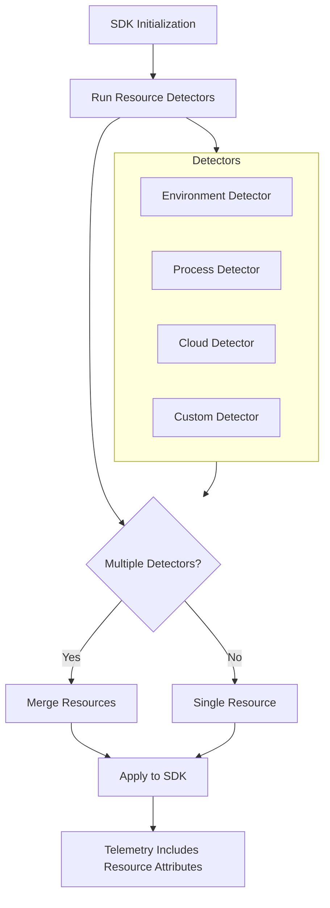
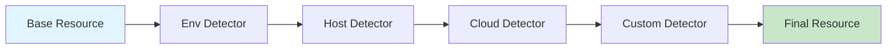

# How to Create OpenTelemetry Resource Detectors

Author: [nawazdhandala](https://github.com/nawazdhandala)

Tags: OpenTelemetry, Resources, Observability, Cloud

Description: Learn how to build custom OpenTelemetry resource detectors to automatically capture environment metadata from AWS, GCP, Azure, and your own infrastructure.

---

Resource detectors automatically gather metadata about where your application runs. Instead of hardcoding `service.name` and `host.name` in every service, detectors pull this information from the environment at startup. This metadata travels with every trace, metric, and log, making it trivial to filter and group telemetry by region, instance, container, or deployment.

This guide walks through how resource detection works, how to use built-in cloud detectors, and how to write your own custom detectors for proprietary infrastructure.

---

## Table of Contents

1. What Are Resources in OpenTelemetry?
2. How Resource Detection Works
3. Built-in Detectors (AWS, GCP, Azure)
4. Using Multiple Detectors Together
5. Writing a Custom Resource Detector
6. Async Detection Patterns
7. Detector Prioritization and Merging
8. Best Practices
9. Common Pitfalls
10. Putting It All Together

---

## 1. What Are Resources in OpenTelemetry?

A Resource represents the entity producing telemetry. It is a set of key-value attributes that describe the compute unit, like:

| Attribute | Example Value |
|-----------|---------------|
| `service.name` | `checkout-service` |
| `service.version` | `2.4.1` |
| `host.name` | `ip-10-0-1-42` |
| `cloud.provider` | `aws` |
| `cloud.region` | `us-east-1` |
| `k8s.pod.name` | `checkout-7f9b4d8c5-x2q9z` |

Resources attach to the SDK at initialization. Every span, metric data point, and log record carries this context. When you query "show me all errors from the checkout service in eu-west-1," the resource attributes make that query possible.

---

## 2. How Resource Detection Works

The detection flow runs at SDK startup:



Each detector returns a `Resource` object. The SDK merges all detected resources, with later detectors overwriting earlier ones for conflicting keys. This lets you layer defaults with environment-specific overrides.

---

## 3. Built-in Detectors (AWS, GCP, Azure)

OpenTelemetry provides detectors for major cloud providers. These query metadata services (like EC2 IMDS or GCP metadata server) to populate cloud-specific attributes.

### AWS Detector

Detects EC2 instances, ECS tasks, EKS pods, Lambda functions, and Elastic Beanstalk environments.

**Installation:**

```bash
npm install @opentelemetry/resource-detector-aws
```

**Usage:**

```typescript
import { NodeSDK } from '@opentelemetry/sdk-node';
import {
  awsEc2Detector,
  awsEcsDetector,
  awsEksDetector,
  awsLambdaDetector,
} from '@opentelemetry/resource-detector-aws';

const sdk = new NodeSDK({
  resourceDetectors: [
    awsEc2Detector,
    awsEcsDetector,
    awsEksDetector,
    awsLambdaDetector,
  ],
});

sdk.start();
```

**Detected Attributes (EC2 example):**

| Attribute | Source |
|-----------|--------|
| `cloud.provider` | `aws` |
| `cloud.platform` | `aws_ec2` |
| `cloud.region` | EC2 metadata |
| `cloud.availability_zone` | EC2 metadata |
| `cloud.account.id` | EC2 metadata |
| `host.id` | Instance ID |
| `host.type` | Instance type |
| `host.name` | Private hostname |

### GCP Detector

Detects Compute Engine VMs, GKE pods, Cloud Run services, and Cloud Functions.

**Installation:**

```bash
npm install @opentelemetry/resource-detector-gcp
```

**Usage:**

```typescript
import { NodeSDK } from '@opentelemetry/sdk-node';
import { gcpDetector } from '@opentelemetry/resource-detector-gcp';

const sdk = new NodeSDK({
  resourceDetectors: [gcpDetector],
});

sdk.start();
```

**Detected Attributes (GCE example):**

| Attribute | Source |
|-----------|--------|
| `cloud.provider` | `gcp` |
| `cloud.platform` | `gcp_compute_engine` |
| `cloud.region` | Metadata server |
| `cloud.availability_zone` | Metadata server |
| `host.id` | Instance ID |
| `host.name` | Instance name |
| `host.type` | Machine type |

### Azure Detector

Detects Azure VMs, App Services, Functions, and AKS pods.

**Installation:**

```bash
npm install @opentelemetry/resource-detector-azure
```

**Usage:**

```typescript
import { NodeSDK } from '@opentelemetry/sdk-node';
import {
  azureVmDetector,
  azureAppServiceDetector,
  azureFunctionsDetector,
} from '@opentelemetry/resource-detector-azure';

const sdk = new NodeSDK({
  resourceDetectors: [
    azureVmDetector,
    azureAppServiceDetector,
    azureFunctionsDetector,
  ],
});

sdk.start();
```

**Detected Attributes (Azure VM example):**

| Attribute | Source |
|-----------|--------|
| `cloud.provider` | `azure` |
| `cloud.platform` | `azure_vm` |
| `cloud.region` | IMDS |
| `host.id` | VM ID |
| `host.name` | VM name |
| `host.type` | VM size |
| `azure.vm.scaleset.name` | Scale set name (if applicable) |

---

## 4. Using Multiple Detectors Together

In practice, you want multiple detectors running together. The SDK merges them in order.

```typescript
import { NodeSDK } from '@opentelemetry/sdk-node';
import { Resource } from '@opentelemetry/resources';
import { SemanticResourceAttributes } from '@opentelemetry/semantic-conventions';
import { envDetector, processDetector, hostDetector } from '@opentelemetry/resources';
import { awsEc2Detector, awsEcsDetector } from '@opentelemetry/resource-detector-aws';

// Base resource with service identity
const baseResource = new Resource({
  [SemanticResourceAttributes.SERVICE_NAME]: 'order-service',
  [SemanticResourceAttributes.SERVICE_VERSION]: process.env.APP_VERSION || '0.0.0',
  [SemanticResourceAttributes.DEPLOYMENT_ENVIRONMENT]: process.env.NODE_ENV || 'development',
});

const sdk = new NodeSDK({
  resource: baseResource,
  resourceDetectors: [
    envDetector,        // OTEL_RESOURCE_ATTRIBUTES env var
    processDetector,    // process.pid, process.executable.name
    hostDetector,       // os.type, host.name, host.arch
    awsEc2Detector,     // EC2 metadata (if running on EC2)
    awsEcsDetector,     // ECS task metadata (if running in ECS)
  ],
});

sdk.start();
```

**Merge Order:**

The `resource` property merges first, then detectors run in array order. Later values overwrite earlier ones for the same key. This lets you set defaults in `resource` and let detectors override with runtime-detected values.

---

## 5. Writing a Custom Resource Detector

When your infrastructure has metadata the built-in detectors do not capture, write your own. Common use cases:

- Internal service registry attributes
- Deployment pipeline metadata (build ID, git SHA)
- Custom orchestration platforms
- On-prem datacenter information

### Detector Interface

A detector implements the `Detector` interface:

```typescript
import { Detector, Resource, ResourceDetectionConfig } from '@opentelemetry/resources';

interface Detector {
  detect(config?: ResourceDetectionConfig): Promise<Resource>;
}
```

### Example: Git Commit Detector

This detector reads git metadata from environment variables set by your CI/CD pipeline:

```typescript
// git-detector.ts
import { Detector, Resource, ResourceDetectionConfig } from '@opentelemetry/resources';

class GitCommitDetector implements Detector {
  async detect(_config?: ResourceDetectionConfig): Promise<Resource> {
    const commitSha = process.env.GIT_COMMIT_SHA || process.env.GITHUB_SHA;
    const branch = process.env.GIT_BRANCH || process.env.GITHUB_REF_NAME;
    const repository = process.env.GIT_REPOSITORY || process.env.GITHUB_REPOSITORY;

    if (!commitSha) {
      // Return empty resource if no git info available
      return Resource.empty();
    }

    return new Resource({
      'vcs.repository.url': repository ? `https://github.com/${repository}` : undefined,
      'vcs.commit.id': commitSha,
      'vcs.branch': branch,
    });
  }
}

export const gitCommitDetector = new GitCommitDetector();
```

### Example: Internal Service Registry Detector

This detector queries your internal service registry API:

```typescript
// service-registry-detector.ts
import { Detector, Resource, ResourceDetectionConfig } from '@opentelemetry/resources';

interface ServiceMetadata {
  team: string;
  costCenter: string;
  tier: string;
  oncallGroup: string;
}

class ServiceRegistryDetector implements Detector {
  private registryUrl: string;
  private serviceName: string;

  constructor(registryUrl: string, serviceName: string) {
    this.registryUrl = registryUrl;
    this.serviceName = serviceName;
  }

  async detect(_config?: ResourceDetectionConfig): Promise<Resource> {
    try {
      const response = await fetch(
        `${this.registryUrl}/services/${this.serviceName}/metadata`,
        { signal: AbortSignal.timeout(5000) }
      );

      if (!response.ok) {
        console.warn(`Service registry returned ${response.status}`);
        return Resource.empty();
      }

      const metadata: ServiceMetadata = await response.json();

      return new Resource({
        'service.team': metadata.team,
        'service.cost_center': metadata.costCenter,
        'service.tier': metadata.tier,
        'service.oncall_group': metadata.oncallGroup,
      });
    } catch (error) {
      console.warn('Failed to fetch service registry metadata:', error);
      return Resource.empty();
    }
  }
}

export function createServiceRegistryDetector(registryUrl: string, serviceName: string) {
  return new ServiceRegistryDetector(registryUrl, serviceName);
}
```

### Example: Kubernetes Downward API Detector

When running in Kubernetes, you can expose pod metadata through the Downward API. This detector reads those mounted files:

```typescript
// k8s-downward-detector.ts
import { Detector, Resource, ResourceDetectionConfig } from '@opentelemetry/resources';
import { readFile } from 'fs/promises';

class K8sDownwardApiDetector implements Detector {
  private basePath: string;

  constructor(basePath: string = '/etc/podinfo') {
    this.basePath = basePath;
  }

  async detect(_config?: ResourceDetectionConfig): Promise<Resource> {
    const attributes: Record<string, string> = {};

    const files = [
      { file: 'namespace', attr: 'k8s.namespace.name' },
      { file: 'pod-name', attr: 'k8s.pod.name' },
      { file: 'node-name', attr: 'k8s.node.name' },
      { file: 'pod-uid', attr: 'k8s.pod.uid' },
    ];

    for (const { file, attr } of files) {
      try {
        const value = await readFile(`${this.basePath}/${file}`, 'utf-8');
        attributes[attr] = value.trim();
      } catch {
        // File not present, skip
      }
    }

    // Read labels and annotations if mounted
    try {
      const labels = await readFile(`${this.basePath}/labels`, 'utf-8');
      const parsed = this.parseDownwardLabels(labels);
      if (parsed['app.kubernetes.io/name']) {
        attributes['k8s.deployment.name'] = parsed['app.kubernetes.io/name'];
      }
      if (parsed['app.kubernetes.io/version']) {
        attributes['service.version'] = parsed['app.kubernetes.io/version'];
      }
    } catch {
      // Labels file not present
    }

    return new Resource(attributes);
  }

  private parseDownwardLabels(content: string): Record<string, string> {
    const result: Record<string, string> = {};
    for (const line of content.split('\n')) {
      const match = line.match(/^([^=]+)="(.+)"$/);
      if (match) {
        result[match[1]] = match[2];
      }
    }
    return result;
  }
}

export const k8sDownwardApiDetector = new K8sDownwardApiDetector();
```

**Kubernetes Deployment Configuration:**

```yaml
apiVersion: apps/v1
kind: Deployment
metadata:
  name: order-service
spec:
  template:
    spec:
      containers:
        - name: app
          volumeMounts:
            - name: podinfo
              mountPath: /etc/podinfo
      volumes:
        - name: podinfo
          downwardAPI:
            items:
              - path: "namespace"
                fieldRef:
                  fieldPath: metadata.namespace
              - path: "pod-name"
                fieldRef:
                  fieldPath: metadata.name
              - path: "node-name"
                fieldRef:
                  fieldPath: spec.nodeName
              - path: "pod-uid"
                fieldRef:
                  fieldPath: metadata.uid
              - path: "labels"
                fieldRef:
                  fieldPath: metadata.labels
```

---

## 6. Async Detection Patterns

Resource detection happens at startup, so detectors can perform async operations (HTTP calls, file reads). However, detection must complete before telemetry starts flowing.

### Detection Timeout

Set a timeout to prevent slow detectors from blocking startup:

```typescript
import { NodeSDK } from '@opentelemetry/sdk-node';
import { detectResourcesSync } from '@opentelemetry/resources';

const sdk = new NodeSDK({
  resourceDetectors: [
    awsEc2Detector,
    customSlowDetector,
  ],
  resourceDetectionOptions: {
    detectors: [awsEc2Detector, customSlowDetector],
    timeout: 5000, // 5 second timeout
  },
});
```

### Graceful Degradation

Your custom detectors should handle failures gracefully and return `Resource.empty()` rather than throwing:

```typescript
class ResilientDetector implements Detector {
  async detect(_config?: ResourceDetectionConfig): Promise<Resource> {
    try {
      const data = await this.fetchMetadata();
      return new Resource(data);
    } catch (error) {
      // Log but don't fail startup
      console.warn('Resource detection failed, continuing with empty resource:', error);
      return Resource.empty();
    }
  }

  private async fetchMetadata(): Promise<Record<string, string>> {
    const controller = new AbortController();
    const timeoutId = setTimeout(() => controller.abort(), 3000);

    try {
      const response = await fetch('http://metadata-service/info', {
        signal: controller.signal,
      });
      return await response.json();
    } finally {
      clearTimeout(timeoutId);
    }
  }
}
```

---

## 7. Detector Prioritization and Merging

When multiple detectors return the same attribute, later detectors win. Use this to your advantage:



**Example Merge:**

```typescript
// Base resource
{ "service.name": "unknown", "deployment.environment": "production" }

// + Host detector
{ "host.name": "ip-10-0-1-42", "host.arch": "amd64" }

// + AWS detector
{ "cloud.provider": "aws", "cloud.region": "us-east-1", "host.name": "ec2-instance-name" }

// + Custom detector
{ "service.name": "order-service", "service.team": "platform" }

// Final merged resource
{
  "service.name": "order-service",        // Custom detector wins
  "deployment.environment": "production", // From base
  "host.name": "ec2-instance-name",       // AWS detector overwrote host
  "host.arch": "amd64",                   // From host detector
  "cloud.provider": "aws",                // From AWS detector
  "cloud.region": "us-east-1",            // From AWS detector
  "service.team": "platform"              // From custom detector
}
```

**Strategy:**

1. Put general detectors first (env, process, host)
2. Put cloud detectors next (they provide more specific host info)
3. Put custom detectors last (they should have final say on business attributes)

---

## 8. Best Practices

### Use Semantic Conventions

Stick to [OpenTelemetry Semantic Conventions](https://opentelemetry.io/docs/concepts/semantic-conventions/) for attribute names:

```typescript
import { SemanticResourceAttributes } from '@opentelemetry/semantic-conventions';

new Resource({
  [SemanticResourceAttributes.SERVICE_NAME]: 'order-service',
  [SemanticResourceAttributes.SERVICE_VERSION]: '1.2.3',
  [SemanticResourceAttributes.DEPLOYMENT_ENVIRONMENT]: 'production',
});
```

### Keep Cardinality Bounded

Resources attach to every telemetry item. High-cardinality attributes (like request IDs or timestamps) do not belong in resources:

| Good Resource Attributes | Bad Resource Attributes |
|--------------------------|-------------------------|
| `service.name` | `request.id` |
| `host.name` | `user.id` |
| `cloud.region` | `timestamp` |
| `k8s.namespace.name` | `session.id` |
| `deployment.environment` | `correlation.id` |

### Cache Detected Values

If your detector fetches from a remote service, cache the result. Detection runs once at startup, but if you reinitialize the SDK (for testing), caching avoids redundant calls:

```typescript
class CachedDetector implements Detector {
  private cachedResource: Resource | null = null;

  async detect(_config?: ResourceDetectionConfig): Promise<Resource> {
    if (this.cachedResource) {
      return this.cachedResource;
    }

    const resource = await this.performDetection();
    this.cachedResource = resource;
    return resource;
  }

  private async performDetection(): Promise<Resource> {
    // Expensive operation
    const metadata = await fetchFromRegistry();
    return new Resource(metadata);
  }
}
```

### Test Your Detectors

Write unit tests that mock the metadata sources:

```typescript
import { describe, it, expect, beforeEach, afterEach } from 'vitest';
import { gitCommitDetector } from './git-detector';

describe('GitCommitDetector', () => {
  const originalEnv = process.env;

  beforeEach(() => {
    process.env = { ...originalEnv };
  });

  afterEach(() => {
    process.env = originalEnv;
  });

  it('detects git commit from GITHUB_SHA', async () => {
    process.env.GITHUB_SHA = 'abc123def456';
    process.env.GITHUB_REF_NAME = 'main';
    process.env.GITHUB_REPOSITORY = 'myorg/myrepo';

    const resource = await gitCommitDetector.detect();
    const attributes = resource.attributes;

    expect(attributes['vcs.commit.id']).toBe('abc123def456');
    expect(attributes['vcs.branch']).toBe('main');
    expect(attributes['vcs.repository.url']).toBe('https://github.com/myorg/myrepo');
  });

  it('returns empty resource when no git env vars', async () => {
    delete process.env.GIT_COMMIT_SHA;
    delete process.env.GITHUB_SHA;

    const resource = await gitCommitDetector.detect();

    expect(Object.keys(resource.attributes)).toHaveLength(0);
  });
});
```

---

## 9. Common Pitfalls

### Blocking Startup Too Long

Detectors that make network calls can delay application startup. Always set timeouts:

```typescript
// Bad: no timeout
const response = await fetch(metadataUrl);

// Good: with timeout
const response = await fetch(metadataUrl, {
  signal: AbortSignal.timeout(3000),
});
```

### Throwing Exceptions

If a detector throws, it can prevent the SDK from starting. Always catch errors and return `Resource.empty()`:

```typescript
// Bad: exception propagates
async detect(): Promise<Resource> {
  const data = await fetch(url); // Throws on network error
  return new Resource(await data.json());
}

// Good: graceful degradation
async detect(): Promise<Resource> {
  try {
    const data = await fetch(url);
    return new Resource(await data.json());
  } catch (error) {
    console.warn('Detection failed:', error);
    return Resource.empty();
  }
}
```

### Duplicating Built-in Detection

Check if a built-in detector already covers your use case before writing a custom one. The `@opentelemetry/resources` package includes:

- `envDetector` - Reads `OTEL_RESOURCE_ATTRIBUTES` and `OTEL_SERVICE_NAME`
- `processDetector` - Process PID, executable name, command
- `hostDetector` - Hostname, OS type, architecture

### Ignoring SDK Resource

The `resource` option on `NodeSDK` merges with detected resources. Do not assume detectors run in isolation:

```typescript
// Your base resource
const sdk = new NodeSDK({
  resource: new Resource({
    [SemanticResourceAttributes.SERVICE_NAME]: 'my-service',
  }),
  resourceDetectors: [envDetector], // This can override service.name via OTEL_SERVICE_NAME
});
```

---

## 10. Putting It All Together

Here is a complete setup combining built-in and custom detectors:

```typescript
// telemetry.ts
import { NodeSDK } from '@opentelemetry/sdk-node';
import { Resource } from '@opentelemetry/resources';
import { SemanticResourceAttributes } from '@opentelemetry/semantic-conventions';
import { OTLPTraceExporter } from '@opentelemetry/exporter-trace-otlp-http';
import { OTLPMetricExporter } from '@opentelemetry/exporter-metrics-otlp-http';
import { PeriodicExportingMetricReader } from '@opentelemetry/sdk-metrics';
import {
  envDetector,
  processDetector,
  hostDetector,
} from '@opentelemetry/resources';
import { awsEc2Detector, awsEcsDetector } from '@opentelemetry/resource-detector-aws';
import { gitCommitDetector } from './detectors/git-detector';
import { createServiceRegistryDetector } from './detectors/service-registry-detector';
import { k8sDownwardApiDetector } from './detectors/k8s-downward-detector';

const SERVICE_NAME = process.env.OTEL_SERVICE_NAME || 'unknown-service';
const REGISTRY_URL = process.env.SERVICE_REGISTRY_URL || 'http://registry.internal';

// Base resource with mandatory service identity
const baseResource = new Resource({
  [SemanticResourceAttributes.SERVICE_NAME]: SERVICE_NAME,
  [SemanticResourceAttributes.SERVICE_VERSION]: process.env.APP_VERSION || '0.0.0',
  [SemanticResourceAttributes.DEPLOYMENT_ENVIRONMENT]: process.env.DEPLOY_ENV || 'development',
});

// Exporters
const traceExporter = new OTLPTraceExporter({
  url: process.env.OTEL_EXPORTER_OTLP_TRACES_ENDPOINT || 'https://oneuptime.com/otlp/v1/traces',
  headers: {
    'x-oneuptime-token': process.env.ONEUPTIME_TOKEN || '',
  },
});

const metricExporter = new OTLPMetricExporter({
  url: process.env.OTEL_EXPORTER_OTLP_METRICS_ENDPOINT || 'https://oneuptime.com/otlp/v1/metrics',
  headers: {
    'x-oneuptime-token': process.env.ONEUPTIME_TOKEN || '',
  },
});

// SDK with all detectors
export const sdk = new NodeSDK({
  resource: baseResource,
  resourceDetectors: [
    // Built-in detectors (general)
    envDetector,
    processDetector,
    hostDetector,

    // Cloud detectors (more specific)
    awsEc2Detector,
    awsEcsDetector,

    // Kubernetes detector
    k8sDownwardApiDetector,

    // Custom detectors (highest priority)
    gitCommitDetector,
    createServiceRegistryDetector(REGISTRY_URL, SERVICE_NAME),
  ],
  traceExporter,
  metricReader: new PeriodicExportingMetricReader({
    exporter: metricExporter,
    exportIntervalMillis: 15000,
  }),
});

export async function startTelemetry(): Promise<void> {
  await sdk.start();
  console.log('OpenTelemetry started with resource detection');
}

export async function shutdownTelemetry(): Promise<void> {
  await sdk.shutdown();
}
```

**Entrypoint:**

```typescript
// index.ts
import { startTelemetry, shutdownTelemetry } from './telemetry';
import { startServer } from './server';

async function main() {
  await startTelemetry();

  process.on('SIGTERM', async () => {
    await shutdownTelemetry();
    process.exit(0);
  });

  await startServer();
}

main().catch(console.error);
```

---

## Summary

| Concept | Key Takeaway |
|---------|--------------|
| Resources | Static metadata describing where telemetry originates |
| Detectors | Plugins that discover resource attributes at startup |
| Built-in Detectors | Cover standard environments (AWS, GCP, Azure, process, host) |
| Custom Detectors | Extend detection for your specific infrastructure |
| Merge Order | Later detectors override earlier ones for same attribute |
| Graceful Failure | Always return `Resource.empty()` on error, never throw |

Resource detection eliminates manual configuration drift. When your services move between environments, detectors adapt automatically. Your dashboards, alerts, and queries stay accurate without code changes.

---

**Related Reading:**

- [What is OpenTelemetry Collector and Why Use One?](https://oneuptime.com/blog/post/2025-09-18-what-is-opentelemetry-collector-and-why-use-one/view)
- [What are Traces and Spans in OpenTelemetry: A Practical Guide](https://oneuptime.com/blog/post/2025-08-27-traces-and-spans-in-opentelemetry/view)
- [How to Reduce Noise in OpenTelemetry](https://oneuptime.com/blog/post/2025-08-25-how-to-reduce-noise-in-opentelemetry/view)
