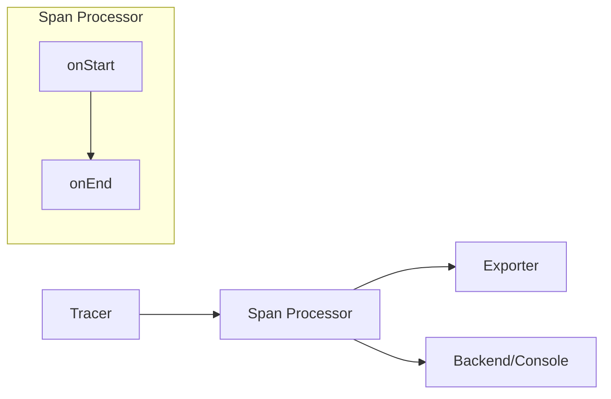
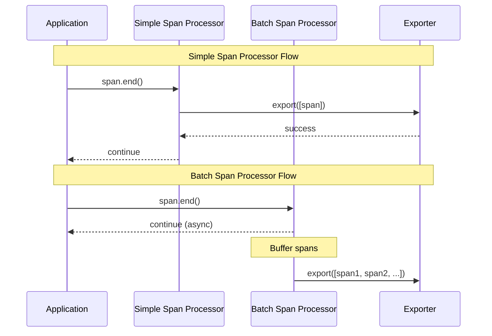
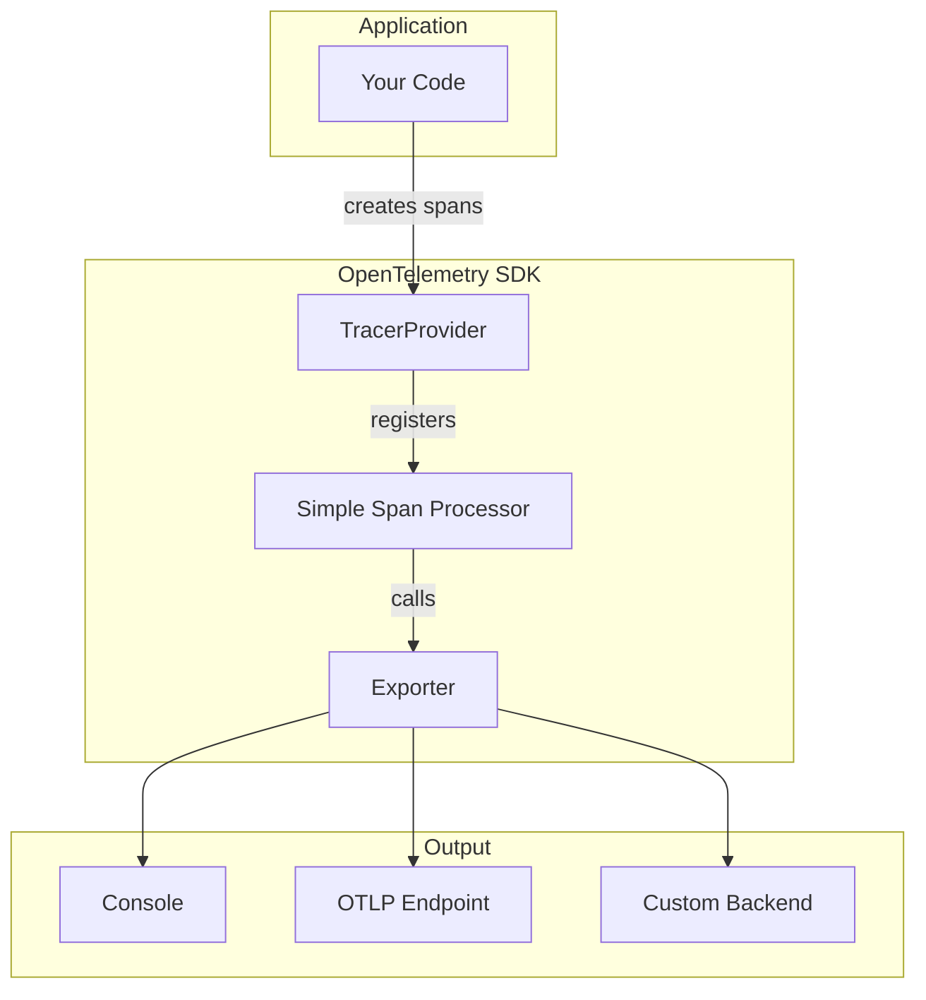
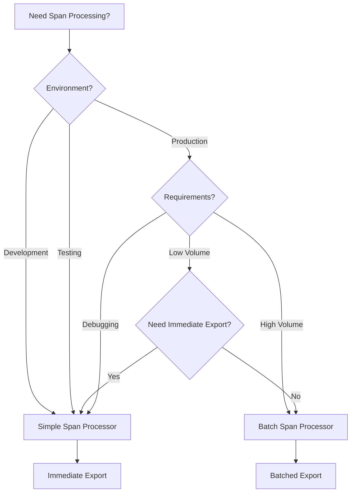

# How to Build OpenTelemetry Simple Span Processor

Author: [nawazdhandala](https://github.com/nawazdhandala)

Tags: OpenTelemetry, Tracing, Span-Processing, Debugging

Description: Learn how to build and use a Simple Span Processor in OpenTelemetry for synchronous span export, ideal for debugging and development workflows.

---

> In distributed tracing, **how** spans are processed and exported matters just as much as **what** data they contain.

OpenTelemetry provides two main span processor types: the **Batch Span Processor** (optimized for production) and the **Simple Span Processor** (optimized for debugging and development). Understanding when and how to build a Simple Span Processor can significantly improve your development workflow and debugging capabilities.

This guide walks you through the architecture, implementation, and practical use cases of the Simple Span Processor in OpenTelemetry.

---

## Table of Contents

1. What is a Span Processor?
2. Simple vs Batch Span Processor
3. Architecture Overview
4. Building a Simple Span Processor from Scratch
5. Using the Built-in Simple Span Processor
6. Custom Simple Span Processor Implementations
7. When to Use Simple Span Processor
8. Performance Considerations
9. Testing and Debugging with Simple Span Processor
10. Best Practices

---

## 1. What is a Span Processor?

A Span Processor is a component in the OpenTelemetry tracing pipeline that sits between the tracer and the exporter. It intercepts spans at two key lifecycle points:

| Lifecycle Hook | When It Fires | Common Use Cases |
|----------------|---------------|------------------|
| `onStart` | When a span begins | Add attributes, inject context, start timers |
| `onEnd` | When a span ends | Filter spans, transform data, trigger export |

The span processor decides **when** and **how** spans are sent to the configured exporter.



---

## 2. Simple vs Batch Span Processor

Understanding the difference between these two processors is critical for choosing the right one.

| Feature | Simple Span Processor | Batch Span Processor |
|---------|----------------------|---------------------|
| Export Timing | Immediately on span end | Batched with delay |
| Blocking | Yes (synchronous) | No (asynchronous) |
| Performance Impact | Higher per-span overhead | Lower amortized overhead |
| Data Loss Risk | Lower (immediate export) | Higher (buffer can be lost) |
| Best For | Debugging, testing, low-volume | Production, high-volume |
| Memory Usage | Lower (no buffering) | Higher (maintains queue) |



---

## 3. Architecture Overview

The Simple Span Processor follows a straightforward architecture.



The core interface that a Simple Span Processor must implement includes the following methods.

```typescript
interface SpanProcessor {
  onStart(span: Span, parentContext: Context): void;
  onEnd(span: ReadableSpan): void;
  shutdown(): Promise<void>;
  forceFlush(): Promise<void>;
}
```

---

## 4. Building a Simple Span Processor from Scratch

Let us build a Simple Span Processor from scratch to understand how it works internally.

First, install the required dependencies.

```bash
npm install @opentelemetry/api @opentelemetry/sdk-trace-base
```

Now create the custom Simple Span Processor implementation.

```typescript
// simple-span-processor.ts
import {
  SpanProcessor,
  ReadableSpan,
  Span,
  SpanExporter,
  ExportResult,
  ExportResultCode
} from '@opentelemetry/sdk-trace-base';
import { Context } from '@opentelemetry/api';

export class CustomSimpleSpanProcessor implements SpanProcessor {
  private readonly exporter: SpanExporter;
  private isShutdown: boolean = false;

  constructor(exporter: SpanExporter) {
    this.exporter = exporter;
  }

  // Called when a span starts - useful for adding initial attributes
  onStart(span: Span, parentContext: Context): void {
    // Simple processor typically does nothing on start
    // But you can add custom logic here
    console.log(`[SimpleProcessor] Span started: ${span.name}`);
  }

  // Called when a span ends - this is where we export
  onEnd(span: ReadableSpan): void {
    if (this.isShutdown) {
      return;
    }

    // Check if the span is sampled (should be exported)
    if (!span.spanContext().traceFlags) {
      return;
    }

    // Export synchronously - this is the key difference from BatchSpanProcessor
    this.exporter.export([span], (result: ExportResult) => {
      if (result.code !== ExportResultCode.SUCCESS) {
        console.error(
          `[SimpleProcessor] Export failed for span: ${span.name}`,
          result.error
        );
      }
    });
  }

  // Force flush any pending exports
  async forceFlush(): Promise<void> {
    // Simple processor exports immediately, so nothing to flush
    // But we should still call the exporter's forceFlush if available
    if (this.exporter.forceFlush) {
      return this.exporter.forceFlush();
    }
    return Promise.resolve();
  }

  // Shutdown the processor and exporter
  async shutdown(): Promise<void> {
    if (this.isShutdown) {
      return;
    }
    this.isShutdown = true;
    return this.exporter.shutdown();
  }
}
```

Here is how to use this custom processor with a tracer provider.

```typescript
// main.ts
import { NodeTracerProvider } from '@opentelemetry/sdk-trace-node';
import { ConsoleSpanExporter } from '@opentelemetry/sdk-trace-base';
import { CustomSimpleSpanProcessor } from './simple-span-processor';

// Create exporter (console for debugging)
const exporter = new ConsoleSpanExporter();

// Create our custom simple span processor
const processor = new CustomSimpleSpanProcessor(exporter);

// Create and configure the tracer provider
const provider = new NodeTracerProvider();
provider.addSpanProcessor(processor);
provider.register();

// Get a tracer and create spans
const tracer = provider.getTracer('example-tracer');

async function runExample() {
  const span = tracer.startSpan('test-operation');
  span.setAttribute('example.key', 'example-value');

  // Simulate some work
  await new Promise(resolve => setTimeout(resolve, 100));

  span.end(); // This triggers immediate export!

  // Graceful shutdown
  await provider.shutdown();
}

runExample();
```

---

## 5. Using the Built-in Simple Span Processor

OpenTelemetry SDK provides a built-in Simple Span Processor that you can use directly.

```typescript
// using-builtin.ts
import { NodeTracerProvider } from '@opentelemetry/sdk-trace-node';
import {
  SimpleSpanProcessor,
  ConsoleSpanExporter
} from '@opentelemetry/sdk-trace-base';
import { OTLPTraceExporter } from '@opentelemetry/exporter-trace-otlp-http';

// For debugging: export to console
const consoleExporter = new ConsoleSpanExporter();
const consoleProcessor = new SimpleSpanProcessor(consoleExporter);

// For development: export to local collector
const otlpExporter = new OTLPTraceExporter({
  url: 'http://localhost:4318/v1/traces'
});
const otlpProcessor = new SimpleSpanProcessor(otlpExporter);

// Create provider with both processors
const provider = new NodeTracerProvider();
provider.addSpanProcessor(consoleProcessor);
provider.addSpanProcessor(otlpProcessor);
provider.register();
```

You can also configure it through environment-based setup.

```typescript
// env-based-setup.ts
import { NodeSDK } from '@opentelemetry/sdk-node';
import { SimpleSpanProcessor, ConsoleSpanExporter } from '@opentelemetry/sdk-trace-base';
import { OTLPTraceExporter } from '@opentelemetry/exporter-trace-otlp-http';
import { Resource } from '@opentelemetry/resources';
import { SemanticResourceAttributes } from '@opentelemetry/semantic-conventions';

const isDevelopment = process.env.NODE_ENV !== 'production';

// Choose processor based on environment
function createSpanProcessor() {
  if (isDevelopment) {
    // Use SimpleSpanProcessor for immediate feedback during development
    const exporter = new ConsoleSpanExporter();
    return new SimpleSpanProcessor(exporter);
  }

  // Production would use BatchSpanProcessor (not shown here)
  const exporter = new OTLPTraceExporter({
    url: process.env.OTEL_EXPORTER_OTLP_ENDPOINT
  });
  return new SimpleSpanProcessor(exporter);
}

const sdk = new NodeSDK({
  resource: new Resource({
    [SemanticResourceAttributes.SERVICE_NAME]: 'my-service',
  }),
  spanProcessor: createSpanProcessor(),
});

sdk.start();
```

---

## 6. Custom Simple Span Processor Implementations

You can extend the Simple Span Processor for specific use cases.

This filtering processor only exports spans that match certain criteria.

```typescript
// filtering-processor.ts
import {
  SpanProcessor,
  ReadableSpan,
  Span,
  SpanExporter,
  ExportResultCode
} from '@opentelemetry/sdk-trace-base';
import { Context, SpanStatusCode } from '@opentelemetry/api';

interface FilterConfig {
  minDurationMs?: number;
  includeErrors?: boolean;
  includeNames?: string[];
  excludeNames?: string[];
}

export class FilteringSimpleSpanProcessor implements SpanProcessor {
  private readonly exporter: SpanExporter;
  private readonly config: FilterConfig;
  private isShutdown: boolean = false;

  constructor(exporter: SpanExporter, config: FilterConfig = {}) {
    this.exporter = exporter;
    this.config = {
      minDurationMs: 0,
      includeErrors: true,
      includeNames: [],
      excludeNames: [],
      ...config
    };
  }

  onStart(span: Span, parentContext: Context): void {
    // No-op
  }

  onEnd(span: ReadableSpan): void {
    if (this.isShutdown) return;

    // Apply filters
    if (!this.shouldExport(span)) {
      return;
    }

    this.exporter.export([span], (result) => {
      if (result.code !== ExportResultCode.SUCCESS) {
        console.error(`Export failed: ${result.error}`);
      }
    });
  }

  private shouldExport(span: ReadableSpan): boolean {
    const { minDurationMs, includeErrors, includeNames, excludeNames } = this.config;

    // Always include errors if configured
    if (includeErrors && span.status.code === SpanStatusCode.ERROR) {
      return true;
    }

    // Check exclusion list
    if (excludeNames && excludeNames.length > 0) {
      if (excludeNames.some(name => span.name.includes(name))) {
        return false;
      }
    }

    // Check inclusion list
    if (includeNames && includeNames.length > 0) {
      if (!includeNames.some(name => span.name.includes(name))) {
        return false;
      }
    }

    // Check minimum duration
    if (minDurationMs && minDurationMs > 0) {
      const durationMs = (span.endTime[0] - span.startTime[0]) * 1000 +
                         (span.endTime[1] - span.startTime[1]) / 1e6;
      if (durationMs < minDurationMs) {
        return false;
      }
    }

    return true;
  }

  async forceFlush(): Promise<void> {
    if (this.exporter.forceFlush) {
      return this.exporter.forceFlush();
    }
  }

  async shutdown(): Promise<void> {
    if (this.isShutdown) return;
    this.isShutdown = true;
    return this.exporter.shutdown();
  }
}

// Usage
const filteringProcessor = new FilteringSimpleSpanProcessor(
  new ConsoleSpanExporter(),
  {
    minDurationMs: 100,        // Only export spans > 100ms
    includeErrors: true,       // Always include errors
    excludeNames: ['healthz'], // Skip health checks
  }
);
```

This logging processor adds detailed logging for debugging purposes.

```typescript
// logging-processor.ts
import {
  SpanProcessor,
  ReadableSpan,
  Span,
  SpanExporter,
  ExportResultCode
} from '@opentelemetry/sdk-trace-base';
import { Context, SpanStatusCode } from '@opentelemetry/api';

export class LoggingSimpleSpanProcessor implements SpanProcessor {
  private readonly exporter: SpanExporter;
  private readonly serviceName: string;
  private isShutdown: boolean = false;
  private spanCount: number = 0;

  constructor(exporter: SpanExporter, serviceName: string = 'unknown') {
    this.exporter = exporter;
    this.serviceName = serviceName;
  }

  onStart(span: Span, parentContext: Context): void {
    this.spanCount++;
    console.log(JSON.stringify({
      event: 'span_start',
      service: this.serviceName,
      span_name: span.name,
      trace_id: span.spanContext().traceId,
      span_id: span.spanContext().spanId,
      timestamp: new Date().toISOString(),
      total_spans: this.spanCount
    }));
  }

  onEnd(span: ReadableSpan): void {
    if (this.isShutdown) return;

    const durationMs = (span.endTime[0] - span.startTime[0]) * 1000 +
                       (span.endTime[1] - span.startTime[1]) / 1e6;

    console.log(JSON.stringify({
      event: 'span_end',
      service: this.serviceName,
      span_name: span.name,
      trace_id: span.spanContext().traceId,
      span_id: span.spanContext().spanId,
      duration_ms: durationMs.toFixed(2),
      status: span.status.code === SpanStatusCode.ERROR ? 'ERROR' : 'OK',
      attributes: Object.fromEntries(
        Array.from(span.attributes).map(([k, v]) => [k, v])
      ),
      timestamp: new Date().toISOString()
    }));

    this.exporter.export([span], (result) => {
      if (result.code !== ExportResultCode.SUCCESS) {
        console.error(`Export failed: ${result.error}`);
      }
    });
  }

  async forceFlush(): Promise<void> {
    console.log(`[${this.serviceName}] Force flush called, total spans: ${this.spanCount}`);
    if (this.exporter.forceFlush) {
      return this.exporter.forceFlush();
    }
  }

  async shutdown(): Promise<void> {
    console.log(`[${this.serviceName}] Shutdown, total spans processed: ${this.spanCount}`);
    if (this.isShutdown) return;
    this.isShutdown = true;
    return this.exporter.shutdown();
  }
}
```

---

## 7. When to Use Simple Span Processor

The Simple Span Processor is ideal for specific scenarios.



Use Simple Span Processor when you need immediate span visibility during debugging, are running integration tests that verify trace output, have low-volume applications where batching overhead is not justified, need to debug trace context propagation issues, or want to ensure no data loss on application crash.

Use Batch Span Processor when you are in production with high request volumes, need to minimize per-request latency overhead, want to reduce network calls to the backend, or can tolerate potential data loss on ungraceful shutdown.

---

## 8. Performance Considerations

Understanding the performance implications helps you make informed decisions.

```typescript
// performance-comparison.ts
import { NodeTracerProvider } from '@opentelemetry/sdk-trace-node';
import {
  SimpleSpanProcessor,
  BatchSpanProcessor,
  ConsoleSpanExporter,
  InMemorySpanExporter
} from '@opentelemetry/sdk-trace-base';

async function benchmarkProcessor(
  processorType: 'simple' | 'batch',
  spanCount: number
): Promise<number> {
  const exporter = new InMemorySpanExporter();

  const processor = processorType === 'simple'
    ? new SimpleSpanProcessor(exporter)
    : new BatchSpanProcessor(exporter);

  const provider = new NodeTracerProvider();
  provider.addSpanProcessor(processor);
  provider.register();

  const tracer = provider.getTracer('benchmark');

  const startTime = performance.now();

  for (let i = 0; i < spanCount; i++) {
    const span = tracer.startSpan(`operation-${i}`);
    span.setAttribute('index', i);
    span.end();
  }

  await provider.forceFlush();
  const endTime = performance.now();

  await provider.shutdown();

  return endTime - startTime;
}

// Run benchmark
async function runBenchmark() {
  const spanCounts = [100, 1000, 10000];

  console.log('Processor Performance Comparison');
  console.log('================================');

  for (const count of spanCounts) {
    const simpleTime = await benchmarkProcessor('simple', count);
    const batchTime = await benchmarkProcessor('batch', count);

    console.log(`\nSpan Count: ${count}`);
    console.log(`  Simple Processor: ${simpleTime.toFixed(2)}ms`);
    console.log(`  Batch Processor:  ${batchTime.toFixed(2)}ms`);
    console.log(`  Ratio: ${(simpleTime / batchTime).toFixed(2)}x`);
  }
}

runBenchmark();
```

Typical benchmark results show the following pattern.

| Span Count | Simple Processor | Batch Processor | Simple/Batch Ratio |
|------------|------------------|-----------------|-------------------|
| 100        | ~15ms            | ~12ms           | 1.25x             |
| 1,000      | ~120ms           | ~45ms           | 2.67x             |
| 10,000     | ~1,100ms         | ~280ms          | 3.93x             |

---

## 9. Testing and Debugging with Simple Span Processor

The Simple Span Processor is excellent for testing scenarios.

```typescript
// testing-utils.ts
import { NodeTracerProvider } from '@opentelemetry/sdk-trace-node';
import {
  SimpleSpanProcessor,
  InMemorySpanExporter,
  ReadableSpan
} from '@opentelemetry/sdk-trace-base';
import { trace, context, SpanStatusCode } from '@opentelemetry/api';

export class TestTracer {
  private provider: NodeTracerProvider;
  private exporter: InMemorySpanExporter;

  constructor() {
    this.exporter = new InMemorySpanExporter();
    this.provider = new NodeTracerProvider();
    this.provider.addSpanProcessor(new SimpleSpanProcessor(this.exporter));
    this.provider.register();
  }

  getTracer(name: string) {
    return this.provider.getTracer(name);
  }

  getFinishedSpans(): ReadableSpan[] {
    return this.exporter.getFinishedSpans();
  }

  getSpansByName(name: string): ReadableSpan[] {
    return this.getFinishedSpans().filter(s => s.name === name);
  }

  reset(): void {
    this.exporter.reset();
  }

  async shutdown(): Promise<void> {
    await this.provider.shutdown();
  }
}

// Example test using the utility
import { describe, it, expect, beforeEach, afterAll } from 'vitest';

describe('Order Service Tracing', () => {
  let testTracer: TestTracer;

  beforeEach(() => {
    testTracer = new TestTracer();
  });

  afterAll(async () => {
    await testTracer.shutdown();
  });

  it('should create spans for order creation', async () => {
    const tracer = testTracer.getTracer('order-service');

    // Simulate order creation
    const span = tracer.startSpan('order.create');
    span.setAttribute('order.items', 3);
    span.setAttribute('order.total', 99.99);
    span.end();

    // Verify spans immediately (thanks to SimpleSpanProcessor)
    const spans = testTracer.getSpansByName('order.create');

    expect(spans).toHaveLength(1);
    expect(spans[0].attributes['order.items']).toBe(3);
    expect(spans[0].attributes['order.total']).toBe(99.99);
  });

  it('should record errors correctly', async () => {
    const tracer = testTracer.getTracer('order-service');

    const span = tracer.startSpan('order.payment');
    span.recordException(new Error('Payment declined'));
    span.setStatus({ code: SpanStatusCode.ERROR, message: 'Payment failed' });
    span.end();

    const spans = testTracer.getSpansByName('order.payment');

    expect(spans[0].status.code).toBe(SpanStatusCode.ERROR);
    expect(spans[0].events).toHaveLength(1);
    expect(spans[0].events[0].name).toBe('exception');
  });
});
```

Here is how to create a debugging helper for development.

```typescript
// debug-helper.ts
import { NodeTracerProvider } from '@opentelemetry/sdk-trace-node';
import { SimpleSpanProcessor, ReadableSpan, SpanExporter, ExportResult, ExportResultCode } from '@opentelemetry/sdk-trace-base';
import { SpanStatusCode } from '@opentelemetry/api';

// Custom exporter that formats spans nicely for debugging
class DebugSpanExporter implements SpanExporter {
  export(spans: ReadableSpan[], resultCallback: (result: ExportResult) => void): void {
    spans.forEach(span => {
      const duration = (span.endTime[0] - span.startTime[0]) * 1000 +
                       (span.endTime[1] - span.startTime[1]) / 1e6;

      const statusIcon = span.status.code === SpanStatusCode.ERROR ? 'X' : 'OK';
      const indent = '  '.repeat(this.getDepth(span));

      console.log(`${indent}[${statusIcon}] ${span.name} (${duration.toFixed(2)}ms)`);
      console.log(`${indent}    trace: ${span.spanContext().traceId}`);
      console.log(`${indent}    span:  ${span.spanContext().spanId}`);

      if (Object.keys(span.attributes).length > 0) {
        console.log(`${indent}    attrs: ${JSON.stringify(span.attributes)}`);
      }

      if (span.events.length > 0) {
        console.log(`${indent}    events: ${span.events.map(e => e.name).join(', ')}`);
      }

      console.log('');
    });

    resultCallback({ code: ExportResultCode.SUCCESS });
  }

  private getDepth(span: ReadableSpan): number {
    // Simplified depth calculation
    return span.parentSpanId ? 1 : 0;
  }

  async shutdown(): Promise<void> {}
  async forceFlush(): Promise<void> {}
}

// Setup for debugging
export function setupDebugTracing() {
  const provider = new NodeTracerProvider();
  provider.addSpanProcessor(new SimpleSpanProcessor(new DebugSpanExporter()));
  provider.register();

  console.log('Debug tracing enabled - spans will be printed immediately');

  return provider;
}
```

---

## 10. Best Practices

Follow these guidelines when using Simple Span Processor.

**Use environment-based configuration** to switch between processor types.

```typescript
// best-practices.ts
import { NodeTracerProvider } from '@opentelemetry/sdk-trace-node';
import {
  SimpleSpanProcessor,
  BatchSpanProcessor,
  ConsoleSpanExporter,
  SpanProcessor
} from '@opentelemetry/sdk-trace-base';
import { OTLPTraceExporter } from '@opentelemetry/exporter-trace-otlp-http';

function createOptimalProcessor(): SpanProcessor {
  const env = process.env.NODE_ENV || 'development';
  const debugMode = process.env.OTEL_DEBUG === 'true';

  // Development: use Simple for immediate feedback
  if (env === 'development' || debugMode) {
    console.log('Using SimpleSpanProcessor for development/debug mode');
    return new SimpleSpanProcessor(new ConsoleSpanExporter());
  }

  // Test: use Simple with in-memory for assertions
  if (env === 'test') {
    const { InMemorySpanExporter } = require('@opentelemetry/sdk-trace-base');
    console.log('Using SimpleSpanProcessor with InMemoryExporter for testing');
    return new SimpleSpanProcessor(new InMemorySpanExporter());
  }

  // Production: use Batch for performance
  console.log('Using BatchSpanProcessor for production');
  return new BatchSpanProcessor(
    new OTLPTraceExporter({
      url: process.env.OTEL_EXPORTER_OTLP_ENDPOINT
    }),
    {
      maxQueueSize: 2048,
      maxExportBatchSize: 512,
      scheduledDelayMillis: 5000,
    }
  );
}

const provider = new NodeTracerProvider();
provider.addSpanProcessor(createOptimalProcessor());
provider.register();
```

**Handle shutdown gracefully** to ensure all spans are exported.

```typescript
// graceful-shutdown.ts
import { NodeTracerProvider } from '@opentelemetry/sdk-trace-node';
import { SimpleSpanProcessor, ConsoleSpanExporter } from '@opentelemetry/sdk-trace-base';

const provider = new NodeTracerProvider();
provider.addSpanProcessor(new SimpleSpanProcessor(new ConsoleSpanExporter()));
provider.register();

// Graceful shutdown handlers
async function shutdown() {
  console.log('Shutting down tracing...');

  try {
    // Force flush ensures any pending spans are exported
    await provider.forceFlush();
    await provider.shutdown();
    console.log('Tracing shutdown complete');
  } catch (error) {
    console.error('Error during tracing shutdown:', error);
  }
}

process.on('SIGTERM', shutdown);
process.on('SIGINT', shutdown);

// For uncaught exceptions
process.on('uncaughtException', async (error) => {
  console.error('Uncaught exception:', error);
  await shutdown();
  process.exit(1);
});
```

---

## Summary

| Aspect | Simple Span Processor |
|--------|----------------------|
| Export Timing | Immediate, synchronous |
| Best Environment | Development, testing, debugging |
| Performance | Lower throughput, higher per-span cost |
| Data Safety | Higher (no buffering) |
| Complexity | Lower (straightforward implementation) |
| Use Case | Debugging, low-volume, testing assertions |

The Simple Span Processor is a powerful tool for development and debugging workflows. While it is not optimized for high-volume production use, its immediate export behavior makes it invaluable for understanding trace flow, debugging context propagation, and writing reliable tests.

Key takeaways:

1. Use Simple Span Processor during development for immediate span visibility
2. Build custom processors to add filtering, logging, or transformation logic
3. Switch to Batch Span Processor for production workloads
4. Leverage Simple Span Processor in tests for reliable span assertions
5. Always implement proper shutdown handling

---

*Want to see your traces in action? Send them via OTLP to [OneUptime](https://oneuptime.com) and get full-fidelity distributed tracing with metrics and logs correlation.*

---

**Related Reading:**

- [What are Traces and Spans in OpenTelemetry: A Practical Guide](https://oneuptime.com/blog/post/2025-08-27-traces-and-spans-in-opentelemetry/view)
- [How to reduce noise in OpenTelemetry?](https://oneuptime.com/blog/post/2025-08-25-how-to-reduce-noise-in-opentelemetry/view)
- [What is OpenTelemetry Collector and Why Use One?](https://oneuptime.com/blog/post/2025-09-18-what-is-opentelemetry-collector-and-why-use-one/view)
