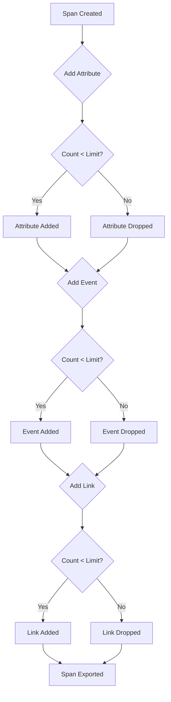
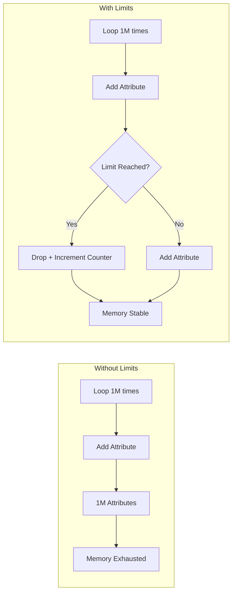
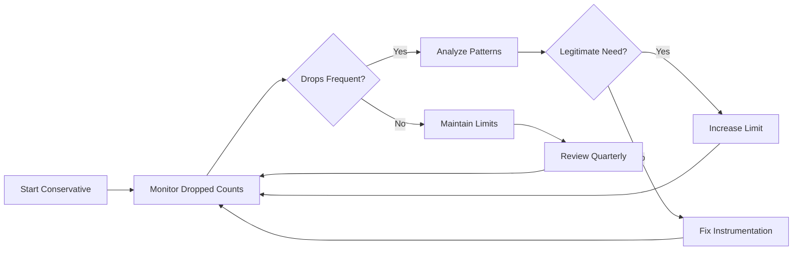
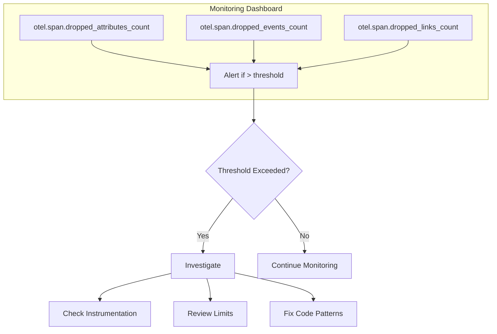

# How to Implement OpenTelemetry Span Limits

Author: [nawazdhandala](https://github.com/nawazdhandala)

Tags: OpenTelemetry, Tracing, Configuration, Performance

Description: A practical guide to configuring OpenTelemetry span limits to control memory usage, prevent unbounded growth, and maintain reliable distributed tracing in production systems.

> Spans without limits are memory leaks waiting to happen.

OpenTelemetry is powerful, but power without guardrails leads to outages. When spans accumulate unbounded attributes, events, or links, your application can exhaust memory, slow down, or crash entirely. Span limits are your safety net.

This guide covers:

1. What span limits are and why they matter
2. Default limits in OpenTelemetry SDKs
3. How to configure limits in various languages
4. Best practices for production environments
5. Monitoring and debugging limit-related issues

---

## What Are Span Limits?

Span limits define the maximum number of attributes, events, and links that a single span can hold. They act as circuit breakers, preventing any single span from consuming excessive memory.



### The Three Core Limits

| Limit Type | What It Controls | Default Value |
|------------|------------------|---------------|
| `AttributeCountLimit` | Max attributes per span | 128 |
| `EventCountLimit` | Max events per span | 128 |
| `LinkCountLimit` | Max links per span | 128 |

Additionally, there are limits on attribute value lengths:

| Limit Type | What It Controls | Default Value |
|------------|------------------|---------------|
| `AttributeValueLengthLimit` | Max length of string attribute values | No limit (unlimited) |

---

## Why Span Limits Matter

### Memory Protection

Without limits, a single misbehaving span could allocate gigabytes of memory:



### Common Scenarios That Trigger Limits

1. **Unbounded loops** adding attributes dynamically
2. **Large payloads** being logged as span events
3. **Fan-out operations** creating excessive links
4. **Error handling** adding stack traces as events repeatedly

---

## Default Limits by SDK

OpenTelemetry SDKs ship with sensible defaults, but they vary slightly:

| Language | Attributes | Events | Links | Attribute Length |
|----------|------------|--------|-------|------------------|
| Java | 128 | 128 | 128 | Unlimited |
| Python | 128 | 128 | 128 | Unlimited |
| Node.js | 128 | 128 | 128 | Unlimited |
| Go | 128 | 128 | 128 | Unlimited |
| .NET | 128 | 128 | 128 | Unlimited |

---

## Configuring Span Limits

### Node.js (JavaScript/TypeScript)

#### Using Environment Variables

The simplest approach uses environment variables:

```bash
# Set span limits via environment
export OTEL_SPAN_ATTRIBUTE_COUNT_LIMIT=64
export OTEL_SPAN_EVENT_COUNT_LIMIT=64
export OTEL_SPAN_LINK_COUNT_LIMIT=64
export OTEL_SPAN_ATTRIBUTE_VALUE_LENGTH_LIMIT=1024
```

#### Programmatic Configuration

For more control, configure limits in code:

```typescript
import { NodeSDK } from '@opentelemetry/sdk-node';
import { SpanLimits } from '@opentelemetry/sdk-trace-base';
import { OTLPTraceExporter } from '@opentelemetry/exporter-trace-otlp-http';
import { Resource } from '@opentelemetry/resources';
import { ATTR_SERVICE_NAME } from '@opentelemetry/semantic-conventions';

// Define custom span limits
const spanLimits: SpanLimits = {
  attributeCountLimit: 64,
  eventCountLimit: 32,
  linkCountLimit: 32,
  attributeValueLengthLimit: 1024,
  attributePerEventCountLimit: 16,
  attributePerLinkCountLimit: 16,
};

const sdk = new NodeSDK({
  resource: new Resource({
    [ATTR_SERVICE_NAME]: 'my-service',
  }),
  traceExporter: new OTLPTraceExporter({
    url: 'https://oneuptime.com/otlp/v1/traces',
  }),
  spanLimits,
});

sdk.start();

console.log('OpenTelemetry SDK initialized with custom span limits');
```

#### Complete Express Application Example

```typescript
// tracing.ts
import { NodeSDK } from '@opentelemetry/sdk-node';
import { getNodeAutoInstrumentations } from '@opentelemetry/auto-instrumentations-node';
import { OTLPTraceExporter } from '@opentelemetry/exporter-trace-otlp-http';
import { Resource } from '@opentelemetry/resources';
import { ATTR_SERVICE_NAME, ATTR_DEPLOYMENT_ENVIRONMENT } from '@opentelemetry/semantic-conventions';

const spanLimits = {
  attributeCountLimit: parseInt(process.env.OTEL_SPAN_ATTR_LIMIT || '64', 10),
  eventCountLimit: parseInt(process.env.OTEL_SPAN_EVENT_LIMIT || '32', 10),
  linkCountLimit: parseInt(process.env.OTEL_SPAN_LINK_LIMIT || '32', 10),
  attributeValueLengthLimit: parseInt(process.env.OTEL_SPAN_ATTR_VALUE_LIMIT || '2048', 10),
};

const sdk = new NodeSDK({
  resource: new Resource({
    [ATTR_SERVICE_NAME]: process.env.OTEL_SERVICE_NAME || 'express-api',
    [ATTR_DEPLOYMENT_ENVIRONMENT]: process.env.NODE_ENV || 'development',
  }),
  traceExporter: new OTLPTraceExporter({
    url: process.env.OTEL_EXPORTER_OTLP_ENDPOINT || 'https://oneuptime.com/otlp/v1/traces',
    headers: {
      'x-oneuptime-token': process.env.ONEUPTIME_TOKEN || '',
    },
  }),
  instrumentations: [getNodeAutoInstrumentations()],
  spanLimits,
});

sdk.start();

process.on('SIGTERM', () => {
  sdk.shutdown()
    .then(() => console.log('SDK shut down successfully'))
    .catch((err) => console.error('Error shutting down SDK', err))
    .finally(() => process.exit(0));
});

export { sdk };
```

```typescript
// app.ts
import './tracing'; // Must be first import
import express from 'express';
import { trace, SpanStatusCode } from '@opentelemetry/api';

const app = express();
const tracer = trace.getTracer('express-api');

app.get('/api/process', async (req, res) => {
  const span = tracer.startSpan('process-request');

  try {
    // Safe: limited attributes
    span.setAttribute('request.id', req.query.id as string);
    span.setAttribute('request.type', 'process');

    // Simulate processing
    const result = await processData(span);

    span.setStatus({ code: SpanStatusCode.OK });
    res.json({ success: true, result });
  } catch (error: any) {
    span.setStatus({ code: SpanStatusCode.ERROR, message: error.message });
    span.recordException(error);
    res.status(500).json({ error: error.message });
  } finally {
    span.end();
  }
});

async function processData(parentSpan: any) {
  const span = tracer.startSpan('process-data', {
    attributes: { 'operation.type': 'data-processing' },
  });

  try {
    // Add events with limits in mind
    span.addEvent('processing-started', { itemCount: 100 });

    // Simulate work
    await new Promise(resolve => setTimeout(resolve, 50));

    span.addEvent('processing-completed', {
      processedCount: 100,
      duration: '50ms'
    });

    return { processed: 100 };
  } finally {
    span.end();
  }
}

app.listen(3000, () => {
  console.log('Server running on port 3000');
});
```

### Python

#### Environment Variables

```bash
export OTEL_SPAN_ATTRIBUTE_COUNT_LIMIT=64
export OTEL_SPAN_EVENT_COUNT_LIMIT=64
export OTEL_SPAN_LINK_COUNT_LIMIT=64
export OTEL_SPAN_ATTRIBUTE_VALUE_LENGTH_LIMIT=1024
```

#### Programmatic Configuration

```python
from opentelemetry import trace
from opentelemetry.sdk.trace import TracerProvider, SpanLimits
from opentelemetry.sdk.trace.export import BatchSpanProcessor
from opentelemetry.exporter.otlp.proto.http.trace_exporter import OTLPSpanExporter
from opentelemetry.sdk.resources import Resource, SERVICE_NAME

# Define custom span limits
span_limits = SpanLimits(
    max_attributes=64,
    max_events=32,
    max_links=32,
    max_attribute_length=1024,
    max_event_attributes=16,
    max_link_attributes=16,
)

# Create resource
resource = Resource.create({
    SERVICE_NAME: "python-api"
})

# Create tracer provider with limits
provider = TracerProvider(
    resource=resource,
    span_limits=span_limits
)

# Add exporter
exporter = OTLPSpanExporter(
    endpoint="https://oneuptime.com/otlp/v1/traces",
    headers={"x-oneuptime-token": "your-token"}
)
provider.add_span_processor(BatchSpanProcessor(exporter))

# Set global tracer provider
trace.set_tracer_provider(provider)

# Get tracer
tracer = trace.get_tracer(__name__)
```

#### FastAPI Example with Span Limits

```python
import os
from fastapi import FastAPI, Request
from opentelemetry import trace
from opentelemetry.sdk.trace import TracerProvider, SpanLimits
from opentelemetry.sdk.trace.export import BatchSpanProcessor
from opentelemetry.exporter.otlp.proto.http.trace_exporter import OTLPSpanExporter
from opentelemetry.sdk.resources import Resource, SERVICE_NAME
from opentelemetry.instrumentation.fastapi import FastAPIInstrumentor

# Configure span limits from environment or defaults
span_limits = SpanLimits(
    max_attributes=int(os.getenv("OTEL_SPAN_ATTR_LIMIT", "64")),
    max_events=int(os.getenv("OTEL_SPAN_EVENT_LIMIT", "32")),
    max_links=int(os.getenv("OTEL_SPAN_LINK_LIMIT", "32")),
    max_attribute_length=int(os.getenv("OTEL_SPAN_ATTR_VALUE_LIMIT", "2048")),
)

resource = Resource.create({
    SERVICE_NAME: os.getenv("OTEL_SERVICE_NAME", "fastapi-service")
})

provider = TracerProvider(resource=resource, span_limits=span_limits)
provider.add_span_processor(
    BatchSpanProcessor(
        OTLPSpanExporter(
            endpoint=os.getenv("OTEL_EXPORTER_OTLP_ENDPOINT", "https://oneuptime.com/otlp/v1/traces")
        )
    )
)
trace.set_tracer_provider(provider)

app = FastAPI()
FastAPIInstrumentor.instrument_app(app)

tracer = trace.get_tracer(__name__)

@app.get("/api/items/{item_id}")
async def get_item(item_id: str, request: Request):
    with tracer.start_as_current_span("fetch-item") as span:
        span.set_attribute("item.id", item_id)
        span.add_event("item-lookup-started")

        # Simulate database lookup
        item = {"id": item_id, "name": "Example Item"}

        span.add_event("item-lookup-completed", {"found": True})
        return item
```

### Go

```go
package main

import (
    "context"
    "log"
    "os"
    "strconv"

    "go.opentelemetry.io/otel"
    "go.opentelemetry.io/otel/attribute"
    "go.opentelemetry.io/otel/exporters/otlp/otlptrace/otlptracehttp"
    "go.opentelemetry.io/otel/sdk/resource"
    sdktrace "go.opentelemetry.io/otel/sdk/trace"
    semconv "go.opentelemetry.io/otel/semconv/v1.24.0"
)

func getEnvInt(key string, defaultVal int) int {
    if val := os.Getenv(key); val != "" {
        if i, err := strconv.Atoi(val); err == nil {
            return i
        }
    }
    return defaultVal
}

func initTracer() (*sdktrace.TracerProvider, error) {
    ctx := context.Background()

    exporter, err := otlptracehttp.New(ctx,
        otlptracehttp.WithEndpoint("oneuptime.com"),
        otlptracehttp.WithURLPath("/otlp/v1/traces"),
    )
    if err != nil {
        return nil, err
    }

    res, err := resource.New(ctx,
        resource.WithAttributes(
            semconv.ServiceName("go-service"),
        ),
    )
    if err != nil {
        return nil, err
    }

    // Configure span limits
    spanLimits := sdktrace.SpanLimits{
        AttributeCountLimit:         getEnvInt("OTEL_SPAN_ATTR_LIMIT", 64),
        EventCountLimit:             getEnvInt("OTEL_SPAN_EVENT_LIMIT", 32),
        LinkCountLimit:              getEnvInt("OTEL_SPAN_LINK_LIMIT", 32),
        AttributeValueLengthLimit:   getEnvInt("OTEL_SPAN_ATTR_VALUE_LIMIT", 2048),
        AttributePerEventCountLimit: getEnvInt("OTEL_SPAN_EVENT_ATTR_LIMIT", 16),
        AttributePerLinkCountLimit:  getEnvInt("OTEL_SPAN_LINK_ATTR_LIMIT", 16),
    }

    tp := sdktrace.NewTracerProvider(
        sdktrace.WithBatcher(exporter),
        sdktrace.WithResource(res),
        sdktrace.WithSpanLimits(spanLimits),
    )

    otel.SetTracerProvider(tp)
    return tp, nil
}

func main() {
    tp, err := initTracer()
    if err != nil {
        log.Fatalf("Failed to initialize tracer: %v", err)
    }
    defer tp.Shutdown(context.Background())

    tracer := otel.Tracer("example")

    ctx, span := tracer.Start(context.Background(), "operation")
    defer span.End()

    // Add attributes safely within limits
    span.SetAttributes(
        attribute.String("operation.type", "example"),
        attribute.Int("operation.count", 42),
    )

    span.AddEvent("processing", attribute.String("status", "started"))

    // Your application logic here

    span.AddEvent("processing", attribute.String("status", "completed"))

    log.Println("Operation completed")
}
```

### Java

```java
package com.example;

import io.opentelemetry.api.OpenTelemetry;
import io.opentelemetry.api.trace.Span;
import io.opentelemetry.api.trace.Tracer;
import io.opentelemetry.exporter.otlp.http.trace.OtlpHttpSpanExporter;
import io.opentelemetry.sdk.OpenTelemetrySdk;
import io.opentelemetry.sdk.resources.Resource;
import io.opentelemetry.sdk.trace.SdkTracerProvider;
import io.opentelemetry.sdk.trace.SpanLimits;
import io.opentelemetry.sdk.trace.export.BatchSpanProcessor;
import io.opentelemetry.semconv.ResourceAttributes;

public class TracingConfig {

    public static OpenTelemetry initOpenTelemetry() {
        // Configure span limits
        SpanLimits spanLimits = SpanLimits.builder()
            .setMaxNumberOfAttributes(64)
            .setMaxNumberOfEvents(32)
            .setMaxNumberOfLinks(32)
            .setMaxAttributeValueLength(2048)
            .setMaxNumberOfAttributesPerEvent(16)
            .setMaxNumberOfAttributesPerLink(16)
            .build();

        Resource resource = Resource.getDefault()
            .merge(Resource.create(
                io.opentelemetry.api.common.Attributes.of(
                    ResourceAttributes.SERVICE_NAME, "java-service"
                )
            ));

        OtlpHttpSpanExporter spanExporter = OtlpHttpSpanExporter.builder()
            .setEndpoint("https://oneuptime.com/otlp/v1/traces")
            .addHeader("x-oneuptime-token", System.getenv("ONEUPTIME_TOKEN"))
            .build();

        SdkTracerProvider tracerProvider = SdkTracerProvider.builder()
            .setResource(resource)
            .setSpanLimits(spanLimits)
            .addSpanProcessor(BatchSpanProcessor.builder(spanExporter).build())
            .build();

        return OpenTelemetrySdk.builder()
            .setTracerProvider(tracerProvider)
            .buildAndRegisterGlobal();
    }

    public static void main(String[] args) {
        OpenTelemetry openTelemetry = initOpenTelemetry();
        Tracer tracer = openTelemetry.getTracer("example");

        Span span = tracer.spanBuilder("operation").startSpan();
        try {
            span.setAttribute("operation.type", "example");
            span.addEvent("processing-started");

            // Your application logic here

            span.addEvent("processing-completed");
        } finally {
            span.end();
        }
    }
}
```

---

## Best Practices for Production

### 1. Set Conservative Limits

Start with lower limits and increase only when needed:



### 2. Recommended Limits by Use Case

| Use Case | Attributes | Events | Links | Value Length |
|----------|------------|--------|-------|--------------|
| High-volume API | 32 | 16 | 8 | 512 |
| Standard service | 64 | 32 | 16 | 1024 |
| Complex workflow | 128 | 64 | 32 | 2048 |
| Debug/Development | 256 | 128 | 64 | 4096 |

### 3. Avoid Common Pitfalls

#### Bad: Unbounded Loop Adding Attributes

```typescript
// DANGEROUS: Can exceed limits quickly
for (const item of items) {
  span.setAttribute(`item.${item.id}`, item.value);
}
```

#### Good: Aggregate Before Adding

```typescript
// SAFE: Single attribute with summary
span.setAttribute('items.count', items.length);
span.setAttribute('items.total_value', items.reduce((sum, i) => sum + i.value, 0));

// If details needed, use an event
span.addEvent('items-processed', {
  'items.ids': items.slice(0, 10).map(i => i.id).join(','),
  'items.truncated': items.length > 10,
});
```

#### Bad: Large Payloads as Attributes

```typescript
// DANGEROUS: Can hit value length limit or consume memory
span.setAttribute('request.body', JSON.stringify(largePayload));
```

#### Good: Summarize or Sample

```typescript
// SAFE: Summary information only
span.setAttribute('request.body.size', JSON.stringify(largePayload).length);
span.setAttribute('request.body.keys', Object.keys(largePayload).join(','));

// If needed, truncate explicitly
const preview = JSON.stringify(largePayload).slice(0, 256);
span.setAttribute('request.body.preview', preview);
```

### 4. Use Events for Sequences

Instead of many attributes, use events for sequence data:

```typescript
// Better approach for sequential data
const span = tracer.startSpan('batch-process');

for (let i = 0; i < items.length && i < 32; i++) {
  span.addEvent('item-processed', {
    'item.id': items[i].id,
    'item.status': items[i].status,
  });
}

if (items.length > 32) {
  span.addEvent('items-truncated', {
    'total.count': items.length,
    'processed.count': 32,
  });
}

span.end();
```

---

## Monitoring Dropped Telemetry

### Track Dropped Counts

OpenTelemetry SDKs track when limits are exceeded. Monitor these metrics:



### Node.js Dropped Count Logging

```typescript
import { trace, context } from '@opentelemetry/api';

function logSpanStats(span: any) {
  // Access internal span data for monitoring
  const spanData = (span as any)._spanContext;

  // Log if approaching limits
  console.log({
    spanId: span.spanContext().spanId,
    attributeCount: Object.keys(span.attributes || {}).length,
    eventCount: (span.events || []).length,
    linkCount: (span.links || []).length,
  });
}
```

### Collector Metrics Pipeline

Configure the OpenTelemetry Collector to expose dropped telemetry metrics:

```yaml
receivers:
  otlp:
    protocols:
      grpc:
      http:

processors:
  batch:
    send_batch_size: 512
    timeout: 5s

exporters:
  otlphttp:
    endpoint: "https://oneuptime.com/otlp"
    headers:
      "x-oneuptime-token": "${ONEUPTIME_TOKEN}"

  prometheus:
    endpoint: "0.0.0.0:8889"
    namespace: "otel_collector"

service:
  telemetry:
    metrics:
      address: ":8888"
  pipelines:
    traces:
      receivers: [otlp]
      processors: [batch]
      exporters: [otlphttp]
```

---

## Troubleshooting Guide

### Symptom: Spans Missing Expected Attributes

**Cause**: Attribute count limit exceeded

**Solution**:
1. Check `OTEL_SPAN_ATTRIBUTE_COUNT_LIMIT`
2. Review code for unbounded attribute additions
3. Aggregate or summarize instead of individual attributes

### Symptom: Events Not Appearing in Traces

**Cause**: Event count limit exceeded

**Solution**:
1. Check `OTEL_SPAN_EVENT_COUNT_LIMIT`
2. Reduce event frequency (sample events)
3. Combine related events

### Symptom: Truncated String Values

**Cause**: Attribute value length limit applied

**Solution**:
1. Check `OTEL_SPAN_ATTRIBUTE_VALUE_LENGTH_LIMIT`
2. Summarize large values
3. Move large data to logs with trace correlation

### Symptom: Memory Usage Still High

**Cause**: Limits too high or many concurrent spans

**Solution**:
1. Lower limits further
2. Review span creation patterns
3. Implement sampling to reduce span count

---

## Environment Variable Reference

| Variable | Description | Default |
|----------|-------------|---------|
| `OTEL_SPAN_ATTRIBUTE_COUNT_LIMIT` | Max attributes per span | 128 |
| `OTEL_SPAN_EVENT_COUNT_LIMIT` | Max events per span | 128 |
| `OTEL_SPAN_LINK_COUNT_LIMIT` | Max links per span | 128 |
| `OTEL_SPAN_ATTRIBUTE_VALUE_LENGTH_LIMIT` | Max string attribute length | Unlimited |
| `OTEL_EVENT_ATTRIBUTE_COUNT_LIMIT` | Max attributes per event | 128 |
| `OTEL_LINK_ATTRIBUTE_COUNT_LIMIT` | Max attributes per link | 128 |

---

## Key Takeaways

- **Span limits protect your application** from memory exhaustion caused by unbounded telemetry
- **Configure limits explicitly** rather than relying on defaults in production
- **Start conservative** and increase only when monitoring shows legitimate need
- **Aggregate data** instead of adding many individual attributes
- **Use events wisely** for sequence data but respect event limits
- **Monitor dropped counts** to detect instrumentation issues early
- **Environment variables** provide easy configuration without code changes

> Remember: The goal of observability is insight, not volume. Well-configured limits ensure you capture what matters without overwhelming your systems.

---

### Related Reading

- [How to reduce noise in OpenTelemetry?](https://oneuptime.com/blog/post/how-to-reduce-noise-in-opentelemetry/view)
- [What are Traces and Spans in OpenTelemetry?](https://oneuptime.com/blog/post/traces-and-spans-in-opentelemetry/view)
- [How to name spans in OpenTelemetry?](https://oneuptime.com/blog/post/how-to-name-spans-in-opentelemetry/view)
- [How to structure logs properly in OpenTelemetry?](https://oneuptime.com/blog/post/how-to-structure-logs-properly-in-opentelemetry/view)
