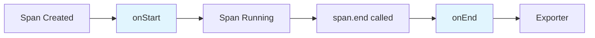
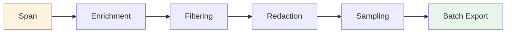

# How to Create Custom OpenTelemetry Span Processors

Author: [nawazdhandala](https://github.com/nawazdhandala)

Tags: OpenTelemetry, Observability, Tracing, DevOps

Description: Learn how to build custom span processors in OpenTelemetry to filter, transform, and enrich telemetry data before export, with practical examples in Node.js and Python.

---

Span processors are the gatekeepers of your tracing pipeline. They sit between span creation and export, giving you control over what gets sent, how it gets transformed, and when it gets flushed. While OpenTelemetry provides built-in processors like `SimpleSpanProcessor` and `BatchSpanProcessor`, custom processors unlock powerful capabilities: filtering noise, redacting sensitive data, enriching spans with runtime context, and implementing custom sampling logic.

This guide walks through building custom span processors from scratch, with practical examples you can adapt to your production needs.

---

## Table of Contents

1. What Are Span Processors?
2. The Span Processor Interface
3. Building a Simple Custom Processor
4. Filtering Spans by Attributes
5. Redacting Sensitive Data
6. Adding Dynamic Attributes
7. Implementing Custom Sampling
8. Chaining Multiple Processors
9. Performance Considerations
10. Testing Custom Processors
11. Production Patterns

---

## 1. What Are Span Processors?

Span processors intercept spans at two critical points in their lifecycle:



| Hook | When It Fires | What You Can Do |
|------|---------------|-----------------|
| `onStart` | Immediately when span begins | Add attributes, modify span name, set parent context |
| `onEnd` | When `span.end()` is called | Filter, transform, route to exporters, sample |

The processor decides whether a span reaches your observability backend. This is your last chance to modify, drop, or enrich data before it leaves the application.

---

## 2. The Span Processor Interface

Every span processor implements a simple interface. Here is the structure in both Node.js and Python.

### Node.js Interface

```typescript
import { SpanProcessor, ReadableSpan, Span } from '@opentelemetry/sdk-trace-base';
import { Context } from '@opentelemetry/api';

interface SpanProcessor {
  // Called when a span starts - span is writable here
  onStart(span: Span, parentContext: Context): void;

  // Called when a span ends - span is read-only here
  onEnd(span: ReadableSpan): void;

  // Flush any pending spans (for batching)
  forceFlush(): Promise<void>;

  // Clean shutdown
  shutdown(): Promise<void>;
}
```

### Python Interface

```python
from opentelemetry.sdk.trace import SpanProcessor, ReadableSpan
from opentelemetry.trace import Span
from opentelemetry.context import Context

class SpanProcessor:
    def on_start(self, span: Span, parent_context: Context) -> None:
        """Called when a span starts. Span is mutable."""
        pass

    def on_end(self, span: ReadableSpan) -> None:
        """Called when a span ends. Span is read-only."""
        pass

    def force_flush(self, timeout_millis: int = 30000) -> bool:
        """Flush pending spans."""
        return True

    def shutdown(self) -> None:
        """Clean up resources."""
        pass
```

---

## 3. Building a Simple Custom Processor

Let's start with a basic processor that logs span information for debugging purposes.

### Node.js: Debug Logging Processor

The following processor logs basic span information when spans start and end. This is useful during development to understand your trace flow.

```typescript
import {
  SpanProcessor,
  ReadableSpan,
  Span,
} from '@opentelemetry/sdk-trace-base';
import { Context } from '@opentelemetry/api';

export class DebugSpanProcessor implements SpanProcessor {
  private serviceName: string;

  constructor(serviceName: string) {
    this.serviceName = serviceName;
  }

  // Log when spans start to track request flow
  onStart(span: Span, parentContext: Context): void {
    console.log(`[${this.serviceName}] Span started: ${span.name}`);
  }

  // Log completed span details including duration
  onEnd(span: ReadableSpan): void {
    const durationMs = (span.endTime[0] - span.startTime[0]) * 1000 +
      (span.endTime[1] - span.startTime[1]) / 1e6;

    console.log(
      `[${this.serviceName}] Span ended: ${span.name} ` +
      `(${durationMs.toFixed(2)}ms) ` +
      `status=${span.status.code}`
    );
  }

  async forceFlush(): Promise<void> {
    // Nothing to flush for sync logging
  }

  async shutdown(): Promise<void> {
    console.log(`[${this.serviceName}] Debug processor shutting down`);
  }
}
```

### Python: Debug Logging Processor

```python
import time
from opentelemetry.sdk.trace import SpanProcessor, ReadableSpan
from opentelemetry.trace import Span
from opentelemetry.context import Context

class DebugSpanProcessor(SpanProcessor):
    """Logs span lifecycle events for debugging."""

    def __init__(self, service_name: str):
        self.service_name = service_name

    def on_start(self, span: Span, parent_context: Context) -> None:
        print(f"[{self.service_name}] Span started: {span.name}")

    def on_end(self, span: ReadableSpan) -> None:
        # Calculate duration in milliseconds
        duration_ns = span.end_time - span.start_time
        duration_ms = duration_ns / 1e6

        print(
            f"[{self.service_name}] Span ended: {span.name} "
            f"({duration_ms:.2f}ms) status={span.status.status_code.name}"
        )

    def force_flush(self, timeout_millis: int = 30000) -> bool:
        return True

    def shutdown(self) -> None:
        print(f"[{self.service_name}] Debug processor shutting down")
```

### Registering the Processor

Here is how to wire up your custom processor with the OpenTelemetry SDK.

```typescript
// Node.js registration
import { NodeTracerProvider } from '@opentelemetry/sdk-trace-node';
import { BatchSpanProcessor } from '@opentelemetry/sdk-trace-base';
import { OTLPTraceExporter } from '@opentelemetry/exporter-trace-otlp-http';
import { DebugSpanProcessor } from './debug-processor';

const provider = new NodeTracerProvider();

// Add debug processor first (for development only)
if (process.env.NODE_ENV === 'development') {
  provider.addSpanProcessor(new DebugSpanProcessor('my-service'));
}

// Add batch processor for actual export
const exporter = new OTLPTraceExporter({
  url: process.env.OTEL_EXPORTER_OTLP_ENDPOINT,
});
provider.addSpanProcessor(new BatchSpanProcessor(exporter));

provider.register();
```

---

## 4. Filtering Spans by Attributes

One of the most common use cases is filtering out noisy spans. Health checks, readiness probes, and internal metrics endpoints can flood your traces with low-value data.

### Node.js: Attribute Filter Processor

This processor wraps another processor and only forwards spans that pass your filter criteria.

```typescript
import {
  SpanProcessor,
  ReadableSpan,
  Span,
} from '@opentelemetry/sdk-trace-base';
import { Context } from '@opentelemetry/api';

// Configuration for which spans to filter
interface FilterConfig {
  // Drop spans matching these URL patterns
  dropUrlPatterns: RegExp[];
  // Drop spans with these exact names
  dropSpanNames: string[];
  // Only keep spans longer than this (milliseconds)
  minDurationMs?: number;
}

export class FilteringSpanProcessor implements SpanProcessor {
  private downstream: SpanProcessor;
  private config: FilterConfig;

  constructor(downstream: SpanProcessor, config: FilterConfig) {
    this.downstream = downstream;
    this.config = config;
  }

  onStart(span: Span, parentContext: Context): void {
    // Always call downstream onStart - filtering happens in onEnd
    this.downstream.onStart(span, parentContext);
  }

  onEnd(span: ReadableSpan): void {
    // Check if span should be dropped
    if (this.shouldDrop(span)) {
      return; // Skip downstream - span is effectively dropped
    }

    this.downstream.onEnd(span);
  }

  private shouldDrop(span: ReadableSpan): boolean {
    // Check span name blacklist
    if (this.config.dropSpanNames.includes(span.name)) {
      return true;
    }

    // Check URL patterns (for HTTP spans)
    const httpTarget = span.attributes['http.target'] as string;
    const httpUrl = span.attributes['http.url'] as string;
    const urlToCheck = httpTarget || httpUrl;

    if (urlToCheck) {
      for (const pattern of this.config.dropUrlPatterns) {
        if (pattern.test(urlToCheck)) {
          return true;
        }
      }
    }

    // Check minimum duration
    if (this.config.minDurationMs !== undefined) {
      const durationMs =
        (span.endTime[0] - span.startTime[0]) * 1000 +
        (span.endTime[1] - span.startTime[1]) / 1e6;

      if (durationMs < this.config.minDurationMs) {
        return true;
      }
    }

    return false;
  }

  async forceFlush(): Promise<void> {
    return this.downstream.forceFlush();
  }

  async shutdown(): Promise<void> {
    return this.downstream.shutdown();
  }
}
```

### Usage Example

Configure the filter to drop health checks and fast spans.

```typescript
import { BatchSpanProcessor } from '@opentelemetry/sdk-trace-base';
import { OTLPTraceExporter } from '@opentelemetry/exporter-trace-otlp-http';
import { FilteringSpanProcessor } from './filtering-processor';

const exporter = new OTLPTraceExporter();
const batchProcessor = new BatchSpanProcessor(exporter);

// Wrap the batch processor with filtering
const filteringProcessor = new FilteringSpanProcessor(batchProcessor, {
  dropUrlPatterns: [
    /^\/health$/,
    /^\/healthz$/,
    /^\/ready$/,
    /^\/metrics$/,
    /^\/favicon\.ico$/,
  ],
  dropSpanNames: [
    'OPTIONS',  // CORS preflight
    'HEAD',     // Health probes
  ],
  minDurationMs: 1,  // Drop sub-millisecond spans
});

provider.addSpanProcessor(filteringProcessor);
```

---

## 5. Redacting Sensitive Data

Before sending traces to external backends, you may need to scrub PII, API keys, or other sensitive information from span attributes.

### Node.js: Redaction Processor

This processor sanitizes sensitive attributes while preserving the span structure for debugging.

```typescript
import {
  SpanProcessor,
  ReadableSpan,
  Span,
} from '@opentelemetry/sdk-trace-base';
import { Context, AttributeValue } from '@opentelemetry/api';

interface RedactionConfig {
  // Attribute keys to fully redact
  redactKeys: string[];
  // Patterns to match in attribute values
  redactPatterns: { pattern: RegExp; replacement: string }[];
  // Keys containing these substrings get redacted
  sensitiveKeySubstrings: string[];
}

export class RedactingSpanProcessor implements SpanProcessor {
  private downstream: SpanProcessor;
  private config: RedactionConfig;

  constructor(downstream: SpanProcessor, config: RedactionConfig) {
    this.downstream = downstream;
    this.config = config;
  }

  onStart(span: Span, parentContext: Context): void {
    this.downstream.onStart(span, parentContext);
  }

  onEnd(span: ReadableSpan): void {
    // Create a proxy that redacts sensitive attributes on access
    const redactedSpan = this.createRedactedSpan(span);
    this.downstream.onEnd(redactedSpan);
  }

  private createRedactedSpan(span: ReadableSpan): ReadableSpan {
    const redactedAttributes: Record<string, AttributeValue> = {};

    // Process each attribute
    for (const [key, value] of Object.entries(span.attributes)) {
      redactedAttributes[key] = this.redactValue(key, value);
    }

    // Return a new object with redacted attributes
    // Spread original span properties and override attributes
    return {
      ...span,
      attributes: redactedAttributes,
    };
  }

  private redactValue(key: string, value: AttributeValue): AttributeValue {
    // Check if key should be fully redacted
    if (this.config.redactKeys.includes(key)) {
      return '[REDACTED]';
    }

    // Check if key contains sensitive substrings
    const keyLower = key.toLowerCase();
    for (const substring of this.config.sensitiveKeySubstrings) {
      if (keyLower.includes(substring.toLowerCase())) {
        return '[REDACTED]';
      }
    }

    // Apply pattern-based redaction to string values
    if (typeof value === 'string') {
      let redacted = value;
      for (const { pattern, replacement } of this.config.redactPatterns) {
        redacted = redacted.replace(pattern, replacement);
      }
      return redacted;
    }

    return value;
  }

  async forceFlush(): Promise<void> {
    return this.downstream.forceFlush();
  }

  async shutdown(): Promise<void> {
    return this.downstream.shutdown();
  }
}
```

### Usage with Common Patterns

Configure redaction for emails, API keys, and other sensitive data.

```typescript
const redactingProcessor = new RedactingSpanProcessor(batchProcessor, {
  // These keys get fully redacted
  redactKeys: [
    'db.statement',        // SQL queries may contain sensitive data
    'http.request.body',   // Request bodies often have PII
    'user.email',
  ],
  // Sensitive key name patterns
  sensitiveKeySubstrings: [
    'password',
    'secret',
    'token',
    'apikey',
    'api_key',
    'authorization',
    'credential',
    'ssn',
    'credit_card',
  ],
  // Pattern-based redaction for values
  redactPatterns: [
    // Email addresses
    {
      pattern: /[a-zA-Z0-9._%+-]+@[a-zA-Z0-9.-]+\.[a-zA-Z]{2,}/g,
      replacement: '[EMAIL]',
    },
    // Credit card numbers (basic pattern)
    {
      pattern: /\b\d{4}[\s-]?\d{4}[\s-]?\d{4}[\s-]?\d{4}\b/g,
      replacement: '[CARD]',
    },
    // Bearer tokens
    {
      pattern: /Bearer\s+[A-Za-z0-9\-_]+\.[A-Za-z0-9\-_]+\.[A-Za-z0-9\-_]*/g,
      replacement: 'Bearer [TOKEN]',
    },
    // AWS access keys
    {
      pattern: /AKIA[0-9A-Z]{16}/g,
      replacement: '[AWS_KEY]',
    },
  ],
});
```

---

## 6. Adding Dynamic Attributes

Enrich spans with runtime context that is not available when the span is created. This is useful for adding deployment information, feature flags, or computed metrics.

### Node.js: Enrichment Processor

```typescript
import {
  SpanProcessor,
  ReadableSpan,
  Span,
} from '@opentelemetry/sdk-trace-base';
import { Context } from '@opentelemetry/api';
import * as os from 'os';

// Function type for dynamic attribute providers
type AttributeProvider = () => Record<string, string | number | boolean>;

export class EnrichmentSpanProcessor implements SpanProcessor {
  private downstream: SpanProcessor;
  private staticAttributes: Record<string, string | number | boolean>;
  private dynamicProviders: AttributeProvider[];

  constructor(
    downstream: SpanProcessor,
    options: {
      staticAttributes?: Record<string, string | number | boolean>;
      dynamicProviders?: AttributeProvider[];
    } = {}
  ) {
    this.downstream = downstream;
    this.staticAttributes = options.staticAttributes || {};
    this.dynamicProviders = options.dynamicProviders || [];
  }

  onStart(span: Span, parentContext: Context): void {
    // Add static attributes immediately
    for (const [key, value] of Object.entries(this.staticAttributes)) {
      span.setAttribute(key, value);
    }

    // Add dynamic attributes
    for (const provider of this.dynamicProviders) {
      try {
        const attrs = provider();
        for (const [key, value] of Object.entries(attrs)) {
          span.setAttribute(key, value);
        }
      } catch (error) {
        // Log but do not fail span creation
        console.error('Error in attribute provider:', error);
      }
    }

    this.downstream.onStart(span, parentContext);
  }

  onEnd(span: ReadableSpan): void {
    this.downstream.onEnd(span);
  }

  async forceFlush(): Promise<void> {
    return this.downstream.forceFlush();
  }

  async shutdown(): Promise<void> {
    return this.downstream.shutdown();
  }
}

// Helper: Common attribute providers
export const commonProviders = {
  // Add system resource info
  systemInfo: (): Record<string, string | number> => ({
    'host.name': os.hostname(),
    'host.arch': os.arch(),
    'process.pid': process.pid,
    'process.runtime.version': process.version,
  }),

  // Add memory usage
  memoryUsage: (): Record<string, number> => {
    const usage = process.memoryUsage();
    return {
      'process.memory.heap_used': usage.heapUsed,
      'process.memory.heap_total': usage.heapTotal,
      'process.memory.rss': usage.rss,
    };
  },

  // Add git info (if available at build time)
  gitInfo: (): Record<string, string> => ({
    'vcs.commit': process.env.GIT_COMMIT || 'unknown',
    'vcs.branch': process.env.GIT_BRANCH || 'unknown',
  }),
};
```

### Usage with Feature Flags

```typescript
import { EnrichmentSpanProcessor, commonProviders } from './enrichment-processor';

// Feature flag integration
function featureFlagProvider(): Record<string, boolean> {
  // In reality, this would call your feature flag service
  return {
    'feature.new_checkout': true,
    'feature.experimental_search': false,
  };
}

const enrichmentProcessor = new EnrichmentSpanProcessor(batchProcessor, {
  staticAttributes: {
    'deployment.environment': process.env.NODE_ENV || 'development',
    'deployment.region': process.env.AWS_REGION || 'unknown',
    'service.version': process.env.SERVICE_VERSION || '0.0.0',
  },
  dynamicProviders: [
    commonProviders.systemInfo,
    featureFlagProvider,
  ],
});
```

---

## 7. Implementing Custom Sampling

While OpenTelemetry provides built-in samplers, you can implement application-specific sampling logic in a span processor for more complex scenarios.

### Node.js: Priority-Based Sampling Processor

This processor implements smart sampling that always keeps errors and slow spans, while sampling normal traffic.

```typescript
import {
  SpanProcessor,
  ReadableSpan,
  Span,
} from '@opentelemetry/sdk-trace-base';
import { Context, SpanStatusCode } from '@opentelemetry/api';

interface SamplingConfig {
  // Base sample rate for normal traffic (0.0 to 1.0)
  baseSampleRate: number;
  // Always keep spans slower than this (milliseconds)
  slowThresholdMs: number;
  // Always keep spans for these operations
  alwaysKeepOperations: string[];
  // Sample rate for specific operations (overrides base rate)
  operationRates: Record<string, number>;
}

export class PrioritySamplingProcessor implements SpanProcessor {
  private downstream: SpanProcessor;
  private config: SamplingConfig;
  private spanDecisions: Map<string, boolean> = new Map();

  constructor(downstream: SpanProcessor, config: SamplingConfig) {
    this.downstream = downstream;
    this.config = config;
  }

  onStart(span: Span, parentContext: Context): void {
    // Make sampling decision at start and store it
    const spanId = span.spanContext().spanId;
    const decision = this.makeSamplingDecision(span);
    this.spanDecisions.set(spanId, decision);

    // Always call downstream - decision is enforced in onEnd
    this.downstream.onStart(span, parentContext);
  }

  onEnd(span: ReadableSpan): void {
    const spanId = span.spanContext().spanId;
    let shouldKeep = this.spanDecisions.get(spanId) || false;
    this.spanDecisions.delete(spanId); // Clean up

    // Override decision for important spans
    shouldKeep = shouldKeep || this.isHighPriority(span);

    if (shouldKeep) {
      this.downstream.onEnd(span);
    }
    // If not keeping, span is silently dropped
  }

  private makeSamplingDecision(span: Span): boolean {
    const name = span.name;

    // Check if operation should always be kept
    if (this.config.alwaysKeepOperations.includes(name)) {
      return true;
    }

    // Check for operation-specific rate
    const operationRate = this.config.operationRates[name];
    const rate = operationRate !== undefined
      ? operationRate
      : this.config.baseSampleRate;

    // Random sampling based on rate
    return Math.random() < rate;
  }

  private isHighPriority(span: ReadableSpan): boolean {
    // Always keep errors
    if (span.status.code === SpanStatusCode.ERROR) {
      return true;
    }

    // Always keep slow spans
    const durationMs =
      (span.endTime[0] - span.startTime[0]) * 1000 +
      (span.endTime[1] - span.startTime[1]) / 1e6;

    if (durationMs > this.config.slowThresholdMs) {
      return true;
    }

    // Check for error status codes in HTTP spans
    const statusCode = span.attributes['http.status_code'] as number;
    if (statusCode && statusCode >= 500) {
      return true;
    }

    return false;
  }

  async forceFlush(): Promise<void> {
    return this.downstream.forceFlush();
  }

  async shutdown(): Promise<void> {
    this.spanDecisions.clear();
    return this.downstream.shutdown();
  }
}
```

### Usage Example

```typescript
const samplingProcessor = new PrioritySamplingProcessor(batchProcessor, {
  baseSampleRate: 0.1,  // 10% of normal traffic
  slowThresholdMs: 500, // Always keep spans over 500ms
  alwaysKeepOperations: [
    'payment.process',
    'order.create',
    'user.signup',
  ],
  operationRates: {
    'healthcheck': 0.001,    // 0.1% of health checks
    'db.query': 0.05,        // 5% of DB queries
    'cache.get': 0.01,       // 1% of cache hits
    'checkout.complete': 1.0, // 100% of checkouts
  },
});
```

---

## 8. Chaining Multiple Processors

OpenTelemetry supports multiple span processors. They execute in order, allowing you to build processing pipelines.



### Node.js: Complete Pipeline Example

```typescript
import { NodeTracerProvider } from '@opentelemetry/sdk-trace-node';
import { BatchSpanProcessor } from '@opentelemetry/sdk-trace-base';
import { OTLPTraceExporter } from '@opentelemetry/exporter-trace-otlp-http';

import { EnrichmentSpanProcessor, commonProviders } from './enrichment-processor';
import { FilteringSpanProcessor } from './filtering-processor';
import { RedactingSpanProcessor } from './redacting-processor';
import { PrioritySamplingProcessor } from './sampling-processor';

// Create the base exporter and batch processor
const exporter = new OTLPTraceExporter({
  url: process.env.OTEL_EXPORTER_OTLP_ENDPOINT || 'http://localhost:4318/v1/traces',
});
const batchProcessor = new BatchSpanProcessor(exporter);

// Build the processing pipeline (innermost to outermost)
// Order: Sampling -> Redaction -> Filtering -> Enrichment -> Batch Export
const samplingProcessor = new PrioritySamplingProcessor(batchProcessor, {
  baseSampleRate: 0.1,
  slowThresholdMs: 500,
  alwaysKeepOperations: ['payment.process', 'order.create'],
  operationRates: {},
});

const redactingProcessor = new RedactingSpanProcessor(samplingProcessor, {
  redactKeys: ['db.statement', 'http.request.body'],
  sensitiveKeySubstrings: ['password', 'token', 'secret'],
  redactPatterns: [
    { pattern: /[a-zA-Z0-9._%+-]+@[a-zA-Z0-9.-]+\.[a-zA-Z]{2,}/g, replacement: '[EMAIL]' },
  ],
});

const filteringProcessor = new FilteringSpanProcessor(redactingProcessor, {
  dropUrlPatterns: [/^\/health$/, /^\/metrics$/],
  dropSpanNames: ['OPTIONS'],
  minDurationMs: 1,
});

const enrichmentProcessor = new EnrichmentSpanProcessor(filteringProcessor, {
  staticAttributes: {
    'deployment.environment': process.env.NODE_ENV || 'development',
  },
  dynamicProviders: [commonProviders.systemInfo],
});

// Register with provider
const provider = new NodeTracerProvider();
provider.addSpanProcessor(enrichmentProcessor);
provider.register();
```

---

## 9. Performance Considerations

Custom span processors run in the hot path of your application. Keep these guidelines in mind.

### Do's and Don'ts

| Do | Don't |
|------|--------|
| Keep processing logic simple and fast | Make blocking I/O calls in processors |
| Use synchronous operations where possible | Do expensive computation in `onEnd` |
| Cache computed values | Create new objects unnecessarily |
| Fail gracefully (catch errors) | Let exceptions propagate |
| Clean up resources in `shutdown()` | Leak memory with unbounded collections |

### Memory Management

If your processor maintains state (like the sampling processor above), ensure you clean up.

```typescript
export class StatefulProcessor implements SpanProcessor {
  private state: Map<string, any> = new Map();
  private maxEntries = 10000;  // Prevent unbounded growth

  onStart(span: Span, parentContext: Context): void {
    // Enforce size limit
    if (this.state.size > this.maxEntries) {
      // Remove oldest entries
      const keysToDelete = Array.from(this.state.keys())
        .slice(0, this.state.size - this.maxEntries + 1000);
      keysToDelete.forEach(key => this.state.delete(key));
    }

    this.state.set(span.spanContext().spanId, { /* data */ });
  }

  onEnd(span: ReadableSpan): void {
    this.state.delete(span.spanContext().spanId);
    // Process span...
  }

  async shutdown(): Promise<void> {
    this.state.clear();
  }
}
```

---

## 10. Testing Custom Processors

Test your processors in isolation using mock spans.

### Node.js: Testing with Jest

```typescript
import { Span, ReadableSpan } from '@opentelemetry/sdk-trace-base';
import { SpanStatusCode } from '@opentelemetry/api';
import { FilteringSpanProcessor } from './filtering-processor';

// Mock span factory for testing
function createMockSpan(overrides: Partial<ReadableSpan> = {}): ReadableSpan {
  return {
    name: 'test-span',
    spanContext: () => ({
      traceId: '1234567890abcdef1234567890abcdef',
      spanId: '1234567890abcdef',
      traceFlags: 1,
    }),
    startTime: [1000, 0],
    endTime: [1001, 0],
    status: { code: SpanStatusCode.OK },
    attributes: {},
    events: [],
    links: [],
    ...overrides,
  } as ReadableSpan;
}

// Mock downstream processor to capture spans
class MockProcessor {
  public spans: ReadableSpan[] = [];

  onStart() {}

  onEnd(span: ReadableSpan) {
    this.spans.push(span);
  }

  async forceFlush() {}
  async shutdown() {}
}

describe('FilteringSpanProcessor', () => {
  it('drops health check spans', () => {
    const downstream = new MockProcessor();
    const processor = new FilteringSpanProcessor(downstream, {
      dropUrlPatterns: [/^\/health$/],
      dropSpanNames: [],
    });

    // Span that should be dropped
    const healthSpan = createMockSpan({
      attributes: { 'http.target': '/health' },
    });

    // Span that should pass through
    const apiSpan = createMockSpan({
      attributes: { 'http.target': '/api/users' },
    });

    processor.onEnd(healthSpan);
    processor.onEnd(apiSpan);

    expect(downstream.spans).toHaveLength(1);
    expect(downstream.spans[0].attributes['http.target']).toBe('/api/users');
  });

  it('keeps spans above minimum duration', () => {
    const downstream = new MockProcessor();
    const processor = new FilteringSpanProcessor(downstream, {
      dropUrlPatterns: [],
      dropSpanNames: [],
      minDurationMs: 10,
    });

    // Fast span (should be dropped) - 1ms duration
    const fastSpan = createMockSpan({
      startTime: [1000, 0],
      endTime: [1000, 1000000],  // 1ms later
    });

    // Slow span (should be kept) - 50ms duration
    const slowSpan = createMockSpan({
      startTime: [1000, 0],
      endTime: [1000, 50000000],  // 50ms later
    });

    processor.onEnd(fastSpan);
    processor.onEnd(slowSpan);

    expect(downstream.spans).toHaveLength(1);
  });
});
```

---

## 11. Production Patterns

### Pattern 1: Environment-Aware Processing

Use different processor configurations based on environment.

```typescript
function createSpanProcessor(): SpanProcessor {
  const exporter = new OTLPTraceExporter({
    url: process.env.OTEL_EXPORTER_OTLP_ENDPOINT,
  });
  const batchProcessor = new BatchSpanProcessor(exporter);

  if (process.env.NODE_ENV === 'production') {
    // Production: heavy filtering, sampling, and redaction
    return new RedactingSpanProcessor(
      new PrioritySamplingProcessor(batchProcessor, {
        baseSampleRate: 0.05,  // 5% baseline
        slowThresholdMs: 1000,
        alwaysKeepOperations: ['payment.process'],
        operationRates: {},
      }),
      {
        redactKeys: ['db.statement'],
        sensitiveKeySubstrings: ['password', 'token'],
        redactPatterns: [],
      }
    );
  } else {
    // Development: keep everything for debugging
    return new FilteringSpanProcessor(batchProcessor, {
      dropUrlPatterns: [/^\/health$/],  // Still drop health checks
      dropSpanNames: [],
    });
  }
}
```

### Pattern 2: Circuit Breaker for Export Failures

Protect your application from cascading failures if the export endpoint is down.

```typescript
export class CircuitBreakerProcessor implements SpanProcessor {
  private downstream: SpanProcessor;
  private failureCount = 0;
  private lastFailure = 0;
  private isOpen = false;

  private readonly failureThreshold = 5;
  private readonly resetTimeMs = 60000;  // 1 minute

  constructor(downstream: SpanProcessor) {
    this.downstream = downstream;
  }

  onStart(span: Span, parentContext: Context): void {
    if (!this.isCircuitOpen()) {
      this.downstream.onStart(span, parentContext);
    }
  }

  onEnd(span: ReadableSpan): void {
    if (!this.isCircuitOpen()) {
      try {
        this.downstream.onEnd(span);
        this.failureCount = 0;  // Reset on success
      } catch (error) {
        this.recordFailure();
        // Span is lost, but application continues
      }
    }
  }

  private isCircuitOpen(): boolean {
    if (this.isOpen) {
      // Check if we should try to close the circuit
      if (Date.now() - this.lastFailure > this.resetTimeMs) {
        this.isOpen = false;
        this.failureCount = 0;
      }
    }
    return this.isOpen;
  }

  private recordFailure(): void {
    this.failureCount++;
    this.lastFailure = Date.now();

    if (this.failureCount >= this.failureThreshold) {
      this.isOpen = true;
      console.warn('Span processor circuit breaker opened');
    }
  }

  async forceFlush(): Promise<void> {
    if (!this.isCircuitOpen()) {
      return this.downstream.forceFlush();
    }
  }

  async shutdown(): Promise<void> {
    return this.downstream.shutdown();
  }
}
```

---

## Summary

| Processor Type | Use Case | Key Implementation Detail |
|---------------|----------|--------------------------|
| **Filtering** | Drop noise (health checks, probes) | Check attributes in `onEnd`, skip downstream call |
| **Redaction** | Remove PII before export | Create modified span copy, apply patterns |
| **Enrichment** | Add runtime context | Modify span in `onStart` when writable |
| **Sampling** | Control data volume | Make decision in `onStart`, enforce in `onEnd` |
| **Circuit Breaker** | Protect from export failures | Track failures, skip processing when open |

Custom span processors give you fine-grained control over your telemetry pipeline. Start with simple processors and compose them into pipelines as your needs grow. Remember: the goal is not to process every span identically, but to ensure the spans that reach your backend are the ones that help you understand and debug your system.

---

**Related Reading:**

- [What are Traces and Spans in OpenTelemetry: A Practical Guide](https://oneuptime.com/blog/post/2025-08-27-traces-and-spans-in-opentelemetry/view)
- [How to reduce noise in OpenTelemetry](https://oneuptime.com/blog/post/2025-08-25-how-to-reduce-noise-in-opentelemetry/view)
- [How to Instrument Express.js Applications with OpenTelemetry](https://oneuptime.com/blog/post/2026-01-06-nodejs-express-opentelemetry-instrumentation/view)
