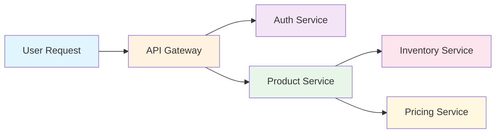
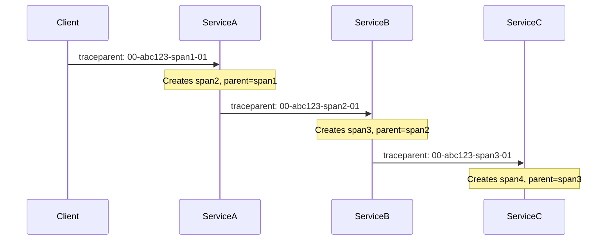
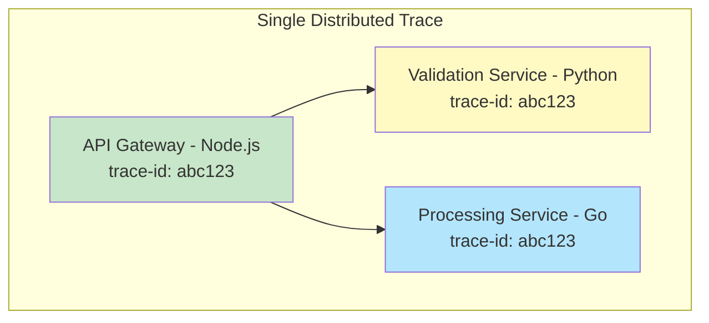

# How to Build OpenTelemetry W3C Context Propagation

Author: [nawazdhandala](https://github.com/nawazdhandala)

Tags: OpenTelemetry, W3C, Tracing, Context

Description: Learn how to implement W3C Trace Context propagation in OpenTelemetry to maintain distributed trace continuity across service boundaries.

---

> Distributed tracing only works when context flows seamlessly across every service boundary. W3C Trace Context is the standard that makes that possible.

When a request travels through multiple services, each service needs to know which trace it belongs to. Without a standard way to pass this information, traces break at service boundaries and you lose visibility into the full request journey.

W3C Trace Context solves this by defining a universal format for propagating trace information through HTTP headers. OpenTelemetry implements this standard natively, making it the default choice for modern distributed systems.

This guide walks through how W3C Trace Context works, how to implement it with OpenTelemetry, and how to handle edge cases in real production systems.

---

## Table of Contents

1. Why Context Propagation Matters
2. W3C Trace Context Standard Explained
3. The traceparent Header
4. The tracestate Header
5. Setting Up Context Propagation in Node.js
6. Injecting Context into Outbound Requests
7. Extracting Context from Inbound Requests
8. Custom Propagators for Legacy Systems
9. Cross-Language Propagation
10. Troubleshooting Broken Traces
11. Best Practices

---

## 1. Why Context Propagation Matters

In a monolith, tracing is straightforward. Every function call happens in the same process, and the call stack naturally connects everything.

In microservices, a single user request might touch dozens of services. Each service runs in its own process, often on different machines. Without explicit context propagation, each service sees only its own isolated spans with no way to connect them into a coherent trace.



Context propagation ensures that when the API Gateway calls the Auth Service, the Auth Service knows it is part of the same trace. This enables:

- End-to-end latency visibility across all services
- Root cause analysis when failures occur deep in the call chain
- Dependency mapping based on actual traffic patterns
- Accurate service-level SLO tracking

---

## 2. W3C Trace Context Standard Explained

The W3C Trace Context specification defines two HTTP headers:

| Header | Purpose | Required |
|--------|---------|----------|
| `traceparent` | Carries the core trace identity (trace ID, span ID, flags) | Yes |
| `tracestate` | Carries vendor-specific or custom trace data | No |

Before W3C Trace Context, every tracing vendor invented their own headers. Zipkin used `X-B3-TraceId`. AWS X-Ray used `X-Amzn-Trace-Id`. Jaeger used `uber-trace-id`. This fragmentation made cross-vendor tracing nearly impossible.

W3C Trace Context became a W3C Recommendation in 2020 and is now supported by all major observability platforms. OpenTelemetry uses it as the default propagation format.

---

## 3. The traceparent Header

The `traceparent` header contains four fields separated by hyphens:

```
traceparent: {version}-{trace-id}-{parent-span-id}-{trace-flags}
```

Here is a real example:

```
traceparent: 00-4bf92f3577b34da6a3ce929d0e0e4736-00f067aa0ba902b7-01
```

Breaking this down:

| Field | Value | Description |
|-------|-------|-------------|
| version | `00` | The version of the traceparent format (always 00 for now) |
| trace-id | `4bf92f3577b34da6a3ce929d0e0e4736` | 32 hex characters (128-bit) identifying the entire trace |
| parent-span-id | `00f067aa0ba902b7` | 16 hex characters (64-bit) identifying the parent span |
| trace-flags | `01` | 8-bit flags field where 01 means sampled |

The trace-id stays constant across all services in the trace. The parent-span-id changes at each hop, pointing to the span that made the outbound call.



---

## 4. The tracestate Header

The `tracestate` header carries vendor-specific data as key-value pairs:

```
tracestate: vendor1=value1,vendor2=value2
```

Common use cases include:

- Passing sampling decisions downstream
- Carrying vendor-specific correlation IDs
- Propagating tenant or environment information
- Including custom routing hints

Example with multiple vendors:

```
tracestate: oneuptime=samplerate:0.1,congo=t61rcWkgMzE
```

Rules for tracestate:

- Maximum 32 key-value pairs
- Keys must be lowercase, alphanumeric, with optional underscores
- Values can contain most printable ASCII characters except commas and equals
- Total header size should not exceed 512 bytes

When you receive a tracestate, you should preserve entries from other vendors and add or update your own entry at the beginning of the list (most recently updated first).

---

## 5. Setting Up Context Propagation in Node.js

First, install the required OpenTelemetry packages:

```bash
npm install @opentelemetry/api \
            @opentelemetry/sdk-node \
            @opentelemetry/auto-instrumentations-node \
            @opentelemetry/exporter-otlp-http
```

Create a telemetry configuration file that initializes the SDK with W3C propagation:

```typescript
// telemetry.ts
import { NodeSDK } from '@opentelemetry/sdk-node';
import { getNodeAutoInstrumentations } from '@opentelemetry/auto-instrumentations-node';
import { OTLPTraceExporter } from '@opentelemetry/exporter-otlp-http';
import { Resource } from '@opentelemetry/resources';
import {
  W3CTraceContextPropagator
} from '@opentelemetry/core';
import {
  ATTR_SERVICE_NAME,
  ATTR_SERVICE_VERSION,
} from '@opentelemetry/semantic-conventions';

const traceExporter = new OTLPTraceExporter({
  url: process.env.OTEL_EXPORTER_OTLP_ENDPOINT || 'https://otlp.oneuptime.com/v1/traces',
  headers: {
    'x-oneuptime-token': process.env.ONEUPTIME_TOKEN || '',
  },
});

export const sdk = new NodeSDK({
  resource: new Resource({
    [ATTR_SERVICE_NAME]: 'order-service',
    [ATTR_SERVICE_VERSION]: '1.0.0',
  }),
  traceExporter,
  // W3CTraceContextPropagator is the default, but shown explicitly here
  textMapPropagator: new W3CTraceContextPropagator(),
  instrumentations: [getNodeAutoInstrumentations()],
});

sdk.start();
console.log('OpenTelemetry initialized with W3C Trace Context propagation');

process.on('SIGTERM', () => {
  sdk.shutdown()
    .then(() => console.log('Telemetry shut down'))
    .catch((err) => console.error('Shutdown error', err))
    .finally(() => process.exit(0));
});
```

Import this file at the very top of your application entry point, before any other imports:

```typescript
// index.ts
import './telemetry';
import express from 'express';
// ... rest of your application
```

---

## 6. Injecting Context into Outbound Requests

When making HTTP calls to downstream services, you need to inject the current trace context into the request headers. OpenTelemetry auto-instrumentation handles this automatically for popular HTTP clients, but understanding manual injection is valuable for custom scenarios.

Auto-instrumentation handles injection automatically for fetch, axios, and the built-in http module:

```typescript
// With auto-instrumentation enabled, context is automatically injected
import axios from 'axios';

async function callDownstreamService() {
  // The traceparent header is automatically added
  const response = await axios.get('https://inventory-service/api/stock');
  return response.data;
}
```

For manual injection when auto-instrumentation is not available or you need custom control:

```typescript
import { context, propagation, trace } from '@opentelemetry/api';

async function manualOutboundCall() {
  const tracer = trace.getTracer('order-service');

  return tracer.startActiveSpan('call-inventory', async (span) => {
    try {
      // Create a carrier object for the headers
      const headers: Record<string, string> = {
        'Content-Type': 'application/json',
      };

      // Inject current context into headers
      propagation.inject(context.active(), headers);

      // headers now contains traceparent and possibly tracestate
      console.log('Injected headers:', headers);
      // Output: { 'Content-Type': 'application/json',
      //           'traceparent': '00-abc123...-def456...-01' }

      const response = await fetch('https://inventory-service/api/stock', {
        method: 'GET',
        headers,
      });

      span.setAttribute('http.status_code', response.status);
      return response.json();
    } catch (error) {
      span.recordException(error as Error);
      throw error;
    } finally {
      span.end();
    }
  });
}
```

---

## 7. Extracting Context from Inbound Requests

When your service receives a request, you need to extract the trace context from incoming headers to continue the trace. Auto-instrumentation handles this for Express, Fastify, and other popular frameworks.

Here is how extraction works manually for custom scenarios:

```typescript
import { context, propagation, trace } from '@opentelemetry/api';
import express, { Request, Response, NextFunction } from 'express';

const app = express();

// Manual context extraction middleware
function extractTraceContext(req: Request, res: Response, next: NextFunction) {
  // Extract context from incoming headers
  const extractedContext = propagation.extract(context.active(), req.headers);

  // Run the rest of the request handling within the extracted context
  context.with(extractedContext, () => {
    const tracer = trace.getTracer('order-service');

    // Start a new span as a child of the extracted context
    const span = tracer.startSpan(`${req.method} ${req.path}`, {
      kind: 1, // SpanKind.SERVER
    });

    // Store span for later access
    res.locals.span = span;

    // Ensure span ends when response finishes
    res.on('finish', () => {
      span.setAttribute('http.status_code', res.statusCode);
      span.end();
    });

    // Continue with the extracted context active
    context.with(trace.setSpan(context.active(), span), next);
  });
}

app.use(extractTraceContext);

app.get('/api/orders', (req, res) => {
  // This handler runs within the correct trace context
  // Any spans created here will be children of the server span
  res.json({ orders: [] });
});
```

With auto-instrumentation, this happens automatically. The middleware is only needed for custom frameworks or when you need special handling.

---

## 8. Custom Propagators for Legacy Systems

Sometimes you need to integrate with systems that use non-standard headers. You can create custom propagators to handle these cases.

Here is an example propagator for a legacy system using X-Custom-Trace headers:

```typescript
import {
  Context,
  TextMapGetter,
  TextMapPropagator,
  TextMapSetter,
  trace,
  TraceFlags,
} from '@opentelemetry/api';

const LEGACY_TRACE_HEADER = 'x-custom-trace-id';
const LEGACY_SPAN_HEADER = 'x-custom-span-id';

export class LegacyPropagator implements TextMapPropagator {
  inject(context: Context, carrier: unknown, setter: TextMapSetter): void {
    const spanContext = trace.getSpanContext(context);
    if (!spanContext) return;

    setter.set(carrier, LEGACY_TRACE_HEADER, spanContext.traceId);
    setter.set(carrier, LEGACY_SPAN_HEADER, spanContext.spanId);
  }

  extract(context: Context, carrier: unknown, getter: TextMapGetter): Context {
    const traceId = getter.get(carrier, LEGACY_TRACE_HEADER);
    const spanId = getter.get(carrier, LEGACY_SPAN_HEADER);

    if (!traceId || !spanId) return context;

    const extractedTraceId = Array.isArray(traceId) ? traceId[0] : traceId;
    const extractedSpanId = Array.isArray(spanId) ? spanId[0] : spanId;

    const spanContext = {
      traceId: extractedTraceId.padStart(32, '0'),
      spanId: extractedSpanId.padStart(16, '0'),
      traceFlags: TraceFlags.SAMPLED,
      isRemote: true,
    };

    return trace.setSpanContext(context, spanContext);
  }

  fields(): string[] {
    return [LEGACY_TRACE_HEADER, LEGACY_SPAN_HEADER];
  }
}
```

Use a composite propagator to support both W3C and legacy formats simultaneously:

```typescript
import { CompositePropagator, W3CTraceContextPropagator } from '@opentelemetry/core';

const propagator = new CompositePropagator({
  propagators: [
    new W3CTraceContextPropagator(),
    new LegacyPropagator(),
  ],
});

// Use this propagator in your SDK configuration
const sdk = new NodeSDK({
  textMapPropagator: propagator,
  // ... other config
});
```

---

## 9. Cross-Language Propagation

W3C Trace Context works identically across all languages. Here is how the same trace flows through services written in different languages.

Node.js service initiating the trace:

```typescript
// Node.js - API Gateway
import { trace, propagation, context } from '@opentelemetry/api';

async function handleRequest() {
  const tracer = trace.getTracer('api-gateway');

  return tracer.startActiveSpan('process-order', async (span) => {
    const headers: Record<string, string> = {};
    propagation.inject(context.active(), headers);

    // Call Python service
    await fetch('http://python-service/validate', { headers });

    // Call Go service
    await fetch('http://go-service/process', { headers });

    span.end();
  });
}
```

Python service continuing the trace:

```python
# Python - Validation Service
from opentelemetry import trace, propagate
from opentelemetry.propagate import extract
from flask import Flask, request

app = Flask(__name__)
tracer = trace.get_tracer("validation-service")

@app.route('/validate')
def validate():
    # Extract context from incoming headers
    ctx = extract(request.headers)

    with tracer.start_as_current_span("validate-order", context=ctx):
        # Validation logic here
        return {"valid": True}
```

Go service continuing the trace:

```go
// Go - Processing Service
package main

import (
    "go.opentelemetry.io/otel"
    "go.opentelemetry.io/otel/propagation"
    "net/http"
)

func processHandler(w http.ResponseWriter, r *http.Request) {
    // Extract context from incoming headers
    ctx := otel.GetTextMapPropagator().Extract(
        r.Context(),
        propagation.HeaderCarrier(r.Header),
    )

    tracer := otel.Tracer("processing-service")
    ctx, span := tracer.Start(ctx, "process-order")
    defer span.End()

    // Processing logic here
    w.Write([]byte(`{"processed": true}`))
}
```

All three services will have their spans connected in a single trace because they all use the same W3C Trace Context format.



---

## 10. Troubleshooting Broken Traces

When traces appear disconnected, follow this debugging checklist.

**Check if headers are being forwarded**

Proxies and API gateways sometimes strip unknown headers. Verify that traceparent reaches your service:

```typescript
app.use((req, res, next) => {
  console.log('Incoming traceparent:', req.headers['traceparent']);
  console.log('Incoming tracestate:', req.headers['tracestate']);
  next();
});
```

**Verify context is active when creating spans**

Spans created outside the propagated context will not be connected:

```typescript
// Wrong - span created outside extracted context
const extractedContext = propagation.extract(context.active(), headers);
const span = tracer.startSpan('my-span'); // Not connected!

// Correct - span created within extracted context
const extractedContext = propagation.extract(context.active(), headers);
context.with(extractedContext, () => {
  const span = tracer.startSpan('my-span'); // Connected correctly
});
```

**Check async context loss**

Some async patterns can lose context. Use context.with() to ensure context flows through callbacks:

```typescript
// Context might be lost in setTimeout
setTimeout(() => {
  const span = tracer.startSpan('delayed'); // Might be disconnected
}, 1000);

// Preserve context explicitly
const currentContext = context.active();
setTimeout(() => {
  context.with(currentContext, () => {
    const span = tracer.startSpan('delayed'); // Connected correctly
  });
}, 1000);
```

**Validate trace ID format**

Trace IDs must be exactly 32 lowercase hex characters. Invalid formats will be rejected:

```typescript
// Valid
traceparent: 00-4bf92f3577b34da6a3ce929d0e0e4736-00f067aa0ba902b7-01

// Invalid - trace ID too short
traceparent: 00-abc123-00f067aa0ba902b7-01

// Invalid - uppercase characters
traceparent: 00-4BF92F3577B34DA6A3CE929D0E0E4736-00f067aa0ba902b7-01
```

---

## 11. Best Practices

**Always use W3C Trace Context as the primary propagator**

It is the industry standard with universal support. Use composite propagators only when integrating with legacy systems.

**Preserve tracestate from upstream services**

Do not drop tracestate entries from other vendors. They may contain critical sampling or routing information:

```typescript
// When adding your own tracestate, prepend it
// Existing: vendor1=value1,vendor2=value2
// After adding yours: myvendor=myvalue,vendor1=value1,vendor2=value2
```

**Configure API gateways to forward trace headers**

Ensure your infrastructure forwards these headers:

```nginx
# Nginx configuration
proxy_pass_header traceparent;
proxy_pass_header tracestate;
```

**Test trace continuity across all services**

Include trace verification in your integration tests:

```typescript
test('trace propagates through service chain', async () => {
  const response = await request(app)
    .get('/api/orders')
    .set('traceparent', '00-12345678901234567890123456789012-1234567890123456-01');

  expect(response.headers['traceparent']).toMatch(
    /^00-12345678901234567890123456789012-[a-f0-9]{16}-01$/
  );
});
```

**Handle missing context gracefully**

When traceparent is missing, start a new trace rather than failing:

```typescript
function getOrCreateContext(headers: Record<string, string>): Context {
  const extracted = propagation.extract(context.active(), headers);

  // If no remote context, this will be a new root span
  return extracted;
}
```

---

## Summary

W3C Trace Context provides a standardized way to propagate trace information across service boundaries. OpenTelemetry implements this standard by default, making distributed tracing interoperable across vendors and programming languages.

| Concept | Purpose |
|---------|---------|
| traceparent | Carries trace ID, span ID, and sampling flag |
| tracestate | Carries vendor-specific metadata |
| Injection | Adding context to outbound requests |
| Extraction | Reading context from inbound requests |
| Composite propagators | Supporting multiple formats simultaneously |

By implementing W3C Trace Context correctly, you ensure that your distributed traces remain complete across all service boundaries, giving you full visibility into request flows through your entire system.

---

*Ready to see your distributed traces in action? Send your OpenTelemetry data to [OneUptime](https://oneuptime.com) and visualize complete request journeys across all your services.*

---

### Related Reading

- [What are Traces and Spans in OpenTelemetry: A Practical Guide](https://oneuptime.com/blog/post/2025-08-27-traces-and-spans-in-opentelemetry/view)
- [What is OpenTelemetry Collector and Why Use One](https://oneuptime.com/blog/post/2025-09-18-what-is-opentelemetry-collector-and-why-use-one/view)
- [How to Structure Logs Properly in OpenTelemetry](https://oneuptime.com/blog/post/2025-08-28-how-to-structure-logs-properly-in-opentelemetry/view)
