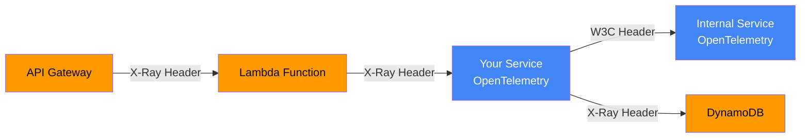
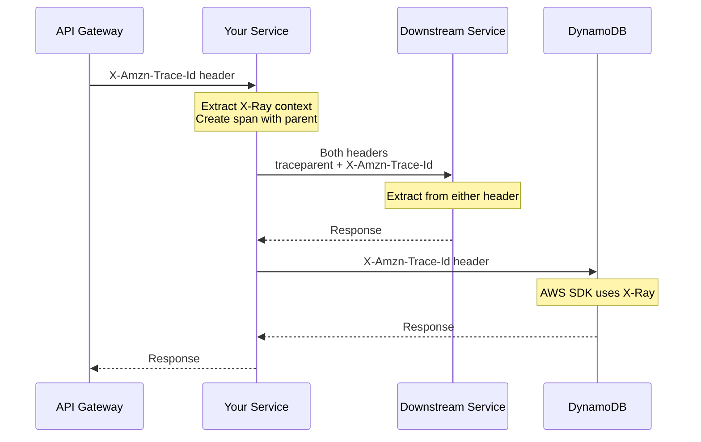

# How to Build OpenTelemetry X-Ray Propagation

Author: [nawazdhandala](https://github.com/nawazdhandala)

Tags: OpenTelemetry, AWS-XRay, Tracing, Propagation

Description: Learn how to implement AWS X-Ray trace context propagation in OpenTelemetry to achieve seamless distributed tracing across hybrid AWS and non-AWS services.

---

> AWS X-Ray and OpenTelemetry can work together. X-Ray propagation bridges the gap between AWS-native services and your OpenTelemetry-instrumented applications.

When running distributed systems on AWS, you often need to trace requests that flow through Lambda functions, API Gateway, ECS tasks, and your own microservices. AWS X-Ray has its own trace header format (`X-Amzn-Trace-Id`), while OpenTelemetry uses W3C Trace Context (`traceparent`/`tracestate`). Without proper propagation, your traces break at service boundaries.

This guide walks you through implementing X-Ray propagation in OpenTelemetry so your traces stay connected across AWS-native and OpenTelemetry-instrumented services.

---

## Table of Contents

1. Understanding X-Ray vs W3C Trace Context
2. When You Need X-Ray Propagation
3. X-Ray Header Format Deep Dive
4. Setting Up X-Ray Propagator in Node.js
5. Setting Up X-Ray Propagator in Python
6. Configuring the OpenTelemetry Collector
7. Bidirectional Propagation Strategy
8. Handling Lambda and API Gateway
9. Testing Your Propagation Setup
10. Common Pitfalls and Solutions

---

## 1. Understanding X-Ray vs W3C Trace Context

OpenTelemetry defaults to W3C Trace Context, which uses two headers:

| Header | Purpose | Example |
|--------|---------|---------|
| `traceparent` | Carries trace ID, span ID, and flags | `00-4bf92f3577b34da6a3ce929d0e0e4736-00f067aa0ba902b7-01` |
| `tracestate` | Vendor-specific key-value pairs | `rojo=00f067aa0ba902b7,congo=t61rcWkgMzE` |

AWS X-Ray uses a single header with a different format:

| Header | Purpose | Example |
|--------|---------|---------|
| `X-Amzn-Trace-Id` | Carries root trace, parent, and sampling | `Root=1-5759e988-bd862e3fe1be46a994272793;Parent=53995c3f42cd8ad8;Sampled=1` |

The key differences are:

- X-Ray trace IDs include a timestamp component
- X-Ray uses semicolon-delimited key-value pairs
- Sampling decision encoding differs between formats

---

## 2. When You Need X-Ray Propagation

You need X-Ray propagation when your request flow crosses between AWS-native and OpenTelemetry-instrumented services.



Common scenarios requiring X-Ray propagation:

- **API Gateway to microservices**: API Gateway adds X-Ray headers that your services must understand
- **Lambda to backend services**: Lambda functions propagate X-Ray context to downstream calls
- **ECS/EKS to AWS SDK calls**: Your containers need to include X-Ray headers when calling DynamoDB, SQS, or other AWS services
- **Hybrid tracing**: Running both X-Ray daemon and OpenTelemetry Collector side by side during migration

---

## 3. X-Ray Header Format Deep Dive

The `X-Amzn-Trace-Id` header contains three main components.

Here is how the header breaks down:

```
X-Amzn-Trace-Id: Root=1-5759e988-bd862e3fe1be46a994272793;Parent=53995c3f42cd8ad8;Sampled=1
```

| Component | Format | Description |
|-----------|--------|-------------|
| Root | `1-{timestamp}-{96-bit-id}` | The trace ID. Timestamp is Unix epoch in hex. |
| Parent | 16-character hex | The parent span ID |
| Sampled | `0`, `1`, or `?` | Sampling decision: not sampled, sampled, or defer |

The timestamp component is important. X-Ray uses this to organize traces chronologically and to validate that trace IDs are recent (X-Ray rejects trace IDs with timestamps too far in the past or future).

Converting between formats requires careful handling of this timestamp. OpenTelemetry trace IDs are 32 hex characters (128 bits), while X-Ray trace IDs embed a 32-bit timestamp plus 96 bits of random data.

---

## 4. Setting Up X-Ray Propagator in Node.js

First, install the required packages. The X-Ray propagator package handles the format conversion automatically.

```bash
npm install @opentelemetry/api \
            @opentelemetry/sdk-node \
            @opentelemetry/propagator-aws-xray \
            @opentelemetry/id-generator-aws-xray \
            @opentelemetry/exporter-trace-otlp-http
```

Create your telemetry configuration file. The key components are the X-Ray propagator and the X-Ray ID generator, which ensures your generated trace IDs are X-Ray compatible.

```typescript
// telemetry.ts
import { NodeSDK } from '@opentelemetry/sdk-node';
import { OTLPTraceExporter } from '@opentelemetry/exporter-trace-otlp-http';
import { Resource } from '@opentelemetry/resources';
import { AWSXRayPropagator } from '@opentelemetry/propagator-aws-xray';
import { AWSXRayIdGenerator } from '@opentelemetry/id-generator-aws-xray';
import {
  CompositePropagator,
  W3CTraceContextPropagator
} from '@opentelemetry/core';
import { getNodeAutoInstrumentations } from '@opentelemetry/auto-instrumentations-node';

// Use composite propagator to support both X-Ray and W3C formats
const propagator = new CompositePropagator({
  propagators: [
    new AWSXRayPropagator(),
    new W3CTraceContextPropagator(),
  ],
});

const traceExporter = new OTLPTraceExporter({
  url: process.env.OTEL_EXPORTER_OTLP_ENDPOINT || 'http://localhost:4318/v1/traces',
});

export const sdk = new NodeSDK({
  resource: new Resource({
    'service.name': process.env.OTEL_SERVICE_NAME || 'my-service',
    'service.version': '1.0.0',
  }),
  traceExporter,
  // Use X-Ray compatible ID generator
  idGenerator: new AWSXRayIdGenerator(),
  textMapPropagator: propagator,
  instrumentations: [getNodeAutoInstrumentations()],
});

export async function startTelemetry(): Promise<void> {
  await sdk.start();
  console.log('OpenTelemetry with X-Ray propagation started');
}

export async function shutdownTelemetry(): Promise<void> {
  await sdk.shutdown();
}
```

Initialize telemetry before importing your application code. This ensures auto-instrumentation wraps HTTP clients and servers properly.

```typescript
// index.ts
import { startTelemetry, shutdownTelemetry } from './telemetry';

async function main() {
  await startTelemetry();

  // Import app after telemetry is initialized
  const { startServer } = await import('./server');
  await startServer();

  // Graceful shutdown
  process.on('SIGTERM', async () => {
    await shutdownTelemetry();
    process.exit(0);
  });
}

main().catch(console.error);
```

---

## 5. Setting Up X-Ray Propagator in Python

Install the required packages for Python. The AWS extension package includes both the propagator and ID generator.

```bash
pip install opentelemetry-api \
            opentelemetry-sdk \
            opentelemetry-propagator-aws-xray \
            opentelemetry-sdk-extension-aws \
            opentelemetry-exporter-otlp
```

Configure the propagator in your application. Python uses a similar composite propagator pattern to support multiple header formats.

```python
# telemetry.py
import os
from opentelemetry import trace
from opentelemetry.sdk.trace import TracerProvider
from opentelemetry.sdk.trace.export import BatchSpanProcessor
from opentelemetry.exporter.otlp.proto.http.trace_exporter import OTLPSpanExporter
from opentelemetry.sdk.resources import Resource
from opentelemetry.propagate import set_global_textmap
from opentelemetry.propagators.composite import CompositePropagator
from opentelemetry.trace.propagation.tracecontext import TraceContextTextMapPropagator
from opentelemetry.propagators.aws import AwsXRayPropagator
from opentelemetry.sdk.extension.aws.trace import AwsXRayIdGenerator


def configure_telemetry():
    """Configure OpenTelemetry with X-Ray propagation support."""

    # Create resource with service information
    resource = Resource.create({
        "service.name": os.environ.get("OTEL_SERVICE_NAME", "my-python-service"),
        "service.version": "1.0.0",
    })

    # Configure tracer provider with X-Ray ID generator
    provider = TracerProvider(
        resource=resource,
        id_generator=AwsXRayIdGenerator(),
    )

    # Add OTLP exporter
    exporter = OTLPSpanExporter(
        endpoint=os.environ.get("OTEL_EXPORTER_OTLP_ENDPOINT", "http://localhost:4318/v1/traces")
    )
    provider.add_span_processor(BatchSpanProcessor(exporter))

    # Set as global tracer provider
    trace.set_tracer_provider(provider)

    # Configure composite propagator for both X-Ray and W3C
    propagator = CompositePropagator([
        AwsXRayPropagator(),
        TraceContextTextMapPropagator(),
    ])
    set_global_textmap(propagator)

    return provider


# Initialize at module load
provider = configure_telemetry()
```

Use the configured telemetry in your Flask or FastAPI application.

```python
# app.py
from flask import Flask, request
from opentelemetry import trace
from opentelemetry.instrumentation.flask import FlaskInstrumentor
from opentelemetry.instrumentation.requests import RequestsInstrumentor
import requests

app = Flask(__name__)

# Instrument Flask and requests library
FlaskInstrumentor().instrument_app(app)
RequestsInstrumentor().instrument()

tracer = trace.get_tracer(__name__)


@app.route('/process')
def process_request():
    # X-Ray header is automatically extracted and context is set
    with tracer.start_as_current_span("process-data") as span:
        span.set_attribute("custom.attribute", "value")

        # Outbound call will include both X-Ray and W3C headers
        response = requests.get("http://downstream-service/api/data")

        return {"status": "processed", "downstream_status": response.status_code}


if __name__ == '__main__':
    app.run(port=8080)
```

---

## 6. Configuring the OpenTelemetry Collector

The OpenTelemetry Collector can also handle X-Ray propagation and export to AWS X-Ray directly. This is useful when you want centralized control over propagation and routing.

Here is a collector configuration that receives OTLP traces and exports to both X-Ray and another backend.

```yaml
# otel-collector-config.yaml
receivers:
  otlp:
    protocols:
      grpc:
        endpoint: 0.0.0.0:4317
      http:
        endpoint: 0.0.0.0:4318

processors:
  batch:
    timeout: 1s
    send_batch_size: 1024

  # Add resource attributes for X-Ray
  resource:
    attributes:
      - key: cloud.provider
        value: aws
        action: upsert

exporters:
  # Export to AWS X-Ray
  awsxray:
    region: us-east-1
    # Use IAM role or environment credentials

  # Export to OneUptime or other OTLP backend
  otlphttp:
    endpoint: https://otlp.oneuptime.com
    headers:
      x-oneuptime-token: ${ONEUPTIME_TOKEN}

  # Debug logging
  logging:
    loglevel: debug

service:
  pipelines:
    traces:
      receivers: [otlp]
      processors: [batch, resource]
      exporters: [awsxray, otlphttp]
```

For environments where you receive X-Ray formatted traces directly (from AWS services), add the AWS X-Ray receiver.

```yaml
receivers:
  # Receive traces in X-Ray format from AWS SDK
  awsxray:
    endpoint: 0.0.0.0:2000
    transport: udp
```

---

## 7. Bidirectional Propagation Strategy

In a hybrid environment, you need traces to flow in both directions: from AWS services to your applications and from your applications back to AWS services.



The composite propagator handles injection automatically, but extraction follows a priority order. Configure your propagator list to control which format takes precedence when both headers are present.

```typescript
// X-Ray first: prefer X-Ray header when both are present
const xrayFirstPropagator = new CompositePropagator({
  propagators: [
    new AWSXRayPropagator(),
    new W3CTraceContextPropagator(),
  ],
});

// W3C first: prefer W3C header when both are present
const w3cFirstPropagator = new CompositePropagator({
  propagators: [
    new W3CTraceContextPropagator(),
    new AWSXRayPropagator(),
  ],
});
```

For most AWS-heavy environments, put X-Ray propagator first. For environments migrating away from X-Ray, put W3C first.

---

## 8. Handling Lambda and API Gateway

AWS Lambda with X-Ray enabled automatically adds trace context to the environment. You can extract this context to continue the trace in your OpenTelemetry-instrumented Lambda function.

```typescript
// lambda-handler.ts
import { Context, APIGatewayProxyEvent, APIGatewayProxyResult } from 'aws-lambda';
import { trace, context as otelContext, propagation } from '@opentelemetry/api';
import { AWSXRayPropagator } from '@opentelemetry/propagator-aws-xray';

const propagator = new AWSXRayPropagator();
const tracer = trace.getTracer('lambda-handler');

export async function handler(
  event: APIGatewayProxyEvent,
  lambdaContext: Context
): Promise<APIGatewayProxyResult> {
  // Extract trace context from X-Ray environment variable
  const xrayTraceId = process.env._X_AMZN_TRACE_ID;

  let parentContext = otelContext.active();

  if (xrayTraceId) {
    // Parse the X-Ray trace ID and create carrier
    const carrier = { 'X-Amzn-Trace-Id': xrayTraceId };
    parentContext = propagation.extract(otelContext.active(), carrier);
  }

  // Also check incoming headers from API Gateway
  if (event.headers) {
    const headerCarrier: Record<string, string> = {};
    for (const [key, value] of Object.entries(event.headers)) {
      if (value) {
        headerCarrier[key.toLowerCase()] = value;
      }
    }
    parentContext = propagation.extract(parentContext, headerCarrier);
  }

  return otelContext.with(parentContext, async () => {
    return tracer.startActiveSpan('lambda-handler', async (span) => {
      try {
        span.setAttribute('aws.lambda.invoked_arn', lambdaContext.invokedFunctionArn);
        span.setAttribute('aws.lambda.request_id', lambdaContext.awsRequestId);

        // Your business logic here
        const result = await processRequest(event);

        return {
          statusCode: 200,
          body: JSON.stringify(result),
        };
      } catch (error: any) {
        span.recordException(error);
        span.setStatus({ code: 2, message: error.message });
        throw error;
      } finally {
        span.end();
      }
    });
  });
}

async function processRequest(event: APIGatewayProxyEvent): Promise<object> {
  // Implementation
  return { message: 'Success' };
}
```

For Lambda layers, you can use the AWS Lambda OpenTelemetry layer which handles this automatically.

```yaml
# SAM template example
Resources:
  MyFunction:
    Type: AWS::Serverless::Function
    Properties:
      Handler: index.handler
      Runtime: nodejs18.x
      Layers:
        - !Sub arn:aws:lambda:${AWS::Region}:901920570463:layer:aws-otel-nodejs-amd64-ver-1-18-1:1
      Environment:
        Variables:
          AWS_LAMBDA_EXEC_WRAPPER: /opt/otel-handler
          OTEL_PROPAGATORS: xray,tracecontext
          OTEL_EXPORTER_OTLP_ENDPOINT: http://collector:4318
```

---

## 9. Testing Your Propagation Setup

Verify your propagation is working correctly by tracing a request through your system. Here is a test script that validates both header formats are being propagated.

```typescript
// test-propagation.ts
import { trace, context, propagation } from '@opentelemetry/api';

const tracer = trace.getTracer('propagation-test');

async function testPropagation(): Promise<void> {
  await tracer.startActiveSpan('test-root-span', async (span) => {
    // Create carrier to capture injected headers
    const carrier: Record<string, string> = {};

    // Inject current context into carrier
    propagation.inject(context.active(), carrier);

    console.log('Injected headers:');
    console.log(JSON.stringify(carrier, null, 2));

    // Verify X-Ray header is present
    if (carrier['x-amzn-trace-id']) {
      console.log('X-Ray header present');

      // Parse and validate X-Ray header
      const xrayHeader = carrier['x-amzn-trace-id'];
      const parts = xrayHeader.split(';').reduce((acc: Record<string, string>, part) => {
        const [key, value] = part.split('=');
        acc[key] = value;
        return acc;
      }, {});

      console.log('Parsed X-Ray components:', parts);

      // Validate timestamp is recent
      if (parts['Root']) {
        const timestampHex = parts['Root'].split('-')[1];
        const timestamp = parseInt(timestampHex, 16);
        const now = Math.floor(Date.now() / 1000);
        const age = now - timestamp;
        console.log(`Trace timestamp age: ${age} seconds`);

        if (age > 3600) {
          console.warn('Warning: Trace timestamp is more than 1 hour old');
        }
      }
    } else {
      console.error('X-Ray header NOT present - check propagator configuration');
    }

    // Verify W3C header is present
    if (carrier['traceparent']) {
      console.log('W3C traceparent header present');
    } else {
      console.warn('W3C traceparent header NOT present');
    }

    span.end();
  });
}

// Run with: npx ts-node test-propagation.ts
testPropagation().catch(console.error);
```

Expected output when both propagators are configured:

```json
{
  "x-amzn-trace-id": "Root=1-65a1b2c3-abcdef1234567890abcdef12;Parent=1234567890abcdef;Sampled=1",
  "traceparent": "00-65a1b2c3abcdef1234567890abcdef12-1234567890abcdef-01"
}
```

---

## 10. Common Pitfalls and Solutions

### Pitfall 1: Trace IDs rejected by X-Ray

X-Ray validates that the timestamp in trace IDs is within an acceptable range (not too old, not in the future). If you see traces being rejected, ensure you are using the X-Ray ID generator.

```typescript
// Wrong: Using default ID generator
const sdk = new NodeSDK({
  // No idGenerator specified - uses random IDs
});

// Correct: Using X-Ray compatible ID generator
import { AWSXRayIdGenerator } from '@opentelemetry/id-generator-aws-xray';

const sdk = new NodeSDK({
  idGenerator: new AWSXRayIdGenerator(),
});
```

### Pitfall 2: Missing context in async operations

Node.js async context can be lost if you are using libraries that are not properly instrumented. Always verify context is present.

```typescript
import { trace, context } from '@opentelemetry/api';

async function processAsync(): Promise<void> {
  const activeSpan = trace.getSpan(context.active());

  if (!activeSpan) {
    console.warn('No active span - context may have been lost');
    // Consider manually propagating context
  }
}
```

### Pitfall 3: Header case sensitivity

HTTP headers are case-insensitive, but some frameworks normalize them differently. The X-Ray propagator handles common cases, but verify your framework's behavior.

```typescript
// Express normalizes headers to lowercase
app.use((req, res, next) => {
  // Both work:
  const xray1 = req.headers['x-amzn-trace-id'];
  const xray2 = req.headers['X-Amzn-Trace-Id']; // undefined in Express
  next();
});
```

### Pitfall 4: Propagator order affecting extraction

When both X-Ray and W3C headers are present, the first propagator in the composite list wins during extraction.

```typescript
// If a request has both headers with different trace IDs,
// this configuration will use the X-Ray trace ID
const propagator = new CompositePropagator({
  propagators: [
    new AWSXRayPropagator(),      // Checked first
    new W3CTraceContextPropagator(), // Checked second
  ],
});
```

### Pitfall 5: AWS SDK not picking up context

The AWS SDK v3 needs explicit instrumentation to propagate trace context. Install the instrumentation package.

```bash
npm install @opentelemetry/instrumentation-aws-sdk
```

```typescript
import { AwsInstrumentation } from '@opentelemetry/instrumentation-aws-sdk';

const sdk = new NodeSDK({
  instrumentations: [
    new AwsInstrumentation({
      suppressInternalInstrumentation: true,
    }),
  ],
});
```

---

## Summary

| Scenario | Solution |
|----------|----------|
| Receiving requests from API Gateway/Lambda | Configure X-Ray propagator to extract `X-Amzn-Trace-Id` |
| Calling AWS services (DynamoDB, SQS, etc.) | Use X-Ray ID generator + AWS SDK instrumentation |
| Hybrid AWS and non-AWS services | Use composite propagator with both X-Ray and W3C |
| Migrating from X-Ray to OpenTelemetry | Dual-write via Collector to both X-Ray and new backend |
| Lambda functions | Use AWS Lambda OTel layer or manual context extraction |

X-Ray propagation bridges the gap between AWS-native tracing and OpenTelemetry. By configuring composite propagators and using the X-Ray ID generator, you maintain trace continuity across your entire distributed system, regardless of which tracing system each component uses.

The investment in proper propagation setup pays off immediately: you get end-to-end visibility from API Gateway through your services to DynamoDB, all in a single connected trace.

---

**Related Reading:**

- [What are Traces and Spans in OpenTelemetry](/blog/post/2025-08-27-traces-and-spans-in-opentelemetry)
- [What is OpenTelemetry Collector and Why Use One](/blog/post/2025-09-18-what-is-opentelemetry-collector-and-why-use-one)
- [OpenTelemetry: Your Escape Hatch from the Observability Cartel](/blog/post/2025-11-03-opentelemetry-escape-from-observability-cartel)
