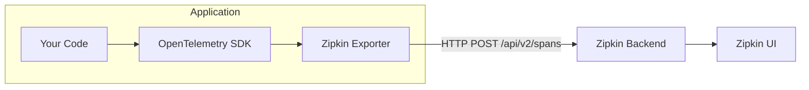
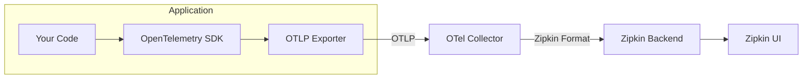
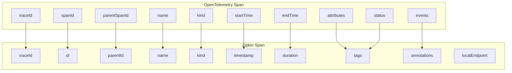

# How to Build OpenTelemetry Zipkin Exporter

Author: [nawazdhandala](https://github.com/nawazdhandala)

Tags: OpenTelemetry, Zipkin, Tracing, Observability

Description: A complete guide to building and configuring an OpenTelemetry Zipkin exporter for distributed tracing in your applications.

---

Zipkin is one of the most popular distributed tracing systems, and OpenTelemetry provides first-class support for exporting traces to it. Whether you are migrating from Zipkin instrumentation to OpenTelemetry or integrating with an existing Zipkin backend, understanding how to build and configure the Zipkin exporter is essential.

This guide walks you through building an OpenTelemetry Zipkin exporter from scratch, covering configuration options, data transformation, and production best practices.

---

## Table of Contents

1. Understanding Zipkin and OpenTelemetry Integration
2. Architecture Overview
3. Setting Up the Zipkin Exporter in Node.js
4. Configuring the Exporter
5. Data Transformation: OpenTelemetry to Zipkin Format
6. Using the OpenTelemetry Collector with Zipkin
7. Error Handling and Retry Logic
8. Production Configuration
9. Testing Your Exporter
10. Troubleshooting Common Issues

---

## 1. Understanding Zipkin and OpenTelemetry Integration

Zipkin uses a specific JSON format for spans that differs from the OpenTelemetry Protocol (OTLP). The Zipkin exporter handles this translation automatically, converting OpenTelemetry spans into Zipkin-compatible format before sending them to your Zipkin backend.

Key differences between the formats:

| Aspect | OpenTelemetry | Zipkin |
|--------|---------------|--------|
| Span Kind | SERVER, CLIENT, INTERNAL, PRODUCER, CONSUMER | SERVER, CLIENT, PRODUCER, CONSUMER (no INTERNAL) |
| Status | OK, ERROR, UNSET | Uses tags and annotations |
| Attributes | Key-value pairs with typed values | String tags only |
| Events | Timestamped annotations with attributes | Annotations with string values |
| Resource | Service-level metadata | localEndpoint field |

---

## 2. Architecture Overview

The following diagram shows how OpenTelemetry spans flow to a Zipkin backend:



With an OpenTelemetry Collector in between:



---

## 3. Setting Up the Zipkin Exporter in Node.js

### Installation

Install the required packages for OpenTelemetry with Zipkin export support:

```bash
npm install @opentelemetry/api \
  @opentelemetry/sdk-node \
  @opentelemetry/sdk-trace-node \
  @opentelemetry/exporter-zipkin \
  @opentelemetry/resources \
  @opentelemetry/semantic-conventions \
  @opentelemetry/auto-instrumentations-node
```

### Basic Setup

Create `tracing.ts` to initialize the Zipkin exporter. This file must be loaded before any other modules to ensure proper instrumentation:

```typescript
// tracing.ts
import { NodeSDK } from '@opentelemetry/sdk-node';
import { ZipkinExporter } from '@opentelemetry/exporter-zipkin';
import { Resource } from '@opentelemetry/resources';
import { SemanticResourceAttributes } from '@opentelemetry/semantic-conventions';
import { getNodeAutoInstrumentations } from '@opentelemetry/auto-instrumentations-node';
import { BatchSpanProcessor } from '@opentelemetry/sdk-trace-node';

// Configure the Zipkin exporter with your backend URL
const zipkinExporter = new ZipkinExporter({
  url: process.env.ZIPKIN_ENDPOINT || 'http://localhost:9411/api/v2/spans',
  serviceName: 'my-service',
});

// Define service identity that will appear in Zipkin
const resource = new Resource({
  [SemanticResourceAttributes.SERVICE_NAME]: process.env.SERVICE_NAME || 'my-service',
  [SemanticResourceAttributes.SERVICE_VERSION]: process.env.SERVICE_VERSION || '1.0.0',
  [SemanticResourceAttributes.DEPLOYMENT_ENVIRONMENT]: process.env.NODE_ENV || 'development',
});

// Initialize the SDK
const sdk = new NodeSDK({
  resource,
  spanProcessor: new BatchSpanProcessor(zipkinExporter),
  instrumentations: [getNodeAutoInstrumentations()],
});

// Start the SDK before your application code
sdk.start();

// Graceful shutdown
process.on('SIGTERM', () => {
  sdk.shutdown()
    .then(() => console.log('Tracing terminated'))
    .catch((error) => console.error('Error terminating tracing', error))
    .finally(() => process.exit(0));
});

export { sdk };
```

### Loading the Tracer

Import the tracing module at the very beginning of your application entry point:

```typescript
// index.ts
import './tracing';  // Must be first import!
import express from 'express';

const app = express();

app.get('/api/users', async (req, res) => {
  // Your route logic - spans are automatically created
  res.json({ users: [] });
});

app.listen(3000, () => {
  console.log('Server running on port 3000');
});
```

---

## 4. Configuring the Exporter

The Zipkin exporter accepts several configuration options:

```typescript
import { ZipkinExporter } from '@opentelemetry/exporter-zipkin';

const exporter = new ZipkinExporter({
  // Zipkin collector endpoint
  url: 'http://zipkin.example.com:9411/api/v2/spans',

  // Service name (used as localEndpoint.serviceName)
  serviceName: 'checkout-service',

  // Custom headers for authentication
  headers: {
    'Authorization': 'Bearer your-token',
    'X-Custom-Header': 'value',
  },

  // Request timeout in milliseconds
  // Note: Varies by implementation
});
```

### Environment Variables

You can also configure the exporter using environment variables:

```bash
# Zipkin endpoint
export OTEL_EXPORTER_ZIPKIN_ENDPOINT=http://zipkin:9411/api/v2/spans

# Service name
export OTEL_SERVICE_NAME=my-service
```

Then use them in your configuration:

```typescript
const exporter = new ZipkinExporter({
  url: process.env.OTEL_EXPORTER_ZIPKIN_ENDPOINT,
  serviceName: process.env.OTEL_SERVICE_NAME,
});
```

---

## 5. Data Transformation: OpenTelemetry to Zipkin Format

Understanding how OpenTelemetry spans are converted to Zipkin format helps with debugging and configuration.

### Span Transformation

The exporter converts OpenTelemetry spans to Zipkin's JSON format:



### Example Transformation

An OpenTelemetry span like this:

```json
{
  "traceId": "5b8aa5a2d2c872e8321cf37308d69df2",
  "spanId": "051581bf3cb55c13",
  "parentSpanId": "e57a8e0cde56a647",
  "name": "GET /api/users",
  "kind": "SERVER",
  "startTimeUnixNano": 1706620800000000000,
  "endTimeUnixNano": 1706620800050000000,
  "attributes": [
    { "key": "http.method", "value": { "stringValue": "GET" } },
    { "key": "http.status_code", "value": { "intValue": 200 } }
  ],
  "status": { "code": "OK" }
}
```

Becomes this Zipkin span:

```json
{
  "traceId": "5b8aa5a2d2c872e8321cf37308d69df2",
  "id": "051581bf3cb55c13",
  "parentId": "e57a8e0cde56a647",
  "name": "GET /api/users",
  "kind": "SERVER",
  "timestamp": 1706620800000000,
  "duration": 50000,
  "localEndpoint": {
    "serviceName": "my-service"
  },
  "tags": {
    "http.method": "GET",
    "http.status_code": "200",
    "otel.status_code": "OK"
  }
}
```

---

## 6. Using the OpenTelemetry Collector with Zipkin

For production environments, using the OpenTelemetry Collector provides additional benefits like batching, retry, and multi-destination routing.

### Collector Configuration

Create a `collector-config.yaml`:

```yaml
receivers:
  otlp:
    protocols:
      grpc:
        endpoint: 0.0.0.0:4317
      http:
        endpoint: 0.0.0.0:4318

processors:
  batch:
    send_batch_size: 1000
    timeout: 5s

  memory_limiter:
    limit_mib: 512
    spike_limit_mib: 128
    check_interval: 5s

exporters:
  zipkin:
    endpoint: http://zipkin:9411/api/v2/spans
    format: json

  # Optionally export to multiple backends
  otlphttp:
    endpoint: https://oneuptime.com/otlp
    headers:
      x-oneuptime-token: ${ONEUPTIME_TOKEN}

service:
  pipelines:
    traces:
      receivers: [otlp]
      processors: [memory_limiter, batch]
      exporters: [zipkin, otlphttp]
```

### Application Configuration for Collector

Update your application to send traces to the collector instead of directly to Zipkin:

```typescript
import { NodeSDK } from '@opentelemetry/sdk-node';
import { OTLPTraceExporter } from '@opentelemetry/exporter-trace-otlp-http';
import { BatchSpanProcessor } from '@opentelemetry/sdk-trace-node';

// Send to collector using OTLP
const otlpExporter = new OTLPTraceExporter({
  url: process.env.OTEL_EXPORTER_OTLP_ENDPOINT || 'http://collector:4318/v1/traces',
});

const sdk = new NodeSDK({
  spanProcessor: new BatchSpanProcessor(otlpExporter),
  // ... rest of config
});
```

### Docker Compose Setup

Run Zipkin and the Collector together:

```yaml
version: '3.8'

services:
  zipkin:
    image: openzipkin/zipkin:latest
    ports:
      - "9411:9411"

  otel-collector:
    image: otel/opentelemetry-collector-contrib:latest
    command: ["--config=/etc/collector-config.yaml"]
    volumes:
      - ./collector-config.yaml:/etc/collector-config.yaml
    ports:
      - "4317:4317"   # OTLP gRPC
      - "4318:4318"   # OTLP HTTP
    depends_on:
      - zipkin

  app:
    build: .
    environment:
      - OTEL_EXPORTER_OTLP_ENDPOINT=http://otel-collector:4318/v1/traces
    depends_on:
      - otel-collector
```

---

## 7. Error Handling and Retry Logic

The Zipkin exporter includes built-in retry logic, but you should handle failures gracefully:

```typescript
import { ZipkinExporter } from '@opentelemetry/exporter-zipkin';
import { BatchSpanProcessor } from '@opentelemetry/sdk-trace-node';
import { diag, DiagConsoleLogger, DiagLogLevel } from '@opentelemetry/api';

// Enable diagnostic logging for debugging
diag.setLogger(new DiagConsoleLogger(), DiagLogLevel.INFO);

const zipkinExporter = new ZipkinExporter({
  url: process.env.ZIPKIN_ENDPOINT || 'http://localhost:9411/api/v2/spans',
  serviceName: 'my-service',
});

// Configure batch processor with retry settings
const spanProcessor = new BatchSpanProcessor(zipkinExporter, {
  // Maximum number of spans in the buffer
  maxQueueSize: 2048,

  // Maximum number of spans per export batch
  maxExportBatchSize: 512,

  // How long to wait before exporting
  scheduledDelayMillis: 5000,

  // Export timeout
  exportTimeoutMillis: 30000,
});
```

### Custom Error Handling

Wrap the exporter to add custom error handling:

```typescript
import { SpanExporter, ReadableSpan } from '@opentelemetry/sdk-trace-base';
import { ExportResult, ExportResultCode } from '@opentelemetry/core';
import { ZipkinExporter } from '@opentelemetry/exporter-zipkin';

class ResilientZipkinExporter implements SpanExporter {
  private exporter: ZipkinExporter;
  private failedSpans: ReadableSpan[] = [];
  private maxRetries = 3;

  constructor(options: any) {
    this.exporter = new ZipkinExporter(options);
  }

  async export(
    spans: ReadableSpan[],
    resultCallback: (result: ExportResult) => void
  ): Promise<void> {
    // Include any previously failed spans
    const allSpans = [...this.failedSpans, ...spans];
    this.failedSpans = [];

    return new Promise((resolve) => {
      this.exporter.export(allSpans, (result) => {
        if (result.code === ExportResultCode.FAILED) {
          console.error('Failed to export spans to Zipkin:', result.error);

          // Store failed spans for retry (with limit)
          if (this.failedSpans.length < 1000) {
            this.failedSpans.push(...spans);
          }
        }

        resultCallback(result);
        resolve();
      });
    });
  }

  async shutdown(): Promise<void> {
    return this.exporter.shutdown();
  }
}
```

---

## 8. Production Configuration

For production deployments, consider these best practices:

### Sampling

Reduce trace volume while keeping important traces:

```typescript
import { NodeSDK } from '@opentelemetry/sdk-node';
import { ZipkinExporter } from '@opentelemetry/exporter-zipkin';
import {
  ParentBasedSampler,
  TraceIdRatioBasedSampler,
} from '@opentelemetry/sdk-trace-node';

// Sample 10% of traces, but always follow parent decision
const sampler = new ParentBasedSampler({
  root: new TraceIdRatioBasedSampler(0.1),
});

const sdk = new NodeSDK({
  sampler,
  // ... rest of config
});
```

### Complete Production Setup

```typescript
// tracing.production.ts
import { NodeSDK } from '@opentelemetry/sdk-node';
import { ZipkinExporter } from '@opentelemetry/exporter-zipkin';
import { Resource } from '@opentelemetry/resources';
import { SemanticResourceAttributes } from '@opentelemetry/semantic-conventions';
import { getNodeAutoInstrumentations } from '@opentelemetry/auto-instrumentations-node';
import {
  BatchSpanProcessor,
  ParentBasedSampler,
  TraceIdRatioBasedSampler,
} from '@opentelemetry/sdk-trace-node';

const serviceName = process.env.SERVICE_NAME || 'my-service';

// Production-ready Zipkin exporter
const zipkinExporter = new ZipkinExporter({
  url: process.env.ZIPKIN_ENDPOINT,
  serviceName,
  headers: {
    'Authorization': `Bearer ${process.env.ZIPKIN_AUTH_TOKEN}`,
  },
});

// Batch processor for efficiency
const spanProcessor = new BatchSpanProcessor(zipkinExporter, {
  maxQueueSize: 2048,
  maxExportBatchSize: 512,
  scheduledDelayMillis: 5000,
  exportTimeoutMillis: 30000,
});

// Service resource with metadata
const resource = new Resource({
  [SemanticResourceAttributes.SERVICE_NAME]: serviceName,
  [SemanticResourceAttributes.SERVICE_VERSION]: process.env.SERVICE_VERSION || '1.0.0',
  [SemanticResourceAttributes.DEPLOYMENT_ENVIRONMENT]: process.env.NODE_ENV || 'production',
  [SemanticResourceAttributes.SERVICE_INSTANCE_ID]: process.env.HOSTNAME || 'unknown',
});

// Sampling configuration
const sampleRate = parseFloat(process.env.OTEL_TRACES_SAMPLER_ARG || '0.1');
const sampler = new ParentBasedSampler({
  root: new TraceIdRatioBasedSampler(sampleRate),
});

const sdk = new NodeSDK({
  resource,
  spanProcessor,
  sampler,
  instrumentations: [
    getNodeAutoInstrumentations({
      '@opentelemetry/instrumentation-fs': { enabled: false }, // Disable noisy fs tracing
    }),
  ],
});

sdk.start();
console.log(`OpenTelemetry initialized with ${sampleRate * 100}% sampling`);

// Graceful shutdown
const shutdown = async () => {
  console.log('Shutting down OpenTelemetry...');
  await sdk.shutdown();
  process.exit(0);
};

process.on('SIGTERM', shutdown);
process.on('SIGINT', shutdown);

export { sdk };
```

---

## 9. Testing Your Exporter

### Unit Testing

Test your tracing setup with mock exporters:

```typescript
import { NodeSDK } from '@opentelemetry/sdk-node';
import { InMemorySpanExporter } from '@opentelemetry/sdk-trace-base';
import { trace } from '@opentelemetry/api';

describe('Tracing', () => {
  let sdk: NodeSDK;
  let memoryExporter: InMemorySpanExporter;

  beforeAll(() => {
    memoryExporter = new InMemorySpanExporter();
    sdk = new NodeSDK({
      spanProcessor: new SimpleSpanProcessor(memoryExporter),
    });
    sdk.start();
  });

  afterAll(async () => {
    await sdk.shutdown();
  });

  beforeEach(() => {
    memoryExporter.reset();
  });

  it('should create spans with correct attributes', async () => {
    const tracer = trace.getTracer('test');

    tracer.startActiveSpan('test-operation', (span) => {
      span.setAttribute('test.attribute', 'value');
      span.end();
    });

    const spans = memoryExporter.getFinishedSpans();
    expect(spans).toHaveLength(1);
    expect(spans[0].name).toBe('test-operation');
    expect(spans[0].attributes['test.attribute']).toBe('value');
  });
});
```

### Integration Testing

Test the full pipeline with a local Zipkin instance:

```typescript
import { ZipkinExporter } from '@opentelemetry/exporter-zipkin';
import axios from 'axios';

describe('Zipkin Integration', () => {
  const zipkinUrl = 'http://localhost:9411';

  it('should export spans to Zipkin', async () => {
    const exporter = new ZipkinExporter({
      url: `${zipkinUrl}/api/v2/spans`,
      serviceName: 'test-service',
    });

    // Create and export a test span
    // ... span creation code

    // Wait for export
    await new Promise(resolve => setTimeout(resolve, 2000));

    // Verify span in Zipkin
    const response = await axios.get(
      `${zipkinUrl}/api/v2/traces?serviceName=test-service&limit=1`
    );

    expect(response.data).toHaveLength(1);
  });
});
```

---

## 10. Troubleshooting Common Issues

### Spans Not Appearing in Zipkin

Enable diagnostic logging to debug issues:

```typescript
import { diag, DiagConsoleLogger, DiagLogLevel } from '@opentelemetry/api';

// Enable verbose logging
diag.setLogger(new DiagConsoleLogger(), DiagLogLevel.DEBUG);
```

Common causes:
- Wrong Zipkin endpoint URL
- Network connectivity issues
- Zipkin service not running
- Spans being dropped due to sampling

### Incorrect Service Names

Ensure the service name is set consistently:

```typescript
const exporter = new ZipkinExporter({
  serviceName: 'my-service',  // Must match
});

const resource = new Resource({
  [SemanticResourceAttributes.SERVICE_NAME]: 'my-service',  // Must match
});
```

### Missing Parent-Child Relationships

Verify context propagation is working:

```typescript
import { trace, context } from '@opentelemetry/api';

const tracer = trace.getTracer('my-tracer');

// Correct: use startActiveSpan for automatic context
tracer.startActiveSpan('parent', (parentSpan) => {
  tracer.startActiveSpan('child', (childSpan) => {
    // child automatically has parent context
    childSpan.end();
  });
  parentSpan.end();
});

// Or manually propagate context
const parentSpan = tracer.startSpan('parent');
const ctx = trace.setSpan(context.active(), parentSpan);

context.with(ctx, () => {
  const childSpan = tracer.startSpan('child');
  // child now has correct parent
  childSpan.end();
});

parentSpan.end();
```

### High Memory Usage

Configure the batch processor with appropriate limits:

```typescript
const spanProcessor = new BatchSpanProcessor(exporter, {
  maxQueueSize: 1000,      // Reduce queue size
  maxExportBatchSize: 100, // Smaller batches
  scheduledDelayMillis: 1000, // Export more frequently
});
```

---

## Summary

| Component | Purpose |
|-----------|---------|
| **ZipkinExporter** | Converts and sends OpenTelemetry spans to Zipkin |
| **BatchSpanProcessor** | Efficiently batches spans before export |
| **Sampling** | Reduces trace volume while preserving important data |
| **OpenTelemetry Collector** | Provides centralized processing and multi-backend routing |
| **Resource** | Defines service metadata that appears in Zipkin |

Building an OpenTelemetry Zipkin exporter gives you the flexibility to use OpenTelemetry's vendor-neutral instrumentation while leveraging your existing Zipkin infrastructure. Whether you export directly from your application or use the OpenTelemetry Collector, the patterns in this guide will help you build a reliable tracing pipeline.

---

**Related Reading:**

- [What are Traces and Spans in OpenTelemetry](https://oneuptime.com/blog/post/2025-08-27-traces-and-spans-in-opentelemetry/view)
- [OpenTelemetry Collector: What It Is and When You Need It](https://oneuptime.com/blog/post/2025-09-18-what-is-opentelemetry-collector-and-why-use-one/view)
- [How to Instrument Express.js with OpenTelemetry](https://oneuptime.com/blog/post/2026-01-06-nodejs-express-opentelemetry-instrumentation/view)

---

*Need a unified observability backend that supports both OpenTelemetry and Zipkin? [OneUptime](https://oneuptime.com) provides native support for traces, metrics, and logs without vendor lock-in.*
