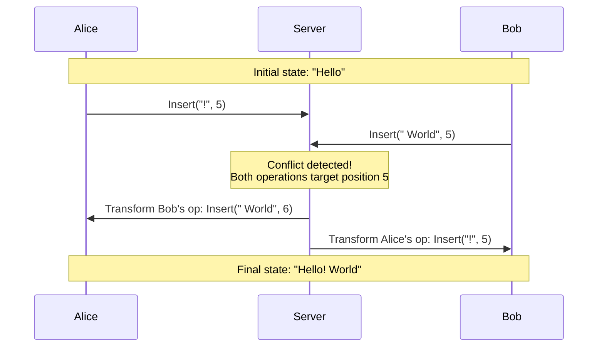
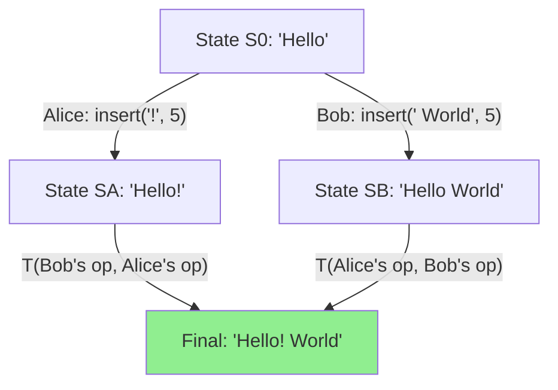
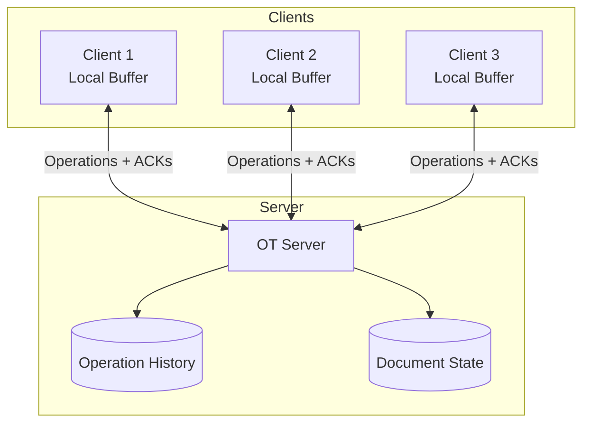
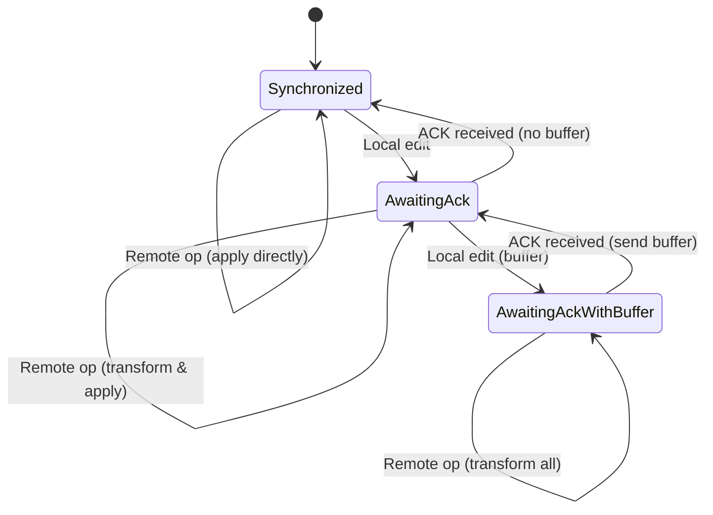
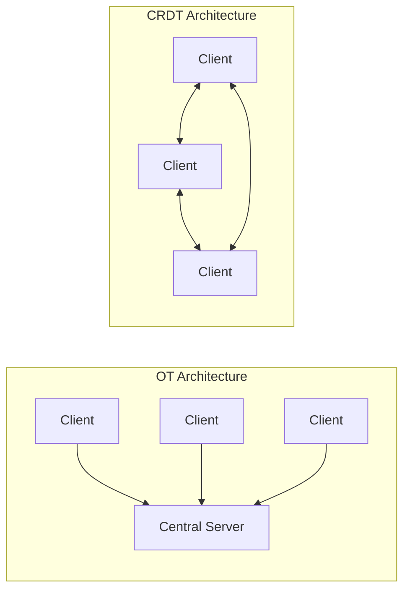
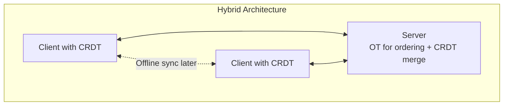

# How to Implement Operational Transformation

Author: [nawazdhandala](https://github.com/nawazdhandala)

Tags: Collaboration, Real-Time, Distributed Systems, Conflict Resolution

Description: Learn how to implement operational transformation for real-time collaborative editing.

---

Real-time collaborative editing powers tools like Google Docs, Figma, and countless code editors. When multiple users edit the same document simultaneously, conflicts are inevitable. Operational Transformation (OT) is one of the foundational algorithms that makes seamless collaboration possible by transforming concurrent operations so they can be applied in any order while converging to the same final state.

## OT Algorithm Fundamentals

At its core, Operational Transformation answers a deceptively simple question: when two users make changes at the same time, how do we apply both changes correctly?

Consider this scenario: Alice and Bob are both editing the text "Hello". Alice inserts "!" at position 5, while Bob simultaneously inserts " World" at position 5. Without coordination, their documents would diverge.



The key insight of OT is that we can **transform** operations against each other so that applying them in different orders produces the same result.

### The Transformation Property

For OT to work correctly, it must satisfy the **convergence property**. Given two concurrent operations `a` and `b`:

```
apply(apply(state, a), transform(b, a)) = apply(apply(state, b), transform(a, b))
```

In plain terms: no matter which operation arrives first, after applying both (with appropriate transformations), both clients end up with identical documents.

## Operation Types

Most collaborative text editors use three fundamental operation types:

### 1. Insert Operation

Inserts a character or string at a specific position.

```typescript
interface InsertOperation {
  type: 'insert';
  position: number;
  text: string;
  clientId: string;
  revision: number;
}

// Example: Insert "Hello" at position 0
const insertOp: InsertOperation = {
  type: 'insert',
  position: 0,
  text: 'Hello',
  clientId: 'alice-123',
  revision: 1
};
```

### 2. Delete Operation

Removes characters starting at a position.

```typescript
interface DeleteOperation {
  type: 'delete';
  position: number;
  length: number;
  clientId: string;
  revision: number;
}

// Example: Delete 5 characters starting at position 0
const deleteOp: DeleteOperation = {
  type: 'delete',
  position: 0,
  length: 5,
  clientId: 'bob-456',
  revision: 2
};
```

### 3. Retain Operation

Skips over a number of characters (used in some OT implementations like Google Wave's operational model).

```typescript
interface RetainOperation {
  type: 'retain';
  count: number;
}
```

### Combined Operation Format

Many OT systems represent operations as arrays of these primitives:

```typescript
type Operation = (InsertOperation | DeleteOperation | RetainOperation)[];

// Example: Replace "Hello" with "Hi" at the start of document "Hello World"
const replaceOp: Operation = [
  { type: 'delete', position: 0, length: 5 },
  { type: 'insert', position: 0, text: 'Hi' },
  { type: 'retain', count: 6 } // Keep " World"
];
```

## Transformation Functions

The heart of OT lies in the transformation functions. Each pair of operation types needs a transformation function.

### Transform Insert vs Insert

When two inserts occur at the same or nearby positions:

```typescript
function transformInsertInsert(
  op1: InsertOperation,
  op2: InsertOperation
): InsertOperation {
  // If op1 is before op2, op2 needs to shift right
  if (op1.position < op2.position) {
    return {
      ...op2,
      position: op2.position + op1.text.length
    };
  }

  // If op1 is after op2, no change needed
  if (op1.position > op2.position) {
    return op2;
  }

  // Same position: use client ID for deterministic ordering
  if (op1.clientId < op2.clientId) {
    return {
      ...op2,
      position: op2.position + op1.text.length
    };
  }

  return op2;
}
```

### Transform Insert vs Delete

When an insert and delete conflict:

```typescript
function transformInsertDelete(
  insertOp: InsertOperation,
  deleteOp: DeleteOperation
): DeleteOperation {
  // Insert is after the delete range: no change
  if (insertOp.position >= deleteOp.position + deleteOp.length) {
    return deleteOp;
  }

  // Insert is before the delete: shift delete position
  if (insertOp.position <= deleteOp.position) {
    return {
      ...deleteOp,
      position: deleteOp.position + insertOp.text.length
    };
  }

  // Insert is within the delete range: split the delete
  const firstPart: DeleteOperation = {
    ...deleteOp,
    length: insertOp.position - deleteOp.position
  };

  const secondPart: DeleteOperation = {
    ...deleteOp,
    position: insertOp.position + insertOp.text.length,
    length: deleteOp.length - firstPart.length
  };

  // Return combined operation (implementation-specific)
  return {
    ...deleteOp,
    position: deleteOp.position,
    length: deleteOp.length + insertOp.text.length
  };
}
```

### Transform Delete vs Delete

Handling overlapping deletions:

```typescript
function transformDeleteDelete(
  op1: DeleteOperation,
  op2: DeleteOperation
): DeleteOperation | null {
  const op1End = op1.position + op1.length;
  const op2End = op2.position + op2.length;

  // No overlap: op1 is entirely before op2
  if (op1End <= op2.position) {
    return {
      ...op2,
      position: op2.position - op1.length
    };
  }

  // No overlap: op1 is entirely after op2
  if (op1.position >= op2End) {
    return op2;
  }

  // Overlapping deletes: reduce op2's length
  if (op1.position <= op2.position && op1End >= op2End) {
    // op1 completely contains op2
    return null; // op2 becomes a no-op
  }

  if (op1.position >= op2.position && op1End <= op2End) {
    // op2 completely contains op1
    return {
      ...op2,
      length: op2.length - op1.length
    };
  }

  // Partial overlap cases
  if (op1.position < op2.position) {
    // op1 starts before and overlaps into op2
    const overlap = op1End - op2.position;
    return {
      ...op2,
      position: op1.position,
      length: op2.length - overlap
    };
  }

  // op2 starts before and overlaps into op1
  const overlap = op2End - op1.position;
  return {
    ...op2,
    length: op2.length - overlap
  };
}
```

### The Complete Transform Function

Bringing it all together:

```typescript
type AnyOperation = InsertOperation | DeleteOperation;

function transform(
  op1: AnyOperation,
  op2: AnyOperation
): AnyOperation | null {
  if (op1.type === 'insert' && op2.type === 'insert') {
    return transformInsertInsert(op1, op2);
  }

  if (op1.type === 'insert' && op2.type === 'delete') {
    return transformInsertDelete(op1, op2);
  }

  if (op1.type === 'delete' && op2.type === 'insert') {
    // Symmetric transformation
    const transformed = transformInsertDelete(op2, op1);
    return transformed;
  }

  if (op1.type === 'delete' && op2.type === 'delete') {
    return transformDeleteDelete(op1, op2);
  }

  throw new Error('Unknown operation types');
}
```

## Convergence Guarantees

OT must satisfy two critical properties to guarantee convergence:

### Transformation Property 1 (TP1)

For any two concurrent operations `a` and `b`:

```
apply(apply(S, a), T(b, a)) = apply(apply(S, b), T(a, b))
```

This ensures two clients reach the same state regardless of operation order.



### Transformation Property 2 (TP2)

For three or more concurrent operations, the composition must also converge:

```
T(T(c, a), T(b, a)) = T(T(c, b), T(a, b))
```

This property is notoriously difficult to satisfy and is why many OT implementations use a central server to serialize operations.

### Proving Convergence

Here is a simplified test to verify TP1:

```typescript
function verifyTP1(
  initialState: string,
  op1: AnyOperation,
  op2: AnyOperation
): boolean {
  // Path 1: Apply op1, then transformed op2
  const state1a = applyOperation(initialState, op1);
  const transformedOp2 = transform(op1, op2);
  const finalState1 = transformedOp2
    ? applyOperation(state1a, transformedOp2)
    : state1a;

  // Path 2: Apply op2, then transformed op1
  const state2a = applyOperation(initialState, op2);
  const transformedOp1 = transform(op2, op1);
  const finalState2 = transformedOp1
    ? applyOperation(state2a, transformedOp1)
    : state2a;

  return finalState1 === finalState2;
}

// Test case
const initial = "Hello";
const aliceOp: InsertOperation = {
  type: 'insert',
  position: 5,
  text: '!',
  clientId: 'alice',
  revision: 1
};
const bobOp: InsertOperation = {
  type: 'insert',
  position: 5,
  text: ' World',
  clientId: 'bob',
  revision: 1
};

console.log(verifyTP1(initial, aliceOp, bobOp)); // Should print: true
```

## Server-Client Architecture

Most production OT systems use a client-server architecture where the server acts as the single source of truth.

### Architecture Overview



### Server Implementation

```typescript
class OTServer {
  private document: string = '';
  private revision: number = 0;
  private operationHistory: AnyOperation[] = [];
  private clients: Map<string, WebSocket> = new Map();

  handleOperation(
    clientId: string,
    operation: AnyOperation,
    clientRevision: number
  ): void {
    // Transform against all operations since client's revision
    let transformedOp = operation;

    for (let i = clientRevision; i < this.revision; i++) {
      const historicalOp = this.operationHistory[i];
      const result = transform(historicalOp, transformedOp);
      if (result === null) {
        // Operation was cancelled out
        this.acknowledgeClient(clientId, this.revision);
        return;
      }
      transformedOp = result;
    }

    // Apply the transformed operation
    this.document = applyOperation(this.document, transformedOp);
    this.operationHistory.push(transformedOp);
    this.revision++;

    // Acknowledge the sender
    this.acknowledgeClient(clientId, this.revision);

    // Broadcast to all other clients
    this.broadcastOperation(clientId, transformedOp, this.revision);
  }

  private acknowledgeClient(clientId: string, revision: number): void {
    const client = this.clients.get(clientId);
    if (client) {
      client.send(JSON.stringify({
        type: 'ack',
        revision
      }));
    }
  }

  private broadcastOperation(
    excludeClientId: string,
    operation: AnyOperation,
    revision: number
  ): void {
    this.clients.forEach((socket, clientId) => {
      if (clientId !== excludeClientId) {
        socket.send(JSON.stringify({
          type: 'operation',
          operation,
          revision
        }));
      }
    });
  }
}
```

### Client Implementation

```typescript
class OTClient {
  private document: string = '';
  private revision: number = 0;
  private pendingOperations: AnyOperation[] = [];
  private sentOperation: AnyOperation | null = null;
  private socket: WebSocket;

  constructor(serverUrl: string) {
    this.socket = new WebSocket(serverUrl);
    this.socket.onmessage = (event) => this.handleMessage(event);
  }

  // User makes a local edit
  applyLocalOperation(operation: AnyOperation): void {
    // Apply immediately to local document
    this.document = applyOperation(this.document, operation);

    if (this.sentOperation === null) {
      // No operation in flight, send immediately
      this.sendOperation(operation);
    } else {
      // Buffer the operation
      this.pendingOperations.push(operation);
    }
  }

  private sendOperation(operation: AnyOperation): void {
    this.sentOperation = operation;
    this.socket.send(JSON.stringify({
      type: 'operation',
      operation,
      revision: this.revision
    }));
  }

  private handleMessage(event: MessageEvent): void {
    const message = JSON.parse(event.data);

    if (message.type === 'ack') {
      this.handleAck(message.revision);
    } else if (message.type === 'operation') {
      this.handleRemoteOperation(message.operation, message.revision);
    }
  }

  private handleAck(serverRevision: number): void {
    this.revision = serverRevision;
    this.sentOperation = null;

    // Send next pending operation if any
    if (this.pendingOperations.length > 0) {
      const nextOp = this.composeOperations(this.pendingOperations);
      this.pendingOperations = [];
      this.sendOperation(nextOp);
    }
  }

  private handleRemoteOperation(
    operation: AnyOperation,
    serverRevision: number
  ): void {
    this.revision = serverRevision;

    // Transform against sent operation
    if (this.sentOperation) {
      const [transformedRemote, transformedSent] = transformPair(
        operation,
        this.sentOperation
      );
      operation = transformedRemote;
      this.sentOperation = transformedSent;
    }

    // Transform against pending operations
    const transformedPending: AnyOperation[] = [];
    for (const pending of this.pendingOperations) {
      const [transformedRemote, transformedPend] = transformPair(
        operation,
        pending
      );
      operation = transformedRemote;
      transformedPending.push(transformedPend);
    }
    this.pendingOperations = transformedPending;

    // Apply the transformed remote operation
    this.document = applyOperation(this.document, operation);
    this.updateUI();
  }

  private composeOperations(ops: AnyOperation[]): AnyOperation {
    // Combine multiple operations into one
    // Implementation depends on operation format
    return ops[0]; // Simplified
  }

  private updateUI(): void {
    // Update the editor UI with new document state
  }
}

function transformPair(
  op1: AnyOperation,
  op2: AnyOperation
): [AnyOperation, AnyOperation] {
  const transformed1 = transform(op2, op1) || op1;
  const transformed2 = transform(op1, op2) || op2;
  return [transformed1, transformed2];
}
```

### Client State Machine



## OT vs CRDT Comparison

Conflict-free Replicated Data Types (CRDTs) are an alternative approach to collaborative editing. Understanding when to use each is crucial.

### Architectural Comparison



### Feature Comparison

| Feature | OT | CRDT |
|---------|-----|------|
| **Server Requirement** | Required (usually) | Optional |
| **Network Topology** | Star (client-server) | Any (including P2P) |
| **Complexity** | Transform functions | Data structure design |
| **Memory Usage** | Lower (operation history) | Higher (tombstones, IDs) |
| **Offline Support** | Limited | Excellent |
| **Latency** | Low (immediate local apply) | Low (immediate local apply) |
| **Proven at Scale** | Google Docs, Wave | Figma, Apple Notes |
| **Implementation Difficulty** | High (edge cases) | Moderate (library support) |

### When to Choose OT

- You have a reliable central server
- Memory efficiency is important
- You need fine-grained operation history
- Your team has OT expertise

```typescript
// OT is great when you need operation-level history
const operationHistory = [
  { user: 'alice', op: { type: 'insert', text: 'Hello', position: 0 }, time: 1000 },
  { user: 'bob', op: { type: 'insert', text: ' World', position: 5 }, time: 1001 },
  // Can replay, undo, or analyze edits easily
];
```

### When to Choose CRDT

- You need true peer-to-peer collaboration
- Offline-first is a requirement
- You want simpler conflict resolution
- Using established libraries (Yjs, Automerge)

```typescript
// CRDT example using Yjs
import * as Y from 'yjs';

const doc = new Y.Doc();
const text = doc.getText('content');

// Operations automatically merge across peers
text.insert(0, 'Hello');
// No transformation needed - CRDT handles it
```

### Hybrid Approaches

Modern systems often combine both approaches:



## Practical Implementation Tips

### 1. Start with a Library

Building OT from scratch is error-prone. Consider:

- **ShareDB**: Node.js OT server with good documentation
- **ot.js**: Client-side OT library
- **Yjs**: If you decide CRDT is better for your use case

### 2. Handle Edge Cases

```typescript
// Always validate operations before applying
function validateOperation(doc: string, op: AnyOperation): boolean {
  if (op.type === 'insert') {
    return op.position >= 0 && op.position <= doc.length;
  }
  if (op.type === 'delete') {
    return op.position >= 0 && op.position + op.length <= doc.length;
  }
  return false;
}

// Handle cursor positions
interface CursorPosition {
  clientId: string;
  position: number;
}

function transformCursor(cursor: CursorPosition, op: AnyOperation): CursorPosition {
  if (op.type === 'insert' && op.position <= cursor.position) {
    return { ...cursor, position: cursor.position + op.text.length };
  }
  if (op.type === 'delete' && op.position < cursor.position) {
    const deleteEnd = op.position + op.length;
    if (deleteEnd <= cursor.position) {
      return { ...cursor, position: cursor.position - op.length };
    }
    return { ...cursor, position: op.position };
  }
  return cursor;
}
```

### 3. Implement Undo/Redo

```typescript
class UndoManager {
  private undoStack: AnyOperation[] = [];
  private redoStack: AnyOperation[] = [];

  recordOperation(op: AnyOperation): void {
    this.undoStack.push(this.invertOperation(op));
    this.redoStack = []; // Clear redo on new edit
  }

  undo(): AnyOperation | null {
    const op = this.undoStack.pop();
    if (op) {
      this.redoStack.push(this.invertOperation(op));
    }
    return op || null;
  }

  private invertOperation(op: AnyOperation): AnyOperation {
    if (op.type === 'insert') {
      return {
        type: 'delete',
        position: op.position,
        length: op.text.length,
        clientId: op.clientId,
        revision: op.revision
      };
    }
    // For delete, we need the original text (store it!)
    throw new Error('Delete inversion requires original text');
  }
}
```

### 4. Add Presence Awareness

```typescript
interface UserPresence {
  clientId: string;
  name: string;
  color: string;
  cursor: number;
  selection?: { start: number; end: number };
}

class PresenceManager {
  private presence: Map<string, UserPresence> = new Map();

  updatePresence(clientId: string, presence: Partial<UserPresence>): void {
    const current = this.presence.get(clientId) || {
      clientId,
      name: 'Anonymous',
      color: this.generateColor(clientId),
      cursor: 0
    };
    this.presence.set(clientId, { ...current, ...presence });
    this.broadcastPresence();
  }

  private generateColor(clientId: string): string {
    // Generate consistent color from client ID
    const hash = clientId.split('').reduce((a, b) => {
      a = ((a << 5) - a) + b.charCodeAt(0);
      return a & a;
    }, 0);
    return `hsl(${Math.abs(hash) % 360}, 70%, 50%)`;
  }

  private broadcastPresence(): void {
    // Send presence updates to all clients
  }
}
```

## Testing Your OT Implementation

Thorough testing is essential:

```typescript
describe('OT Transform Functions', () => {
  it('should satisfy TP1 for insert-insert', () => {
    const states = ['', 'a', 'ab', 'hello world'];
    const positions = [0, 1, 5, 10];

    for (const state of states) {
      for (const pos1 of positions.filter(p => p <= state.length)) {
        for (const pos2 of positions.filter(p => p <= state.length)) {
          const op1: InsertOperation = {
            type: 'insert',
            position: pos1,
            text: 'X',
            clientId: 'a',
            revision: 1
          };
          const op2: InsertOperation = {
            type: 'insert',
            position: pos2,
            text: 'Y',
            clientId: 'b',
            revision: 1
          };

          expect(verifyTP1(state, op1, op2)).toBe(true);
        }
      }
    }
  });

  it('should handle concurrent deletes of same region', () => {
    const state = 'Hello World';
    const op1: DeleteOperation = {
      type: 'delete',
      position: 0,
      length: 5,
      clientId: 'a',
      revision: 1
    };
    const op2: DeleteOperation = {
      type: 'delete',
      position: 0,
      length: 5,
      clientId: 'b',
      revision: 1
    };

    expect(verifyTP1(state, op1, op2)).toBe(true);
  });
});
```

## Conclusion

Operational Transformation is a powerful algorithm for building real-time collaborative applications. While the core concept is elegant, production implementations require careful attention to edge cases, network conditions, and user experience.

Key takeaways:

1. **Start with fundamentals**: Understand the transformation properties before implementing
2. **Use proven libraries**: ShareDB, ot.js, or similar when possible
3. **Test extensively**: OT edge cases are subtle and easy to miss
4. **Consider alternatives**: CRDTs may be simpler for your use case
5. **Plan for scale**: Operation history, garbage collection, and presence all need attention

Whether you choose OT or CRDT, the goal is the same: give users the magical experience of seamlessly collaborating in real-time. With careful implementation, you can deliver that experience reliably.
