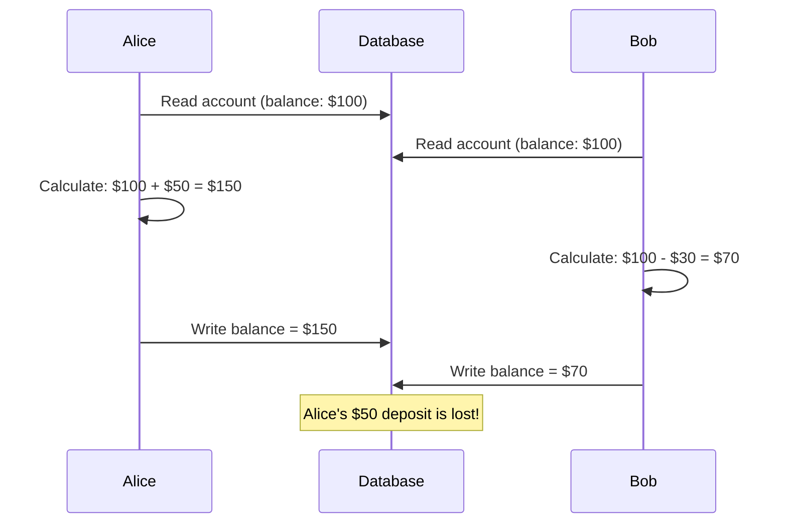
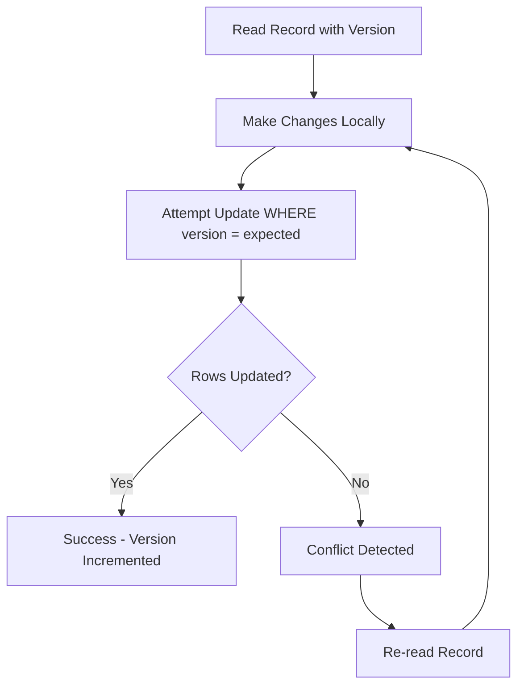

# How to Create Optimistic Locking Implementation

Author: [nawazdhandala](https://www.github.com/nawazdhandala)

Tags: Database, Concurrency, Locking, Transactions, Data Integrity

Description: Implement optimistic locking with version numbers and timestamps for concurrent data access without database-level locks.

---

Database locking is one of those topics that seems simple until you have two users editing the same record at the same time. Pessimistic locking works by blocking access while someone is working on a record, but it creates bottlenecks and can lead to deadlocks. Optimistic locking takes a different approach: it assumes conflicts are rare and only checks for them at write time.

This guide walks through building an optimistic locking system from scratch using version numbers and timestamps. We will cover the core concepts, implementation patterns, and conflict resolution strategies.

## Understanding the Problem

When two processes read the same data, modify it independently, and then write their changes back, the last write wins. This is called a lost update, and it can cause serious data integrity issues.



Both users started with the same balance, made their changes, and Bob's write overwrote Alice's deposit. The expected balance should be $120, not $70.

## How Optimistic Locking Solves This

Optimistic locking adds a version identifier to each record. Every update must include the expected version. If the version has changed since you read the data, your update fails and you must retry with fresh data.



## Basic Implementation with Version Numbers

Here is a simple TypeScript implementation using a numeric version field.

```typescript
// Define the interface for entities that support optimistic locking
interface VersionedEntity {
  id: string;
  version: number;
}

// Account entity with version tracking
interface Account extends VersionedEntity {
  name: string;
  balance: number;
}

// Custom error for version conflicts
class OptimisticLockException extends Error {
  constructor(
    public readonly entityId: string,
    public readonly expectedVersion: number,
    public readonly actualVersion: number
  ) {
    super(
      `Version conflict for entity ${entityId}: ` +
      `expected ${expectedVersion}, found ${actualVersion}`
    );
    this.name = 'OptimisticLockException';
  }
}
```

The repository handles reads and writes with version checking.

```typescript
// Generic repository with optimistic locking support
class OptimisticLockingRepository<T extends VersionedEntity> {
  private storage: Map<string, T> = new Map();

  // Read returns the current version along with data
  async findById(id: string): Promise<T | null> {
    return this.storage.get(id) || null;
  }

  // Save checks version before writing
  async save(entity: T): Promise<T> {
    const existing = this.storage.get(entity.id);

    // New entity - set initial version
    if (!existing) {
      const newEntity = { ...entity, version: 1 };
      this.storage.set(entity.id, newEntity);
      return newEntity;
    }

    // Version mismatch - reject the update
    if (existing.version !== entity.version) {
      throw new OptimisticLockException(
        entity.id,
        entity.version,
        existing.version
      );
    }

    // Version matches - increment and save
    const updated = { ...entity, version: entity.version + 1 };
    this.storage.set(entity.id, updated);
    return updated;
  }
}
```

## SQL Implementation

For relational databases, the version check happens in the WHERE clause of your UPDATE statement.

```sql
-- Table with version column
CREATE TABLE accounts (
    id UUID PRIMARY KEY,
    name VARCHAR(255) NOT NULL,
    balance DECIMAL(10,2) NOT NULL,
    version INTEGER NOT NULL DEFAULT 1,
    updated_at TIMESTAMP DEFAULT CURRENT_TIMESTAMP
);

-- Create index for efficient version lookups
CREATE INDEX idx_accounts_version ON accounts(id, version);
```

The update query includes the expected version.

```typescript
// SQL-based optimistic update
async function updateAccountBalance(
  db: Database,
  accountId: string,
  newBalance: number,
  expectedVersion: number
): Promise<Account> {
  // Attempt update with version check
  const result = await db.query(
    `UPDATE accounts
     SET balance = $1,
         version = version + 1,
         updated_at = CURRENT_TIMESTAMP
     WHERE id = $2 AND version = $3
     RETURNING *`,
    [newBalance, accountId, expectedVersion]
  );

  // No rows updated means version mismatch
  if (result.rowCount === 0) {
    const current = await db.query(
      'SELECT version FROM accounts WHERE id = $1',
      [accountId]
    );

    if (!current.rows[0]) {
      throw new Error(`Account ${accountId} not found`);
    }

    throw new OptimisticLockException(
      accountId,
      expectedVersion,
      current.rows[0].version
    );
  }

  return result.rows[0];
}
```

## Timestamp-Based Versioning

Sometimes timestamps work better than numeric versions, especially when you need to know when data was last modified.

```typescript
// Entity using timestamp as version
interface TimestampVersionedEntity {
  id: string;
  updatedAt: Date;
}

interface Product extends TimestampVersionedEntity {
  name: string;
  price: number;
  stock: number;
}

// Update with timestamp comparison
async function updateProduct(
  db: Database,
  product: Product
): Promise<Product> {
  const result = await db.query(
    `UPDATE products
     SET name = $1,
         price = $2,
         stock = $3,
         updated_at = CURRENT_TIMESTAMP
     WHERE id = $4 AND updated_at = $5
     RETURNING *`,
    [product.name, product.price, product.stock, product.id, product.updatedAt]
  );

  if (result.rowCount === 0) {
    throw new Error('Product was modified by another process');
  }

  return result.rows[0];
}
```

Timestamps have a potential issue with precision. Two updates within the same millisecond might not conflict when they should. For high-frequency updates, numeric versions are safer.

## Handling Conflicts with Retry Logic

Most conflicts resolve themselves with a simple retry. Here is a utility function that handles retries with exponential backoff.

```typescript
// Configuration for retry behavior
interface RetryConfig {
  maxAttempts: number;
  baseDelayMs: number;
  maxDelayMs: number;
}

// Execute an operation with automatic retry on version conflicts
async function withOptimisticRetry<T>(
  operation: () => Promise<T>,
  config: RetryConfig = { maxAttempts: 3, baseDelayMs: 100, maxDelayMs: 2000 }
): Promise<T> {
  let lastError: Error | null = null;

  for (let attempt = 1; attempt <= config.maxAttempts; attempt++) {
    try {
      return await operation();
    } catch (error) {
      // Only retry on version conflicts
      if (!(error instanceof OptimisticLockException)) {
        throw error;
      }

      lastError = error;

      // Calculate delay with jitter to prevent thundering herd
      if (attempt < config.maxAttempts) {
        const delay = Math.min(
          config.baseDelayMs * Math.pow(2, attempt - 1) + Math.random() * 50,
          config.maxDelayMs
        );
        await sleep(delay);
      }
    }
  }

  throw lastError;
}

// Helper function for delays
function sleep(ms: number): Promise<void> {
  return new Promise(resolve => setTimeout(resolve, ms));
}
```

Using the retry wrapper makes your business logic cleaner.

```typescript
// Transfer money between accounts with automatic retry
async function transfer(
  repo: OptimisticLockingRepository<Account>,
  fromId: string,
  toId: string,
  amount: number
): Promise<void> {
  await withOptimisticRetry(async () => {
    // Read both accounts
    const fromAccount = await repo.findById(fromId);
    const toAccount = await repo.findById(toId);

    if (!fromAccount || !toAccount) {
      throw new Error('Account not found');
    }

    if (fromAccount.balance < amount) {
      throw new Error('Insufficient funds');
    }

    // Apply changes
    fromAccount.balance -= amount;
    toAccount.balance += amount;

    // Save both - if either fails, the whole operation retries
    await repo.save(fromAccount);
    await repo.save(toAccount);
  });
}
```

## REST API with Conflict Detection

When building APIs, return the current state on conflicts so clients can resolve them.

```typescript
// Express route handler with conflict response
app.put('/api/accounts/:id', async (req, res) => {
  const { id } = req.params;
  const { balance, version } = req.body;

  try {
    const updated = await updateAccountBalance(db, id, balance, version);
    res.json(updated);
  } catch (error) {
    if (error instanceof OptimisticLockException) {
      // Return 409 Conflict with current state
      const current = await db.query(
        'SELECT * FROM accounts WHERE id = $1',
        [id]
      );

      res.status(409).json({
        error: 'Version conflict',
        message: error.message,
        currentState: current.rows[0],
        attemptedVersion: version
      });
      return;
    }

    res.status(500).json({ error: error.message });
  }
});
```

The client can then decide whether to show a merge dialog or automatically retry.

## When to Use Optimistic vs Pessimistic Locking

Optimistic locking works best when:

- Conflicts are relatively rare
- Read operations significantly outnumber writes
- You can afford occasional retries
- Long-running transactions would cause unacceptable blocking

Pessimistic locking is better when:

- Conflicts are frequent
- The cost of a failed transaction is high
- Operations are short and blocking is acceptable
- You need guaranteed exclusive access

## Summary

Optimistic locking provides a way to handle concurrent updates without blocking reads. The key components are:

1. A version field (numeric or timestamp) on each entity
2. Including the expected version in update conditions
3. Failing updates when versions do not match
4. Retrying with fresh data when conflicts occur

Start with numeric versions for simplicity, add retry logic with backoff, and consider timestamps when you need modification tracking. Most importantly, test your implementation under concurrent load to verify it catches real conflicts.
