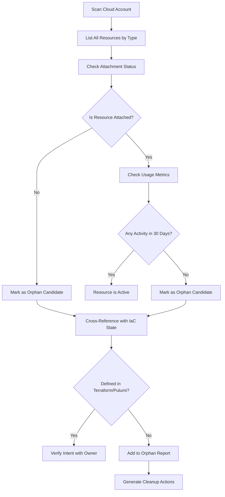
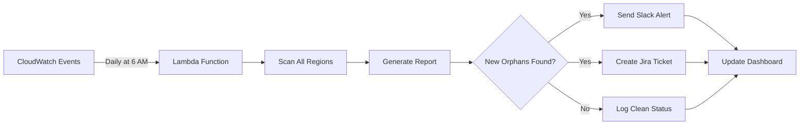
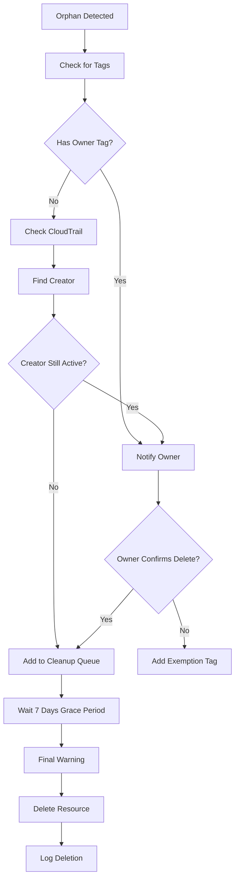
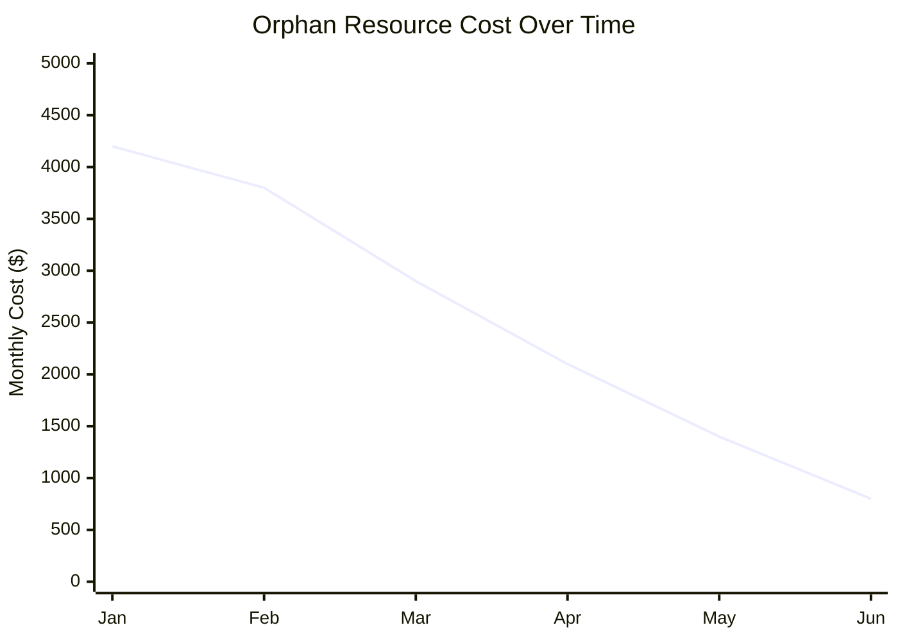

# How to Create Orphan Resource Detection

Author: [nawazdhandala](https://github.com/nawazdhandala)

Tags: Cost Optimization, Cloud, Resources, FinOps

Description: Find and eliminate forgotten cloud resources that silently drain your budget every month.

---

Cloud bills have a way of growing when nobody is watching. A developer spins up a test instance, attaches a 500GB volume, creates an Elastic IP, takes a snapshot "just in case," and then moves on to the next project. The instance gets terminated. The volume, IP, and snapshot stay behind, quietly billing you month after month.

These forgotten resources are called orphans. They serve no purpose, connect to nothing, and cost real money. In large organizations, orphan resources can account for 20-30% of wasted cloud spend.

This guide shows you how to detect them programmatically.

---

## What Makes a Resource an Orphan?

An orphan is any cloud resource that:

- Is not attached to a running workload
- Has no recent access or usage
- Exists outside your Infrastructure as Code definitions
- Was created for a purpose that no longer exists

The most common offenders:

| Resource Type | How It Becomes Orphaned |
| --- | --- |
| **Unattached EBS Volumes** | EC2 instance deleted, volume persists |
| **Unused Elastic IPs** | Instance terminated, IP not released |
| **Stale Snapshots** | Parent volume deleted, snapshot remains |
| **Unused Load Balancers** | Target group empty, ALB/NLB still running |
| **Detached ENIs** | Lambda or container deleted, network interface stays |
| **Orphaned RDS Snapshots** | Database dropped, manual snapshots forgotten |

---

## The Detection Workflow

Before writing scripts, understand the detection process:



The key insight: detection is not just about attachment status. A volume can be attached to an instance that nobody uses. An IP can be allocated but never routed. You need multiple signals.

---

## Detecting Unattached EBS Volumes

Unattached volumes are the most common orphan. When you terminate an EC2 instance, the root volume might get deleted, but additional volumes with `DeleteOnTermination=false` survive.

### AWS CLI Detection

```bash
#!/bin/bash
# Find all unattached EBS volumes in the current region

aws ec2 describe-volumes \
  --filters "Name=status,Values=available" \
  --query 'Volumes[*].{
    VolumeId:VolumeId,
    Size:Size,
    CreateTime:CreateTime,
    AvailabilityZone:AvailabilityZone
  }' \
  --output table
```

### Python Script with Cost Estimation

```python
import boto3
from datetime import datetime, timezone

def find_orphan_volumes():
    ec2 = boto3.client('ec2')
    pricing = boto3.client('pricing', region_name='us-east-1')

    # Get all available (unattached) volumes
    response = ec2.describe_volumes(
        Filters=[{'Name': 'status', 'Values': ['available']}]
    )

    orphans = []
    total_monthly_cost = 0

    for volume in response['Volumes']:
        volume_id = volume['VolumeId']
        size_gb = volume['Size']
        volume_type = volume['VolumeType']
        create_time = volume['CreateTime']

        # Calculate age in days
        age_days = (datetime.now(timezone.utc) - create_time).days

        # Estimate monthly cost (rough figures, varies by region)
        cost_per_gb = {
            'gp2': 0.10,
            'gp3': 0.08,
            'io1': 0.125,
            'io2': 0.125,
            'st1': 0.045,
            'sc1': 0.025
        }

        monthly_cost = size_gb * cost_per_gb.get(volume_type, 0.10)
        total_monthly_cost += monthly_cost

        orphans.append({
            'volume_id': volume_id,
            'size_gb': size_gb,
            'type': volume_type,
            'age_days': age_days,
            'monthly_cost': monthly_cost,
            'tags': {t['Key']: t['Value'] for t in volume.get('Tags', [])}
        })

    return orphans, total_monthly_cost

if __name__ == '__main__':
    orphans, total_cost = find_orphan_volumes()

    print(f"Found {len(orphans)} orphan volumes")
    print(f"Total monthly waste: ${total_cost:.2f}")
    print()

    for v in sorted(orphans, key=lambda x: x['monthly_cost'], reverse=True):
        print(f"  {v['volume_id']}: {v['size_gb']}GB {v['type']}, "
              f"{v['age_days']} days old, ${v['monthly_cost']:.2f}/month")
```

---

## Detecting Unused Elastic IPs

Elastic IPs cost nothing when attached to a running instance. The moment they become unattached, AWS charges you. It is a small fee per hour, but it adds up when you have dozens sitting idle.

### AWS CLI Detection

```bash
#!/bin/bash
# Find all unassociated Elastic IPs

aws ec2 describe-addresses \
  --query 'Addresses[?AssociationId==`null`].{
    PublicIp:PublicIp,
    AllocationId:AllocationId,
    Domain:Domain
  }' \
  --output table
```

### Python Script

```python
import boto3

def find_orphan_elastic_ips():
    ec2 = boto3.client('ec2')

    response = ec2.describe_addresses()

    orphans = []

    for address in response['Addresses']:
        # If no AssociationId, the EIP is not attached
        if 'AssociationId' not in address:
            orphans.append({
                'public_ip': address.get('PublicIp'),
                'allocation_id': address.get('AllocationId'),
                'domain': address.get('Domain'),
                'tags': {t['Key']: t['Value'] for t in address.get('Tags', [])}
            })

    # EIP cost when unattached: ~$0.005/hour = ~$3.60/month
    monthly_cost_per_eip = 3.60
    total_monthly_cost = len(orphans) * monthly_cost_per_eip

    return orphans, total_monthly_cost

if __name__ == '__main__':
    orphans, total_cost = find_orphan_elastic_ips()

    print(f"Found {len(orphans)} orphan Elastic IPs")
    print(f"Total monthly waste: ${total_cost:.2f}")
    print()

    for eip in orphans:
        name = eip['tags'].get('Name', 'unnamed')
        print(f"  {eip['public_ip']} ({name}) - {eip['allocation_id']}")
```

---

## Detecting Stale Snapshots

Snapshots are often the worst offenders. Teams create them before major changes, forget about them, and the incremental storage costs pile up. A single 1TB snapshot can cost $50/month in S3 storage.

The tricky part: snapshots might still be valid backups. You need to check whether the source volume exists and whether anyone accessed the snapshot recently.

### Python Script for Stale Snapshot Detection

```python
import boto3
from datetime import datetime, timezone, timedelta

def find_stale_snapshots(age_threshold_days=90):
    ec2 = boto3.client('ec2')

    # Get all snapshots owned by this account
    paginator = ec2.get_paginator('describe_snapshots')

    # Get all current volume IDs
    volumes_response = ec2.describe_volumes()
    active_volume_ids = {v['VolumeId'] for v in volumes_response['Volumes']}

    stale_snapshots = []
    total_size_gb = 0
    cutoff_date = datetime.now(timezone.utc) - timedelta(days=age_threshold_days)

    for page in paginator.paginate(OwnerIds=['self']):
        for snapshot in page['Snapshots']:
            snapshot_id = snapshot['SnapshotId']
            volume_id = snapshot.get('VolumeId', '')
            start_time = snapshot['StartTime']
            size_gb = snapshot['VolumeSize']

            is_stale = False
            reason = []

            # Check 1: Snapshot is older than threshold
            if start_time < cutoff_date:
                reason.append(f"older than {age_threshold_days} days")
                is_stale = True

            # Check 2: Source volume no longer exists
            if volume_id and volume_id not in active_volume_ids:
                reason.append("source volume deleted")
                is_stale = True

            if is_stale:
                stale_snapshots.append({
                    'snapshot_id': snapshot_id,
                    'volume_id': volume_id,
                    'size_gb': size_gb,
                    'age_days': (datetime.now(timezone.utc) - start_time).days,
                    'reason': ', '.join(reason),
                    'description': snapshot.get('Description', ''),
                    'tags': {t['Key']: t['Value'] for t in snapshot.get('Tags', [])}
                })
                total_size_gb += size_gb

    # Snapshot storage cost: ~$0.05/GB-month
    total_monthly_cost = total_size_gb * 0.05

    return stale_snapshots, total_size_gb, total_monthly_cost

if __name__ == '__main__':
    snapshots, total_gb, total_cost = find_stale_snapshots(age_threshold_days=90)

    print(f"Found {len(snapshots)} stale snapshots")
    print(f"Total size: {total_gb} GB")
    print(f"Total monthly waste: ${total_cost:.2f}")
    print()

    for s in sorted(snapshots, key=lambda x: x['size_gb'], reverse=True)[:20]:
        name = s['tags'].get('Name', s['description'][:30] or 'unnamed')
        print(f"  {s['snapshot_id']}: {s['size_gb']}GB, "
              f"{s['age_days']} days old - {s['reason']}")
```

---

## Building a Complete Orphan Scanner

Here is a unified script that scans all three resource types and generates a report:

```python
#!/usr/bin/env python3
"""
Orphan Resource Scanner for AWS
Detects: unattached volumes, unused EIPs, stale snapshots
"""

import boto3
import json
from datetime import datetime, timezone, timedelta
from dataclasses import dataclass, asdict
from typing import List

@dataclass
class OrphanResource:
    resource_type: str
    resource_id: str
    region: str
    age_days: int
    monthly_cost: float
    details: dict
    recommended_action: str

def scan_region(region: str, snapshot_age_days: int = 90) -> List[OrphanResource]:
    """Scan a single region for orphan resources."""
    orphans = []

    ec2 = boto3.client('ec2', region_name=region)

    # Scan unattached volumes
    try:
        volumes = ec2.describe_volumes(
            Filters=[{'Name': 'status', 'Values': ['available']}]
        )['Volumes']

        for v in volumes:
            age = (datetime.now(timezone.utc) - v['CreateTime']).days
            cost_rates = {'gp2': 0.10, 'gp3': 0.08, 'io1': 0.125, 'st1': 0.045}
            monthly = v['Size'] * cost_rates.get(v['VolumeType'], 0.10)

            orphans.append(OrphanResource(
                resource_type='EBS Volume',
                resource_id=v['VolumeId'],
                region=region,
                age_days=age,
                monthly_cost=monthly,
                details={'size_gb': v['Size'], 'type': v['VolumeType']},
                recommended_action='Delete or create snapshot first'
            ))
    except Exception as e:
        print(f"Error scanning volumes in {region}: {e}")

    # Scan unassociated EIPs
    try:
        addresses = ec2.describe_addresses()['Addresses']

        for a in addresses:
            if 'AssociationId' not in a:
                orphans.append(OrphanResource(
                    resource_type='Elastic IP',
                    resource_id=a.get('AllocationId', a.get('PublicIp')),
                    region=region,
                    age_days=0,  # EIPs do not have creation time
                    monthly_cost=3.60,
                    details={'public_ip': a.get('PublicIp')},
                    recommended_action='Release if not needed'
                ))
    except Exception as e:
        print(f"Error scanning EIPs in {region}: {e}")

    # Scan stale snapshots
    try:
        active_volumes = {v['VolumeId']
                        for v in ec2.describe_volumes()['Volumes']}
        cutoff = datetime.now(timezone.utc) - timedelta(days=snapshot_age_days)

        paginator = ec2.get_paginator('describe_snapshots')
        for page in paginator.paginate(OwnerIds=['self']):
            for s in page['Snapshots']:
                is_old = s['StartTime'] < cutoff
                vol_deleted = s.get('VolumeId') and s['VolumeId'] not in active_volumes

                if is_old or vol_deleted:
                    age = (datetime.now(timezone.utc) - s['StartTime']).days
                    monthly = s['VolumeSize'] * 0.05

                    orphans.append(OrphanResource(
                        resource_type='EBS Snapshot',
                        resource_id=s['SnapshotId'],
                        region=region,
                        age_days=age,
                        monthly_cost=monthly,
                        details={
                            'size_gb': s['VolumeSize'],
                            'source_volume': s.get('VolumeId'),
                            'volume_exists': s.get('VolumeId') in active_volumes
                        },
                        recommended_action='Delete if backup no longer needed'
                    ))
    except Exception as e:
        print(f"Error scanning snapshots in {region}: {e}")

    return orphans

def scan_all_regions() -> List[OrphanResource]:
    """Scan all AWS regions for orphan resources."""
    ec2 = boto3.client('ec2')
    regions = [r['RegionName'] for r in ec2.describe_regions()['Regions']]

    all_orphans = []
    for region in regions:
        print(f"Scanning {region}...")
        all_orphans.extend(scan_region(region))

    return all_orphans

def generate_report(orphans: List[OrphanResource]) -> dict:
    """Generate a summary report."""
    total_monthly = sum(o.monthly_cost for o in orphans)
    total_yearly = total_monthly * 12

    by_type = {}
    for o in orphans:
        if o.resource_type not in by_type:
            by_type[o.resource_type] = {'count': 0, 'monthly_cost': 0}
        by_type[o.resource_type]['count'] += 1
        by_type[o.resource_type]['monthly_cost'] += o.monthly_cost

    return {
        'scan_time': datetime.now(timezone.utc).isoformat(),
        'total_orphans': len(orphans),
        'total_monthly_cost': round(total_monthly, 2),
        'total_yearly_cost': round(total_yearly, 2),
        'by_resource_type': by_type,
        'resources': [asdict(o) for o in sorted(
            orphans, key=lambda x: x.monthly_cost, reverse=True
        )]
    }

if __name__ == '__main__':
    print("Starting orphan resource scan...")
    orphans = scan_all_regions()
    report = generate_report(orphans)

    print(f"\n{'='*60}")
    print(f"ORPHAN RESOURCE REPORT")
    print(f"{'='*60}")
    print(f"Total orphan resources: {report['total_orphans']}")
    print(f"Monthly cost: ${report['total_monthly_cost']}")
    print(f"Yearly cost: ${report['total_yearly_cost']}")
    print()

    for rtype, stats in report['by_resource_type'].items():
        print(f"  {rtype}: {stats['count']} resources, ${stats['monthly_cost']:.2f}/month")

    # Save detailed report
    with open('orphan_report.json', 'w') as f:
        json.dump(report, f, indent=2, default=str)

    print(f"\nDetailed report saved to orphan_report.json")
```

---

## Automating Detection with Scheduled Scans

Running manual scans is not enough. Orphans accumulate daily. Set up automated detection:



### Lambda Deployment

```python
# lambda_function.py
import json
import boto3
import os
from orphan_scanner import scan_all_regions, generate_report

def lambda_handler(event, context):
    orphans = scan_all_regions()
    report = generate_report(orphans)

    # Store report in S3
    s3 = boto3.client('s3')
    bucket = os.environ['REPORT_BUCKET']
    key = f"orphan-reports/{report['scan_time']}.json"

    s3.put_object(
        Bucket=bucket,
        Key=key,
        Body=json.dumps(report, indent=2, default=str),
        ContentType='application/json'
    )

    # Alert if threshold exceeded
    if report['total_monthly_cost'] > float(os.environ.get('COST_THRESHOLD', 100)):
        sns = boto3.client('sns')
        sns.publish(
            TopicArn=os.environ['ALERT_TOPIC'],
            Subject='Orphan Resources Alert',
            Message=f"Monthly orphan cost: ${report['total_monthly_cost']}\n"
                   f"Total resources: {report['total_orphans']}\n"
                   f"Report: s3://{bucket}/{key}"
        )

    return {
        'statusCode': 200,
        'body': json.dumps({
            'orphans_found': report['total_orphans'],
            'monthly_cost': report['total_monthly_cost']
        })
    }
```

---

## Multi-Cloud Considerations

The examples above focus on AWS, but orphans exist everywhere. Here are the equivalents for other clouds:

### Google Cloud

| AWS Resource | GCP Equivalent | gcloud Command |
| --- | --- | --- |
| Unattached EBS | Unattached Persistent Disk | `gcloud compute disks list --filter="NOT users:*"` |
| Unused EIP | Unused Static IP | `gcloud compute addresses list --filter="status=RESERVED"` |
| Stale Snapshot | Old Disk Snapshot | `gcloud compute snapshots list --filter="creationTimestamp<'2024-01-01'"` |

### Azure

| AWS Resource | Azure Equivalent | az Command |
| --- | --- | --- |
| Unattached EBS | Unattached Managed Disk | `az disk list --query "[?diskState=='Unattached']"` |
| Unused EIP | Unused Public IP | `az network public-ip list --query "[?ipConfiguration==null]"` |
| Stale Snapshot | Old Disk Snapshot | `az snapshot list --query "[?timeCreated<'2024-01-01']"` |

---

## Cleanup Strategies

Finding orphans is half the battle. The other half is deleting them without breaking things.

### Safe Deletion Workflow



### Best Practices

1. **Never delete immediately.** Add a 7-day grace period and send warnings.
2. **Snapshot before deleting volumes.** Even orphans might contain data someone needs.
3. **Use tags to track exemptions.** Some resources look like orphans but serve a purpose (DR, compliance).
4. **Track who created what.** CloudTrail logs help you find the right person to ask.
5. **Automate cleanup for low-risk resources.** EIPs and old snapshots are usually safe to auto-delete after warning.

---

## Monitoring Your Orphan Reduction

Track your progress over time:



Key metrics to watch:

- **Total orphan cost per month** (should trend down)
- **New orphans created per week** (indicates process issues)
- **Time to cleanup** (how long orphans exist before deletion)
- **Orphans by team** (find the worst offenders)

---

## Summary

Orphan resources are a silent tax on your cloud bill. They accumulate through normal operations and stay around because nobody owns them.

To detect and eliminate orphans:

1. Scan for unattached volumes, unused IPs, and stale snapshots regularly
2. Cross-reference with your IaC state to find resources created outside Terraform/Pulumi
3. Notify resource creators before deletion
4. Automate the entire workflow with Lambda or scheduled jobs
5. Track orphan metrics alongside your other cloud cost KPIs

The scripts in this post give you a starting point. Customize them for your environment, add your own resource types, and integrate with your alerting tools.

A 20% reduction in cloud waste is achievable in the first month. The resources are already identified. You just have to delete them.
