# How to Build OSPF Area Configuration

Author: [nawazdhandala](https://github.com/nawazdhandala)

Tags: OSPF, Networking, Routing, Areas

Description: A comprehensive guide to building OSPF area configurations. Learn about area types, design principles, and practical configurations for scalable enterprise networks.

---

> OSPF (Open Shortest Path First) is the backbone of enterprise routing. Understanding how to properly design and configure OSPF areas is essential for building scalable, efficient networks. This guide walks you through everything from basic concepts to advanced configurations.

Poorly designed OSPF networks lead to routing instability, slow convergence, and excessive resource consumption. Proper area configuration solves these problems.

---

## Overview

OSPF uses a hierarchical design where the network is divided into areas. This reduces the size of link-state databases, limits the scope of route calculations, and improves convergence times.

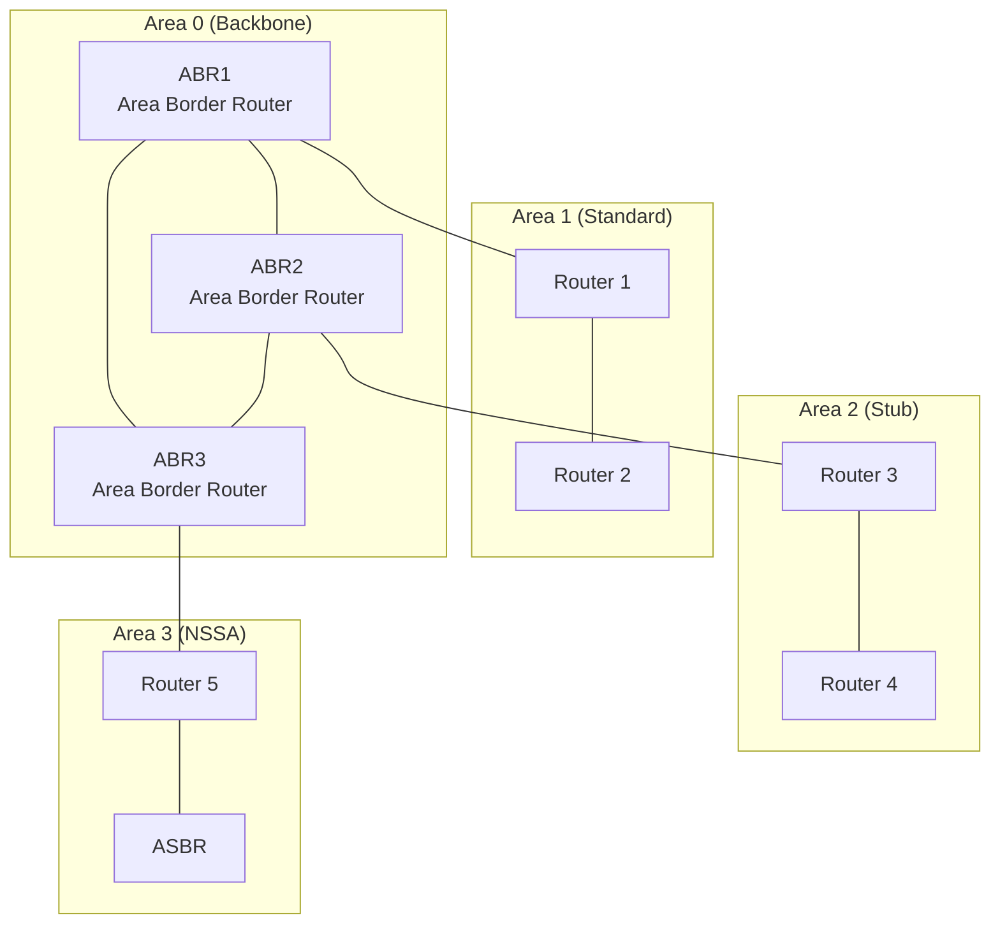

---

## OSPF Fundamentals

### How OSPF Works

OSPF is a link-state routing protocol that builds a complete topology map of the network. Each router maintains an identical link-state database (LSDB) and runs the Dijkstra SPF algorithm to calculate the shortest path to each destination.

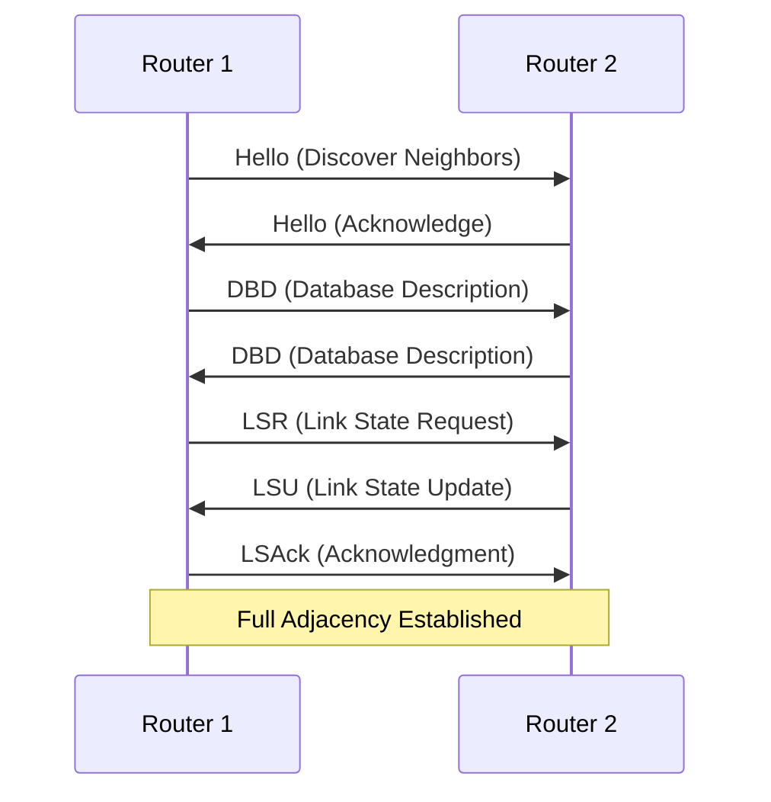

### Key OSPF Concepts

Before diving into area configuration, understand these fundamental concepts:

- **Router ID**: A unique 32-bit identifier for each OSPF router
- **Area**: A logical grouping of routers and networks
- **LSA (Link State Advertisement)**: Messages containing routing information
- **SPF Algorithm**: Calculates the shortest path tree
- **Cost**: Metric based on interface bandwidth

---

## OSPF Area Types

### Area 0 - The Backbone

Area 0 is the backbone area. All other areas must connect to Area 0 either directly or through a virtual link. This is a fundamental OSPF design requirement.

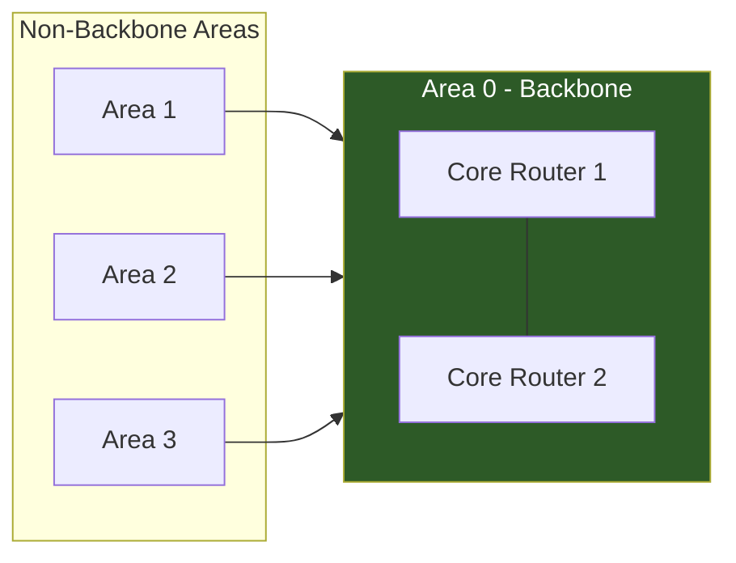

### Standard Areas

Standard areas accept all LSA types. They maintain full routing information including external routes redistributed into OSPF.

**LSA Types in Standard Areas:**
- Type 1: Router LSA
- Type 2: Network LSA
- Type 3: Summary LSA
- Type 4: ASBR Summary LSA
- Type 5: External LSA

### Stub Areas

Stub areas block external LSAs (Type 5) and replace them with a default route. This significantly reduces the link-state database size.

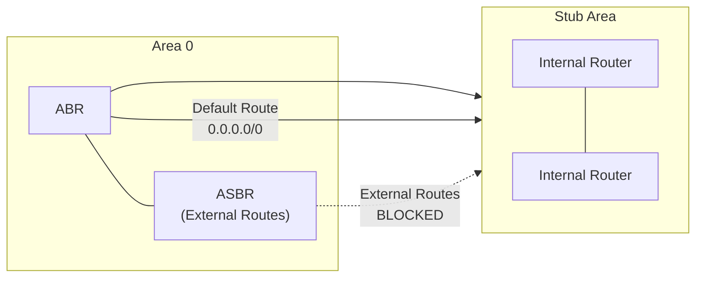

**When to use Stub Areas:**
- Remote sites with a single exit point
- Areas where external route details are unnecessary
- Networks where you want to reduce LSDB size

### Totally Stubby Areas

Totally stubby areas block both external LSAs (Type 5) and inter-area summary LSAs (Type 3). Only a single default route is injected.

**Benefits:**
- Smallest possible LSDB
- Fastest SPF calculations
- Best for simple hub-and-spoke designs

### Not-So-Stubby Areas (NSSA)

NSSA areas allow external route injection via Type 7 LSAs while still blocking Type 5 LSAs. The ABR converts Type 7 to Type 5 when flooding to other areas.

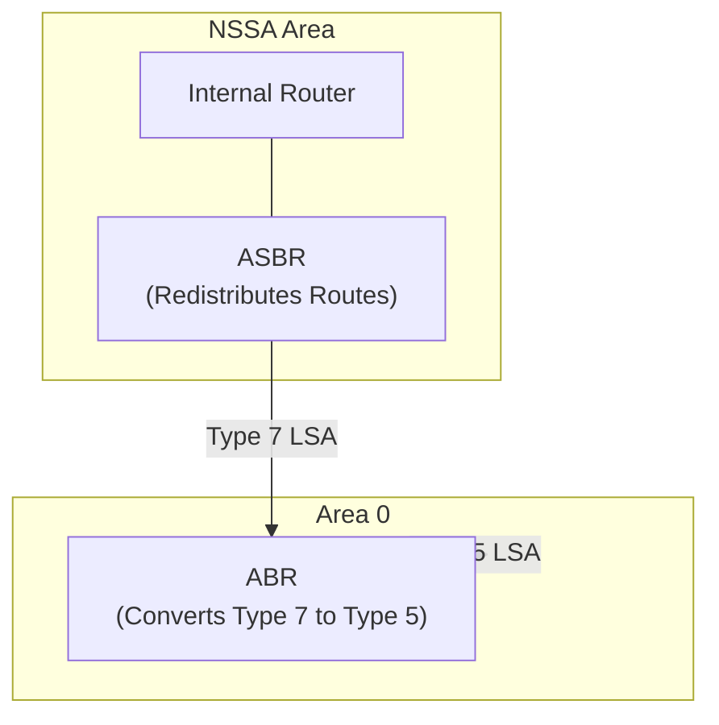

**When to use NSSA:**
- Remote sites that need to redistribute local routes
- Branch offices with local internet connections
- Sites running other routing protocols

---

## Basic Configuration

### Cisco IOS Configuration

The following examples demonstrate OSPF configuration on Cisco IOS devices.

#### Enable OSPF Process

Start by enabling the OSPF routing process and setting a router ID:

```cisco
! Enable OSPF with process ID 1
router ospf 1
  ! Set a unique router ID (use loopback IP for stability)
  router-id 10.0.0.1
  ! Log adjacency changes for troubleshooting
  log-adjacency-changes
```

#### Configure Interfaces in Areas

Assign interfaces to OSPF areas using the network command or interface-level configuration:

```cisco
! Method 1: Network statement (classic approach)
router ospf 1
  ! Place all 10.1.x.x interfaces in Area 0
  network 10.1.0.0 0.0.255.255 area 0
  ! Place all 10.2.x.x interfaces in Area 1
  network 10.2.0.0 0.0.255.255 area 1
  ! Place all 10.3.x.x interfaces in Area 2
  network 10.3.0.0 0.0.255.255 area 2

! Method 2: Interface-level configuration (recommended for clarity)
interface GigabitEthernet0/0
  ip address 10.1.1.1 255.255.255.0
  ip ospf 1 area 0

interface GigabitEthernet0/1
  ip address 10.2.1.1 255.255.255.0
  ip ospf 1 area 1
```

#### Configure Stub Area

All routers in a stub area must agree on the stub configuration:

```cisco
! On ABR connecting to stub area
router ospf 1
  ! Declare Area 2 as stub
  area 2 stub
  ! Optionally set the default route cost
  area 2 default-cost 10

! On internal routers in the stub area
router ospf 1
  area 2 stub
```

#### Configure Totally Stubby Area

Only the ABR needs the no-summary keyword:

```cisco
! On ABR only - blocks Type 3 LSAs too
router ospf 1
  area 2 stub no-summary
  area 2 default-cost 10

! On internal routers - same as regular stub
router ospf 1
  area 2 stub
```

#### Configure NSSA

NSSA configuration allows external route redistribution:

```cisco
! On ABR
router ospf 1
  area 3 nssa
  ! Optional: suppress default route injection
  area 3 nssa no-summary

! On ASBR in NSSA (redistributing external routes)
router ospf 1
  area 3 nssa
  redistribute static subnets
  redistribute connected subnets
```

### Juniper JunOS Configuration

Equivalent configurations for Juniper devices.

#### Basic OSPF Setup

```junos
# Configure OSPF with multiple areas
protocols {
    ospf {
        # Set reference bandwidth for cost calculation
        reference-bandwidth 100g;

        # Configure Area 0 (backbone)
        area 0.0.0.0 {
            interface ge-0/0/0.0 {
                interface-type p2p;
                metric 10;
            }
            interface lo0.0 {
                passive;
            }
        }

        # Configure Area 1 (standard)
        area 0.0.0.1 {
            interface ge-0/0/1.0 {
                metric 20;
            }
        }
    }
}
```

#### Stub Area Configuration

```junos
protocols {
    ospf {
        area 0.0.0.2 {
            # Configure as stub area
            stub {
                # Set default metric for injected default route
                default-metric 100;
            }
            interface ge-0/0/2.0;
        }
    }
}
```

#### Totally Stubby Area

```junos
protocols {
    ospf {
        area 0.0.0.2 {
            stub {
                default-metric 100;
                # Block Type 3 LSAs (totally stubby)
                no-summaries;
            }
            interface ge-0/0/2.0;
        }
    }
}
```

#### NSSA Configuration

```junos
protocols {
    ospf {
        area 0.0.0.3 {
            nssa {
                # Convert Type 7 to Type 5 at ABR
                default-lsa {
                    default-metric 100;
                    metric-type 1;
                }
            }
            interface ge-0/0/3.0;
        }
    }
}
```

---

## Area Design Best Practices

### Hierarchical Design

Follow a hierarchical model for scalable OSPF networks:

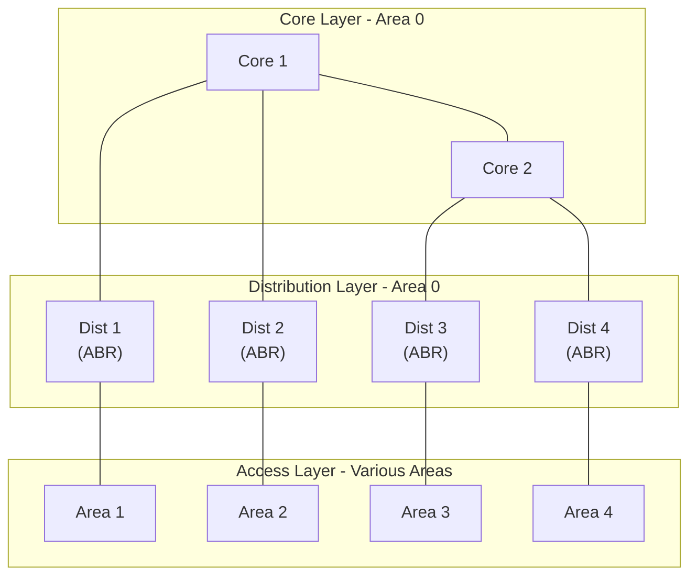

### Area Sizing Guidelines

Consider these guidelines when designing OSPF areas:

| Factor | Recommendation |
|--------|---------------|
| Routers per Area | 50-100 maximum |
| Links per Area | 200-500 maximum |
| ABR Count | Minimize (2-4 per area for redundancy) |
| Area Count | Based on network topology and requirements |

### Router Role Planning

Plan router roles carefully in your OSPF design:

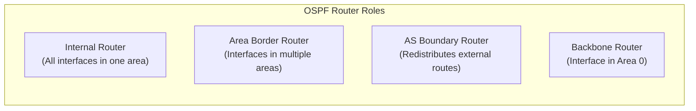

**Router Role Definitions:**
- **Internal Router**: All interfaces belong to the same area
- **Backbone Router**: Has at least one interface in Area 0
- **ABR (Area Border Router)**: Connects two or more areas, one must be Area 0
- **ASBR (AS Boundary Router)**: Redistributes routes from other protocols

---

## Advanced Configurations

### Virtual Links

When an area cannot directly connect to the backbone, use a virtual link through a transit area:

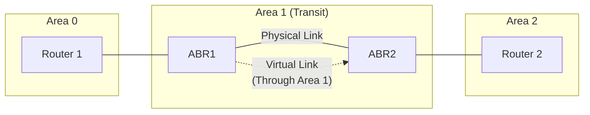

#### Cisco Virtual Link Configuration

```cisco
! On ABR1 (Router ID: 1.1.1.1)
router ospf 1
  ! Create virtual link through Area 1 to ABR2
  area 1 virtual-link 2.2.2.2

! On ABR2 (Router ID: 2.2.2.2)
router ospf 1
  ! Create virtual link through Area 1 to ABR1
  area 1 virtual-link 1.1.1.1
```

#### Juniper Virtual Link Configuration

```junos
protocols {
    ospf {
        area 0.0.0.1 {
            # Virtual link to remote ABR
            virtual-link neighbor-id 2.2.2.2 transit-area 0.0.0.1;
        }
    }
}
```

### Route Summarization

Summarize routes at ABRs to reduce routing table size and improve stability:

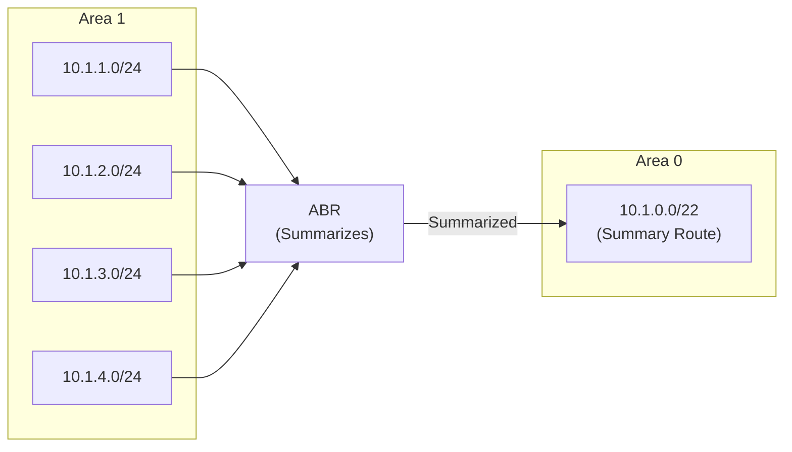

#### Cisco Route Summarization

```cisco
router ospf 1
  ! Summarize Area 1 routes when advertising to other areas
  area 1 range 10.1.0.0 255.255.252.0
  ! Optionally advertise a specific cost
  area 1 range 10.1.0.0 255.255.252.0 cost 100
  ! Suppress individual routes and only advertise summary
  area 1 range 10.1.0.0 255.255.252.0 not-advertise
```

#### Juniper Route Summarization

```junos
protocols {
    ospf {
        area 0.0.0.1 {
            # Summarize routes from this area
            area-range 10.1.0.0/22 {
                # Optionally override the metric
                override-metric 100;
            }
        }
    }
}
```

### Authentication

Secure OSPF adjacencies with authentication:

#### Cisco MD5 Authentication

```cisco
! Interface-level MD5 authentication
interface GigabitEthernet0/0
  ip ospf authentication message-digest
  ip ospf message-digest-key 1 md5 SecureKey123

! Area-wide authentication
router ospf 1
  area 0 authentication message-digest
```

#### Cisco SHA Authentication (IOS-XE)

```cisco
! Use SHA-256 for stronger security
key chain OSPF-KEYS
  key 1
    key-string SecurePassword123
    cryptographic-algorithm hmac-sha-256

interface GigabitEthernet0/0
  ip ospf authentication key-chain OSPF-KEYS
```

#### Juniper Authentication

```junos
protocols {
    ospf {
        area 0.0.0.0 {
            interface ge-0/0/0.0 {
                authentication {
                    md5 1 key "SecureKey123";
                }
            }
        }
    }
}
```

---

## Troubleshooting OSPF Areas

### Verification Commands

Use these commands to verify OSPF operation.

#### Cisco Verification Commands

```cisco
! View OSPF neighbor relationships
show ip ospf neighbor

! Example output:
! Neighbor ID  Pri  State       Dead Time  Address      Interface
! 10.0.0.2     1    FULL/DR     00:00:32   10.1.1.2     Gi0/0
! 10.0.0.3     1    FULL/BDR    00:00:35   10.1.1.3     Gi0/0

! View OSPF interfaces and their areas
show ip ospf interface brief

! View the link-state database
show ip ospf database

! View OSPF routes in the routing table
show ip route ospf

! View area-specific information
show ip ospf border-routers

! Detailed OSPF process information
show ip ospf
```

#### Juniper Verification Commands

```junos
# View OSPF neighbors
show ospf neighbor

# View OSPF interface details
show ospf interface detail

# View link-state database
show ospf database

# View OSPF routes
show route protocol ospf

# View area border router information
show ospf route abr
```

### Common Issues and Solutions

#### Issue 1: Neighbors Stuck in EXSTART/EXCHANGE

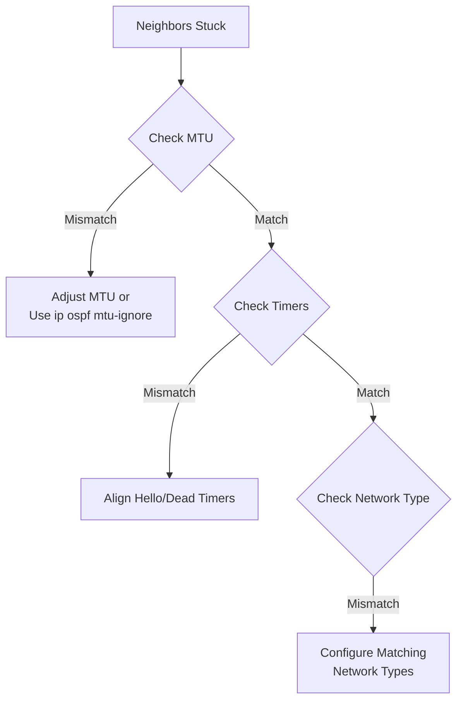

**Solution - MTU Mismatch:**

```cisco
! Temporary workaround - ignore MTU in DBD packets
interface GigabitEthernet0/0
  ip ospf mtu-ignore

! Better solution - match MTU on both ends
interface GigabitEthernet0/0
  mtu 1500
```

#### Issue 2: Area Mismatch

Routers in different areas will not form adjacencies:

```cisco
! Verify area configuration
show ip ospf interface GigabitEthernet0/0

! Fix by correcting area assignment
interface GigabitEthernet0/0
  ip ospf 1 area 0
```

#### Issue 3: Stub Area Misconfiguration

All routers in a stub area must be configured as stub:

```cisco
! Verify stub configuration
show ip ospf | include Stub

! Ensure all routers have matching configuration
router ospf 1
  area 2 stub
```

#### Issue 4: No Connectivity to Area 0

Non-backbone areas must connect to Area 0:

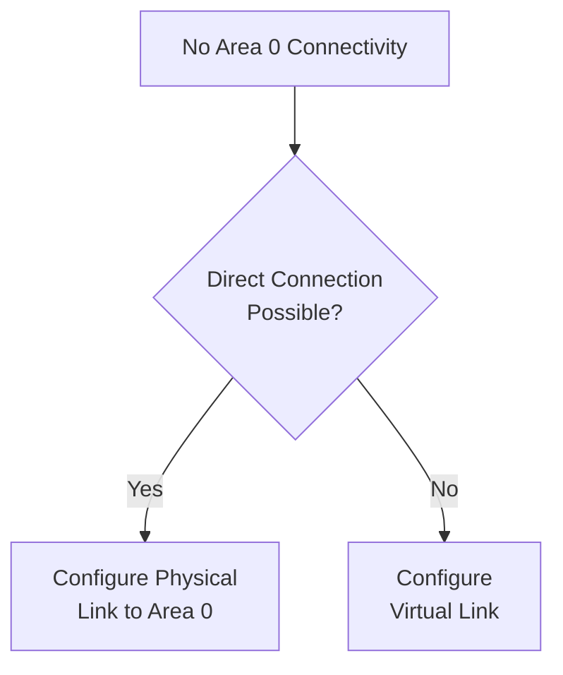

### Debug Commands (Use Carefully)

```cisco
! Debug OSPF adjacency formation
debug ip ospf adj

! Debug OSPF LSA flooding
debug ip ospf lsa-generation

! Debug OSPF packet processing
debug ip ospf packet

! Always disable debugging when done
undebug all
```

---

## Complete Configuration Example

Here is a complete multi-area OSPF configuration for a typical enterprise network.

### Network Topology

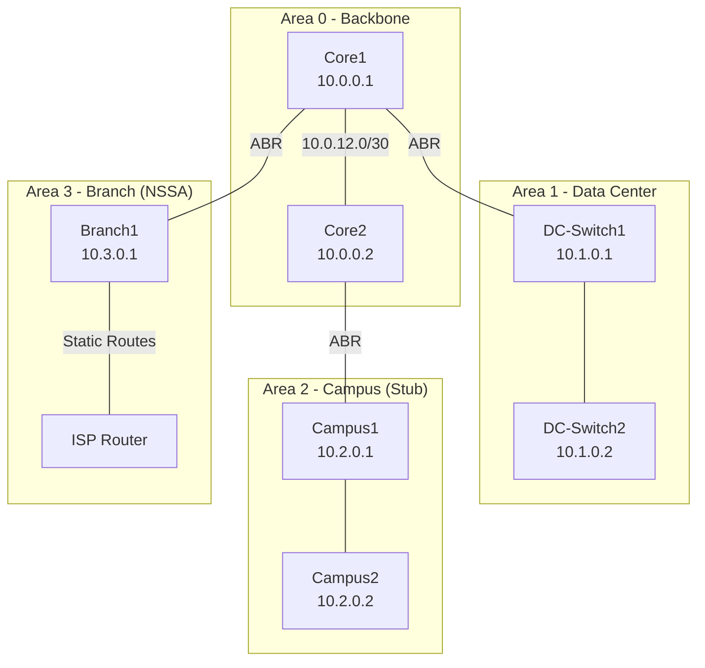

### Core Router 1 Configuration (ABR)

```cisco
! Core1 - Area Border Router
hostname Core1

! Loopback for Router ID stability
interface Loopback0
  ip address 10.0.0.1 255.255.255.255
  ip ospf 1 area 0

! Link to Core2 - Backbone
interface GigabitEthernet0/0
  description Link to Core2
  ip address 10.0.12.1 255.255.255.252
  ip ospf 1 area 0
  ip ospf network point-to-point
  ip ospf cost 10

! Link to DC1 - Area 1
interface GigabitEthernet0/1
  description Link to DC1 - Area 1
  ip address 10.0.101.1 255.255.255.252
  ip ospf 1 area 1
  ip ospf cost 10

! Link to Branch1 - Area 3 (NSSA)
interface GigabitEthernet0/2
  description Link to Branch1 - Area 3
  ip address 10.0.103.1 255.255.255.252
  ip ospf 1 area 3
  ip ospf cost 100

! OSPF Process Configuration
router ospf 1
  router-id 10.0.0.1
  log-adjacency-changes detail
  auto-cost reference-bandwidth 100000

  ! Area 1 route summarization
  area 1 range 10.1.0.0 255.255.0.0

  ! Area 3 NSSA configuration with default route
  area 3 nssa default-information-originate

  ! Authentication for backbone
  area 0 authentication message-digest

! Interface authentication
interface GigabitEthernet0/0
  ip ospf authentication message-digest
  ip ospf message-digest-key 1 md5 BackboneKey123
```

### Core Router 2 Configuration (ABR)

```cisco
! Core2 - Area Border Router
hostname Core2

interface Loopback0
  ip address 10.0.0.2 255.255.255.255
  ip ospf 1 area 0

! Link to Core1 - Backbone
interface GigabitEthernet0/0
  description Link to Core1
  ip address 10.0.12.2 255.255.255.252
  ip ospf 1 area 0
  ip ospf network point-to-point
  ip ospf cost 10
  ip ospf authentication message-digest
  ip ospf message-digest-key 1 md5 BackboneKey123

! Link to Campus1 - Area 2 (Stub)
interface GigabitEthernet0/1
  description Link to Campus1 - Area 2
  ip address 10.0.102.1 255.255.255.252
  ip ospf 1 area 2
  ip ospf cost 20

router ospf 1
  router-id 10.0.0.2
  log-adjacency-changes detail
  auto-cost reference-bandwidth 100000

  ! Area 2 as totally stubby
  area 2 stub no-summary
  area 2 default-cost 10

  ! Route summarization for Area 2
  area 2 range 10.2.0.0 255.255.0.0

  area 0 authentication message-digest
```

### Campus Router Configuration (Stub Area)

```cisco
! Campus1 - Internal Router in Stub Area
hostname Campus1

interface Loopback0
  ip address 10.2.0.1 255.255.255.255
  ip ospf 1 area 2

! Link to Core2 (ABR)
interface GigabitEthernet0/0
  description Uplink to Core2
  ip address 10.0.102.2 255.255.255.252
  ip ospf 1 area 2
  ip ospf cost 20

! Campus LAN interfaces
interface GigabitEthernet0/1
  description Campus LAN 1
  ip address 10.2.1.1 255.255.255.0
  ip ospf 1 area 2

interface GigabitEthernet0/2
  description Campus LAN 2
  ip address 10.2.2.1 255.255.255.0
  ip ospf 1 area 2

router ospf 1
  router-id 10.2.0.1
  log-adjacency-changes
  auto-cost reference-bandwidth 100000

  ! Must match ABR stub configuration (without no-summary)
  area 2 stub

  ! Passive interfaces for LAN segments
  passive-interface GigabitEthernet0/1
  passive-interface GigabitEthernet0/2
```

### Branch Router Configuration (NSSA)

```cisco
! Branch1 - ASBR in NSSA Area
hostname Branch1

interface Loopback0
  ip address 10.3.0.1 255.255.255.255
  ip ospf 1 area 3

! Link to Core1 (ABR)
interface GigabitEthernet0/0
  description Uplink to Core1
  ip address 10.0.103.2 255.255.255.252
  ip ospf 1 area 3

! Local branch networks
interface GigabitEthernet0/1
  description Branch LAN
  ip address 10.3.1.1 255.255.255.0
  ip ospf 1 area 3

! Link to ISP (not in OSPF)
interface GigabitEthernet0/2
  description ISP Link
  ip address 203.0.113.2 255.255.255.252

! Static route to ISP for internet access
ip route 0.0.0.0 0.0.0.0 203.0.113.1

router ospf 1
  router-id 10.3.0.1
  log-adjacency-changes
  auto-cost reference-bandwidth 100000

  ! NSSA configuration
  area 3 nssa

  ! Redistribute the default route into OSPF as Type 7 LSA
  redistribute static subnets route-map STATIC-TO-OSPF

  passive-interface GigabitEthernet0/1

! Route map to control redistribution
route-map STATIC-TO-OSPF permit 10
  match ip address prefix-list DEFAULT-ONLY
  set metric 1000
  set metric-type type-2

ip prefix-list DEFAULT-ONLY seq 10 permit 0.0.0.0/0
```

---

## Monitoring and Maintenance

### OSPF Health Checks

Create a script to regularly verify OSPF health:

```bash
#!/bin/bash
# ospf_health_check.sh - Monitor OSPF status

ROUTER_IP="10.0.0.1"
EXPECTED_NEIGHBORS=3

# Check neighbor count
neighbor_count=$(ssh admin@$ROUTER_IP "show ip ospf neighbor | count FULL")

if [ "$neighbor_count" -lt "$EXPECTED_NEIGHBORS" ]; then
    echo "WARNING: OSPF neighbor count ($neighbor_count) below expected ($EXPECTED_NEIGHBORS)"
    # Send alert to monitoring system
    curl -X POST https://oneuptime.com/api/alert \
        -H "Authorization: Bearer $ONEUPTIME_TOKEN" \
        -d "{\"message\": \"OSPF neighbor count low on $ROUTER_IP\"}"
fi

# Check for stuck neighbors
stuck_neighbors=$(ssh admin@$ROUTER_IP "show ip ospf neighbor | include EXSTART|EXCHANGE|2WAY")
if [ -n "$stuck_neighbors" ]; then
    echo "WARNING: Stuck OSPF neighbors detected"
    echo "$stuck_neighbors"
fi
```

### Key Metrics to Monitor

| Metric | Warning Threshold | Critical Threshold |
|--------|------------------|-------------------|
| Neighbor Count | Below expected | Zero |
| SPF Runs | More than 5 per minute | More than 20 per minute |
| LSA Count | 20% above baseline | 50% above baseline |
| Adjacency Flaps | Any occurrence | Multiple in 5 minutes |

---

## Summary

Building a well-designed OSPF area configuration requires understanding the different area types and their use cases:

| Area Type | External Routes | Summary Routes | Best For |
|-----------|-----------------|----------------|----------|
| Standard | Yes | Yes | General purpose |
| Stub | No (default only) | Yes | Simple branch sites |
| Totally Stubby | No (default only) | No (default only) | Minimal routing tables |
| NSSA | No Type 5, Yes Type 7 | Yes | Branches with local redistribution |

**Key Takeaways:**

1. **Always start with Area 0** - All other areas must connect to it
2. **Use stub areas** for remote sites with single exit points
3. **Use NSSA** when you need to redistribute external routes in a stub-like area
4. **Summarize routes** at ABRs to reduce LSDB size and improve stability
5. **Implement authentication** to secure OSPF adjacencies
6. **Monitor regularly** to catch issues before they impact the network

---

*Need to monitor your network infrastructure? [OneUptime](https://oneuptime.com) provides comprehensive monitoring for routers, switches, and network services with real-time alerting and detailed metrics.*
