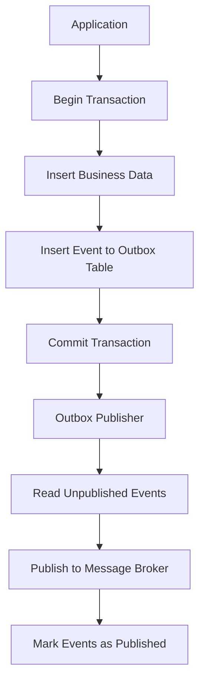
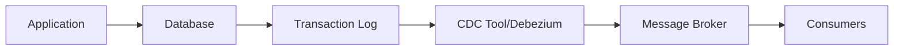

# How to Build Outbox Pattern Implementation

Author: [nawazdhandala](https://www.github.com/nawazdhandala)

Tags: Outbox Pattern, Microservices, Event-Driven, Database, Reliability

Description: Implement the transactional outbox pattern for reliable event publishing with database transactions, polling, and CDC approaches.

---

In distributed systems, keeping data consistent across services is one of the hardest problems to solve. When you need to save data to your database and publish an event to a message broker, things can go wrong in ways that leave your system in an inconsistent state. The outbox pattern provides an elegant solution to this problem by leveraging database transactions to guarantee that your data changes and events are always in sync.

## The Problem with Dual Writes

Consider a typical scenario in a microservices architecture where an order service needs to save an order and notify other services:

```javascript
// This approach has a critical flaw
async function createOrder(orderData) {
    // Step 1: Save to database
    await db.orders.insert(orderData);

    // Step 2: Publish event to message broker
    // What happens if this fails?
    await messageBroker.publish('order.created', orderData);
}
```

If the message broker is down or the network fails after saving the order, you end up with an order in your database but no event published. Downstream services never learn about the order. Inventory is not reserved. Payment is not processed. Your system is now inconsistent.

You might think wrapping both operations in a distributed transaction would help, but distributed transactions across databases and message brokers are complex, slow, and often not supported by modern message brokers like Kafka or RabbitMQ.

## How the Outbox Pattern Works

The outbox pattern solves this by storing events in an "outbox" table within the same database transaction as your business data. A separate process then reads from this table and publishes events to the message broker.



Since both the business data and the outbox event are written in the same transaction, they either both succeed or both fail. This gives you atomicity without needing distributed transactions.

## Building the Outbox Table

Start by creating a table to store your outbox events. The schema should capture everything needed to publish the event later.

```sql
-- Create the outbox table with all necessary columns
CREATE TABLE outbox (
    id UUID PRIMARY KEY DEFAULT gen_random_uuid(),

    -- The type of aggregate this event belongs to (e.g., 'Order', 'Customer')
    aggregate_type VARCHAR(255) NOT NULL,

    -- The unique identifier of the aggregate instance
    aggregate_id VARCHAR(255) NOT NULL,

    -- The event type for routing (e.g., 'OrderCreated', 'OrderShipped')
    event_type VARCHAR(255) NOT NULL,

    -- The serialized event payload as JSON
    payload JSONB NOT NULL,

    -- When the event was created
    created_at TIMESTAMP WITH TIME ZONE DEFAULT NOW(),

    -- When the event was published (NULL means pending)
    published_at TIMESTAMP WITH TIME ZONE,

    -- Number of publish attempts for retry tracking
    retry_count INTEGER DEFAULT 0
);

-- Index for efficiently finding unpublished events
CREATE INDEX idx_outbox_unpublished ON outbox(created_at)
    WHERE published_at IS NULL;
```

## Implementing the Application Layer

Here is a Node.js implementation that writes to both the business table and the outbox in a single transaction:

```javascript
// orderService.js - Writes order and outbox event atomically

const { Pool } = require('pg');
const pool = new Pool();

async function createOrder(orderData) {
    const client = await pool.connect();

    try {
        // Start a transaction to ensure atomicity
        await client.query('BEGIN');

        // Insert the order into the orders table
        const orderResult = await client.query(
            `INSERT INTO orders (customer_id, total_amount, status, created_at)
             VALUES ($1, $2, $3, NOW())
             RETURNING id`,
            [orderData.customerId, orderData.totalAmount, 'pending']
        );

        const orderId = orderResult.rows[0].id;

        // Prepare the event payload
        const eventPayload = {
            orderId: orderId,
            customerId: orderData.customerId,
            totalAmount: orderData.totalAmount,
            items: orderData.items,
            createdAt: new Date().toISOString()
        };

        // Insert the event into the outbox table within the same transaction
        await client.query(
            `INSERT INTO outbox (aggregate_type, aggregate_id, event_type, payload)
             VALUES ($1, $2, $3, $4)`,
            ['Order', orderId, 'OrderCreated', JSON.stringify(eventPayload)]
        );

        // Commit both writes together
        await client.query('COMMIT');

        return { orderId, ...orderData };

    } catch (error) {
        // If anything fails, roll back everything
        await client.query('ROLLBACK');
        throw error;
    } finally {
        client.release();
    }
}

module.exports = { createOrder };
```

## Building the Outbox Publisher

The publisher is a separate process that polls the outbox table and publishes events to your message broker. Here is an implementation using polling:

```javascript
// outboxPublisher.js - Polls and publishes outbox events

const { Pool } = require('pg');
const amqp = require('amqplib');

const pool = new Pool();
const POLL_INTERVAL_MS = 1000;
const BATCH_SIZE = 100;

async function startPublisher() {
    // Connect to RabbitMQ
    const connection = await amqp.connect('amqp://localhost');
    const channel = await connection.createChannel();

    console.log('Outbox publisher started');

    // Poll continuously for new events
    while (true) {
        try {
            await processOutboxBatch(channel);
        } catch (error) {
            console.error('Error processing outbox batch:', error);
        }

        // Wait before polling again
        await sleep(POLL_INTERVAL_MS);
    }
}

async function processOutboxBatch(channel) {
    const client = await pool.connect();

    try {
        // Fetch unpublished events with row locking to handle concurrent publishers
        const result = await client.query(
            `SELECT id, aggregate_type, aggregate_id, event_type, payload
             FROM outbox
             WHERE published_at IS NULL
             ORDER BY created_at ASC
             LIMIT $1
             FOR UPDATE SKIP LOCKED`,
            [BATCH_SIZE]
        );

        if (result.rows.length === 0) {
            return;
        }

        console.log(`Processing ${result.rows.length} outbox events`);

        for (const event of result.rows) {
            // Publish to RabbitMQ using the event type as routing key
            const routingKey = `${event.aggregate_type.toLowerCase()}.${event.event_type}`;

            channel.publish(
                'events',
                routingKey,
                Buffer.from(event.payload),
                {
                    persistent: true,
                    messageId: event.id,
                    contentType: 'application/json'
                }
            );

            // Mark the event as published
            await client.query(
                `UPDATE outbox SET published_at = NOW() WHERE id = $1`,
                [event.id]
            );
        }

    } finally {
        client.release();
    }
}

function sleep(ms) {
    return new Promise(resolve => setTimeout(resolve, ms));
}

startPublisher().catch(console.error);
```

## Using Change Data Capture

Polling works well for moderate throughput, but it adds latency and database load. Change Data Capture (CDC) provides a more efficient alternative by streaming changes directly from the database transaction log.



With tools like Debezium, you configure a connector to watch your outbox table:

```json
{
    "name": "outbox-connector",
    "config": {
        "connector.class": "io.debezium.connector.postgresql.PostgresConnector",
        "database.hostname": "localhost",
        "database.port": "5432",
        "database.user": "postgres",
        "database.password": "secret",
        "database.dbname": "orders_db",
        "database.server.name": "orders",
        "table.include.list": "public.outbox",
        "transforms": "outbox",
        "transforms.outbox.type": "io.debezium.transforms.outbox.EventRouter",
        "transforms.outbox.table.field.event.key": "aggregate_id",
        "transforms.outbox.table.field.event.type": "event_type",
        "transforms.outbox.table.field.event.payload": "payload",
        "transforms.outbox.route.topic.replacement": "${routedByValue}"
    }
}
```

Debezium reads the PostgreSQL write-ahead log (WAL) and publishes events to Kafka topics automatically. This approach eliminates polling overhead and provides near real-time event delivery.

## Handling Failures and Retries

The publisher might crash after publishing but before marking the event as published. This means consumers must handle duplicate events. Design your consumers to be idempotent:

```javascript
// orderConsumer.js - Idempotent event handler

const processedEvents = new Set();  // In production, use a database table

async function handleOrderCreated(message) {
    const eventId = message.properties.messageId;

    // Check if we have already processed this event
    if (await hasProcessed(eventId)) {
        console.log(`Event ${eventId} already processed, skipping`);
        return;
    }

    const payload = JSON.parse(message.content.toString());

    // Process the event
    await reserveInventory(payload.orderId, payload.items);

    // Record that we processed this event
    await markAsProcessed(eventId);
}

async function hasProcessed(eventId) {
    // Check your processed_events table
    const result = await db.query(
        'SELECT 1 FROM processed_events WHERE event_id = $1',
        [eventId]
    );
    return result.rows.length > 0;
}

async function markAsProcessed(eventId) {
    await db.query(
        'INSERT INTO processed_events (event_id, processed_at) VALUES ($1, NOW())',
        [eventId]
    );
}
```

## Cleaning Up Old Events

The outbox table will grow over time. Add a cleanup job to remove old published events:

```javascript
// outboxCleanup.js - Removes old published events

const RETENTION_DAYS = 7;

async function cleanupOutbox() {
    const result = await pool.query(
        `DELETE FROM outbox
         WHERE published_at IS NOT NULL
         AND published_at < NOW() - INTERVAL '${RETENTION_DAYS} days'`
    );

    console.log(`Cleaned up ${result.rowCount} old outbox events`);
}

// Run cleanup every hour
setInterval(cleanupOutbox, 60 * 60 * 1000);
```

## When to Use the Outbox Pattern

The outbox pattern is a great fit when:

- You need guaranteed event delivery after database changes
- Your services require eventual consistency
- You want to decouple your application from message broker availability
- You are building event-driven microservices that cannot afford to lose events

Consider alternatives like the saga pattern if you need compensating transactions, or direct event publishing if occasional message loss is acceptable for your use case.

## Summary

The transactional outbox pattern provides a reliable way to publish events from your applications without risking data inconsistency. By storing events in a database table within the same transaction as your business data, you guarantee that every successful write produces its corresponding event. Whether you use polling or CDC to publish these events, the pattern gives you the reliability needed for production microservices. The key tradeoff is added complexity and slight latency, but for most distributed systems, this is a worthwhile investment in data consistency.
