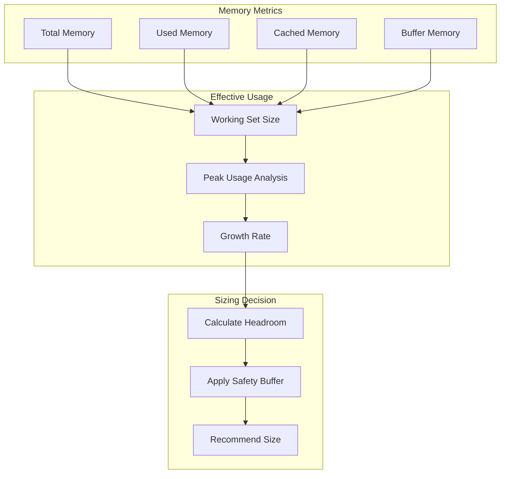

# How to Build Over-Provisioned Detection

Author: [nawazdhandala](https://github.com/nawazdhandala)

Tags: Cost Optimization, FinOps, Cloud, Right-Sizing

Description: Learn how to detect and address over-provisioned cloud resources.

---

## What Is Over-Provisioning?

Over-provisioning occurs when cloud resources are allocated beyond what workloads actually require. It's one of the largest sources of cloud waste, often accounting for 30-40% of unnecessary spending. Teams provision generously during initial deployments, then forget to right-size as usage patterns stabilize.

The challenge is that over-provisioning is invisible unless you actively measure it. Your systems run fine, alerts stay quiet, and nobody questions why that database instance needs 64GB of RAM when it only uses 8GB. The waste accumulates silently across hundreds of resources.


---

## 1. Over-Provisioning Indicators

Before diving into specific resources, establish the key indicators that signal over-provisioning across your infrastructure.

### Defining Utilization Thresholds

Different resources have different acceptable utilization ranges. A database server at 80% CPU is concerning, while a batch processing worker at 20% average might be perfectly sized for its burst workloads.

```yaml
# over-provisioning-thresholds.yaml
thresholds:
  compute:
    cpu:
      critical_low: 5      # Under 5% = severely over-provisioned
      warning_low: 15      # Under 15% = likely over-provisioned
      optimal_min: 30      # 30-70% = well-sized
      optimal_max: 70
      warning_high: 85     # Over 85% = under-provisioned risk
    memory:
      critical_low: 10
      warning_low: 25
      optimal_min: 40
      optimal_max: 75
      warning_high: 85

  storage:
    disk_usage:
      critical_low: 10
      warning_low: 25
      optimal_min: 40
      optimal_max: 75
    iops_utilization:
      critical_low: 5
      warning_low: 15
      optimal_min: 30
      optimal_max: 70

  network:
    bandwidth_utilization:
      critical_low: 5
      warning_low: 15
      optimal_min: 25
      optimal_max: 60

  database:
    connection_pool:
      critical_low: 10
      warning_low: 20
      optimal_min: 40
      optimal_max: 70
```

### Building a Detection Framework

Create a systematic approach to identify over-provisioned resources across your infrastructure.

```typescript
// over-provisioning-detector.ts
interface ResourceMetrics {
  resourceId: string;
  resourceType: string;
  region: string;
  metrics: {
    cpu?: UtilizationMetric;
    memory?: UtilizationMetric;
    storage?: UtilizationMetric;
    network?: UtilizationMetric;
    iops?: UtilizationMetric;
  };
  cost: {
    currentMonthlyCost: number;
    currency: string;
  };
  tags: Record<string, string>;
}

interface UtilizationMetric {
  average: number;
  p50: number;
  p95: number;
  p99: number;
  max: number;
  min: number;
  sampleCount: number;
  periodDays: number;
}

interface OverProvisioningResult {
  resourceId: string;
  resourceType: string;
  severity: 'critical' | 'warning' | 'info';
  indicators: OverProvisioningIndicator[];
  recommendedSize: string;
  estimatedMonthlySavings: number;
  confidence: number;
}

interface OverProvisioningIndicator {
  metric: string;
  currentValue: number;
  threshold: number;
  message: string;
}

class OverProvisioningDetector {
  private thresholds: ThresholdConfig;

  constructor(thresholds: ThresholdConfig) {
    this.thresholds = thresholds;
  }

  analyzeResource(resource: ResourceMetrics): OverProvisioningResult | null {
    const indicators: OverProvisioningIndicator[] = [];

    // Check each metric type
    if (resource.metrics.cpu) {
      indicators.push(...this.analyzeCPU(resource.metrics.cpu));
    }
    if (resource.metrics.memory) {
      indicators.push(...this.analyzeMemory(resource.metrics.memory));
    }
    if (resource.metrics.storage) {
      indicators.push(...this.analyzeStorage(resource.metrics.storage));
    }
    if (resource.metrics.network) {
      indicators.push(...this.analyzeNetwork(resource.metrics.network));
    }

    if (indicators.length === 0) {
      return null;
    }

    const severity = this.calculateSeverity(indicators);
    const confidence = this.calculateConfidence(resource, indicators);
    const recommendedSize = this.calculateRecommendedSize(resource, indicators);
    const savings = this.estimateSavings(resource, recommendedSize);

    return {
      resourceId: resource.resourceId,
      resourceType: resource.resourceType,
      severity,
      indicators,
      recommendedSize,
      estimatedMonthlySavings: savings,
      confidence,
    };
  }

  private analyzeCPU(cpu: UtilizationMetric): OverProvisioningIndicator[] {
    const indicators: OverProvisioningIndicator[] = [];
    const thresholds = this.thresholds.compute.cpu;

    // Check average utilization
    if (cpu.average < thresholds.critical_low) {
      indicators.push({
        metric: 'cpu_average',
        currentValue: cpu.average,
        threshold: thresholds.critical_low,
        message: `Average CPU utilization (${cpu.average.toFixed(1)}%) is critically low`,
      });
    } else if (cpu.average < thresholds.warning_low) {
      indicators.push({
        metric: 'cpu_average',
        currentValue: cpu.average,
        threshold: thresholds.warning_low,
        message: `Average CPU utilization (${cpu.average.toFixed(1)}%) indicates over-provisioning`,
      });
    }

    // Check if p95 is also low (confirms consistent under-utilization)
    if (cpu.p95 < thresholds.warning_low) {
      indicators.push({
        metric: 'cpu_p95',
        currentValue: cpu.p95,
        threshold: thresholds.warning_low,
        message: `P95 CPU utilization (${cpu.p95.toFixed(1)}%) confirms consistent under-use`,
      });
    }

    return indicators;
  }

  private analyzeMemory(memory: UtilizationMetric): OverProvisioningIndicator[] {
    const indicators: OverProvisioningIndicator[] = [];
    const thresholds = this.thresholds.compute.memory;

    if (memory.average < thresholds.critical_low) {
      indicators.push({
        metric: 'memory_average',
        currentValue: memory.average,
        threshold: thresholds.critical_low,
        message: `Average memory utilization (${memory.average.toFixed(1)}%) is critically low`,
      });
    } else if (memory.average < thresholds.warning_low) {
      indicators.push({
        metric: 'memory_average',
        currentValue: memory.average,
        threshold: thresholds.warning_low,
        message: `Average memory utilization (${memory.average.toFixed(1)}%) suggests over-provisioning`,
      });
    }

    // Memory max check - if max is still low, strong signal
    if (memory.max < thresholds.optimal_min) {
      indicators.push({
        metric: 'memory_max',
        currentValue: memory.max,
        threshold: thresholds.optimal_min,
        message: `Peak memory usage (${memory.max.toFixed(1)}%) never approaches capacity`,
      });
    }

    return indicators;
  }

  private analyzeStorage(storage: UtilizationMetric): OverProvisioningIndicator[] {
    const indicators: OverProvisioningIndicator[] = [];
    const thresholds = this.thresholds.storage.disk_usage;

    if (storage.average < thresholds.critical_low) {
      indicators.push({
        metric: 'storage_usage',
        currentValue: storage.average,
        threshold: thresholds.critical_low,
        message: `Storage utilization (${storage.average.toFixed(1)}%) is extremely low`,
      });
    } else if (storage.average < thresholds.warning_low) {
      indicators.push({
        metric: 'storage_usage',
        currentValue: storage.average,
        threshold: thresholds.warning_low,
        message: `Storage utilization (${storage.average.toFixed(1)}%) indicates over-provisioning`,
      });
    }

    return indicators;
  }

  private analyzeNetwork(network: UtilizationMetric): OverProvisioningIndicator[] {
    const indicators: OverProvisioningIndicator[] = [];
    const thresholds = this.thresholds.network.bandwidth_utilization;

    if (network.p95 < thresholds.critical_low) {
      indicators.push({
        metric: 'network_bandwidth',
        currentValue: network.p95,
        threshold: thresholds.critical_low,
        message: `Network bandwidth utilization (${network.p95.toFixed(1)}% p95) is very low`,
      });
    }

    return indicators;
  }

  private calculateSeverity(
    indicators: OverProvisioningIndicator[]
  ): 'critical' | 'warning' | 'info' {
    const hasCritical = indicators.some((i) => i.metric.includes('critical'));
    const multipleIndicators = indicators.length >= 2;

    if (hasCritical || (multipleIndicators && indicators.length >= 3)) {
      return 'critical';
    }
    if (multipleIndicators) {
      return 'warning';
    }
    return 'info';
  }

  private calculateConfidence(
    resource: ResourceMetrics,
    indicators: OverProvisioningIndicator[]
  ): number {
    let confidence = 0.5; // Base confidence

    // More sample data = higher confidence
    const sampleCounts = Object.values(resource.metrics)
      .filter(Boolean)
      .map((m) => m!.sampleCount);
    const avgSamples = sampleCounts.reduce((a, b) => a + b, 0) / sampleCounts.length;
    if (avgSamples > 1000) confidence += 0.2;
    else if (avgSamples > 500) confidence += 0.1;

    // Multiple corroborating indicators = higher confidence
    if (indicators.length >= 3) confidence += 0.15;
    else if (indicators.length >= 2) confidence += 0.1;

    // P95 and max also low = higher confidence
    const hasP95Indicator = indicators.some((i) => i.metric.includes('p95'));
    const hasMaxIndicator = indicators.some((i) => i.metric.includes('max'));
    if (hasP95Indicator) confidence += 0.1;
    if (hasMaxIndicator) confidence += 0.1;

    return Math.min(confidence, 0.95);
  }

  private calculateRecommendedSize(
    resource: ResourceMetrics,
    indicators: OverProvisioningIndicator[]
  ): string {
    // Implementation would map to actual instance types based on cloud provider
    // This is a simplified example
    return 'one-size-smaller';
  }

  private estimateSavings(resource: ResourceMetrics, recommendedSize: string): number {
    // Simplified - real implementation would look up actual pricing
    // Typically downsizing one tier saves 30-50%
    return resource.cost.currentMonthlyCost * 0.4;
  }
}
```

---

## 2. CPU Utilization Analysis

CPU is often the first indicator of over-provisioning. However, CPU analysis requires understanding workload patterns, not just averages.

### Time-Series Analysis for CPU Patterns


### CPU Analysis Implementation

```typescript
// cpu-analyzer.ts
interface CPUAnalysisResult {
  workloadPattern: 'steady' | 'bursty' | 'batch' | 'idle';
  utilizationProfile: {
    average: number;
    p50: number;
    p75: number;
    p95: number;
    p99: number;
    max: number;
  };
  overProvisioningScore: number; // 0-100, higher = more over-provisioned
  recommendedCPUs: number;
  currentCPUs: number;
  burstHeadroom: number;
  findings: string[];
}

class CPUAnalyzer {
  analyzeUtilization(
    dataPoints: number[],
    currentCPUs: number,
    intervalMinutes: number = 5
  ): CPUAnalysisResult {
    const sorted = [...dataPoints].sort((a, b) => a - b);
    const profile = {
      average: this.average(dataPoints),
      p50: this.percentile(sorted, 50),
      p75: this.percentile(sorted, 75),
      p95: this.percentile(sorted, 95),
      p99: this.percentile(sorted, 99),
      max: Math.max(...dataPoints),
    };

    const pattern = this.classifyWorkloadPattern(dataPoints, profile);
    const findings: string[] = [];
    let overProvisioningScore = 0;

    // Score based on average utilization
    if (profile.average < 5) {
      overProvisioningScore += 40;
      findings.push('Average CPU utilization is below 5% - severely over-provisioned');
    } else if (profile.average < 15) {
      overProvisioningScore += 25;
      findings.push('Average CPU utilization is below 15% - likely over-provisioned');
    } else if (profile.average < 30) {
      overProvisioningScore += 10;
      findings.push('Average CPU utilization is below optimal range');
    }

    // Score based on p95 (handles burst workloads)
    if (profile.p95 < 20) {
      overProvisioningScore += 30;
      findings.push('P95 CPU utilization is below 20% - even bursts are under-utilizing');
    } else if (profile.p95 < 40) {
      overProvisioningScore += 15;
      findings.push('P95 CPU utilization suggests room for downsizing');
    }

    // Score based on max utilization
    if (profile.max < 50) {
      overProvisioningScore += 20;
      findings.push('Peak CPU never exceeds 50% - significant over-provisioning');
    } else if (profile.max < 70) {
      overProvisioningScore += 10;
      findings.push('Peak CPU stays below 70% - potential for right-sizing');
    }

    // Pattern-specific adjustments
    if (pattern === 'idle') {
      overProvisioningScore = Math.min(overProvisioningScore + 20, 100);
      findings.push('Resource appears mostly idle - consider termination or hibernation');
    } else if (pattern === 'batch') {
      // Batch workloads often have legitimate low averages
      overProvisioningScore = Math.max(overProvisioningScore - 15, 0);
      findings.push('Batch workload detected - consider spot/preemptible instances');
    }

    const recommendedCPUs = this.calculateRecommendedCPUs(
      profile,
      currentCPUs,
      pattern
    );

    return {
      workloadPattern: pattern,
      utilizationProfile: profile,
      overProvisioningScore,
      recommendedCPUs,
      currentCPUs,
      burstHeadroom: 100 - profile.p99,
      findings,
    };
  }

  private classifyWorkloadPattern(
    dataPoints: number[],
    profile: CPUAnalysisResult['utilizationProfile']
  ): 'steady' | 'bursty' | 'batch' | 'idle' {
    const stdDev = this.standardDeviation(dataPoints);
    const coefficientOfVariation = stdDev / profile.average;

    // Idle: very low average and max
    if (profile.average < 5 && profile.max < 20) {
      return 'idle';
    }

    // Batch: high variance with significant periods of low activity
    const lowActivityPeriods = dataPoints.filter((d) => d < 10).length / dataPoints.length;
    if (lowActivityPeriods > 0.6 && profile.max > 50) {
      return 'batch';
    }

    // Bursty: high coefficient of variation
    if (coefficientOfVariation > 0.8) {
      return 'bursty';
    }

    // Steady: relatively consistent utilization
    return 'steady';
  }

  private calculateRecommendedCPUs(
    profile: CPUAnalysisResult['utilizationProfile'],
    currentCPUs: number,
    pattern: string
  ): number {
    // Target utilization varies by pattern
    const targetUtilization = pattern === 'bursty' ? 50 : pattern === 'batch' ? 60 : 70;

    // Use p95 for sizing to handle bursts
    const effectiveUtilization = profile.p95;

    // Calculate ideal CPUs with 30% headroom for bursts
    const idealCPUs = Math.ceil(
      (currentCPUs * effectiveUtilization) / targetUtilization
    );

    // Never recommend going below 1 CPU or reducing by more than 75%
    return Math.max(1, Math.max(idealCPUs, Math.ceil(currentCPUs * 0.25)));
  }

  private average(arr: number[]): number {
    return arr.reduce((a, b) => a + b, 0) / arr.length;
  }

  private percentile(sorted: number[], p: number): number {
    const index = Math.ceil((p / 100) * sorted.length) - 1;
    return sorted[Math.max(0, index)];
  }

  private standardDeviation(arr: number[]): number {
    const avg = this.average(arr);
    const squareDiffs = arr.map((value) => Math.pow(value - avg, 2));
    return Math.sqrt(this.average(squareDiffs));
  }
}
```

### Querying CPU Metrics from Prometheus

```typescript
// prometheus-cpu-collector.ts
import { PrometheusClient } from './prometheus-client';

async function collectCPUMetrics(
  prometheus: PrometheusClient,
  instanceId: string,
  days: number = 30
): Promise<number[]> {
  // Query average CPU utilization in 5-minute intervals
  const query = `
    100 - (
      avg by (instance) (
        rate(node_cpu_seconds_total{mode="idle", instance="${instanceId}"}[5m])
      ) * 100
    )
  `;

  const endTime = new Date();
  const startTime = new Date(endTime.getTime() - days * 24 * 60 * 60 * 1000);

  const result = await prometheus.queryRange(query, startTime, endTime, '5m');

  return result.values.map((v: [number, string]) => parseFloat(v[1]));
}

// For Kubernetes workloads
async function collectPodCPUMetrics(
  prometheus: PrometheusClient,
  namespace: string,
  deployment: string,
  days: number = 30
): Promise<{ requested: number; used: number[] }> {
  // Get CPU requests
  const requestQuery = `
    sum(
      kube_pod_container_resource_requests{
        namespace="${namespace}",
        pod=~"${deployment}-.*",
        resource="cpu"
      }
    )
  `;

  // Get actual CPU usage
  const usageQuery = `
    sum(
      rate(container_cpu_usage_seconds_total{
        namespace="${namespace}",
        pod=~"${deployment}-.*"
      }[5m])
    )
  `;

  const endTime = new Date();
  const startTime = new Date(endTime.getTime() - days * 24 * 60 * 60 * 1000);

  const [requestResult, usageResult] = await Promise.all([
    prometheus.query(requestQuery),
    prometheus.queryRange(usageQuery, startTime, endTime, '5m'),
  ]);

  const requestedCPU = parseFloat(requestResult.value[1]);
  const usageValues = usageResult.values.map((v: [number, string]) =>
    (parseFloat(v[1]) / requestedCPU) * 100
  );

  return {
    requested: requestedCPU,
    used: usageValues,
  };
}
```

---

## 3. Memory Headroom Assessment

Memory over-provisioning is particularly common because teams fear OOM kills. However, excessive headroom wastes significant resources.

### Memory Analysis Strategy



### Memory Analysis Implementation

```typescript
// memory-analyzer.ts
interface MemoryMetrics {
  totalBytes: number;
  usedBytes: number[];      // Time series
  cachedBytes: number[];    // Time series
  buffersBytes: number[];   // Time series
  swapUsedBytes: number[];  // Time series (if applicable)
}

interface MemoryAnalysisResult {
  currentSizeGB: number;
  workingSetGB: {
    average: number;
    p95: number;
    max: number;
  };
  effectiveUtilization: number;
  overProvisioningScore: number;
  recommendedSizeGB: number;
  safetyBufferGB: number;
  findings: string[];
  riskLevel: 'low' | 'medium' | 'high';
}

class MemoryAnalyzer {
  // Safety buffer percentages based on workload characteristics
  private readonly SAFETY_BUFFERS = {
    stable: 0.15,     // 15% for stable workloads
    growing: 0.25,    // 25% for growing workloads
    variable: 0.30,   // 30% for highly variable workloads
    critical: 0.40,   // 40% for critical services
  };

  analyze(metrics: MemoryMetrics, isCritical: boolean = false): MemoryAnalysisResult {
    const findings: string[] = [];

    // Calculate working set (used - cached - buffers for Linux)
    // This represents actual application memory usage
    const workingSetSeries = metrics.usedBytes.map((used, i) => {
      const cached = metrics.cachedBytes[i] || 0;
      const buffers = metrics.buffersBytes[i] || 0;
      return Math.max(0, used - cached - buffers);
    });

    const totalGB = metrics.totalBytes / (1024 ** 3);
    const workingSetGB = {
      average: this.average(workingSetSeries) / (1024 ** 3),
      p95: this.percentile(workingSetSeries, 95) / (1024 ** 3),
      max: Math.max(...workingSetSeries) / (1024 ** 3),
    };

    // Calculate effective utilization based on working set
    const effectiveUtilization = (workingSetGB.p95 / totalGB) * 100;

    // Determine workload type for safety buffer
    const growthRate = this.calculateGrowthRate(workingSetSeries);
    const variability = this.calculateVariability(workingSetSeries);

    let workloadType: keyof typeof this.SAFETY_BUFFERS = 'stable';
    if (isCritical) {
      workloadType = 'critical';
    } else if (growthRate > 0.1) {
      workloadType = 'growing';
      findings.push(`Memory usage growing at ${(growthRate * 100).toFixed(1)}% over analysis period`);
    } else if (variability > 0.3) {
      workloadType = 'variable';
      findings.push('High memory usage variability detected');
    }

    // Calculate recommended size
    const safetyBuffer = this.SAFETY_BUFFERS[workloadType];
    const recommendedSizeGB = Math.ceil(workingSetGB.p95 * (1 + safetyBuffer));

    // Calculate over-provisioning score
    let overProvisioningScore = 0;

    if (effectiveUtilization < 10) {
      overProvisioningScore += 40;
      findings.push(`Effective memory utilization is only ${effectiveUtilization.toFixed(1)}%`);
    } else if (effectiveUtilization < 25) {
      overProvisioningScore += 25;
      findings.push(`Memory utilization (${effectiveUtilization.toFixed(1)}%) suggests significant over-provisioning`);
    } else if (effectiveUtilization < 40) {
      overProvisioningScore += 10;
      findings.push(`Memory utilization (${effectiveUtilization.toFixed(1)}%) is below optimal range`);
    }

    // Check if max usage is far from capacity
    const maxUtilization = (workingSetGB.max / totalGB) * 100;
    if (maxUtilization < 50) {
      overProvisioningScore += 25;
      findings.push(`Peak memory usage never exceeds 50% of allocated`);
    } else if (maxUtilization < 70) {
      overProvisioningScore += 15;
    }

    // Calculate potential savings
    const potentialReduction = totalGB - recommendedSizeGB;
    if (potentialReduction > 0) {
      findings.push(`Could reduce by ${potentialReduction.toFixed(1)}GB (from ${totalGB.toFixed(1)}GB to ${recommendedSizeGB}GB)`);
    }

    // Assess risk level
    let riskLevel: 'low' | 'medium' | 'high' = 'low';
    if (isCritical || workloadType === 'growing') {
      riskLevel = 'medium';
    }
    if (recommendedSizeGB < workingSetGB.max * 1.1) {
      riskLevel = 'high';
      findings.push('Warning: Recommended size provides minimal headroom above peak usage');
    }

    return {
      currentSizeGB: totalGB,
      workingSetGB,
      effectiveUtilization,
      overProvisioningScore,
      recommendedSizeGB,
      safetyBufferGB: recommendedSizeGB - workingSetGB.p95,
      findings,
      riskLevel,
    };
  }

  private calculateGrowthRate(series: number[]): number {
    if (series.length < 2) return 0;

    // Simple linear regression to determine trend
    const n = series.length;
    const xMean = (n - 1) / 2;
    const yMean = this.average(series);

    let numerator = 0;
    let denominator = 0;

    for (let i = 0; i < n; i++) {
      numerator += (i - xMean) * (series[i] - yMean);
      denominator += Math.pow(i - xMean, 2);
    }

    const slope = numerator / denominator;

    // Return growth as percentage of initial value
    return (slope * n) / series[0];
  }

  private calculateVariability(series: number[]): number {
    const avg = this.average(series);
    if (avg === 0) return 0;
    return this.standardDeviation(series) / avg;
  }

  private average(arr: number[]): number {
    return arr.reduce((a, b) => a + b, 0) / arr.length;
  }

  private percentile(arr: number[], p: number): number {
    const sorted = [...arr].sort((a, b) => a - b);
    const index = Math.ceil((p / 100) * sorted.length) - 1;
    return sorted[Math.max(0, index)];
  }

  private standardDeviation(arr: number[]): number {
    const avg = this.average(arr);
    const squareDiffs = arr.map((value) => Math.pow(value - avg, 2));
    return Math.sqrt(this.average(squareDiffs));
  }
}
```

---

## 4. Storage Over-Allocation

Storage over-provisioning happens at multiple levels: disk capacity, IOPS, and throughput. Each requires different analysis.

### Storage Analysis Framework


### Storage Analysis Implementation

```typescript
// storage-analyzer.ts
interface StorageMetrics {
  volumeId: string;
  volumeType: string;  // e.g., 'gp3', 'io2', 'standard'
  provisionedCapacityGB: number;
  provisionedIOPS: number;
  provisionedThroughputMBps: number;
  usedCapacityGB: number[];      // Time series
  readIOPS: number[];            // Time series
  writeIOPS: number[];           // Time series
  readThroughputMBps: number[];  // Time series
  writeThroughputMBps: number[]; // Time series
  readLatencyMs: number[];       // Time series
  writeLatencyMs: number[];      // Time series
  monthlyCost: number;
}

interface StorageAnalysisResult {
  capacityAnalysis: {
    currentUsageGB: number;
    peakUsageGB: number;
    utilizationPercent: number;
    growthRateGBPerMonth: number;
    projectedUsageIn6Months: number;
    recommendedCapacityGB: number;
  };
  iopsAnalysis: {
    provisionedIOPS: number;
    averageIOPS: number;
    peakIOPS: number;
    utilizationPercent: number;
    recommendedIOPS: number;
  };
  throughputAnalysis: {
    provisionedMBps: number;
    averageMBps: number;
    peakMBps: number;
    utilizationPercent: number;
    recommendedMBps: number;
  };
  recommendations: StorageRecommendation[];
  estimatedMonthlySavings: number;
  overProvisioningScore: number;
}

interface StorageRecommendation {
  type: 'capacity' | 'iops' | 'throughput' | 'volume_type';
  currentValue: string;
  recommendedValue: string;
  monthlySavings: number;
  riskLevel: 'low' | 'medium' | 'high';
  rationale: string;
}

class StorageAnalyzer {
  analyze(metrics: StorageMetrics): StorageAnalysisResult {
    const recommendations: StorageRecommendation[] = [];
    let overProvisioningScore = 0;

    // Capacity Analysis
    const capacityAnalysis = this.analyzeCapacity(metrics);
    if (capacityAnalysis.utilizationPercent < 25) {
      overProvisioningScore += 30;
      if (capacityAnalysis.recommendedCapacityGB < metrics.provisionedCapacityGB * 0.5) {
        recommendations.push({
          type: 'capacity',
          currentValue: `${metrics.provisionedCapacityGB}GB`,
          recommendedValue: `${capacityAnalysis.recommendedCapacityGB}GB`,
          monthlySavings: this.calculateCapacitySavings(
            metrics,
            capacityAnalysis.recommendedCapacityGB
          ),
          riskLevel: capacityAnalysis.growthRateGBPerMonth > 5 ? 'medium' : 'low',
          rationale: `Only ${capacityAnalysis.utilizationPercent.toFixed(1)}% of capacity used`,
        });
      }
    }

    // IOPS Analysis
    const iopsAnalysis = this.analyzeIOPS(metrics);
    if (iopsAnalysis.utilizationPercent < 20 && metrics.provisionedIOPS > 3000) {
      overProvisioningScore += 25;
      recommendations.push({
        type: 'iops',
        currentValue: `${metrics.provisionedIOPS} IOPS`,
        recommendedValue: `${iopsAnalysis.recommendedIOPS} IOPS`,
        monthlySavings: this.calculateIOPSSavings(metrics, iopsAnalysis.recommendedIOPS),
        riskLevel: 'low',
        rationale: `Peak IOPS (${iopsAnalysis.peakIOPS}) is far below provisioned`,
      });
    }

    // Throughput Analysis
    const throughputAnalysis = this.analyzeThroughput(metrics);
    if (throughputAnalysis.utilizationPercent < 20) {
      overProvisioningScore += 20;
    }

    // Volume Type Recommendation
    const volumeTypeRec = this.analyzeVolumeType(metrics, iopsAnalysis, throughputAnalysis);
    if (volumeTypeRec) {
      recommendations.push(volumeTypeRec);
      overProvisioningScore += 15;
    }

    const estimatedMonthlySavings = recommendations.reduce(
      (sum, r) => sum + r.monthlySavings,
      0
    );

    return {
      capacityAnalysis,
      iopsAnalysis,
      throughputAnalysis,
      recommendations,
      estimatedMonthlySavings,
      overProvisioningScore,
    };
  }

  private analyzeCapacity(metrics: StorageMetrics) {
    const currentUsage = metrics.usedCapacityGB[metrics.usedCapacityGB.length - 1];
    const peakUsage = Math.max(...metrics.usedCapacityGB);
    const utilizationPercent = (peakUsage / metrics.provisionedCapacityGB) * 100;

    // Calculate growth rate using linear regression
    const growthRateGBPerMonth = this.calculateGrowthRate(metrics.usedCapacityGB);
    const projectedUsage = currentUsage + growthRateGBPerMonth * 6;

    // Recommend size with 30% buffer above 6-month projection
    const recommendedCapacity = Math.ceil(
      Math.max(projectedUsage * 1.3, peakUsage * 1.5)
    );

    return {
      currentUsageGB: currentUsage,
      peakUsageGB: peakUsage,
      utilizationPercent,
      growthRateGBPerMonth,
      projectedUsageIn6Months: projectedUsage,
      recommendedCapacityGB: recommendedCapacity,
    };
  }

  private analyzeIOPS(metrics: StorageMetrics) {
    const totalIOPS = metrics.readIOPS.map((r, i) => r + metrics.writeIOPS[i]);
    const averageIOPS = this.average(totalIOPS);
    const peakIOPS = Math.max(...totalIOPS);
    const utilizationPercent = (peakIOPS / metrics.provisionedIOPS) * 100;

    // Recommend IOPS with 50% headroom above peak
    const recommendedIOPS = Math.ceil(peakIOPS * 1.5);

    return {
      provisionedIOPS: metrics.provisionedIOPS,
      averageIOPS,
      peakIOPS,
      utilizationPercent,
      recommendedIOPS: Math.max(recommendedIOPS, 3000), // Minimum for gp3
    };
  }

  private analyzeThroughput(metrics: StorageMetrics) {
    const totalThroughput = metrics.readThroughputMBps.map(
      (r, i) => r + metrics.writeThroughputMBps[i]
    );
    const averageMBps = this.average(totalThroughput);
    const peakMBps = Math.max(...totalThroughput);
    const utilizationPercent = (peakMBps / metrics.provisionedThroughputMBps) * 100;

    const recommendedMBps = Math.ceil(peakMBps * 1.5);

    return {
      provisionedMBps: metrics.provisionedThroughputMBps,
      averageMBps,
      peakMBps,
      utilizationPercent,
      recommendedMBps: Math.max(recommendedMBps, 125), // Minimum for gp3
    };
  }

  private analyzeVolumeType(
    metrics: StorageMetrics,
    iopsAnalysis: ReturnType<typeof this.analyzeIOPS>,
    throughputAnalysis: ReturnType<typeof this.analyzeThroughput>
  ): StorageRecommendation | null {
    // Example: Recommend gp3 over io2 if IOPS needs are moderate
    if (
      metrics.volumeType === 'io2' &&
      iopsAnalysis.peakIOPS < 16000 &&
      throughputAnalysis.peakMBps < 500
    ) {
      return {
        type: 'volume_type',
        currentValue: 'io2',
        recommendedValue: 'gp3',
        monthlySavings: metrics.monthlyCost * 0.4, // gp3 is typically 40% cheaper
        riskLevel: 'medium',
        rationale: 'IOPS and throughput requirements can be met by gp3 at lower cost',
      };
    }

    // Recommend gp3 over gp2 (gp3 is newer and more cost-effective)
    if (metrics.volumeType === 'gp2') {
      return {
        type: 'volume_type',
        currentValue: 'gp2',
        recommendedValue: 'gp3',
        monthlySavings: metrics.monthlyCost * 0.2,
        riskLevel: 'low',
        rationale: 'gp3 provides better price/performance than gp2',
      };
    }

    return null;
  }

  private calculateCapacitySavings(
    metrics: StorageMetrics,
    recommendedGB: number
  ): number {
    const reduction = metrics.provisionedCapacityGB - recommendedGB;
    // Simplified: assume $0.10/GB/month for gp3
    return reduction * 0.10;
  }

  private calculateIOPSSavings(metrics: StorageMetrics, recommendedIOPS: number): number {
    const reduction = metrics.provisionedIOPS - recommendedIOPS;
    // Simplified: assume $0.005/IOPS/month above 3000 baseline
    return Math.max(0, reduction) * 0.005;
  }

  private calculateGrowthRate(series: number[]): number {
    if (series.length < 2) return 0;
    const n = series.length;
    const xMean = (n - 1) / 2;
    const yMean = this.average(series);

    let numerator = 0;
    let denominator = 0;

    for (let i = 0; i < n; i++) {
      numerator += (i - xMean) * (series[i] - yMean);
      denominator += Math.pow(i - xMean, 2);
    }

    // Assuming daily data points, convert to monthly rate
    return (numerator / denominator) * 30;
  }

  private average(arr: number[]): number {
    return arr.reduce((a, b) => a + b, 0) / arr.length;
  }
}
```

---

## 5. Network Capacity Review

Network over-provisioning is common in reserved bandwidth scenarios, load balancer capacity, and NAT gateway sizing.

### Network Analysis

```typescript
// network-analyzer.ts
interface NetworkMetrics {
  resourceType: 'load_balancer' | 'nat_gateway' | 'vpc_endpoint' | 'bandwidth_reservation';
  provisionedCapacityGbps: number;
  inboundGbps: number[];    // Time series
  outboundGbps: number[];   // Time series
  connections: number[];     // Time series (active connections)
  maxConnections: number;
  monthlyCost: number;
}

interface NetworkAnalysisResult {
  bandwidthUtilization: {
    averageGbps: number;
    peakGbps: number;
    utilizationPercent: number;
  };
  connectionUtilization: {
    averageConnections: number;
    peakConnections: number;
    utilizationPercent: number;
  };
  overProvisioningScore: number;
  recommendations: string[];
  estimatedMonthlySavings: number;
}

class NetworkAnalyzer {
  analyze(metrics: NetworkMetrics): NetworkAnalysisResult {
    const recommendations: string[] = [];
    let overProvisioningScore = 0;
    let estimatedSavings = 0;

    // Bandwidth analysis
    const totalBandwidth = metrics.inboundGbps.map(
      (inb, i) => inb + metrics.outboundGbps[i]
    );
    const avgBandwidth = this.average(totalBandwidth);
    const peakBandwidth = Math.max(...totalBandwidth);
    const bandwidthUtilization = (peakBandwidth / metrics.provisionedCapacityGbps) * 100;

    if (bandwidthUtilization < 10) {
      overProvisioningScore += 40;
      recommendations.push(
        `Bandwidth utilization is only ${bandwidthUtilization.toFixed(1)}% - severely over-provisioned`
      );
      estimatedSavings += metrics.monthlyCost * 0.5;
    } else if (bandwidthUtilization < 25) {
      overProvisioningScore += 25;
      recommendations.push(
        `Bandwidth utilization (${bandwidthUtilization.toFixed(1)}%) suggests over-provisioning`
      );
      estimatedSavings += metrics.monthlyCost * 0.3;
    }

    // Connection analysis
    const avgConnections = this.average(metrics.connections);
    const peakConnections = Math.max(...metrics.connections);
    const connectionUtilization = (peakConnections / metrics.maxConnections) * 100;

    if (connectionUtilization < 20) {
      overProvisioningScore += 20;
      recommendations.push(
        `Connection capacity utilization is only ${connectionUtilization.toFixed(1)}%`
      );
    }

    // Resource-specific recommendations
    if (metrics.resourceType === 'nat_gateway' && bandwidthUtilization < 15) {
      recommendations.push(
        'Consider NAT instance for low-traffic workloads (significant cost savings)'
      );
    }

    if (metrics.resourceType === 'load_balancer' && connectionUtilization < 10) {
      recommendations.push(
        'Evaluate if a smaller load balancer type would suffice'
      );
    }

    return {
      bandwidthUtilization: {
        averageGbps: avgBandwidth,
        peakGbps: peakBandwidth,
        utilizationPercent: bandwidthUtilization,
      },
      connectionUtilization: {
        averageConnections: avgConnections,
        peakConnections: peakConnections,
        utilizationPercent: connectionUtilization,
      },
      overProvisioningScore,
      recommendations,
      estimatedMonthlySavings: estimatedSavings,
    };
  }

  private average(arr: number[]): number {
    return arr.reduce((a, b) => a + b, 0) / arr.length;
  }
}
```

---

## 6. Right-Sizing Recommendations

Bringing it all together with a comprehensive right-sizing recommendation engine.

### Recommendation Priority Matrix


### Right-Sizing Engine Implementation

```typescript
// right-sizing-engine.ts
interface ResourceAnalysis {
  resourceId: string;
  resourceType: string;
  resourceName: string;
  region: string;
  currentConfig: {
    instanceType?: string;
    cpu?: number;
    memoryGB?: number;
    storageGB?: number;
  };
  cpuAnalysis?: CPUAnalysisResult;
  memoryAnalysis?: MemoryAnalysisResult;
  storageAnalysis?: StorageAnalysisResult;
  networkAnalysis?: NetworkAnalysisResult;
  currentMonthlyCost: number;
  tags: Record<string, string>;
}

interface RightSizingRecommendation {
  resourceId: string;
  resourceName: string;
  resourceType: string;
  priority: 'high' | 'medium' | 'low';
  currentConfig: string;
  recommendedConfig: string;
  estimatedMonthlySavings: number;
  annualSavings: number;
  confidence: number;
  riskLevel: 'low' | 'medium' | 'high';
  implementationEffort: 'easy' | 'moderate' | 'complex';
  rationale: string[];
  prerequisites: string[];
  rollbackPlan: string;
}

interface RightSizingReport {
  generatedAt: Date;
  analysisWindow: string;
  totalResources: number;
  overProvisionedResources: number;
  totalCurrentMonthlyCost: number;
  totalPotentialMonthlySavings: number;
  totalPotentialAnnualSavings: number;
  recommendations: RightSizingRecommendation[];
  summaryByPriority: {
    high: { count: number; savings: number };
    medium: { count: number; savings: number };
    low: { count: number; savings: number };
  };
  summaryByResourceType: Record<string, { count: number; savings: number }>;
}

class RightSizingEngine {
  generateRecommendations(analyses: ResourceAnalysis[]): RightSizingReport {
    const recommendations: RightSizingRecommendation[] = [];
    let totalPotentialSavings = 0;

    for (const analysis of analyses) {
      const recommendation = this.analyzeResource(analysis);
      if (recommendation) {
        recommendations.push(recommendation);
        totalPotentialSavings += recommendation.estimatedMonthlySavings;
      }
    }

    // Sort by priority and savings
    recommendations.sort((a, b) => {
      const priorityOrder = { high: 0, medium: 1, low: 2 };
      if (priorityOrder[a.priority] !== priorityOrder[b.priority]) {
        return priorityOrder[a.priority] - priorityOrder[b.priority];
      }
      return b.estimatedMonthlySavings - a.estimatedMonthlySavings;
    });

    return this.generateReport(analyses, recommendations, totalPotentialSavings);
  }

  private analyzeResource(analysis: ResourceAnalysis): RightSizingRecommendation | null {
    const rationale: string[] = [];
    let overProvisioningScore = 0;
    let estimatedSavings = 0;
    let confidence = 0.5;

    // Aggregate scores from all analyses
    if (analysis.cpuAnalysis) {
      overProvisioningScore += analysis.cpuAnalysis.overProvisioningScore * 0.3;
      rationale.push(...analysis.cpuAnalysis.findings);
      confidence += 0.1;
    }

    if (analysis.memoryAnalysis) {
      overProvisioningScore += analysis.memoryAnalysis.overProvisioningScore * 0.3;
      rationale.push(...analysis.memoryAnalysis.findings);
      estimatedSavings += this.calculateMemorySavings(analysis);
      confidence += 0.1;
    }

    if (analysis.storageAnalysis) {
      overProvisioningScore += analysis.storageAnalysis.overProvisioningScore * 0.2;
      estimatedSavings += analysis.storageAnalysis.estimatedMonthlySavings;
      rationale.push(
        ...analysis.storageAnalysis.recommendations.map((r) => r.rationale)
      );
      confidence += 0.1;
    }

    if (analysis.networkAnalysis) {
      overProvisioningScore += analysis.networkAnalysis.overProvisioningScore * 0.2;
      estimatedSavings += analysis.networkAnalysis.estimatedMonthlySavings;
      rationale.push(...analysis.networkAnalysis.recommendations);
      confidence += 0.05;
    }

    // Don't recommend if score is too low
    if (overProvisioningScore < 25) {
      return null;
    }

    const priority = this.calculatePriority(overProvisioningScore, estimatedSavings);
    const riskLevel = this.assessRisk(analysis);
    const effort = this.assessImplementationEffort(analysis);

    return {
      resourceId: analysis.resourceId,
      resourceName: analysis.resourceName,
      resourceType: analysis.resourceType,
      priority,
      currentConfig: this.formatCurrentConfig(analysis),
      recommendedConfig: this.formatRecommendedConfig(analysis),
      estimatedMonthlySavings: estimatedSavings,
      annualSavings: estimatedSavings * 12,
      confidence: Math.min(confidence, 0.95),
      riskLevel,
      implementationEffort: effort,
      rationale,
      prerequisites: this.getPrerequisites(analysis, riskLevel),
      rollbackPlan: this.getRollbackPlan(analysis),
    };
  }

  private calculatePriority(
    score: number,
    savings: number
  ): 'high' | 'medium' | 'low' {
    // High priority: High score AND significant savings
    if (score >= 60 && savings >= 100) return 'high';
    if (score >= 70 || savings >= 500) return 'high';

    // Medium priority
    if (score >= 40 || savings >= 50) return 'medium';

    return 'low';
  }

  private assessRisk(analysis: ResourceAnalysis): 'low' | 'medium' | 'high' {
    // Check for production or critical tags
    const isCritical =
      analysis.tags['environment'] === 'production' ||
      analysis.tags['tier'] === 'critical' ||
      analysis.tags['criticality'] === 'high';

    if (isCritical) return 'high';

    // Check memory analysis risk level
    if (analysis.memoryAnalysis?.riskLevel === 'high') return 'high';

    // Check if workload is growing
    if (
      analysis.memoryAnalysis?.findings.some((f) => f.includes('growing')) ||
      analysis.storageAnalysis?.capacityAnalysis.growthRateGBPerMonth > 10
    ) {
      return 'medium';
    }

    return 'low';
  }

  private assessImplementationEffort(
    analysis: ResourceAnalysis
  ): 'easy' | 'moderate' | 'complex' {
    // Stateless services are easy to resize
    if (
      analysis.resourceType === 'ec2' &&
      analysis.tags['stateless'] === 'true'
    ) {
      return 'easy';
    }

    // Databases require more care
    if (
      analysis.resourceType.includes('rds') ||
      analysis.resourceType.includes('database')
    ) {
      return 'moderate';
    }

    // Storage changes can be complex
    if (analysis.storageAnalysis?.recommendations.some((r) => r.type === 'volume_type')) {
      return 'moderate';
    }

    return 'easy';
  }

  private calculateMemorySavings(analysis: ResourceAnalysis): number {
    if (!analysis.memoryAnalysis) return 0;

    const currentGB = analysis.memoryAnalysis.currentSizeGB;
    const recommendedGB = analysis.memoryAnalysis.recommendedSizeGB;
    const reduction = currentGB - recommendedGB;

    if (reduction <= 0) return 0;

    // Estimate savings based on typical instance pricing
    // This would be replaced with actual pricing lookups
    const gbCostPerMonth = analysis.currentMonthlyCost / currentGB;
    return reduction * gbCostPerMonth;
  }

  private formatCurrentConfig(analysis: ResourceAnalysis): string {
    const parts: string[] = [];
    if (analysis.currentConfig.instanceType) {
      parts.push(analysis.currentConfig.instanceType);
    }
    if (analysis.currentConfig.cpu) {
      parts.push(`${analysis.currentConfig.cpu} vCPU`);
    }
    if (analysis.currentConfig.memoryGB) {
      parts.push(`${analysis.currentConfig.memoryGB}GB RAM`);
    }
    if (analysis.currentConfig.storageGB) {
      parts.push(`${analysis.currentConfig.storageGB}GB Storage`);
    }
    return parts.join(', ');
  }

  private formatRecommendedConfig(analysis: ResourceAnalysis): string {
    const parts: string[] = [];

    if (analysis.cpuAnalysis) {
      parts.push(`${analysis.cpuAnalysis.recommendedCPUs} vCPU`);
    }
    if (analysis.memoryAnalysis) {
      parts.push(`${analysis.memoryAnalysis.recommendedSizeGB}GB RAM`);
    }
    if (analysis.storageAnalysis?.capacityAnalysis) {
      parts.push(`${analysis.storageAnalysis.capacityAnalysis.recommendedCapacityGB}GB Storage`);
    }

    return parts.join(', ') || 'See detailed recommendations';
  }

  private getPrerequisites(
    analysis: ResourceAnalysis,
    riskLevel: string
  ): string[] {
    const prerequisites: string[] = [];

    if (riskLevel === 'high' || riskLevel === 'medium') {
      prerequisites.push('Create snapshot/backup before resize');
      prerequisites.push('Schedule maintenance window');
      prerequisites.push('Notify stakeholders');
    }

    if (analysis.resourceType.includes('database')) {
      prerequisites.push('Verify replica sync status');
      prerequisites.push('Test connection pooling capacity');
    }

    prerequisites.push('Verify monitoring and alerting is in place');

    return prerequisites;
  }

  private getRollbackPlan(analysis: ResourceAnalysis): string {
    if (analysis.resourceType.includes('ec2')) {
      return 'Stop instance, change instance type back to original, start instance';
    }
    if (analysis.resourceType.includes('rds')) {
      return 'Modify DB instance to previous instance class (may require maintenance window)';
    }
    if (analysis.storageAnalysis) {
      return 'Note: Storage reductions may not be reversible. Create snapshot before proceeding.';
    }
    return 'Revert configuration to previous settings';
  }

  private generateReport(
    analyses: ResourceAnalysis[],
    recommendations: RightSizingRecommendation[],
    totalPotentialSavings: number
  ): RightSizingReport {
    const totalCurrentCost = analyses.reduce(
      (sum, a) => sum + a.currentMonthlyCost,
      0
    );

    const summaryByPriority = {
      high: { count: 0, savings: 0 },
      medium: { count: 0, savings: 0 },
      low: { count: 0, savings: 0 },
    };

    const summaryByResourceType: Record<string, { count: number; savings: number }> = {};

    for (const rec of recommendations) {
      summaryByPriority[rec.priority].count++;
      summaryByPriority[rec.priority].savings += rec.estimatedMonthlySavings;

      if (!summaryByResourceType[rec.resourceType]) {
        summaryByResourceType[rec.resourceType] = { count: 0, savings: 0 };
      }
      summaryByResourceType[rec.resourceType].count++;
      summaryByResourceType[rec.resourceType].savings += rec.estimatedMonthlySavings;
    }

    return {
      generatedAt: new Date(),
      analysisWindow: '30 days',
      totalResources: analyses.length,
      overProvisionedResources: recommendations.length,
      totalCurrentMonthlyCost: totalCurrentCost,
      totalPotentialMonthlySavings: totalPotentialSavings,
      totalPotentialAnnualSavings: totalPotentialSavings * 12,
      recommendations,
      summaryByPriority,
      summaryByResourceType,
    };
  }
}
```

### Example Usage and Output

```typescript
// example-usage.ts
import { RightSizingEngine } from './right-sizing-engine';
import { CPUAnalyzer } from './cpu-analyzer';
import { MemoryAnalyzer } from './memory-analyzer';
import { StorageAnalyzer } from './storage-analyzer';

async function runAnalysis() {
  const cpuAnalyzer = new CPUAnalyzer();
  const memoryAnalyzer = new MemoryAnalyzer();
  const storageAnalyzer = new StorageAnalyzer();
  const engine = new RightSizingEngine();

  // Collect and analyze resources
  const analyses: ResourceAnalysis[] = [
    {
      resourceId: 'i-abc123',
      resourceType: 'ec2',
      resourceName: 'api-server-prod-1',
      region: 'us-east-1',
      currentConfig: {
        instanceType: 'm5.2xlarge',
        cpu: 8,
        memoryGB: 32,
      },
      cpuAnalysis: cpuAnalyzer.analyzeUtilization(
        /* CPU data points from last 30 days */
        Array(8640).fill(0).map(() => Math.random() * 15 + 5), // 5-20% usage
        8,
        5
      ),
      memoryAnalysis: memoryAnalyzer.analyze({
        totalBytes: 32 * 1024 ** 3,
        usedBytes: Array(8640).fill(0).map(() => 8 * 1024 ** 3 * (0.2 + Math.random() * 0.1)),
        cachedBytes: Array(8640).fill(0).map(() => 2 * 1024 ** 3),
        buffersBytes: Array(8640).fill(0).map(() => 0.5 * 1024 ** 3),
        swapUsedBytes: Array(8640).fill(0),
      }),
      currentMonthlyCost: 280,
      tags: {
        environment: 'production',
        team: 'platform',
        stateless: 'true',
      },
    },
    // Add more resources...
  ];

  const report = engine.generateRecommendations(analyses);

  console.log('=== Right-Sizing Report ===');
  console.log(`Generated: ${report.generatedAt.toISOString()}`);
  console.log(`Analysis Window: ${report.analysisWindow}`);
  console.log(`Total Resources Analyzed: ${report.totalResources}`);
  console.log(`Over-Provisioned Resources: ${report.overProvisionedResources}`);
  console.log(`Current Monthly Cost: $${report.totalCurrentMonthlyCost.toFixed(2)}`);
  console.log(`Potential Monthly Savings: $${report.totalPotentialMonthlySavings.toFixed(2)}`);
  console.log(`Potential Annual Savings: $${report.totalPotentialAnnualSavings.toFixed(2)}`);
  console.log('\n=== Top Recommendations ===');

  for (const rec of report.recommendations.slice(0, 5)) {
    console.log(`\n[${rec.priority.toUpperCase()}] ${rec.resourceName}`);
    console.log(`  Current: ${rec.currentConfig}`);
    console.log(`  Recommended: ${rec.recommendedConfig}`);
    console.log(`  Monthly Savings: $${rec.estimatedMonthlySavings.toFixed(2)}`);
    console.log(`  Confidence: ${(rec.confidence * 100).toFixed(0)}%`);
    console.log(`  Risk: ${rec.riskLevel}`);
    console.log(`  Rationale: ${rec.rationale[0]}`);
  }
}

runAnalysis();
```

---

## Automated Alerting for Over-Provisioning

Set up automated detection to continuously identify over-provisioned resources.

```yaml
# prometheus-rules.yaml
groups:
  - name: over_provisioning_alerts
    rules:
      - alert: SeverelyOverProvisionedCPU
        expr: |
          (
            1 - avg by (instance) (rate(node_cpu_seconds_total{mode="idle"}[1h]))
          ) * 100 < 5
        for: 7d
        labels:
          severity: info
          category: cost_optimization
        annotations:
          summary: "Instance {{ $labels.instance }} has < 5% CPU utilization for 7 days"
          description: "Consider downsizing or consolidating this workload"
          runbook_url: "https://runbooks.example.com/right-sizing"

      - alert: OverProvisionedMemory
        expr: |
          (
            node_memory_MemTotal_bytes - node_memory_MemAvailable_bytes
          ) / node_memory_MemTotal_bytes * 100 < 25
        for: 7d
        labels:
          severity: info
          category: cost_optimization
        annotations:
          summary: "Instance {{ $labels.instance }} using < 25% memory for 7 days"
          description: "Memory allocation could be reduced"

      - alert: OverProvisionedStorage
        expr: |
          (
            node_filesystem_size_bytes{fstype!="tmpfs"} - node_filesystem_avail_bytes
          ) / node_filesystem_size_bytes * 100 < 25
        for: 14d
        labels:
          severity: info
          category: cost_optimization
        annotations:
          summary: "Storage {{ $labels.device }} on {{ $labels.instance }} is < 25% utilized"
          description: "Consider reducing volume size"
```

---

## Key Takeaways

Building effective over-provisioning detection requires a multi-faceted approach.

**Start with comprehensive metrics collection.** You cannot optimize what you do not measure. Collect CPU, memory, storage, and network utilization at regular intervals over extended periods (30+ days minimum).

**Understand workload patterns before recommending changes.** A batch processing job with 5% average CPU might be correctly sized for its burst workloads. Context matters more than raw numbers.

**Apply appropriate safety buffers based on workload characteristics.** Critical production services need more headroom than development environments. Growing workloads need room for expansion.

**Prioritize recommendations by impact and risk.** High-savings, low-risk changes should be implemented first. High-risk changes need careful planning and testing.

**Automate detection but require human approval for changes.** Automated alerts surface opportunities; humans validate and implement changes with appropriate safeguards.

**Track savings over time to demonstrate value.** Right-sizing is an ongoing process. Measure actual savings against projections to refine your detection algorithms.

The goal is not to run at 100% utilization, which leaves no headroom for traffic spikes. The goal is to find the sweet spot where resources are efficiently utilized while maintaining appropriate buffers for reliability. For most workloads, this means targeting 40-70% average utilization with sufficient headroom for P95 traffic patterns.

---

**Related Reading:**

- [How to reduce noise in OpenTelemetry?](https://oneuptime.com/blog/post/2025-08-25-how-to-reduce-noise-in-opentelemetry/view)
- [The Five Stages of SRE Maturity](https://oneuptime.com/blog/post/2025-09-01-the-five-stages-of-sre-maturity/view)
- [What is Toil and How to Eliminate It](https://oneuptime.com/blog/post/2025-10-01-what-is-toil-and-how-to-eliminate-it/view)
