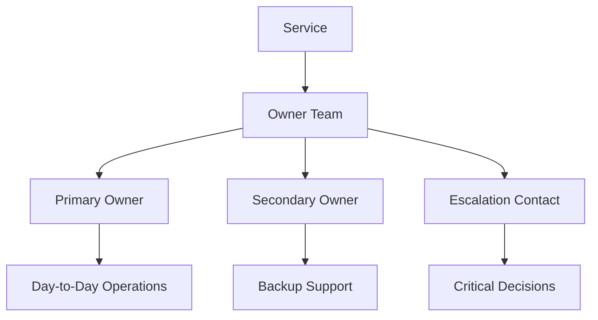
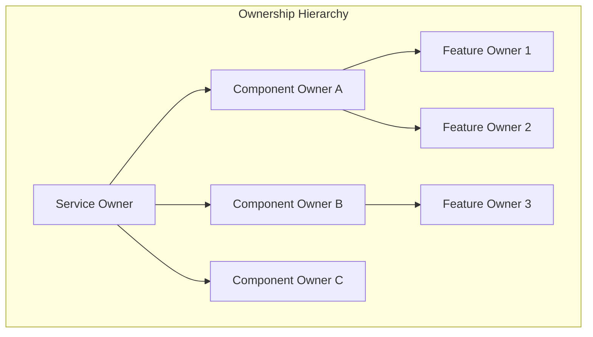
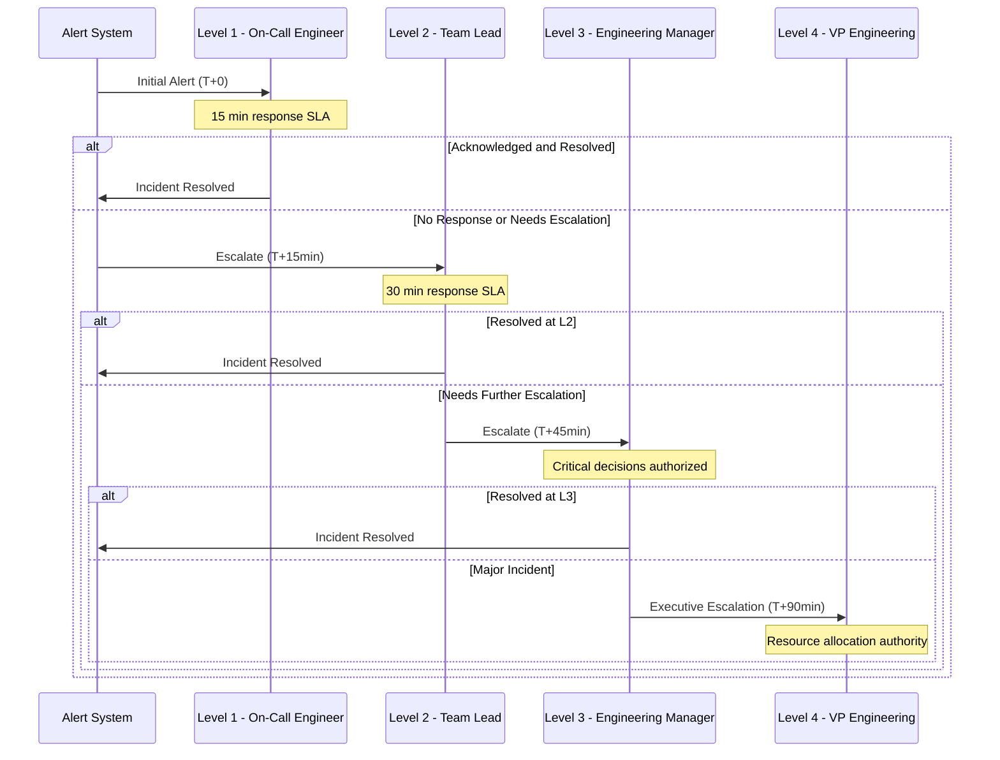
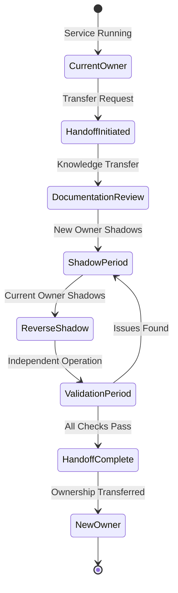
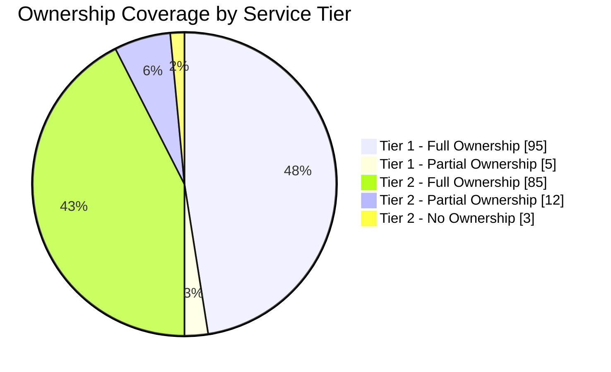
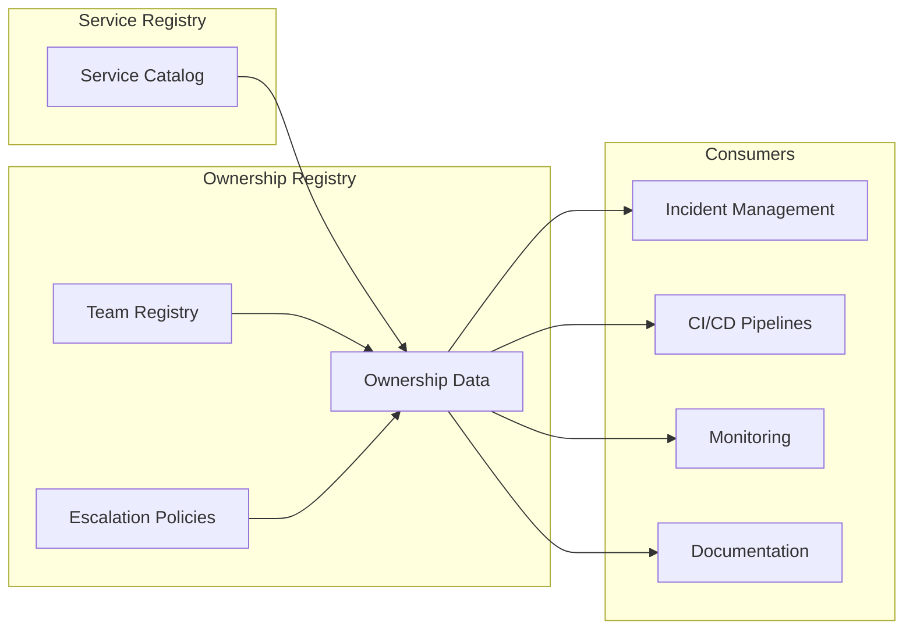
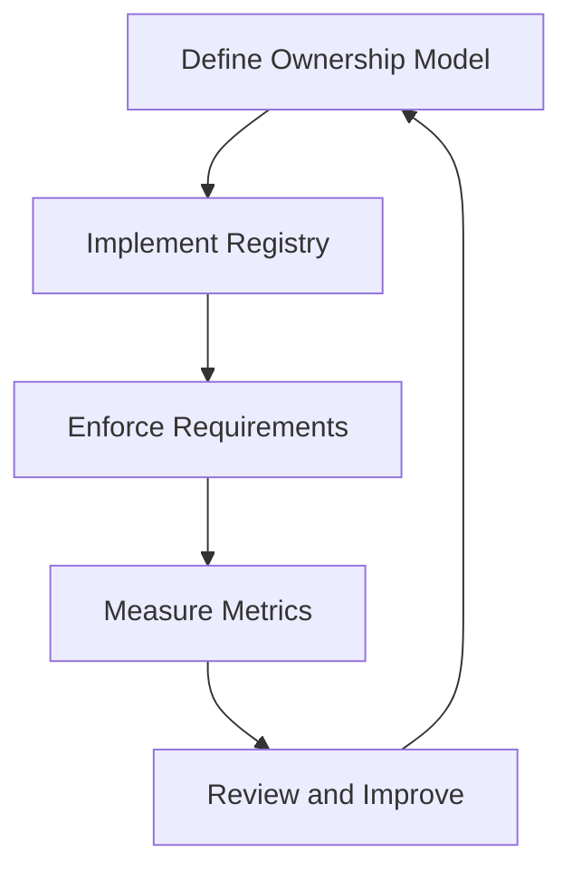

# How to Implement Ownership Model

Author: [nawazdhandala](https://github.com/nawazdhandala)

Tags: Platform Engineering, Ownership, DevOps, Service Management

Description: Learn to implement service ownership models with clear responsibilities, escalation paths, and accountability structures for operational excellence.

---

## Introduction

In modern platform engineering, the ownership model defines who is responsible for what - from code development to production incidents. A well-implemented ownership model reduces confusion during outages, accelerates incident resolution, and creates a culture of accountability. This guide walks you through implementing a comprehensive ownership model for your organization.

## What is Service Ownership?

Service ownership is the practice of assigning clear responsibility for services, components, or systems to specific teams or individuals. It answers the fundamental question: "Who do I contact when something goes wrong with this service?"



## Defining Ownership Levels

### Level 1: Service Ownership

The primary team responsible for a service's entire lifecycle - from design to decommissioning.

### Level 2: Component Ownership

Ownership of specific components within a service, useful for large services with multiple subsystems.

### Level 3: Feature Ownership

Temporary ownership assigned during feature development, typically transferred after launch.



## The Responsibility Matrix (RACI)

A RACI matrix clarifies roles for different activities. RACI stands for:

- **R**esponsible: Does the work
- **A**ccountable: Final decision maker
- **C**onsulted: Provides input
- **I**nformed: Kept in the loop

### Example RACI Matrix for Service Operations

| Activity | Service Owner | Platform Team | SRE Team | Security Team |
|----------|---------------|---------------|----------|---------------|
| Service Design | A, R | C | C | C |
| Deployment | R | A | I | I |
| Monitoring Setup | R | C | A | I |
| Incident Response | A, R | C | R | I |
| Security Patches | R | I | I | A |
| Capacity Planning | R | A | C | I |
| Documentation | A, R | I | I | I |

## Implementing Ownership in Code

### Service Metadata Configuration

Define ownership in your service configuration files. Here is an example using YAML.

```yaml
# service-metadata.yaml
apiVersion: platform.company.com/v1
kind: ServiceMetadata
metadata:
  name: payment-service
  namespace: financial-services
spec:
  ownership:
    team: payments-team
    slack_channel: "#payments-oncall"
    email: payments-team@company.com

    primary_owner:
      name: Jane Smith
      email: jane.smith@company.com
      github: janesmith

    secondary_owner:
      name: John Doe
      email: john.doe@company.com
      github: johndoe

    escalation:
      - level: 1
        contact: payments-team@company.com
        response_time: 15m
      - level: 2
        contact: payments-lead@company.com
        response_time: 30m
      - level: 3
        contact: engineering-director@company.com
        response_time: 1h

  criticality: tier-1

  dependencies:
    - name: database-service
      owner: data-team
    - name: auth-service
      owner: identity-team
```

This configuration file establishes several key ownership attributes. The `ownership` block identifies the responsible team along with communication channels. The `primary_owner` and `secondary_owner` fields ensure there is always someone accountable. The `escalation` section defines a tiered response structure with expected response times.

### Kubernetes Custom Resource for Ownership

Create a Custom Resource Definition to enforce ownership metadata in your cluster.

```yaml
# ownership-crd.yaml
apiVersion: apiextensions.k8s.io/v1
kind: CustomResourceDefinition
metadata:
  name: serviceownerships.platform.company.com
spec:
  group: platform.company.com
  versions:
    - name: v1
      served: true
      storage: true
      schema:
        openAPIV3Schema:
          type: object
          required:
            - spec
          properties:
            spec:
              type: object
              required:
                - team
                - primaryOwner
                - escalationPath
              properties:
                team:
                  type: string
                  description: "Team responsible for this service"
                primaryOwner:
                  type: object
                  required:
                    - name
                    - email
                  properties:
                    name:
                      type: string
                    email:
                      type: string
                      format: email
                    slackHandle:
                      type: string
                escalationPath:
                  type: array
                  minItems: 1
                  items:
                    type: object
                    required:
                      - level
                      - contact
                    properties:
                      level:
                        type: integer
                        minimum: 1
                      contact:
                        type: string
                      responseTimeSLA:
                        type: string
  scope: Namespaced
  names:
    plural: serviceownerships
    singular: serviceownership
    kind: ServiceOwnership
    shortNames:
      - so
```

This CRD makes ownership a first-class citizen in your Kubernetes cluster. The schema enforces required fields like team name, primary owner details, and at least one escalation contact. Using Kubernetes-native constructs means ownership data is version-controlled, auditable, and queryable via kubectl.

### Ownership Validation Webhook

Enforce ownership requirements with an admission webhook that prevents deployments without proper ownership metadata.

```python
# ownership_webhook.py
from flask import Flask, request, jsonify
import json

app = Flask(__name__)

REQUIRED_LABELS = [
    "ownership.platform.company.com/team",
    "ownership.platform.company.com/primary-owner",
    "ownership.platform.company.com/slack-channel"
]

@app.route('/validate', methods=['POST'])
def validate_ownership():
    """
    Validates that all deployments have required ownership labels.
    Returns admission response allowing or denying the deployment.
    """
    admission_review = request.get_json()

    # Extract the object being created or updated
    obj = admission_review['request']['object']
    labels = obj.get('metadata', {}).get('labels', {})

    missing_labels = []
    for required_label in REQUIRED_LABELS:
        if required_label not in labels:
            missing_labels.append(required_label)

    if missing_labels:
        # Deny the request - missing ownership information
        return jsonify({
            "apiVersion": "admission.k8s.io/v1",
            "kind": "AdmissionReview",
            "response": {
                "uid": admission_review['request']['uid'],
                "allowed": False,
                "status": {
                    "code": 403,
                    "message": f"Missing required ownership labels: {', '.join(missing_labels)}. "
                               f"All deployments must specify team ownership."
                }
            }
        })

    # Validate team exists in registry
    team = labels.get("ownership.platform.company.com/team")
    if not validate_team_exists(team):
        return jsonify({
            "apiVersion": "admission.k8s.io/v1",
            "kind": "AdmissionReview",
            "response": {
                "uid": admission_review['request']['uid'],
                "allowed": False,
                "status": {
                    "code": 403,
                    "message": f"Team '{team}' not found in ownership registry. "
                               f"Please register your team first."
                }
            }
        })

    # All validations passed
    return jsonify({
        "apiVersion": "admission.k8s.io/v1",
        "kind": "AdmissionReview",
        "response": {
            "uid": admission_review['request']['uid'],
            "allowed": True
        }
    })


def validate_team_exists(team_name):
    """
    Checks if the team is registered in the ownership registry.
    In production, this would query a database or API.
    """
    # Placeholder - integrate with your team registry
    registered_teams = get_registered_teams()
    return team_name in registered_teams


def get_registered_teams():
    """Returns list of registered teams from the ownership registry."""
    # In production, fetch from database or configuration service
    return ["payments-team", "identity-team", "data-team", "platform-team"]


if __name__ == '__main__':
    app.run(host='0.0.0.0', port=8443, ssl_context='adhoc')
```

This webhook intercepts all deployment requests and validates ownership labels before allowing the resource to be created. The `REQUIRED_LABELS` list defines mandatory ownership metadata. The `validate_team_exists` function ensures teams are registered in your ownership registry, preventing typos and orphaned services.

## Escalation Paths

Effective escalation ensures incidents reach the right people at the right time.



### Escalation Configuration Example

```yaml
# escalation-policy.yaml
apiVersion: platform.company.com/v1
kind: EscalationPolicy
metadata:
  name: tier-1-services
spec:
  description: "Escalation policy for critical tier-1 services"

  levels:
    - level: 1
      name: "Primary On-Call"
      targets:
        - type: schedule
          id: primary-oncall-schedule
      escalate_after: 15m
      repeat: 2

    - level: 2
      name: "Secondary On-Call"
      targets:
        - type: schedule
          id: secondary-oncall-schedule
        - type: slack_channel
          id: "#incident-response"
      escalate_after: 30m
      repeat: 1

    - level: 3
      name: "Engineering Leadership"
      targets:
        - type: user
          id: engineering-manager
        - type: user
          id: tech-lead
      escalate_after: 45m
      notify_stakeholders: true

    - level: 4
      name: "Executive Response"
      targets:
        - type: user
          id: vp-engineering
        - type: user
          id: cto
      conditions:
        - severity: critical
        - customer_impact: true

  notifications:
    on_escalation:
      - slack: "#engineering-alerts"
      - email: incident-updates@company.com
    on_resolution:
      - slack: "#engineering-alerts"
      - stakeholder_list: true
```

This escalation policy defines four levels with increasing authority and urgency. Each level specifies targets (individuals, schedules, or channels), time before escalation, and retry behavior. Level 4 includes conditions that must be met before engaging executives, preventing unnecessary escalations for non-critical issues.

## Handling Ownership Handoffs

Handoffs occur when ownership transfers between teams or individuals - during rotations, team changes, or service transfers.



### Handoff Checklist Implementation

```python
# handoff_manager.py
from dataclasses import dataclass
from datetime import datetime, timedelta
from enum import Enum
from typing import List, Optional
import json


class HandoffStatus(Enum):
    """Represents the current state of an ownership handoff."""
    INITIATED = "initiated"
    DOCUMENTATION_REVIEW = "documentation_review"
    SHADOW_PERIOD = "shadow_period"
    REVERSE_SHADOW = "reverse_shadow"
    VALIDATION = "validation"
    COMPLETED = "completed"
    ROLLED_BACK = "rolled_back"


@dataclass
class HandoffChecklist:
    """
    Tracks completion of handoff requirements.
    Each item must be completed before the handoff can proceed.
    """
    documentation_updated: bool = False
    runbooks_reviewed: bool = False
    architecture_walkthrough: bool = False
    oncall_training_complete: bool = False
    access_provisioned: bool = False
    monitoring_dashboards_reviewed: bool = False
    incident_history_reviewed: bool = False
    dependencies_documented: bool = False
    stakeholders_notified: bool = False

    def is_complete(self) -> bool:
        """Returns True if all checklist items are complete."""
        return all([
            self.documentation_updated,
            self.runbooks_reviewed,
            self.architecture_walkthrough,
            self.oncall_training_complete,
            self.access_provisioned,
            self.monitoring_dashboards_reviewed,
            self.incident_history_reviewed,
            self.dependencies_documented,
            self.stakeholders_notified
        ])

    def get_incomplete_items(self) -> List[str]:
        """Returns list of items that still need to be completed."""
        incomplete = []
        for field, value in self.__dict__.items():
            if not value:
                incomplete.append(field.replace('_', ' ').title())
        return incomplete


@dataclass
class OwnershipHandoff:
    """
    Manages the complete ownership transfer process.
    Ensures all requirements are met before finalizing the transfer.
    """
    service_name: str
    from_team: str
    to_team: str
    initiated_at: datetime
    status: HandoffStatus
    checklist: HandoffChecklist
    shadow_start: Optional[datetime] = None
    shadow_end: Optional[datetime] = None
    completed_at: Optional[datetime] = None

    def start_shadow_period(self, duration_days: int = 14):
        """
        Begins the shadow period where new owner observes operations.
        Default duration is 14 days for adequate exposure to operations.
        """
        if not self.checklist.documentation_updated:
            raise ValueError("Documentation must be updated before shadow period")

        self.shadow_start = datetime.now()
        self.shadow_end = self.shadow_start + timedelta(days=duration_days)
        self.status = HandoffStatus.SHADOW_PERIOD

        print(f"Shadow period started for {self.service_name}")
        print(f"New owner ({self.to_team}) will shadow until {self.shadow_end}")

    def complete_handoff(self) -> bool:
        """
        Finalizes the ownership transfer if all requirements are met.
        Returns True if successful, False otherwise.
        """
        if not self.checklist.is_complete():
            incomplete = self.checklist.get_incomplete_items()
            print(f"Cannot complete handoff. Incomplete items: {incomplete}")
            return False

        if datetime.now() < self.shadow_end:
            remaining = self.shadow_end - datetime.now()
            print(f"Shadow period not complete. {remaining.days} days remaining.")
            return False

        self.status = HandoffStatus.COMPLETED
        self.completed_at = datetime.now()

        # Trigger ownership registry update
        self._update_ownership_registry()

        # Notify stakeholders
        self._send_completion_notifications()

        print(f"Handoff complete. {self.to_team} now owns {self.service_name}")
        return True

    def _update_ownership_registry(self):
        """Updates the central ownership registry with new owner."""
        registry_update = {
            "service": self.service_name,
            "previous_owner": self.from_team,
            "new_owner": self.to_team,
            "effective_date": self.completed_at.isoformat(),
            "handoff_duration_days": (self.completed_at - self.initiated_at).days
        }
        # In production, this would call your registry API
        print(f"Registry updated: {json.dumps(registry_update, indent=2)}")

    def _send_completion_notifications(self):
        """Notifies all stakeholders about the completed handoff."""
        notifications = [
            f"Slack: #{self.service_name}-owners",
            f"Email: {self.from_team}@company.com",
            f"Email: {self.to_team}@company.com",
            "Email: platform-team@company.com"
        ]
        for notification in notifications:
            print(f"Notification sent: {notification}")


# Example usage
def initiate_service_handoff(service: str, from_team: str, to_team: str):
    """Creates and returns a new handoff process for a service."""
    handoff = OwnershipHandoff(
        service_name=service,
        from_team=from_team,
        to_team=to_team,
        initiated_at=datetime.now(),
        status=HandoffStatus.INITIATED,
        checklist=HandoffChecklist()
    )

    print(f"Handoff initiated for {service}")
    print(f"From: {from_team} -> To: {to_team}")
    print(f"Checklist items to complete: {handoff.checklist.get_incomplete_items()}")

    return handoff
```

This handoff management system enforces a structured transfer process. The `HandoffChecklist` ensures nothing is overlooked during knowledge transfer. The `OwnershipHandoff` class manages the entire lifecycle, requiring documentation updates before shadow periods and checklist completion before finalizing the transfer. This prevents premature handoffs that could leave new owners unprepared.

## Ownership Metrics and Tracking

Measure ownership health with these key metrics.



### Key Metrics to Track

| Metric | Description | Target |
|--------|-------------|--------|
| Ownership Coverage | Percentage of services with defined owners | > 99% |
| MTTR by Owner | Mean time to resolve incidents per team | < 30 min |
| Escalation Rate | Percentage of incidents requiring escalation | < 20% |
| Handoff Success Rate | Successful ownership transfers vs rollbacks | > 95% |
| Documentation Freshness | Days since last documentation update | < 90 days |
| On-Call Response Rate | Percentage of alerts acknowledged within SLA | > 95% |

### Metrics Collection Implementation

```python
# ownership_metrics.py
from dataclasses import dataclass
from datetime import datetime, timedelta
from typing import Dict, List
import statistics


@dataclass
class IncidentRecord:
    """Represents a single incident for metrics calculation."""
    incident_id: str
    service: str
    owner_team: str
    created_at: datetime
    acknowledged_at: datetime
    resolved_at: datetime
    escalated: bool
    escalation_levels: int


class OwnershipMetricsCollector:
    """
    Collects and calculates ownership health metrics.
    Provides insights into team performance and ownership gaps.
    """

    def __init__(self, metrics_backend):
        self.backend = metrics_backend

    def calculate_mttr_by_team(
        self,
        incidents: List[IncidentRecord]
    ) -> Dict[str, float]:
        """
        Calculates Mean Time to Resolve for each team.
        Returns dictionary mapping team names to MTTR in minutes.
        """
        team_resolution_times = {}

        for incident in incidents:
            team = incident.owner_team
            resolution_time = (
                incident.resolved_at - incident.created_at
            ).total_seconds() / 60  # Convert to minutes

            if team not in team_resolution_times:
                team_resolution_times[team] = []
            team_resolution_times[team].append(resolution_time)

        # Calculate mean for each team
        mttr_by_team = {}
        for team, times in team_resolution_times.items():
            mttr_by_team[team] = round(statistics.mean(times), 2)

        return mttr_by_team

    def calculate_escalation_rate(
        self,
        incidents: List[IncidentRecord]
    ) -> Dict[str, float]:
        """
        Calculates percentage of incidents that required escalation.
        Lower rates indicate better first-response effectiveness.
        """
        team_incidents = {}
        team_escalations = {}

        for incident in incidents:
            team = incident.owner_team
            team_incidents[team] = team_incidents.get(team, 0) + 1
            if incident.escalated:
                team_escalations[team] = team_escalations.get(team, 0) + 1

        escalation_rates = {}
        for team in team_incidents:
            total = team_incidents[team]
            escalated = team_escalations.get(team, 0)
            escalation_rates[team] = round((escalated / total) * 100, 2)

        return escalation_rates

    def calculate_response_time_compliance(
        self,
        incidents: List[IncidentRecord],
        sla_minutes: int = 15
    ) -> Dict[str, float]:
        """
        Calculates percentage of incidents acknowledged within SLA.
        SLA default is 15 minutes for initial acknowledgment.
        """
        team_total = {}
        team_compliant = {}

        for incident in incidents:
            team = incident.owner_team
            response_time = (
                incident.acknowledged_at - incident.created_at
            ).total_seconds() / 60

            team_total[team] = team_total.get(team, 0) + 1
            if response_time <= sla_minutes:
                team_compliant[team] = team_compliant.get(team, 0) + 1

        compliance_rates = {}
        for team in team_total:
            total = team_total[team]
            compliant = team_compliant.get(team, 0)
            compliance_rates[team] = round((compliant / total) * 100, 2)

        return compliance_rates

    def get_ownership_coverage(self) -> Dict[str, any]:
        """
        Returns ownership coverage statistics across all services.
        Identifies services without defined owners.
        """
        # In production, query your service registry
        all_services = self.backend.get_all_services()
        services_with_owners = self.backend.get_services_with_owners()

        total = len(all_services)
        with_owners = len(services_with_owners)
        without_owners = total - with_owners

        orphaned_services = [
            s for s in all_services
            if s not in services_with_owners
        ]

        return {
            "total_services": total,
            "services_with_owners": with_owners,
            "services_without_owners": without_owners,
            "coverage_percentage": round((with_owners / total) * 100, 2),
            "orphaned_services": orphaned_services
        }

    def generate_ownership_report(
        self,
        incidents: List[IncidentRecord],
        report_period_days: int = 30
    ) -> Dict:
        """
        Generates a comprehensive ownership health report.
        Combines all metrics into a single actionable report.
        """
        report = {
            "report_period": f"Last {report_period_days} days",
            "generated_at": datetime.now().isoformat(),
            "metrics": {
                "mttr_by_team": self.calculate_mttr_by_team(incidents),
                "escalation_rates": self.calculate_escalation_rate(incidents),
                "response_compliance": self.calculate_response_time_compliance(incidents),
                "ownership_coverage": self.get_ownership_coverage()
            },
            "recommendations": self._generate_recommendations(incidents)
        }

        return report

    def _generate_recommendations(
        self,
        incidents: List[IncidentRecord]
    ) -> List[str]:
        """Generates actionable recommendations based on metrics."""
        recommendations = []

        escalation_rates = self.calculate_escalation_rate(incidents)
        for team, rate in escalation_rates.items():
            if rate > 30:
                recommendations.append(
                    f"{team}: High escalation rate ({rate}%). "
                    f"Consider additional training or runbook improvements."
                )

        mttr = self.calculate_mttr_by_team(incidents)
        for team, time in mttr.items():
            if time > 60:
                recommendations.append(
                    f"{team}: MTTR exceeds 60 minutes ({time} min). "
                    f"Review incident response procedures."
                )

        coverage = self.get_ownership_coverage()
        if coverage["coverage_percentage"] < 99:
            recommendations.append(
                f"Ownership coverage at {coverage['coverage_percentage']}%. "
                f"Assign owners to: {', '.join(coverage['orphaned_services'][:5])}"
            )

        return recommendations
```

This metrics collector provides quantitative insights into ownership effectiveness. The `calculate_mttr_by_team` method identifies teams struggling with incident resolution. The `calculate_escalation_rate` method reveals when first responders need additional training or better runbooks. The `generate_ownership_report` method combines all metrics with actionable recommendations, making it easy to identify and address ownership gaps.

## Building an Ownership Registry

Centralize ownership data in a queryable registry.



### Registry API Implementation

```python
# ownership_registry.py
from flask import Flask, request, jsonify
from datetime import datetime
from typing import Optional


app = Flask(__name__)

# In production, use a proper database
ownership_store = {}
team_store = {}


@app.route('/api/v1/services/<service_name>/ownership', methods=['GET'])
def get_service_ownership(service_name: str):
    """
    Retrieves ownership information for a specific service.
    Returns 404 if service is not found in registry.
    """
    if service_name not in ownership_store:
        return jsonify({
            "error": "Service not found",
            "message": f"No ownership record for service: {service_name}"
        }), 404

    ownership = ownership_store[service_name]

    # Enrich with team details
    team_name = ownership.get('team')
    team_details = team_store.get(team_name, {})

    return jsonify({
        "service": service_name,
        "ownership": ownership,
        "team_details": team_details,
        "escalation_path": get_escalation_path(team_name)
    })


@app.route('/api/v1/services/<service_name>/ownership', methods=['PUT'])
def update_service_ownership(service_name: str):
    """
    Updates or creates ownership record for a service.
    Validates required fields before storing.
    """
    data = request.get_json()

    # Validate required fields
    required_fields = ['team', 'primary_owner', 'slack_channel']
    missing = [f for f in required_fields if f not in data]

    if missing:
        return jsonify({
            "error": "Validation failed",
            "missing_fields": missing
        }), 400

    # Validate team exists
    if data['team'] not in team_store:
        return jsonify({
            "error": "Invalid team",
            "message": f"Team '{data['team']}' not registered"
        }), 400

    # Store with metadata
    ownership_store[service_name] = {
        **data,
        "updated_at": datetime.now().isoformat(),
        "updated_by": request.headers.get('X-User-Email', 'unknown')
    }

    return jsonify({
        "message": "Ownership updated successfully",
        "service": service_name,
        "ownership": ownership_store[service_name]
    })


@app.route('/api/v1/teams', methods=['GET'])
def list_teams():
    """Returns all registered teams with their owned services."""
    teams_with_services = {}

    for team_name, team_info in team_store.items():
        owned_services = [
            svc for svc, ownership in ownership_store.items()
            if ownership.get('team') == team_name
        ]
        teams_with_services[team_name] = {
            **team_info,
            "owned_services": owned_services,
            "service_count": len(owned_services)
        }

    return jsonify(teams_with_services)


@app.route('/api/v1/teams/<team_name>', methods=['PUT'])
def register_team(team_name: str):
    """
    Registers a new team or updates existing team information.
    Teams must be registered before they can own services.
    """
    data = request.get_json()

    required_fields = ['slack_channel', 'email', 'manager']
    missing = [f for f in required_fields if f not in data]

    if missing:
        return jsonify({
            "error": "Validation failed",
            "missing_fields": missing
        }), 400

    team_store[team_name] = {
        **data,
        "registered_at": datetime.now().isoformat(),
        "name": team_name
    }

    return jsonify({
        "message": "Team registered successfully",
        "team": team_store[team_name]
    })


@app.route('/api/v1/orphaned-services', methods=['GET'])
def get_orphaned_services():
    """
    Returns services without ownership assignment.
    Useful for auditing and ensuring complete coverage.
    """
    # In production, compare against service discovery
    all_services = get_all_discovered_services()
    owned_services = set(ownership_store.keys())

    orphaned = [s for s in all_services if s not in owned_services]

    return jsonify({
        "total_services": len(all_services),
        "owned_services": len(owned_services),
        "orphaned_count": len(orphaned),
        "orphaned_services": orphaned
    })


@app.route('/api/v1/oncall/<service_name>', methods=['GET'])
def get_current_oncall(service_name: str):
    """
    Returns the current on-call contact for a service.
    Integrates with on-call scheduling system.
    """
    if service_name not in ownership_store:
        return jsonify({"error": "Service not found"}), 404

    ownership = ownership_store[service_name]
    team = ownership.get('team')

    # In production, query your on-call scheduling system
    oncall = get_oncall_from_schedule(team)

    return jsonify({
        "service": service_name,
        "team": team,
        "current_oncall": oncall,
        "escalation_path": get_escalation_path(team)
    })


def get_escalation_path(team_name: str) -> list:
    """Retrieves the escalation path for a team."""
    team = team_store.get(team_name, {})
    return team.get('escalation_path', [
        {"level": 1, "contact": team.get('slack_channel', 'unknown')},
        {"level": 2, "contact": team.get('manager', 'unknown')}
    ])


def get_all_discovered_services() -> list:
    """Returns all services from service discovery."""
    # In production, query Kubernetes, Consul, or your service mesh
    return ["service-a", "service-b", "service-c", "payment-service"]


def get_oncall_from_schedule(team_name: str) -> dict:
    """Queries the on-call scheduling system for current on-call."""
    # In production, integrate with PagerDuty, OpsGenie, etc.
    return {
        "name": "Current On-Call Engineer",
        "email": f"oncall@{team_name}.company.com",
        "phone": "+1-555-0123",
        "shift_ends": "2024-01-15T18:00:00Z"
    }


if __name__ == '__main__':
    app.run(host='0.0.0.0', port=8080)
```

This registry API serves as the single source of truth for ownership data. The `/api/v1/services/<service_name>/ownership` endpoint provides complete ownership information including team details and escalation paths. The `/api/v1/orphaned-services` endpoint helps identify coverage gaps. The `/api/v1/oncall/<service_name>` endpoint integrates with on-call scheduling to provide real-time contact information during incidents.

## Best Practices for Ownership Models

### 1. Start with Clear Definitions

Define what ownership means in your organization before implementing tooling.

### 2. Make Ownership Visible

Display ownership information in dashboards, documentation, and tooling.

### 3. Enforce Ownership Requirements

Use admission webhooks and CI/CD gates to prevent unowned services.

### 4. Regular Ownership Reviews

Schedule quarterly reviews to ensure ownership data remains accurate.

### 5. Measure and Improve

Track ownership metrics and use them to drive improvements.



## Conclusion

Implementing a robust ownership model transforms how your organization handles incidents, deployments, and service management. By defining clear ownership, establishing escalation paths, managing handoffs effectively, and tracking metrics, you create a foundation for operational excellence.

Key takeaways:

1. **Define ownership at multiple levels** - service, component, and feature
2. **Use RACI matrices** to clarify responsibilities across teams
3. **Implement ownership in code** using metadata, CRDs, and validation webhooks
4. **Establish clear escalation paths** with defined SLAs at each level
5. **Manage handoffs carefully** with checklists and shadow periods
6. **Track metrics** to identify and address ownership gaps
7. **Build a central registry** as the source of truth for ownership data

Start small - pick a critical service, define its ownership model, and iterate from there. Over time, expand coverage until every service in your organization has clear, accountable ownership.

## Further Reading

- Google SRE Book: Service Ownership Principles
- Team Topologies by Matthew Skelton and Manuel Pais
- The DevOps Handbook by Gene Kim
- Platform Engineering: A Guide for Technical, Product, and People Leaders
