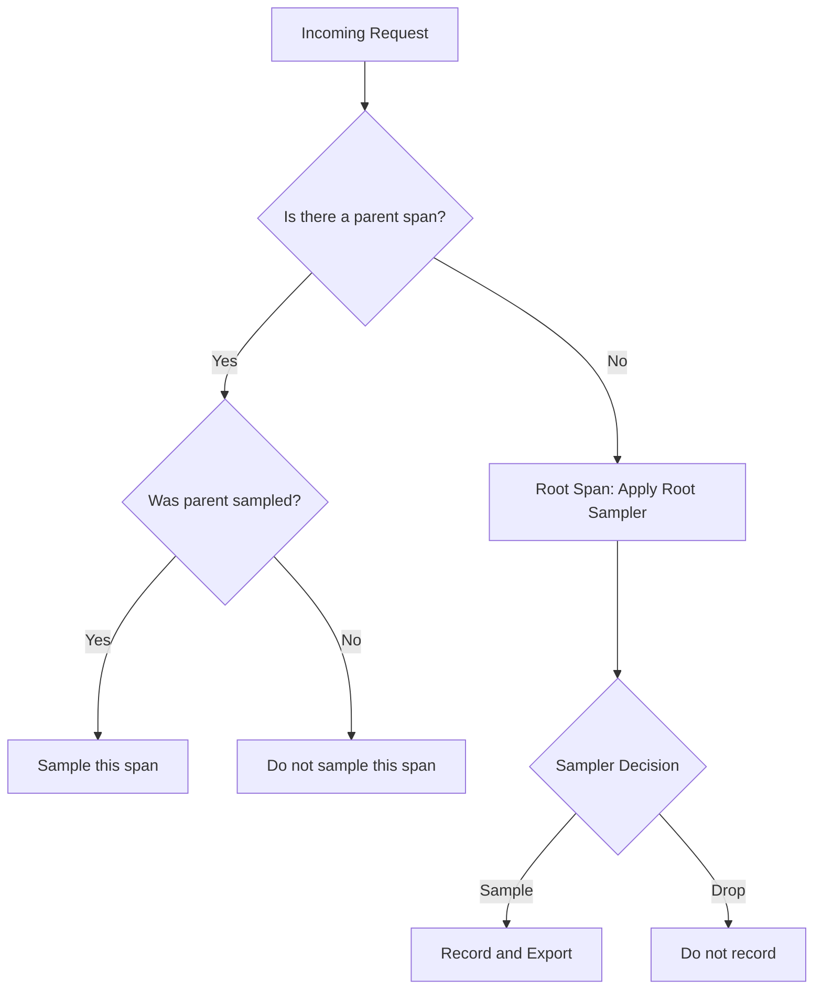
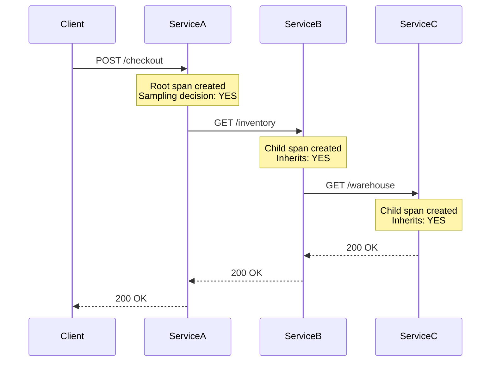
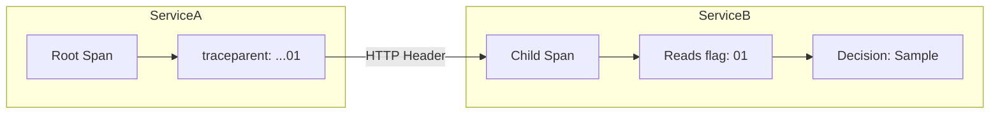
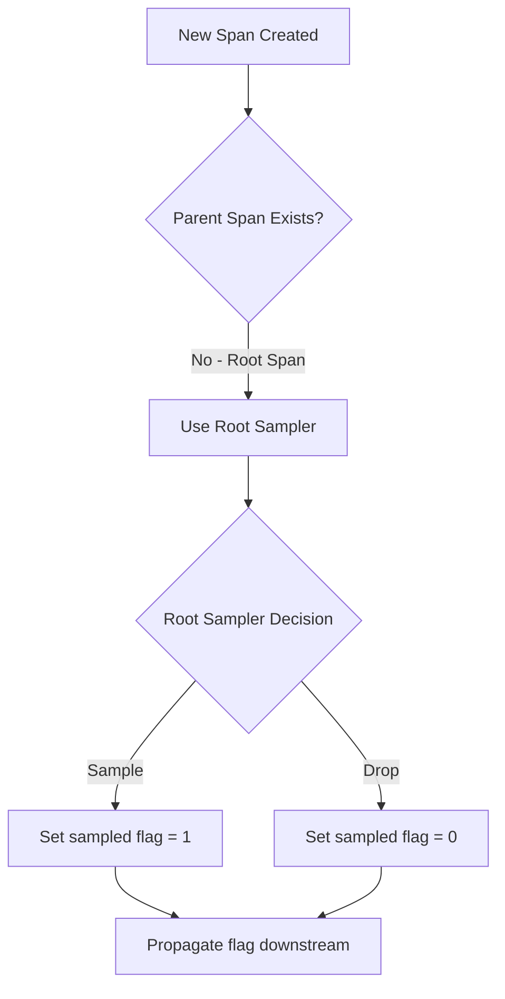
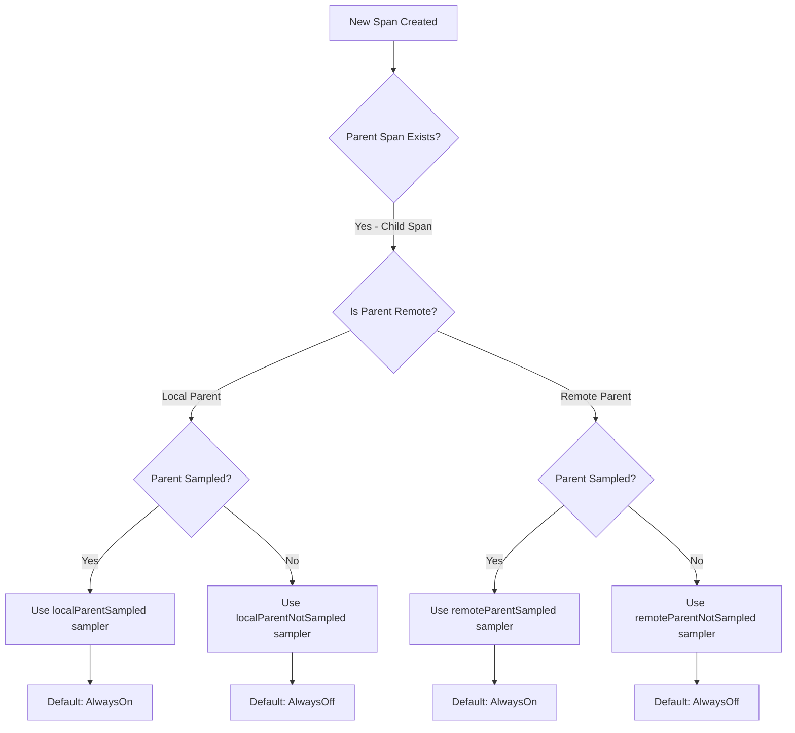
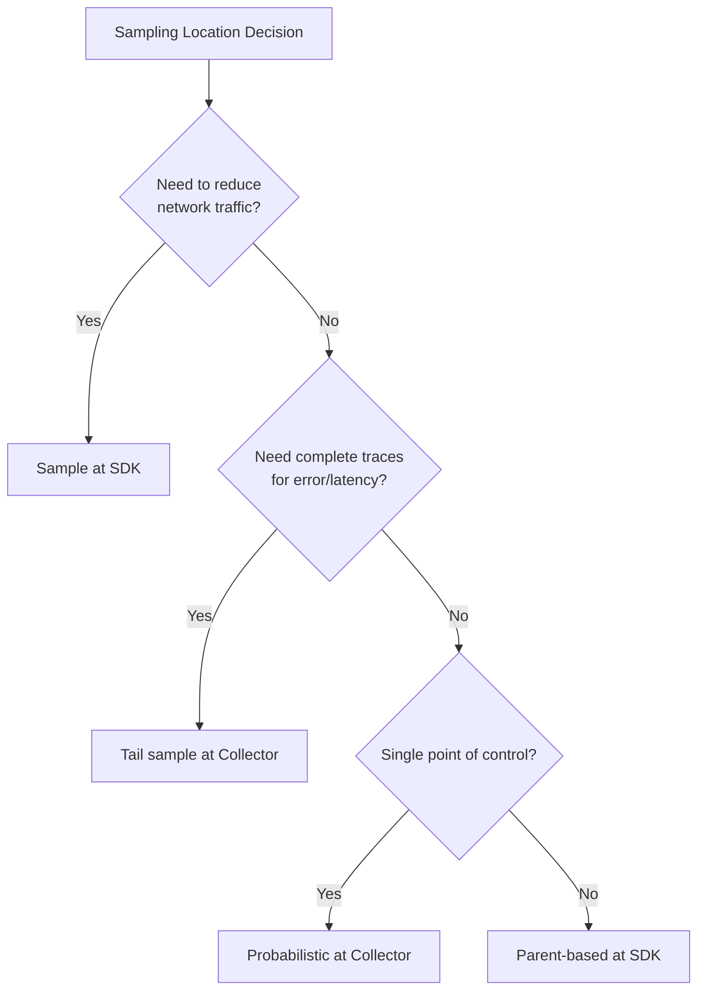
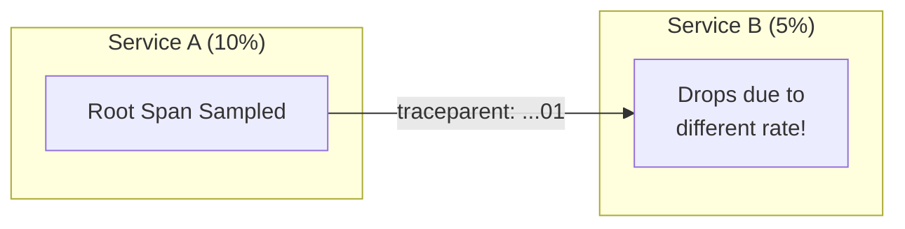
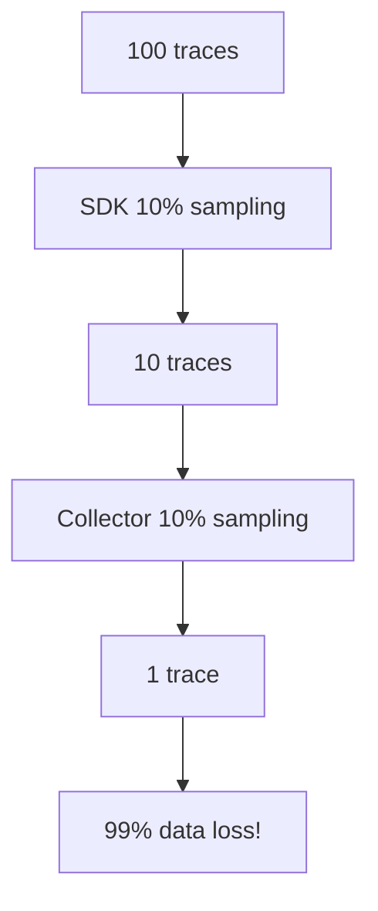
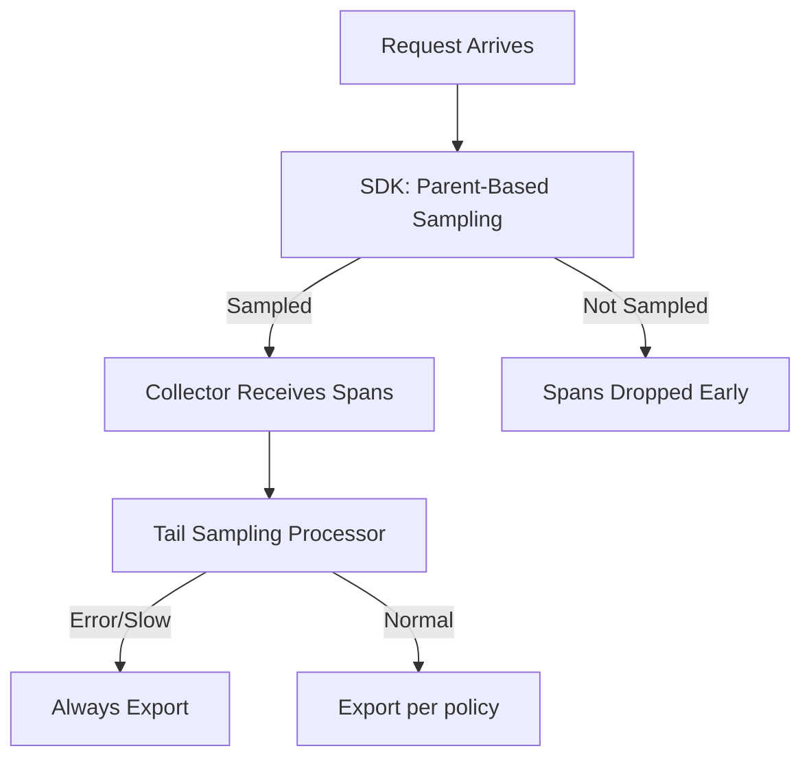

# How to Create Parent-Based Sampling

Author: [nawazdhandala](https://github.com/nawazdhandala)

Tags: Observability, Tracing, OpenTelemetry, Sampling

Description: Learn how to implement parent-based sampling to respect upstream sampling decisions across services.

---

> In distributed systems, sampling decisions must flow **consistently** across service boundaries. Parent-based sampling ensures that once a trace is sampled (or dropped), every downstream service honors that decision.

When you build microservices, each service independently processes requests. Without coordination, one service might sample a trace while another drops it, resulting in fragmented, incomplete traces that are useless for debugging.

Parent-based sampling solves this by making child spans inherit the sampling decision from their parent. If the parent was sampled, the child is sampled. If the parent was not sampled, the child is not sampled. This keeps your traces whole.

---

## Table of Contents

1. What is Parent-Based Sampling?
2. Why Parent-Based Sampling Matters
3. How Sampling Decisions Propagate
4. Root Span vs Child Span Sampling Logic
5. Implementing Parent-Based Sampling in Node.js
6. Implementing Parent-Based Sampling in Python
7. Implementing Parent-Based Sampling in Go
8. OpenTelemetry Collector Configuration
9. Custom Sampling Logic
10. Testing Your Sampling Configuration
11. Common Pitfalls and Solutions
12. Best Practices

---

## 1. What is Parent-Based Sampling?

Parent-based sampling is a sampling strategy where the sampling decision for a span depends on whether its parent span was sampled.



The key insight: sampling decisions are made **once** at the trace root and then **propagated** to all descendants.

---

## 2. Why Parent-Based Sampling Matters

Consider a request flowing through three services:



Without parent-based sampling:
- ServiceA samples at 10%
- ServiceB samples at 10%
- ServiceC samples at 10%
- Probability of complete trace: 0.1%

With parent-based sampling:
- ServiceA decides to sample (10% chance)
- ServiceB inherits the decision (100% if parent sampled)
- ServiceC inherits the decision (100% if parent sampled)
- Probability of complete trace (when sampled): 100%

This is the difference between useful traces and fragmented noise.

---

## 3. How Sampling Decisions Propagate

Sampling decisions propagate via trace context headers. The W3C Trace Context standard uses two headers:

| Header | Purpose | Example |
|--------|---------|---------|
| `traceparent` | Carries trace ID, span ID, and sampling flag | `00-4bf92f3577b34da6a3ce929d0e0e4736-00f067aa0ba902b7-01` |
| `tracestate` | Vendor-specific trace data | `congo=t61rcWkgMzE` |

The last two characters of `traceparent` encode the trace flags:
- `01` = sampled (record and export)
- `00` = not sampled (do not record)



When ServiceB receives the request, it extracts the trace context, sees the sampled flag is `01`, and continues sampling.

---

## 4. Root Span vs Child Span Sampling Logic

The sampling decision tree differs based on whether a span is a root or child.

### Root Span Logic

A root span has no parent. The `ParentBasedSampler` delegates to a configurable "root sampler":



Common root samplers:
- `TraceIdRatioBasedSampler(0.1)`: Sample 10% of traces
- `AlwaysOnSampler`: Sample everything
- `AlwaysOffSampler`: Sample nothing

### Child Span Logic

A child span has a parent. The `ParentBasedSampler` checks the parent's sampling state:



The defaults ensure that:
- Sampled parents produce sampled children
- Not-sampled parents produce not-sampled children

---

## 5. Implementing Parent-Based Sampling in Node.js

### Basic Setup

```typescript
// telemetry.ts
import { NodeSDK } from '@opentelemetry/sdk-node';
import { getNodeAutoInstrumentations } from '@opentelemetry/auto-instrumentations-node';
import { OTLPTraceExporter } from '@opentelemetry/exporter-trace-otlp-http';
import { Resource } from '@opentelemetry/resources';
import { ATTR_SERVICE_NAME, ATTR_SERVICE_VERSION } from '@opentelemetry/semantic-conventions';
import {
  ParentBasedSampler,
  TraceIdRatioBasedSampler,
  AlwaysOnSampler,
  AlwaysOffSampler,
} from '@opentelemetry/sdk-trace-base';

// Create a parent-based sampler with 10% root sampling
// Child spans will inherit the parent's sampling decision
const sampler = new ParentBasedSampler({
  // Used when there is no parent (root span)
  root: new TraceIdRatioBasedSampler(0.1),

  // Used when parent is local and was sampled (default: AlwaysOnSampler)
  localParentSampled: new AlwaysOnSampler(),

  // Used when parent is local and was NOT sampled (default: AlwaysOffSampler)
  localParentNotSampled: new AlwaysOffSampler(),

  // Used when parent is remote and was sampled (default: AlwaysOnSampler)
  remoteParentSampled: new AlwaysOnSampler(),

  // Used when parent is remote and was NOT sampled (default: AlwaysOffSampler)
  remoteParentNotSampled: new AlwaysOffSampler(),
});

const traceExporter = new OTLPTraceExporter({
  url: process.env.OTEL_EXPORTER_OTLP_ENDPOINT || 'https://oneuptime.com/otlp/v1/traces',
  headers: {
    'x-oneuptime-token': process.env.ONEUPTIME_TOKEN || '',
  },
});

export const sdk = new NodeSDK({
  resource: new Resource({
    [ATTR_SERVICE_NAME]: 'order-service',
    [ATTR_SERVICE_VERSION]: '1.0.0',
  }),
  traceExporter,
  sampler, // Apply our parent-based sampler
  instrumentations: [getNodeAutoInstrumentations()],
});

// Start the SDK before your application code
sdk.start();

// Graceful shutdown
process.on('SIGTERM', () => {
  sdk.shutdown()
    .then(() => console.log('Telemetry shut down'))
    .catch((err) => console.error('Error shutting down telemetry', err))
    .finally(() => process.exit(0));
});
```

### Understanding the Sampler Options

```typescript
// ParentBasedSampler configuration explained
const sampler = new ParentBasedSampler({
  // ROOT SAMPLER
  // Called when this service starts a new trace (no incoming trace context)
  // This is where you control your overall sampling rate
  root: new TraceIdRatioBasedSampler(0.1), // 10% of new traces

  // LOCAL PARENT SAMPLED
  // Called when creating a child span within the same process
  // and the parent span was sampled
  // Default behavior: continue sampling (AlwaysOnSampler)
  localParentSampled: new AlwaysOnSampler(),

  // LOCAL PARENT NOT SAMPLED
  // Called when creating a child span within the same process
  // and the parent span was NOT sampled
  // Default behavior: do not sample (AlwaysOffSampler)
  localParentNotSampled: new AlwaysOffSampler(),

  // REMOTE PARENT SAMPLED
  // Called when receiving a request from another service
  // and the incoming trace context indicates sampling
  // Default behavior: honor the upstream decision (AlwaysOnSampler)
  remoteParentSampled: new AlwaysOnSampler(),

  // REMOTE PARENT NOT SAMPLED
  // Called when receiving a request from another service
  // and the incoming trace context indicates NO sampling
  // Default behavior: honor the upstream decision (AlwaysOffSampler)
  remoteParentNotSampled: new AlwaysOffSampler(),
});
```

### Express Service Example

```typescript
// server.ts
import './telemetry'; // Initialize telemetry first
import express from 'express';
import { trace, context, SpanStatusCode } from '@opentelemetry/api';

const app = express();
const tracer = trace.getTracer('order-service');

app.use(express.json());

// Middleware to log sampling decisions (for debugging)
app.use((req, res, next) => {
  const activeSpan = trace.getSpan(context.active());
  if (activeSpan) {
    const spanContext = activeSpan.spanContext();
    const isSampled = (spanContext.traceFlags & 1) === 1;
    console.log(`Request ${req.method} ${req.path} - Trace ID: ${spanContext.traceId}, Sampled: ${isSampled}`);
  }
  next();
});

app.post('/orders', async (req, res) => {
  // This span inherits the sampling decision from the HTTP server span
  // which inherits from the incoming trace context (if any)
  const span = tracer.startSpan('process-order');

  try {
    span.setAttribute('order.items', req.body.items?.length || 0);

    // Simulate processing
    await processOrder(req.body);

    span.setStatus({ code: SpanStatusCode.OK });
    res.json({ status: 'created' });
  } catch (error: any) {
    span.recordException(error);
    span.setStatus({ code: SpanStatusCode.ERROR, message: error.message });
    res.status(500).json({ error: error.message });
  } finally {
    span.end();
  }
});

async function processOrder(orderData: any) {
  // This span also inherits the sampling decision
  return tracer.startActiveSpan('validate-order', async (span) => {
    try {
      // Validation logic here
      await new Promise(resolve => setTimeout(resolve, 50));
      span.setAttribute('validation.passed', true);
    } finally {
      span.end();
    }
  });
}

app.listen(3000, () => {
  console.log('Order service running on port 3000');
});
```

---

## 6. Implementing Parent-Based Sampling in Python

```python
# telemetry.py
from opentelemetry import trace
from opentelemetry.sdk.trace import TracerProvider
from opentelemetry.sdk.trace.export import BatchSpanProcessor
from opentelemetry.exporter.otlp.proto.http.trace_exporter import OTLPSpanExporter
from opentelemetry.sdk.resources import Resource, SERVICE_NAME, SERVICE_VERSION
from opentelemetry.sdk.trace.sampling import (
    ParentBasedTraceIdRatio,
    TraceIdRatioBased,
    ParentBased,
    ALWAYS_ON,
    ALWAYS_OFF,
)
import os

def configure_telemetry():
    """
    Configure OpenTelemetry with parent-based sampling.

    The ParentBasedTraceIdRatio sampler:
    - Samples root spans at the specified ratio (10%)
    - Child spans inherit the parent's sampling decision
    """

    # Create resource with service information
    resource = Resource.create({
        SERVICE_NAME: "payment-service",
        SERVICE_VERSION: "1.0.0",
    })

    # Option 1: Simple parent-based ratio sampler
    # This is a convenience class that combines ParentBased with TraceIdRatioBased
    simple_sampler = ParentBasedTraceIdRatio(0.1)  # 10% root sampling

    # Option 2: Explicit ParentBased sampler with full control
    # Use this when you need custom behavior for different parent states
    explicit_sampler = ParentBased(
        # Root sampler: used when no parent exists
        root=TraceIdRatioBased(0.1),

        # Remote parent sampled: honor upstream sampling decision
        remote_parent_sampled=ALWAYS_ON,

        # Remote parent not sampled: honor upstream drop decision
        remote_parent_not_sampled=ALWAYS_OFF,

        # Local parent sampled: continue sampling for in-process children
        local_parent_sampled=ALWAYS_ON,

        # Local parent not sampled: do not sample in-process children
        local_parent_not_sampled=ALWAYS_OFF,
    )

    # Create tracer provider with the sampler
    provider = TracerProvider(
        resource=resource,
        sampler=explicit_sampler,  # or simple_sampler
    )

    # Configure OTLP exporter
    exporter = OTLPSpanExporter(
        endpoint=os.getenv("OTEL_EXPORTER_OTLP_ENDPOINT", "https://oneuptime.com/otlp/v1/traces"),
        headers={
            "x-oneuptime-token": os.getenv("ONEUPTIME_TOKEN", ""),
        },
    )

    # Add batch processor for efficient export
    provider.add_span_processor(BatchSpanProcessor(exporter))

    # Set as global tracer provider
    trace.set_tracer_provider(provider)

    return trace.get_tracer("payment-service")


# FastAPI example
from fastapi import FastAPI, Request
from opentelemetry.instrumentation.fastapi import FastAPIInstrumentor

# Initialize telemetry before creating the app
tracer = configure_telemetry()

app = FastAPI()

# Instrument FastAPI for automatic span creation
FastAPIInstrumentor.instrument_app(app)


@app.post("/payments")
async def process_payment(request: Request):
    """
    Process a payment request.

    The sampling decision is inherited from:
    1. The incoming trace context (if present)
    2. The root sampler (if this is a new trace)
    """
    # Start a child span - inherits parent sampling decision
    with tracer.start_as_current_span("validate-payment") as span:
        span.set_attribute("payment.method", "credit_card")

        # Nested span - also inherits sampling decision
        with tracer.start_as_current_span("check-fraud") as fraud_span:
            fraud_span.set_attribute("fraud.score", 0.02)
            # Fraud check logic here

        # Another nested span
        with tracer.start_as_current_span("charge-card") as charge_span:
            charge_span.set_attribute("charge.amount", 99.99)
            # Charge logic here

    return {"status": "success"}
```

---

## 7. Implementing Parent-Based Sampling in Go

```go
// telemetry.go
package main

import (
	"context"
	"log"
	"os"

	"go.opentelemetry.io/otel"
	"go.opentelemetry.io/otel/exporters/otlp/otlptrace/otlptracehttp"
	"go.opentelemetry.io/otel/sdk/resource"
	sdktrace "go.opentelemetry.io/otel/sdk/trace"
	semconv "go.opentelemetry.io/otel/semconv/v1.24.0"
)

// InitTelemetry configures OpenTelemetry with parent-based sampling.
// Returns a shutdown function that should be called on application exit.
func InitTelemetry(ctx context.Context) (func(context.Context) error, error) {
	// Create OTLP exporter
	exporter, err := otlptracehttp.New(ctx,
		otlptracehttp.WithEndpoint(getEnv("OTEL_EXPORTER_OTLP_ENDPOINT", "oneuptime.com")),
		otlptracehttp.WithURLPath("/otlp/v1/traces"),
		otlptracehttp.WithHeaders(map[string]string{
			"x-oneuptime-token": getEnv("ONEUPTIME_TOKEN", ""),
		}),
	)
	if err != nil {
		return nil, err
	}

	// Create resource with service information
	res, err := resource.Merge(
		resource.Default(),
		resource.NewWithAttributes(
			semconv.SchemaURL,
			semconv.ServiceName("inventory-service"),
			semconv.ServiceVersion("1.0.0"),
		),
	)
	if err != nil {
		return nil, err
	}

	// Create parent-based sampler
	// Root spans: 10% sampling rate
	// Child spans: inherit parent decision
	sampler := sdktrace.ParentBased(
		// Root sampler - used when no parent context exists
		sdktrace.TraceIDRatioBased(0.1),

		// Options for different parent states
		// These are the defaults, shown explicitly for clarity
		sdktrace.WithLocalParentSampled(sdktrace.AlwaysSample()),
		sdktrace.WithLocalParentNotSampled(sdktrace.NeverSample()),
		sdktrace.WithRemoteParentSampled(sdktrace.AlwaysSample()),
		sdktrace.WithRemoteParentNotSampled(sdktrace.NeverSample()),
	)

	// Create tracer provider
	tp := sdktrace.NewTracerProvider(
		sdktrace.WithBatcher(exporter),
		sdktrace.WithResource(res),
		sdktrace.WithSampler(sampler),
	)

	// Set as global tracer provider
	otel.SetTracerProvider(tp)

	return tp.Shutdown, nil
}

func getEnv(key, fallback string) string {
	if value, ok := os.LookupEnv(key); ok {
		return value
	}
	return fallback
}
```

### HTTP Handler Example

```go
// main.go
package main

import (
	"context"
	"encoding/json"
	"log"
	"net/http"

	"go.opentelemetry.io/contrib/instrumentation/net/http/otelhttp"
	"go.opentelemetry.io/otel"
	"go.opentelemetry.io/otel/attribute"
	"go.opentelemetry.io/otel/codes"
	"go.opentelemetry.io/otel/trace"
)

var tracer = otel.Tracer("inventory-service")

func main() {
	ctx := context.Background()

	// Initialize telemetry
	shutdown, err := InitTelemetry(ctx)
	if err != nil {
		log.Fatalf("Failed to initialize telemetry: %v", err)
	}
	defer shutdown(ctx)

	// Create HTTP handler with OpenTelemetry instrumentation
	// otelhttp.NewHandler automatically:
	// - Extracts incoming trace context from headers
	// - Creates a server span
	// - Respects the parent sampling decision
	mux := http.NewServeMux()
	mux.HandleFunc("/inventory", handleInventory)

	handler := otelhttp.NewHandler(mux, "inventory-service")

	log.Println("Starting inventory service on :8080")
	log.Fatal(http.ListenAndServe(":8080", handler))
}

func handleInventory(w http.ResponseWriter, r *http.Request) {
	ctx := r.Context()

	// Get current span to check sampling status
	span := trace.SpanFromContext(ctx)
	spanCtx := span.SpanContext()

	// Log sampling decision for debugging
	log.Printf("Handling request - TraceID: %s, Sampled: %v",
		spanCtx.TraceID().String(),
		spanCtx.IsSampled())

	// Create child span - inherits sampling decision
	ctx, childSpan := tracer.Start(ctx, "check-stock",
		trace.WithAttributes(
			attribute.String("sku", r.URL.Query().Get("sku")),
		),
	)
	defer childSpan.End()

	// Business logic
	stock, err := checkStock(ctx, r.URL.Query().Get("sku"))
	if err != nil {
		childSpan.RecordError(err)
		childSpan.SetStatus(codes.Error, err.Error())
		http.Error(w, err.Error(), http.StatusInternalServerError)
		return
	}

	childSpan.SetAttributes(attribute.Int("stock.quantity", stock))
	childSpan.SetStatus(codes.Ok, "")

	json.NewEncoder(w).Encode(map[string]int{"quantity": stock})
}

func checkStock(ctx context.Context, sku string) (int, error) {
	// Another child span - also inherits sampling decision
	_, span := tracer.Start(ctx, "database-query")
	defer span.End()

	span.SetAttributes(
		attribute.String("db.system", "postgresql"),
		attribute.String("db.operation", "SELECT"),
	)

	// Simulate database query
	return 42, nil
}
```

---

## 8. OpenTelemetry Collector Configuration

The Collector can also apply parent-based sampling logic. This is useful when you want centralized sampling control.

```yaml
# otel-collector-config.yaml
receivers:
  otlp:
    protocols:
      grpc:
        endpoint: 0.0.0.0:4317
      http:
        endpoint: 0.0.0.0:4318

processors:
  # Batch processor for efficient export
  batch:
    send_batch_size: 512
    timeout: 5s

  # Probabilistic sampling at the Collector
  # Note: This samples ALL spans, not parent-based
  # Use tail_sampling for more sophisticated logic
  probabilistic_sampler:
    sampling_percentage: 10

  # Tail sampling allows parent-based decisions at the Collector
  # This requires buffering complete traces before deciding
  tail_sampling:
    decision_wait: 10s      # Wait for complete trace
    num_traces: 100000      # Buffer size
    policies:
      # Policy 1: Always sample traces with errors
      - name: errors-policy
        type: status_code
        status_code:
          status_codes: [ERROR]

      # Policy 2: Always sample slow traces
      - name: latency-policy
        type: latency
        latency:
          threshold_ms: 1000

      # Policy 3: Sample 10% of remaining traces
      # This respects the sampling decision from upstream
      # since sampled spans arrive here
      - name: probabilistic-policy
        type: probabilistic
        probabilistic:
          sampling_percentage: 10

exporters:
  otlphttp:
    endpoint: "https://oneuptime.com/otlp"
    headers:
      x-oneuptime-token: "${ONEUPTIME_TOKEN}"

service:
  pipelines:
    traces:
      receivers: [otlp]
      processors: [batch, tail_sampling]
      exporters: [otlphttp]
```

### When to Use Collector-Level Sampling



Recommendation: Use SDK-level parent-based sampling for consistent trace completeness, and add Collector-level tail sampling for error and latency-based retention.

---

## 9. Custom Sampling Logic

Sometimes you need sampling decisions based on business logic. Here is how to create a custom sampler that wraps parent-based behavior.

### Node.js Custom Sampler

```typescript
// custom-sampler.ts
import {
  Sampler,
  SamplingDecision,
  SamplingResult,
  ParentBasedSampler,
  TraceIdRatioBasedSampler,
  AlwaysOnSampler,
} from '@opentelemetry/sdk-trace-base';
import { Context, Link, SpanKind, Attributes } from '@opentelemetry/api';

/**
 * Custom sampler that:
 * 1. Always samples VIP customer requests
 * 2. Always samples specific critical endpoints
 * 3. Falls back to parent-based ratio sampling for everything else
 */
class BusinessAwareSampler implements Sampler {
  private parentBasedSampler: ParentBasedSampler;
  private alwaysSample: AlwaysOnSampler;

  constructor(baseRatio: number) {
    // Default parent-based sampler for normal traffic
    this.parentBasedSampler = new ParentBasedSampler({
      root: new TraceIdRatioBasedSampler(baseRatio),
    });
    this.alwaysSample = new AlwaysOnSampler();
  }

  shouldSample(
    context: Context,
    traceId: string,
    spanName: string,
    spanKind: SpanKind,
    attributes: Attributes,
    links: Link[]
  ): SamplingResult {
    // Rule 1: Always sample VIP customers
    const customerTier = attributes['customer.tier'];
    if (customerTier === 'vip' || customerTier === 'enterprise') {
      return {
        decision: SamplingDecision.RECORD_AND_SAMPLED,
        attributes: { 'sampling.reason': 'vip_customer' },
      };
    }

    // Rule 2: Always sample critical endpoints
    const httpRoute = attributes['http.route'] as string;
    const criticalRoutes = ['/checkout', '/payments', '/refunds'];
    if (httpRoute && criticalRoutes.some(route => httpRoute.startsWith(route))) {
      return {
        decision: SamplingDecision.RECORD_AND_SAMPLED,
        attributes: { 'sampling.reason': 'critical_endpoint' },
      };
    }

    // Rule 3: Fall back to parent-based sampling
    return this.parentBasedSampler.shouldSample(
      context,
      traceId,
      spanName,
      spanKind,
      attributes,
      links
    );
  }

  toString(): string {
    return 'BusinessAwareSampler';
  }
}

// Usage
import { NodeSDK } from '@opentelemetry/sdk-node';

const sdk = new NodeSDK({
  sampler: new BusinessAwareSampler(0.1), // 10% base rate
  // ... other config
});
```

### Python Custom Sampler

```python
# custom_sampler.py
from opentelemetry.sdk.trace.sampling import (
    Sampler,
    SamplingResult,
    Decision,
    ParentBased,
    TraceIdRatioBased,
)
from opentelemetry.trace import SpanKind, Link
from opentelemetry.context import Context
from opentelemetry.util.types import Attributes
from typing import Optional, Sequence


class BusinessAwareSampler(Sampler):
    """
    Custom sampler with business logic awareness.

    Sampling rules:
    1. Always sample errors (determined post-hoc, so we sample potential errors)
    2. Always sample VIP customers
    3. Always sample critical paths
    4. Fall back to parent-based ratio sampling
    """

    def __init__(self, base_ratio: float = 0.1):
        self._parent_based = ParentBased(root=TraceIdRatioBased(base_ratio))
        self._critical_paths = {'/checkout', '/payments', '/auth/login'}

    def should_sample(
        self,
        parent_context: Optional[Context],
        trace_id: int,
        name: str,
        kind: SpanKind = None,
        attributes: Attributes = None,
        links: Sequence[Link] = None,
    ) -> SamplingResult:
        attributes = attributes or {}

        # Rule 1: Always sample VIP customers
        customer_tier = attributes.get('customer.tier')
        if customer_tier in ('vip', 'enterprise'):
            return SamplingResult(
                Decision.RECORD_AND_SAMPLED,
                {'sampling.reason': 'vip_customer'},
            )

        # Rule 2: Always sample critical paths
        http_route = attributes.get('http.route', '')
        if http_route in self._critical_paths:
            return SamplingResult(
                Decision.RECORD_AND_SAMPLED,
                {'sampling.reason': 'critical_path'},
            )

        # Rule 3: Always sample high-value transactions
        order_value = attributes.get('order.value', 0)
        if order_value > 1000:
            return SamplingResult(
                Decision.RECORD_AND_SAMPLED,
                {'sampling.reason': 'high_value'},
            )

        # Rule 4: Fall back to parent-based sampling
        return self._parent_based.should_sample(
            parent_context,
            trace_id,
            name,
            kind,
            attributes,
            links,
        )

    def get_description(self) -> str:
        return "BusinessAwareSampler"


# Usage
from opentelemetry.sdk.trace import TracerProvider

provider = TracerProvider(
    sampler=BusinessAwareSampler(base_ratio=0.1),
)
```

---

## 10. Testing Your Sampling Configuration

Verifying that parent-based sampling works correctly is crucial. Here are testing strategies.

### Unit Test for Sampler Behavior

```typescript
// sampler.test.ts
import { describe, it, expect } from 'vitest';
import {
  ParentBasedSampler,
  TraceIdRatioBasedSampler,
  SamplingDecision,
} from '@opentelemetry/sdk-trace-base';
import {
  ROOT_CONTEXT,
  SpanKind,
  trace,
  TraceFlags,
} from '@opentelemetry/api';

describe('ParentBasedSampler', () => {
  const sampler = new ParentBasedSampler({
    root: new TraceIdRatioBasedSampler(0.5), // 50% for easier testing
  });

  it('should use root sampler when no parent exists', () => {
    // Run multiple times to verify probabilistic behavior
    let sampledCount = 0;
    const iterations = 1000;

    for (let i = 0; i < iterations; i++) {
      const traceId = generateTraceId();
      const result = sampler.shouldSample(
        ROOT_CONTEXT,
        traceId,
        'test-span',
        SpanKind.SERVER,
        {},
        []
      );
      if (result.decision === SamplingDecision.RECORD_AND_SAMPLED) {
        sampledCount++;
      }
    }

    // With 50% sampling, expect roughly 400-600 sampled
    expect(sampledCount).toBeGreaterThan(400);
    expect(sampledCount).toBeLessThan(600);
  });

  it('should sample child when parent is sampled', () => {
    // Create context with sampled parent
    const parentSpanContext = {
      traceId: '4bf92f3577b34da6a3ce929d0e0e4736',
      spanId: '00f067aa0ba902b7',
      traceFlags: TraceFlags.SAMPLED, // Parent is sampled
      isRemote: true,
    };
    const contextWithParent = trace.setSpanContext(ROOT_CONTEXT, parentSpanContext);

    const result = sampler.shouldSample(
      contextWithParent,
      parentSpanContext.traceId,
      'child-span',
      SpanKind.INTERNAL,
      {},
      []
    );

    expect(result.decision).toBe(SamplingDecision.RECORD_AND_SAMPLED);
  });

  it('should NOT sample child when parent is NOT sampled', () => {
    // Create context with non-sampled parent
    const parentSpanContext = {
      traceId: '4bf92f3577b34da6a3ce929d0e0e4736',
      spanId: '00f067aa0ba902b7',
      traceFlags: TraceFlags.NONE, // Parent is NOT sampled
      isRemote: true,
    };
    const contextWithParent = trace.setSpanContext(ROOT_CONTEXT, parentSpanContext);

    const result = sampler.shouldSample(
      contextWithParent,
      parentSpanContext.traceId,
      'child-span',
      SpanKind.INTERNAL,
      {},
      []
    );

    expect(result.decision).toBe(SamplingDecision.NOT_RECORD);
  });
});

function generateTraceId(): string {
  return Array.from({ length: 32 }, () =>
    Math.floor(Math.random() * 16).toString(16)
  ).join('');
}
```

### Integration Test with Multiple Services

```typescript
// integration.test.ts
import { describe, it, expect, beforeAll, afterAll } from 'vitest';
import fetch from 'node-fetch';

describe('Parent-Based Sampling Integration', () => {
  // Assume services are running on these ports
  const SERVICE_A = 'http://localhost:3001';
  const SERVICE_B = 'http://localhost:3002';

  it('should propagate sampling decision across services', async () => {
    // Make request to Service A, which calls Service B
    const response = await fetch(`${SERVICE_A}/orders`, {
      method: 'POST',
      headers: {
        'Content-Type': 'application/json',
        // Include trace context to force sampling
        'traceparent': '00-4bf92f3577b34da6a3ce929d0e0e4736-00f067aa0ba902b7-01',
      },
      body: JSON.stringify({ items: ['item1'] }),
    });

    expect(response.ok).toBe(true);

    // Verify both services recorded spans (check your backend)
    // This would typically query your trace backend
    const traces = await queryTraceBackend('4bf92f3577b34da6a3ce929d0e0e4736');

    // Both services should have recorded spans
    expect(traces.spans.some(s => s.serviceName === 'service-a')).toBe(true);
    expect(traces.spans.some(s => s.serviceName === 'service-b')).toBe(true);
  });

  it('should propagate NOT sampled decision', async () => {
    const response = await fetch(`${SERVICE_A}/orders`, {
      method: 'POST',
      headers: {
        'Content-Type': 'application/json',
        // Include trace context to force NOT sampling
        'traceparent': '00-5bf92f3577b34da6a3ce929d0e0e4737-00f067aa0ba902b8-00',
      },
      body: JSON.stringify({ items: ['item1'] }),
    });

    expect(response.ok).toBe(true);

    // Neither service should have recorded spans
    const traces = await queryTraceBackend('5bf92f3577b34da6a3ce929d0e0e4737');
    expect(traces.spans.length).toBe(0);
  });
});

async function queryTraceBackend(traceId: string) {
  // Implementation depends on your backend
  // Example for OneUptime or similar OTLP backend
  const response = await fetch(`${process.env.TRACE_BACKEND}/api/traces/${traceId}`);
  return response.json();
}
```

---

## 11. Common Pitfalls and Solutions

### Pitfall 1: Inconsistent Sampling Rates Across Services

**Problem**: Different services configured with different sampling rates break trace completeness.



**Solution**: Use parent-based sampling everywhere. The root sampler rate only matters at the entry point.

```typescript
// CORRECT: All services use the same pattern
const sampler = new ParentBasedSampler({
  root: new TraceIdRatioBasedSampler(0.1), // Only applies if THIS service starts the trace
  // Children always inherit - that is the whole point
});
```

### Pitfall 2: Missing Context Propagation

**Problem**: Making HTTP calls without propagating trace context.

```typescript
// WRONG: Context not propagated
const response = await fetch('http://service-b/api');

// CORRECT: Inject context into headers
import { propagation, context } from '@opentelemetry/api';

const headers: Record<string, string> = { 'Content-Type': 'application/json' };
propagation.inject(context.active(), headers);
const response = await fetch('http://service-b/api', { headers });
```

### Pitfall 3: Breaking Context in Async Boundaries

**Problem**: Losing context when using callbacks or certain async patterns.

```typescript
// WRONG: Context lost in setTimeout
setTimeout(() => {
  const span = tracer.startSpan('delayed-work'); // Orphaned span!
  span.end();
}, 1000);

// CORRECT: Preserve context
import { context } from '@opentelemetry/api';

const currentContext = context.active();
setTimeout(() => {
  context.with(currentContext, () => {
    const span = tracer.startSpan('delayed-work'); // Properly parented
    span.end();
  });
}, 1000);
```

### Pitfall 4: Sampling at Multiple Layers

**Problem**: Applying probabilistic sampling at both SDK and Collector causes compounding reduction.



**Solution**: Choose one sampling layer. Use SDK parent-based sampling for consistency, and use Collector tail sampling only for error/latency-based decisions.

### Pitfall 5: Not Handling remoteParentNotSampled

**Problem**: Overriding the default `remoteParentNotSampled` sampler to always sample breaks the contract.

```typescript
// WRONG: This breaks parent-based consistency
const sampler = new ParentBasedSampler({
  root: new TraceIdRatioBasedSampler(0.1),
  remoteParentNotSampled: new AlwaysOnSampler(), // BAD: ignores upstream decision
});
```

**Solution**: Keep the default `AlwaysOffSampler` for `remoteParentNotSampled` unless you have a very specific reason.

---

## 12. Best Practices

### 1. Use Parent-Based Sampling Everywhere

Every service should use `ParentBasedSampler`. This is the foundation of consistent distributed tracing.

### 2. Set Sampling Rate at Entry Points Only

The root sampler rate only matters at services that receive external traffic (API gateways, web servers). Internal services will inherit decisions.

### 3. Combine with Tail Sampling for Completeness

Use SDK parent-based sampling for consistency, then add Collector tail sampling to ensure you keep error and high-latency traces.



### 4. Add Debug Sampling for Troubleshooting

Include a way to force sampling for specific requests:

```typescript
// Check for debug header to force sampling
app.use((req, res, next) => {
  if (req.headers['x-force-sample'] === 'true') {
    // Start a sampled span regardless of normal sampling
    const span = tracer.startSpan('forced-debug', {
      attributes: { 'debug.forced': true },
    });
    // Continue with this span as parent
  }
  next();
});
```

### 5. Monitor Sampling Effectiveness

Track these metrics:
- Percentage of traces sampled
- Percentage of incomplete traces (broken context)
- Error traces captured vs missed

### 6. Document Your Sampling Strategy

Make your sampling configuration explicit and documented:

```typescript
/**
 * Sampling Strategy for MyCompany Services
 *
 * Root Sampling: 10% of all incoming traces
 * Child Sampling: 100% inheritance from parent
 *
 * Exceptions:
 * - /health and /metrics endpoints: 0% (filtered at Collector)
 * - VIP customers (tier=enterprise): 100%
 * - Error responses: 100% (via Collector tail sampling)
 * - Latency > 2s: 100% (via Collector tail sampling)
 *
 * Last reviewed: 2026-01-30
 */
```

---

## Summary

Parent-based sampling is essential for maintaining trace integrity in distributed systems. The key points:

| Concept | What It Means |
|---------|---------------|
| Root Span | First span in a trace, uses the root sampler to decide |
| Child Span | Inherits sampling decision from parent |
| Context Propagation | Sampling flag travels in `traceparent` header |
| ParentBasedSampler | The standard sampler that implements this logic |
| Consistency | All services must use parent-based sampling |

By implementing parent-based sampling correctly, you ensure that when a trace is worth keeping, you keep all of it. When it is not, you drop all of it. No more fragmented traces.

---

*Ready to implement parent-based sampling? Send your traces to [OneUptime](https://oneuptime.com) via OTLP and get complete, correlated traces across all your services.*

---

### Related Reading

- [What are Traces and Spans in OpenTelemetry](https://oneuptime.com/blog/post/2025-08-27-traces-and-spans-in-opentelemetry/view)
- [How to Reduce Noise in OpenTelemetry](https://oneuptime.com/blog/post/2025-08-25-how-to-reduce-noise-in-opentelemetry/view)
- [What is OpenTelemetry Collector and Why Use One](https://oneuptime.com/blog/post/2025-09-18-what-is-opentelemetry-collector-and-why-use-one/view)
