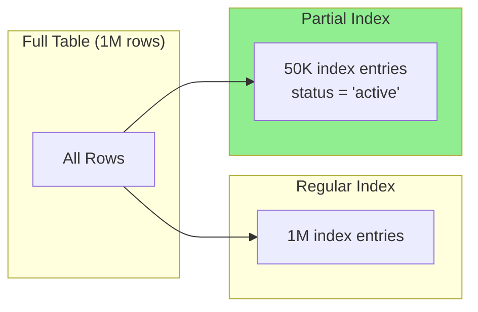
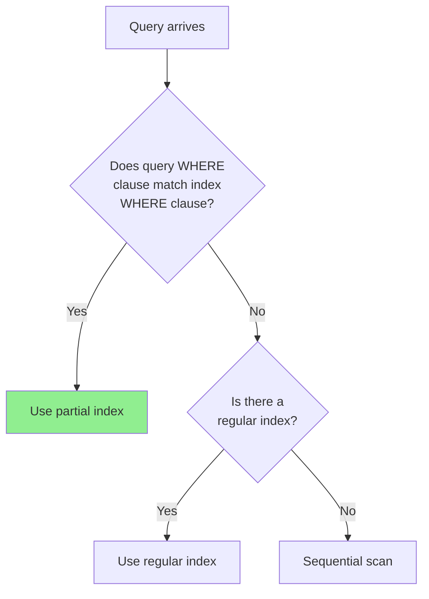

# How to Create Partial Index Design

Author: [nawazdhandala](https://github.com/nawazdhandala)

Tags: Database, Indexing, PostgreSQL, Performance

Description: Learn to create partial index design for indexing subsets of data with conditional expressions.

---

Most database indexes cover every row in a table. That is wasteful when you only query a small subset of that data. Partial indexes solve this problem by indexing only the rows that match a specified condition. The result is smaller indexes, faster writes, and more targeted query performance.

## What Is a Partial Index?

A partial index is an index built on a subset of rows in a table, defined by a WHERE clause. Instead of indexing all rows, the database only indexes rows that satisfy the condition you specify.



The key insight is simple: if 95% of your queries filter on `status = 'active'` and only 5% of rows are active, why index the other 95%?

## When to Use Partial Indexes

Partial indexes work best in specific scenarios. Use them when:

| Scenario | Example | Benefit |
|----------|---------|---------|
| Skewed data distribution | 5% of orders are pending, 95% shipped | Index only pending orders |
| Soft deletes | `deleted_at IS NULL` for active records | Index only non-deleted rows |
| Time-based queries | Recent data accessed frequently | Index only last 30 days |
| Status filtering | Jobs in `queued` or `running` state | Index only actionable items |
| Sparse columns | Rows where optional field is NOT NULL | Index only populated values |

## Creating Your First Partial Index

The syntax adds a WHERE clause to a standard CREATE INDEX statement. Here is how to create a partial index in PostgreSQL.

```sql
-- Create a partial index on orders that are still pending
-- This index will only include rows where status = 'pending'
CREATE INDEX idx_orders_pending
ON orders (created_at)
WHERE status = 'pending';
```

Compare this to a regular index that would include all rows regardless of status.

```sql
-- Regular index includes all 10 million rows
CREATE INDEX idx_orders_created_at
ON orders (created_at);

-- Partial index includes only ~50,000 pending rows
CREATE INDEX idx_orders_pending
ON orders (created_at)
WHERE status = 'pending';
```

The storage difference can be dramatic. If you have 10 million orders and only 50,000 are pending, the partial index is 200x smaller.

## Practical Examples

### Example 1: Soft Delete Pattern

Most applications use soft deletes where a `deleted_at` timestamp marks removed records. Queries almost always filter for active records.

```sql
-- Table with soft deletes
CREATE TABLE users (
    id SERIAL PRIMARY KEY,
    email VARCHAR(255) NOT NULL,
    name VARCHAR(255),
    deleted_at TIMESTAMP DEFAULT NULL,
    created_at TIMESTAMP DEFAULT NOW()
);

-- Partial index for active users only
-- Queries filtering deleted_at IS NULL will use this index
CREATE INDEX idx_users_active_email
ON users (email)
WHERE deleted_at IS NULL;
```

Queries that benefit from this index.

```sql
-- This query uses idx_users_active_email
SELECT * FROM users
WHERE email = 'user@example.com'
AND deleted_at IS NULL;

-- This query does NOT use the partial index (no deleted_at filter)
SELECT * FROM users
WHERE email = 'user@example.com';
```

### Example 2: Job Queue Processing

Background job systems query for unprocessed jobs constantly. A partial index makes these lookups fast regardless of historical job volume.

```sql
-- Job queue table
CREATE TABLE jobs (
    id SERIAL PRIMARY KEY,
    queue_name VARCHAR(100),
    payload JSONB,
    status VARCHAR(20) DEFAULT 'pending',
    scheduled_at TIMESTAMP,
    completed_at TIMESTAMP
);

-- Index only jobs that need processing
-- Workers poll for pending/running jobs frequently
CREATE INDEX idx_jobs_actionable
ON jobs (queue_name, scheduled_at)
WHERE status IN ('pending', 'running');
```

The query planner will use this index when the WHERE clause matches.

```sql
-- Efficient: Uses partial index
SELECT * FROM jobs
WHERE queue_name = 'emails'
AND status = 'pending'
AND scheduled_at <= NOW()
ORDER BY scheduled_at
LIMIT 10;
```

### Example 3: Unique Constraint on Subset

Partial indexes enable unique constraints that only apply to certain rows. This is useful for business rules like "only one active subscription per user."

```sql
-- Subscriptions table
CREATE TABLE subscriptions (
    id SERIAL PRIMARY KEY,
    user_id INTEGER NOT NULL,
    plan_id INTEGER NOT NULL,
    status VARCHAR(20) DEFAULT 'active',
    canceled_at TIMESTAMP
);

-- Unique constraint: one active subscription per user
-- Canceled subscriptions are excluded from uniqueness check
CREATE UNIQUE INDEX idx_subscriptions_one_active_per_user
ON subscriptions (user_id)
WHERE status = 'active';
```

This allows the following data.

```sql
-- Allowed: One active subscription
INSERT INTO subscriptions (user_id, plan_id, status)
VALUES (1, 100, 'active');

-- Allowed: Multiple canceled subscriptions for same user
INSERT INTO subscriptions (user_id, plan_id, status)
VALUES (1, 100, 'canceled');
INSERT INTO subscriptions (user_id, plan_id, status)
VALUES (1, 200, 'canceled');

-- Error: Violates unique constraint (user 1 already has active)
INSERT INTO subscriptions (user_id, plan_id, status)
VALUES (1, 300, 'active');
```

## Query Planner Behavior

The database query planner uses a partial index only when it can prove the query's WHERE clause implies the index's WHERE clause.



Use EXPLAIN to verify index usage.

```sql
-- Check if partial index is used
EXPLAIN ANALYZE
SELECT * FROM orders
WHERE status = 'pending'
AND created_at > '2026-01-01';
```

Expected output showing index usage.

```
Index Scan using idx_orders_pending on orders
  Index Cond: (created_at > '2026-01-01')
  Rows Removed by Index Recheck: 0
  Actual rows: 1523
  Planning time: 0.1 ms
  Execution time: 2.3 ms
```

## Performance Comparison

Here is a benchmark comparing partial vs regular indexes on a table with 10 million rows where 0.5% match the partial index condition.

| Metric | Regular Index | Partial Index | Improvement |
|--------|---------------|---------------|-------------|
| Index size | 214 MB | 1.1 MB | 195x smaller |
| Insert time | 0.8 ms | 0.3 ms | 2.7x faster |
| Query time (matching) | 1.2 ms | 0.4 ms | 3x faster |
| Vacuum time | 45 sec | 0.2 sec | 225x faster |

The insert time improvement comes from the database not needing to update the index for rows that do not match the condition.

## Common Pitfalls

Avoid these mistakes when designing partial indexes.

**Overly specific conditions**: If your condition matches too few rows, the index may never be used because a sequential scan is cheaper for tiny result sets.

```sql
-- Too specific: probably not useful
CREATE INDEX idx_orders_one_customer
ON orders (created_at)
WHERE customer_id = 12345 AND status = 'pending';
```

**Mismatch between query and index conditions**: The query WHERE clause must logically imply the index condition.

```sql
-- Index condition
CREATE INDEX idx_products_in_stock
ON products (name)
WHERE quantity > 0;

-- This query will NOT use the index
-- (quantity >= 1 is equivalent but planner may not recognize it)
SELECT * FROM products WHERE quantity >= 1;

-- This query WILL use the index
SELECT * FROM products WHERE quantity > 0;
```

**Forgetting to update conditions**: If your business logic changes (new statuses, different soft delete approach), remember to update your partial indexes.

## Maintenance Considerations

Partial indexes require the same maintenance as regular indexes but with some advantages.

```sql
-- Check index size
SELECT pg_size_pretty(pg_relation_size('idx_orders_pending')) as index_size;

-- Check index usage statistics
SELECT schemaname, relname, indexrelname, idx_scan, idx_tup_read
FROM pg_stat_user_indexes
WHERE indexrelname = 'idx_orders_pending';

-- Reindex if needed (faster than full index due to smaller size)
REINDEX INDEX CONCURRENTLY idx_orders_pending;
```

## Combining with Other Index Types

Partial indexes work with various index types.

```sql
-- Partial B-tree (default)
CREATE INDEX idx_active_users_email
ON users (email)
WHERE deleted_at IS NULL;

-- Partial GIN for JSONB
CREATE INDEX idx_pending_jobs_payload
ON jobs USING GIN (payload)
WHERE status = 'pending';

-- Partial GiST for geometric data
CREATE INDEX idx_active_locations
ON locations USING GIST (coordinates)
WHERE is_active = true;
```

---

Partial indexes are a powerful tool for optimizing database performance when you consistently query a subset of your data. Start by identifying tables where most queries filter on the same conditions, then create targeted partial indexes for those patterns. The reduced storage, faster writes, and improved query performance make partial indexes worth considering for any high-volume PostgreSQL deployment.
