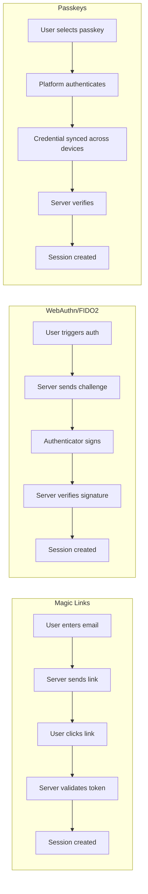
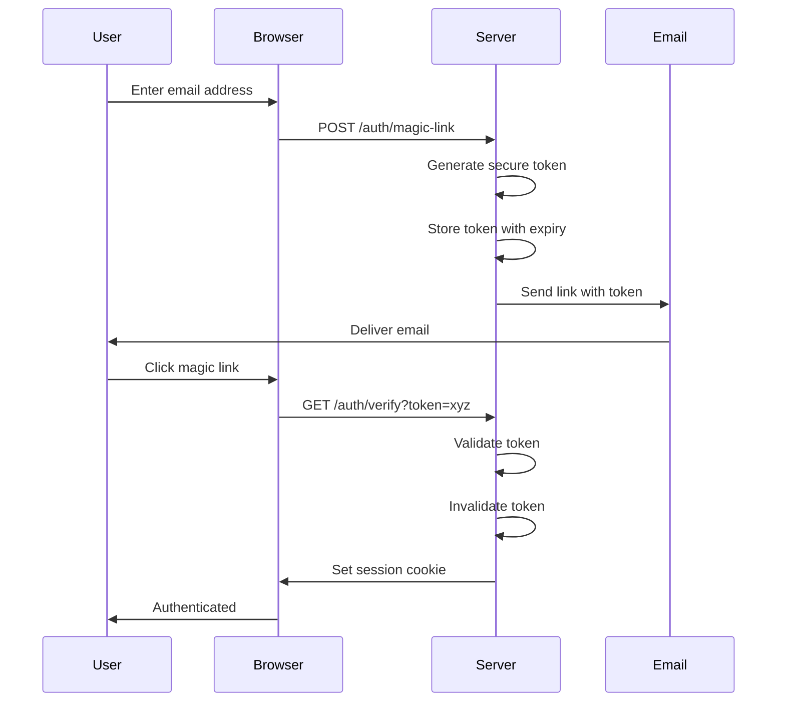
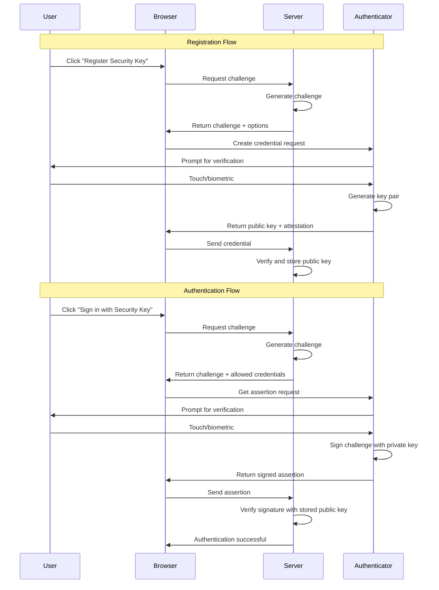
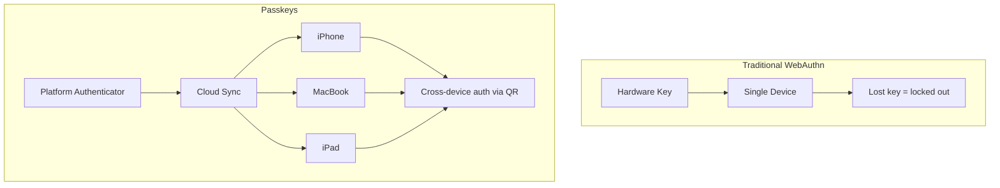
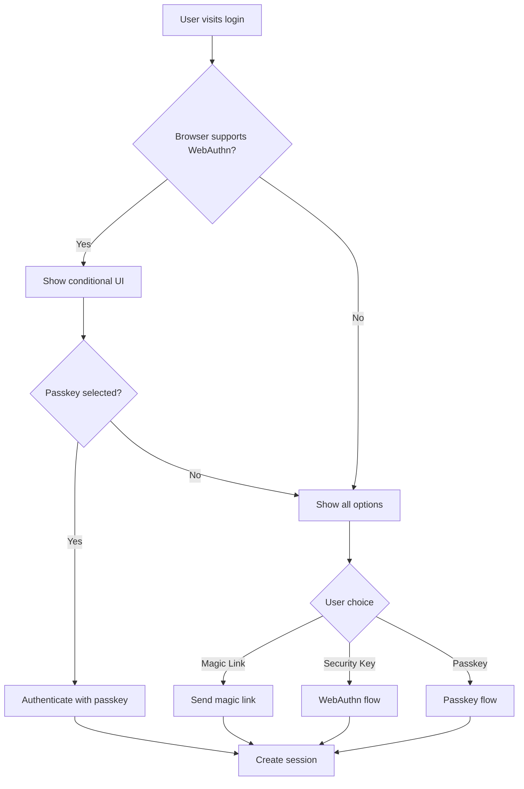

# How to Create Passwordless Authentication Details

Author: [nawazdhandala](https://github.com/nawazdhandala)

Tags: Authentication, Passwordless, Security, WebAuthn

Description: A practical guide to implementing passwordless authentication using magic links, FIDO2/WebAuthn, and passkeys for secure, frictionless user access.

---

Passwords are the weakest link in most authentication systems. Users reuse them, forget them, and fall for phishing attacks that steal them. Passwordless authentication eliminates these problems by replacing shared secrets with cryptographic proof or verified communication channels.

This guide walks through three approaches to passwordless authentication: magic links for simplicity, FIDO2/WebAuthn for hardware-backed security, and passkeys for the best of both worlds.

---

## Why Go Passwordless

- **No passwords to steal.** Phishing attacks become ineffective when there's no password to enter on a fake site.
- **No passwords to reuse.** Credential stuffing attacks fail because credentials don't exist.
- **No passwords to forget.** Help desk tickets for password resets drop significantly.
- **Stronger authentication.** WebAuthn and passkeys use public-key cryptography, which is far stronger than any password a human could remember.
- **Better user experience.** Tapping a phone or clicking an email link beats typing a 16-character password with special characters.

---

## The Three Passwordless Approaches



---

## Approach 1: Magic Links

Magic links are the simplest passwordless method. The user provides their email, receives a link with a secure token, and clicking that link authenticates them.

### How Magic Links Work



### Implementing Magic Links in Node.js

```javascript
// Generate and send magic link
const crypto = require('crypto');
const nodemailer = require('nodemailer');

async function sendMagicLink(email) {
  // Generate a secure random token
  const token = crypto.randomBytes(32).toString('hex');
  const expiresAt = Date.now() + 15 * 60 * 1000; // 15 minutes

  // Store token in database
  await db.magicLinks.create({
    token: hashToken(token), // Store hashed version
    email,
    expiresAt,
    used: false
  });

  // Build the magic link URL
  const magicLink = `https://yourapp.com/auth/verify?token=${token}`;

  // Send email
  await transporter.sendMail({
    to: email,
    subject: 'Sign in to YourApp',
    html: `
      <p>Click the link below to sign in. This link expires in 15 minutes.</p>
      <a href="${magicLink}">Sign in to YourApp</a>
      <p>If you didn't request this, ignore this email.</p>
    `
  });
}

function hashToken(token) {
  return crypto.createHash('sha256').update(token).digest('hex');
}
```

```javascript
// Verify magic link and create session
async function verifyMagicLink(token) {
  const hashedToken = hashToken(token);

  // Find and validate token
  const record = await db.magicLinks.findOne({
    token: hashedToken,
    used: false,
    expiresAt: { $gt: Date.now() }
  });

  if (!record) {
    throw new Error('Invalid or expired link');
  }

  // Mark token as used (one-time use)
  await db.magicLinks.updateOne(
    { token: hashedToken },
    { used: true }
  );

  // Find or create user
  let user = await db.users.findOne({ email: record.email });
  if (!user) {
    user = await db.users.create({ email: record.email });
  }

  // Create session
  const sessionToken = crypto.randomBytes(32).toString('hex');
  await db.sessions.create({
    token: hashToken(sessionToken),
    userId: user.id,
    expiresAt: Date.now() + 7 * 24 * 60 * 60 * 1000 // 7 days
  });

  return { user, sessionToken };
}
```

### Magic Link Security Considerations

- **Token entropy**: Use at least 256 bits (32 bytes) of randomness.
- **Short expiration**: 15 minutes is reasonable. Shorter is safer.
- **One-time use**: Invalidate tokens immediately after use.
- **Hash stored tokens**: Store only hashed tokens in the database.
- **Rate limiting**: Limit magic link requests per email to prevent abuse.
- **Email enumeration**: Return the same response whether the email exists or not.

```javascript
// Rate limiting example
const rateLimit = require('express-rate-limit');

const magicLinkLimiter = rateLimit({
  windowMs: 60 * 60 * 1000, // 1 hour
  max: 5, // 5 requests per email per hour
  keyGenerator: (req) => req.body.email,
  message: 'Too many login attempts. Try again later.'
});

app.post('/auth/magic-link', magicLinkLimiter, handleMagicLink);
```

---

## Approach 2: FIDO2/WebAuthn

WebAuthn is a W3C standard that enables strong authentication using hardware security keys or platform authenticators like fingerprint readers and Face ID.

### How WebAuthn Works



### Implementing WebAuthn Registration

```javascript
// Server-side: Generate registration options
const { generateRegistrationOptions, verifyRegistrationResponse } = require('@simplewebauthn/server');

const rpName = 'YourApp';
const rpID = 'yourapp.com';
const origin = 'https://yourapp.com';

async function getRegistrationOptions(user) {
  // Get existing credentials for this user
  const existingCredentials = await db.credentials.find({ userId: user.id });

  const options = await generateRegistrationOptions({
    rpName,
    rpID,
    userID: user.id,
    userName: user.email,
    userDisplayName: user.name || user.email,
    attestationType: 'none', // 'direct' for hardware attestation
    excludeCredentials: existingCredentials.map(cred => ({
      id: cred.credentialId,
      type: 'public-key',
      transports: cred.transports
    })),
    authenticatorSelection: {
      residentKey: 'preferred',
      userVerification: 'preferred',
      authenticatorAttachment: 'cross-platform' // or 'platform' for built-in
    }
  });

  // Store challenge for verification
  await db.challenges.create({
    challenge: options.challenge,
    userId: user.id,
    type: 'registration',
    expiresAt: Date.now() + 5 * 60 * 1000 // 5 minutes
  });

  return options;
}
```

```javascript
// Server-side: Verify registration response
async function verifyRegistration(user, response) {
  // Retrieve stored challenge
  const challengeRecord = await db.challenges.findOne({
    userId: user.id,
    type: 'registration',
    expiresAt: { $gt: Date.now() }
  });

  if (!challengeRecord) {
    throw new Error('Challenge expired or not found');
  }

  const verification = await verifyRegistrationResponse({
    response,
    expectedChallenge: challengeRecord.challenge,
    expectedOrigin: origin,
    expectedRPID: rpID
  });

  if (!verification.verified) {
    throw new Error('Registration verification failed');
  }

  const { credentialPublicKey, credentialID, counter } = verification.registrationInfo;

  // Store credential
  await db.credentials.create({
    userId: user.id,
    credentialId: Buffer.from(credentialID),
    publicKey: Buffer.from(credentialPublicKey),
    counter,
    transports: response.response.transports
  });

  // Clean up challenge
  await db.challenges.deleteOne({ _id: challengeRecord._id });

  return { success: true };
}
```

### Implementing WebAuthn Authentication

```javascript
// Server-side: Generate authentication options
const { generateAuthenticationOptions, verifyAuthenticationResponse } = require('@simplewebauthn/server');

async function getAuthenticationOptions(email) {
  const user = await db.users.findOne({ email });

  // Get user's credentials (empty array if user doesn't exist)
  const credentials = user
    ? await db.credentials.find({ userId: user.id })
    : [];

  const options = await generateAuthenticationOptions({
    rpID,
    allowCredentials: credentials.map(cred => ({
      id: cred.credentialId,
      type: 'public-key',
      transports: cred.transports
    })),
    userVerification: 'preferred'
  });

  // Store challenge
  if (user) {
    await db.challenges.create({
      challenge: options.challenge,
      userId: user.id,
      type: 'authentication',
      expiresAt: Date.now() + 5 * 60 * 1000
    });
  }

  return options;
}
```

```javascript
// Server-side: Verify authentication response
async function verifyAuthentication(response) {
  // Find credential by ID
  const credential = await db.credentials.findOne({
    credentialId: Buffer.from(response.id, 'base64url')
  });

  if (!credential) {
    throw new Error('Credential not found');
  }

  // Retrieve challenge
  const challengeRecord = await db.challenges.findOne({
    userId: credential.userId,
    type: 'authentication',
    expiresAt: { $gt: Date.now() }
  });

  if (!challengeRecord) {
    throw new Error('Challenge expired or not found');
  }

  const verification = await verifyAuthenticationResponse({
    response,
    expectedChallenge: challengeRecord.challenge,
    expectedOrigin: origin,
    expectedRPID: rpID,
    authenticator: {
      credentialPublicKey: credential.publicKey,
      credentialID: credential.credentialId,
      counter: credential.counter
    }
  });

  if (!verification.verified) {
    throw new Error('Authentication verification failed');
  }

  // Update counter to prevent replay attacks
  await db.credentials.updateOne(
    { _id: credential._id },
    { counter: verification.authenticationInfo.newCounter }
  );

  // Clean up and create session
  await db.challenges.deleteOne({ _id: challengeRecord._id });

  const user = await db.users.findById(credential.userId);
  return createSession(user);
}
```

### Client-Side WebAuthn Implementation

```javascript
// Client-side: Registration
async function registerSecurityKey() {
  // Get options from server
  const optionsResponse = await fetch('/auth/webauthn/register/options', {
    method: 'POST',
    credentials: 'include'
  });
  const options = await optionsResponse.json();

  // Convert base64url strings to ArrayBuffers
  options.challenge = base64urlToBuffer(options.challenge);
  options.user.id = base64urlToBuffer(options.user.id);
  options.excludeCredentials = options.excludeCredentials?.map(cred => ({
    ...cred,
    id: base64urlToBuffer(cred.id)
  }));

  // Create credential
  const credential = await navigator.credentials.create({
    publicKey: options
  });

  // Send credential to server
  const verifyResponse = await fetch('/auth/webauthn/register/verify', {
    method: 'POST',
    headers: { 'Content-Type': 'application/json' },
    credentials: 'include',
    body: JSON.stringify({
      id: credential.id,
      rawId: bufferToBase64url(credential.rawId),
      type: credential.type,
      response: {
        clientDataJSON: bufferToBase64url(credential.response.clientDataJSON),
        attestationObject: bufferToBase64url(credential.response.attestationObject),
        transports: credential.response.getTransports?.()
      }
    })
  });

  return verifyResponse.json();
}
```

```javascript
// Client-side: Authentication
async function authenticateWithSecurityKey(email) {
  // Get options from server
  const optionsResponse = await fetch('/auth/webauthn/authenticate/options', {
    method: 'POST',
    headers: { 'Content-Type': 'application/json' },
    body: JSON.stringify({ email })
  });
  const options = await optionsResponse.json();

  // Convert base64url strings to ArrayBuffers
  options.challenge = base64urlToBuffer(options.challenge);
  options.allowCredentials = options.allowCredentials?.map(cred => ({
    ...cred,
    id: base64urlToBuffer(cred.id)
  }));

  // Get assertion
  const assertion = await navigator.credentials.get({
    publicKey: options
  });

  // Send assertion to server
  const verifyResponse = await fetch('/auth/webauthn/authenticate/verify', {
    method: 'POST',
    headers: { 'Content-Type': 'application/json' },
    body: JSON.stringify({
      id: assertion.id,
      rawId: bufferToBase64url(assertion.rawId),
      type: assertion.type,
      response: {
        clientDataJSON: bufferToBase64url(assertion.response.clientDataJSON),
        authenticatorData: bufferToBase64url(assertion.response.authenticatorData),
        signature: bufferToBase64url(assertion.response.signature),
        userHandle: assertion.response.userHandle
          ? bufferToBase64url(assertion.response.userHandle)
          : null
      }
    })
  });

  return verifyResponse.json();
}

// Utility functions
function base64urlToBuffer(base64url) {
  const base64 = base64url.replace(/-/g, '+').replace(/_/g, '/');
  const binary = atob(base64);
  const bytes = new Uint8Array(binary.length);
  for (let i = 0; i < binary.length; i++) {
    bytes[i] = binary.charCodeAt(i);
  }
  return bytes.buffer;
}

function bufferToBase64url(buffer) {
  const bytes = new Uint8Array(buffer);
  let binary = '';
  for (let i = 0; i < bytes.length; i++) {
    binary += String.fromCharCode(bytes[i]);
  }
  return btoa(binary).replace(/\+/g, '-').replace(/\//g, '_').replace(/=/g, '');
}
```

---

## Approach 3: Passkeys

Passkeys are the evolution of WebAuthn credentials. They're discoverable credentials that sync across devices through platform cloud services (iCloud Keychain, Google Password Manager, Windows Hello).

### How Passkeys Differ from Traditional WebAuthn



### Implementing Passkey Registration

```javascript
// Server-side: Passkey-specific registration options
async function getPasskeyRegistrationOptions(user) {
  const options = await generateRegistrationOptions({
    rpName,
    rpID,
    userID: user.id,
    userName: user.email,
    userDisplayName: user.name || user.email,
    attestationType: 'none',
    authenticatorSelection: {
      // Passkeys require resident keys
      residentKey: 'required',
      requireResidentKey: true,
      userVerification: 'required',
      // Allow both platform and roaming authenticators
      // Omit authenticatorAttachment to allow both
    },
    excludeCredentials: await getExistingCredentials(user.id)
  });

  await storeChallenge(user.id, options.challenge, 'registration');
  return options;
}
```

### Passkey Authentication with Discoverable Credentials

With passkeys, users don't need to enter their email first. The browser can present available passkeys for the current site.

```javascript
// Server-side: Passkey authentication without email
async function getPasskeyAuthenticationOptions() {
  // Empty allowCredentials enables discoverable credential flow
  const options = await generateAuthenticationOptions({
    rpID,
    userVerification: 'required',
    // No allowCredentials means browser will show all available passkeys
  });

  // Store challenge with null userId since we don't know who yet
  await db.challenges.create({
    challenge: options.challenge,
    userId: null,
    type: 'passkey-authentication',
    expiresAt: Date.now() + 5 * 60 * 1000
  });

  return options;
}
```

```javascript
// Server-side: Verify passkey authentication
async function verifyPasskeyAuthentication(response) {
  // userHandle contains the user ID encoded during registration
  const userId = response.response.userHandle;

  if (!userId) {
    throw new Error('User handle required for passkey authentication');
  }

  // Find credential by user ID and credential ID
  const credential = await db.credentials.findOne({
    userId: Buffer.from(userId, 'base64url').toString(),
    credentialId: Buffer.from(response.id, 'base64url')
  });

  if (!credential) {
    throw new Error('Credential not found');
  }

  // Find any valid challenge (since we didn't know the user beforehand)
  const challengeRecord = await db.challenges.findOne({
    type: 'passkey-authentication',
    expiresAt: { $gt: Date.now() }
  });

  // Verify and create session...
  // (Same as regular WebAuthn verification)
}
```

### Client-Side Passkey Authentication

```javascript
// Client-side: Passwordless login with passkeys
async function loginWithPasskey() {
  // Get options (no email needed)
  const optionsResponse = await fetch('/auth/passkey/options', {
    method: 'POST'
  });
  const options = await optionsResponse.json();

  options.challenge = base64urlToBuffer(options.challenge);
  // allowCredentials is empty, browser shows all available passkeys

  try {
    const assertion = await navigator.credentials.get({
      publicKey: options,
      mediation: 'optional' // Can also use 'conditional' for autofill
    });

    // Send to server for verification
    const result = await fetch('/auth/passkey/verify', {
      method: 'POST',
      headers: { 'Content-Type': 'application/json' },
      body: JSON.stringify({
        id: assertion.id,
        rawId: bufferToBase64url(assertion.rawId),
        type: assertion.type,
        response: {
          clientDataJSON: bufferToBase64url(assertion.response.clientDataJSON),
          authenticatorData: bufferToBase64url(assertion.response.authenticatorData),
          signature: bufferToBase64url(assertion.response.signature),
          userHandle: bufferToBase64url(assertion.response.userHandle)
        }
      })
    });

    return result.json();
  } catch (error) {
    if (error.name === 'NotAllowedError') {
      // User cancelled or no passkeys available
      return { cancelled: true };
    }
    throw error;
  }
}
```

### Conditional UI (Autofill)

Modern browsers support conditional UI, which shows passkey options in the username autofill dropdown.

```html
<!-- HTML: Enable conditional UI -->
<input
  type="email"
  id="email"
  autocomplete="username webauthn"
  placeholder="Email address"
>
```

```javascript
// Client-side: Conditional UI for passkeys
async function initConditionalUI() {
  // Check if conditional UI is supported
  if (!window.PublicKeyCredential?.isConditionalMediationAvailable) {
    return;
  }

  const isAvailable = await PublicKeyCredential.isConditionalMediationAvailable();
  if (!isAvailable) {
    return;
  }

  // Get options
  const optionsResponse = await fetch('/auth/passkey/options', {
    method: 'POST'
  });
  const options = await optionsResponse.json();
  options.challenge = base64urlToBuffer(options.challenge);

  try {
    // This will show passkeys in the autofill dropdown
    const assertion = await navigator.credentials.get({
      publicKey: options,
      mediation: 'conditional' // Enables autofill UI
    });

    // User selected a passkey from autofill
    await verifyAndLogin(assertion);
  } catch (error) {
    // User didn't select a passkey, continue with normal flow
    console.log('Conditional UI not used:', error);
  }
}

// Initialize on page load
document.addEventListener('DOMContentLoaded', initConditionalUI);
```

---

## Combining Approaches

Most production systems offer multiple passwordless options to accommodate different user preferences and device capabilities.



### Unified Authentication API

```javascript
// Server-side: Unified auth endpoint
app.post('/auth/options', async (req, res) => {
  const { email, method } = req.body;

  switch (method) {
    case 'magic-link':
      await sendMagicLink(email);
      return res.json({ success: true, message: 'Check your email' });

    case 'webauthn':
      const webauthnOptions = await getAuthenticationOptions(email);
      return res.json({ type: 'webauthn', options: webauthnOptions });

    case 'passkey':
      const passkeyOptions = await getPasskeyAuthenticationOptions();
      return res.json({ type: 'passkey', options: passkeyOptions });

    default:
      return res.status(400).json({ error: 'Invalid method' });
  }
});
```

---

## Database Schema

Here's a schema that supports all three passwordless methods.

```sql
-- Users table
CREATE TABLE users (
  id UUID PRIMARY KEY DEFAULT gen_random_uuid(),
  email VARCHAR(255) UNIQUE NOT NULL,
  name VARCHAR(255),
  created_at TIMESTAMP DEFAULT CURRENT_TIMESTAMP,
  updated_at TIMESTAMP DEFAULT CURRENT_TIMESTAMP
);

-- WebAuthn credentials
CREATE TABLE credentials (
  id UUID PRIMARY KEY DEFAULT gen_random_uuid(),
  user_id UUID REFERENCES users(id) ON DELETE CASCADE,
  credential_id BYTEA UNIQUE NOT NULL,
  public_key BYTEA NOT NULL,
  counter INTEGER DEFAULT 0,
  transports TEXT[],
  authenticator_type VARCHAR(50), -- 'platform', 'cross-platform', 'passkey'
  created_at TIMESTAMP DEFAULT CURRENT_TIMESTAMP,
  last_used_at TIMESTAMP
);

-- Magic link tokens
CREATE TABLE magic_links (
  id UUID PRIMARY KEY DEFAULT gen_random_uuid(),
  token_hash VARCHAR(64) NOT NULL,
  email VARCHAR(255) NOT NULL,
  expires_at TIMESTAMP NOT NULL,
  used BOOLEAN DEFAULT FALSE,
  created_at TIMESTAMP DEFAULT CURRENT_TIMESTAMP
);

-- Authentication challenges
CREATE TABLE challenges (
  id UUID PRIMARY KEY DEFAULT gen_random_uuid(),
  challenge VARCHAR(255) NOT NULL,
  user_id UUID REFERENCES users(id) ON DELETE CASCADE,
  type VARCHAR(50) NOT NULL,
  expires_at TIMESTAMP NOT NULL,
  created_at TIMESTAMP DEFAULT CURRENT_TIMESTAMP
);

-- Sessions
CREATE TABLE sessions (
  id UUID PRIMARY KEY DEFAULT gen_random_uuid(),
  token_hash VARCHAR(64) NOT NULL,
  user_id UUID REFERENCES users(id) ON DELETE CASCADE,
  expires_at TIMESTAMP NOT NULL,
  auth_method VARCHAR(50), -- 'magic-link', 'webauthn', 'passkey'
  created_at TIMESTAMP DEFAULT CURRENT_TIMESTAMP
);

-- Indexes
CREATE INDEX idx_credentials_user_id ON credentials(user_id);
CREATE INDEX idx_magic_links_token_hash ON magic_links(token_hash);
CREATE INDEX idx_challenges_user_id ON challenges(user_id);
CREATE INDEX idx_sessions_token_hash ON sessions(token_hash);
```

---

## Security Best Practices

### Challenge Management

- **Generate challenges server-side** with cryptographically secure randomness.
- **Short expiration times**: 5 minutes for WebAuthn, 15 minutes for magic links.
- **One-time use**: Delete challenges after successful verification.
- **Bind to user**: Store the user ID with the challenge to prevent cross-user attacks.

### Credential Storage

- **Never store private keys**: WebAuthn private keys stay on the authenticator.
- **Store public keys securely**: Encrypt at rest.
- **Track credential metadata**: Last used time, authenticator type, transports.
- **Support credential revocation**: Let users remove compromised credentials.

### Session Management

- **Rotate session tokens**: Issue new tokens on privilege escalation.
- **Track auth method**: Know which method was used to create each session.
- **Implement session limits**: Cap concurrent sessions per user.
- **Support remote logout**: Let users revoke sessions on other devices.

### Rate Limiting

```javascript
// Different limits for different operations
const magicLinkLimit = rateLimit({
  windowMs: 60 * 60 * 1000,
  max: 5,
  keyGenerator: (req) => req.body.email
});

const webauthnChallengeLimit = rateLimit({
  windowMs: 60 * 1000,
  max: 10,
  keyGenerator: (req) => req.ip
});

const failedAuthLimit = rateLimit({
  windowMs: 15 * 60 * 1000,
  max: 5,
  keyGenerator: (req) => req.body.email || req.ip,
  skipSuccessfulRequests: true
});
```

---

## Browser Support and Feature Detection

```javascript
// Check for WebAuthn support
function isWebAuthnSupported() {
  return window.PublicKeyCredential !== undefined;
}

// Check for platform authenticator (Touch ID, Face ID, Windows Hello)
async function isPlatformAuthenticatorAvailable() {
  if (!isWebAuthnSupported()) return false;
  return await PublicKeyCredential.isUserVerifyingPlatformAuthenticatorAvailable();
}

// Check for conditional UI support
async function isConditionalUISupported() {
  if (!isWebAuthnSupported()) return false;
  if (!PublicKeyCredential.isConditionalMediationAvailable) return false;
  return await PublicKeyCredential.isConditionalMediationAvailable();
}

// Feature detection on page load
async function detectAuthCapabilities() {
  return {
    webauthn: isWebAuthnSupported(),
    platformAuthenticator: await isPlatformAuthenticatorAvailable(),
    conditionalUI: await isConditionalUISupported()
  };
}
```

---

## Migration Strategy

Moving from passwords to passwordless requires a gradual approach.

1. **Add passwordless as an option**: Let users register security keys or passkeys alongside their password.
2. **Encourage adoption**: Prompt users to add a passkey after successful password login.
3. **Track usage metrics**: Monitor how many users have passwordless credentials and how often they use them.
4. **Reduce password friction**: Require re-auth with password less frequently for users with passkeys.
5. **Optional password removal**: Let users delete their password once they have reliable passwordless methods.
6. **Default to passwordless**: Make passwordless the primary login method for new users.

---

## Troubleshooting Common Issues

**"The operation either timed out or was not allowed"**
- User cancelled the operation
- No credentials available for this origin
- Authenticator not connected or recognized

**"SecurityError: The operation is insecure"**
- Must use HTTPS (except localhost)
- RP ID doesn't match the current origin

**"NotSupportedError"**
- Browser doesn't support WebAuthn
- Authenticator doesn't support required features

**Magic link not received**
- Check spam folder
- Verify email deliverability
- Check rate limiting logs

---

## Summary

Passwordless authentication provides better security and user experience than traditional passwords. Start with magic links for broad compatibility, add WebAuthn for security-conscious users, and implement passkeys for the best experience on modern devices.

The investment in passwordless pays off through reduced support tickets, eliminated credential stuffing attacks, and happier users who never have to remember another password.
