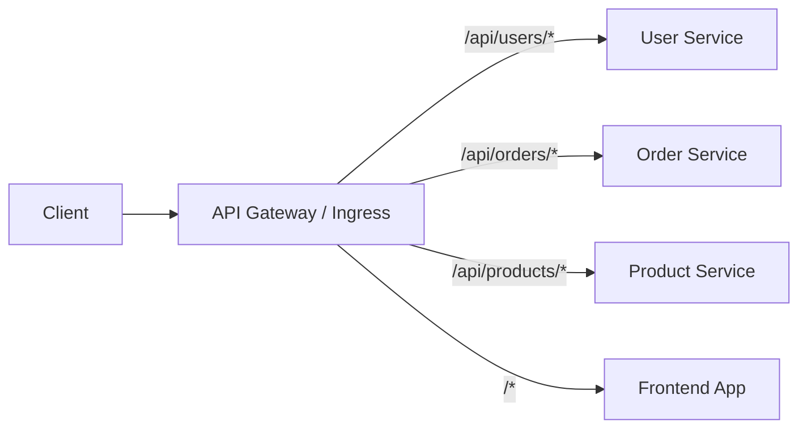
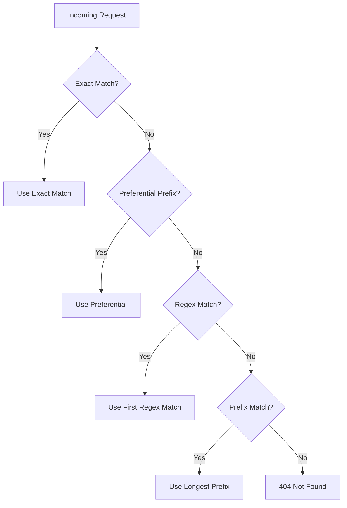
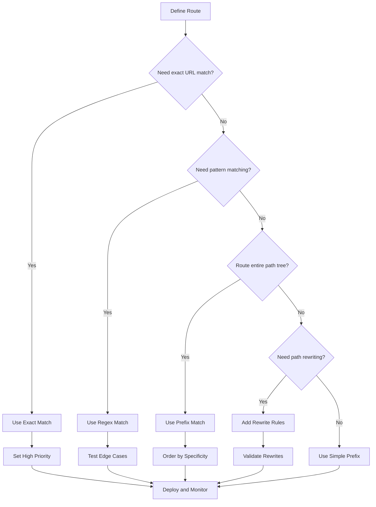

# How to Create Path-Based Routing

Author: [nawazdhandala](https://github.com/nawazdhandala)

Tags: API Gateway, Routing, Microservices, Infrastructure

Description: Learn how to configure path-based routing rules to direct traffic to different backend services based on URL paths.

---

Path-based routing lets you send requests to different backend services depending on the URL path. Instead of running one monolithic application, you can split your system into multiple services and route `/api/users` to your user service while `/api/orders` goes to your order service.

## How Path-Based Routing Works

When a request arrives, the router inspects the URL path and matches it against configured rules. The first matching rule determines which backend handles the request.



## Path Matching Strategies

Different routers support different matching strategies. Understanding these helps you write precise routing rules.

### Exact Match

The path must match exactly, character for character.

```yaml
# Matches: /api/health
# Does NOT match: /api/health/, /api/health/check, /api/healthz
path: /api/health
pathType: Exact
```

### Prefix Match

The path must start with the specified prefix.

```yaml
# Matches: /api/users, /api/users/, /api/users/123, /api/users/123/profile
# Does NOT match: /api/userservice, /users
path: /api/users
pathType: Prefix
```

### Regex Match

Pattern matching using regular expressions for complex routing needs.

```yaml
# Matches: /api/v1/users, /api/v2/orders, /api/v10/products
# Does NOT match: /api/users, /api/vX/users
path: "~/api/v[0-9]+/.*"
```

## Kubernetes Ingress Path Routing

Kubernetes Ingress is the most common way to implement path-based routing in container environments.

### Basic Path Routing

```yaml
apiVersion: networking.k8s.io/v1
kind: Ingress
metadata:
  name: api-routing
  namespace: production
spec:
  ingressClassName: nginx
  rules:
    - host: api.example.com
      http:
        paths:
          - path: /users
            pathType: Prefix
            backend:
              service:
                name: user-service
                port:
                  number: 8080
          - path: /orders
            pathType: Prefix
            backend:
              service:
                name: order-service
                port:
                  number: 8080
          - path: /
            pathType: Prefix
            backend:
              service:
                name: frontend
                port:
                  number: 80
```

### Path Routing with URL Rewriting

Sometimes backends expect requests at the root path. Use annotations to strip the routing prefix.

```yaml
apiVersion: networking.k8s.io/v1
kind: Ingress
metadata:
  name: api-with-rewrite
  namespace: production
  annotations:
    nginx.ingress.kubernetes.io/rewrite-target: /$2
spec:
  ingressClassName: nginx
  rules:
    - host: api.example.com
      http:
        paths:
          - path: /user-service(/|$)(.*)
            pathType: ImplementationSpecific
            backend:
              service:
                name: user-service
                port:
                  number: 8080
```

With this configuration:
- Request to `/user-service/api/v1/users` gets routed to user-service as `/api/v1/users`
- Request to `/user-service/health` gets routed as `/health`

### Multiple Hosts with Path Routing

Combine host-based and path-based routing for complex setups.

```yaml
apiVersion: networking.k8s.io/v1
kind: Ingress
metadata:
  name: multi-host-routing
  namespace: production
spec:
  ingressClassName: nginx
  rules:
    - host: app.example.com
      http:
        paths:
          - path: /
            pathType: Prefix
            backend:
              service:
                name: web-app
                port:
                  number: 80
    - host: api.example.com
      http:
        paths:
          - path: /v1
            pathType: Prefix
            backend:
              service:
                name: api-v1
                port:
                  number: 8080
          - path: /v2
            pathType: Prefix
            backend:
              service:
                name: api-v2
                port:
                  number: 8080
```

## NGINX Path Routing

For standalone NGINX deployments or custom configurations.

### Location Block Routing

```nginx
upstream user_service {
    server user-service:8080;
}

upstream order_service {
    server order-service:8080;
}

upstream frontend {
    server frontend:80;
}

server {
    listen 80;
    server_name api.example.com;

    # Exact match takes priority
    location = /health {
        return 200 'OK';
        add_header Content-Type text/plain;
    }

    # Prefix match for user service
    location /api/users {
        proxy_pass http://user_service;
        proxy_set_header Host $host;
        proxy_set_header X-Real-IP $remote_addr;
    }

    # Prefix match for order service
    location /api/orders {
        proxy_pass http://order_service;
        proxy_set_header Host $host;
        proxy_set_header X-Real-IP $remote_addr;
    }

    # Regex match for versioned APIs
    location ~ ^/api/v[0-9]+/products {
        proxy_pass http://product_service;
        proxy_set_header Host $host;
    }

    # Default catch-all
    location / {
        proxy_pass http://frontend;
    }
}
```

### NGINX Location Priority

NGINX evaluates locations in this order:

1. Exact match (`=`)
2. Preferential prefix (`^~`)
3. Regex match (`~` or `~*`)
4. Prefix match (longest match wins)



## Traefik Path Routing

Traefik uses middleware and routers for flexible path routing.

### IngressRoute Configuration

```yaml
apiVersion: traefik.io/v1alpha1
kind: IngressRoute
metadata:
  name: api-routes
  namespace: production
spec:
  entryPoints:
    - web
    - websecure
  routes:
    - match: Host(`api.example.com`) && PathPrefix(`/users`)
      kind: Rule
      services:
        - name: user-service
          port: 8080
      middlewares:
        - name: strip-users-prefix

    - match: Host(`api.example.com`) && PathPrefix(`/orders`)
      kind: Rule
      services:
        - name: order-service
          port: 8080

    - match: Host(`api.example.com`) && Path(`/health`)
      kind: Rule
      services:
        - name: health-service
          port: 8080

---
apiVersion: traefik.io/v1alpha1
kind: Middleware
metadata:
  name: strip-users-prefix
  namespace: production
spec:
  stripPrefix:
    prefixes:
      - /users
```

### Regex Path Matching in Traefik

```yaml
apiVersion: traefik.io/v1alpha1
kind: IngressRoute
metadata:
  name: versioned-api
  namespace: production
spec:
  entryPoints:
    - websecure
  routes:
    - match: Host(`api.example.com`) && PathPrefix(`/api/v{version:[0-9]+}`)
      kind: Rule
      services:
        - name: api-gateway
          port: 8080
```

## AWS ALB Path Routing

For AWS Application Load Balancers using Kubernetes.

### ALB Ingress Controller

```yaml
apiVersion: networking.k8s.io/v1
kind: Ingress
metadata:
  name: alb-path-routing
  namespace: production
  annotations:
    kubernetes.io/ingress.class: alb
    alb.ingress.kubernetes.io/scheme: internet-facing
    alb.ingress.kubernetes.io/target-type: ip
    alb.ingress.kubernetes.io/listen-ports: '[{"HTTPS":443}]'
spec:
  rules:
    - host: api.example.com
      http:
        paths:
          - path: /api/users
            pathType: Prefix
            backend:
              service:
                name: user-service
                port:
                  number: 8080
          - path: /api/orders
            pathType: Prefix
            backend:
              service:
                name: order-service
                port:
                  number: 8080
```

## Path Routing Decision Flow

Use this decision tree when designing your routing configuration.



## Common Patterns and Examples

### API Versioning

Route different API versions to different services for gradual migrations.

```yaml
paths:
  - path: /api/v1
    pathType: Prefix
    backend:
      service:
        name: api-v1-legacy
        port:
          number: 8080
  - path: /api/v2
    pathType: Prefix
    backend:
      service:
        name: api-v2-current
        port:
          number: 8080
  - path: /api/v3
    pathType: Prefix
    backend:
      service:
        name: api-v3-beta
        port:
          number: 8080
```

### Static Assets vs Dynamic Content

Separate static file serving from application logic.

```yaml
paths:
  - path: /static
    pathType: Prefix
    backend:
      service:
        name: cdn-origin
        port:
          number: 80
  - path: /assets
    pathType: Prefix
    backend:
      service:
        name: cdn-origin
        port:
          number: 80
  - path: /
    pathType: Prefix
    backend:
      service:
        name: app-server
        port:
          number: 8080
```

### Microservices Gateway

Route to multiple microservices through a single entry point.

```yaml
paths:
  - path: /auth
    pathType: Prefix
    backend:
      service:
        name: auth-service
        port:
          number: 8080
  - path: /payments
    pathType: Prefix
    backend:
      service:
        name: payment-service
        port:
          number: 8080
  - path: /notifications
    pathType: Prefix
    backend:
      service:
        name: notification-service
        port:
          number: 8080
  - path: /search
    pathType: Prefix
    backend:
      service:
        name: search-service
        port:
          number: 8080
```

## Debugging Path Routing

### Test with curl

```bash
# Test specific paths
curl -v https://api.example.com/api/users
curl -v https://api.example.com/api/orders/123

# Test with custom Host header
curl -v -H "Host: api.example.com" http://ingress-ip/api/users

# Check response headers for routing info
curl -I https://api.example.com/api/users
```

### Check Ingress Configuration

```bash
# View ingress details
kubectl describe ingress api-routing -n production

# Check NGINX configuration (if using NGINX Ingress)
kubectl exec -n ingress-nginx deploy/ingress-nginx-controller -- cat /etc/nginx/nginx.conf | grep -A 20 "location"

# View ingress controller logs
kubectl logs -n ingress-nginx deploy/ingress-nginx-controller | grep "api.example.com"
```

### Common Issues

**404 Not Found**
- Path does not match any rule
- Check pathType setting (Exact vs Prefix)
- Verify the backend service exists and has endpoints

**Wrong Backend**
- Rules evaluated in wrong order
- More specific paths should come before generic ones
- Check for overlapping prefix matches

**Path Not Rewritten**
- Rewrite annotation syntax incorrect
- Capture groups not configured properly
- Backend expects original path

## Best Practices

1. **Order rules by specificity** - Put exact matches first, then longer prefixes, then shorter ones
2. **Use consistent path prefixes** - Group related endpoints under common prefixes like `/api/v1/users`
3. **Avoid overlapping patterns** - If `/api` and `/api/users` both exist, ensure the longer one comes first
4. **Test with trailing slashes** - Some backends behave differently with `/users` vs `/users/`
5. **Monitor routing metrics** - Track request counts per path to verify traffic distribution
6. **Document your routing rules** - Keep a routing table in your documentation for quick reference

---

Path-based routing is the foundation of modern microservices architecture. Start simple with prefix matching, add regex patterns when needed, and always test your configuration before deploying to production. Your routing rules become the contract between your clients and your services.
