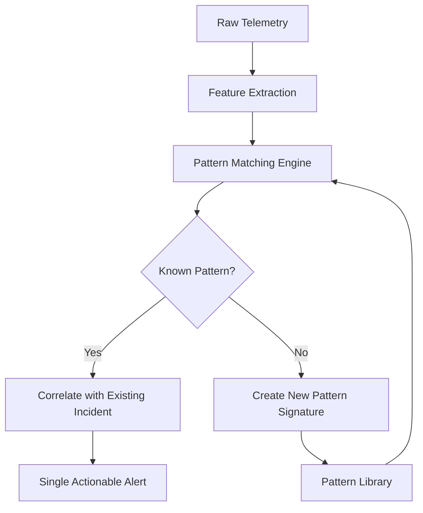
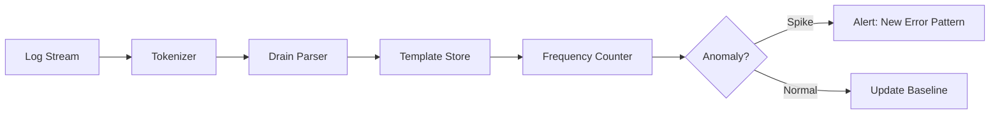
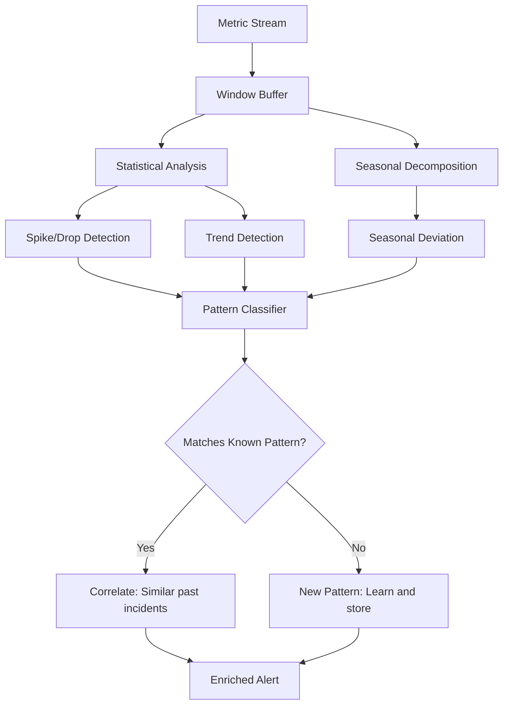
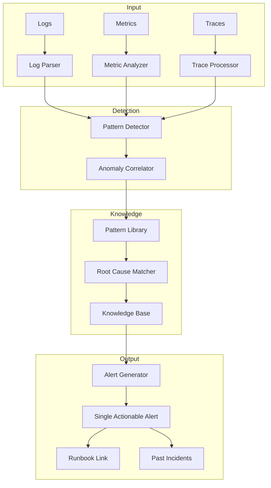

# How to Build Pattern Detection for Incident Management

Author: [nawazdhandala](https://github.com/nawazdhandala)

Tags: Incident Detection, Patterns, Machine Learning, Observability

Description: Build automated pattern detection systems that identify recurring issues in logs, metrics, and traces before they become incidents.

---

Your monitoring system fires 200 alerts a week. Half are noise. A quarter are duplicates of the same underlying problem. The remaining quarter actually matter, but by then your team is too fatigued to respond quickly. Sound familiar?

Pattern detection changes this equation. Instead of treating every alert as a unique event, you recognize repeating signatures and act on root causes. This post covers how to build pattern detection systems for logs, metrics, and anomalies in production environments.

## What Is Pattern Detection?

Pattern detection identifies recurring structures in observability data. These structures might be:

- **Log patterns**: Similar error messages that share a template
- **Metric patterns**: Repeating shapes in time-series data (spikes, dips, seasonal cycles)
- **Anomaly patterns**: Deviations that cluster around specific conditions

The goal is grouping related signals so you respond to one incident, not fifty alerts.



## Log Pattern Detection

Logs are verbose by nature. A single deployment can generate thousands of lines that say essentially the same thing. Pattern detection collapses these into templates.

### The Drain Algorithm

Drain is a streaming log parser that extracts templates in real time. It works by building a prefix tree where each node represents a log token. Variable tokens (timestamps, IDs, numbers) get replaced with wildcards.

```python
class DrainParser:
    def __init__(self, depth=4, similarity_threshold=0.5):
        self.depth = depth
        self.similarity_threshold = similarity_threshold
        self.root = {}
        self.clusters = []

    def parse(self, log_line: str) -> dict:
        tokens = self.tokenize(log_line)

        # Navigate prefix tree
        node = self.root
        for i, token in enumerate(tokens[:self.depth]):
            if token not in node:
                node[token] = {}
            node = node[token]

        # Find matching cluster or create new one
        cluster = self.find_cluster(node, tokens)
        if cluster is None:
            cluster = self.create_cluster(tokens)
            self.clusters.append(cluster)

        return {
            'template': cluster['template'],
            'cluster_id': cluster['id'],
            'params': self.extract_params(tokens, cluster['template'])
        }

    def tokenize(self, line: str) -> list:
        # Split and normalize
        tokens = line.split()
        return [self.normalize_token(t) for t in tokens]

    def normalize_token(self, token: str) -> str:
        # Replace obvious variables with wildcards
        if token.isdigit():
            return '<NUM>'
        if self.looks_like_id(token):
            return '<ID>'
        if self.looks_like_ip(token):
            return '<IP>'
        return token

    def find_cluster(self, node: dict, tokens: list):
        for cluster in node.get('_clusters', []):
            if self.similarity(tokens, cluster['tokens']) >= self.similarity_threshold:
                return cluster
        return None

    def similarity(self, tokens1: list, tokens2: list) -> float:
        if len(tokens1) != len(tokens2):
            return 0.0
        matches = sum(1 for a, b in zip(tokens1, tokens2) if a == b)
        return matches / len(tokens1)
```

### Pattern Detection Pipeline



### Practical Example: Grouping Database Errors

Raw logs:

```
Connection failed to postgres-primary-1: timeout after 5000ms
Connection failed to postgres-primary-2: timeout after 5000ms
Connection failed to postgres-replica-1: timeout after 3000ms
Connection failed to postgres-primary-1: timeout after 5000ms
```

After pattern detection:

```
Template: "Connection failed to <HOST>: timeout after <NUM>ms"
Count: 4
Affected hosts: [postgres-primary-1, postgres-primary-2, postgres-replica-1]
```

One incident. One root cause (network or database issue). One response.

## Metric Pattern Detection

Metrics present a different challenge. You need to recognize shapes in time-series data: spikes, drops, gradual degradation, seasonal patterns.

### Sliding Window Analysis

The simplest approach uses statistical measures over sliding windows.

```python
import numpy as np
from collections import deque
from dataclasses import dataclass
from typing import Optional

@dataclass
class PatternMatch:
    pattern_type: str
    confidence: float
    start_time: float
    metadata: dict

class MetricPatternDetector:
    def __init__(self, window_size=60, baseline_size=1440):
        self.window_size = window_size  # 60 samples (e.g., 1 hour at 1min intervals)
        self.baseline_size = baseline_size  # 1440 samples (24 hours)
        self.buffer = deque(maxlen=baseline_size)
        self.patterns = []

    def ingest(self, value: float, timestamp: float) -> Optional[PatternMatch]:
        self.buffer.append((timestamp, value))

        if len(self.buffer) < self.window_size:
            return None

        window = [v for _, v in list(self.buffer)[-self.window_size:]]
        baseline = [v for _, v in list(self.buffer)[:-self.window_size]]

        # Check for known patterns
        pattern = self.detect_pattern(window, baseline, timestamp)
        if pattern:
            self.patterns.append(pattern)

        return pattern

    def detect_pattern(self, window: list, baseline: list, ts: float) -> Optional[PatternMatch]:
        if not baseline:
            return None

        window_mean = np.mean(window)
        window_std = np.std(window)
        baseline_mean = np.mean(baseline)
        baseline_std = np.std(baseline) or 1.0

        z_score = (window_mean - baseline_mean) / baseline_std

        # Spike detection
        if z_score > 3:
            return PatternMatch(
                pattern_type='spike',
                confidence=min(z_score / 5, 1.0),
                start_time=ts,
                metadata={'z_score': z_score, 'window_mean': window_mean}
            )

        # Drop detection
        if z_score < -3:
            return PatternMatch(
                pattern_type='drop',
                confidence=min(abs(z_score) / 5, 1.0),
                start_time=ts,
                metadata={'z_score': z_score, 'window_mean': window_mean}
            )

        # Trend detection (gradual change)
        if len(window) >= 10:
            trend = self.calculate_trend(window)
            if abs(trend) > 0.1:  # 10% change per window
                return PatternMatch(
                    pattern_type='trend_up' if trend > 0 else 'trend_down',
                    confidence=min(abs(trend), 1.0),
                    start_time=ts,
                    metadata={'trend_slope': trend}
                )

        return None

    def calculate_trend(self, values: list) -> float:
        x = np.arange(len(values))
        slope, _ = np.polyfit(x, values, 1)
        return slope / (np.mean(values) or 1)
```

### Seasonal Pattern Recognition

Production systems often have predictable patterns: traffic spikes during business hours, batch jobs at midnight, weekly deployments on Tuesdays.

```python
class SeasonalDetector:
    def __init__(self, period_hours=24):
        self.period = period_hours * 60  # Convert to minutes
        self.history = {}  # bucket -> list of values

    def get_bucket(self, timestamp: float) -> int:
        # Map timestamp to period bucket (e.g., minute of day)
        return int(timestamp / 60) % self.period

    def ingest(self, value: float, timestamp: float):
        bucket = self.get_bucket(timestamp)
        if bucket not in self.history:
            self.history[bucket] = []
        self.history[bucket].append(value)

    def is_seasonal_anomaly(self, value: float, timestamp: float) -> tuple:
        bucket = self.get_bucket(timestamp)
        historical = self.history.get(bucket, [])

        if len(historical) < 7:  # Need at least a week of data
            return False, 0.0

        mean = np.mean(historical)
        std = np.std(historical) or 1.0
        z_score = abs(value - mean) / std

        return z_score > 3, z_score
```

### Pattern Matching Workflow



## Anomaly Pattern Detection

Anomalies become meaningful when you can cluster them. A single CPU spike is noise. Fifty CPU spikes correlated with memory pressure and slow queries is a pattern worth investigating.

### Multi-Signal Correlation

```python
from dataclasses import dataclass
from typing import List
import hashlib

@dataclass
class Anomaly:
    metric: str
    timestamp: float
    value: float
    severity: float

@dataclass
class AnomalyCluster:
    signature: str
    anomalies: List[Anomaly]
    first_seen: float
    last_seen: float
    count: int

class AnomalyCorrelator:
    def __init__(self, time_window=300):  # 5 minute correlation window
        self.time_window = time_window
        self.active_anomalies = []
        self.clusters = {}

    def add_anomaly(self, anomaly: Anomaly) -> AnomalyCluster:
        # Clean old anomalies
        cutoff = anomaly.timestamp - self.time_window
        self.active_anomalies = [
            a for a in self.active_anomalies
            if a.timestamp > cutoff
        ]

        self.active_anomalies.append(anomaly)

        # Generate cluster signature from co-occurring anomalies
        signature = self.compute_signature(self.active_anomalies)

        if signature in self.clusters:
            cluster = self.clusters[signature]
            cluster.anomalies.append(anomaly)
            cluster.last_seen = anomaly.timestamp
            cluster.count += 1
        else:
            cluster = AnomalyCluster(
                signature=signature,
                anomalies=[anomaly],
                first_seen=anomaly.timestamp,
                last_seen=anomaly.timestamp,
                count=1
            )
            self.clusters[signature] = cluster

        return cluster

    def compute_signature(self, anomalies: List[Anomaly]) -> str:
        # Signature based on which metrics are anomalous together
        metrics = sorted(set(a.metric for a in anomalies))
        return hashlib.md5('|'.join(metrics).encode()).hexdigest()[:12]
```

### Building a Pattern Library

Over time, you accumulate known patterns. Each pattern links to:

- **Symptoms**: What metrics/logs look like
- **Root causes**: What caused this in the past
- **Remediation**: How it was fixed

```python
@dataclass
class PatternSignature:
    id: str
    name: str
    description: str
    symptoms: dict  # metric patterns, log templates, etc.
    known_causes: List[str]
    remediation_steps: List[str]
    occurrence_count: int
    last_occurrence: float

class PatternLibrary:
    def __init__(self):
        self.patterns = {}
        self.symptom_index = {}  # Fast lookup by symptom

    def register_pattern(self, pattern: PatternSignature):
        self.patterns[pattern.id] = pattern

        # Index by symptoms for fast matching
        for symptom_type, symptom_value in pattern.symptoms.items():
            key = f"{symptom_type}:{symptom_value}"
            if key not in self.symptom_index:
                self.symptom_index[key] = []
            self.symptom_index[key].append(pattern.id)

    def find_matching_patterns(self, observed_symptoms: dict) -> List[PatternSignature]:
        candidates = {}

        for symptom_type, symptom_value in observed_symptoms.items():
            key = f"{symptom_type}:{symptom_value}"
            for pattern_id in self.symptom_index.get(key, []):
                if pattern_id not in candidates:
                    candidates[pattern_id] = 0
                candidates[pattern_id] += 1

        # Rank by symptom match count
        ranked = sorted(
            candidates.items(),
            key=lambda x: x[1],
            reverse=True
        )

        return [self.patterns[pid] for pid, _ in ranked[:5]]
```

## End-to-End Pattern Detection System



## Implementing Pattern Detection with OpenTelemetry

Pattern detection works best when your telemetry is well-structured. Use OpenTelemetry semantic conventions to ensure consistent attribute names.

```yaml
# OpenTelemetry Collector config with pattern-aware processing
receivers:
  otlp:
    protocols:
      grpc:
      http:

processors:
  batch:
    send_batch_size: 512
    timeout: 5s

  # Group similar spans
  groupbytrace:
    wait_duration: 10s
    num_traces: 10000

  # Add pattern detection metadata
  attributes:
    actions:
      - key: pattern.detected
        value: "pending"
        action: insert

exporters:
  otlphttp:
    endpoint: "https://oneuptime.com/otlp"
    headers:
      "x-oneuptime-token": "${ONEUPTIME_TOKEN}"

service:
  pipelines:
    traces:
      receivers: [otlp]
      processors: [batch, groupbytrace, attributes]
      exporters: [otlphttp]
    logs:
      receivers: [otlp]
      processors: [batch]
      exporters: [otlphttp]
```

## Real-World Example: Detecting Database Connection Storms

Here is how pattern detection catches a common issue before it escalates.

**Symptoms detected:**

1. Log pattern: `Connection failed to <HOST>: timeout after <NUM>ms` (frequency: 50x baseline)
2. Metric pattern: `db.connection_pool.waiting` spike (z-score: 4.2)
3. Metric pattern: `http.server.duration` p99 increase (trend: +15%/min)

**Pattern library match:**

```
Pattern: "Database Connection Pool Exhaustion"
Confidence: 0.87
Past occurrences: 3
Typical cause: Connection leak after deployment OR sudden traffic spike
Remediation:
  1. Check recent deployments for connection handling changes
  2. Verify connection pool max size vs current connections
  3. Look for long-running transactions holding connections
```

**Single alert generated:**

```
[HIGH] Database Connection Pool Exhaustion Detected

Affected services: checkout-service, inventory-service
Pattern confidence: 87%
Similar incident: INC-2024-0892 (resolved in 12 min)

Correlated signals:
- 47 connection timeout errors in last 5 minutes
- Connection pool wait queue at 89% capacity
- API latency p99 increased 340ms

Suggested action: Review deployment from 14 minutes ago
```

## Best Practices

**Start simple.** Basic statistical detection (z-scores, moving averages) catches 80% of patterns. Add complexity only when needed.

**Tune aggressively.** False positives erode trust. Start with high thresholds and lower them as you validate accuracy.

**Build feedback loops.** When engineers mark an alert as noise, feed that back into pattern detection to improve future accuracy.

**Version your patterns.** Pattern libraries evolve. Track changes and their impact on detection accuracy.

**Correlate before alerting.** A single anomaly is often noise. Multiple correlated anomalies are usually signal.

## Conclusion

Pattern detection transforms observability from reactive firefighting to proactive incident management. Instead of drowning in alerts, you respond to patterns. Instead of investigating from scratch, you leverage knowledge from past incidents.

The key components:

- **Log pattern detection** collapses verbose errors into templates
- **Metric pattern detection** recognizes shapes and seasonal behavior
- **Anomaly correlation** groups related signals
- **Pattern library** connects symptoms to root causes

Start with one signal type (logs are usually easiest), prove value, then expand. Your on-call engineers will thank you.

---

**Related Reading:**

- [How to Reduce Noise in OpenTelemetry](https://oneuptime.com/blog/post/2025-08-25-how-to-reduce-noise-in-opentelemetry/view)
- [Logs, Metrics & Traces: Three Pillars of Observability](https://oneuptime.com/blog/post/2025-08-20-three-pillars-of-observability-logs-metrics-traces/view)
- [What is Toil and How to Eliminate It](https://oneuptime.com/blog/post/2025-10-01-what-is-toil-and-how-to-eliminate-it/view)
