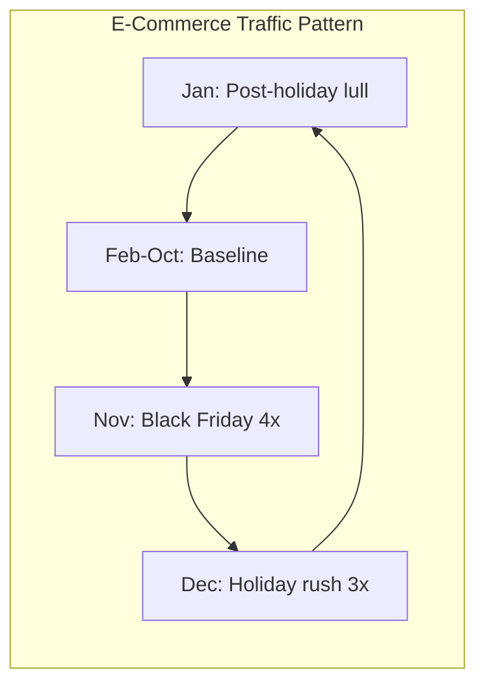
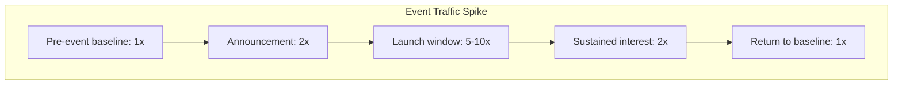
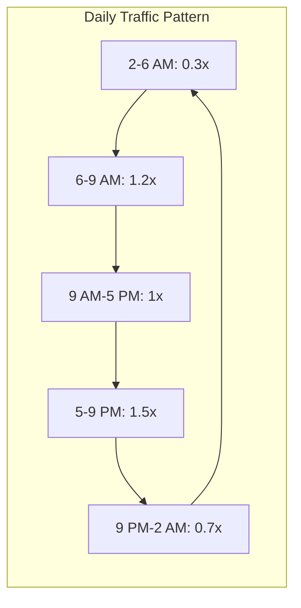
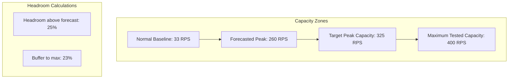
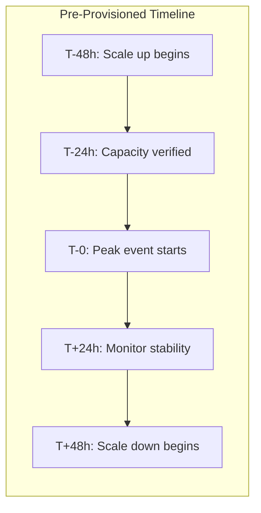
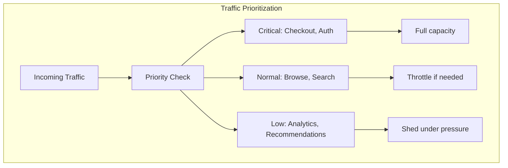
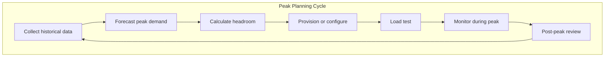

# How to Build Peak Capacity Planning

Author: [nawazdhandala](https://github.com/nawazdhandala)

Tags: Capacity Planning, Peak Load, Infrastructure, SRE

Description: A practical guide to forecasting peak traffic, calculating headroom, and scaling infrastructure before demand outpaces your systems.

---

Your infrastructure runs smoothly at 10,000 requests per second. Then Black Friday hits, a marketing campaign goes viral, or a product launch brings 50,000 requests per second. The question isn't whether peaks will happen. The question is whether you'll be ready.

Peak capacity planning is the discipline of anticipating demand spikes and ensuring your systems can handle them without degradation. Get it right and your users never notice the surge. Get it wrong and you're scrambling during an outage while revenue bleeds.

## Why Peak Planning Differs from Regular Capacity Planning

Regular capacity planning focuses on steady growth. You track metrics over weeks, forecast linear increases, and provision accordingly. Peak planning is different because spikes are:

- **Sudden**: Traffic can jump 5x in minutes
- **Temporary**: The surge lasts hours or days, not months
- **Predictable** (mostly): Seasonal patterns, scheduled events, and historical data reveal when peaks occur
- **Expensive if over-provisioned**: Keeping 5x capacity year-round wastes money

The goal is to provision enough for the peak without paying for idle capacity the rest of the year.

## Types of Traffic Peaks

Understanding your peak patterns is the first step. Most organizations face three categories:

### Seasonal Peaks

Predictable annual patterns tied to business cycles:



Examples include:
- Retail: Black Friday, Cyber Monday, holiday season
- Tax software: January through April
- Travel: Summer vacation booking, holiday travel
- Education: Back-to-school, enrollment periods

### Event-Driven Peaks

Spikes tied to specific moments:



Examples include:
- Product launches
- Marketing campaigns
- Flash sales
- Live events (concerts, sports)
- News or viral moments

### Time-Based Peaks

Daily or weekly patterns within normal operations:



## Gathering Historical Data

Before forecasting peaks, you need baseline metrics. Collect at least 12 months of data for seasonal patterns, or all available data for newer services.

### Key Metrics to Track

| Metric | What It Tells You | Collection Method |
|--------|------------------|-------------------|
| Requests per second (RPS) | Raw throughput demand | Load balancer logs, APM |
| CPU utilization | Compute headroom | Node metrics, Prometheus |
| Memory usage | Memory headroom | Node metrics, cAdvisor |
| Response latency (p50, p95, p99) | User experience under load | APM, OpenTelemetry traces |
| Error rate | Breaking point indicators | Application logs, APM |
| Database connections | Backend saturation | Database metrics |
| Queue depth | Async processing lag | Message broker metrics |

### Building a Baseline

Calculate your baseline by averaging metrics during normal periods, excluding known peak events:

```
Baseline RPS = (Total requests during normal period) / (Duration in seconds)

Example:
- 30 days of normal traffic
- 86.4 million requests total
- Baseline = 86,400,000 / (30 * 24 * 3600) = 33.3 RPS
```

### Peak Multiplier from Historical Data

Compare historical peaks to baseline:

```
Peak Multiplier = (Peak RPS) / (Baseline RPS)

Example from last Black Friday:
- Peak RPS: 166.5
- Baseline RPS: 33.3
- Peak Multiplier: 166.5 / 33.3 = 5x
```

## Forecasting Future Peaks

Historical data gives you a starting point. Adjust for growth and changing conditions.

### Growth-Adjusted Peak Formula

```
Forecasted Peak = (Historical Peak) * (1 + Growth Rate)^Years * (Event Factor)

Where:
- Growth Rate = YoY traffic growth (e.g., 0.25 for 25%)
- Years = Time since historical peak
- Event Factor = Adjustment for larger/smaller expected event
```

### Example Calculation

Planning for next Black Friday:

```
Historical Black Friday Peak: 166.5 RPS (last year)
YoY Growth Rate: 30%
Event Factor: 1.2 (bigger marketing push planned)

Forecasted Peak = 166.5 * 1.30 * 1.2 = 259.7 RPS
```

Round up and add safety margin:

```
Target Capacity = Forecasted Peak * 1.25 (25% headroom)
Target Capacity = 259.7 * 1.25 = 324.6 RPS
```

## Calculating Headroom

Headroom is the buffer between your peak capacity and your maximum tested capacity. Too little headroom and unexpected spikes cause outages. Too much and you waste money.

### The Headroom Formula



### Recommended Headroom by Criticality

| Service Tier | Minimum Headroom | Rationale |
|-------------|-----------------|-----------|
| Revenue-critical | 40-50% | Cannot afford any degradation |
| User-facing | 25-35% | Minor degradation acceptable briefly |
| Internal tools | 15-25% | Can queue or delay |
| Batch processing | 10-15% | Runs in off-peak windows anyway |

### Testing Your Headroom

Headroom is meaningless if you haven't validated it with load testing:

```bash
# Example k6 load test ramping to 150% of forecasted peak
k6 run --vus 100 --duration 30m \
  -e TARGET_RPS=390 \
  peak-test.js
```

Your load test should answer:
- At what RPS does latency degrade?
- At what RPS do errors start?
- What breaks first: CPU, memory, database, network?

## Infrastructure Strategies for Peak Handling

### Strategy 1: Pre-Provisioned Capacity

Spin up additional resources before the peak window.



Pros:
- Guaranteed capacity when needed
- No cold-start delays during peak

Cons:
- Costs money before peak arrives
- Requires accurate forecasting

### Strategy 2: Auto-Scaling with Pre-Warmed Pools

Configure aggressive auto-scaling with minimum instance pools:

```yaml
# HPA for peak-ready scaling
apiVersion: autoscaling/v2
kind: HorizontalPodAutoscaler
metadata:
  name: api-peak-ready
spec:
  scaleTargetRef:
    apiVersion: apps/v1
    kind: Deployment
    name: api
  minReplicas: 10           # Higher floor during peak window
  maxReplicas: 100          # Room to grow
  metrics:
    - type: Resource
      resource:
        name: cpu
        target:
          type: Utilization
          averageUtilization: 50  # Aggressive threshold
  behavior:
    scaleUp:
      stabilizationWindowSeconds: 0
      policies:
        - type: Percent
          value: 100
          periodSeconds: 15
```

### Strategy 3: Traffic Shaping and Shedding

When capacity is constrained, prioritize critical traffic:



Implement rate limiting tiers:

```python
# Priority-based rate limiting
RATE_LIMITS = {
    "checkout": {"rps": 1000, "priority": "critical"},
    "search": {"rps": 500, "priority": "normal"},
    "recommendations": {"rps": 100, "priority": "low"},
}

def should_process(endpoint, current_load):
    limit = RATE_LIMITS.get(endpoint, {"rps": 50, "priority": "low"})

    if current_load > 0.9:  # 90% capacity
        return limit["priority"] == "critical"
    elif current_load > 0.75:  # 75% capacity
        return limit["priority"] in ["critical", "normal"]
    return True
```

### Strategy 4: Caching and CDN Offload

Push traffic to the edge before it hits your infrastructure:

| Content Type | Cache Strategy | Peak Benefit |
|-------------|---------------|--------------|
| Static assets | CDN, long TTL | 60-80% traffic reduction |
| API responses | Edge cache, short TTL | 30-50% reduction |
| Database queries | Redis/Memcached | 10x faster responses |
| Session data | Distributed cache | Reduces auth load |

## Building a Peak Planning Calendar

Create a calendar of known peaks and preparation timelines:

| Event | Expected Date | Peak Multiplier | Prep Start | Scale Down |
|-------|--------------|-----------------|------------|------------|
| Black Friday | Nov 29 | 5x | Nov 15 | Dec 2 |
| Cyber Monday | Dec 2 | 4x | Nov 15 | Dec 5 |
| Holiday Rush | Dec 15-24 | 3x | Dec 10 | Dec 26 |
| New Year Sale | Jan 1 | 2.5x | Dec 28 | Jan 3 |
| Product Launch | Q2 TBD | 3x | T-14 days | T+7 days |

## Monitoring During Peak Events

### Pre-Peak Checklist

- [ ] Load tests completed at 150% forecasted peak
- [ ] Auto-scaling policies verified
- [ ] CDN cache warmed
- [ ] Database connection pools expanded
- [ ] On-call schedule staffed
- [ ] Runbooks updated
- [ ] Rollback procedures tested
- [ ] Status page ready

### Real-Time Dashboards

Track these metrics during peak events:

```
Primary Indicators:
- Current RPS vs. Capacity
- p99 Latency vs. SLO
- Error Rate vs. Threshold
- CPU/Memory Utilization

Secondary Indicators:
- Database connection count
- Queue depth
- Cache hit rate
- Auto-scaler activity
```

### Alert Thresholds

Set peak-specific alert thresholds:

| Metric | Normal Alert | Peak Alert | Rationale |
|--------|-------------|------------|-----------|
| CPU | 70% | 85% | Higher baseline expected |
| Error rate | 0.1% | 0.5% | Some errors acceptable |
| p99 latency | 500ms | 1000ms | Slight degradation OK |
| RPS | N/A | 90% of max | Approaching limit |

## Cost Optimization

Peak capacity is expensive. Optimize without sacrificing reliability:

### Right-Sizing Peak Resources

```
Annual Cost = (Baseline Cost * Normal Hours) + (Peak Cost * Peak Hours)

Example:
- Baseline: 10 instances * $100/mo = $1,000/mo
- Peak: 50 instances * $100/mo = $5,000/mo
- Normal hours: 8,400 per year (350 days)
- Peak hours: 360 per year (15 days)

Annual = ($1,000 * 350/365 * 12) + ($5,000 * 15/365 * 12)
Annual = $11,507 + $2,466 = $13,973

vs. always running peak capacity:
$5,000 * 12 = $60,000/year
Savings: 77%
```

### Spot/Preemptible Instances for Buffer Capacity

Use cheaper instances for the additional peak capacity:

```yaml
# Mixed instance policy for cost optimization
nodeGroups:
  - name: baseline
    instanceType: m5.xlarge
    minSize: 10
    maxSize: 10
    capacityType: on-demand

  - name: peak-buffer
    instanceType: m5.xlarge
    minSize: 0
    maxSize: 40
    capacityType: spot
    spotAllocationStrategy: capacity-optimized
```

## Common Mistakes to Avoid

### 1. Testing at Peak, Not Beyond Peak

If your forecasted peak is 300 RPS, test to 450 RPS. You need to know where the real breaking point is.

### 2. Ignoring Downstream Dependencies

Your API can handle 5x traffic, but can your database? Your payment provider? Your email service? Map every dependency and verify its peak capacity.

### 3. Assuming Linear Scaling

10 instances handle 100 RPS does not mean 100 instances handle 1000 RPS. Contention, coordination overhead, and shared resources create non-linear behavior.

### 4. Forgetting the Scale-Down Plan

Scaling up is exciting. Scaling down is where you save money. Automate the return to baseline capacity.

### 5. Single Points of Failure

Peak traffic exposes weaknesses. That singleton service, that shared database, that manual approval step. Find them before the peak does.

## Putting It All Together

Peak capacity planning is a cycle:



Each cycle improves your accuracy. Last year's peak becomes this year's baseline data. Failed tests become infrastructure improvements. Post-peak reviews become better forecasts.

The goal isn't to predict peaks perfectly. The goal is to build systems and processes that handle whatever peaks arrive, within a reasonable cost envelope.

## Tools That Help

OneUptime provides the observability foundation for peak planning:

- **Metrics collection**: Track RPS, latency, and resource utilization continuously
- **Historical analysis**: Query past peaks to build forecasts
- **Alerting**: Set peak-specific thresholds that notify before capacity runs out
- **Status pages**: Communicate with users during high-traffic events
- **Incident management**: Coordinate response if peaks exceed capacity

Combined with OpenTelemetry instrumentation and Kubernetes auto-scaling, you get a complete peak handling system.

## Final Thoughts

Peak capacity planning separates reactive firefighting from proactive engineering. You know the peaks are coming. Seasonal patterns repeat. Product launches are scheduled. Marketing campaigns have dates.

The only question is whether you'll be ready when traffic spikes. Collect the data, run the calculations, test the limits, and build the automation. When the peak arrives, you should be watching dashboards with confidence, not scrambling to add servers.

Start with your next known peak event. Work backward from the date. What needs to be true for your systems to handle 2x, 3x, 5x normal traffic? Answer that question, and you've built peak capacity planning.
