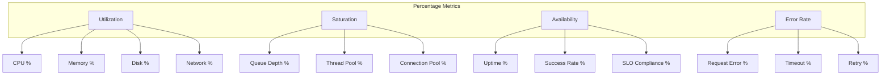
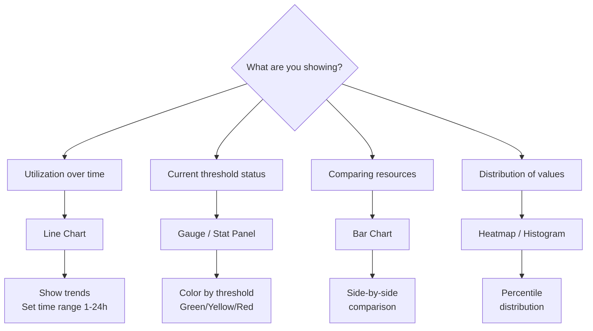
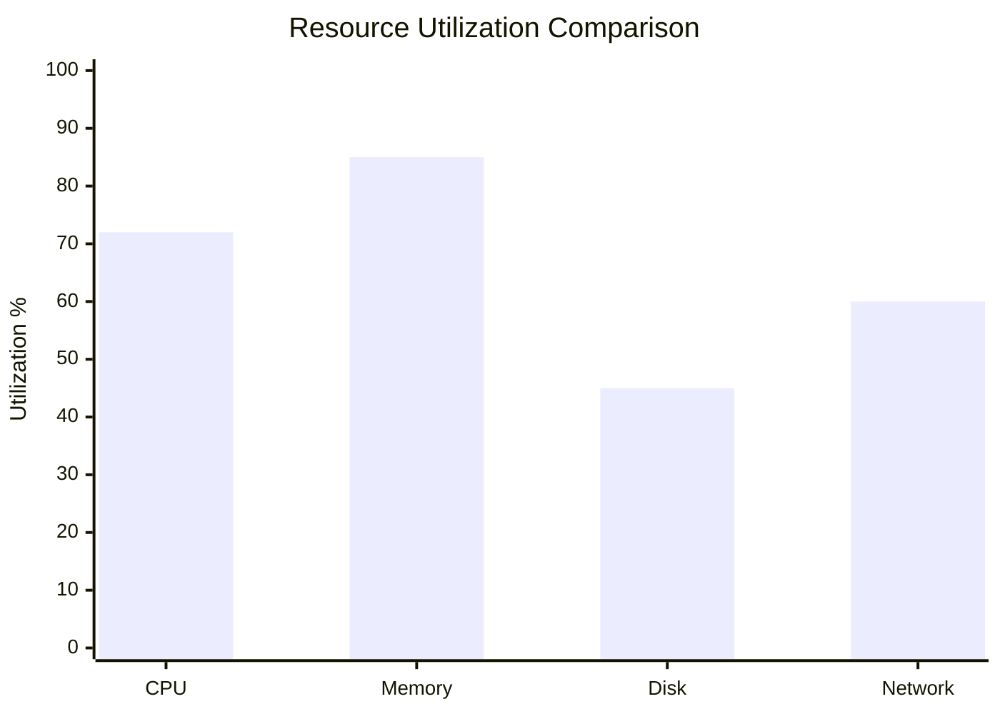

# How to Build Percentage Metrics

Author: [nawazdhandala](https://github.com/nawazdhandala)

Tags: Observability, Metrics, Monitoring, SRE

Description: Learn how to implement percentage-based metrics for CPU utilization, memory usage, and other capacity measurements.

---

Percentage metrics are the backbone of capacity planning and reliability engineering. They transform raw numbers into actionable insights: "Is my system healthy?" becomes "Am I at 85% CPU and about to fall over?" This guide covers how to build, instrument, and visualize percentage-based metrics for utilization, saturation, and availability.

## Why Percentages Matter in Monitoring

Raw metrics tell you what is happening. Percentages tell you how close you are to trouble.

| Raw Metric | Percentage Form | What It Reveals |
|------------|-----------------|-----------------|
| 7.2 GB memory used | 90% memory utilization | Near capacity, potential OOM risk |
| 3 failed requests | 0.1% error rate | Acceptable error budget consumption |
| 47 minutes downtime | 99.9% availability | SLO compliance status |
| 800 Mbps network throughput | 80% link saturation | Bandwidth bottleneck forming |

Percentages normalize across different scales. A server with 8 GB RAM and one with 128 GB RAM both become concerning at 95% utilization.

---

## Categories of Percentage Metrics



---

## Utilization Percentages

Utilization measures how much of a resource is currently in use relative to its total capacity.

### The Formula

```
Utilization % = (Used / Total) * 100
```

### CPU Utilization

CPU utilization is the percentage of time the processor spends doing work versus being idle.

```typescript
// cpu-metrics.ts
// Calculates CPU utilization percentage from system metrics

import * as os from 'os';

interface CpuUsage {
    user: number;    // Time spent in user mode
    nice: number;    // Time spent in user mode with low priority
    sys: number;     // Time spent in system mode
    idle: number;    // Time spent idle
    irq: number;     // Time spent handling interrupts
}

// Store previous measurement for delta calculation
let previousCpuUsage: CpuUsage | null = null;

/**
 * Get current CPU times aggregated across all cores
 * Returns total ticks for each CPU state
 */
function getCpuTimes(): CpuUsage {
    const cpus = os.cpus();
    const totals: CpuUsage = { user: 0, nice: 0, sys: 0, idle: 0, irq: 0 };

    // Sum times across all CPU cores
    for (const cpu of cpus) {
        totals.user += cpu.times.user;
        totals.nice += cpu.times.nice;
        totals.sys += cpu.times.sys;
        totals.idle += cpu.times.idle;
        totals.irq += cpu.times.irq;
    }

    return totals;
}

/**
 * Calculate CPU utilization as a percentage
 * Uses delta between two measurements to get accurate point-in-time usage
 */
export function calculateCpuUtilization(): number {
    const current = getCpuTimes();

    if (!previousCpuUsage) {
        previousCpuUsage = current;
        return 0; // First measurement, no delta available
    }

    // Calculate the delta (change) since last measurement
    const deltaUser = current.user - previousCpuUsage.user;
    const deltaNice = current.nice - previousCpuUsage.nice;
    const deltaSys = current.sys - previousCpuUsage.sys;
    const deltaIdle = current.idle - previousCpuUsage.idle;
    const deltaIrq = current.irq - previousCpuUsage.irq;

    // Total time elapsed across all states
    const totalDelta = deltaUser + deltaNice + deltaSys + deltaIdle + deltaIrq;

    // Active time is everything except idle
    const activeTime = deltaUser + deltaNice + deltaSys + deltaIrq;

    // Store for next calculation
    previousCpuUsage = current;

    // Utilization = active time / total time
    if (totalDelta === 0) return 0;
    return (activeTime / totalDelta) * 100;
}
```

### Memory Utilization

Memory utilization shows how much RAM is consumed relative to total available.

```typescript
// memory-metrics.ts
// Calculates memory utilization including buffer/cache considerations

import * as os from 'os';

interface MemoryStats {
    totalBytes: number;
    usedBytes: number;
    freeBytes: number;
    utilizationPercent: number;
    availablePercent: number;
}

/**
 * Calculate memory utilization percentage
 * Note: 'free' memory in Linux includes buffers/cache which can be reclaimed
 */
export function calculateMemoryUtilization(): MemoryStats {
    const totalBytes = os.totalmem();
    const freeBytes = os.freemem();
    const usedBytes = totalBytes - freeBytes;

    // Basic utilization: used / total
    const utilizationPercent = (usedBytes / totalBytes) * 100;

    // Available percent: how much can still be used
    const availablePercent = (freeBytes / totalBytes) * 100;

    return {
        totalBytes,
        usedBytes,
        freeBytes,
        utilizationPercent: Math.round(utilizationPercent * 100) / 100,
        availablePercent: Math.round(availablePercent * 100) / 100
    };
}

/**
 * Check if memory utilization exceeds threshold
 * Returns severity level for alerting
 */
export function checkMemoryThreshold(
    stats: MemoryStats
): 'ok' | 'warning' | 'critical' {
    if (stats.utilizationPercent >= 95) return 'critical';
    if (stats.utilizationPercent >= 85) return 'warning';
    return 'ok';
}
```

### Disk Utilization

```typescript
// disk-metrics.ts
// Calculate disk space utilization for monitoring storage capacity

import { exec } from 'child_process';
import { promisify } from 'util';

const execAsync = promisify(exec);

interface DiskStats {
    mountPoint: string;
    totalBytes: number;
    usedBytes: number;
    availableBytes: number;
    utilizationPercent: number;
}

/**
 * Parse df command output to get disk utilization
 * Works on Linux and macOS systems
 */
export async function getDiskUtilization(
    mountPoint: string = '/'
): Promise<DiskStats> {
    // Use df with 1K blocks for consistent output
    const { stdout } = await execAsync(`df -k ${mountPoint}`);

    const lines = stdout.trim().split('\n');
    // Skip header row, parse data row
    const parts = lines[1].split(/\s+/);

    // df output: Filesystem 1K-blocks Used Available Use% Mounted
    const totalKb = parseInt(parts[1], 10);
    const usedKb = parseInt(parts[2], 10);
    const availableKb = parseInt(parts[3], 10);

    const totalBytes = totalKb * 1024;
    const usedBytes = usedKb * 1024;
    const availableBytes = availableKb * 1024;

    // Calculate percentage (note: df's percentage accounts for reserved space)
    const utilizationPercent = (usedBytes / totalBytes) * 100;

    return {
        mountPoint,
        totalBytes,
        usedBytes,
        availableBytes,
        utilizationPercent: Math.round(utilizationPercent * 100) / 100
    };
}
```

---

## Saturation Percentages

Saturation measures how "full" a resource is, indicating queued or waiting work. High saturation means requests are waiting for resources.

```mermaid
flowchart LR
    subgraph Resource Pool
        R1[Worker 1]
        R2[Worker 2]
        R3[Worker 3]
        R4[Worker 4]
    end

    Q[Queue<br/>Depth: 12] --> Resource Pool
    Resource Pool --> Done[Completed]

    style Q fill:#f96,stroke:#333
```

When all workers are busy and the queue grows, saturation increases.

### Thread Pool Saturation

```typescript
// thread-pool-metrics.ts
// Monitor thread pool saturation to detect processing bottlenecks

interface ThreadPoolStats {
    activeThreads: number;
    maxThreads: number;
    queuedTasks: number;
    maxQueueSize: number;
    threadUtilization: number;  // % of threads in use
    queueSaturation: number;    // % of queue capacity used
    overallSaturation: number;  // Combined saturation metric
}

/**
 * Thread pool wrapper that tracks saturation metrics
 */
export class MonitoredThreadPool {
    private activeCount: number = 0;
    private queuedCount: number = 0;

    constructor(
        private maxThreads: number,
        private maxQueueSize: number
    ) {}

    /**
     * Calculate current saturation metrics
     */
    getStats(): ThreadPoolStats {
        // Thread utilization: how many threads are busy
        const threadUtilization = (this.activeCount / this.maxThreads) * 100;

        // Queue saturation: how full is the waiting queue
        const queueSaturation = (this.queuedCount / this.maxQueueSize) * 100;

        // Overall saturation combines both factors
        // When threads are full AND queue is filling, saturation is high
        const overallSaturation = Math.min(
            100,
            threadUtilization + (queueSaturation * 0.5)
        );

        return {
            activeThreads: this.activeCount,
            maxThreads: this.maxThreads,
            queuedTasks: this.queuedCount,
            maxQueueSize: this.maxQueueSize,
            threadUtilization: Math.round(threadUtilization * 100) / 100,
            queueSaturation: Math.round(queueSaturation * 100) / 100,
            overallSaturation: Math.round(overallSaturation * 100) / 100
        };
    }

    /**
     * Submit work to the pool
     * Returns false if queue is full (100% saturated)
     */
    submit(task: () => Promise<void>): boolean {
        if (this.activeCount < this.maxThreads) {
            // Thread available, execute immediately
            this.activeCount++;
            this.executeTask(task);
            return true;
        } else if (this.queuedCount < this.maxQueueSize) {
            // Queue the task
            this.queuedCount++;
            return true;
        }
        // Fully saturated, reject
        return false;
    }

    private async executeTask(task: () => Promise<void>): Promise<void> {
        try {
            await task();
        } finally {
            this.activeCount--;
            // Check for queued work
            if (this.queuedCount > 0) {
                this.queuedCount--;
                this.activeCount++;
            }
        }
    }
}
```

### Connection Pool Saturation

```typescript
// connection-pool-metrics.ts
// Track database connection pool saturation

interface ConnectionPoolStats {
    totalConnections: number;
    activeConnections: number;
    idleConnections: number;
    waitingRequests: number;
    utilizationPercent: number;
    saturationPercent: number;
}

/**
 * Connection pool monitor
 * Tracks how close the pool is to exhaustion
 */
export class ConnectionPoolMonitor {
    private active: number = 0;
    private waiting: number = 0;

    constructor(private poolSize: number) {}

    /**
     * Calculate pool saturation
     * Saturation > 100% means requests are waiting
     */
    getStats(): ConnectionPoolStats {
        const idle = this.poolSize - this.active;

        // Utilization: connections in use / total
        const utilizationPercent = (this.active / this.poolSize) * 100;

        // Saturation: includes waiting requests
        // Can exceed 100% when demand exceeds capacity
        const totalDemand = this.active + this.waiting;
        const saturationPercent = (totalDemand / this.poolSize) * 100;

        return {
            totalConnections: this.poolSize,
            activeConnections: this.active,
            idleConnections: idle,
            waitingRequests: this.waiting,
            utilizationPercent: Math.round(utilizationPercent * 100) / 100,
            saturationPercent: Math.round(saturationPercent * 100) / 100
        };
    }

    /**
     * Acquire a connection from the pool
     */
    acquire(): boolean {
        if (this.active < this.poolSize) {
            this.active++;
            return true;
        }
        this.waiting++;
        return false;
    }

    /**
     * Release a connection back to the pool
     */
    release(): void {
        if (this.waiting > 0) {
            this.waiting--;
            // Connection goes to waiter, stays active
        } else {
            this.active--;
        }
    }
}
```

---

## Availability Percentages

Availability measures the proportion of time a service is operational and accessible.

### The Nines Table

| Availability | Downtime per Year | Downtime per Month |
|--------------|-------------------|---------------------|
| 99% | 3.65 days | 7.2 hours |
| 99.9% | 8.76 hours | 43.8 minutes |
| 99.95% | 4.38 hours | 21.9 minutes |
| 99.99% | 52.6 minutes | 4.38 minutes |
| 99.999% | 5.26 minutes | 26.3 seconds |

### Calculating Availability

```typescript
// availability-metrics.ts
// Track service availability as a percentage

interface AvailabilityWindow {
    startTime: Date;
    endTime: Date;
    totalSeconds: number;
    uptimeSeconds: number;
    downtimeSeconds: number;
    availabilityPercent: number;
}

interface HealthCheck {
    timestamp: Date;
    isHealthy: boolean;
    responseTimeMs: number;
}

/**
 * Availability calculator using health check data
 */
export class AvailabilityTracker {
    private checks: HealthCheck[] = [];

    /**
     * Record a health check result
     */
    recordCheck(isHealthy: boolean, responseTimeMs: number): void {
        this.checks.push({
            timestamp: new Date(),
            isHealthy,
            responseTimeMs
        });

        // Keep last 24 hours of data
        const cutoff = new Date(Date.now() - 24 * 60 * 60 * 1000);
        this.checks = this.checks.filter(c => c.timestamp > cutoff);
    }

    /**
     * Calculate availability for a time window
     * Uses point-in-time checks to estimate uptime
     */
    calculateAvailability(windowMinutes: number): AvailabilityWindow {
        const now = new Date();
        const windowStart = new Date(now.getTime() - windowMinutes * 60 * 1000);

        // Filter checks within window
        const windowChecks = this.checks.filter(
            c => c.timestamp >= windowStart && c.timestamp <= now
        );

        if (windowChecks.length === 0) {
            return {
                startTime: windowStart,
                endTime: now,
                totalSeconds: windowMinutes * 60,
                uptimeSeconds: 0,
                downtimeSeconds: 0,
                availabilityPercent: 0  // No data
            };
        }

        // Count healthy vs unhealthy checks
        const healthyChecks = windowChecks.filter(c => c.isHealthy).length;
        const totalChecks = windowChecks.length;

        // Availability = healthy checks / total checks
        const availabilityPercent = (healthyChecks / totalChecks) * 100;

        const totalSeconds = windowMinutes * 60;
        const uptimeSeconds = (availabilityPercent / 100) * totalSeconds;
        const downtimeSeconds = totalSeconds - uptimeSeconds;

        return {
            startTime: windowStart,
            endTime: now,
            totalSeconds,
            uptimeSeconds: Math.round(uptimeSeconds),
            downtimeSeconds: Math.round(downtimeSeconds),
            availabilityPercent: Math.round(availabilityPercent * 1000) / 1000
        };
    }
}

/**
 * Calculate availability from incident data
 * More accurate than health checks for SLO reporting
 */
export function calculateAvailabilityFromIncidents(
    incidents: Array<{ startTime: Date; endTime: Date }>,
    windowStart: Date,
    windowEnd: Date
): number {
    const totalMs = windowEnd.getTime() - windowStart.getTime();
    let downtimeMs = 0;

    for (const incident of incidents) {
        // Clamp incident to window boundaries
        const incidentStart = Math.max(
            incident.startTime.getTime(),
            windowStart.getTime()
        );
        const incidentEnd = Math.min(
            incident.endTime.getTime(),
            windowEnd.getTime()
        );

        if (incidentEnd > incidentStart) {
            downtimeMs += incidentEnd - incidentStart;
        }
    }

    const uptimeMs = totalMs - downtimeMs;
    return (uptimeMs / totalMs) * 100;
}
```

### Success Rate (Request-Based Availability)

```typescript
// success-rate-metrics.ts
// Calculate request success rate as an availability metric

interface SuccessRateStats {
    totalRequests: number;
    successfulRequests: number;
    failedRequests: number;
    successRatePercent: number;
    errorRatePercent: number;
}

/**
 * Rolling window success rate calculator
 */
export class SuccessRateTracker {
    private windowMs: number;
    private requests: Array<{ timestamp: number; success: boolean }> = [];

    constructor(windowMinutes: number = 5) {
        this.windowMs = windowMinutes * 60 * 1000;
    }

    /**
     * Record a request outcome
     */
    record(success: boolean): void {
        const now = Date.now();
        this.requests.push({ timestamp: now, success });

        // Prune old entries
        const cutoff = now - this.windowMs;
        this.requests = this.requests.filter(r => r.timestamp > cutoff);
    }

    /**
     * Get current success rate
     */
    getStats(): SuccessRateStats {
        const now = Date.now();
        const cutoff = now - this.windowMs;
        const windowRequests = this.requests.filter(r => r.timestamp > cutoff);

        const total = windowRequests.length;
        const successful = windowRequests.filter(r => r.success).length;
        const failed = total - successful;

        const successRate = total > 0 ? (successful / total) * 100 : 100;
        const errorRate = total > 0 ? (failed / total) * 100 : 0;

        return {
            totalRequests: total,
            successfulRequests: successful,
            failedRequests: failed,
            successRatePercent: Math.round(successRate * 1000) / 1000,
            errorRatePercent: Math.round(errorRate * 1000) / 1000
        };
    }
}
```

---

## OpenTelemetry Integration

Export percentage metrics using OpenTelemetry for vendor-neutral observability.

```typescript
// otel-percentage-metrics.ts
// Export percentage metrics via OpenTelemetry

import {
    MeterProvider,
    PeriodicExportingMetricReader
} from '@opentelemetry/sdk-metrics';
import { OTLPMetricExporter } from '@opentelemetry/exporter-metrics-otlp-http';
import { Resource } from '@opentelemetry/resources';
import { SemanticResourceAttributes } from '@opentelemetry/semantic-conventions';

// Initialize meter provider with OTLP exporter
const meterProvider = new MeterProvider({
    resource: new Resource({
        [SemanticResourceAttributes.SERVICE_NAME]: 'my-service',
        [SemanticResourceAttributes.SERVICE_VERSION]: '1.0.0'
    }),
    readers: [
        new PeriodicExportingMetricReader({
            exporter: new OTLPMetricExporter({
                url: process.env.OTLP_ENDPOINT || 'http://localhost:4318/v1/metrics'
            }),
            exportIntervalMillis: 10000  // Export every 10 seconds
        })
    ]
});

const meter = meterProvider.getMeter('percentage-metrics');

// CPU utilization gauge (0-100)
const cpuUtilization = meter.createObservableGauge('system.cpu.utilization', {
    description: 'CPU utilization as a percentage',
    unit: '%'
});

// Memory utilization gauge (0-100)
const memoryUtilization = meter.createObservableGauge('system.memory.utilization', {
    description: 'Memory utilization as a percentage',
    unit: '%'
});

// Connection pool saturation gauge (can exceed 100)
const poolSaturation = meter.createObservableGauge('db.pool.saturation', {
    description: 'Database connection pool saturation percentage',
    unit: '%'
});

// Request success rate gauge (0-100)
const successRate = meter.createObservableGauge('http.request.success_rate', {
    description: 'HTTP request success rate percentage',
    unit: '%'
});

// Error rate counter for calculating percentages
const requestCounter = meter.createCounter('http.request.count', {
    description: 'Total HTTP request count'
});

const errorCounter = meter.createCounter('http.request.error.count', {
    description: 'Failed HTTP request count'
});

/**
 * Register callbacks to collect metrics
 */
export function registerMetricCallbacks(
    getCpuUtil: () => number,
    getMemoryUtil: () => number,
    getPoolSaturation: () => number,
    getSuccessRate: () => number
): void {
    cpuUtilization.addCallback(result => {
        result.observe(getCpuUtil(), {
            'host.name': process.env.HOSTNAME || 'unknown'
        });
    });

    memoryUtilization.addCallback(result => {
        result.observe(getMemoryUtil(), {
            'host.name': process.env.HOSTNAME || 'unknown'
        });
    });

    poolSaturation.addCallback(result => {
        result.observe(getPoolSaturation(), {
            'db.system': 'postgresql'
        });
    });

    successRate.addCallback(result => {
        result.observe(getSuccessRate(), {
            'http.route': '/api/*'
        });
    });
}

/**
 * Record a request for success rate calculation
 */
export function recordRequest(success: boolean, route: string): void {
    requestCounter.add(1, { 'http.route': route });
    if (!success) {
        errorCounter.add(1, { 'http.route': route });
    }
}
```

---

## Dashboard Visualization Best Practices

### Choosing the Right Visualization



### Threshold Coloring

Use consistent color schemes across all percentage metrics:

| Range | Color | Meaning |
|-------|-------|---------|
| 0-70% | Green | Healthy headroom |
| 70-85% | Yellow | Warning, plan capacity |
| 85-95% | Orange | Critical, act soon |
| 95-100% | Red | Emergency, immediate action |

### Grafana Dashboard JSON Example

```json
{
  "panels": [
    {
      "title": "CPU Utilization",
      "type": "gauge",
      "datasource": "Prometheus",
      "targets": [
        {
          "expr": "avg(system_cpu_utilization) * 100",
          "legendFormat": "CPU %"
        }
      ],
      "fieldConfig": {
        "defaults": {
          "min": 0,
          "max": 100,
          "unit": "percent",
          "thresholds": {
            "mode": "absolute",
            "steps": [
              { "value": 0, "color": "green" },
              { "value": 70, "color": "yellow" },
              { "value": 85, "color": "orange" },
              { "value": 95, "color": "red" }
            ]
          }
        }
      }
    },
    {
      "title": "Memory Utilization Trend",
      "type": "timeseries",
      "datasource": "Prometheus",
      "targets": [
        {
          "expr": "system_memory_utilization * 100",
          "legendFormat": "Memory %"
        }
      ],
      "fieldConfig": {
        "defaults": {
          "min": 0,
          "max": 100,
          "unit": "percent",
          "custom": {
            "lineWidth": 2,
            "fillOpacity": 20
          },
          "thresholds": {
            "mode": "absolute",
            "steps": [
              { "value": 0, "color": "green" },
              { "value": 85, "color": "red" }
            ]
          }
        }
      }
    },
    {
      "title": "Success Rate by Endpoint",
      "type": "stat",
      "datasource": "Prometheus",
      "targets": [
        {
          "expr": "sum(rate(http_request_count{status=~\"2..\"}[5m])) / sum(rate(http_request_count[5m])) * 100",
          "legendFormat": "Success Rate"
        }
      ],
      "fieldConfig": {
        "defaults": {
          "unit": "percent",
          "decimals": 2,
          "thresholds": {
            "mode": "absolute",
            "steps": [
              { "value": 0, "color": "red" },
              { "value": 95, "color": "yellow" },
              { "value": 99, "color": "green" }
            ]
          }
        }
      }
    }
  ]
}
```

### Multi-Resource Comparison Panel

Display multiple resources side by side to spot imbalances:



### Alerting on Percentage Thresholds

```yaml
# prometheus-alerts.yaml
# Alert rules for percentage-based metrics

groups:
  - name: utilization-alerts
    rules:
      # CPU utilization warning
      - alert: HighCpuUtilization
        expr: avg(system_cpu_utilization) > 0.85
        for: 5m
        labels:
          severity: warning
        annotations:
          summary: "CPU utilization above 85%"
          description: "CPU at {{ $value | humanizePercentage }} for 5 minutes"

      # CPU utilization critical
      - alert: CriticalCpuUtilization
        expr: avg(system_cpu_utilization) > 0.95
        for: 2m
        labels:
          severity: critical
        annotations:
          summary: "CPU utilization above 95%"

      # Memory utilization
      - alert: HighMemoryUtilization
        expr: system_memory_utilization > 0.90
        for: 5m
        labels:
          severity: warning
        annotations:
          summary: "Memory utilization above 90%"

      # Disk space
      - alert: DiskSpaceLow
        expr: disk_utilization_percent > 85
        for: 10m
        labels:
          severity: warning
        annotations:
          summary: "Disk space below 15% free"

      # Connection pool saturation
      - alert: ConnectionPoolSaturated
        expr: db_pool_saturation > 90
        for: 2m
        labels:
          severity: critical
        annotations:
          summary: "Database connection pool at {{ $value }}% saturation"

  - name: availability-alerts
    rules:
      # Success rate drop
      - alert: LowSuccessRate
        expr: http_request_success_rate < 99
        for: 5m
        labels:
          severity: warning
        annotations:
          summary: "Request success rate below 99%"

      # Severe error rate
      - alert: HighErrorRate
        expr: http_request_success_rate < 95
        for: 2m
        labels:
          severity: critical
        annotations:
          summary: "Request success rate below 95%"
```

---

## Common Pitfalls and Solutions

### Pitfall 1: Averaging Percentages Incorrectly

Wrong approach:

```typescript
// WRONG: Averaging percentages from different-sized pools
const pool1Util = 90;  // 9 of 10 connections
const pool2Util = 50;  // 50 of 100 connections
const avgUtil = (pool1Util + pool2Util) / 2;  // 70% - misleading!
```

Correct approach:

```typescript
// RIGHT: Weight by capacity
const pool1Used = 9, pool1Total = 10;
const pool2Used = 50, pool2Total = 100;
const totalUsed = pool1Used + pool2Used;      // 59
const totalCapacity = pool1Total + pool2Total; // 110
const actualUtil = (totalUsed / totalCapacity) * 100;  // 53.6%
```

### Pitfall 2: Not Accounting for Reserved Space

Disk utilization can be misleading on Linux systems:

```typescript
// Account for reserved blocks (typically 5% reserved for root)
export async function getActualDiskUtilization(
    mountPoint: string
): Promise<number> {
    const { stdout } = await execAsync(`df -k ${mountPoint}`);
    const parts = stdout.trim().split('\n')[1].split(/\s+/);

    const totalKb = parseInt(parts[1], 10);
    const usedKb = parseInt(parts[2], 10);
    const availableKb = parseInt(parts[3], 10);

    // Available includes reserved space that users cannot use
    // Real utilization for capacity planning:
    const usableTotal = usedKb + availableKb;
    const utilization = (usedKb / usableTotal) * 100;

    return Math.round(utilization * 100) / 100;
}
```

### Pitfall 3: Ignoring Burst Capacity

Instantaneous snapshots miss spikes:

```typescript
// Track peak utilization, not just current
export class PeakTracker {
    private samples: number[] = [];
    private windowMs: number;

    constructor(windowMinutes: number = 5) {
        this.windowMs = windowMinutes * 60 * 1000;
    }

    record(value: number): void {
        const now = Date.now();
        this.samples.push(value);

        // Keep window size manageable
        if (this.samples.length > 300) {
            this.samples = this.samples.slice(-300);
        }
    }

    getCurrent(): number {
        return this.samples[this.samples.length - 1] || 0;
    }

    getPeak(): number {
        return Math.max(...this.samples, 0);
    }

    getAverage(): number {
        if (this.samples.length === 0) return 0;
        const sum = this.samples.reduce((a, b) => a + b, 0);
        return sum / this.samples.length;
    }

    getPercentile(p: number): number {
        if (this.samples.length === 0) return 0;
        const sorted = [...this.samples].sort((a, b) => a - b);
        const index = Math.ceil((p / 100) * sorted.length) - 1;
        return sorted[Math.max(0, index)];
    }
}
```

---

## Summary

| Metric Type | Formula | Use Case | Alert Threshold |
|-------------|---------|----------|-----------------|
| Utilization | Used / Total | Capacity planning | 85% warning, 95% critical |
| Saturation | Demand / Capacity | Bottleneck detection | >100% means queuing |
| Availability | Uptime / Total Time | SLO tracking | Based on SLO target |
| Success Rate | Good / Total Requests | Error detection | 99% warning, 95% critical |
| Error Rate | Bad / Total Requests | Incident detection | 1% warning, 5% critical |

Percentage metrics transform raw data into decisions. Build them correctly, visualize them clearly, and alert on them wisely. Your future self debugging a 3 AM incident will thank you.

---

**Related Reading:**

- [18 SRE Metrics Worth Tracking](https://oneuptime.com/blog/post/2025-11-28-sre-metrics-to-track/view)
- [Logs, Metrics, and Traces: The Three Pillars of Observability](https://oneuptime.com/blog/post/2025-08-20-three-pillars-of-observability-logs-metrics-traces/view)
- [What Are Metrics in OpenTelemetry](https://oneuptime.com/blog/post/2025-08-26-what-are-metrics-in-opentelemetry/view)
