# How to Implement Percentage Rollout Flags

Author: [nawazdhandala](https://github.com/nawazdhandala)

Tags: Feature Flags, DevOps, Deployment, SRE

Description: Learn how to implement percentage-based feature rollouts for gradual feature releases.

---

## Introduction

Percentage rollout flags are a powerful technique for gradually releasing features to a subset of users. Instead of deploying a feature to everyone at once (big bang release), you can incrementally increase exposure from 1% to 5%, 10%, 50%, and eventually 100% of your user base. This approach reduces risk, enables quick rollbacks, and provides valuable feedback before full deployment.

In this post, we will explore how to implement percentage-based feature rollouts, covering the theory behind consistent hashing for sticky rollouts and practical examples using popular feature flag platforms like LaunchDarkly and Unleash.

## Why Use Percentage Rollouts?

Percentage rollouts offer several key benefits:

1. **Risk Mitigation**: If a bug slips through, only a small percentage of users are affected
2. **Performance Testing**: Validate system performance under gradually increasing load
3. **User Feedback**: Gather feedback from early adopters before full release
4. **Quick Rollback**: Instantly reduce percentage to 0% if issues arise
5. **A/B Testing Foundation**: Same infrastructure can support experimentation

## Architecture Overview

Here is a high-level view of how percentage rollouts work in a typical system:


## The Core Algorithm: Consistent Hashing

The most critical aspect of percentage rollouts is ensuring **sticky rollouts**. A user who sees the new feature should continue seeing it on subsequent requests. This consistency is achieved through consistent hashing.

### How Consistent Hashing Works


The key insight is that the same user ID always produces the same hash value, ensuring consistent behavior across requests.

### Implementation in Python

Here is a basic implementation using Python:

```python
import hashlib

def is_feature_enabled(user_id: str, feature_key: str, rollout_percentage: int) -> bool:
    """
    Determine if a feature is enabled for a specific user.

    Args:
        user_id: Unique identifier for the user
        feature_key: Unique identifier for the feature flag
        rollout_percentage: Percentage of users who should see the feature (0-100)

    Returns:
        True if the feature should be enabled for this user
    """
    # Combine user_id and feature_key to create a unique hash input
    # This ensures different features have different rollout distributions
    hash_input = f"{feature_key}:{user_id}"

    # Create a deterministic hash using SHA256
    hash_bytes = hashlib.sha256(hash_input.encode('utf-8')).digest()

    # Convert first 4 bytes to an integer
    # Using only 4 bytes gives us a range of 0 to 4,294,967,295
    hash_int = int.from_bytes(hash_bytes[:4], byteorder='big')

    # Normalize to 0-99 range (representing percentages)
    bucket = hash_int % 100

    # User is in rollout if their bucket is less than the rollout percentage
    return bucket < rollout_percentage


# Example usage
user_id = "user_12345"
feature_key = "new_checkout_flow"

# Test with different rollout percentages
print(f"10% rollout: {is_feature_enabled(user_id, feature_key, 10)}")
print(f"50% rollout: {is_feature_enabled(user_id, feature_key, 50)}")
print(f"100% rollout: {is_feature_enabled(user_id, feature_key, 100)}")
```

### Implementation in JavaScript/TypeScript

```typescript
import { createHash } from 'crypto';

/**
 * Determines if a feature is enabled for a specific user based on percentage rollout.
 *
 * @param userId - Unique identifier for the user
 * @param featureKey - Unique identifier for the feature flag
 * @param rolloutPercentage - Percentage of users who should see the feature (0-100)
 * @returns boolean indicating if the feature is enabled
 */
function isFeatureEnabled(
    userId: string,
    featureKey: string,
    rolloutPercentage: number
): boolean {
    // Validate rollout percentage
    if (rolloutPercentage < 0 || rolloutPercentage > 100) {
        throw new Error('Rollout percentage must be between 0 and 100');
    }

    // Combine feature key and user ID for consistent hashing
    const hashInput = `${featureKey}:${userId}`;

    // Generate SHA256 hash
    const hash = createHash('sha256')
        .update(hashInput)
        .digest('hex');

    // Take first 8 hex characters (32 bits) and convert to integer
    const hashInt = parseInt(hash.substring(0, 8), 16);

    // Normalize to 0-99 range
    const bucket = hashInt % 100;

    // Return true if user falls within rollout percentage
    return bucket < rolloutPercentage;
}

// Example usage
const userId = 'user_12345';
const featureKey = 'new_checkout_flow';

console.log(`10% rollout: ${isFeatureEnabled(userId, featureKey, 10)}`);
console.log(`50% rollout: ${isFeatureEnabled(userId, featureKey, 50)}`);
console.log(`100% rollout: ${isFeatureEnabled(userId, featureKey, 100)}`);
```

### Implementation in Go

```go
package main

import (
    "crypto/sha256"
    "encoding/binary"
    "fmt"
)

// IsFeatureEnabled determines if a feature is enabled for a specific user
// based on percentage rollout using consistent hashing.
func IsFeatureEnabled(userID, featureKey string, rolloutPercentage int) bool {
    // Validate rollout percentage
    if rolloutPercentage < 0 || rolloutPercentage > 100 {
        panic("rollout percentage must be between 0 and 100")
    }

    // Combine feature key and user ID for consistent hashing
    hashInput := fmt.Sprintf("%s:%s", featureKey, userID)

    // Generate SHA256 hash
    hash := sha256.Sum256([]byte(hashInput))

    // Convert first 4 bytes to uint32
    hashInt := binary.BigEndian.Uint32(hash[:4])

    // Normalize to 0-99 range
    bucket := int(hashInt % 100)

    // Return true if user falls within rollout percentage
    return bucket < rolloutPercentage
}

func main() {
    userID := "user_12345"
    featureKey := "new_checkout_flow"

    fmt.Printf("10%% rollout: %v\n", IsFeatureEnabled(userID, featureKey, 10))
    fmt.Printf("50%% rollout: %v\n", IsFeatureEnabled(userID, featureKey, 50))
    fmt.Printf("100%% rollout: %v\n", IsFeatureEnabled(userID, featureKey, 100))
}
```

## Important Properties of Consistent Hashing for Rollouts

### 1. Monotonic Rollout Increase

When you increase the rollout percentage from 10% to 20%, users who were already in the 10% group should remain in the feature group. This property is naturally satisfied by our bucket approach:


### 2. Feature Independence

Different features should have independent rollout distributions. Including the feature key in the hash input ensures this:

```python
def demonstrate_feature_independence():
    """
    Shows that users get different buckets for different features.
    """
    user_id = "user_12345"

    # Same user, different features
    feature_a_enabled = is_feature_enabled(user_id, "feature_a", 50)
    feature_b_enabled = is_feature_enabled(user_id, "feature_b", 50)

    print(f"Feature A enabled: {feature_a_enabled}")
    print(f"Feature B enabled: {feature_b_enabled}")
    # These will likely have different results due to different hash inputs
```

## Using LaunchDarkly for Percentage Rollouts

LaunchDarkly is a popular feature flag management platform that provides robust percentage rollout capabilities out of the box.

### Setting Up LaunchDarkly

```python
import ldclient
from ldclient import Context
from ldclient.config import Config

# Initialize the LaunchDarkly client with your SDK key
ldclient.set_config(Config("your-sdk-key"))
client = ldclient.get()

def check_feature_with_launchdarkly(user_id: str, feature_key: str) -> bool:
    """
    Check if a feature is enabled using LaunchDarkly.

    Args:
        user_id: Unique identifier for the user
        feature_key: The feature flag key in LaunchDarkly

    Returns:
        True if the feature is enabled for this user
    """
    # Create a context for the user
    # LaunchDarkly uses contexts to identify users for targeting
    context = Context.builder(user_id).kind("user").build()

    # Evaluate the feature flag
    # LaunchDarkly handles all the percentage rollout logic internally
    return client.variation(feature_key, context, False)


# Example usage
user_id = "user_12345"
feature_key = "new-checkout-flow"

if check_feature_with_launchdarkly(user_id, feature_key):
    print("Showing new checkout flow")
else:
    print("Showing old checkout flow")
```

### LaunchDarkly JavaScript SDK

```typescript
import * as LaunchDarkly from 'launchdarkly-js-client-sdk';

// Initialize the client
const context: LaunchDarkly.LDContext = {
    kind: 'user',
    key: 'user_12345',
    name: 'John Doe',
    email: 'john@example.com'
};

const client = LaunchDarkly.initialize('your-client-side-id', context);

// Wait for the client to be ready
client.on('ready', () => {
    // Check if the feature is enabled
    const showNewFeature = client.variation('new-checkout-flow', false);

    if (showNewFeature) {
        console.log('Showing new checkout flow');
    } else {
        console.log('Showing old checkout flow');
    }
});

// Listen for flag changes in real-time
client.on('change:new-checkout-flow', (current, previous) => {
    console.log(`Feature flag changed from ${previous} to ${current}`);
});
```

### Configuring Percentage Rollout in LaunchDarkly Dashboard

In the LaunchDarkly dashboard, you can configure percentage rollouts through the targeting rules:

1. Navigate to your feature flag
2. Go to the "Default rule" section
3. Select "A percentage rollout"
4. Configure the percentage for each variation


## Using Unleash for Percentage Rollouts

Unleash is an open-source feature flag management system that provides flexible rollout strategies.

### Setting Up Unleash Client

```python
from UnleashClient import UnleashClient

# Initialize the Unleash client
client = UnleashClient(
    url="https://your-unleash-server.com/api",
    app_name="my-app",
    custom_headers={"Authorization": "your-api-token"}
)

# Start the client (this fetches feature flags in the background)
client.initialize_client()

def check_feature_with_unleash(user_id: str, feature_name: str) -> bool:
    """
    Check if a feature is enabled using Unleash.

    Args:
        user_id: Unique identifier for the user
        feature_name: The feature toggle name in Unleash

    Returns:
        True if the feature is enabled for this user
    """
    # Create context with user information
    # Unleash uses this context for percentage rollout calculations
    context = {
        "userId": user_id,
        "sessionId": "session_abc123",  # Optional: for anonymous users
        "remoteAddress": "192.168.1.1"  # Optional: for IP-based targeting
    }

    # Check if the feature is enabled
    return client.is_enabled(feature_name, context)


# Example usage
user_id = "user_12345"
feature_name = "new-checkout-flow"

if check_feature_with_unleash(user_id, feature_name):
    print("Showing new checkout flow")
else:
    print("Showing old checkout flow")
```

### Unleash JavaScript SDK

```typescript
import { UnleashClient } from 'unleash-proxy-client';

// Initialize the client for browser usage
const unleash = new UnleashClient({
    url: 'https://your-unleash-proxy.com/proxy',
    clientKey: 'your-proxy-client-key',
    appName: 'my-web-app'
});

// Set the user context
unleash.updateContext({
    userId: 'user_12345',
    sessionId: 'session_abc123',
    properties: {
        plan: 'premium',
        region: 'us-east'
    }
});

// Start the client
unleash.start();

// Check feature flag
unleash.on('ready', () => {
    if (unleash.isEnabled('new-checkout-flow')) {
        console.log('Showing new checkout flow');
    } else {
        console.log('Showing old checkout flow');
    }
});

// Listen for updates
unleash.on('update', () => {
    console.log('Feature flags updated');
});
```

### Configuring Gradual Rollout in Unleash

Unleash supports several built-in activation strategies for percentage rollouts:


The `flexibleRollout` strategy is the most versatile option:

```json
{
    "name": "flexibleRollout",
    "parameters": {
        "rollout": "25",
        "stickiness": "userId",
        "groupId": "new-checkout-flow"
    }
}
```

## Advanced Patterns

### Staged Rollout with Monitoring

Here is a pattern for implementing staged rollouts with automatic monitoring:

```python
import time
from dataclasses import dataclass
from typing import Callable, Optional
from enum import Enum

class RolloutStage(Enum):
    """Defines the stages of a gradual rollout."""
    CANARY = 1      # 1% of users
    EARLY = 5       # 5% of users
    BETA = 10       # 10% of users
    PARTIAL = 25    # 25% of users
    HALF = 50       # 50% of users
    MAJORITY = 75   # 75% of users
    FULL = 100      # 100% of users


@dataclass
class RolloutConfig:
    """Configuration for a staged rollout."""
    feature_key: str
    current_stage: RolloutStage
    error_threshold: float  # Maximum acceptable error rate
    min_sample_size: int    # Minimum requests before advancing


class StagedRolloutManager:
    """
    Manages staged rollouts with automatic advancement and rollback.
    """

    def __init__(
        self,
        config: RolloutConfig,
        metrics_provider: Callable[[str], dict],
        flag_updater: Callable[[str, int], None]
    ):
        """
        Initialize the staged rollout manager.

        Args:
            config: Rollout configuration
            metrics_provider: Function that returns metrics for a feature
            flag_updater: Function that updates the rollout percentage
        """
        self.config = config
        self.metrics_provider = metrics_provider
        self.flag_updater = flag_updater

    def get_next_stage(self) -> Optional[RolloutStage]:
        """Get the next rollout stage, or None if already at full rollout."""
        stages = list(RolloutStage)
        current_index = stages.index(self.config.current_stage)

        if current_index < len(stages) - 1:
            return stages[current_index + 1]
        return None

    def should_advance(self) -> bool:
        """
        Check if the rollout should advance to the next stage.

        Returns:
            True if metrics are healthy and sample size is sufficient
        """
        metrics = self.metrics_provider(self.config.feature_key)

        # Check if we have enough data
        if metrics.get('request_count', 0) < self.config.min_sample_size:
            return False

        # Check error rate
        error_rate = metrics.get('error_rate', 1.0)
        if error_rate > self.config.error_threshold:
            return False

        return True

    def should_rollback(self) -> bool:
        """
        Check if the rollout should be rolled back.

        Returns:
            True if error rate exceeds threshold significantly
        """
        metrics = self.metrics_provider(self.config.feature_key)
        error_rate = metrics.get('error_rate', 0)

        # Rollback if error rate is 2x the threshold
        return error_rate > (self.config.error_threshold * 2)

    def advance(self) -> bool:
        """
        Advance to the next rollout stage.

        Returns:
            True if advancement was successful
        """
        next_stage = self.get_next_stage()
        if next_stage is None:
            return False

        self.flag_updater(self.config.feature_key, next_stage.value)
        self.config.current_stage = next_stage
        return True

    def rollback(self) -> None:
        """Roll back to 0% (disable the feature)."""
        self.flag_updater(self.config.feature_key, 0)
        self.config.current_stage = RolloutStage.CANARY


# Example usage
def get_metrics(feature_key: str) -> dict:
    """Fetch metrics from your monitoring system."""
    # This would connect to your metrics/monitoring system
    return {
        'request_count': 10000,
        'error_rate': 0.001,  # 0.1% error rate
        'latency_p99': 150    # 150ms p99 latency
    }

def update_flag(feature_key: str, percentage: int) -> None:
    """Update the feature flag percentage."""
    # This would call your feature flag service API
    print(f"Updating {feature_key} to {percentage}%")

# Initialize the manager
config = RolloutConfig(
    feature_key="new-checkout-flow",
    current_stage=RolloutStage.CANARY,
    error_threshold=0.01,  # 1% error threshold
    min_sample_size=1000
)

manager = StagedRolloutManager(config, get_metrics, update_flag)

# Check and advance if ready
if manager.should_rollback():
    manager.rollback()
    print("Rolled back due to high error rate")
elif manager.should_advance():
    manager.advance()
    print(f"Advanced to {config.current_stage.name}")
```

### Ring-Based Deployment Pattern

Ring-based deployment is a pattern where you deploy to increasingly larger groups:


```python
from enum import IntEnum
from typing import Set

class Ring(IntEnum):
    """Deployment rings from most to least restricted."""
    INTERNAL = 0
    BETA = 1
    EARLY_ADOPTER = 2
    GENERAL_AVAILABILITY = 3


class RingBasedRollout:
    """
    Implements ring-based deployment pattern.
    """

    def __init__(self):
        # Pre-defined user groups for specific rings
        self.internal_users: Set[str] = set()
        self.beta_users: Set[str] = set()
        self.early_adopter_percentage = 5
        self.current_ring = Ring.INTERNAL

    def add_internal_user(self, user_id: str) -> None:
        """Add a user to the internal ring."""
        self.internal_users.add(user_id)

    def add_beta_user(self, user_id: str) -> None:
        """Add a user to the beta ring."""
        self.beta_users.add(user_id)

    def is_enabled(self, user_id: str, feature_key: str) -> bool:
        """
        Check if a feature is enabled for a user based on ring.

        Args:
            user_id: The user identifier
            feature_key: The feature flag key

        Returns:
            True if the feature is enabled for this user
        """
        # Ring 0: Internal users always get new features
        if user_id in self.internal_users:
            return True

        # Ring 1: Beta users get features if ring >= BETA
        if self.current_ring >= Ring.BETA and user_id in self.beta_users:
            return True

        # Ring 2: Early adopters (percentage-based)
        if self.current_ring >= Ring.EARLY_ADOPTER:
            if is_feature_enabled(user_id, feature_key, self.early_adopter_percentage):
                return True

        # Ring 3: General availability (100%)
        if self.current_ring >= Ring.GENERAL_AVAILABILITY:
            return True

        return False

    def advance_ring(self) -> bool:
        """Advance to the next ring if possible."""
        if self.current_ring < Ring.GENERAL_AVAILABILITY:
            self.current_ring = Ring(self.current_ring + 1)
            return True
        return False
```

## Best Practices

### 1. Always Use Consistent Hashing

Never use random number generators for percentage rollouts. Random values cause inconsistent user experiences:

```python
# BAD: Using random numbers
import random

def bad_rollout(rollout_percentage: int) -> bool:
    """This creates inconsistent user experience."""
    return random.randint(0, 99) < rollout_percentage

# GOOD: Using consistent hashing
def good_rollout(user_id: str, feature_key: str, rollout_percentage: int) -> bool:
    """This ensures consistent user experience."""
    return is_feature_enabled(user_id, feature_key, rollout_percentage)
```

### 2. Include Feature Key in Hash

Including the feature key ensures independent rollouts:

```python
# BAD: Hash only includes user ID
hash_input = user_id

# GOOD: Hash includes both feature key and user ID
hash_input = f"{feature_key}:{user_id}"
```

### 3. Monitor Your Rollouts

Always set up monitoring before rolling out:

```mermaid
flowchart TD
    A[Feature Rollout] --> B[Metrics Collection]
    B --> C[Error Rate]
    B --> D[Latency]
    B --> E[Conversion Rate]

    C --> F{Threshold Check}
    D --> F
    E --> F

    F -->|Healthy| G[Continue/Advance]
    F -->|Unhealthy| H[Rollback]
```



### 4. Start Small

Begin with a very small percentage and increase gradually:

| Stage | Percentage | Duration | Purpose |
|-------|------------|----------|---------|
| Canary | 1% | 1 hour | Catch critical bugs |
| Early | 5% | 4 hours | Validate stability |
| Beta | 10% | 1 day | Test under load |
| Partial | 25% | 2 days | Broader validation |
| Half | 50% | 3 days | Near-production testing |
| Full | 100% | Permanent | General availability |

### 5. Plan for Rollback

Always have a rollback plan ready:

```python
def emergency_rollback(feature_key: str, flag_service) -> None:
    """
    Emergency rollback procedure for a feature.

    Args:
        feature_key: The feature to roll back
        flag_service: The feature flag service client
    """
    # Step 1: Immediately disable the feature
    flag_service.update_percentage(feature_key, 0)

    # Step 2: Log the rollback
    print(f"EMERGENCY ROLLBACK: {feature_key} disabled at {time.time()}")

    # Step 3: Alert the team
    # send_alert(f"Feature {feature_key} has been rolled back")

    # Step 4: Preserve logs for investigation
    # preserve_logs(feature_key, time.time() - 3600, time.time())
```

## Conclusion

Percentage rollout flags are an essential tool for modern software delivery. By using consistent hashing, you ensure that users have a stable experience while you gradually roll out new features. Whether you build your own implementation or use platforms like LaunchDarkly and Unleash, the core principles remain the same:

1. Use deterministic hashing for consistent user assignment
2. Include the feature key in your hash for independent rollouts
3. Monitor your rollouts and be ready to roll back
4. Start small and increase gradually
5. Automate your rollout progression based on health metrics

With these techniques, you can confidently ship features to production, knowing that you have full control over exposure and can quickly respond to any issues that arise.

## Further Reading

- [Feature Flags Best Practices](https://launchdarkly.com/blog/feature-flag-best-practices/)
- [Unleash Documentation](https://docs.getunleash.io/)
- [Consistent Hashing Explained](https://www.toptal.com/big-data/consistent-hashing)
- [Progressive Delivery with Feature Flags](https://www.split.io/blog/progressive-delivery-feature-flags/)
