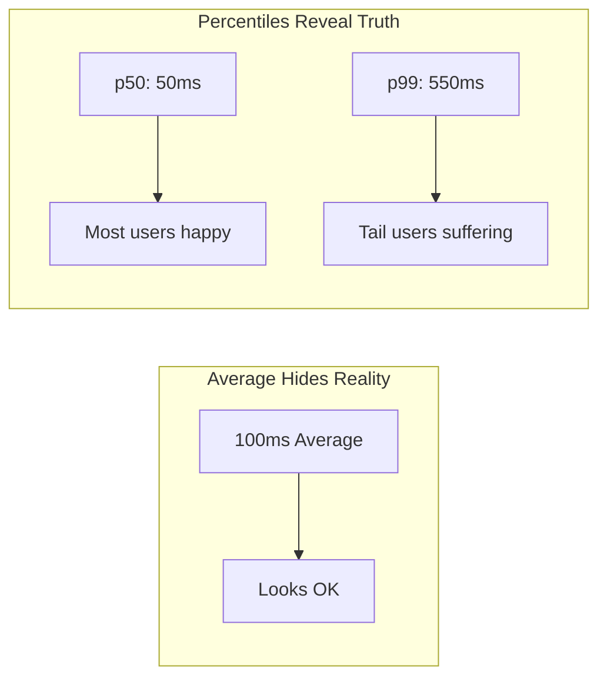
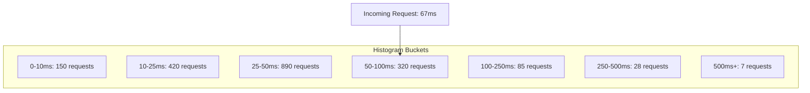
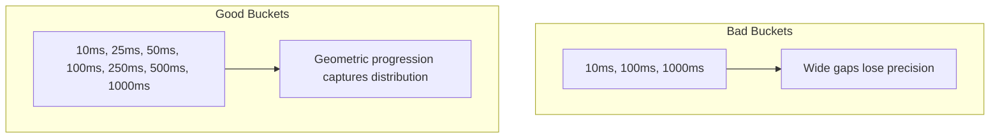
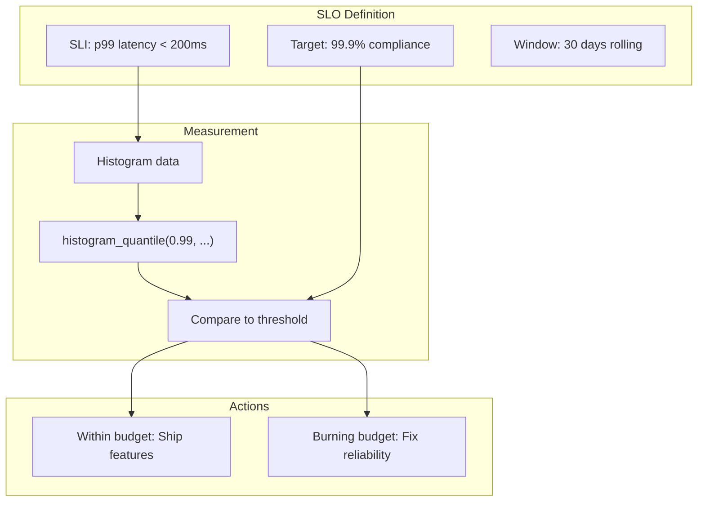
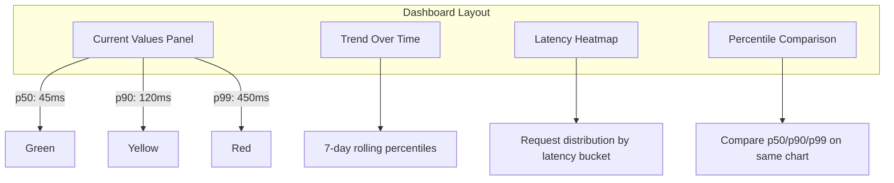

# How to Create Percentile Metrics

Author: [nawazdhandala](https://github.com/nawazdhandala)

Tags: Observability, Metrics, Monitoring, SRE

Description: Learn how to implement percentile metrics (p50, p90, p99) for latency measurement and SLO tracking.

---

When your API averages 50ms response time, everything looks fine. But averages lie. Half your users might be experiencing 500ms+ latency, and you would never know. Percentile metrics expose the truth that averages hide.

This guide shows you how to implement percentile metrics from scratch, integrate them with Prometheus histograms, and use them to build meaningful SLOs.

## Why Percentiles Matter More Than Averages

Consider two services with identical 100ms average latency:

| Service A | Service B |
|-----------|-----------|
| 99% requests at 100ms | 90% requests at 50ms |
| 1% requests at 100ms | 10% requests at 550ms |
| Average: 100ms | Average: 100ms |

Service B is causing pain for 1 in 10 users. The average never shows this.



## Understanding Percentile Levels

| Percentile | Meaning | When to Use |
|------------|---------|-------------|
| **p50 (median)** | Half of requests are faster | Baseline user experience |
| **p90** | 90% of requests are faster | Typical worst case |
| **p95** | 95% of requests are faster | Most SLO targets |
| **p99** | 99% of requests are faster | Tail latency for critical paths |
| **p999** | 99.9% of requests are faster | Extreme outliers, high-traffic systems |

For a service handling 1 million requests per day:

- p99 captures 10,000 slow requests
- p999 captures 1,000 extremely slow requests

Both matter at scale.

## Calculating Percentiles: The Fundamentals

### Method 1: Exact Calculation (Small Datasets)

For small datasets, sort and pick the value at the percentile index.

```python
# exact_percentile.py
# Calculate exact percentile from a list of latencies

def calculate_percentile(latencies: list[float], percentile: float) -> float:
    """
    Calculate exact percentile value from a sorted list.

    Args:
        latencies: List of latency values in milliseconds
        percentile: Percentile to calculate (0-100)

    Returns:
        The latency value at the given percentile
    """
    # Sort the latencies in ascending order
    sorted_latencies = sorted(latencies)

    # Calculate the index for the percentile
    # Using the nearest-rank method
    n = len(sorted_latencies)
    index = int((percentile / 100) * n)

    # Clamp index to valid range
    index = min(index, n - 1)

    return sorted_latencies[index]


# Example usage
latencies = [45, 52, 48, 120, 55, 49, 51, 350, 47, 53]

print(f"p50: {calculate_percentile(latencies, 50)}ms")   # Median
print(f"p90: {calculate_percentile(latencies, 90)}ms")   # 90th percentile
print(f"p95: {calculate_percentile(latencies, 95)}ms")   # 95th percentile
print(f"p99: {calculate_percentile(latencies, 99)}ms")   # 99th percentile
```

This approach does not scale. Storing millions of values consumes memory and sorting is expensive.

### Method 2: Histogram Buckets (Prometheus Approach)

Histograms pre-define buckets and count observations falling into each. This uses fixed memory regardless of request volume.



```python
# histogram_percentile.py
# Histogram-based percentile estimation

from dataclasses import dataclass
from typing import Optional


@dataclass
class HistogramBucket:
    """A single histogram bucket with upper bound and count."""
    upper_bound: float  # Upper limit of this bucket (exclusive)
    count: int          # Number of observations in this bucket


class LatencyHistogram:
    """
    Fixed-bucket histogram for latency tracking.
    Memory usage is constant regardless of observation count.
    """

    # Default bucket boundaries in milliseconds
    # Designed for typical web service latencies
    DEFAULT_BUCKETS = [5, 10, 25, 50, 100, 250, 500, 1000, 2500, 5000, 10000]

    def __init__(self, bucket_boundaries: Optional[list[float]] = None):
        """
        Initialize histogram with bucket boundaries.

        Args:
            bucket_boundaries: Upper bounds for buckets (auto-adds +Inf)
        """
        boundaries = bucket_boundaries or self.DEFAULT_BUCKETS

        # Create buckets with counts initialized to zero
        self.buckets: list[HistogramBucket] = []
        for bound in boundaries:
            self.buckets.append(HistogramBucket(upper_bound=bound, count=0))

        # Always add an infinity bucket for outliers
        self.buckets.append(HistogramBucket(upper_bound=float('inf'), count=0))

        # Track total observations and sum for average calculation
        self.total_count = 0
        self.total_sum = 0.0

    def observe(self, latency_ms: float) -> None:
        """
        Record a latency observation.

        Args:
            latency_ms: Observed latency in milliseconds
        """
        self.total_count += 1
        self.total_sum += latency_ms

        # Increment count for all buckets where latency <= upper_bound
        # This creates cumulative counts (Prometheus convention)
        for bucket in self.buckets:
            if latency_ms <= bucket.upper_bound:
                bucket.count += 1

    def estimate_percentile(self, percentile: float) -> float:
        """
        Estimate percentile value using linear interpolation.

        This is equivalent to histogram_quantile() in Prometheus.

        Args:
            percentile: Percentile to estimate (0-100)

        Returns:
            Estimated latency at the given percentile
        """
        if self.total_count == 0:
            return 0.0

        # Target count for this percentile
        target = (percentile / 100) * self.total_count

        # Find the bucket containing the target count
        prev_count = 0
        prev_bound = 0.0

        for bucket in self.buckets:
            if bucket.count >= target:
                # Linear interpolation within this bucket
                # Assumes uniform distribution within bucket
                bucket_fraction = (target - prev_count) / max(bucket.count - prev_count, 1)
                return prev_bound + bucket_fraction * (bucket.upper_bound - prev_bound)

            prev_count = bucket.count
            prev_bound = bucket.upper_bound

        # Should not reach here, return last bucket bound
        return self.buckets[-2].upper_bound


# Example usage
histogram = LatencyHistogram()

# Simulate 1000 requests with varying latencies
import random
random.seed(42)

for _ in range(900):
    # 90% of requests: 20-80ms (normal operation)
    histogram.observe(random.uniform(20, 80))

for _ in range(90):
    # 9% of requests: 100-300ms (slower)
    histogram.observe(random.uniform(100, 300))

for _ in range(10):
    # 1% of requests: 500-2000ms (very slow)
    histogram.observe(random.uniform(500, 2000))

print(f"Total observations: {histogram.total_count}")
print(f"Average latency: {histogram.total_sum / histogram.total_count:.1f}ms")
print(f"p50 estimate: {histogram.estimate_percentile(50):.1f}ms")
print(f"p90 estimate: {histogram.estimate_percentile(90):.1f}ms")
print(f"p95 estimate: {histogram.estimate_percentile(95):.1f}ms")
print(f"p99 estimate: {histogram.estimate_percentile(99):.1f}ms")
print(f"p999 estimate: {histogram.estimate_percentile(99.9):.1f}ms")
```

## Prometheus Histograms and histogram_quantile()

Prometheus histograms are the standard for percentile metrics in modern monitoring. Here is how to implement them properly.

### Defining Histogram Metrics

```python
# prometheus_histogram.py
# Production-ready Prometheus histogram implementation

from prometheus_client import Histogram, start_http_server
import time
import random

# Define histogram with carefully chosen buckets
# Bucket selection is critical for accuracy

# For API latency (milliseconds converted to seconds for Prometheus)
api_latency = Histogram(
    'http_request_duration_seconds',        # Metric name
    'HTTP request latency in seconds',      # Description
    ['method', 'endpoint', 'status_code'],  # Labels for filtering
    buckets=[
        0.005,   # 5ms
        0.01,    # 10ms
        0.025,   # 25ms
        0.05,    # 50ms
        0.1,     # 100ms
        0.25,    # 250ms
        0.5,     # 500ms
        1.0,     # 1 second
        2.5,     # 2.5 seconds
        5.0,     # 5 seconds
        10.0,    # 10 seconds (timeout territory)
    ]
)

# For database query latency
db_query_latency = Histogram(
    'db_query_duration_seconds',
    'Database query latency in seconds',
    ['query_type', 'table'],
    buckets=[
        0.001,   # 1ms - fast cache hit
        0.005,   # 5ms - indexed lookup
        0.01,    # 10ms
        0.025,   # 25ms
        0.05,    # 50ms
        0.1,     # 100ms
        0.25,    # 250ms - complex query
        0.5,     # 500ms
        1.0,     # 1 second - needs optimization
        5.0,     # 5 seconds - problematic
    ]
)


def handle_request(method: str, endpoint: str) -> None:
    """
    Simulate handling an HTTP request with latency tracking.
    """
    start_time = time.time()

    # Simulate processing with variable latency
    base_latency = 0.02  # 20ms base

    # Add some randomness
    actual_latency = base_latency + random.expovariate(20)
    time.sleep(actual_latency)

    # Calculate duration and record to histogram
    duration = time.time() - start_time

    # Observe the latency with labels
    api_latency.labels(
        method=method,
        endpoint=endpoint,
        status_code='200'
    ).observe(duration)


# Start metrics server
if __name__ == '__main__':
    start_http_server(8000)
    print("Metrics available at http://localhost:8000/metrics")

    # Simulate traffic
    while True:
        handle_request('GET', '/api/users')
        handle_request('POST', '/api/orders')
        time.sleep(0.1)
```

### Querying Percentiles with histogram_quantile()

The magic happens in PromQL. Here is how to extract percentiles from histogram data.

```promql
# Calculate p50 (median) latency over the last 5 minutes
histogram_quantile(
    0.5,
    rate(http_request_duration_seconds_bucket[5m])
)

# Calculate p90 latency
histogram_quantile(
    0.9,
    rate(http_request_duration_seconds_bucket[5m])
)

# Calculate p95 latency
histogram_quantile(
    0.95,
    rate(http_request_duration_seconds_bucket[5m])
)

# Calculate p99 latency
histogram_quantile(
    0.99,
    rate(http_request_duration_seconds_bucket[5m])
)

# Calculate p999 latency for high-traffic services
histogram_quantile(
    0.999,
    rate(http_request_duration_seconds_bucket[5m])
)
```

### Grouping by Labels

```promql
# p99 latency per endpoint
histogram_quantile(
    0.99,
    sum by (endpoint, le) (
        rate(http_request_duration_seconds_bucket[5m])
    )
)

# p95 latency per service in a microservices environment
histogram_quantile(
    0.95,
    sum by (service, le) (
        rate(http_request_duration_seconds_bucket[5m])
    )
)
```

## Choosing the Right Bucket Boundaries

Bucket selection directly impacts accuracy. Poor buckets lead to misleading percentiles.



### Bucket Selection Guidelines

```python
# bucket_design.py
# Guidelines for designing histogram buckets

def generate_exponential_buckets(
    start: float,
    factor: float,
    count: int
) -> list[float]:
    """
    Generate exponentially spaced buckets.

    This is the recommended approach for latency metrics
    because latency distributions are typically long-tailed.

    Args:
        start: Starting bucket boundary
        factor: Multiplication factor between buckets
        count: Number of buckets to generate

    Returns:
        List of bucket boundaries
    """
    buckets = []
    current = start

    for _ in range(count):
        buckets.append(round(current, 6))
        current *= factor

    return buckets


def generate_linear_buckets(
    start: float,
    width: float,
    count: int
) -> list[float]:
    """
    Generate linearly spaced buckets.

    Use for metrics with known, bounded ranges.

    Args:
        start: Starting bucket boundary
        width: Width of each bucket
        count: Number of buckets

    Returns:
        List of bucket boundaries
    """
    return [start + width * i for i in range(count)]


# Example: API latency buckets (exponential)
# Good for capturing both fast and slow requests
api_buckets = generate_exponential_buckets(
    start=0.005,   # 5ms minimum
    factor=2.0,    # Double each bucket
    count=12       # 12 buckets
)
print(f"API latency buckets: {api_buckets}")
# Output: [0.005, 0.01, 0.02, 0.04, 0.08, 0.16, 0.32, 0.64, 1.28, 2.56, 5.12, 10.24]

# Example: Request size buckets (exponential)
size_buckets = generate_exponential_buckets(
    start=100,     # 100 bytes
    factor=4.0,    # 4x each bucket
    count=8
)
print(f"Size buckets: {size_buckets}")
# Output: [100, 400, 1600, 6400, 25600, 102400, 409600, 1638400]

# Example: Batch processing time (linear)
# When you know jobs take 1-10 seconds
batch_buckets = generate_linear_buckets(
    start=1.0,     # 1 second
    width=1.0,     # 1 second width
    count=10
)
print(f"Batch buckets: {batch_buckets}")
# Output: [1.0, 2.0, 3.0, 4.0, 5.0, 6.0, 7.0, 8.0, 9.0, 10.0]
```

## Building SLOs with Percentile Metrics

Service Level Objectives (SLOs) should be built on percentile metrics, not averages.



### SLO Recording Rules

```yaml
# prometheus_rules.yaml
# Recording rules for SLO calculations

groups:
  - name: latency_slo_rules
    interval: 30s
    rules:
      # Pre-calculate p50 latency for dashboard efficiency
      - record: http:request_latency:p50_5m
        expr: |
          histogram_quantile(
            0.5,
            sum by (service, endpoint, le) (
              rate(http_request_duration_seconds_bucket[5m])
            )
          )

      # Pre-calculate p90 latency
      - record: http:request_latency:p90_5m
        expr: |
          histogram_quantile(
            0.9,
            sum by (service, endpoint, le) (
              rate(http_request_duration_seconds_bucket[5m])
            )
          )

      # Pre-calculate p99 latency
      - record: http:request_latency:p99_5m
        expr: |
          histogram_quantile(
            0.99,
            sum by (service, endpoint, le) (
              rate(http_request_duration_seconds_bucket[5m])
            )
          )

      # Pre-calculate p999 latency for critical paths
      - record: http:request_latency:p999_5m
        expr: |
          histogram_quantile(
            0.999,
            sum by (service, endpoint, le) (
              rate(http_request_duration_seconds_bucket[5m])
            )
          )

      # SLO compliance ratio: requests meeting latency target
      # This measures what percentage of requests are under 200ms
      - record: http:request_latency:slo_compliance
        expr: |
          sum by (service, endpoint) (
            rate(http_request_duration_seconds_bucket{le="0.2"}[5m])
          )
          /
          sum by (service, endpoint) (
            rate(http_request_duration_seconds_count[5m])
          )
```

### Alerting on Percentile Degradation

```yaml
# alerting_rules.yaml
# Alerts based on percentile thresholds

groups:
  - name: latency_alerts
    rules:
      # Alert when p99 exceeds threshold
      - alert: HighP99Latency
        expr: |
          http:request_latency:p99_5m > 0.5
        for: 5m
        labels:
          severity: warning
        annotations:
          summary: "High p99 latency detected"
          description: |
            Service {{ $labels.service }} endpoint {{ $labels.endpoint }}
            has p99 latency of {{ $value | humanizeDuration }}.
            This exceeds the 500ms threshold.

      # Alert when p999 indicates severe tail latency
      - alert: SevereP999Latency
        expr: |
          http:request_latency:p999_5m > 2.0
        for: 5m
        labels:
          severity: critical
        annotations:
          summary: "Severe tail latency detected"
          description: |
            Service {{ $labels.service }} has p999 latency of
            {{ $value | humanizeDuration }}. 1 in 1000 requests
            is experiencing extreme delays.

      # Alert on SLO budget burn rate
      - alert: SLOBudgetBurning
        expr: |
          (1 - http:request_latency:slo_compliance) > 0.01
        for: 10m
        labels:
          severity: warning
        annotations:
          summary: "SLO budget is burning"
          description: |
            More than 1% of requests to {{ $labels.endpoint }}
            are exceeding the latency SLO target.
```

## OpenTelemetry Implementation

For teams using OpenTelemetry, here is how to create histogram metrics that export to any backend.

```python
# otel_histogram.py
# OpenTelemetry histogram implementation

from opentelemetry import metrics
from opentelemetry.sdk.metrics import MeterProvider
from opentelemetry.sdk.metrics.export import (
    ConsoleMetricExporter,
    PeriodicExportingMetricReader,
)
from opentelemetry.sdk.resources import Resource
import time
import random

# Configure the meter provider
resource = Resource.create({
    "service.name": "my-api-service",
    "deployment.environment": "production",
})

# Create a metric reader that exports to console (replace with OTLP for production)
reader = PeriodicExportingMetricReader(
    ConsoleMetricExporter(),
    export_interval_millis=5000,
)

provider = MeterProvider(
    resource=resource,
    metric_readers=[reader],
)
metrics.set_meter_provider(provider)

# Get a meter for creating instruments
meter = metrics.get_meter(__name__)

# Create histogram for request latency
# OpenTelemetry histograms use explicit bucket boundaries
request_latency = meter.create_histogram(
    name="http.server.request.duration",
    description="Duration of HTTP server requests",
    unit="s",
)

# Create histogram for database operations
db_latency = meter.create_histogram(
    name="db.client.operation.duration",
    description="Duration of database operations",
    unit="s",
)


def handle_api_request(endpoint: str, method: str) -> dict:
    """
    Handle an API request with latency instrumentation.

    Args:
        endpoint: The API endpoint being called
        method: HTTP method (GET, POST, etc.)

    Returns:
        Response data
    """
    start_time = time.time()

    # Simulate processing
    # Most requests are fast, some are slow
    if random.random() < 0.95:
        # 95% of requests: 10-50ms
        time.sleep(random.uniform(0.01, 0.05))
    else:
        # 5% of requests: 100-500ms (slow path)
        time.sleep(random.uniform(0.1, 0.5))

    # Calculate duration
    duration = time.time() - start_time

    # Record to histogram with attributes
    request_latency.record(
        duration,
        attributes={
            "http.method": method,
            "http.route": endpoint,
            "http.status_code": 200,
        }
    )

    return {"status": "success", "duration_ms": duration * 1000}


def query_database(query_type: str, table: str) -> list:
    """
    Execute a database query with latency instrumentation.

    Args:
        query_type: Type of query (SELECT, INSERT, etc.)
        table: Target table name

    Returns:
        Query results
    """
    start_time = time.time()

    # Simulate database operation
    base_latency = {
        "SELECT": 0.005,   # 5ms base for reads
        "INSERT": 0.01,    # 10ms base for writes
        "UPDATE": 0.015,   # 15ms base for updates
        "DELETE": 0.01,    # 10ms base for deletes
    }.get(query_type, 0.01)

    # Add variability
    actual_latency = base_latency * random.uniform(0.5, 3.0)
    time.sleep(actual_latency)

    duration = time.time() - start_time

    # Record to histogram
    db_latency.record(
        duration,
        attributes={
            "db.operation": query_type,
            "db.sql.table": table,
            "db.system": "postgresql",
        }
    )

    return []


# Example usage
if __name__ == "__main__":
    print("Generating sample metrics...")

    # Simulate traffic
    for i in range(100):
        handle_api_request("/api/users", "GET")
        handle_api_request("/api/orders", "POST")
        query_database("SELECT", "users")
        query_database("INSERT", "orders")

    print("Waiting for metrics export...")
    time.sleep(6)  # Wait for export interval
```

## Visualizing Percentiles



### Grafana Dashboard Queries

```promql
# Panel 1: Current percentile values (Stat panel)
# p50 current value
histogram_quantile(0.5, sum(rate(http_request_duration_seconds_bucket{service="api"}[5m])) by (le))

# Panel 2: Percentile trends over time (Time series)
# All percentiles on one chart
histogram_quantile(0.5, sum(rate(http_request_duration_seconds_bucket{service="api"}[$__rate_interval])) by (le))
histogram_quantile(0.9, sum(rate(http_request_duration_seconds_bucket{service="api"}[$__rate_interval])) by (le))
histogram_quantile(0.95, sum(rate(http_request_duration_seconds_bucket{service="api"}[$__rate_interval])) by (le))
histogram_quantile(0.99, sum(rate(http_request_duration_seconds_bucket{service="api"}[$__rate_interval])) by (le))

# Panel 3: Latency distribution heatmap
# Shows request density across latency buckets over time
sum(rate(http_request_duration_seconds_bucket{service="api"}[$__rate_interval])) by (le)

# Panel 4: Apdex score (user satisfaction metric)
# Satisfied: < 100ms, Tolerating: 100-400ms, Frustrated: > 400ms
(
  sum(rate(http_request_duration_seconds_bucket{le="0.1"}[5m]))
  +
  sum(rate(http_request_duration_seconds_bucket{le="0.4"}[5m]))
  -
  sum(rate(http_request_duration_seconds_bucket{le="0.1"}[5m]))
) / 2
/
sum(rate(http_request_duration_seconds_count[5m]))
```

## Common Pitfalls and Solutions

### Pitfall 1: Aggregating Percentiles Incorrectly

You cannot average percentiles across instances. This produces meaningless numbers.

```promql
# WRONG: Averaging percentiles
avg(
  histogram_quantile(0.99, rate(http_request_duration_seconds_bucket[5m]))
)

# CORRECT: Aggregate buckets first, then calculate percentile
histogram_quantile(
  0.99,
  sum by (le) (
    rate(http_request_duration_seconds_bucket[5m])
  )
)
```

### Pitfall 2: Wrong Bucket Boundaries

```python
# BAD: Buckets too coarse for the data
bad_buckets = [0.1, 1.0, 10.0]  # Only 3 buckets

# If 80% of requests are between 50-100ms, you get no precision
# Everything falls in the first bucket

# GOOD: Buckets match expected distribution
good_buckets = [0.01, 0.025, 0.05, 0.075, 0.1, 0.25, 0.5, 1.0, 2.5, 5.0, 10.0]
```

### Pitfall 3: Ignoring Cardinality

```python
# BAD: High cardinality labels
http_latency.labels(
    user_id=user.id,           # Millions of unique values
    request_id=request.id,     # Unique per request
    endpoint=endpoint
).observe(duration)

# GOOD: Bounded cardinality
http_latency.labels(
    endpoint=endpoint,         # Tens of values
    method=method,            # 5-10 values
    status_class=status // 100  # 5 values (1xx-5xx)
).observe(duration)
```

## Summary

Percentile metrics reveal what averages hide. Here is your implementation checklist:

1. **Choose the right percentiles** for your use case (p50 for baseline, p99 for SLOs, p999 for high-traffic)

2. **Design buckets carefully** using exponential spacing for latency distributions

3. **Use histogram_quantile()** in Prometheus to calculate percentiles from histogram data

4. **Build SLOs on percentiles**, not averages

5. **Aggregate buckets first**, then calculate percentiles (never average percentiles)

6. **Monitor cardinality** to prevent metrics explosion

Percentiles are the foundation of meaningful SLOs. They tell you how your worst-affected users experience your service, not just the happy majority. Start measuring them today.

---

**Related Resources:**

- [SRE Metrics to Track](https://oneuptime.com/blog/post/2025-11-28-sre-metrics-to-track/view)
- [Three Pillars of Observability](https://oneuptime.com/blog/post/2025-08-20-three-pillars-of-observability-logs-metrics-traces/view)
- [Monitoring vs Observability](https://oneuptime.com/blog/post/2025-11-28-monitoring-vs-observability-sre/view)
