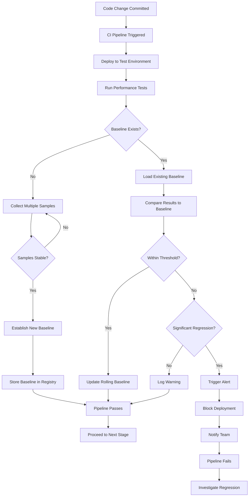

# How to Create Performance Baseline Testing

Author: [nawazdhandala](https://github.com/nawazdhandala)

Tags: Testing, Performance, Baseline, Regression

Description: Learn how to establish performance baselines and detect regressions before they reach production.

---

Performance baseline testing is a critical practice for maintaining application health over time. By establishing a known-good performance benchmark, teams can detect regressions early and prevent degraded user experiences from reaching production. This guide walks through the methodology, statistical techniques, and practical implementation of performance baseline testing.

## What is Performance Baseline Testing?

Performance baseline testing involves capturing performance metrics under controlled conditions to establish a reference point. Future test runs are compared against this baseline to identify deviations that may indicate performance regressions. This approach transforms performance testing from a subjective "feels slow" assessment into an objective, data-driven process.

## Baseline Establishment Methodology

Creating a reliable baseline requires careful planning and execution. Here are the key steps:

### 1. Define Your Metrics

Start by identifying which metrics matter most for your application:

```javascript
// Example: Core performance metrics to track
const performanceMetrics = {
    // Response time metrics
    responseTime: {
        p50: null,  // Median response time
        p90: null,  // 90th percentile
        p95: null,  // 95th percentile
        p99: null   // 99th percentile
    },

    // Throughput metrics
    throughput: {
        requestsPerSecond: null,
        transactionsPerMinute: null
    },

    // Resource utilization
    resources: {
        cpuUsage: null,
        memoryUsage: null,
        networkIO: null
    },

    // Error rates
    errors: {
        errorRate: null,
        timeoutRate: null
    }
};
```

### 2. Establish Controlled Test Conditions

Consistency is crucial for meaningful comparisons:

```yaml
# baseline-test-config.yaml
test_environment:
  # Use dedicated hardware or isolated cloud instances
  instance_type: "m5.xlarge"
  database_size: "100GB_sample"
  cache_state: "warm"

load_profile:
  # Consistent load pattern for baseline
  virtual_users: 100
  ramp_up_duration: "2m"
  steady_state_duration: "10m"
  ramp_down_duration: "1m"

data_conditions:
  # Ensure reproducible data state
  seed_data: "baseline_dataset_v1"
  reset_before_test: true
```

### 3. Collect Multiple Samples

A single test run is not sufficient for a reliable baseline:

```python
import statistics
from datetime import datetime

class BaselineCollector:
    """Collects and aggregates multiple test runs to establish a baseline."""

    def __init__(self, min_samples=5, max_variance=0.15):
        self.min_samples = min_samples
        self.max_variance = max_variance  # Maximum coefficient of variation
        self.samples = []

    def add_sample(self, metrics):
        """Add a test run's metrics to the sample set."""
        self.samples.append({
            'timestamp': datetime.now(),
            'metrics': metrics
        })

    def is_stable(self):
        """Check if samples are stable enough for baseline."""
        if len(self.samples) < self.min_samples:
            return False

        # Calculate coefficient of variation for response times
        response_times = [s['metrics']['p95'] for s in self.samples]
        mean = statistics.mean(response_times)
        stdev = statistics.stdev(response_times)
        cv = stdev / mean

        return cv <= self.max_variance

    def compute_baseline(self):
        """Compute the baseline from collected samples."""
        if not self.is_stable():
            raise ValueError("Insufficient or unstable samples for baseline")

        # Use median of samples for robustness against outliers
        return {
            'p50': statistics.median([s['metrics']['p50'] for s in self.samples]),
            'p90': statistics.median([s['metrics']['p90'] for s in self.samples]),
            'p95': statistics.median([s['metrics']['p95'] for s in self.samples]),
            'p99': statistics.median([s['metrics']['p99'] for s in self.samples]),
            'stdev': statistics.stdev([s['metrics']['p95'] for s in self.samples]),
            'sample_count': len(self.samples),
            'created_at': datetime.now().isoformat()
        }
```

## Statistical Comparison Techniques

Comparing test results to baselines requires statistical rigor to avoid false positives and negatives.

### Using Standard Deviation for Thresholds

```python
class PerformanceComparator:
    """Compares test results against baseline using statistical methods."""

    def __init__(self, baseline, sensitivity=2.0):
        self.baseline = baseline
        # Number of standard deviations for threshold
        self.sensitivity = sensitivity

    def compare(self, current_metrics):
        """
        Compare current metrics against baseline.
        Returns comparison result with pass/fail status.
        """
        results = {
            'passed': True,
            'comparisons': [],
            'summary': ''
        }

        for metric in ['p50', 'p90', 'p95', 'p99']:
            baseline_value = self.baseline[metric]
            current_value = current_metrics[metric]
            stdev = self.baseline['stdev']

            # Calculate acceptable threshold
            threshold = baseline_value + (self.sensitivity * stdev)

            # Calculate percentage change
            pct_change = ((current_value - baseline_value) / baseline_value) * 100

            comparison = {
                'metric': metric,
                'baseline': baseline_value,
                'current': current_value,
                'threshold': threshold,
                'pct_change': round(pct_change, 2),
                'passed': current_value <= threshold
            }

            results['comparisons'].append(comparison)

            if not comparison['passed']:
                results['passed'] = False

        return results

    def compute_z_score(self, current_value, metric='p95'):
        """
        Calculate z-score to measure deviation from baseline.
        Z-score > 2 typically indicates significant regression.
        """
        baseline_value = self.baseline[metric]
        stdev = self.baseline['stdev']

        if stdev == 0:
            return 0 if current_value == baseline_value else float('inf')

        return (current_value - baseline_value) / stdev
```

### Handling Variance with Confidence Intervals

```python
import scipy.stats as stats
import numpy as np

def calculate_confidence_interval(samples, confidence=0.95):
    """
    Calculate confidence interval for performance metrics.
    Helps determine if observed differences are statistically significant.
    """
    n = len(samples)
    mean = np.mean(samples)
    sem = stats.sem(samples)  # Standard error of the mean

    # Calculate confidence interval using t-distribution
    h = sem * stats.t.ppf((1 + confidence) / 2, n - 1)

    return {
        'mean': mean,
        'lower_bound': mean - h,
        'upper_bound': mean + h,
        'confidence': confidence
    }

def is_regression_significant(baseline_samples, current_samples, alpha=0.05):
    """
    Use Welch's t-test to determine if regression is statistically significant.
    Returns True if current performance is significantly worse than baseline.
    """
    # Perform one-tailed t-test (we care if current is worse)
    t_stat, p_value = stats.ttest_ind(baseline_samples, current_samples,
                                        equal_var=False)  # Welch's t-test

    # One-tailed p-value for testing if current > baseline
    one_tailed_p = p_value / 2 if t_stat < 0 else 1 - (p_value / 2)

    return {
        'is_significant': one_tailed_p < alpha and np.mean(current_samples) > np.mean(baseline_samples),
        't_statistic': t_stat,
        'p_value': one_tailed_p,
        'alpha': alpha
    }
```

## Performance Baseline Testing Workflow

The following diagram illustrates the complete workflow for performance baseline testing:



## CI/CD Integration for Performance Gates

Integrating performance baseline testing into your CI/CD pipeline ensures regressions are caught before deployment.

### GitHub Actions Example

```yaml
# .github/workflows/performance-baseline.yml
name: Performance Baseline Testing

on:
  push:
    branches: [main, develop]
  pull_request:
    branches: [main]

jobs:
  performance-test:
    runs-on: ubuntu-latest

    steps:
      - name: Checkout code
        uses: actions/checkout@v4

      - name: Setup test environment
        run: |
          docker-compose -f docker-compose.perf.yml up -d
          sleep 30  # Wait for services to stabilize

      - name: Download baseline
        id: baseline
        continue-on-error: true
        run: |
          # Fetch baseline from artifact storage
          aws s3 cp s3://perf-baselines/${{ github.repository }}/baseline.json ./baseline.json
          echo "baseline_exists=true" >> $GITHUB_OUTPUT
        env:
          AWS_ACCESS_KEY_ID: ${{ secrets.AWS_ACCESS_KEY_ID }}
          AWS_SECRET_ACCESS_KEY: ${{ secrets.AWS_SECRET_ACCESS_KEY }}

      - name: Run performance tests
        run: |
          # Run k6 load test and output results
          k6 run --out json=results.json tests/performance/load-test.js

      - name: Analyze results
        id: analyze
        run: |
          python scripts/analyze_performance.py \
            --results results.json \
            --baseline baseline.json \
            --threshold 2.0 \
            --output analysis.json
        continue-on-error: true

      - name: Performance gate check
        run: |
          # Check if performance regression detected
          if [ "${{ steps.analyze.outputs.regression_detected }}" == "true" ]; then
            echo "Performance regression detected!"
            echo "See analysis.json for details"
            exit 1
          fi

      - name: Update baseline
        if: github.ref == 'refs/heads/main' && success()
        run: |
          # Update baseline with new results if tests passed
          python scripts/update_baseline.py \
            --current results.json \
            --baseline baseline.json \
            --output new_baseline.json

          aws s3 cp new_baseline.json s3://perf-baselines/${{ github.repository }}/baseline.json
```

### Performance Analysis Script

```python
#!/usr/bin/env python3
# scripts/analyze_performance.py

import argparse
import json
import sys
from datetime import datetime

def load_json(filepath):
    """Load JSON file, return empty dict if not found."""
    try:
        with open(filepath, 'r') as f:
            return json.load(f)
    except FileNotFoundError:
        return {}

def extract_metrics(results):
    """Extract key metrics from k6 results."""
    metrics = results.get('metrics', {})

    return {
        'p50': metrics.get('http_req_duration', {}).get('p(50)', 0),
        'p90': metrics.get('http_req_duration', {}).get('p(90)', 0),
        'p95': metrics.get('http_req_duration', {}).get('p(95)', 0),
        'p99': metrics.get('http_req_duration', {}).get('p(99)', 0),
        'error_rate': metrics.get('http_req_failed', {}).get('rate', 0),
        'throughput': metrics.get('http_reqs', {}).get('rate', 0)
    }

def compare_to_baseline(current, baseline, threshold):
    """Compare current metrics to baseline."""
    if not baseline:
        return {'status': 'no_baseline', 'regression_detected': False}

    results = {
        'status': 'compared',
        'regression_detected': False,
        'comparisons': [],
        'timestamp': datetime.now().isoformat()
    }

    baseline_stdev = baseline.get('stdev', baseline.get('p95', 100) * 0.1)

    for metric in ['p50', 'p90', 'p95', 'p99']:
        baseline_val = baseline.get(metric, 0)
        current_val = current.get(metric, 0)

        if baseline_val == 0:
            continue

        # Calculate threshold based on standard deviation
        acceptable_threshold = baseline_val + (threshold * baseline_stdev)
        pct_change = ((current_val - baseline_val) / baseline_val) * 100

        comparison = {
            'metric': metric,
            'baseline': baseline_val,
            'current': current_val,
            'threshold': acceptable_threshold,
            'pct_change': round(pct_change, 2),
            'passed': current_val <= acceptable_threshold
        }

        results['comparisons'].append(comparison)

        if not comparison['passed']:
            results['regression_detected'] = True

    return results

def main():
    parser = argparse.ArgumentParser(description='Analyze performance test results')
    parser.add_argument('--results', required=True, help='Path to results JSON')
    parser.add_argument('--baseline', required=True, help='Path to baseline JSON')
    parser.add_argument('--threshold', type=float, default=2.0,
                        help='Standard deviations for threshold')
    parser.add_argument('--output', required=True, help='Output analysis path')

    args = parser.parse_args()

    # Load data
    results = load_json(args.results)
    baseline = load_json(args.baseline)

    # Extract and compare metrics
    current_metrics = extract_metrics(results)
    analysis = compare_to_baseline(current_metrics, baseline, args.threshold)
    analysis['current_metrics'] = current_metrics

    # Write analysis
    with open(args.output, 'w') as f:
        json.dump(analysis, f, indent=2)

    # Output for GitHub Actions
    print(f"::set-output name=regression_detected::{str(analysis['regression_detected']).lower()}")

    # Print summary
    print("\nPerformance Analysis Summary")
    print("=" * 50)
    for comp in analysis.get('comparisons', []):
        status = "PASS" if comp['passed'] else "FAIL"
        print(f"{comp['metric']}: {comp['current']:.2f}ms "
              f"(baseline: {comp['baseline']:.2f}ms, "
              f"change: {comp['pct_change']:+.1f}%) [{status}]")

    if analysis['regression_detected']:
        print("\nREGRESSION DETECTED - Pipeline should fail")
        sys.exit(1)
    else:
        print("\nAll metrics within acceptable thresholds")
        sys.exit(0)

if __name__ == '__main__':
    main()
```

## Alerting on Performance Degradation

When regressions are detected, timely alerts help teams respond quickly.

### Alert Configuration

```python
# alert_config.py

class PerformanceAlertConfig:
    """Configuration for performance degradation alerts."""

    def __init__(self):
        self.thresholds = {
            # Warning: 1.5 standard deviations above baseline
            'warning': {
                'sensitivity': 1.5,
                'notify': ['slack'],
                'block_deploy': False
            },
            # Critical: 2.5 standard deviations above baseline
            'critical': {
                'sensitivity': 2.5,
                'notify': ['slack', 'pagerduty', 'email'],
                'block_deploy': True
            }
        }

        self.channels = {
            'slack': {
                'webhook_url': 'https://hooks.slack.com/services/xxx',
                'channel': '#performance-alerts'
            },
            'pagerduty': {
                'integration_key': 'your-integration-key',
                'severity_map': {
                    'warning': 'warning',
                    'critical': 'critical'
                }
            },
            'email': {
                'recipients': ['team@example.com'],
                'smtp_server': 'smtp.example.com'
            }
        }
```

### Alert Dispatcher

```python
import requests
import json
from datetime import datetime

class AlertDispatcher:
    """Dispatches performance regression alerts to configured channels."""

    def __init__(self, config):
        self.config = config

    def dispatch(self, analysis_result, severity='warning'):
        """Send alerts based on severity level."""
        threshold_config = self.config.thresholds.get(severity, {})
        channels = threshold_config.get('notify', [])

        alert_payload = self._build_payload(analysis_result, severity)

        for channel in channels:
            handler = getattr(self, f'_send_{channel}', None)
            if handler:
                try:
                    handler(alert_payload)
                except Exception as e:
                    print(f"Failed to send alert to {channel}: {e}")

    def _build_payload(self, analysis, severity):
        """Build standardized alert payload."""
        failed_metrics = [c for c in analysis.get('comparisons', [])
                         if not c['passed']]

        return {
            'severity': severity,
            'timestamp': datetime.now().isoformat(),
            'summary': f"Performance regression detected in {len(failed_metrics)} metric(s)",
            'details': {
                'failed_metrics': failed_metrics,
                'current_metrics': analysis.get('current_metrics', {}),
            },
            'recommended_action': 'Review recent changes and consider rollback if user-facing'
        }

    def _send_slack(self, payload):
        """Send alert to Slack channel."""
        slack_config = self.config.channels['slack']

        # Build Slack message blocks
        blocks = [
            {
                "type": "header",
                "text": {
                    "type": "plain_text",
                    "text": f"Performance Alert: {payload['severity'].upper()}"
                }
            },
            {
                "type": "section",
                "text": {
                    "type": "mrkdwn",
                    "text": payload['summary']
                }
            },
            {
                "type": "divider"
            }
        ]

        # Add metric details
        for metric in payload['details']['failed_metrics']:
            blocks.append({
                "type": "section",
                "fields": [
                    {"type": "mrkdwn", "text": f"*Metric:* {metric['metric']}"},
                    {"type": "mrkdwn", "text": f"*Change:* {metric['pct_change']:+.1f}%"},
                    {"type": "mrkdwn", "text": f"*Current:* {metric['current']:.2f}ms"},
                    {"type": "mrkdwn", "text": f"*Baseline:* {metric['baseline']:.2f}ms"}
                ]
            })

        requests.post(
            slack_config['webhook_url'],
            json={"blocks": blocks},
            headers={"Content-Type": "application/json"}
        )

    def _send_pagerduty(self, payload):
        """Send alert to PagerDuty."""
        pd_config = self.config.channels['pagerduty']

        event = {
            "routing_key": pd_config['integration_key'],
            "event_action": "trigger",
            "payload": {
                "summary": payload['summary'],
                "severity": pd_config['severity_map'].get(payload['severity'], 'warning'),
                "source": "performance-baseline-tests",
                "custom_details": payload['details']
            }
        }

        requests.post(
            "https://events.pagerduty.com/v2/enqueue",
            json=event,
            headers={"Content-Type": "application/json"}
        )
```

## Best Practices for Performance Baseline Testing

### 1. Maintain Baseline Freshness

Baselines should evolve with your application. Implement rolling baseline updates:

```python
def update_rolling_baseline(current_baseline, new_metrics, window_size=10):
    """
    Update baseline using a rolling window approach.
    Prevents baseline drift while allowing for legitimate improvements.
    """
    samples = current_baseline.get('historical_samples', [])

    # Add new metrics to history
    samples.append(new_metrics)

    # Keep only the most recent samples
    if len(samples) > window_size:
        samples = samples[-window_size:]

    # Recalculate baseline from rolling window
    import statistics

    new_baseline = {
        'p50': statistics.median([s['p50'] for s in samples]),
        'p90': statistics.median([s['p90'] for s in samples]),
        'p95': statistics.median([s['p95'] for s in samples]),
        'p99': statistics.median([s['p99'] for s in samples]),
        'stdev': statistics.stdev([s['p95'] for s in samples]),
        'historical_samples': samples,
        'updated_at': datetime.now().isoformat()
    }

    return new_baseline
```

### 2. Version Your Baselines

Track baselines alongside your code:

```python
# baseline_versioning.py

class BaselineVersioning:
    """Manage versioned performance baselines."""

    def __init__(self, storage_backend):
        self.storage = storage_backend

    def save_baseline(self, baseline, git_sha, branch):
        """Save baseline with version metadata."""
        versioned_baseline = {
            **baseline,
            'version': {
                'git_sha': git_sha,
                'branch': branch,
                'created_at': datetime.now().isoformat()
            }
        }

        # Store by branch for easy retrieval
        key = f"baselines/{branch}/latest.json"
        self.storage.put(key, versioned_baseline)

        # Also store by commit for historical reference
        archive_key = f"baselines/archive/{git_sha}.json"
        self.storage.put(archive_key, versioned_baseline)

    def get_baseline(self, branch='main'):
        """Retrieve baseline for a specific branch."""
        key = f"baselines/{branch}/latest.json"
        return self.storage.get(key)

    def compare_baselines(self, sha1, sha2):
        """Compare baselines between two commits."""
        baseline1 = self.storage.get(f"baselines/archive/{sha1}.json")
        baseline2 = self.storage.get(f"baselines/archive/{sha2}.json")

        if not baseline1 or not baseline2:
            return None

        comparison = {}
        for metric in ['p50', 'p90', 'p95', 'p99']:
            val1 = baseline1.get(metric, 0)
            val2 = baseline2.get(metric, 0)
            if val1 > 0:
                comparison[metric] = {
                    'old': val1,
                    'new': val2,
                    'change_pct': ((val2 - val1) / val1) * 100
                }

        return comparison
```

### 3. Handle Flaky Tests

Performance tests can be inherently noisy. Build in resilience:

```python
def run_with_retry(test_func, max_retries=3, stability_threshold=0.1):
    """
    Run performance test with retries for stability.
    Helps handle transient infrastructure issues.
    """
    results = []

    for attempt in range(max_retries):
        result = test_func()
        results.append(result)

        if len(results) >= 2:
            # Check if results are converging
            recent = results[-2:]
            variance = abs(recent[1]['p95'] - recent[0]['p95']) / recent[0]['p95']

            if variance <= stability_threshold:
                # Results are stable, use average
                return {
                    'p50': sum(r['p50'] for r in recent) / 2,
                    'p90': sum(r['p90'] for r in recent) / 2,
                    'p95': sum(r['p95'] for r in recent) / 2,
                    'p99': sum(r['p99'] for r in recent) / 2,
                    'attempts': len(results)
                }

    # Return median of all attempts if stability not achieved
    import statistics
    return {
        'p50': statistics.median([r['p50'] for r in results]),
        'p90': statistics.median([r['p90'] for r in results]),
        'p95': statistics.median([r['p95'] for r in results]),
        'p99': statistics.median([r['p99'] for r in results]),
        'attempts': len(results),
        'warning': 'Results did not stabilize within retry limit'
    }
```

## Conclusion

Performance baseline testing transforms performance monitoring from reactive firefighting into proactive quality assurance. By establishing clear baselines, applying statistical rigor to comparisons, and integrating tests into your CI/CD pipeline, you can catch performance regressions before they impact users.

The key takeaways are:

1. **Establish baselines under controlled conditions** with multiple samples for statistical validity
2. **Use standard deviation-based thresholds** rather than fixed percentages for more accurate regression detection
3. **Integrate performance gates into CI/CD** to prevent regressions from reaching production
4. **Configure meaningful alerts** that notify the right people at the right severity level
5. **Maintain baseline freshness** through rolling updates while versioning for historical comparison

Start with critical user-facing endpoints and expand coverage over time. The investment in performance baseline testing pays dividends in user satisfaction and system reliability.
