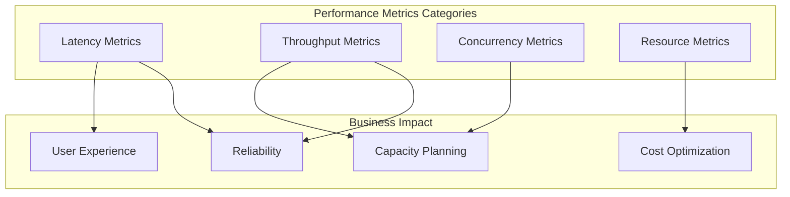
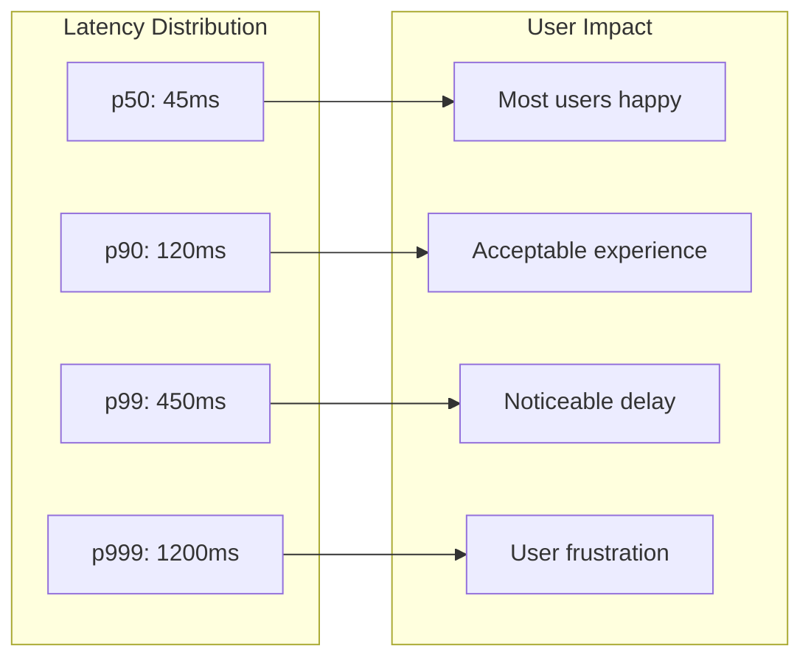
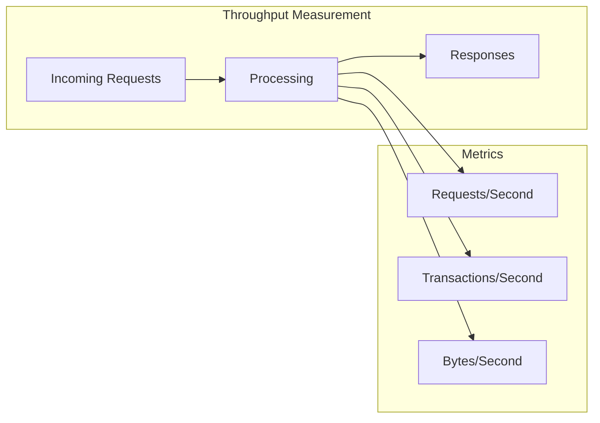
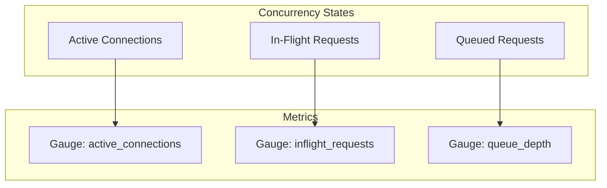
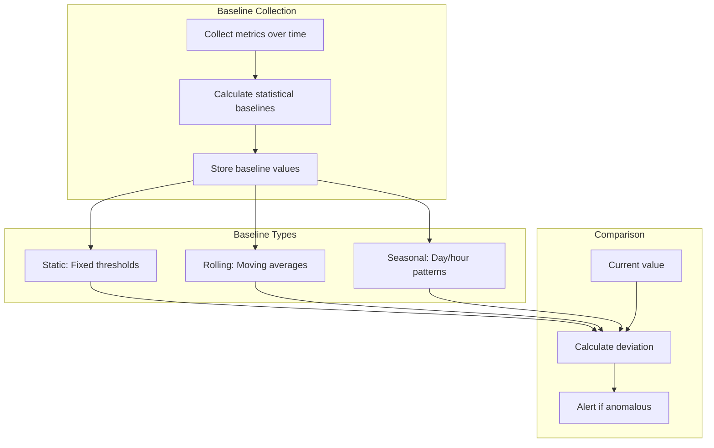
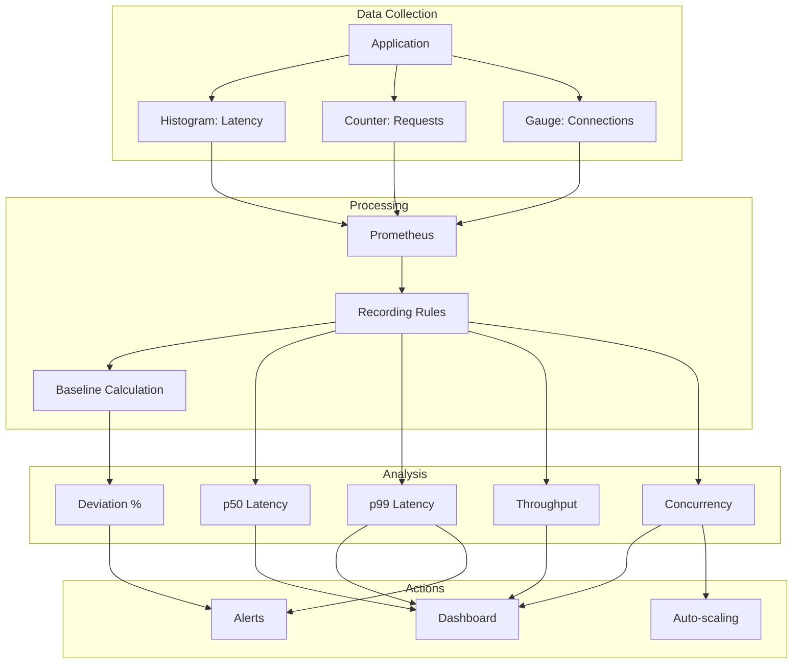

# How to Create Performance Metrics

Author: [nawazdhandala](https://github.com/nawazdhandala)

Tags: Observability, Metrics, Performance, SRE

Description: Learn how to design performance metrics for measuring latency, throughput, and response times.

---

Performance metrics are the foundation of understanding how your systems behave under real-world conditions. Without them, you are flying blind. This guide covers how to design and implement metrics for latency percentiles, throughput, concurrent users, and how to establish meaningful performance baselines.

## Why Performance Metrics Matter

Performance metrics answer critical questions about your system:

| Question | Metric Type |
|----------|-------------|
| How fast are we responding? | Latency (p50, p90, p99) |
| How much work can we handle? | Throughput (requests/second) |
| How many users can we support? | Concurrent users |
| Are we getting slower over time? | Baseline comparisons |
| Where are the bottlenecks? | Resource utilization |



## Understanding Latency Percentiles

Averages lie. If your average response time is 100ms, half your users might be experiencing 500ms or worse. Percentiles reveal the truth.

### The Percentile Ladder

| Percentile | Meaning | When to Use |
|------------|---------|-------------|
| **p50 (median)** | Half of requests are faster | Baseline user experience |
| **p75** | 75% of requests are faster | Typical performance |
| **p90** | 90% of requests are faster | Most users see this or better |
| **p95** | 95% of requests are faster | Common SLO target |
| **p99** | 99% of requests are faster | Tail latency for critical paths |
| **p999** | 99.9% of requests are faster | Extreme outliers at scale |



### Implementing Latency Measurement

Here is how to capture latency with proper percentile support using histograms:

```python
# latency_metrics.py
# Comprehensive latency measurement implementation

from prometheus_client import Histogram, Counter
import time
from functools import wraps
from typing import Callable, Any

# Define histogram buckets optimized for web service latencies
# Use exponential spacing to capture both fast and slow requests
LATENCY_BUCKETS = [
    0.005,   # 5ms - very fast cache hits
    0.01,    # 10ms - fast database lookups
    0.025,   # 25ms - typical indexed query
    0.05,    # 50ms - standard response
    0.1,     # 100ms - user-noticeable threshold
    0.25,    # 250ms - slower operations
    0.5,     # 500ms - concerning
    1.0,     # 1 second - problematic
    2.5,     # 2.5 seconds - very slow
    5.0,     # 5 seconds - timeout territory
    10.0,    # 10 seconds - likely failure
]

# Create histogram metric for request latency
request_latency = Histogram(
    'http_request_duration_seconds',
    'HTTP request latency in seconds',
    ['method', 'endpoint', 'status_code'],
    buckets=LATENCY_BUCKETS
)

# Counter for total requests (useful for throughput calculation)
request_total = Counter(
    'http_requests_total',
    'Total HTTP requests',
    ['method', 'endpoint', 'status_code']
)


def measure_latency(endpoint: str):
    """
    Decorator to measure function execution latency.

    Automatically records timing to histogram and increments counter.
    Use this to wrap API endpoint handlers.

    Args:
        endpoint: The endpoint name for labeling metrics

    Returns:
        Decorated function with latency measurement
    """
    def decorator(func: Callable) -> Callable:
        @wraps(func)
        def wrapper(*args, **kwargs) -> Any:
            # Record start time with high precision
            start_time = time.perf_counter()

            # Default status for error cases
            status_code = '500'

            try:
                # Execute the wrapped function
                result = func(*args, **kwargs)
                status_code = '200'
                return result

            except ValueError as e:
                # Client error - bad input
                status_code = '400'
                raise

            except PermissionError as e:
                # Authorization failure
                status_code = '403'
                raise

            except FileNotFoundError as e:
                # Resource not found
                status_code = '404'
                raise

            except Exception as e:
                # Server error
                status_code = '500'
                raise

            finally:
                # Calculate duration regardless of success/failure
                duration = time.perf_counter() - start_time

                # Determine HTTP method from function name or default
                method = 'GET'
                if 'post' in func.__name__.lower():
                    method = 'POST'
                elif 'put' in func.__name__.lower():
                    method = 'PUT'
                elif 'delete' in func.__name__.lower():
                    method = 'DELETE'

                # Record to histogram (enables percentile calculation)
                request_latency.labels(
                    method=method,
                    endpoint=endpoint,
                    status_code=status_code
                ).observe(duration)

                # Increment request counter (enables throughput calculation)
                request_total.labels(
                    method=method,
                    endpoint=endpoint,
                    status_code=status_code
                ).inc()

        return wrapper
    return decorator


# Example usage
@measure_latency('/api/users')
def get_users():
    """Fetch users from database."""
    # Simulated database query
    time.sleep(0.05)  # 50ms
    return {'users': []}


@measure_latency('/api/orders')
def post_order(order_data: dict):
    """Create a new order."""
    # Simulated order processing
    time.sleep(0.15)  # 150ms for validation + persistence
    return {'order_id': '12345'}
```

### Querying Percentiles

Once you have histogram data, extract percentiles using PromQL:

```promql
# Calculate p50 (median) latency over the last 5 minutes
histogram_quantile(
    0.5,
    rate(http_request_duration_seconds_bucket[5m])
)

# Calculate p90 latency by endpoint
histogram_quantile(
    0.9,
    sum by (endpoint, le) (
        rate(http_request_duration_seconds_bucket[5m])
    )
)

# Calculate p99 latency for specific endpoint
histogram_quantile(
    0.99,
    sum by (le) (
        rate(http_request_duration_seconds_bucket{endpoint="/api/checkout"}[5m])
    )
)

# Compare p50 vs p99 to understand latency spread
# Large gap indicates high variability
histogram_quantile(0.99, rate(http_request_duration_seconds_bucket[5m]))
-
histogram_quantile(0.5, rate(http_request_duration_seconds_bucket[5m]))
```

## Measuring Throughput

Throughput tells you how much work your system processes over time. It is essential for capacity planning and identifying bottlenecks.



### Implementing Throughput Metrics

```python
# throughput_metrics.py
# Throughput measurement with rate calculations

from prometheus_client import Counter, Gauge, Histogram
import time
from threading import Lock
from collections import deque
from dataclasses import dataclass
from typing import Optional

# Counter for total processed requests
requests_processed = Counter(
    'requests_processed_total',
    'Total number of requests processed',
    ['service', 'operation']
)

# Counter for bytes processed (useful for data-intensive services)
bytes_processed = Counter(
    'bytes_processed_total',
    'Total bytes processed',
    ['service', 'direction']  # direction: 'in' or 'out'
)

# Gauge for current throughput (calculated periodically)
current_throughput = Gauge(
    'current_throughput_rps',
    'Current throughput in requests per second',
    ['service']
)


@dataclass
class ThroughputWindow:
    """
    Sliding window for real-time throughput calculation.

    Maintains a fixed-size window of timestamps to calculate
    instantaneous throughput without storing all historical data.
    """
    window_size_seconds: float = 60.0
    timestamps: deque = None
    lock: Lock = None

    def __post_init__(self):
        self.timestamps = deque()
        self.lock = Lock()

    def record(self) -> None:
        """Record a new event (request processed)."""
        current_time = time.time()

        with self.lock:
            # Add current timestamp
            self.timestamps.append(current_time)

            # Remove timestamps outside the window
            cutoff = current_time - self.window_size_seconds
            while self.timestamps and self.timestamps[0] < cutoff:
                self.timestamps.popleft()

    def get_throughput(self) -> float:
        """
        Calculate current throughput in requests per second.

        Returns:
            Current throughput based on sliding window
        """
        current_time = time.time()

        with self.lock:
            # Remove stale timestamps
            cutoff = current_time - self.window_size_seconds
            while self.timestamps and self.timestamps[0] < cutoff:
                self.timestamps.popleft()

            # Calculate throughput
            count = len(self.timestamps)
            if count == 0:
                return 0.0

            # Use actual time span for accuracy
            if count == 1:
                return 1.0 / self.window_size_seconds

            time_span = self.timestamps[-1] - self.timestamps[0]
            if time_span == 0:
                return float(count)

            return count / time_span


class ThroughputTracker:
    """
    Track throughput for multiple services/operations.

    Provides both Prometheus metrics and real-time calculations.
    """

    def __init__(self, service_name: str):
        self.service_name = service_name
        self.windows: dict[str, ThroughputWindow] = {}
        self.lock = Lock()

    def record_request(
        self,
        operation: str,
        bytes_in: int = 0,
        bytes_out: int = 0
    ) -> None:
        """
        Record a completed request.

        Args:
            operation: Name of the operation (e.g., 'read', 'write')
            bytes_in: Input bytes processed (optional)
            bytes_out: Output bytes processed (optional)
        """
        # Update Prometheus counters
        requests_processed.labels(
            service=self.service_name,
            operation=operation
        ).inc()

        if bytes_in > 0:
            bytes_processed.labels(
                service=self.service_name,
                direction='in'
            ).inc(bytes_in)

        if bytes_out > 0:
            bytes_processed.labels(
                service=self.service_name,
                direction='out'
            ).inc(bytes_out)

        # Update sliding window
        with self.lock:
            if operation not in self.windows:
                self.windows[operation] = ThroughputWindow()
            self.windows[operation].record()

    def get_current_rps(self, operation: Optional[str] = None) -> float:
        """
        Get current requests per second.

        Args:
            operation: Specific operation, or None for aggregate

        Returns:
            Current throughput in requests per second
        """
        with self.lock:
            if operation:
                window = self.windows.get(operation)
                return window.get_throughput() if window else 0.0

            # Aggregate across all operations
            total = 0.0
            for window in self.windows.values():
                total += window.get_throughput()
            return total

    def update_gauge(self) -> None:
        """Update the Prometheus gauge with current throughput."""
        rps = self.get_current_rps()
        current_throughput.labels(service=self.service_name).set(rps)


# Example usage
tracker = ThroughputTracker('api-gateway')

def handle_request(operation: str, request_bytes: int, response_bytes: int):
    """Process a request and track throughput."""
    # ... actual processing ...

    # Record the completed request
    tracker.record_request(
        operation=operation,
        bytes_in=request_bytes,
        bytes_out=response_bytes
    )

    # Periodically update the gauge (typically in a background thread)
    tracker.update_gauge()
```

### Throughput Queries in PromQL

```promql
# Requests per second over the last 5 minutes
rate(requests_processed_total[5m])

# Throughput by operation
sum by (operation) (
    rate(requests_processed_total[5m])
)

# Peak throughput (maximum over 1 hour)
max_over_time(
    rate(requests_processed_total[5m])[1h:]
)

# Data throughput in MB/s
sum(rate(bytes_processed_total[5m])) / 1024 / 1024

# Throughput relative to baseline (percentage)
rate(requests_processed_total[5m])
/
avg_over_time(rate(requests_processed_total[5m])[7d:1h])
* 100
```

## Tracking Concurrent Users

Understanding concurrent user load helps with capacity planning and identifying when you are approaching system limits.



### Implementing Concurrency Metrics

```python
# concurrency_metrics.py
# Track concurrent users and in-flight requests

from prometheus_client import Gauge, Histogram
from contextlib import contextmanager
from threading import Lock
import time
from typing import Generator

# Gauge for currently active connections
active_connections = Gauge(
    'active_connections',
    'Number of currently active connections',
    ['service', 'connection_type']
)

# Gauge for in-flight requests (requests being processed)
inflight_requests = Gauge(
    'inflight_requests',
    'Number of requests currently being processed',
    ['service', 'endpoint']
)

# Gauge for maximum concurrent users seen
max_concurrent_users = Gauge(
    'max_concurrent_users',
    'Maximum concurrent users observed',
    ['service', 'window']  # window: '1m', '5m', '1h', '1d'
)

# Histogram for request queue time
queue_wait_time = Histogram(
    'request_queue_wait_seconds',
    'Time spent waiting in queue before processing',
    ['service'],
    buckets=[0.001, 0.005, 0.01, 0.025, 0.05, 0.1, 0.25, 0.5, 1.0, 2.5, 5.0]
)


class ConcurrencyTracker:
    """
    Track concurrent users and in-flight requests.

    Uses context managers for automatic increment/decrement
    to prevent count leaks on errors.
    """

    def __init__(self, service_name: str, max_concurrent: int = 1000):
        self.service_name = service_name
        self.max_concurrent = max_concurrent
        self.current_count = 0
        self.peak_count = 0
        self.lock = Lock()
        self.peak_timestamps: dict[str, tuple[int, float]] = {}

    @contextmanager
    def track_connection(
        self,
        connection_type: str = 'http'
    ) -> Generator[None, None, None]:
        """
        Context manager to track an active connection.

        Automatically decrements count when connection closes,
        even if an exception occurs.

        Args:
            connection_type: Type of connection (http, websocket, grpc)

        Yields:
            None
        """
        with self.lock:
            self.current_count += 1
            if self.current_count > self.peak_count:
                self.peak_count = self.current_count

        # Update Prometheus gauge
        active_connections.labels(
            service=self.service_name,
            connection_type=connection_type
        ).inc()

        try:
            yield
        finally:
            with self.lock:
                self.current_count -= 1

            active_connections.labels(
                service=self.service_name,
                connection_type=connection_type
            ).dec()

    @contextmanager
    def track_request(self, endpoint: str) -> Generator[float, None, None]:
        """
        Context manager to track an in-flight request.

        Records queue wait time and manages inflight counter.

        Args:
            endpoint: The API endpoint being called

        Yields:
            Queue wait time in seconds
        """
        queue_start = time.perf_counter()

        # Increment in-flight counter
        inflight_requests.labels(
            service=self.service_name,
            endpoint=endpoint
        ).inc()

        # Calculate queue wait time (time between request arrival and processing start)
        queue_time = time.perf_counter() - queue_start
        queue_wait_time.labels(service=self.service_name).observe(queue_time)

        try:
            yield queue_time
        finally:
            # Decrement in-flight counter
            inflight_requests.labels(
                service=self.service_name,
                endpoint=endpoint
            ).dec()

    def get_current_count(self) -> int:
        """Get current number of active connections."""
        with self.lock:
            return self.current_count

    def get_peak_count(self) -> int:
        """Get peak concurrent connections observed."""
        with self.lock:
            return self.peak_count

    def update_peak_metrics(self) -> None:
        """Update Prometheus gauges for peak values."""
        current_time = time.time()

        with self.lock:
            # Update 1-minute peak
            window_key = '1m'
            prev_peak, prev_time = self.peak_timestamps.get(window_key, (0, 0))

            if current_time - prev_time >= 60:
                # Reset for new window
                self.peak_timestamps[window_key] = (self.current_count, current_time)
                max_concurrent_users.labels(
                    service=self.service_name,
                    window=window_key
                ).set(self.current_count)
            elif self.current_count > prev_peak:
                self.peak_timestamps[window_key] = (self.current_count, prev_time)
                max_concurrent_users.labels(
                    service=self.service_name,
                    window=window_key
                ).set(self.current_count)


# Example usage
tracker = ConcurrencyTracker('web-server', max_concurrent=5000)

async def handle_websocket_connection(websocket):
    """Handle a WebSocket connection with concurrency tracking."""
    with tracker.track_connection(connection_type='websocket'):
        # Connection is tracked while inside this block
        while True:
            message = await websocket.receive()

            # Track individual request within the connection
            with tracker.track_request('/ws/message') as queue_time:
                if queue_time > 0.1:
                    print(f"Warning: Request queued for {queue_time:.3f}s")

                # Process the message
                response = process_message(message)
                await websocket.send(response)
```

### Concurrency Queries in PromQL

```promql
# Current active connections
active_connections{service="web-server"}

# Average concurrent users over time
avg_over_time(active_connections[1h])

# Peak concurrent users in the last 24 hours
max_over_time(active_connections[24h])

# In-flight requests by endpoint
inflight_requests{service="api"}

# Percentage of capacity used
active_connections / 5000 * 100

# Alert when approaching capacity
active_connections > 4000
```

## Establishing Performance Baselines

Baselines give you a reference point for understanding whether current performance is normal, degraded, or improved.



### Implementing Baseline Tracking

```python
# baseline_metrics.py
# Establish and compare against performance baselines

from prometheus_client import Gauge, Counter
from dataclasses import dataclass
from typing import Optional
import statistics
import time
from collections import deque

# Gauges for baseline comparisons
latency_baseline = Gauge(
    'latency_baseline_seconds',
    'Baseline latency value',
    ['service', 'percentile', 'baseline_type']
)

throughput_baseline = Gauge(
    'throughput_baseline_rps',
    'Baseline throughput value',
    ['service', 'baseline_type']
)

deviation_from_baseline = Gauge(
    'deviation_from_baseline_percent',
    'Current deviation from baseline as percentage',
    ['service', 'metric', 'baseline_type']
)


@dataclass
class BaselineConfig:
    """Configuration for baseline calculation."""
    # Minimum samples required before baseline is valid
    min_samples: int = 100

    # Window size for rolling baseline (in samples)
    rolling_window: int = 1000

    # Number of standard deviations for anomaly detection
    anomaly_threshold: float = 3.0

    # Percentiles to track for latency
    latency_percentiles: tuple = (0.5, 0.9, 0.95, 0.99)


class PerformanceBaseline:
    """
    Calculate and maintain performance baselines.

    Supports static baselines (from historical data),
    rolling baselines (adaptive), and deviation detection.
    """

    def __init__(self, service_name: str, config: Optional[BaselineConfig] = None):
        self.service_name = service_name
        self.config = config or BaselineConfig()

        # Storage for baseline data
        self.latency_samples: deque = deque(maxlen=self.config.rolling_window)
        self.throughput_samples: deque = deque(maxlen=self.config.rolling_window)

        # Computed baselines
        self.static_latency_baseline: Optional[dict[float, float]] = None
        self.static_throughput_baseline: Optional[float] = None

    def record_latency(self, latency_seconds: float) -> None:
        """
        Record a latency observation for baseline calculation.

        Args:
            latency_seconds: Observed latency in seconds
        """
        self.latency_samples.append(latency_seconds)

    def record_throughput(self, requests_per_second: float) -> None:
        """
        Record a throughput observation for baseline calculation.

        Args:
            requests_per_second: Observed throughput
        """
        self.throughput_samples.append(requests_per_second)

    def calculate_latency_percentile(self, percentile: float) -> Optional[float]:
        """
        Calculate latency at a given percentile from collected samples.

        Args:
            percentile: Percentile to calculate (0.0 to 1.0)

        Returns:
            Latency value at percentile, or None if insufficient data
        """
        if len(self.latency_samples) < self.config.min_samples:
            return None

        sorted_samples = sorted(self.latency_samples)
        index = int(percentile * len(sorted_samples))
        index = min(index, len(sorted_samples) - 1)
        return sorted_samples[index]

    def get_rolling_baseline(self) -> dict:
        """
        Calculate rolling baseline from recent samples.

        Returns:
            Dictionary with latency percentiles and throughput baseline
        """
        result = {
            'latency': {},
            'throughput': None,
            'valid': False
        }

        # Calculate latency percentiles
        if len(self.latency_samples) >= self.config.min_samples:
            for p in self.config.latency_percentiles:
                value = self.calculate_latency_percentile(p)
                if value is not None:
                    result['latency'][f'p{int(p*100)}'] = value

                    # Update Prometheus gauge
                    latency_baseline.labels(
                        service=self.service_name,
                        percentile=f'p{int(p*100)}',
                        baseline_type='rolling'
                    ).set(value)

        # Calculate throughput baseline
        if len(self.throughput_samples) >= self.config.min_samples:
            result['throughput'] = statistics.mean(self.throughput_samples)
            result['valid'] = True

            throughput_baseline.labels(
                service=self.service_name,
                baseline_type='rolling'
            ).set(result['throughput'])

        return result

    def set_static_baseline(
        self,
        latency_percentiles: dict[str, float],
        throughput: float
    ) -> None:
        """
        Set a static baseline from historical data or SLO targets.

        Use this to define expected performance levels.

        Args:
            latency_percentiles: Dict mapping percentile names to values
            throughput: Expected throughput in requests/second
        """
        self.static_latency_baseline = latency_percentiles
        self.static_throughput_baseline = throughput

        # Update Prometheus gauges
        for percentile, value in latency_percentiles.items():
            latency_baseline.labels(
                service=self.service_name,
                percentile=percentile,
                baseline_type='static'
            ).set(value)

        throughput_baseline.labels(
            service=self.service_name,
            baseline_type='static'
        ).set(throughput)

    def check_deviation(
        self,
        current_latency: dict[str, float],
        current_throughput: float,
        use_rolling: bool = True
    ) -> dict:
        """
        Check how far current values deviate from baseline.

        Args:
            current_latency: Current latency percentiles
            current_throughput: Current throughput
            use_rolling: Use rolling baseline (True) or static (False)

        Returns:
            Dictionary with deviation percentages and anomaly flags
        """
        result = {
            'latency_deviations': {},
            'throughput_deviation': None,
            'anomalies': []
        }

        # Get baseline to compare against
        if use_rolling:
            baseline = self.get_rolling_baseline()
            baseline_latency = baseline['latency']
            baseline_throughput = baseline['throughput']
            baseline_type = 'rolling'
        else:
            baseline_latency = self.static_latency_baseline or {}
            baseline_throughput = self.static_throughput_baseline
            baseline_type = 'static'

        # Check latency deviations
        for percentile, current_value in current_latency.items():
            if percentile in baseline_latency and baseline_latency[percentile] > 0:
                baseline_value = baseline_latency[percentile]
                deviation_pct = ((current_value - baseline_value) / baseline_value) * 100

                result['latency_deviations'][percentile] = deviation_pct

                # Update Prometheus gauge
                deviation_from_baseline.labels(
                    service=self.service_name,
                    metric=f'latency_{percentile}',
                    baseline_type=baseline_type
                ).set(deviation_pct)

                # Check for anomaly (significant increase)
                if deviation_pct > self.config.anomaly_threshold * 100:
                    result['anomalies'].append({
                        'metric': f'latency_{percentile}',
                        'deviation_pct': deviation_pct,
                        'baseline': baseline_value,
                        'current': current_value
                    })

        # Check throughput deviation
        if baseline_throughput and baseline_throughput > 0:
            deviation_pct = ((current_throughput - baseline_throughput) / baseline_throughput) * 100
            result['throughput_deviation'] = deviation_pct

            deviation_from_baseline.labels(
                service=self.service_name,
                metric='throughput',
                baseline_type=baseline_type
            ).set(deviation_pct)

            # Throughput decrease is concerning
            if deviation_pct < -self.config.anomaly_threshold * 10:
                result['anomalies'].append({
                    'metric': 'throughput',
                    'deviation_pct': deviation_pct,
                    'baseline': baseline_throughput,
                    'current': current_throughput
                })

        return result


# Example usage
baseline = PerformanceBaseline('checkout-service')

# Set static baseline from SLO targets
baseline.set_static_baseline(
    latency_percentiles={
        'p50': 0.050,   # 50ms
        'p90': 0.150,   # 150ms
        'p95': 0.250,   # 250ms
        'p99': 0.500,   # 500ms
    },
    throughput=1000.0  # 1000 requests/second
)

# Record observations
for _ in range(200):
    # Simulate latency measurements
    import random
    latency = random.uniform(0.03, 0.2)
    baseline.record_latency(latency)

    # Simulate throughput measurements
    throughput = random.uniform(800, 1200)
    baseline.record_throughput(throughput)

# Check current performance against baseline
current_latency = {
    'p50': 0.055,
    'p90': 0.180,
    'p95': 0.300,
    'p99': 0.650
}
current_throughput = 950.0

deviations = baseline.check_deviation(
    current_latency=current_latency,
    current_throughput=current_throughput,
    use_rolling=False  # Compare against static SLO baseline
)

print(f"Latency deviations: {deviations['latency_deviations']}")
print(f"Throughput deviation: {deviations['throughput_deviation']:.1f}%")
if deviations['anomalies']:
    print(f"Anomalies detected: {deviations['anomalies']}")
```

### Baseline Comparison Queries

```promql
# Current p99 latency vs static baseline
(
    histogram_quantile(0.99, rate(http_request_duration_seconds_bucket[5m]))
    -
    latency_baseline_seconds{percentile="p99", baseline_type="static"}
)
/
latency_baseline_seconds{percentile="p99", baseline_type="static"}
* 100

# Current throughput vs rolling baseline
(
    rate(requests_processed_total[5m])
    -
    throughput_baseline_rps{baseline_type="rolling"}
)
/
throughput_baseline_rps{baseline_type="rolling"}
* 100

# Alert when latency exceeds baseline by 50%
histogram_quantile(0.99, rate(http_request_duration_seconds_bucket[5m]))
>
latency_baseline_seconds{percentile="p99", baseline_type="static"} * 1.5
```

## Putting It All Together

Here is a complete performance monitoring setup that combines all the concepts:



### Recording Rules for Performance Metrics

```yaml
# performance_rules.yaml
# Prometheus recording rules for performance metrics

groups:
  - name: performance_metrics
    interval: 15s
    rules:
      # Latency percentiles
      - record: service:latency:p50_5m
        expr: |
          histogram_quantile(
            0.5,
            sum by (service, le) (
              rate(http_request_duration_seconds_bucket[5m])
            )
          )

      - record: service:latency:p90_5m
        expr: |
          histogram_quantile(
            0.9,
            sum by (service, le) (
              rate(http_request_duration_seconds_bucket[5m])
            )
          )

      - record: service:latency:p99_5m
        expr: |
          histogram_quantile(
            0.99,
            sum by (service, le) (
              rate(http_request_duration_seconds_bucket[5m])
            )
          )

      # Throughput
      - record: service:throughput:rps_5m
        expr: |
          sum by (service) (
            rate(http_requests_total[5m])
          )

      # Error rate
      - record: service:error_rate:5m
        expr: |
          sum by (service) (
            rate(http_requests_total{status_code=~"5.."}[5m])
          )
          /
          sum by (service) (
            rate(http_requests_total[5m])
          )

      # Concurrency
      - record: service:concurrent_users:avg_5m
        expr: |
          avg_over_time(active_connections[5m])

      # Latency spread (p99 - p50)
      - record: service:latency:spread_5m
        expr: |
          service:latency:p99_5m - service:latency:p50_5m
```

### Alerting Rules

```yaml
# performance_alerts.yaml
# Alerts based on performance metrics

groups:
  - name: performance_alerts
    rules:
      # High p99 latency
      - alert: HighP99Latency
        expr: service:latency:p99_5m > 0.5
        for: 5m
        labels:
          severity: warning
        annotations:
          summary: "High p99 latency on {{ $labels.service }}"
          description: |
            Service {{ $labels.service }} has p99 latency of
            {{ $value | humanizeDuration }}. Threshold is 500ms.

      # Large latency spread indicates inconsistent performance
      - alert: HighLatencySpread
        expr: service:latency:spread_5m > 0.3
        for: 10m
        labels:
          severity: warning
        annotations:
          summary: "High latency variance on {{ $labels.service }}"
          description: |
            The difference between p99 and p50 latency is
            {{ $value | humanizeDuration }}, indicating
            inconsistent performance.

      # Throughput drop
      - alert: ThroughputDrop
        expr: |
          service:throughput:rps_5m
          <
          avg_over_time(service:throughput:rps_5m[24h]) * 0.5
        for: 10m
        labels:
          severity: critical
        annotations:
          summary: "Throughput dropped on {{ $labels.service }}"
          description: |
            Current throughput ({{ $value | humanize }} rps) is less
            than 50% of the 24-hour average.

      # High concurrency approaching limits
      - alert: HighConcurrency
        expr: active_connections > 4500
        for: 5m
        labels:
          severity: warning
        annotations:
          summary: "High concurrent connections"
          description: |
            {{ $value }} active connections, approaching
            the limit of 5000.

      # Baseline deviation alert
      - alert: LatencyBaselineDeviation
        expr: deviation_from_baseline_percent{metric=~"latency.*"} > 100
        for: 10m
        labels:
          severity: warning
        annotations:
          summary: "Latency exceeds baseline"
          description: |
            {{ $labels.metric }} on {{ $labels.service }} is
            {{ $value | humanize }}% above baseline.
```

## Summary

Creating effective performance metrics requires understanding what to measure and how to interpret the results:

| Metric Type | Key Measures | Use For |
|-------------|--------------|---------|
| **Latency** | p50, p90, p99, p999 | User experience, SLOs |
| **Throughput** | Requests/second, bytes/second | Capacity planning |
| **Concurrency** | Active connections, in-flight requests | Load management |
| **Baselines** | Rolling averages, static targets | Anomaly detection |

Key takeaways:

1. **Use percentiles, not averages** - Averages hide the experience of your worst-affected users

2. **Choose bucket boundaries carefully** - Exponential spacing works best for latency distributions

3. **Track throughput alongside latency** - High throughput with high latency indicates saturation

4. **Monitor concurrent users** - Know when you are approaching system limits

5. **Establish baselines** - You cannot identify degradation without knowing what normal looks like

6. **Combine metrics for insight** - Latency spread (p99 - p50) reveals consistency problems

Performance metrics are the foundation of observability. They tell you not just whether your system is up, but whether it is providing a good experience for your users.

---

**Related Resources:**

- [SRE Metrics to Track](https://oneuptime.com/blog/post/2025-11-28-sre-metrics-to-track/view)
- [Basics of Profiling](https://oneuptime.com/blog/post/2025-09-09-basics-of-profiling/view)
- [Three Pillars of Observability](https://oneuptime.com/blog/post/2025-08-20-three-pillars-of-observability-logs-metrics-traces/view)
- [How to Create Percentile Metrics](https://oneuptime.com/blog/post/2026-01-30-percentile-metrics/view)
