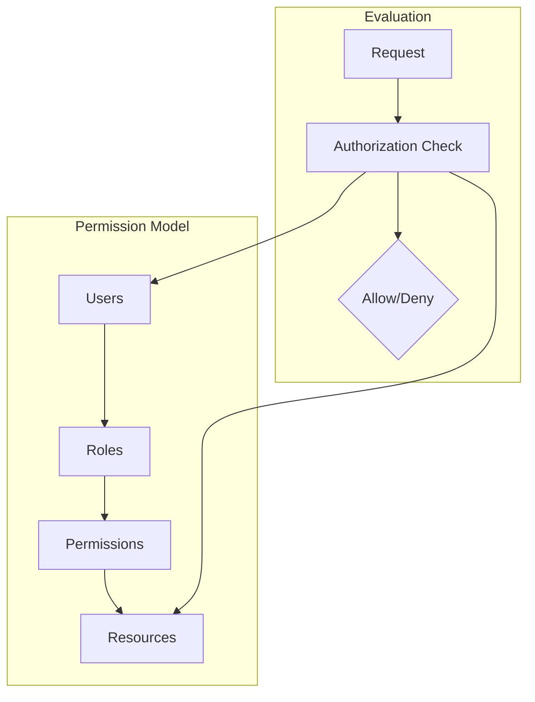
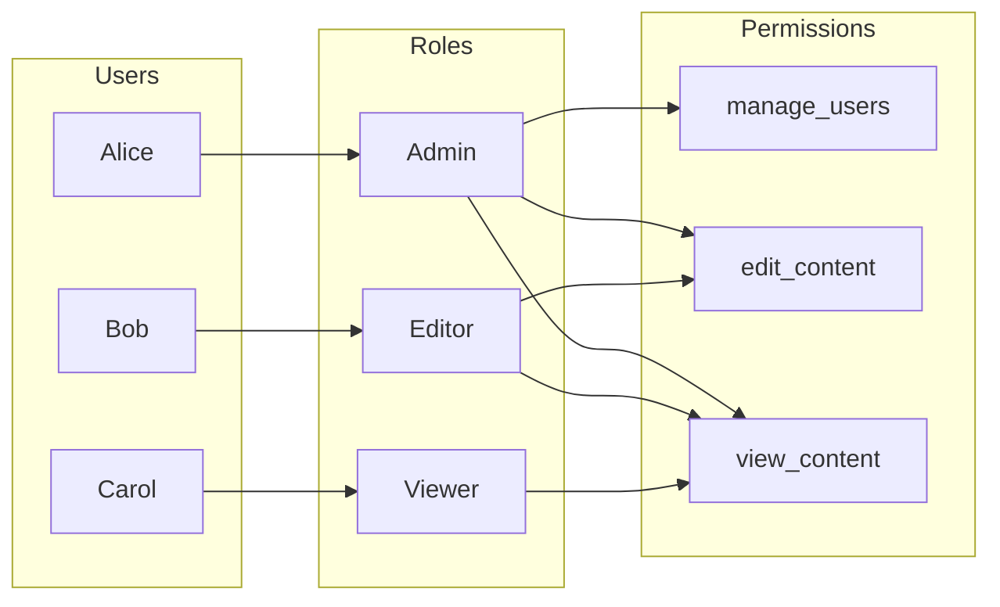
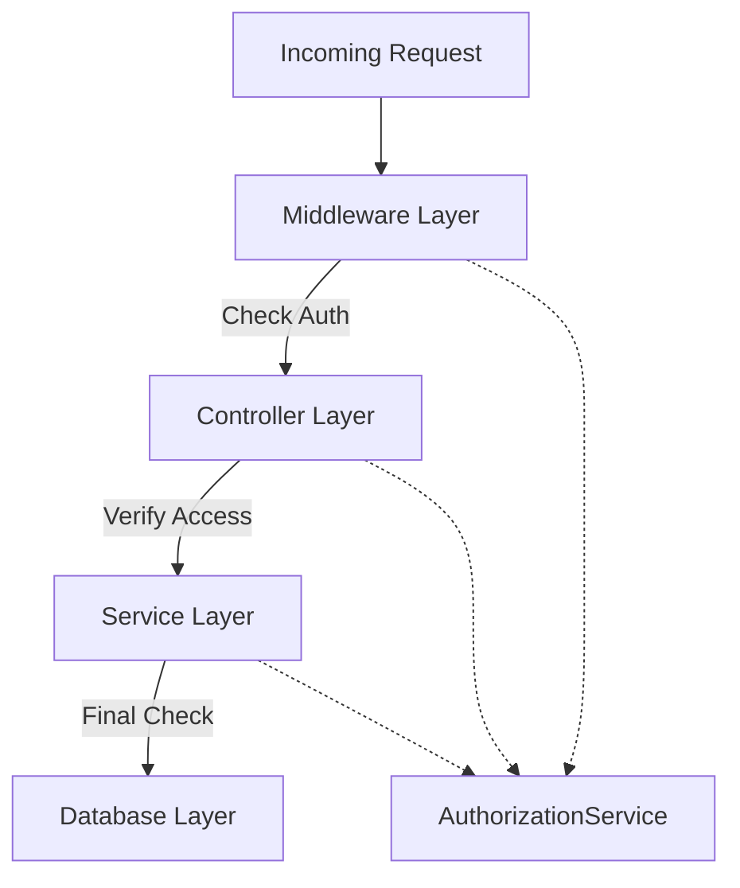
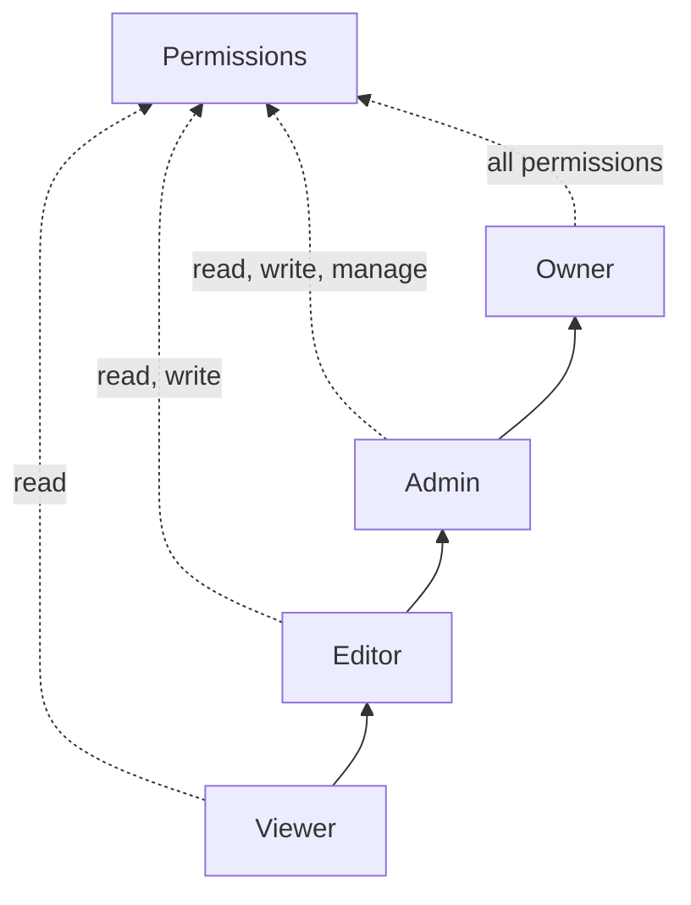

# How to Build Permission Model Design

Author: [nawazdhandala](https://github.com/nawazdhandala)

Tags: Security, Permissions, Authorization, Architecture

Description: Learn to build permission model design for granular access control with roles and capabilities.

---

Designing a permission model is one of the most important architectural decisions you will make for any application that serves multiple users or teams. Get it wrong, and you will spend months refactoring. Get it right, and you will have a foundation that scales with your product. This guide walks through the core patterns, implementation strategies, and practical code examples for building a robust permission system.

## Why Permission Models Matter

Every multi-user application needs to answer three questions:

1. Who is making the request?
2. What are they trying to do?
3. Are they allowed to do it?

A permission model provides the framework for answering these questions consistently across your entire application. Without a clear model, you end up with scattered permission checks, inconsistent enforcement, and security gaps that grow harder to fix over time.

## Core Components of a Permission Model

A well-designed permission model consists of four main components that work together to enforce access control.



| Component | Purpose | Example |
|-----------|---------|---------|
| Users | Identity that requests access | john@example.com |
| Roles | Groups of related permissions | Admin, Editor, Viewer |
| Permissions | Specific actions on resources | create, read, update, delete |
| Resources | Objects being accessed | Projects, Documents, Settings |

## Choosing Your Permission Strategy

There are three primary strategies for modeling permissions. Your choice depends on the complexity of your access control requirements.

### Strategy 1: Role-Based Access Control (RBAC)

RBAC assigns users to roles, and roles define what actions are allowed. This is the simplest model and works well for applications with clear user categories.



### Strategy 2: Attribute-Based Access Control (ABAC)

ABAC evaluates attributes of the user, resource, and environment to make access decisions. Use this when you need fine-grained control based on contextual factors.

### Strategy 3: Relationship-Based Access Control (ReBAC)

ReBAC makes access decisions based on relationships between users and resources. This works well for hierarchical data where permissions flow through ownership chains.

## Implementing the Data Model

Start with a database schema that captures users, roles, permissions, and their relationships.

The following SQL creates the core tables for a flexible RBAC system:

```sql
-- Users table stores identity information
CREATE TABLE users (
    id UUID PRIMARY KEY DEFAULT gen_random_uuid(),
    email VARCHAR(255) UNIQUE NOT NULL,
    created_at TIMESTAMP DEFAULT NOW()
);

-- Roles define named groups of permissions
CREATE TABLE roles (
    id UUID PRIMARY KEY DEFAULT gen_random_uuid(),
    name VARCHAR(64) UNIQUE NOT NULL,
    description TEXT,
    created_at TIMESTAMP DEFAULT NOW()
);

-- Permissions define specific actions on resource types
CREATE TABLE permissions (
    id UUID PRIMARY KEY DEFAULT gen_random_uuid(),
    name VARCHAR(64) NOT NULL,
    resource_type VARCHAR(64) NOT NULL,
    action VARCHAR(32) NOT NULL,
    UNIQUE(resource_type, action)
);

-- Link roles to permissions (many-to-many)
CREATE TABLE role_permissions (
    role_id UUID REFERENCES roles(id) ON DELETE CASCADE,
    permission_id UUID REFERENCES permissions(id) ON DELETE CASCADE,
    PRIMARY KEY (role_id, permission_id)
);

-- Link users to roles with optional resource scoping
CREATE TABLE user_roles (
    user_id UUID REFERENCES users(id) ON DELETE CASCADE,
    role_id UUID REFERENCES roles(id) ON DELETE CASCADE,
    resource_type VARCHAR(64),  -- NULL means global assignment
    resource_id UUID,           -- NULL means all resources of type
    PRIMARY KEY (user_id, role_id, COALESCE(resource_id, '00000000-0000-0000-0000-000000000000'))
);

-- Index for fast permission lookups
CREATE INDEX idx_user_roles_lookup ON user_roles(user_id, resource_type, resource_id);
```

## Building the Authorization Service

The authorization service sits between your application logic and the database. It provides a clean interface for checking permissions.

Here is a TypeScript implementation of the core authorization logic:

```typescript
// Define the structure for permission checks
interface PermissionCheck {
  userId: string;
  action: string;
  resourceType: string;
  resourceId?: string;
}

// Authorization service handles all permission checks
class AuthorizationService {
  private db: Database;
  private cache: PermissionCache;

  constructor(db: Database, cache: PermissionCache) {
    this.db = db;
    this.cache = cache;
  }

  // Main entry point for permission checks
  async canPerform(check: PermissionCheck): Promise<boolean> {
    // Try cache first for performance
    const cacheKey = this.buildCacheKey(check);
    const cached = await this.cache.get(cacheKey);
    if (cached !== undefined) {
      return cached;
    }

    // Query the database for permission
    const allowed = await this.checkPermission(check);

    // Cache result with short TTL
    await this.cache.set(cacheKey, allowed, 60);

    return allowed;
  }

  // Query database to check if user has permission
  private async checkPermission(check: PermissionCheck): Promise<boolean> {
    const query = `
      SELECT 1 FROM user_roles ur
      JOIN role_permissions rp ON ur.role_id = rp.role_id
      JOIN permissions p ON rp.permission_id = p.id
      WHERE ur.user_id = $1
        AND p.resource_type = $2
        AND p.action = $3
        AND (
          ur.resource_id IS NULL
          OR ur.resource_id = $4
        )
      LIMIT 1
    `;

    const result = await this.db.query(query, [
      check.userId,
      check.resourceType,
      check.action,
      check.resourceId
    ]);

    return result.rows.length > 0;
  }

  // Build consistent cache keys for permission results
  private buildCacheKey(check: PermissionCheck): string {
    return `perm:${check.userId}:${check.resourceType}:${check.action}:${check.resourceId || 'all'}`;
  }
}
```

## Integrating Permission Checks

Permission checks should be integrated at multiple layers of your application for defense in depth.



Here is how to implement a middleware that enforces permissions:

```typescript
// Express middleware for route-level permission checks
function requirePermission(action: string, resourceType: string) {
  return async (req: Request, res: Response, next: NextFunction) => {
    const userId = req.user?.id;
    if (!userId) {
      return res.status(401).json({ error: 'Not authenticated' });
    }

    // Extract resource ID from route params if present
    const resourceId = req.params.id;

    const authService = req.app.get('authService');
    const allowed = await authService.canPerform({
      userId,
      action,
      resourceType,
      resourceId
    });

    if (!allowed) {
      return res.status(403).json({ error: 'Permission denied' });
    }

    next();
  };
}

// Usage in route definitions
app.get('/projects/:id',
  requirePermission('read', 'project'),
  projectController.get
);

app.put('/projects/:id',
  requirePermission('update', 'project'),
  projectController.update
);

app.delete('/projects/:id',
  requirePermission('delete', 'project'),
  projectController.delete
);
```

## Handling Role Hierarchies

Many applications need role hierarchies where higher roles inherit permissions from lower ones. Implement this by defining role relationships.



Extend the authorization service to support role inheritance:

```typescript
// Define role hierarchy
const roleHierarchy: Record<string, string[]> = {
  owner: ['admin', 'editor', 'viewer'],
  admin: ['editor', 'viewer'],
  editor: ['viewer'],
  viewer: []
};

// Get all roles including inherited ones
function getEffectiveRoles(role: string): string[] {
  const inherited = roleHierarchy[role] || [];
  return [role, ...inherited];
}

// Modified permission check that considers hierarchy
async function checkWithHierarchy(
  userId: string,
  action: string,
  resourceType: string,
  resourceId?: string
): Promise<boolean> {
  // Get user's assigned roles
  const userRoles = await getUserRoles(userId, resourceType, resourceId);

  // Expand to include inherited roles
  const effectiveRoles = new Set<string>();
  for (const role of userRoles) {
    for (const effective of getEffectiveRoles(role)) {
      effectiveRoles.add(effective);
    }
  }

  // Check if any effective role grants the permission
  return checkRolesHavePermission(effectiveRoles, action, resourceType);
}
```

## Cache Invalidation Strategy

Permission caches must be invalidated when roles or assignments change. Implement event-driven invalidation to keep the cache consistent.

```typescript
// Events that trigger cache invalidation
type PermissionEvent =
  | { type: 'role_assigned'; userId: string; roleId: string }
  | { type: 'role_revoked'; userId: string; roleId: string }
  | { type: 'role_updated'; roleId: string }
  | { type: 'permission_changed'; permissionId: string };

// Handle permission change events
async function handlePermissionEvent(event: PermissionEvent): Promise<void> {
  switch (event.type) {
    case 'role_assigned':
    case 'role_revoked':
      // Clear all cached permissions for this user
      await cache.deletePattern(`perm:${event.userId}:*`);
      break;

    case 'role_updated':
      // Find all users with this role and clear their caches
      const users = await getUsersByRole(event.roleId);
      for (const userId of users) {
        await cache.deletePattern(`perm:${userId}:*`);
      }
      break;

    case 'permission_changed':
      // Nuclear option: clear all permission caches
      await cache.deletePattern('perm:*');
      break;
  }
}
```

## Testing Your Permission Model

Test your permission model thoroughly to catch misconfigurations before they reach production.

```typescript
describe('Authorization', () => {
  it('should allow admin to delete projects', async () => {
    const result = await authService.canPerform({
      userId: adminUser.id,
      action: 'delete',
      resourceType: 'project',
      resourceId: testProject.id
    });
    expect(result).toBe(true);
  });

  it('should deny viewer from deleting projects', async () => {
    const result = await authService.canPerform({
      userId: viewerUser.id,
      action: 'delete',
      resourceType: 'project',
      resourceId: testProject.id
    });
    expect(result).toBe(false);
  });

  it('should enforce resource-scoped roles', async () => {
    // User has editor role only on project A
    const canEditA = await authService.canPerform({
      userId: scopedUser.id,
      action: 'update',
      resourceType: 'project',
      resourceId: projectA.id
    });
    expect(canEditA).toBe(true);

    // Same user should not be able to edit project B
    const canEditB = await authService.canPerform({
      userId: scopedUser.id,
      action: 'update',
      resourceType: 'project',
      resourceId: projectB.id
    });
    expect(canEditB).toBe(false);
  });
});
```

## Conclusion

A well-designed permission model provides the foundation for secure and maintainable access control. Start with the simplest model that meets your requirements, typically RBAC. Add resource scoping when you need it. Implement caching early but plan for invalidation. Test exhaustively, because permission bugs are security bugs.

The key takeaways are:

1. Choose a strategy that matches your access control complexity
2. Design your data model to support both global and resource-scoped roles
3. Integrate checks at multiple layers for defense in depth
4. Cache aggressively but invalidate correctly
5. Test every permission path before shipping

Build your permission model as a core service from day one, and it will scale with your application rather than becoming a bottleneck you need to replace later.
