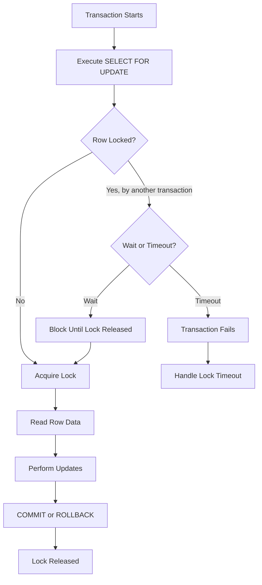
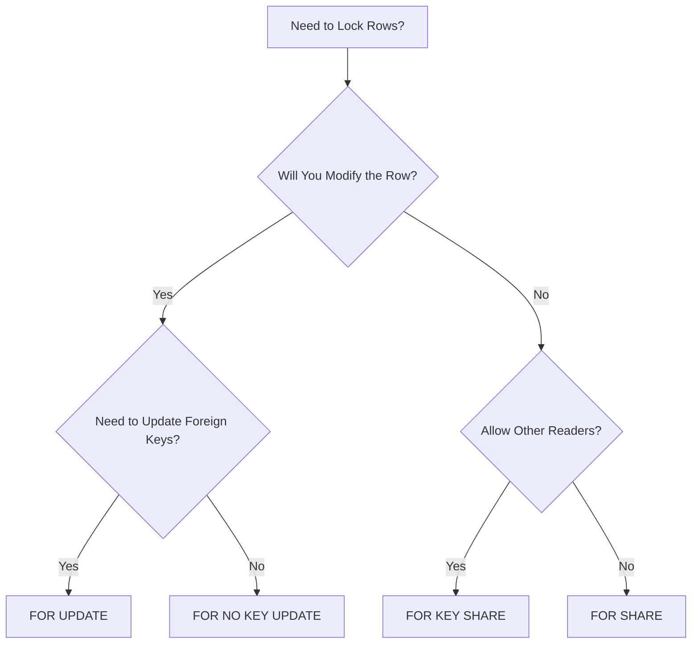
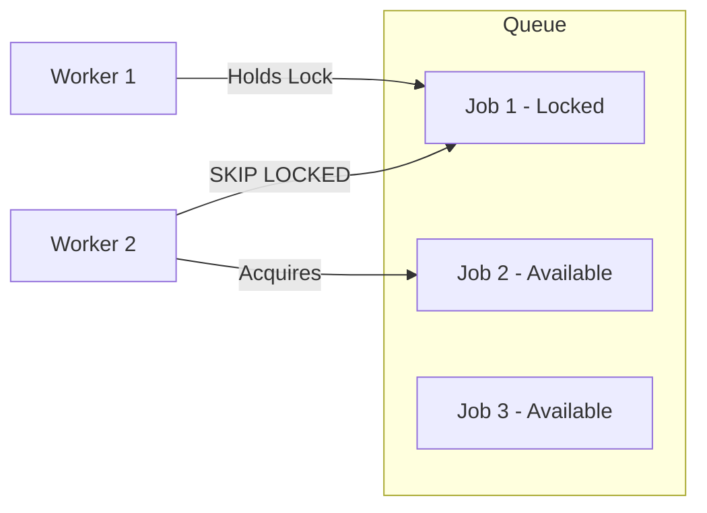
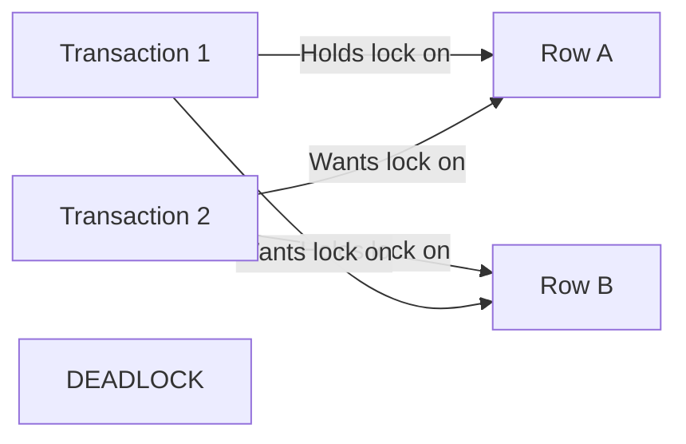

# How to Build Pessimistic Locking Implementation

Author: [nawazdhandala](https://github.com/nawazdhandala)

Tags: Database, Locking, Concurrency, Transactions

Description: A practical guide to implementing pessimistic locking in your database layer using SELECT FOR UPDATE, covering lock modes, escalation patterns, and timeout handling.

---

When multiple transactions compete for the same rows, you have two choices: let them race and reconcile conflicts later (optimistic), or make them wait in line (pessimistic). This guide covers the pessimistic approach, which is the right call when conflicts are frequent and retries are expensive.

## When to Use Pessimistic Locking

Pessimistic locking works best when:

- Conflicts are frequent (more than 10% of transactions touch the same rows)
- Retry logic is complex or expensive
- External side effects are involved (payments, notifications)
- Consistency is more important than throughput

If conflicts are rare and retries are cheap, optimistic locking with version columns is simpler. But for high-contention scenarios like inventory systems, financial transactions, or booking platforms, pessimistic locking prevents wasted work.

## Lock Acquisition Flow



## Basic SELECT FOR UPDATE Syntax

### PostgreSQL

```sql
-- Acquire exclusive lock on selected rows
BEGIN;

SELECT * FROM inventory
WHERE product_id = 1001
FOR UPDATE;

-- Other transactions trying to SELECT FOR UPDATE on the same row will block
-- Other transactions can still read with a regular SELECT

UPDATE inventory
SET quantity = quantity - 1
WHERE product_id = 1001;

COMMIT;
```

### MySQL (InnoDB)

```sql
-- Start transaction explicitly
START TRANSACTION;

SELECT * FROM inventory
WHERE product_id = 1001
FOR UPDATE;

-- Perform your updates
UPDATE inventory
SET quantity = quantity - 1
WHERE product_id = 1001;

COMMIT;
```

The row stays locked from the moment the SELECT FOR UPDATE executes until the transaction commits or rolls back.

## Lock Modes Explained

Different situations call for different lock strengths. Most databases support multiple lock modes.

### PostgreSQL Lock Modes

| Lock Mode | Syntax | Use Case |
|-----------|--------|----------|
| FOR UPDATE | `SELECT ... FOR UPDATE` | Exclusive lock, blocks all other locks |
| FOR NO KEY UPDATE | `SELECT ... FOR NO KEY UPDATE` | Exclusive lock, but allows FOR KEY SHARE |
| FOR SHARE | `SELECT ... FOR SHARE` | Shared lock, blocks FOR UPDATE but allows other FOR SHARE |
| FOR KEY SHARE | `SELECT ... FOR KEY SHARE` | Weakest lock, only blocks FOR UPDATE |

```sql
-- Shared lock: multiple readers, no writers
BEGIN;
SELECT * FROM accounts WHERE id = 100 FOR SHARE;
-- Other transactions can also SELECT FOR SHARE
-- But SELECT FOR UPDATE will block

-- Exclusive lock: one writer, blocks everyone
BEGIN;
SELECT * FROM accounts WHERE id = 100 FOR UPDATE;
-- No other transaction can lock this row until we commit
```

### MySQL Lock Modes

| Lock Mode | Syntax | Use Case |
|-----------|--------|----------|
| FOR UPDATE | `SELECT ... FOR UPDATE` | Exclusive lock |
| FOR SHARE | `SELECT ... FOR SHARE` | Shared lock (MySQL 8.0+) |
| LOCK IN SHARE MODE | `SELECT ... LOCK IN SHARE MODE` | Shared lock (older syntax) |

```sql
-- MySQL shared lock
START TRANSACTION;
SELECT * FROM orders WHERE order_id = 500 FOR SHARE;

-- MySQL exclusive lock
START TRANSACTION;
SELECT * FROM orders WHERE order_id = 500 FOR UPDATE;
```

## Lock Mode Selection Flow



## Timeout Handling

Waiting forever for a lock is rarely acceptable. Configure timeouts to fail fast.

### PostgreSQL Timeout Configuration

```sql
-- Set lock timeout for current session (5 seconds)
SET lock_timeout = '5s';

-- Or set it for a specific transaction
BEGIN;
SET LOCAL lock_timeout = '5s';

SELECT * FROM inventory
WHERE product_id = 1001
FOR UPDATE;
-- If lock cannot be acquired within 5 seconds, throws:
-- ERROR: canceling statement due to lock timeout

COMMIT;
```

### MySQL Timeout Configuration

```sql
-- Set lock wait timeout for current session (5 seconds)
SET innodb_lock_wait_timeout = 5;

START TRANSACTION;

SELECT * FROM inventory
WHERE product_id = 1001
FOR UPDATE;
-- If lock cannot be acquired within 5 seconds, throws:
-- ERROR 1205 (HY000): Lock wait timeout exceeded

COMMIT;
```

### Handling Timeouts in Application Code

```typescript
import { Pool, PoolClient } from 'pg';

const pool = new Pool();

async function reserveInventory(productId: number, quantity: number): Promise<boolean> {
  const client = await pool.connect();

  try {
    await client.query('BEGIN');
    await client.query('SET LOCAL lock_timeout = \'5s\'');

    // Try to acquire lock
    const result = await client.query(
      `SELECT quantity FROM inventory
       WHERE product_id = $1
       FOR UPDATE`,
      [productId]
    );

    if (result.rows.length === 0) {
      await client.query('ROLLBACK');
      return false;
    }

    const currentQuantity = result.rows[0].quantity;

    if (currentQuantity < quantity) {
      await client.query('ROLLBACK');
      return false;
    }

    await client.query(
      `UPDATE inventory
       SET quantity = quantity - $1
       WHERE product_id = $2`,
      [quantity, productId]
    );

    await client.query('COMMIT');
    return true;

  } catch (error: any) {
    await client.query('ROLLBACK');

    if (error.code === '55P03') {
      // Lock timeout - another transaction holds the lock
      console.error('Lock timeout: could not acquire row lock');
      throw new Error('Resource busy, please retry');
    }

    throw error;
  } finally {
    client.release();
  }
}
```

## NOWAIT and SKIP LOCKED Options

Sometimes you want to fail immediately or skip locked rows instead of waiting.

### NOWAIT: Fail Immediately

```sql
-- PostgreSQL
BEGIN;
SELECT * FROM inventory
WHERE product_id = 1001
FOR UPDATE NOWAIT;
-- Throws error immediately if row is locked:
-- ERROR: could not obtain lock on row in relation "inventory"
COMMIT;

-- MySQL 8.0+
START TRANSACTION;
SELECT * FROM inventory
WHERE product_id = 1001
FOR UPDATE NOWAIT;
-- ERROR 3572: Statement aborted because lock(s) could not be acquired
COMMIT;
```

### SKIP LOCKED: Process Available Rows

Perfect for job queues where workers grab whatever is available.

```sql
-- PostgreSQL: Get next available job, skip locked ones
BEGIN;

SELECT * FROM job_queue
WHERE status = 'pending'
ORDER BY created_at
LIMIT 1
FOR UPDATE SKIP LOCKED;

-- Process the job...

UPDATE job_queue
SET status = 'completed'
WHERE id = <job_id>;

COMMIT;
```



## Lock Escalation Patterns

When locking many rows, consider the performance implications.

### Row-Level vs Table-Level Locks

```sql
-- Row-level: locks only specific rows
SELECT * FROM orders
WHERE customer_id = 100
FOR UPDATE;

-- Table-level: locks entire table (PostgreSQL)
LOCK TABLE orders IN EXCLUSIVE MODE;

-- Table-level: locks entire table (MySQL)
LOCK TABLES orders WRITE;
```

### Avoiding Lock Escalation

Most databases will escalate from row locks to table locks when too many rows are locked. To prevent this:

1. **Lock fewer rows**: Use specific WHERE clauses
2. **Process in batches**: Lock 100 rows at a time, not 10,000
3. **Keep transactions short**: Lock, update, commit quickly

```sql
-- Bad: locks many rows for a long time
BEGIN;
SELECT * FROM orders
WHERE status = 'pending'
FOR UPDATE;
-- Process all orders (might take minutes)
COMMIT;

-- Better: process in small batches
BEGIN;
SELECT * FROM orders
WHERE status = 'pending'
ORDER BY id
LIMIT 100
FOR UPDATE;
-- Process batch quickly
COMMIT;
-- Repeat for next batch
```

## Deadlock Prevention

Two transactions waiting for each other's locks creates a deadlock. The database detects this and kills one transaction.



### Prevention Strategies

**1. Lock in Consistent Order**

```sql
-- Always lock rows in the same order (e.g., by ID ascending)
BEGIN;

-- Lock accounts in ID order, not arbitrary order
SELECT * FROM accounts
WHERE id IN (100, 50, 75)
ORDER BY id
FOR UPDATE;

COMMIT;
```

**2. Use Lock Timeouts**

```sql
SET lock_timeout = '5s';
-- Transaction will fail instead of waiting forever
```

**3. Acquire All Locks Upfront**

```sql
BEGIN;

-- Lock all needed rows at once
SELECT * FROM accounts
WHERE id IN (100, 200)
FOR UPDATE;

-- Now perform all operations
UPDATE accounts SET balance = balance - 50 WHERE id = 100;
UPDATE accounts SET balance = balance + 50 WHERE id = 200;

COMMIT;
```

### Handling Deadlocks in Code

```typescript
async function transferFunds(
  fromAccountId: number,
  toAccountId: number,
  amount: number
): Promise<void> {
  const maxRetries = 3;

  for (let attempt = 1; attempt <= maxRetries; attempt++) {
    try {
      await executeTransfer(fromAccountId, toAccountId, amount);
      return;
    } catch (error: any) {
      // PostgreSQL deadlock error code
      if (error.code === '40P01' && attempt < maxRetries) {
        // Exponential backoff before retry
        await sleep(Math.pow(2, attempt) * 100);
        continue;
      }
      throw error;
    }
  }
}

async function executeTransfer(
  fromId: number,
  toId: number,
  amount: number
): Promise<void> {
  const client = await pool.connect();

  try {
    await client.query('BEGIN');

    // Lock in consistent order (lower ID first)
    const [firstId, secondId] = fromId < toId
      ? [fromId, toId]
      : [toId, fromId];

    await client.query(
      `SELECT id FROM accounts WHERE id IN ($1, $2) ORDER BY id FOR UPDATE`,
      [firstId, secondId]
    );

    await client.query(
      'UPDATE accounts SET balance = balance - $1 WHERE id = $2',
      [amount, fromId]
    );

    await client.query(
      'UPDATE accounts SET balance = balance + $1 WHERE id = $2',
      [amount, toId]
    );

    await client.query('COMMIT');
  } catch (error) {
    await client.query('ROLLBACK');
    throw error;
  } finally {
    client.release();
  }
}
```

## Monitoring Lock Contention

### PostgreSQL: View Current Locks

```sql
-- See all current locks
SELECT
  l.locktype,
  l.relation::regclass,
  l.mode,
  l.granted,
  l.pid,
  a.query
FROM pg_locks l
JOIN pg_stat_activity a ON l.pid = a.pid
WHERE l.relation IS NOT NULL
ORDER BY l.relation;

-- Find blocked queries
SELECT
  blocked.pid AS blocked_pid,
  blocked.query AS blocked_query,
  blocking.pid AS blocking_pid,
  blocking.query AS blocking_query
FROM pg_stat_activity blocked
JOIN pg_locks blocked_locks ON blocked.pid = blocked_locks.pid
JOIN pg_locks blocking_locks ON blocked_locks.locktype = blocking_locks.locktype
  AND blocked_locks.relation = blocking_locks.relation
  AND blocked_locks.pid != blocking_locks.pid
JOIN pg_stat_activity blocking ON blocking_locks.pid = blocking.pid
WHERE NOT blocked_locks.granted;
```

### MySQL: View Current Locks

```sql
-- InnoDB lock waits
SELECT * FROM information_schema.INNODB_LOCK_WAITS;

-- Current transactions and their locks
SELECT
  trx_id,
  trx_state,
  trx_started,
  trx_wait_started,
  trx_mysql_thread_id,
  trx_query
FROM information_schema.INNODB_TRX;

-- Performance schema for lock analysis (MySQL 8.0+)
SELECT * FROM performance_schema.data_locks;
```

## Best Practices Summary

| Practice | Why |
|----------|-----|
| Keep transactions short | Reduces lock hold time |
| Lock in consistent order | Prevents deadlocks |
| Use appropriate lock modes | FOR SHARE when you only read |
| Set lock timeouts | Fail fast instead of blocking forever |
| Use SKIP LOCKED for queues | Workers process available items |
| Monitor lock contention | Identify bottlenecks early |
| Lock only what you need | Specific WHERE clauses, not full scans |

## When to Avoid Pessimistic Locking

Pessimistic locking is not always the answer. Consider alternatives when:

- **Low conflict rate**: Optimistic locking with version columns is simpler
- **Read-heavy workloads**: Row-level locks add overhead for readers
- **Distributed systems**: Cross-database locks are complex, consider saga patterns
- **Long transactions**: Holding locks for minutes blocks other users

---

Pessimistic locking gives you predictable, serialized access to contested resources. The key is keeping transactions short, locking in consistent order, and failing fast with timeouts. Start with the basics (SELECT FOR UPDATE with a timeout), monitor for contention, and adjust lock modes as you learn your workload patterns.
