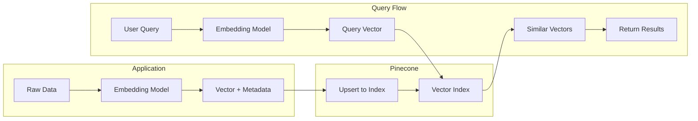
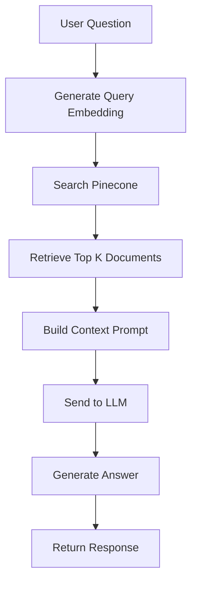

# How to Implement Pinecone Integration

Author: [nawazdhandala](https://github.com/nawazdhandala)

Tags: Vector Database, Pinecone, AI, RAG

Description: A practical guide to integrating Pinecone vector database into your applications for semantic search, recommendation systems, and retrieval-augmented generation (RAG) pipelines.

---

Vector databases have become essential infrastructure for AI-powered applications. Pinecone is a managed vector database that handles the complexity of similarity search at scale, letting you focus on building features instead of managing infrastructure.

This guide walks through setting up Pinecone, indexing data, performing similarity searches, and building a complete RAG (Retrieval-Augmented Generation) pipeline.

## Why Use Pinecone?

Before diving into implementation, here is when Pinecone makes sense:

| Use Case | How Pinecone Helps |
|----------|-------------------|
| Semantic search | Find documents by meaning, not just keywords |
| Recommendations | Surface similar items based on user behavior or content |
| RAG applications | Retrieve relevant context for LLM prompts |
| Anomaly detection | Identify outliers in high-dimensional data |
| Deduplication | Find near-duplicate content at scale |

Traditional databases use exact matching. Vector databases use similarity, which is critical when working with embeddings from language models, images, or other unstructured data.

---

## Architecture Overview

Here is how a typical Pinecone integration fits into an application:



The flow is straightforward:
1. Convert your data into vectors using an embedding model
2. Store vectors with metadata in Pinecone
3. At query time, convert the query to a vector and find similar items

---

## Setting Up Pinecone

### Installation

Install the Pinecone client library.

```bash
npm install @pinecone-database/pinecone
```

For Python projects:

```bash
pip install pinecone-client
```

### Initialize the Client

Create a reusable client instance. The API key comes from your Pinecone dashboard.

```typescript
// pinecone.ts
import { Pinecone } from '@pinecone-database/pinecone';

// Initialize the Pinecone client with your API key
// Store the API key in environment variables, never in code
const pinecone = new Pinecone({
  apiKey: process.env.PINECONE_API_KEY!,
});

export default pinecone;
```

### Create an Index

Indexes are where your vectors live. Choose the dimension to match your embedding model (OpenAI's text-embedding-ada-002 uses 1536 dimensions).

```typescript
// create-index.ts
import pinecone from './pinecone';

async function createIndex() {
  const indexName = 'documents';

  // Check if index already exists
  const existingIndexes = await pinecone.listIndexes();
  const indexExists = existingIndexes.indexes?.some(
    (idx) => idx.name === indexName
  );

  if (indexExists) {
    console.log(`Index "${indexName}" already exists`);
    return;
  }

  // Create a new index
  // dimension: must match your embedding model output size
  // metric: cosine works well for normalized embeddings
  // spec: serverless is the simplest deployment option
  await pinecone.createIndex({
    name: indexName,
    dimension: 1536,
    metric: 'cosine',
    spec: {
      serverless: {
        cloud: 'aws',
        region: 'us-east-1',
      },
    },
  });

  console.log(`Index "${indexName}" created successfully`);
}

createIndex();
```

---

## Generating Embeddings

You need an embedding model to convert text into vectors. OpenAI's embedding API is a common choice.

```typescript
// embeddings.ts
import OpenAI from 'openai';

const openai = new OpenAI({
  apiKey: process.env.OPENAI_API_KEY,
});

// Generate embeddings for a single text or array of texts
// Batching multiple texts in one call is more efficient
export async function generateEmbeddings(
  texts: string[]
): Promise<number[][]> {
  const response = await openai.embeddings.create({
    model: 'text-embedding-ada-002',
    input: texts,
  });

  // Extract the embedding vectors from the response
  // Each embedding is a 1536-dimensional array of floats
  return response.data.map((item) => item.embedding);
}

// Convenience function for single text
export async function generateEmbedding(text: string): Promise<number[]> {
  const embeddings = await generateEmbeddings([text]);
  return embeddings[0];
}
```

---

## Indexing Data

### Basic Upsert

Upsert combines insert and update. If a vector with the same ID exists, it gets updated.

```typescript
// index-documents.ts
import pinecone from './pinecone';
import { generateEmbedding } from './embeddings';

interface Document {
  id: string;
  content: string;
  metadata: Record<string, any>;
}

// Index a single document
// The metadata is stored alongside the vector for filtering and retrieval
export async function indexDocument(doc: Document) {
  const index = pinecone.index('documents');

  // Generate embedding from document content
  const embedding = await generateEmbedding(doc.content);

  // Upsert the vector with its metadata
  // id: unique identifier for this vector
  // values: the embedding array
  // metadata: any additional data you want to store
  await index.upsert([
    {
      id: doc.id,
      values: embedding,
      metadata: {
        content: doc.content,
        ...doc.metadata,
      },
    },
  ]);
}
```

### Batch Upsert

For bulk indexing, batch your upserts to reduce API calls and improve throughput.

```typescript
// batch-index.ts
import pinecone from './pinecone';
import { generateEmbeddings } from './embeddings';

interface Document {
  id: string;
  content: string;
  metadata: Record<string, any>;
}

// Index multiple documents efficiently
// Pinecone recommends batches of 100-200 vectors
const BATCH_SIZE = 100;

export async function indexDocuments(documents: Document[]) {
  const index = pinecone.index('documents');

  // Process documents in batches
  for (let i = 0; i < documents.length; i += BATCH_SIZE) {
    const batch = documents.slice(i, i + BATCH_SIZE);

    // Generate embeddings for all documents in this batch
    // This is more efficient than one embedding call per document
    const contents = batch.map((doc) => doc.content);
    const embeddings = await generateEmbeddings(contents);

    // Prepare vectors for upsert
    const vectors = batch.map((doc, idx) => ({
      id: doc.id,
      values: embeddings[idx],
      metadata: {
        content: doc.content,
        ...doc.metadata,
      },
    }));

    // Upsert the batch
    await index.upsert(vectors);

    console.log(
      `Indexed ${Math.min(i + BATCH_SIZE, documents.length)}/${documents.length} documents`
    );
  }
}
```

---

## Querying the Index

### Basic Similarity Search

Query returns the most similar vectors to your query vector.

```typescript
// search.ts
import pinecone from './pinecone';
import { generateEmbedding } from './embeddings';

interface SearchResult {
  id: string;
  score: number;
  content: string;
  metadata: Record<string, any>;
}

// Search for documents similar to the query text
// topK: number of results to return
// Returns results sorted by similarity (highest first)
export async function search(
  query: string,
  topK: number = 10
): Promise<SearchResult[]> {
  const index = pinecone.index('documents');

  // Convert query text to embedding vector
  const queryEmbedding = await generateEmbedding(query);

  // Query Pinecone for similar vectors
  // includeMetadata: true returns the stored metadata with results
  const results = await index.query({
    vector: queryEmbedding,
    topK,
    includeMetadata: true,
  });

  // Transform results into a cleaner format
  return results.matches.map((match) => ({
    id: match.id,
    score: match.score || 0,
    content: match.metadata?.content as string,
    metadata: match.metadata || {},
  }));
}
```

### Filtered Search

Use metadata filters to narrow results. This is essential for multi-tenant applications or when you need to search within a specific category.

```typescript
// filtered-search.ts
import pinecone from './pinecone';
import { generateEmbedding } from './embeddings';

interface FilteredSearchOptions {
  query: string;
  topK?: number;
  filters?: Record<string, any>;
}

// Search with metadata filters
// Filters use MongoDB-style query syntax
export async function filteredSearch({
  query,
  topK = 10,
  filters = {},
}: FilteredSearchOptions) {
  const index = pinecone.index('documents');
  const queryEmbedding = await generateEmbedding(query);

  // Build the filter object
  // Supports $eq, $ne, $gt, $gte, $lt, $lte, $in, $nin
  const results = await index.query({
    vector: queryEmbedding,
    topK,
    includeMetadata: true,
    filter: filters,
  });

  return results.matches;
}

// Example: Search only within a specific tenant
async function searchForTenant(tenantId: string, query: string) {
  return filteredSearch({
    query,
    filters: {
      tenantId: { $eq: tenantId },
    },
  });
}

// Example: Search within a date range and category
async function searchWithFilters(query: string) {
  return filteredSearch({
    query,
    filters: {
      $and: [
        { category: { $in: ['engineering', 'product'] } },
        { createdAt: { $gte: '2024-01-01' } },
        { isPublished: { $eq: true } },
      ],
    },
  });
}
```

---

## Building a RAG Pipeline

RAG (Retrieval-Augmented Generation) combines vector search with LLM generation to answer questions using your own data.



### Complete RAG Implementation

```typescript
// rag.ts
import pinecone from './pinecone';
import { generateEmbedding } from './embeddings';
import OpenAI from 'openai';

const openai = new OpenAI({
  apiKey: process.env.OPENAI_API_KEY,
});

interface RAGResponse {
  answer: string;
  sources: Array<{
    id: string;
    content: string;
    score: number;
  }>;
}

// Main RAG function
// 1. Retrieves relevant context from Pinecone
// 2. Builds a prompt with the context
// 3. Generates an answer using the LLM
export async function askQuestion(question: string): Promise<RAGResponse> {
  const index = pinecone.index('documents');

  // Step 1: Convert question to embedding and search
  const queryEmbedding = await generateEmbedding(question);

  const searchResults = await index.query({
    vector: queryEmbedding,
    topK: 5,
    includeMetadata: true,
  });

  // Step 2: Extract context from search results
  // Filter out low-scoring results to avoid noise
  const relevantDocs = searchResults.matches.filter(
    (match) => (match.score || 0) > 0.7
  );

  const context = relevantDocs
    .map((doc) => doc.metadata?.content)
    .join('\n\n---\n\n');

  // Step 3: Build the prompt with retrieved context
  const systemPrompt = `You are a helpful assistant that answers questions based on the provided context.
If the context does not contain enough information to answer the question, say so.
Always cite which parts of the context you used to form your answer.`;

  const userPrompt = `Context:
${context}

Question: ${question}

Answer the question based on the context above.`;

  // Step 4: Generate answer using the LLM
  const completion = await openai.chat.completions.create({
    model: 'gpt-4',
    messages: [
      { role: 'system', content: systemPrompt },
      { role: 'user', content: userPrompt },
    ],
    temperature: 0.7,
    max_tokens: 1000,
  });

  // Return the answer along with sources for transparency
  return {
    answer: completion.choices[0].message.content || '',
    sources: relevantDocs.map((doc) => ({
      id: doc.id,
      content: doc.metadata?.content as string,
      score: doc.score || 0,
    })),
  };
}
```

### Streaming RAG Response

For better UX, stream the response as it generates.

```typescript
// streaming-rag.ts
import pinecone from './pinecone';
import { generateEmbedding } from './embeddings';
import OpenAI from 'openai';

const openai = new OpenAI({
  apiKey: process.env.OPENAI_API_KEY,
});

// Generator function that yields answer chunks as they arrive
// Use this for real-time streaming to the client
export async function* streamAnswer(
  question: string
): AsyncGenerator<string, void, unknown> {
  const index = pinecone.index('documents');

  // Retrieve context (same as before)
  const queryEmbedding = await generateEmbedding(question);
  const searchResults = await index.query({
    vector: queryEmbedding,
    topK: 5,
    includeMetadata: true,
  });

  const context = searchResults.matches
    .filter((match) => (match.score || 0) > 0.7)
    .map((doc) => doc.metadata?.content)
    .join('\n\n---\n\n');

  // Stream the completion
  const stream = await openai.chat.completions.create({
    model: 'gpt-4',
    messages: [
      {
        role: 'system',
        content: 'Answer questions based on the provided context.',
      },
      {
        role: 'user',
        content: `Context:\n${context}\n\nQuestion: ${question}`,
      },
    ],
    stream: true,
  });

  // Yield each chunk as it arrives
  for await (const chunk of stream) {
    const content = chunk.choices[0]?.delta?.content;
    if (content) {
      yield content;
    }
  }
}

// Express route handler example
import express from 'express';
const app = express();

app.get('/api/ask', async (req, res) => {
  const question = req.query.q as string;

  res.setHeader('Content-Type', 'text/event-stream');
  res.setHeader('Cache-Control', 'no-cache');
  res.setHeader('Connection', 'keep-alive');

  for await (const chunk of streamAnswer(question)) {
    res.write(`data: ${JSON.stringify({ text: chunk })}\n\n`);
  }

  res.write('data: [DONE]\n\n');
  res.end();
});
```

---

## Namespaces for Multi-Tenancy

Namespaces let you partition data within an index. This is useful for multi-tenant applications where each tenant's data should be isolated.

```typescript
// namespaced-operations.ts
import pinecone from './pinecone';
import { generateEmbedding, generateEmbeddings } from './embeddings';

// Index documents into a specific namespace
// Each tenant gets their own namespace for data isolation
export async function indexForTenant(
  tenantId: string,
  documents: Array<{ id: string; content: string; metadata: Record<string, any> }>
) {
  // Access the index with a specific namespace
  const index = pinecone.index('documents').namespace(tenantId);

  const contents = documents.map((doc) => doc.content);
  const embeddings = await generateEmbeddings(contents);

  const vectors = documents.map((doc, idx) => ({
    id: doc.id,
    values: embeddings[idx],
    metadata: {
      content: doc.content,
      ...doc.metadata,
    },
  }));

  await index.upsert(vectors);
}

// Search within a tenant's namespace
// Results are automatically scoped to that tenant
export async function searchForTenant(
  tenantId: string,
  query: string,
  topK: number = 10
) {
  const index = pinecone.index('documents').namespace(tenantId);
  const queryEmbedding = await generateEmbedding(query);

  const results = await index.query({
    vector: queryEmbedding,
    topK,
    includeMetadata: true,
  });

  return results.matches;
}

// Delete all data for a tenant
// Useful when a tenant leaves your platform
export async function deleteTenantData(tenantId: string) {
  const index = pinecone.index('documents').namespace(tenantId);

  // Delete all vectors in the namespace
  await index.deleteAll();
}
```

---

## Managing Index Lifecycle

### Update and Delete Operations

```typescript
// manage-vectors.ts
import pinecone from './pinecone';
import { generateEmbedding } from './embeddings';

const index = pinecone.index('documents');

// Update a document's content and re-embed
export async function updateDocument(
  id: string,
  newContent: string,
  metadata: Record<string, any>
) {
  const embedding = await generateEmbedding(newContent);

  // Upsert overwrites the existing vector
  await index.upsert([
    {
      id,
      values: embedding,
      metadata: {
        content: newContent,
        ...metadata,
        updatedAt: new Date().toISOString(),
      },
    },
  ]);
}

// Delete a single document by ID
export async function deleteDocument(id: string) {
  await index.deleteOne(id);
}

// Delete multiple documents by ID
export async function deleteDocuments(ids: string[]) {
  await index.deleteMany(ids);
}

// Delete documents matching a filter
export async function deleteByFilter(filter: Record<string, any>) {
  await index.deleteMany({ filter });
}

// Get index statistics
export async function getIndexStats() {
  const stats = await index.describeIndexStats();

  return {
    totalVectors: stats.totalRecordCount,
    namespaces: stats.namespaces,
    dimension: stats.dimension,
  };
}
```

---

## Error Handling and Retries

Production code needs robust error handling.

```typescript
// resilient-client.ts
import pinecone from './pinecone';
import { generateEmbedding } from './embeddings';

// Retry configuration
const MAX_RETRIES = 3;
const INITIAL_DELAY_MS = 1000;

// Generic retry wrapper with exponential backoff
async function withRetry<T>(
  operation: () => Promise<T>,
  operationName: string
): Promise<T> {
  let lastError: Error | null = null;

  for (let attempt = 1; attempt <= MAX_RETRIES; attempt++) {
    try {
      return await operation();
    } catch (error: any) {
      lastError = error;

      // Do not retry on client errors (4xx)
      if (error.status && error.status >= 400 && error.status < 500) {
        throw error;
      }

      // Calculate delay with exponential backoff
      const delay = INITIAL_DELAY_MS * Math.pow(2, attempt - 1);

      console.warn(
        `${operationName} failed (attempt ${attempt}/${MAX_RETRIES}), ` +
        `retrying in ${delay}ms: ${error.message}`
      );

      await new Promise((resolve) => setTimeout(resolve, delay));
    }
  }

  throw lastError;
}

// Resilient search function
export async function resilientSearch(query: string, topK: number = 10) {
  return withRetry(async () => {
    const index = pinecone.index('documents');
    const queryEmbedding = await generateEmbedding(query);

    return index.query({
      vector: queryEmbedding,
      topK,
      includeMetadata: true,
    });
  }, 'Pinecone search');
}

// Resilient upsert with chunking for large batches
export async function resilientUpsert(
  vectors: Array<{ id: string; values: number[]; metadata: Record<string, any> }>
) {
  const index = pinecone.index('documents');
  const CHUNK_SIZE = 100;

  for (let i = 0; i < vectors.length; i += CHUNK_SIZE) {
    const chunk = vectors.slice(i, i + CHUNK_SIZE);

    await withRetry(
      () => index.upsert(chunk),
      `Pinecone upsert (chunk ${Math.floor(i / CHUNK_SIZE) + 1})`
    );
  }
}
```

---

## Performance Optimization

### Parallel Embedding Generation

When indexing large datasets, parallelize embedding generation.

```typescript
// parallel-embeddings.ts
import { generateEmbeddings } from './embeddings';

// Process embeddings in parallel batches
// OpenAI allows batches of up to 2048 texts
const EMBEDDING_BATCH_SIZE = 100;
const PARALLEL_BATCHES = 5;

export async function generateEmbeddingsParallel(
  texts: string[]
): Promise<number[][]> {
  const results: number[][] = new Array(texts.length);

  // Split into batches
  const batches: { texts: string[]; startIdx: number }[] = [];
  for (let i = 0; i < texts.length; i += EMBEDDING_BATCH_SIZE) {
    batches.push({
      texts: texts.slice(i, i + EMBEDDING_BATCH_SIZE),
      startIdx: i,
    });
  }

  // Process batches in parallel groups
  for (let i = 0; i < batches.length; i += PARALLEL_BATCHES) {
    const parallelBatches = batches.slice(i, i + PARALLEL_BATCHES);

    const embeddings = await Promise.all(
      parallelBatches.map((batch) => generateEmbeddings(batch.texts))
    );

    // Place results in correct positions
    embeddings.forEach((batchEmbeddings, batchIdx) => {
      const startIdx = parallelBatches[batchIdx].startIdx;
      batchEmbeddings.forEach((embedding, idx) => {
        results[startIdx + idx] = embedding;
      });
    });
  }

  return results;
}
```

### Connection Pooling

Reuse connections for better performance.

```typescript
// pooled-client.ts
import { Pinecone, Index } from '@pinecone-database/pinecone';

class PineconePool {
  private client: Pinecone;
  private indexes: Map<string, Index> = new Map();

  constructor() {
    this.client = new Pinecone({
      apiKey: process.env.PINECONE_API_KEY!,
    });
  }

  // Get or create an index reference
  // Index references are reused across calls
  getIndex(name: string, namespace?: string): Index {
    const key = namespace ? `${name}:${namespace}` : name;

    if (!this.indexes.has(key)) {
      const index = namespace
        ? this.client.index(name).namespace(namespace)
        : this.client.index(name);
      this.indexes.set(key, index);
    }

    return this.indexes.get(key)!;
  }
}

export const pineconePool = new PineconePool();
```

---

## Monitoring and Observability

Track your Pinecone usage with custom metrics.

```typescript
// metrics.ts
import { metrics } from '@opentelemetry/api';

const meter = metrics.getMeter('pinecone-client');

// Create metrics for tracking Pinecone operations
const queryLatency = meter.createHistogram('pinecone_query_duration_ms', {
  description: 'Pinecone query latency in milliseconds',
  unit: 'ms',
});

const queryResultCount = meter.createHistogram('pinecone_query_results', {
  description: 'Number of results returned from queries',
});

const upsertCount = meter.createCounter('pinecone_upserts_total', {
  description: 'Total vectors upserted',
});

const errorCount = meter.createCounter('pinecone_errors_total', {
  description: 'Total Pinecone operation errors',
});

// Instrumented query function
export async function instrumentedQuery(
  index: any,
  queryVector: number[],
  options: { topK: number; filter?: Record<string, any> }
) {
  const startTime = Date.now();
  const labels = { index: index.name };

  try {
    const results = await index.query({
      vector: queryVector,
      ...options,
      includeMetadata: true,
    });

    // Record metrics
    queryLatency.record(Date.now() - startTime, labels);
    queryResultCount.record(results.matches.length, labels);

    return results;
  } catch (error) {
    errorCount.add(1, { ...labels, operation: 'query' });
    throw error;
  }
}

// Instrumented upsert function
export async function instrumentedUpsert(
  index: any,
  vectors: Array<{ id: string; values: number[]; metadata: Record<string, any> }>
) {
  const labels = { index: index.name };

  try {
    await index.upsert(vectors);
    upsertCount.add(vectors.length, labels);
  } catch (error) {
    errorCount.add(1, { ...labels, operation: 'upsert' });
    throw error;
  }
}
```

---

## Common Patterns

### Hybrid Search

Combine vector similarity with keyword matching.

```typescript
// hybrid-search.ts
import pinecone from './pinecone';
import { generateEmbedding } from './embeddings';

interface HybridSearchOptions {
  query: string;
  keywords?: string[];
  topK?: number;
}

// Hybrid search combines semantic similarity with keyword filters
// Use this when users expect certain keywords to be present
export async function hybridSearch({
  query,
  keywords = [],
  topK = 10,
}: HybridSearchOptions) {
  const index = pinecone.index('documents');
  const queryEmbedding = await generateEmbedding(query);

  // Build filter for keyword presence
  // Assumes keywords are stored in metadata
  const filter = keywords.length > 0
    ? {
        $or: keywords.map((kw) => ({
          keywords: { $in: [kw.toLowerCase()] },
        })),
      }
    : undefined;

  const results = await index.query({
    vector: queryEmbedding,
    topK: topK * 2, // Fetch more to account for filtering
    includeMetadata: true,
    filter,
  });

  return results.matches.slice(0, topK);
}
```

### Caching Embeddings

Cache embeddings to avoid redundant API calls.

```typescript
// cached-embeddings.ts
import { generateEmbedding } from './embeddings';
import crypto from 'crypto';

// Simple in-memory cache (use Redis in production)
const embeddingCache = new Map<string, number[]>();

// Generate a hash for cache key
function hashText(text: string): string {
  return crypto.createHash('sha256').update(text).digest('hex');
}

// Get embedding with caching
// Reduces API calls for repeated queries
export async function getCachedEmbedding(text: string): Promise<number[]> {
  const cacheKey = hashText(text);

  if (embeddingCache.has(cacheKey)) {
    return embeddingCache.get(cacheKey)!;
  }

  const embedding = await generateEmbedding(text);
  embeddingCache.set(cacheKey, embedding);

  return embedding;
}

// Clear cache (call periodically or on memory pressure)
export function clearEmbeddingCache() {
  embeddingCache.clear();
}
```

---

## Summary

| Component | Purpose |
|-----------|---------|
| **Index** | Container for vectors with specific dimension and metric |
| **Namespace** | Partition within an index for multi-tenancy |
| **Upsert** | Insert or update vectors with metadata |
| **Query** | Find similar vectors by cosine/euclidean/dotproduct similarity |
| **Filter** | Narrow query results using metadata conditions |
| **RAG** | Combine retrieval with LLM generation for Q&A |

Pinecone handles the infrastructure complexity of similarity search, letting you focus on your application logic. Start with the basic patterns above, then optimize as your scale grows.

---

**Related Reading:**

- [Traces and Spans in OpenTelemetry](https://oneuptime.com/blog/post/2025-08-27-traces-and-spans-in-opentelemetry/view)
- [How to Structure Logs Properly in OpenTelemetry](https://oneuptime.com/blog/post/2025-08-28-how-to-structure-logs-properly-in-opentelemetry/view)

