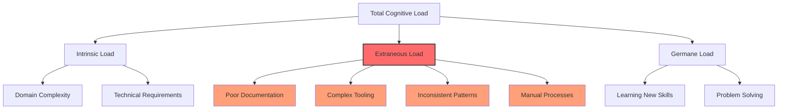
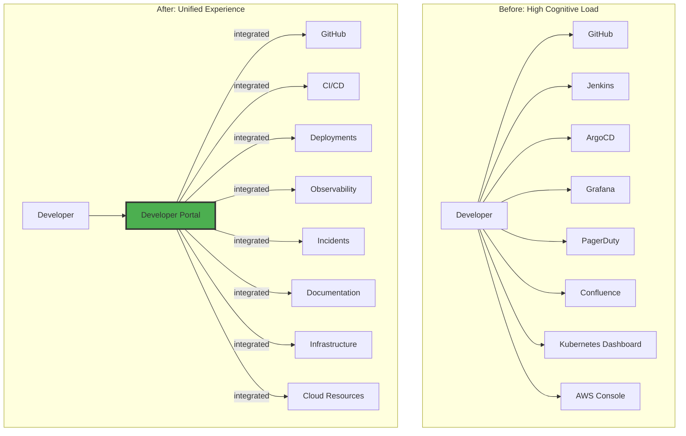
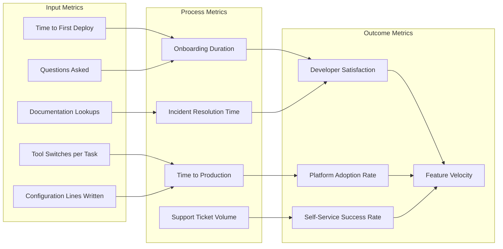

# How to Implement Cognitive Load Reduction

Author: [nawazdhandala](https://github.com/nawazdhandala)

Tags: Platform Engineering, Cognitive Load, Developer Experience, Productivity

Description: Learn to implement cognitive load reduction for simplifying developer workflows and reducing complexity.

---

Cognitive load in software development refers to the mental effort required to understand, navigate, and operate within a system. For platform engineers, reducing cognitive load is not just about making things easier; it is about enabling developers to focus on delivering value rather than fighting infrastructure complexity. This guide provides practical strategies, code examples, and measurement approaches for implementing cognitive load reduction in your platform engineering practice.

## Understanding Cognitive Load in Platform Engineering

Cognitive load can be categorized into three types:

1. **Intrinsic Load**: The inherent complexity of the task itself
2. **Extraneous Load**: Unnecessary complexity introduced by poor design or tooling
3. **Germane Load**: The mental effort dedicated to learning and problem-solving

As platform engineers, our goal is to minimize extraneous load while preserving the necessary intrinsic load and optimizing germane load for skill development.



## Strategy 1: Create Golden Paths with Self-Service Templates

Golden paths are opinionated, well-supported ways for developers to accomplish common tasks. They reduce cognitive load by providing tested, documented patterns.

### Implementation: Service Template System

```yaml
# golden-path-templates/microservice/template.yaml
# This template defines a standard microservice structure
# that includes all necessary boilerplate and configurations

apiVersion: scaffolder.backstage.io/v1beta3
kind: Template
metadata:
  name: microservice-template
  title: Standard Microservice
  description: |
    Creates a production-ready microservice with built-in observability,
    CI/CD pipelines, and infrastructure configuration.
  tags:
    - recommended
    - microservice
    - golang
spec:
  owner: platform-team
  type: service

  # Parameters define what developers need to provide
  # Keep this minimal to reduce decision fatigue
  parameters:
    - title: Service Configuration
      required:
        - serviceName
        - team
      properties:
        serviceName:
          title: Service Name
          type: string
          description: Name of the microservice (lowercase, alphanumeric, hyphens only)
          pattern: '^[a-z][a-z0-9-]*$'
          maxLength: 63
        team:
          title: Owning Team
          type: string
          description: The team responsible for this service
          enum:
            - payments
            - orders
            - inventory
            - customer
        tier:
          title: Service Tier
          type: string
          description: Criticality tier for SLO targets
          default: standard
          enum:
            - critical    # 99.99% availability target
            - standard    # 99.9% availability target
            - best-effort # 99% availability target

  steps:
    # Step 1: Generate the service code from the template
    - id: fetch-base
      name: Fetch Base Template
      action: fetch:template
      input:
        url: ./skeleton
        values:
          serviceName: ${{ parameters.serviceName }}
          team: ${{ parameters.team }}
          tier: ${{ parameters.tier }}

    # Step 2: Create the GitHub repository
    - id: publish
      name: Create Repository
      action: publish:github
      input:
        allowedHosts: ['github.com']
        repoUrl: github.com?owner=myorg&repo=${{ parameters.serviceName }}
        defaultBranch: main

    # Step 3: Register in the service catalog
    - id: register
      name: Register in Catalog
      action: catalog:register
      input:
        repoContentsUrl: ${{ steps.publish.output.repoContentsUrl }}
        catalogInfoPath: '/catalog-info.yaml'

    # Step 4: Create infrastructure resources
    - id: create-infra
      name: Provision Infrastructure
      action: http:backstage:request
      input:
        method: POST
        path: /api/infrastructure/provision
        body:
          serviceName: ${{ parameters.serviceName }}
          team: ${{ parameters.team }}
          tier: ${{ parameters.tier }}
```

### Generated Service Structure

```plaintext
# The template generates this standardized structure
# Every developer knows exactly where to find things

my-service/
├── cmd/
│   └── server/
│       └── main.go           # Entry point with standard initialization
├── internal/
│   ├── handler/              # HTTP/gRPC handlers
│   ├── service/              # Business logic
│   └── repository/           # Data access
├── pkg/
│   └── client/               # Generated client library
├── api/
│   └── openapi.yaml          # API specification
├── deploy/
│   ├── kubernetes/           # K8s manifests
│   └── terraform/            # Infrastructure as Code
├── .github/
│   └── workflows/            # CI/CD pipelines (pre-configured)
├── Dockerfile                # Optimized multi-stage build
├── Makefile                  # Standard commands
├── catalog-info.yaml         # Service catalog entry
└── README.md                 # Auto-generated documentation
```

## Strategy 2: Implement Platform Abstractions

Abstractions hide infrastructure complexity while maintaining flexibility for advanced use cases.

### Kubernetes Abstraction Layer

```yaml
# platform-abstractions/workload-crd.yaml
# This Custom Resource Definition provides a simplified interface
# for deploying applications without requiring deep Kubernetes knowledge

apiVersion: apiextensions.k8s.io/v1
kind: CustomResourceDefinition
metadata:
  name: workloads.platform.myorg.com
spec:
  group: platform.myorg.com
  versions:
    - name: v1
      served: true
      storage: true
      schema:
        openAPIV3Schema:
          type: object
          properties:
            spec:
              type: object
              required:
                - image
                - port
              properties:
                # Simple, developer-friendly configuration
                image:
                  type: string
                  description: Container image to deploy
                port:
                  type: integer
                  description: Port the application listens on
                  minimum: 1
                  maximum: 65535
                replicas:
                  type: integer
                  description: Number of instances (auto-scaled if not set)
                  minimum: 1
                  maximum: 100
                resources:
                  type: string
                  description: Resource profile (small, medium, large, xlarge)
                  enum: [small, medium, large, xlarge]
                  default: small
                scaling:
                  type: object
                  properties:
                    enabled:
                      type: boolean
                      default: true
                    minReplicas:
                      type: integer
                      default: 2
                    maxReplicas:
                      type: integer
                      default: 10
                    targetCPU:
                      type: integer
                      default: 70
                exposure:
                  type: string
                  description: How the service is exposed
                  enum: [internal, external, none]
                  default: internal
  scope: Namespaced
  names:
    plural: workloads
    singular: workload
    kind: Workload
    shortNames:
      - wl
```

### Workload Controller Implementation

```go
// controllers/workload_controller.go
// This controller translates simple Workload specs into
// the complex Kubernetes resources they represent

package controllers

import (
    "context"
    "fmt"

    platformv1 "github.com/myorg/platform-operator/api/v1"
    appsv1 "k8s.io/api/apps/v1"
    autoscalingv2 "k8s.io/api/autoscaling/v2"
    corev1 "k8s.io/api/core/v1"
    networkingv1 "k8s.io/api/networking/v1"
    "k8s.io/apimachinery/pkg/api/resource"
    metav1 "k8s.io/apimachinery/pkg/apis/meta/v1"
    ctrl "sigs.k8s.io/controller-runtime"
    "sigs.k8s.io/controller-runtime/pkg/client"
)

// ResourceProfiles define standard resource allocations
// Developers choose a profile instead of calculating exact values
var ResourceProfiles = map[string]corev1.ResourceRequirements{
    "small": {
        Requests: corev1.ResourceList{
            corev1.ResourceCPU:    resource.MustParse("100m"),
            corev1.ResourceMemory: resource.MustParse("128Mi"),
        },
        Limits: corev1.ResourceList{
            corev1.ResourceCPU:    resource.MustParse("500m"),
            corev1.ResourceMemory: resource.MustParse("512Mi"),
        },
    },
    "medium": {
        Requests: corev1.ResourceList{
            corev1.ResourceCPU:    resource.MustParse("250m"),
            corev1.ResourceMemory: resource.MustParse("512Mi"),
        },
        Limits: corev1.ResourceList{
            corev1.ResourceCPU:    resource.MustParse("1000m"),
            corev1.ResourceMemory: resource.MustParse("1Gi"),
        },
    },
    "large": {
        Requests: corev1.ResourceList{
            corev1.ResourceCPU:    resource.MustParse("500m"),
            corev1.ResourceMemory: resource.MustParse("1Gi"),
        },
        Limits: corev1.ResourceList{
            corev1.ResourceCPU:    resource.MustParse("2000m"),
            corev1.ResourceMemory: resource.MustParse("2Gi"),
        },
    },
    "xlarge": {
        Requests: corev1.ResourceList{
            corev1.ResourceCPU:    resource.MustParse("1000m"),
            corev1.ResourceMemory: resource.MustParse("2Gi"),
        },
        Limits: corev1.ResourceList{
            corev1.ResourceCPU:    resource.MustParse("4000m"),
            corev1.ResourceMemory: resource.MustParse("4Gi"),
        },
    },
}

// WorkloadReconciler manages the lifecycle of Workload resources
type WorkloadReconciler struct {
    client.Client
    Scheme *runtime.Scheme
}

// Reconcile transforms a simple Workload into production-ready Kubernetes resources
// This is where we hide complexity from developers
func (r *WorkloadReconciler) Reconcile(ctx context.Context, req ctrl.Request) (ctrl.Result, error) {
    // Fetch the Workload resource
    var workload platformv1.Workload
    if err := r.Get(ctx, req.NamespacedName, &workload); err != nil {
        return ctrl.Result{}, client.IgnoreNotFound(err)
    }

    // Generate all required Kubernetes resources from the simple spec
    // Developers write 20 lines; we generate 200+ lines of best-practice config

    // 1. Create the Deployment with all production-ready settings
    deployment := r.buildDeployment(&workload)
    if err := r.createOrUpdate(ctx, deployment); err != nil {
        return ctrl.Result{}, err
    }

    // 2. Create the Service for network access
    service := r.buildService(&workload)
    if err := r.createOrUpdate(ctx, service); err != nil {
        return ctrl.Result{}, err
    }

    // 3. Configure autoscaling if enabled
    if workload.Spec.Scaling.Enabled {
        hpa := r.buildHPA(&workload)
        if err := r.createOrUpdate(ctx, hpa); err != nil {
            return ctrl.Result{}, err
        }
    }

    // 4. Create Ingress for external exposure
    if workload.Spec.Exposure == "external" {
        ingress := r.buildIngress(&workload)
        if err := r.createOrUpdate(ctx, ingress); err != nil {
            return ctrl.Result{}, err
        }
    }

    // 5. Create PodDisruptionBudget for high availability
    pdb := r.buildPDB(&workload)
    if err := r.createOrUpdate(ctx, pdb); err != nil {
        return ctrl.Result{}, err
    }

    return ctrl.Result{}, nil
}

// buildDeployment creates a production-ready Deployment
// with all best practices baked in
func (r *WorkloadReconciler) buildDeployment(w *platformv1.Workload) *appsv1.Deployment {
    // Get resource profile or default to small
    resources := ResourceProfiles[w.Spec.Resources]
    if resources.Requests == nil {
        resources = ResourceProfiles["small"]
    }

    // Calculate initial replicas
    replicas := int32(2)
    if w.Spec.Replicas > 0 {
        replicas = int32(w.Spec.Replicas)
    }

    return &appsv1.Deployment{
        ObjectMeta: metav1.ObjectMeta{
            Name:      w.Name,
            Namespace: w.Namespace,
            Labels:    r.standardLabels(w),
        },
        Spec: appsv1.DeploymentSpec{
            Replicas: &replicas,
            Selector: &metav1.LabelSelector{
                MatchLabels: r.standardLabels(w),
            },
            // Rolling update strategy for zero-downtime deployments
            Strategy: appsv1.DeploymentStrategy{
                Type: appsv1.RollingUpdateDeploymentStrategyType,
                RollingUpdate: &appsv1.RollingUpdateDeployment{
                    MaxSurge:       intOrStrPtr(1),
                    MaxUnavailable: intOrStrPtr(0),
                },
            },
            Template: corev1.PodTemplateSpec{
                ObjectMeta: metav1.ObjectMeta{
                    Labels: r.standardLabels(w),
                    Annotations: map[string]string{
                        // Enable Prometheus scraping automatically
                        "prometheus.io/scrape": "true",
                        "prometheus.io/port":   fmt.Sprintf("%d", w.Spec.Port),
                        "prometheus.io/path":   "/metrics",
                    },
                },
                Spec: corev1.PodSpec{
                    // Security context with least privilege
                    SecurityContext: &corev1.PodSecurityContext{
                        RunAsNonRoot: boolPtr(true),
                        FSGroup:      int64Ptr(65534),
                    },
                    Containers: []corev1.Container{
                        {
                            Name:      "app",
                            Image:     w.Spec.Image,
                            Resources: resources,
                            Ports: []corev1.ContainerPort{
                                {
                                    Name:          "http",
                                    ContainerPort: int32(w.Spec.Port),
                                },
                            },
                            // Standard health checks
                            LivenessProbe: &corev1.Probe{
                                ProbeHandler: corev1.ProbeHandler{
                                    HTTPGet: &corev1.HTTPGetAction{
                                        Path: "/health/live",
                                        Port: intstr.FromInt(w.Spec.Port),
                                    },
                                },
                                InitialDelaySeconds: 10,
                                PeriodSeconds:       10,
                            },
                            ReadinessProbe: &corev1.Probe{
                                ProbeHandler: corev1.ProbeHandler{
                                    HTTPGet: &corev1.HTTPGetAction{
                                        Path: "/health/ready",
                                        Port: intstr.FromInt(w.Spec.Port),
                                    },
                                },
                                InitialDelaySeconds: 5,
                                PeriodSeconds:       5,
                            },
                            // Container security settings
                            SecurityContext: &corev1.SecurityContext{
                                ReadOnlyRootFilesystem:   boolPtr(true),
                                AllowPrivilegeEscalation: boolPtr(false),
                                Capabilities: &corev1.Capabilities{
                                    Drop: []corev1.Capability{"ALL"},
                                },
                            },
                        },
                    },
                    // Spread pods across nodes and zones
                    TopologySpreadConstraints: []corev1.TopologySpreadConstraint{
                        {
                            MaxSkew:           1,
                            TopologyKey:       "topology.kubernetes.io/zone",
                            WhenUnsatisfiable: corev1.ScheduleAnyway,
                            LabelSelector: &metav1.LabelSelector{
                                MatchLabels: r.standardLabels(w),
                            },
                        },
                    },
                },
            },
        },
    }
}

// standardLabels returns consistent labels for all resources
func (r *WorkloadReconciler) standardLabels(w *platformv1.Workload) map[string]string {
    return map[string]string{
        "app.kubernetes.io/name":       w.Name,
        "app.kubernetes.io/managed-by": "platform-operator",
        "platform.myorg.com/workload":  w.Name,
    }
}
```

## Strategy 3: Consolidate Tooling with a Developer Portal

A developer portal serves as a single entry point, eliminating the need to remember multiple systems.



### Portal API Implementation

```typescript
// portal-backend/src/services/unified-service-view.ts
// This service aggregates data from multiple sources into a single view
// Developers get everything they need without context switching

import { ServiceInfo, Deployment, Metrics, Incident } from '../types';

interface UnifiedServiceView {
  service: ServiceInfo;
  deployments: DeploymentInfo[];
  metrics: ServiceMetrics;
  incidents: IncidentInfo[];
  dependencies: DependencyInfo[];
  documentation: DocLink[];
  runbooks: RunbookLink[];
}

export class UnifiedServiceViewService {
  // Inject all the data source clients
  constructor(
    private catalogClient: CatalogClient,
    private deploymentClient: DeploymentClient,
    private metricsClient: MetricsClient,
    private incidentClient: IncidentClient,
    private documentationClient: DocumentationClient
  ) {}

  /**
   * Fetches all relevant information about a service in a single call.
   * This eliminates the need for developers to query multiple systems.
   */
  async getServiceView(serviceName: string): Promise<UnifiedServiceView> {
    // Fetch all data in parallel for performance
    const [
      service,
      deployments,
      metrics,
      incidents,
      dependencies,
      documentation,
      runbooks
    ] = await Promise.all([
      this.catalogClient.getService(serviceName),
      this.deploymentClient.getRecentDeployments(serviceName, { limit: 10 }),
      this.metricsClient.getServiceMetrics(serviceName),
      this.incidentClient.getActiveIncidents(serviceName),
      this.catalogClient.getServiceDependencies(serviceName),
      this.documentationClient.getServiceDocs(serviceName),
      this.documentationClient.getRunbooks(serviceName)
    ]);

    // Calculate service health score based on multiple factors
    const healthScore = this.calculateHealthScore(metrics, incidents);

    // Enrich deployment info with rollback safety analysis
    const enrichedDeployments = deployments.map(d => ({
      ...d,
      rollbackSafe: this.isRollbackSafe(d, deployments),
      deployedBy: d.triggeredBy,
      duration: this.calculateDeploymentDuration(d)
    }));

    return {
      service: {
        ...service,
        healthScore,
        ownerTeam: service.owner,
        slackChannel: service.metadata?.slackChannel,
        tier: service.metadata?.tier || 'standard'
      },
      deployments: enrichedDeployments,
      metrics: this.formatMetricsForDisplay(metrics),
      incidents: incidents.map(i => this.enrichIncident(i)),
      dependencies,
      documentation,
      runbooks
    };
  }

  /**
   * Calculates a simple health score from 0 to 100.
   * This provides a quick understanding of service status
   * without requiring deep metric analysis.
   */
  private calculateHealthScore(
    metrics: RawMetrics,
    incidents: Incident[]
  ): number {
    let score = 100;

    // Deduct points for error rate
    if (metrics.errorRate > 0.01) {
      score -= Math.min(30, metrics.errorRate * 1000);
    }

    // Deduct points for high latency
    if (metrics.p99Latency > 500) {
      score -= Math.min(20, (metrics.p99Latency - 500) / 50);
    }

    // Deduct points for active incidents
    const criticalIncidents = incidents.filter(i => i.severity === 'critical');
    score -= criticalIncidents.length * 25;

    const majorIncidents = incidents.filter(i => i.severity === 'major');
    score -= majorIncidents.length * 10;

    return Math.max(0, Math.round(score));
  }

  /**
   * Determines if a deployment can be safely rolled back.
   * This saves developers from having to analyze deployment history.
   */
  private isRollbackSafe(
    deployment: Deployment,
    allDeployments: Deployment[]
  ): boolean {
    // Find the previous successful deployment
    const previousDeployments = allDeployments
      .filter(d => d.completedAt < deployment.completedAt)
      .filter(d => d.status === 'success');

    if (previousDeployments.length === 0) {
      return false;
    }

    const previousDeployment = previousDeployments[0];

    // Check if there were database migrations
    if (deployment.metadata?.hasMigrations) {
      return false;
    }

    // Check if the previous version is still in the artifact registry
    return previousDeployment.artifactAvailable;
  }
}
```

## Strategy 4: Implement Smart Defaults and Progressive Disclosure

Show only what developers need, when they need it. Hide complexity until it is required.

```yaml
# platform-config/smart-defaults.yaml
# This configuration defines sensible defaults for all services
# Developers only override what they need to change

apiVersion: v1
kind: ConfigMap
metadata:
  name: platform-defaults
  namespace: platform-system
data:
  # Default configuration applied to all services
  # These values represent production best practices
  defaults.yaml: |
    deployment:
      replicas: 2
      strategy: RollingUpdate
      maxSurge: 1
      maxUnavailable: 0
      progressDeadlineSeconds: 600

    resources:
      profile: small  # Maps to predefined resource allocations

    autoscaling:
      enabled: true
      minReplicas: 2
      maxReplicas: 10
      targetCPUUtilization: 70
      targetMemoryUtilization: 80
      scaleDownStabilization: 300  # Prevent flapping

    networking:
      exposure: internal
      timeout: 30s
      retries: 3
      circuitBreaker:
        enabled: true
        threshold: 5
        timeout: 30s

    observability:
      metrics:
        enabled: true
        path: /metrics
        port: auto  # Uses main container port
      tracing:
        enabled: true
        samplingRate: 0.1
      logging:
        format: json
        level: info

    security:
      runAsNonRoot: true
      readOnlyRootFilesystem: true
      allowPrivilegeEscalation: false
      networkPolicy: restrictive

    reliability:
      podDisruptionBudget:
        minAvailable: 50%
      terminationGracePeriod: 30s
      livenessProbe:
        path: /health/live
        initialDelay: 10
        period: 10
      readinessProbe:
        path: /health/ready
        initialDelay: 5
        period: 5
```

### Progressive Disclosure CLI

```python
#!/usr/bin/env python3
"""
Platform CLI with progressive disclosure.

This CLI shows simple commands by default and reveals
advanced options only when explicitly requested.
"""

import click
from typing import Optional
import yaml

# Simple mode: Essential options only
# Advanced mode: Full control when needed

@click.group()
@click.option('--advanced', '-a', is_flag=True,
              help='Show advanced options')
@click.pass_context
def cli(ctx, advanced: bool):
    """Platform CLI for deploying and managing services.

    By default, shows simplified commands with smart defaults.
    Use --advanced to see all available options.
    """
    ctx.ensure_object(dict)
    ctx.obj['advanced'] = advanced


@cli.command()
@click.argument('service_name')
@click.option('--image', '-i', required=True,
              help='Container image to deploy')
# Simple options - always visible
@click.option('--env', '-e', default='staging',
              type=click.Choice(['staging', 'production']),
              help='Target environment')
# Advanced options - hidden by default
@click.option('--replicas', type=int, default=None,
              hidden=True,
              help='[Advanced] Number of replicas (default: auto-scaled)')
@click.option('--resources', type=click.Choice(['small', 'medium', 'large', 'xlarge']),
              default=None, hidden=True,
              help='[Advanced] Resource profile')
@click.option('--skip-canary', is_flag=True, default=False,
              hidden=True,
              help='[Advanced] Skip canary deployment phase')
@click.option('--rollout-duration', type=int, default=None,
              hidden=True,
              help='[Advanced] Rollout duration in minutes')
@click.pass_context
def deploy(ctx, service_name: str, image: str, env: str,
           replicas: Optional[int], resources: Optional[str],
           skip_canary: bool, rollout_duration: Optional[int]):
    """Deploy a service to the platform.

    Examples:

      # Simple deployment (uses all defaults)
      platform deploy my-service --image myorg/my-service:v1.2.3

      # Production deployment
      platform deploy my-service --image myorg/my-service:v1.2.3 --env production

      # Advanced usage (show all options with -a flag)
      platform -a deploy --help
    """
    # Build deployment configuration
    config = {
        'service': service_name,
        'image': image,
        'environment': env,
    }

    # Only include advanced options if explicitly set
    if replicas is not None:
        config['replicas'] = replicas
    if resources is not None:
        config['resources'] = resources
    if skip_canary:
        config['skipCanary'] = True
    if rollout_duration is not None:
        config['rolloutDuration'] = rollout_duration

    # Show what will be deployed
    click.echo(f"Deploying {service_name} to {env}...")

    if ctx.obj.get('advanced'):
        click.echo("\nFull configuration:")
        click.echo(yaml.dump(config, default_flow_style=False))
    else:
        click.echo(f"  Image: {image}")
        click.echo(f"  Environment: {env}")
        click.echo("\n  (Use -a flag to see full configuration)")

    # Execute deployment
    result = execute_deployment(config)

    # Show simplified status
    click.echo(f"\n{click.style('Success!', fg='green')} Deployment initiated.")
    click.echo(f"  Dashboard: https://platform.myorg.com/services/{service_name}")
    click.echo(f"  Logs: https://platform.myorg.com/services/{service_name}/logs")


@cli.command()
@click.argument('service_name')
@click.pass_context
def status(ctx, service_name: str):
    """Check service status with a simplified view.

    Shows the most important information at a glance.
    """
    # Fetch service data
    service = get_service_status(service_name)

    # Always show the essential information
    click.echo(f"\n{service_name}")
    click.echo("=" * 40)

    # Health indicator with color coding
    health_color = {
        'healthy': 'green',
        'degraded': 'yellow',
        'unhealthy': 'red'
    }.get(service['health'], 'white')

    click.echo(f"Health:     {click.style(service['health'].upper(), fg=health_color)}")
    click.echo(f"Version:    {service['version']}")
    click.echo(f"Replicas:   {service['readyReplicas']}/{service['desiredReplicas']}")

    # Show advanced details only in advanced mode
    if ctx.obj.get('advanced'):
        click.echo(f"\nDetailed Metrics:")
        click.echo(f"  Request Rate:  {service['requestRate']}/s")
        click.echo(f"  Error Rate:    {service['errorRate']}%")
        click.echo(f"  P50 Latency:   {service['p50Latency']}ms")
        click.echo(f"  P99 Latency:   {service['p99Latency']}ms")
        click.echo(f"  CPU Usage:     {service['cpuUsage']}%")
        click.echo(f"  Memory Usage:  {service['memoryUsage']}%")
        click.echo(f"\nRecent Events:")
        for event in service['events'][:5]:
            click.echo(f"  {event['timestamp']} - {event['message']}")
    else:
        click.echo("\n(Use -a flag for detailed metrics)")


if __name__ == '__main__':
    cli()
```

## Strategy 5: Automate Routine Decisions

Remove decisions that can be safely automated to preserve mental energy for important choices.

```yaml
# automation/auto-scaling-policies.yaml
# Predefined scaling policies based on service tier
# Developers choose a tier; we handle the complexity

apiVersion: platform.myorg.com/v1
kind: ScalingPolicy
metadata:
  name: standard-scaling-policies
spec:
  policies:
    # Critical services: aggressive scaling, high availability
    - tier: critical
      scaling:
        minReplicas: 3
        maxReplicas: 100
        metrics:
          - type: Resource
            resource:
              name: cpu
              target:
                type: Utilization
                averageUtilization: 50  # Scale early
          - type: Resource
            resource:
              name: memory
              target:
                type: Utilization
                averageUtilization: 60
        behavior:
          scaleUp:
            stabilizationWindowSeconds: 0  # Immediate scale up
            policies:
              - type: Percent
                value: 100  # Double capacity quickly
                periodSeconds: 15
          scaleDown:
            stabilizationWindowSeconds: 600  # Wait 10 min before scale down
            policies:
              - type: Percent
                value: 10  # Scale down slowly
                periodSeconds: 60

    # Standard services: balanced approach
    - tier: standard
      scaling:
        minReplicas: 2
        maxReplicas: 20
        metrics:
          - type: Resource
            resource:
              name: cpu
              target:
                type: Utilization
                averageUtilization: 70
        behavior:
          scaleUp:
            stabilizationWindowSeconds: 30
            policies:
              - type: Percent
                value: 50
                periodSeconds: 30
          scaleDown:
            stabilizationWindowSeconds: 300
            policies:
              - type: Percent
                value: 20
                periodSeconds: 60

    # Best-effort services: cost-optimized
    - tier: best-effort
      scaling:
        minReplicas: 1
        maxReplicas: 10
        metrics:
          - type: Resource
            resource:
              name: cpu
              target:
                type: Utilization
                averageUtilization: 80
        behavior:
          scaleUp:
            stabilizationWindowSeconds: 60
            policies:
              - type: Pods
                value: 2
                periodSeconds: 60
          scaleDown:
            stabilizationWindowSeconds: 120
            policies:
              - type: Percent
                value: 50
                periodSeconds: 60
```

## Strategy 6: Measuring Cognitive Load Reduction

You cannot improve what you do not measure. Track these metrics to validate your efforts.



### Metrics Collection System

```python
# metrics/cognitive_load_metrics.py
"""
Cognitive Load Metrics Collection System

This module collects and analyzes metrics related to cognitive load
in the developer experience. These metrics help platform teams
understand where developers struggle and measure improvement over time.
"""

from dataclasses import dataclass
from datetime import datetime, timedelta
from typing import List, Optional
import statistics
from enum import Enum


class MetricCategory(Enum):
    """Categories of cognitive load metrics."""
    TIME_BASED = "time_based"
    INTERACTION_BASED = "interaction_based"
    SATISFACTION_BASED = "satisfaction_based"
    ADOPTION_BASED = "adoption_based"


@dataclass
class CognitiveLoadMetrics:
    """Container for all cognitive load related metrics."""

    # Time-based metrics (lower is better)
    time_to_first_deploy_minutes: float
    time_to_first_pr_minutes: float
    onboarding_completion_days: float
    incident_resolution_minutes: float

    # Interaction metrics (lower is better)
    support_tickets_per_developer_per_month: float
    documentation_searches_per_task: float
    tool_switches_per_workflow: float
    configuration_lines_per_service: int

    # Satisfaction metrics (higher is better)
    developer_satisfaction_score: float  # 1-10 scale
    platform_nps: int  # -100 to 100
    self_service_success_rate: float  # 0-1

    # Adoption metrics (higher is better)
    golden_path_adoption_rate: float  # 0-1
    automation_usage_rate: float  # 0-1
    portal_daily_active_users: int


class CognitiveLoadAnalyzer:
    """
    Analyzes cognitive load metrics and provides insights.

    This class helps platform teams understand the impact of their
    work on developer cognitive load.
    """

    def __init__(self, metrics_store: MetricsStore):
        self.metrics_store = metrics_store

    def calculate_cognitive_load_score(
        self,
        team: Optional[str] = None,
        time_range: Optional[timedelta] = None
    ) -> dict:
        """
        Calculates an overall cognitive load score for the platform.

        Returns a score from 0 to 100 where:
        - 0-30: High cognitive load (needs immediate attention)
        - 31-60: Moderate cognitive load (room for improvement)
        - 61-80: Low cognitive load (good developer experience)
        - 81-100: Minimal cognitive load (excellent)
        """
        metrics = self.metrics_store.get_metrics(team, time_range)

        # Weight each category
        weights = {
            'time_efficiency': 0.30,
            'interaction_simplicity': 0.25,
            'developer_satisfaction': 0.25,
            'platform_adoption': 0.20
        }

        # Calculate time efficiency score (0-100)
        time_score = self._calculate_time_score(metrics)

        # Calculate interaction simplicity score (0-100)
        interaction_score = self._calculate_interaction_score(metrics)

        # Calculate satisfaction score (0-100)
        satisfaction_score = self._calculate_satisfaction_score(metrics)

        # Calculate adoption score (0-100)
        adoption_score = self._calculate_adoption_score(metrics)

        # Weighted average
        total_score = (
            time_score * weights['time_efficiency'] +
            interaction_score * weights['interaction_simplicity'] +
            satisfaction_score * weights['developer_satisfaction'] +
            adoption_score * weights['platform_adoption']
        )

        return {
            'overall_score': round(total_score, 1),
            'breakdown': {
                'time_efficiency': round(time_score, 1),
                'interaction_simplicity': round(interaction_score, 1),
                'developer_satisfaction': round(satisfaction_score, 1),
                'platform_adoption': round(adoption_score, 1)
            },
            'interpretation': self._interpret_score(total_score),
            'recommendations': self._generate_recommendations(
                time_score, interaction_score,
                satisfaction_score, adoption_score
            )
        }

    def _calculate_time_score(self, metrics: CognitiveLoadMetrics) -> float:
        """
        Converts time-based metrics to a 0-100 score.

        Benchmarks:
        - Time to first deploy: Excellent < 30min, Poor > 4h
        - Onboarding: Excellent < 3 days, Poor > 2 weeks
        - Incident resolution: Excellent < 30min, Poor > 4h
        """
        deploy_score = self._normalize_inverse(
            metrics.time_to_first_deploy_minutes,
            excellent=30, poor=240
        )

        onboarding_score = self._normalize_inverse(
            metrics.onboarding_completion_days,
            excellent=3, poor=14
        )

        incident_score = self._normalize_inverse(
            metrics.incident_resolution_minutes,
            excellent=30, poor=240
        )

        return statistics.mean([deploy_score, onboarding_score, incident_score])

    def _calculate_interaction_score(self, metrics: CognitiveLoadMetrics) -> float:
        """
        Converts interaction metrics to a 0-100 score.

        Lower interaction counts indicate simpler workflows.
        """
        ticket_score = self._normalize_inverse(
            metrics.support_tickets_per_developer_per_month,
            excellent=0.5, poor=5
        )

        doc_search_score = self._normalize_inverse(
            metrics.documentation_searches_per_task,
            excellent=1, poor=10
        )

        tool_switch_score = self._normalize_inverse(
            metrics.tool_switches_per_workflow,
            excellent=1, poor=8
        )

        config_score = self._normalize_inverse(
            metrics.configuration_lines_per_service,
            excellent=20, poor=500
        )

        return statistics.mean([
            ticket_score, doc_search_score,
            tool_switch_score, config_score
        ])

    def _calculate_satisfaction_score(self, metrics: CognitiveLoadMetrics) -> float:
        """
        Converts satisfaction metrics to a 0-100 score.
        """
        # Satisfaction is on 1-10 scale, convert to 0-100
        satisfaction = (metrics.developer_satisfaction_score - 1) / 9 * 100

        # NPS is -100 to 100, convert to 0-100
        nps = (metrics.platform_nps + 100) / 2

        # Self-service success is already 0-1, convert to 0-100
        self_service = metrics.self_service_success_rate * 100

        return statistics.mean([satisfaction, nps, self_service])

    def _calculate_adoption_score(self, metrics: CognitiveLoadMetrics) -> float:
        """
        Converts adoption metrics to a 0-100 score.
        """
        golden_path = metrics.golden_path_adoption_rate * 100
        automation = metrics.automation_usage_rate * 100

        return statistics.mean([golden_path, automation])

    def _normalize_inverse(
        self,
        value: float,
        excellent: float,
        poor: float
    ) -> float:
        """
        Normalizes a metric where lower is better to a 0-100 scale.
        """
        if value <= excellent:
            return 100
        if value >= poor:
            return 0

        # Linear interpolation
        range_size = poor - excellent
        distance_from_excellent = value - excellent
        return 100 - (distance_from_excellent / range_size * 100)

    def _interpret_score(self, score: float) -> str:
        """
        Provides a human-readable interpretation of the score.
        """
        if score >= 81:
            return "Excellent - Minimal cognitive load. Developers can focus on delivering value."
        elif score >= 61:
            return "Good - Low cognitive load. Some areas could be simplified further."
        elif score >= 31:
            return "Moderate - Noticeable cognitive load. Consider prioritizing improvements."
        else:
            return "High - Significant cognitive load. Developers may be struggling with complexity."

    def _generate_recommendations(
        self,
        time_score: float,
        interaction_score: float,
        satisfaction_score: float,
        adoption_score: float
    ) -> List[str]:
        """
        Generates actionable recommendations based on scores.
        """
        recommendations = []

        if time_score < 60:
            recommendations.append(
                "Reduce time to first deploy by implementing service templates "
                "and automating environment setup."
            )

        if interaction_score < 60:
            recommendations.append(
                "Consolidate tools into a unified developer portal to reduce "
                "context switching and simplify workflows."
            )

        if satisfaction_score < 60:
            recommendations.append(
                "Conduct developer interviews to identify specific pain points "
                "and prioritize high-impact improvements."
            )

        if adoption_score < 60:
            recommendations.append(
                "Improve golden path documentation and demonstrate clear "
                "benefits to increase adoption rates."
            )

        if not recommendations:
            recommendations.append(
                "Continue monitoring metrics and gathering feedback to "
                "maintain the current excellent developer experience."
            )

        return recommendations
```

## Practical Implementation Checklist

Use this checklist to guide your cognitive load reduction initiative:

```markdown
## Phase 1: Assessment (Weeks 1-2)

- [ ] Survey developers about their biggest pain points
- [ ] Map current developer workflows and identify friction
- [ ] Inventory all tools developers must use
- [ ] Measure baseline metrics (time to deploy, support tickets, etc.)
- [ ] Identify top 3 sources of cognitive load

## Phase 2: Quick Wins (Weeks 3-4)

- [ ] Implement smart defaults for common configurations
- [ ] Create a single page with links to all developer tools
- [ ] Write a "getting started" guide for new developers
- [ ] Automate one manual process that affects many developers
- [ ] Set up basic metrics collection

## Phase 3: Foundation (Weeks 5-8)

- [ ] Design and implement platform abstractions
- [ ] Create first golden path template
- [ ] Build unified service view in developer portal
- [ ] Implement progressive disclosure in CLI tools
- [ ] Document escape hatches for advanced users

## Phase 4: Iteration (Ongoing)

- [ ] Collect feedback every 2 weeks
- [ ] Review metrics monthly
- [ ] Add new golden path templates based on demand
- [ ] Refine abstractions based on usage patterns
- [ ] Share success stories to drive adoption
```

## Conclusion

Reducing cognitive load is an ongoing journey, not a destination. The key principles to remember are:

1. **Provide sensible defaults** so developers only configure what they need to change
2. **Create abstractions** that hide complexity while preserving flexibility
3. **Consolidate tools** into unified interfaces to reduce context switching
4. **Automate decisions** that can be safely automated
5. **Measure continuously** to validate improvements and identify new opportunities

By systematically applying these strategies, platform engineering teams can create environments where developers spend less time fighting infrastructure and more time delivering value to users.

## Further Reading

- Team Topologies by Matthew Skelton and Manuel Pais
- Platform Engineering on Kubernetes by Mauricio Salatino
- The DevEx Framework by Abi Noda, Margaret-Anne Storey, and Nicole Forsgren
- Backstage.io documentation on software templates
- CNCF Platforms White Paper
